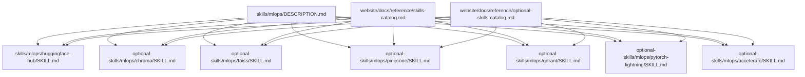
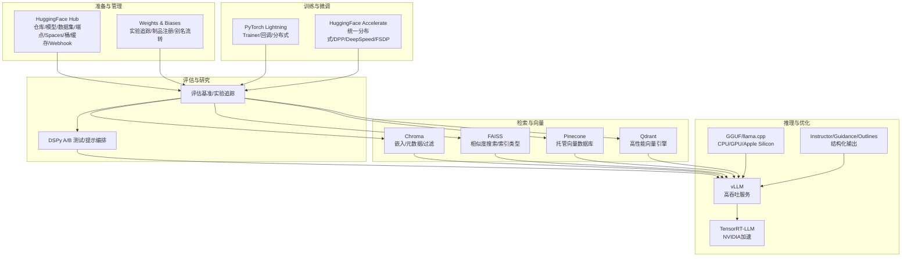
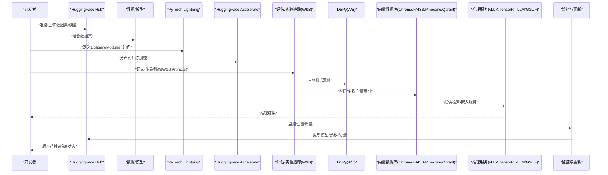
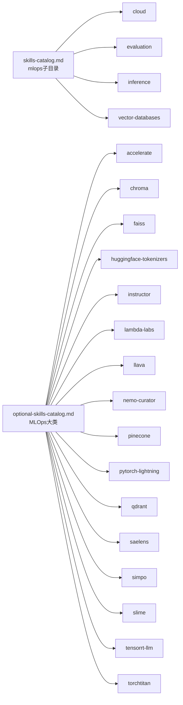

# MLOps技能

<cite>
**本文引用的文件**
- [skills/mlops/DESCRIPTION.md](file://skills/mlops/DESCRIPTION.md)
- [skills/mlops/huggingface-hub/SKILL.md](file://skills/mlops/huggingface-hub/SKILL.md)
- [optional-skills/mlops/chroma/SKILL.md](file://optional-skills/mlops/chroma/SKILL.md)
- [optional-skills/mlops/faiss/SKILL.md](file://optional-skills/mlops/faiss/SKILL.md)
- [optional-skills/mlops/pinecone/SKILL.md](file://optional-skills/mlops/pinecone/SKILL.md)
- [optional-skills/mlops/qdrant/SKILL.md](file://optional-skills/mlops/qdrant/SKILL.md)
- [optional-skills/mlops/pytorch-lightning/SKILL.md](file://optional-skills/mlops/pytorch-lightning/SKILL.md)
- [optional-skills/mlops/accelerate/SKILL.md](file://optional-skills/mlops/accelerate/SKILL.md)
- [website/docs/reference/optional-skills-catalog.md](file://website/docs/reference/optional-skills-catalog.md)
- [website/docs/reference/skills-catalog.md](file://website/docs/reference/skills-catalog.md)
- [skills/mlops/research/dspy/references/examples.md](file://skills/mlops/research/dspy/references/examples.md)
- [skills/mlops/evaluation/weights-and-biases/references/artifacts.md](file://skills/mlops/evaluation/weights-and-biases/references/artifacts.md)
- [hermes_cli/providers.py](file://hermes_cli/providers.py)
- [hermes_cli/model_switch.py](file://hermes_cli/model_switch.py)
</cite>

## 目录
1. [简介](#简介)
2. [项目结构](#项目结构)
3. [核心组件](#核心组件)
4. [架构总览](#架构总览)
5. [详细组件分析](#详细组件分析)
6. [依赖关系分析](#依赖关系分析)
7. [性能考量](#性能考量)
8. [故障排除指南](#故障排除指南)
9. [结论](#结论)
10. [附录](#附录)

## 简介
本文件系统化梳理 Hermes Agent 的 MLOps 技能体系，覆盖从数据与模型准备、训练与微调、评估与实验追踪、到部署与推理优化、以及模型全生命周期管理（版本、注册、A/B 测试）的关键能力。内容以“技能”为单位组织，结合可复用的工具链与框架（如向量数据库、训练框架、HuggingFace Hub 集成等），帮助用户在不同阶段选择合适方案并落地执行。

## 项目结构
MLOps 技能主要分布在两个位置：
- skills/mlops：面向任务域的“MLOps知识与工具”，提供总体定位与导航
- optional-skills/mlops：具体可安装使用的技能包，涵盖云平台、评估、推理优化、模型管理、研究工具、训练框架、向量数据库等

下图展示与 MLOps 相关的技能目录与文档分布：

图表来源
- [skills/mlops/DESCRIPTION.md:1-4](file://skills/mlops/DESCRIPTION.md#L1-L4)
- [skills/mlops/huggingface-hub/SKILL.md:1-81](file://skills/mlops/huggingface-hub/SKILL.md#L1-L81)
- [optional-skills/mlops/chroma/SKILL.md:1-410](file://optional-skills/mlops/chroma/SKILL.md#L1-L410)
- [optional-skills/mlops/faiss/SKILL.md:1-225](file://optional-skills/mlops/faiss/SKILL.md#L1-L225)
- [optional-skills/mlops/pinecone/SKILL.md:1-45](file://optional-skills/mlops/pinecone/SKILL.md#L1-L45)
- [optional-skills/mlops/qdrant/SKILL.md:1-40](file://optional-skills/mlops/qdrant/SKILL.md#L1-L40)
- [optional-skills/mlops/pytorch-lightning/SKILL.md:1-350](file://optional-skills/mlops/pytorch-lightning/SKILL.md#L1-L350)
- [optional-skills/mlops/accelerate/SKILL.md:1-336](file://optional-skills/mlops/accelerate/SKILL.md#L1-L336)
- [website/docs/reference/skills-catalog.md:139-173](file://website/docs/reference/skills-catalog.md#L139-L173)
- [website/docs/reference/optional-skills-catalog.md:90-113](file://website/docs/reference/optional-skills-catalog.md#L90-L113)

章节来源
- [skills/mlops/DESCRIPTION.md:1-4](file://skills/mlops/DESCRIPTION.md#L1-L4)
- [website/docs/reference/optional-skills-catalog.md:90-113](file://website/docs/reference/optional-skills-catalog.md#L90-L113)
- [website/docs/reference/skills-catalog.md:139-173](file://website/docs/reference/skills-catalog.md#L139-L173)

## 核心组件
- 模型与数据管理
  - HuggingFace Hub 集成：仓库管理、模型/数据集检索、SQL 查询、推理端点部署、Spaces 管理、桶存储与缓存、Webhook 等
  - 实验与模型制品：Weights & Biases 的模型制品与注册、别名流转、跨团队交接
- 向量数据库与检索
  - Chroma（开源嵌入数据库）、FAISS（高效相似度搜索与聚类）、Pinecone（托管向量数据库）、Qdrant（高性能向量引擎）
- 训练与微调
  - PyTorch Lightning（高层训练框架，自动分布式、回调、日志）
  - HuggingFace Accelerate（统一分布式训练 API，支持 DDP/DeepSpeed/FSDP/Megatron）
- 推理与优化
  - 结构化输出（Instructor、Guidance、Outlines）
  - 量化与服务（GGUF、llama.cpp、vLLM、TensorRT-LLM）
- 研究与评估
  - DSPy（提示工程、编排、A/B 测试示例）
  - 评估基准（lm-evaluation-harness 等）

章节来源
- [skills/mlops/huggingface-hub/SKILL.md:10-81](file://skills/mlops/huggingface-hub/SKILL.md#L10-L81)
- [optional-skills/mlops/chroma/SKILL.md:14-410](file://optional-skills/mlops/chroma/SKILL.md#L14-L410)
- [optional-skills/mlops/faiss/SKILL.md:14-225](file://optional-skills/mlops/faiss/SKILL.md#L14-L225)
- [optional-skills/mlops/pinecone/SKILL.md:14-45](file://optional-skills/mlops/pinecone/SKILL.md#L14-L45)
- [optional-skills/mlops/qdrant/SKILL.md:14-40](file://optional-skills/mlops/qdrant/SKILL.md#L14-L40)
- [optional-skills/mlops/pytorch-lightning/SKILL.md:14-350](file://optional-skills/mlops/pytorch-lightning/SKILL.md#L14-L350)
- [optional-skills/mlops/accelerate/SKILL.md:14-336](file://optional-skills/mlops/accelerate/SKILL.md#L14-L336)
- [website/docs/reference/skills-catalog.md:139-173](file://website/docs/reference/skills-catalog.md#L139-L173)
- [skills/mlops/research/dspy/references/examples.md:532-565](file://skills/mlops/research/dspy/references/examples.md#L532-L565)
- [skills/mlops/evaluation/weights-and-biases/references/artifacts.md:456-479](file://skills/mlops/evaluation/weights-and-biases/references/artifacts.md#L456-L479)

## 架构总览
下图给出一个概念性的 MLOps 工作流视图，展示从数据与模型准备、训练/微调、评估与制品管理、到部署与推理优化的整体路径，并标注与本仓库中技能的对应关系。

（该图为概念性流程示意，不直接映射具体源码文件，故无图表来源）

## 详细组件分析

### HuggingFace Hub 集成
- 能力概览
  - 仓库管理：创建/删除/克隆/移动、分支与标签、删除文件
  - 数据集与模型：列表、信息查询、Parquet 下载、SQL 查询（基于 DuckDB）
  - 讨论与 PR：生命周期管理、差异查看、合并
  - 基础设施与计算：推理端点部署/暂停/恢复/缩至零、作业运行、Spaces 开发与热重载
  - 存储与自动化：桶管理（S3 类似）、本地缓存管理、Webhook 管理、集合管理
- 使用场景
  - 快速发布与迭代模型/数据集
  - 在 Hub 上进行协作与贡献管理
  - 将数据集作为后端用于检索增强（RAG）或评测
- 最佳实践
  - 使用环境变量或令牌标志进行认证
  - 利用 JSON 输出格式便于自动化
  - 使用同步命令保持本地与桶的一致性

章节来源
- [skills/mlops/huggingface-hub/SKILL.md:10-81](file://skills/mlops/huggingface-hub/SKILL.md#L10-L81)

### 向量数据库与检索
- Chroma
  - 特点：开源、自托管、简单四步 API、支持元数据过滤与全文检索
  - 典型用法：创建集合、添加文档与元数据、相似度查询与过滤、持久化、服务器模式
  - 集成：LangChain、LlamaIndex
- FAISS
  - 特点：Meta 的高性能相似度搜索库，支持数十亿级向量、GPU 加速、多种索引类型（Flat、IVF、HNSW、Product Quantization）
  - 典型用法：索引构建与训练、批量查询、GPU 加速、保存/加载索引
- Pinecone
  - 特点：托管向量数据库，自动伸缩、混合检索（稠密+稀疏）、低延迟、SLA 可靠
  - 典型用法：创建命名空间、写入/查询、过滤、管理索引
- Qdrant
  - 特点：Rust 写高性能向量引擎，多向量存储、丰富过滤、分片/复制、REST/gRPC
  - 典型用法：创建集合、插入多向量、过滤查询、分布式部署

章节来源
- [optional-skills/mlops/chroma/SKILL.md:14-410](file://optional-skills/mlops/chroma/SKILL.md#L14-L410)
- [optional-skills/mlops/faiss/SKILL.md:14-225](file://optional-skills/mlops/faiss/SKILL.md#L14-L225)
- [optional-skills/mlops/pinecone/SKILL.md:14-45](file://optional-skills/mlops/pinecone/SKILL.md#L14-L45)
- [optional-skills/mlops/qdrant/SKILL.md:14-40](file://optional-skills/mlops/qdrant/SKILL.md#L14-L40)

### 训练与微调框架
- PyTorch Lightning
  - 特点：高层 API、Trainer 自动化（分布式、混合精度、梯度累积、检查点、日志、进度条）、回调系统
  - 典型用法：定义 LightningModule、训练/验证/测试步骤、Trainer 配置、分布式策略（DDP/FSDP/DeepSpeed）
- HuggingFace Accelerate
  - 特点：仅 4 行代码即可获得分布式支持；统一 API 支持 DDP/DeepSpeed/FSDP/Megatron；交互式配置；单命令启动
  - 典型用法：初始化 Accelerator、prepare 模型/优化器/数据加载器、backward 包装、launch 启动

章节来源
- [optional-skills/mlops/pytorch-lightning/SKILL.md:14-350](file://optional-skills/mlops/pytorch-lightning/SKILL.md#L14-L350)
- [optional-skills/mlops/accelerate/SKILL.md:14-336](file://optional-skills/mlops/accelerate/SKILL.md#L14-L336)

### 推理与优化
- 结构化输出
  - Instructor：基于 Pydantic 的结构化抽取与重试
  - Guidance：正则/语法约束生成，保证输出结构合法
  - Outlines：Pydantic 类型安全与本地模型支持
- 量化与服务
  - GGUF/llama.cpp：CPU/GPU/Apple Silicon 推理，灵活量化（2-8bit）
  - vLLM：PagedAttention 连续批处理，高吞吐低延迟，OpenAI 兼容端点
  - TensorRT-LLM：NVIDIA 平台极致吞吐，量化（FP8/INT4）、飞行中批处理

章节来源
- [website/docs/reference/skills-catalog.md:160-173](file://website/docs/reference/skills-catalog.md#L160-L173)

### 研究与评估
- DSPy
  - 示例：A/B 测试模块对比两个变体，随机路由到不同变体进行比较
- 评估基准与实验追踪
  - lm-evaluation-harness：学术基准评测（MMLU、HumanEval、GSM8K、TruthfulQA、HellaSwag 等）
  - Weights & Biases：自动日志、实时可视化、扫描超参优化、模型制品注册与别名流转

章节来源
- [skills/mlops/research/dspy/references/examples.md:532-565](file://skills/mlops/research/dspy/references/examples.md#L532-L565)
- [website/docs/reference/skills-catalog.md:148-157](file://website/docs/reference/skills-catalog.md#L148-L157)
- [skills/mlops/evaluation/weights-and-biases/references/artifacts.md:456-479](file://skills/mlops/evaluation/weights-and-biases/references/artifacts.md#L456-L479)

### 模型生命周期管理与版本控制
- 模型制品与注册
  - 使用 W&B Artifacts 在训练团队与评估团队之间传递模型制品，通过别名（candidate/production）实现版本流转
- 版本与别名
  - 通过别名标记候选与生产版本，便于回滚与审计
- A/B 测试
  - 在推理侧对不同模型/提示变体进行分流评估，收集指标并决定上线

章节来源
- [skills/mlops/evaluation/weights-and-biases/references/artifacts.md:456-479](file://skills/mlops/evaluation/weights-and-biases/references/artifacts.md#L456-L479)
- [skills/mlops/research/dspy/references/examples.md:532-565](file://skills/mlops/research/dspy/references/examples.md#L532-L565)

### 完整工作流案例（训练—部署—监控—更新）
以下序列图展示一个典型 MLOps 工作流：从数据与模型准备、训练/微调、评估与制品管理、到部署与推理优化，并在运行期进行监控与更新。

图表来源
- [optional-skills/mlops/pytorch-lightning/SKILL.md:14-350](file://optional-skills/mlops/pytorch-lightning/SKILL.md#L14-L350)
- [optional-skills/mlops/accelerate/SKILL.md:14-336](file://optional-skills/mlops/accelerate/SKILL.md#L14-L336)
- [skills/mlops/evaluation/weights-and-biases/references/artifacts.md:456-479](file://skills/mlops/evaluation/weights-and-biases/references/artifacts.md#L456-L479)
- [skills/mlops/research/dspy/references/examples.md:532-565](file://skills/mlops/research/dspy/references/examples.md#L532-L565)
- [optional-skills/mlops/chroma/SKILL.md:14-410](file://optional-skills/mlops/chroma/SKILL.md#L14-L410)
- [optional-skills/mlops/faiss/SKILL.md:14-225](file://optional-skills/mlops/faiss/SKILL.md#L14-L225)
- [optional-skills/mlops/pinecone/SKILL.md:14-45](file://optional-skills/mlops/pinecone/SKILL.md#L14-L45)
- [optional-skills/mlops/qdrant/SKILL.md:14-40](file://optional-skills/mlops/qdrant/SKILL.md#L14-L40)
- [website/docs/reference/skills-catalog.md:160-173](file://website/docs/reference/skills-catalog.md#L160-L173)

## 依赖关系分析
- 技能分类与覆盖范围
  - optional-skills-catalog.md 展示了 MLOps 大类下的技能清单，涵盖分布式训练、向量数据库、推理优化、研究工具、训练框架等
  - skills-catalog.md 对 mlops 子目录下的技能进行了更细粒度的分类与描述
- 提供商与模型切换
  - 提供商解析与标签显示逻辑由 CLI 组件提供，支持聚合器与自定义提供商，便于在不同推理后端间切换

图表来源
- [website/docs/reference/optional-skills-catalog.md:90-113](file://website/docs/reference/optional-skills-catalog.md#L90-L113)
- [website/docs/reference/skills-catalog.md:139-173](file://website/docs/reference/skills-catalog.md#L139-L173)

章节来源
- [website/docs/reference/optional-skills-catalog.md:90-113](file://website/docs/reference/optional-skills-catalog.md#L90-L113)
- [website/docs/reference/skills-catalog.md:139-173](file://website/docs/reference/skills-catalog.md#L139-L173)
- [hermes_cli/providers.py:320-365](file://hermes_cli/providers.py#L320-L365)

## 性能考量
- 训练阶段
  - 优先采用混合精度（BF16/FP16/FP8）与分布式策略（DDP/FSDP/DeepSpeed）降低显存占用并提升吞吐
  - 使用梯度累积扩大有效批次，平衡内存与稳定性
- 推理阶段
  - 针对硬件选择最优推理栈：CPU/Apple Silicon 使用 llama.cpp/GGUF；消费级 GPU 使用 vLLM；NVIDIA 平台使用 TensorRT-LLM
  - 结构化输出库（Instructor/Guidance/Outlines）在保证输出合法性的同时减少无效重算
- 向量检索
  - 小规模/笔记本：Chroma
  - 大规模/纯相似度：FAISS（可选 GPU 加速与多种索引）
  - 生产托管/低延迟：Pinecone
  - 高性能/自托管：Qdrant

（本节为通用指导，无需列出章节来源）

## 故障排除指南
- 训练问题
  - 损失不下降：检查数据形状与标签、确认前向计算正确
  - 显存不足：减小批次或启用梯度累积、使用混合精度（BF16/FP16）
  - 验证未运行：确保传入验证数据加载器
  - DDP 进程异常：明确设置设备数量，先在 CPU 测试再切换到 GPU
- 分布式训练
  - 设备放置错误：避免手动搬运张量到设备，使用 Accelerate/Trainer 自动处理
  - 梯度累积未生效：使用上下文管理器包裹训练循环
  - FSDP 结果不稳定：确保随机种子一致
- 推理与服务
  - 结构化输出失败：检查模式定义与重试策略
  - vLLM 吞吐偏低：检查批处理大小、量化与并发配置
  - TensorRT-LLM 构建失败：确认驱动与 CUDA 版本匹配
- 向量数据库
  - Chroma：持久化客户端、元数据过滤、唯一 ID、定期备份
  - FAISS：索引类型选择、GPU 加速、nprobe/ef_search 调优、PQ 内存节省
  - Pinecone/Qdrant：命名空间与索引管理、过滤条件与延迟监控

章节来源
- [optional-skills/mlops/pytorch-lightning/SKILL.md:270-316](file://optional-skills/mlops/pytorch-lightning/SKILL.md#L270-L316)
- [optional-skills/mlops/accelerate/SKILL.md:258-301](file://optional-skills/mlops/accelerate/SKILL.md#L258-L301)
- [optional-skills/mlops/chroma/SKILL.md:380-410](file://optional-skills/mlops/chroma/SKILL.md#L380-L410)
- [optional-skills/mlops/faiss/SKILL.md:199-225](file://optional-skills/mlops/faiss/SKILL.md#L199-L225)
- [optional-skills/mlops/pinecone/SKILL.md:18-45](file://optional-skills/mlops/pinecone/SKILL.md#L18-L45)
- [optional-skills/mlops/qdrant/SKILL.md:18-40](file://optional-skills/mlops/qdrant/SKILL.md#L18-L40)

## 结论
Hermes Agent 的 MLOps 技能体系以“可插拔技能”为核心，覆盖从数据与模型准备、训练/微调、评估与制品管理、到部署与推理优化的完整闭环。通过 HuggingFace Hub、向量数据库、训练框架与推理优化工具的组合，用户可在不同阶段快速落地最佳实践，并借助制品注册与 A/B 测试实现持续演进与稳定交付。

（本节为总结性内容，无需列出章节来源）

## 附录
- 关键参考路径
  - MLOps 技能总览与导航：[skills/mlops/DESCRIPTION.md](file://skills/mlops/DESCRIPTION.md)
  - HuggingFace Hub 技能参考：[skills/mlops/huggingface-hub/SKILL.md](file://skills/mlops/huggingface-hub/SKILL.md)
  - Chroma 技能参考：[optional-skills/mlops/chroma/SKILL.md](file://optional-skills/mlops/chroma/SKILL.md)
  - FAISS 技能参考：[optional-skills/mlops/faiss/SKILL.md](file://optional-skills/mlops/faiss/SKILL.md)
  - Pinecone 技能参考：[optional-skills/mlops/pinecone/SKILL.md](file://optional-skills/mlops/pinecone/SKILL.md)
  - Qdrant 技能参考：[optional-skills/mlops/qdrant/SKILL.md](file://optional-skills/mlops/qdrant/SKILL.md)
  - PyTorch Lightning 技能参考：[optional-skills/mlops/pytorch-lightning/SKILL.md](file://optional-skills/mlops/pytorch-lightning/SKILL.md)
  - HuggingFace Accelerate 技能参考：[optional-skills/mlops/accelerate/SKILL.md](file://optional-skills/mlops/accelerate/SKILL.md)
  - 技能目录（分类）：[website/docs/reference/skills-catalog.md](file://website/docs/reference/skills-catalog.md)
  - 可选技能目录（MLOps 大类）：[website/docs/reference/optional-skills-catalog.md](file://website/docs/reference/optional-skills-catalog.md)
  - DSPy A/B 测试示例：[skills/mlops/research/dspy/references/examples.md](file://skills/mlops/research/dspy/references/examples.md)
  - W&B 模型制品与别名流转：[skills/mlops/evaluation/weights-and-biases/references/artifacts.md](file://skills/mlops/evaluation/weights-and-biases/references/artifacts.md)
  - 提供商解析与标签显示：[hermes_cli/providers.py](file://hermes_cli/providers.py)
  - 模型切换主流程（CLI/Gateway 共享）：[hermes_cli/model_switch.py](file://hermes_cli/model_switch.py)

（本节为索引性内容，无需列出章节来源）