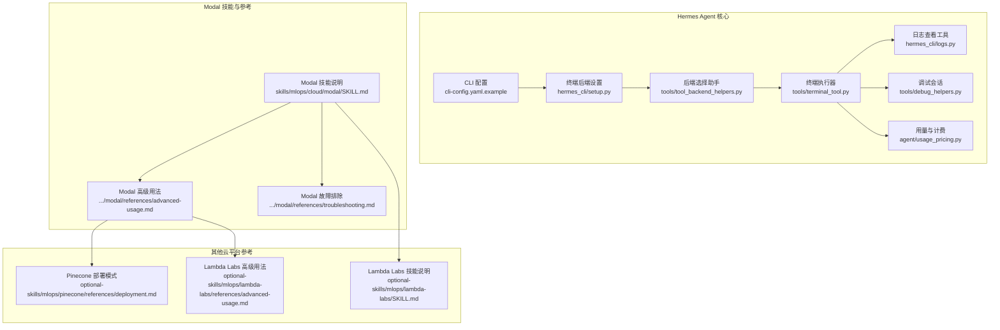
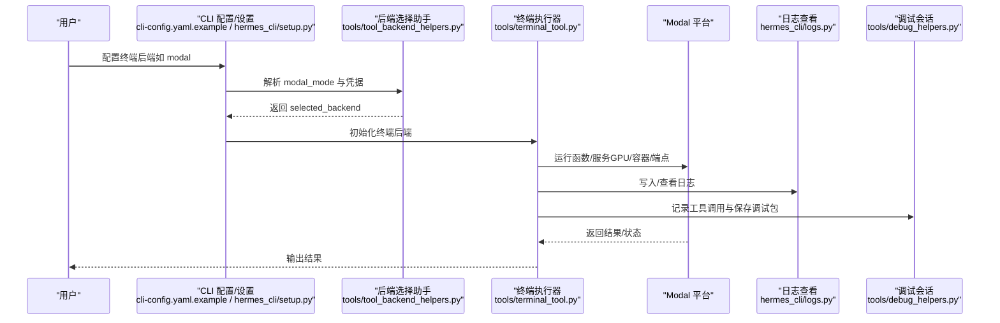
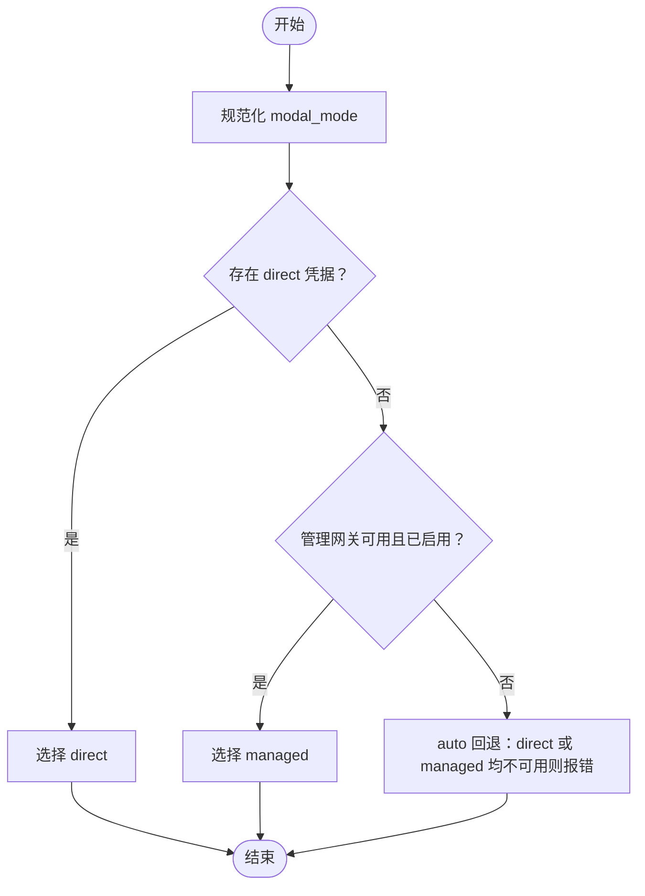
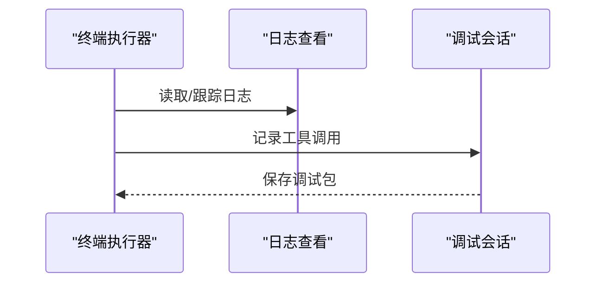
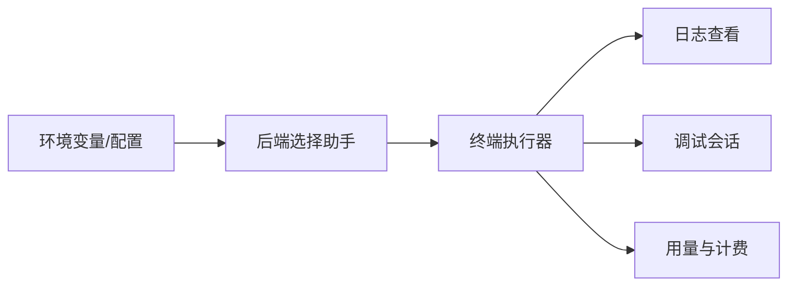

# 云平台部署

<cite>
**本文引用的文件**
- [SKILL.md（Modal Serverless GPU）](file://skills/mlops/cloud/modal/SKILL.md)
- [advanced-usage.md（Modal 高级用法）](file://skills/mlops/cloud/modal/references/advanced-usage.md)
- [troubleshooting.md（Modal 故障排除）](file://skills/mlops/cloud/modal/references/troubleshooting.md)
- [tool_backend_helpers.py](file://tools/tool_backend_helpers.py)
- [terminal_tool.py](file://tools/terminal_tool.py)
- [setup.py（CLI 设置入口）](file://hermes_cli/setup.py)
- [cli-config.yaml.example](file://cli-config.yaml.example)
- [logs.py（日志查看）](file://hermes_cli/logs.py)
- [debug_helpers.py（调试会话）](file://tools/debug_helpers.py)
- [test_tool_backend_helpers.py（Modal 模式测试）](file://tests/tools/test_tool_backend_helpers.py)
- [deployment.md（Pinecone 部署）](file://optional-skills/mlops/pinecone/references/deployment.md)
- [advanced-usage.md（Lambda Labs 高级用法）](file://optional-skills/mlops/lambda-labs/references/advanced-usage.md)
- [SKILL.md（Lambda Labs GPU Cloud）](file://optional-skills/mlops/lambda-labs/SKILL.md)
- [usage_pricing.py（用量与计费）](file://agent/usage_pricing.py)
</cite>

## 目录
1. [简介](#简介)
2. [项目结构](#项目结构)
3. [核心组件](#核心组件)
4. [架构总览](#架构总览)
5. [详细组件分析](#详细组件分析)
6. [依赖关系分析](#依赖关系分析)
7. [性能与成本优化](#性能与成本优化)
8. [故障排除指南](#故障排除指南)
9. [结论](#结论)
10. [附录](#附录)

## 简介
本文件面向在云平台上部署与运行 Hermes Agent 的工程师与平台运维人员，聚焦 Modal 云平台的部署配置、高级用法与故障排除；同时覆盖容器化与终端执行后端、日志与调试、监控与可观测性、成本优化与安全访问控制等主题。文档以仓库中现有的 Modal 技能文档、工具后端选择逻辑、CLI 配置与日志工具为基础，结合可复用的向量数据库与 GPU 云平台参考材料，形成一套可操作的部署与运维指南。

## 项目结构
围绕“云平台部署”的关键目录与文件如下：
- Modal 技能与参考文档：skills/mlops/cloud/modal 及其 references 子目录
- 工具后端与终端执行：tools/tool_backend_helpers.py、tools/terminal_tool.py、hermes_cli/setup.py
- CLI 配置模板：cli-config.yaml.example
- 日志与调试：hermes_cli/logs.py、tools/debug_helpers.py
- 成本与计费：agent/usage_pricing.py
- 其他云平台参考：optional-skills/mlops 下的 Pinecone、Lambda Labs 等

图表来源
- [cli-config.yaml.example:190-212](file://cli-config.yaml.example#L190-L212)
- [setup.py（CLI 设置入口）:1221-1251](file://hermes_cli/setup.py#L1221-L1251)
- [tool_backend_helpers.py:48-81](file://tools/tool_backend_helpers.py#L48-L81)
- [terminal_tool.py:1592-1632](file://tools/terminal_tool.py#L1592-L1632)
- [logs.py（日志查看）:138-247](file://hermes_cli/logs.py#L138-L247)
- [debug_helpers.py（调试会话）:76-105](file://tools/debug_helpers.py#L76-L105)
- [usage_pricing.py（用量与计费）:511-540](file://agent/usage_pricing.py#L511-L540)
- [SKILL.md（Modal Serverless GPU）:1-113](file://skills/mlops/cloud/modal/SKILL.md#L1-L113)
- [advanced-usage.md（Modal 高级用法）:1-504](file://skills/mlops/cloud/modal/references/advanced-usage.md#L1-L504)
- [troubleshooting.md（Modal 故障排除）:1-495](file://skills/mlops/cloud/modal/references/troubleshooting.md#L1-L495)
- [deployment.md（Pinecone 部署）:1-59](file://optional-skills/mlops/pinecone/references/deployment.md#L1-L59)
- [advanced-usage.md（Lambda Labs 高级用法）:138-545](file://optional-skills/mlops/lambda-labs/references/advanced-usage.md#L138-L545)
- [SKILL.md（Lambda Labs GPU Cloud）:1-520](file://optional-skills/mlops/lambda-labs/SKILL.md#L1-L520)

章节来源
- [cli-config.yaml.example:190-212](file://cli-config.yaml.example#L190-L212)
- [setup.py（CLI 设置入口）:1221-1251](file://hermes_cli/setup.py#L1221-L1251)
- [tool_backend_helpers.py:48-81](file://tools/tool_backend_helpers.py#L48-L81)
- [terminal_tool.py:1592-1632](file://tools/terminal_tool.py#L1592-L1632)
- [logs.py（日志查看）:138-247](file://hermes_cli/logs.py#L138-L247)
- [debug_helpers.py（调试会话）:76-105](file://tools/debug_helpers.py#L76-L105)
- [usage_pricing.py（用量与计费）:511-540](file://agent/usage_pricing.py#L511-L540)
- [SKILL.md（Modal Serverless GPU）:1-113](file://skills/mlops/cloud/modal/SKILL.md#L1-L113)
- [advanced-usage.md（Modal 高级用法）:1-504](file://skills/mlops/cloud/modal/references/advanced-usage.md#L1-L504)
- [troubleshooting.md（Modal 故障排除）:1-495](file://skills/mlops/cloud/modal/references/troubleshooting.md#L1-L495)
- [deployment.md（Pinecone 部署）:1-59](file://optional-skills/mlops/pinecone/references/deployment.md#L1-L59)
- [advanced-usage.md（Lambda Labs 高级用法）:138-545](file://optional-skills/mlops/lambda-labs/references/advanced-usage.md#L138-L545)
- [SKILL.md（Lambda Labs GPU Cloud）:1-520](file://optional-skills/mlops/lambda-labs/SKILL.md#L1-L520)

## 核心组件
- 后端选择与认证
  - 工具后端助手负责规范化 Modal 执行模式、检测直接凭据与管理网关可用性，并输出最终选中的后端状态。
  - 终端工具在执行前校验所选后端的可用性与配置完整性。
- CLI 配置与终端后端
  - 提供本地、SSH、Docker、Singularity、Modal、Daytona 等多种终端后端选项，支持资源限制与持久化卷。
- 日志与调试
  - CLI 提供日志尾读与实时跟踪能力；调试会话可记录工具调用序列并生成 JSON 调试包。
- 计费与成本
  - 用量统计模块按输入/输出/缓存/请求维度估算成本，辅助成本优化决策。

章节来源
- [tool_backend_helpers.py:27-81](file://tools/tool_backend_helpers.py#L27-L81)
- [terminal_tool.py:1592-1632](file://tools/terminal_tool.py#L1592-L1632)
- [cli-config.yaml.example:190-222](file://cli-config.yaml.example#L190-L222)
- [logs.py（日志查看）:138-247](file://hermes_cli/logs.py#L138-L247)
- [debug_helpers.py（调试会话）:76-105](file://tools/debug_helpers.py#L76-L105)
- [usage_pricing.py（用量与计费）:511-540](file://agent/usage_pricing.py#L511-L540)

## 架构总览
下图展示了从 CLI 到终端后端再到 Modal 平台的整体执行链路，以及日志与调试在其中的位置。

图表来源
- [cli-config.yaml.example:190-212](file://cli-config.yaml.example#L190-L212)
- [setup.py（CLI 设置入口）:1221-1251](file://hermes_cli/setup.py#L1221-L1251)
- [tool_backend_helpers.py:48-81](file://tools/tool_backend_helpers.py#L48-L81)
- [terminal_tool.py:1592-1632](file://tools/terminal_tool.py#L1592-L1632)
- [logs.py（日志查看）:138-247](file://hermes_cli/logs.py#L138-L247)
- [debug_helpers.py（调试会话）:76-105](file://tools/debug_helpers.py#L76-L105)

## 详细组件分析

### 组件一：Modal 后端选择与执行
- 模式规范化与回退策略
  - 支持 auto/direct/managed 三种模式，自动回退到可用模式；当启用管理网关且可用时优先使用 managed。
- 凭据检测
  - 检测 MODAL_TOKEN_ID/SECRET 或本地配置文件是否存在，决定是否允许 direct 模式。
- 执行路径
  - 在 CLI 设置阶段提示用户选择“我的订阅”或“我自己的账户”，并同步到环境变量。

图表来源
- [tool_backend_helpers.py:27-81](file://tools/tool_backend_helpers.py#L27-L81)
- [setup.py（CLI 设置入口）:1221-1251](file://hermes_cli/setup.py#L1221-L1251)

章节来源
- [tool_backend_helpers.py:27-81](file://tools/tool_backend_helpers.py#L27-L81)
- [setup.py（CLI 设置入口）:1221-1251](file://hermes_cli/setup.py#L1221-L1251)

### 组件二：Modal 技能与部署参考
- 快速入门与核心概念
  - 包含安装、Hello World、基础推理端点、App/Function/Cls/Image/Volume/Secret 等核心组件说明。
- GPU 配置与镜像
  - 提供 GPU 类型与内存变体、多 GPU、GPU 回退策略与镜像构建最佳实践。
- Web 端点与动态批处理
  - 支持 FastAPI/ASGI/Wsgi/Web Server 等多种端点类型；动态批处理提升吞吐。
- 容错与性能优化
  - 冷启动缓解、模型加载最佳实践、并发与批处理权衡。
- 生产部署与零停机
  - 环境分离、零停机发布、健康检查。
- 调用方式
  - 外部代码通过 Function.lookup 调用；REST API 通过 HTTPS 访问。

章节来源
- [SKILL.md（Modal Serverless GPU）:1-113](file://skills/mlops/cloud/modal/SKILL.md#L1-L113)
- [SKILL.md（Modal Serverless GPU）:115-345](file://skills/mlops/cloud/modal/SKILL.md#L115-L345)
- [advanced-usage.md（Modal 高级用法）:1-504](file://skills/mlops/cloud/modal/references/advanced-usage.md#L1-L504)

### 组件三：日志与调试
- 日志查看
  - 支持按级别、会话、组件前缀过滤，支持尾读与实时 follow。
- 调试会话
  - 记录工具调用序列，生成包含会话信息与调用明细的 JSON 文件，便于问题定位。

图表来源
- [logs.py（日志查看）:138-247](file://hermes_cli/logs.py#L138-L247)
- [debug_helpers.py（调试会话）:76-105](file://tools/debug_helpers.py#L76-L105)

章节来源
- [logs.py（日志查看）:138-247](file://hermes_cli/logs.py#L138-L247)
- [debug_helpers.py（调试会话）:76-105](file://tools/debug_helpers.py#L76-L105)

### 组件四：CLI 配置与终端后端
- 终端后端选项
  - local、ssh、docker、singularity、modal、daytona 等，支持资源限制与持久化卷。
- Modal 后端配置要点
  - backend: "modal"，cwd、timeout、lifetime_seconds、modal_image 等。
- 资源与持久化
  - container_cpu、container_memory、container_disk、container_persistent 控制容器资源与持久化行为。

章节来源
- [cli-config.yaml.example:190-222](file://cli-config.yaml.example#L190-L222)

## 依赖关系分析
- 后端选择依赖于环境变量与本地配置文件的存在性，以及管理网关的可用性。
- 终端执行器在启动时对后端进行最终校验，确保配置完整。
- 日志与调试工具与终端执行器解耦，通过统一的日志目录与调试会话接口集成。

图表来源
- [tool_backend_helpers.py:48-81](file://tools/tool_backend_helpers.py#L48-L81)
- [terminal_tool.py:1592-1632](file://tools/terminal_tool.py#L1592-L1632)
- [logs.py（日志查看）:138-247](file://hermes_cli/logs.py#L138-L247)
- [debug_helpers.py（调试会话）:76-105](file://tools/debug_helpers.py#L76-L105)
- [usage_pricing.py（用量与计费）:511-540](file://agent/usage_pricing.py#L511-L540)

章节来源
- [tool_backend_helpers.py:48-81](file://tools/tool_backend_helpers.py#L48-L81)
- [terminal_tool.py:1592-1632](file://tools/terminal_tool.py#L1592-L1632)
- [logs.py（日志查看）:138-247](file://hermes_cli/logs.py#L138-L247)
- [debug_helpers.py（调试会话）:76-105](file://tools/debug_helpers.py#L76-L105)
- [usage_pricing.py（用量与计费）:511-540](file://agent/usage_pricing.py#L511-L540)

## 性能与成本优化
- Modal
  - 右侧 GPU：推理优先选择 L40S 等性价比更高的 GPU；训练使用更大显存 GPU。
  - GPU 回退：通过列表顺序指定回退 GPU，提高可用性。
  - 零停机与冷启动：利用零停机部署与 keep_warm/container_idle_timeout 缓解延迟。
  - 批处理：批量处理减少冷启动次数，提升吞吐。
  - 结构化日志与自定义指标：通过结构化日志与打印 METRIC 方便观测与优化。
- 向量数据库（Pinecone）
  - Serverless 规格适合可变负载与成本敏感场景；Pod 规格适合稳定低延迟与高吞吐。
- Lambda Labs
  - 使用文件系统避免重复下载数据；频繁检查点恢复中断训练；按工作负载选择实例类型。

章节来源
- [advanced-usage.md（Modal 高级用法）:327-422](file://skills/mlops/cloud/modal/references/advanced-usage.md#L327-L422)
- [deployment.md（Pinecone 部署）:1-59](file://optional-skills/mlops/pinecone/references/deployment.md#L1-L59)
- [advanced-usage.md（Lambda Labs 高级用法）:489-545](file://optional-skills/mlops/lambda-labs/references/advanced-usage.md#L489-L545)

## 故障排除指南
- 安装与认证
  - 重新认证、检查令牌、通过环境变量设置令牌。
- 镜像构建
  - 固定版本、匹配 CUDA 版本、分层安装、使用 uv 加速解析、构建时下载模型。
- GPU 相关
  - 显存不足使用更大 GPU、启用混合精度与梯度检查点、严格选择 GPU 类型。
- 冷启动与容器重启
  - 保持容器常驻、在容器启动阶段加载模型、提交/重载持久化卷、增加内存与超时、优雅处理信号。
- 端点与跨域
  - 增加超时、返回流式响应、检查部署状态与日志、配置 CORS。
- 密钥与调度
  - 创建/列出密钥、确保名称一致、实现幂等处理、注意 UTC 时间。
- 调试与诊断
  - 开启 DEBUG 日志、实时查看容器日志、本地运行验证、检查容器环境。

章节来源
- [troubleshooting.md（Modal 故障排除）:1-495](file://skills/mlops/cloud/modal/references/troubleshooting.md#L1-L495)

## 结论
通过工具后端选择与 CLI 配置，Hermes Agent 能够在 Modal 等云平台上实现灵活的终端执行与部署。结合日志、调试与成本估算工具，可在保证性能与稳定性的同时，实现可观测与成本优化。对于更复杂的向量检索与大规模训练场景，可参考 Pinecone 与 Lambda Labs 的部署与优化实践。

## 附录
- 部署示例（基于 Modal 技能文档）
  - 快速开始与 Hello World：参见 [SKILL.md（Modal Serverless GPU）:42-92](file://skills/mlops/cloud/modal/SKILL.md#L42-L92)
  - 基础推理端点：参见 [SKILL.md（Modal Serverless GPU）:70-92](file://skills/mlops/cloud/modal/SKILL.md#L70-L92)
  - Web 端点与 ASGI/FastAPI：参见 [advanced-usage.md（Modal 高级用法）:184-218](file://skills/mlops/cloud/modal/references/advanced-usage.md#L184-L218)
  - REST API 调用：参见 [advanced-usage.md（Modal 高级用法）:484-503](file://skills/mlops/cloud/modal/references/advanced-usage.md#L484-L503)
- 安全与访问控制
  - 密钥管理：通过 Modal Secret 管理敏感信息；参见 [advanced-usage.md（Modal 高级用法）:230-243](file://skills/mlops/cloud/modal/references/advanced-usage.md#L230-L243)
  - 端点鉴权：在 FastAPI 中添加鉴权依赖；参见 [advanced-usage.md（Modal 高级用法）:309-325](file://skills/mlops/cloud/modal/references/advanced-usage.md#L309-L325)
  - Lambda Labs 安全：仅开放必要端口、配置防火墙；参见 [SKILL.md（Lambda Labs GPU Cloud）:453-464](file://optional-skills/mlops/lambda-labs/SKILL.md#L453-L464)