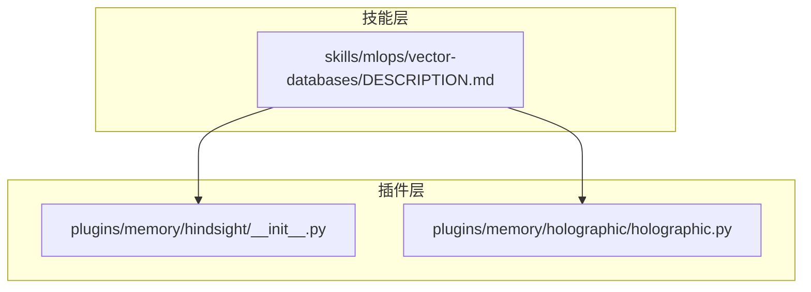
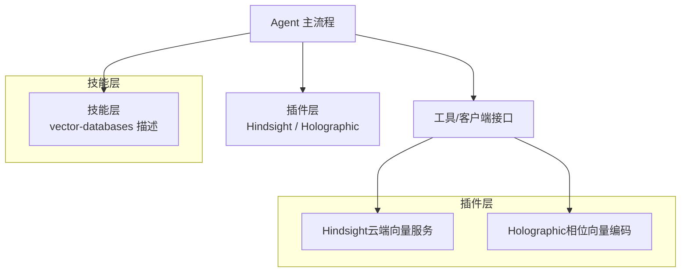
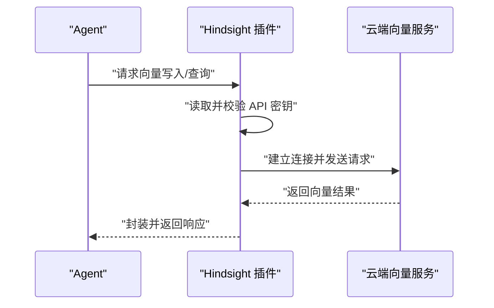
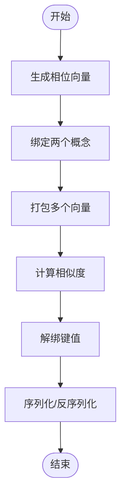
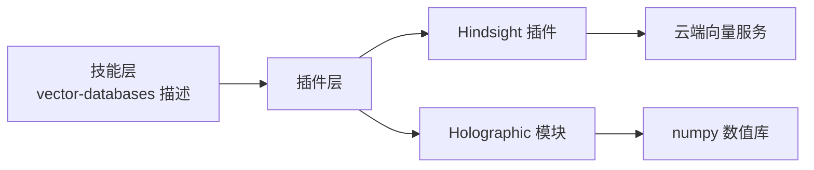

# 向量数据库

<cite>
**本文引用的文件**
- [skills/mlops/vector-databases/DESCRIPTION.md](file://skills/mlops/vector-databases/DESCRIPTION.md)
- [plugins/memory/hindsight/__init__.py](file://plugins/memory/hindsight/__init__.py)
- [plugins/memory/holographic/holographic.py](file://plugins/memory/holographic/holographic.py)
</cite>

## 目录
1. [简介](#简介)
2. [项目结构](#项目结构)
3. [核心组件](#核心组件)
4. [架构总览](#架构总览)
5. [详细组件分析](#详细组件分析)
6. [依赖关系分析](#依赖关系分析)
7. [性能考虑](#性能考虑)
8. [故障排查指南](#故障排查指南)
9. [结论](#结论)
10. [附录](#附录)

## 简介
本文件面向 Hermes Agent 的向量数据库技能，系统性介绍向量数据库的基本概念、典型应用场景（如 RAG、语义检索、推荐系统）以及在 Hermes 中的集成思路与实践要点。文档同时梳理了项目中已存在的相关能力与插件，帮助读者快速理解如何在 Hermes 生态中构建与优化向量检索系统。

## 项目结构
与向量数据库直接相关的代码主要分布在以下区域：
- 技能层：skills/mlops/vector-databases 提供向量相似度检索与嵌入数据库的描述性说明。
- 插件层：plugins/memory 下包含与向量/记忆相关的实现，例如 Hindsight（云服务）与 Holographic（相位向量编码）。

**图表来源**
- [skills/mlops/vector-databases/DESCRIPTION.md:1-4](file://skills/mlops/vector-databases/DESCRIPTION.md#L1-L4)
- [plugins/memory/hindsight/__init__.py:35](file://plugins/memory/hindsight/__init__.py#L35)
- [plugins/memory/holographic/holographic.py:1-169](file://plugins/memory/holographic/holographic.py#L1-L169)

**章节来源**
- [skills/mlops/vector-databases/DESCRIPTION.md:1-4](file://skills/mlops/vector-databases/DESCRIPTION.md#L1-L4)

## 核心组件
- 向量数据库技能说明：位于 skills/mlops/vector-databases/DESCRIPTION.md，用于描述“向量相似度检索与嵌入数据库”的用途与定位，便于在技能中心进行归类与检索。
- Hindsight 记忆插件：提供与云端向量服务的对接示例，展示 API 密钥管理、服务端点配置与调用流程。
- Holographic 相位向量模块：提供相位向量编码、绑定/解绑、打包等向量操作的实现思路，体现本地化向量处理与相似度计算的范式。

**章节来源**
- [skills/mlops/vector-databases/DESCRIPTION.md:1-4](file://skills/mlops/vector-databases/DESCRIPTION.md#L1-L4)
- [plugins/memory/hindsight/__init__.py:35](file://plugins/memory/hindsight/__init__.py#L35)
- [plugins/memory/holographic/holographic.py:1-169](file://plugins/memory/holographic/holographic.py#L1-L169)

## 架构总览
下图展示了 Hermes 中与向量检索相关的高层架构：技能层负责功能描述与入口，插件层负责具体实现（本地或云端），并通过统一的工具/客户端接口与 Agent 主流程交互。

**图表来源**
- [plugins/memory/hindsight/__init__.py:35](file://plugins/memory/hindsight/__init__.py#L35)
- [plugins/memory/holographic/holographic.py:1-169](file://plugins/memory/holographic/holographic.py#L1-L169)

## 详细组件分析

### 组件一：向量数据库技能说明（技能层）
- 职责：对“向量相似度检索与嵌入数据库”进行功能定位与场景说明，便于在技能中心进行分类与发现。
- 关键点：该文件为纯描述性内容，不包含具体实现；其存在有助于统一术语与场景边界。

**章节来源**
- [skills/mlops/vector-databases/DESCRIPTION.md:1-4](file://skills/mlops/vector-databases/DESCRIPTION.md#L1-L4)

### 组件二：Hindsight（云端向量服务）插件
- 功能概述：提供与云端向量服务的对接能力，支持通过 API 密钥访问服务端点，完成向量数据的写入与查询。
- 配置要点：
  - API 密钥管理：通过密钥项定义与环境变量映射，确保密钥安全存储与注入。
  - 服务端点：默认端点与可选的云模式配置，便于切换不同部署形态。
  - 用户引导：提供在线获取密钥的链接提示，降低接入门槛。
- 典型流程：密钥校验 → 连接服务 → 写入/查询向量数据 → 返回结果。

**图表来源**
- [plugins/memory/hindsight/__init__.py:35](file://plugins/memory/hindsight/__init__.py#L35)
- [plugins/memory/hindsight/__init__.py:315](file://plugins/memory/hindsight/__init__.py#L315)
- [plugins/memory/hindsight/__init__.py:410](file://plugins/memory/hindsight/__init__.py#L410)

**章节来源**
- [plugins/memory/hindsight/__init__.py:35](file://plugins/memory/hindsight/__init__.py#L35)
- [plugins/memory/hindsight/__init__.py:315](file://plugins/memory/hindsight/__init__.py#L315)
- [plugins/memory/hindsight/__init__.py:410](file://plugins/memory/hindsight/__init__.py#L410)

### 组件三：Holographic（相位向量编码）模块
- 功能概述：实现相位向量（Phase Vector）的编码、绑定、解绑与打包等操作，体现向量符号架构（VSA）在组合结构编码中的应用。
- 关键算法与数据结构：
  - 编码：基于哈希计数器生成确定性相位向量。
  - 绑定/解绑：用于将两个概念合并为复合向量或将键值从复合向量中还原。
  - 打包：将多个向量合并为一个与各输入近似的向量。
  - 相似度：通过复数求和与角度差计算，得到 [-1, 1] 区间的相似度分数。
- 复杂度与性能：
  - 编码与向量运算的时间复杂度与维度成正比；维度越高，表达能力越强但计算成本越大。
  - 序列化/反序列化开销与维度线性相关，需根据内存与带宽约束选择合适维度。

**图表来源**
- [plugins/memory/holographic/holographic.py:43](file://plugins/memory/holographic/holographic.py#L43)
- [plugins/memory/holographic/holographic.py:72](file://plugins/memory/holographic/holographic.py#L72)
- [plugins/memory/holographic/holographic.py:89](file://plugins/memory/holographic/holographic.py#L89)
- [plugins/memory/holographic/holographic.py:96](file://plugins/memory/holographic/holographic.py#L96)
- [plugins/memory/holographic/holographic.py:103](file://plugins/memory/holographic/holographic.py#L103)
- [plugins/memory/holographic/holographic.py:130](file://plugins/memory/holographic/holographic.py#L130)
- [plugins/memory/holographic/holographic.py:163](file://plugins/memory/holographic/holographic.py#L163)
- [plugins/memory/holographic/holographic.py:169](file://plugins/memory/holographic/holographic.py#L169)

**章节来源**
- [plugins/memory/holographic/holographic.py:1-169](file://plugins/memory/holographic/holographic.py#L1-L169)

## 依赖关系分析
- 技能层与插件层的耦合度低：技能层仅作描述，插件层独立实现具体能力，便于替换与扩展。
- 插件内部依赖：
  - Hindsight 依赖密钥管理与网络通信模块（由插件内部实现）。
  - Holographic 依赖 numpy 等数值计算库，用于向量运算与序列化。
- 外部依赖：
  - Hindsight 依赖云端服务端点与认证机制。
  - Holographic 依赖本地计算资源与内存。

**图表来源**
- [plugins/memory/hindsight/__init__.py:35](file://plugins/memory/hindsight/__init__.py#L35)
- [plugins/memory/holographic/holographic.py:1-169](file://plugins/memory/holographic/holographic.py#L1-L169)

**章节来源**
- [plugins/memory/hindsight/__init__.py:35](file://plugins/memory/hindsight/__init__.py#L35)
- [plugins/memory/holographic/holographic.py:1-169](file://plugins/memory/holographic/holographic.py#L1-L169)

## 性能考虑
- 维度权衡：维度越高，向量表达能力越强，但计算与存储成本随之上升。应结合任务需求与硬件资源选择合适维度。
- 序列化开销：相位向量序列化/反序列化的字节大小与维度线性相关，需关注内存占用与传输带宽。
- 相似度计算：基于复数求和的角度差计算相似度，整体复杂度与维度线性相关；在大规模检索时可考虑分片或索引策略以降低查询时间。
- 云端服务延迟：Hindsight 的查询性能受网络与服务端点影响，建议在边缘节点部署或缓存热点数据。

[本节为通用性能建议，不直接分析特定文件]

## 故障排查指南
- API 密钥问题（Hindsight）：
  - 确认密钥项定义与环境变量映射正确，避免硬编码密钥。
  - 若无法获取密钥，参考插件提供的在线链接进行申请与配置。
- 服务端点连通性：
  - 检查默认端点与网络访问策略，必要时切换到云模式或自定义端点。
- 相位向量异常：
  - 核对维度设置与序列化格式，确保编码与解码一致。
  - 在高维场景下关注内存与计算资源瓶颈，适当降低维度或启用批处理。

**章节来源**
- [plugins/memory/hindsight/__init__.py:35](file://plugins/memory/hindsight/__init__.py#L35)
- [plugins/memory/hindsight/__init__.py:315](file://plugins/memory/hindsight/__init__.py#L315)
- [plugins/memory/hindsight/__init__.py:410](file://plugins/memory/hindsight/__init__.py#L410)
- [plugins/memory/holographic/holographic.py:163](file://plugins/memory/holographic/holographic.py#L163)
- [plugins/memory/holographic/holographic.py:169](file://plugins/memory/holographic/holographic.py#L169)

## 结论
Hermes Agent 在向量数据库方向提供了清晰的技能定位与两条落地路径：云端服务（Hindsight）与本地向量处理（Holographic）。前者适合快速接入与弹性扩展，后者适合对隐私与可控性有更高要求的场景。结合合适的维度与缓存策略，可在 RAG、语义检索与推荐系统等应用中获得稳定性能。

[本节为总结性内容，不直接分析特定文件]

## 附录
- 建议的后续步骤：
  - 明确业务场景与数据规模，选择合适的向量方案（云端/本地）。
  - 设计嵌入流水线与相似度阈值策略，确保检索质量与性能平衡。
  - 在生产环境中引入监控与告警，持续跟踪延迟、吞吐与错误率。

[本节为通用建议，不直接分析特定文件]