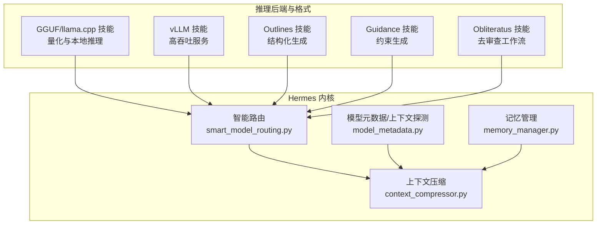
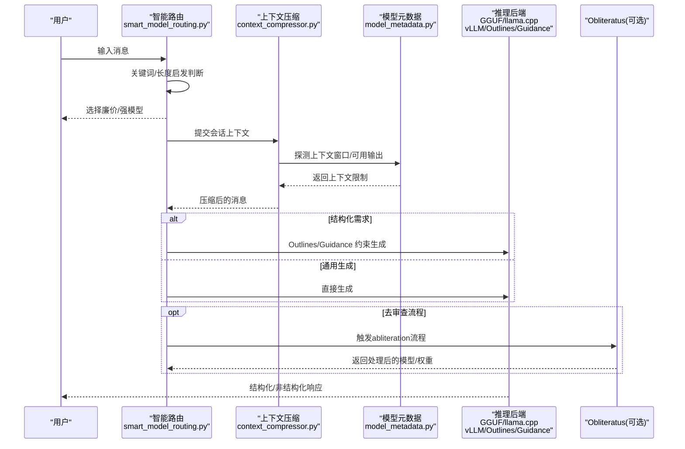
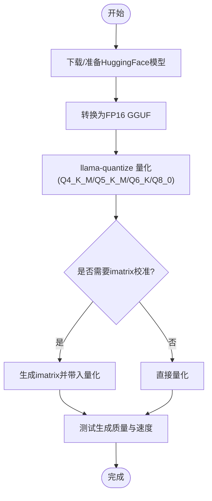
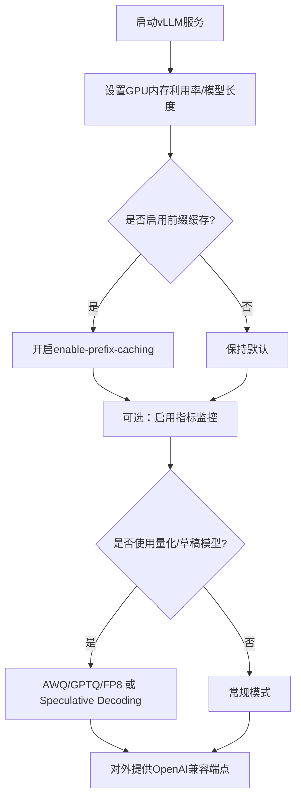
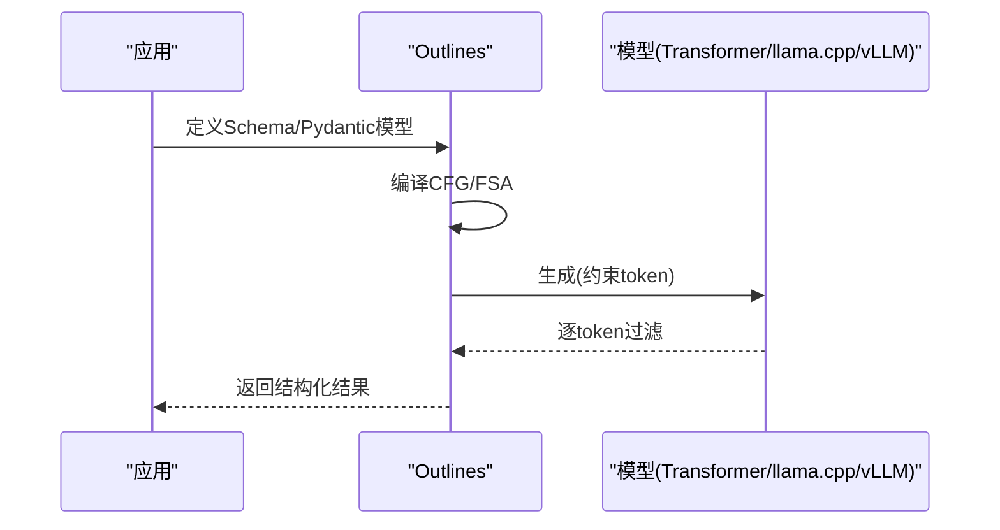
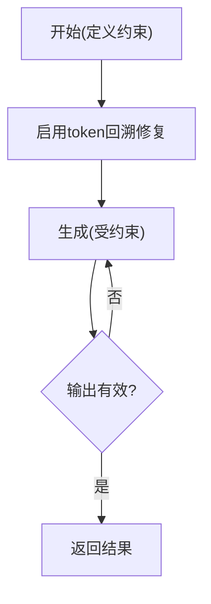
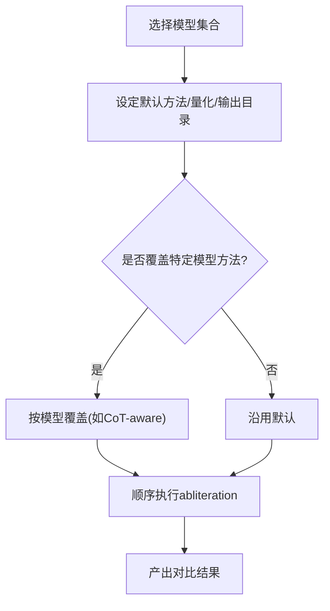
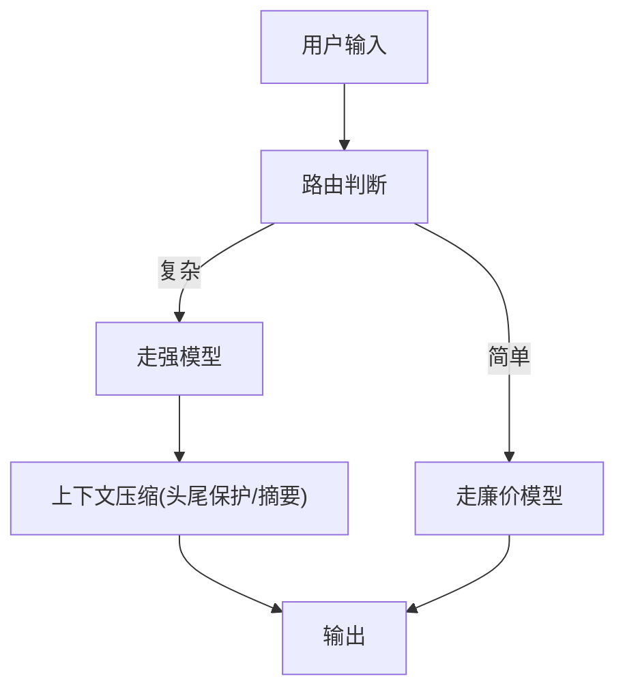
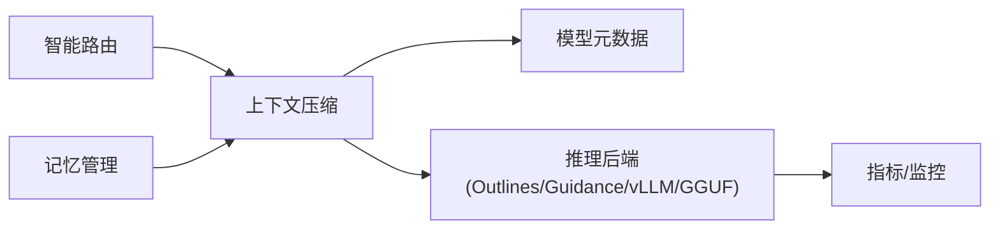

# 推理优化

<cite>
**本文引用的文件**
- [skills/mlops/inference/gguf/SKILL.md](file://skills/mlops/inference/gguf/SKILL.md)
- [skills/mlops/inference/llama-cpp/references/quantization.md](file://skills/mlops/inference/llama-cpp/references/quantization.md)
- [skills/mlops/inference/outlines/SKILL.md](file://skills/mlops/inference/outlines/SKILL.md)
- [skills/mlops/inference/outlines/references/backends.md](file://skills/mlops/inference/outlines/references/backends.md)
- [skills/mlops/inference/vllm/SKILL.md](file://skills/mlops/inference/vllm/SKILL.md)
- [skills/mlops/inference/vllm/references/optimization.md](file://skills/mlops/inference/vllm/references/optimization.md)
- [skills/mlops/inference/guidance/SKILL.md](file://skills/mlops/inference/guidance/SKILL.md)
- [skills/mlops/inference/obliteratus/SKILL.md](file://skills/mlops/inference/obliteratus/SKILL.md)
- [skills/mlops/inference/obliteratus/templates/batch-abliteration.yaml](file://skills/mlops/inference/obliteratus/templates/batch-abliteration.yaml)
- [agent/smart_model_routing.py](file://agent/smart_model_routing.py)
- [agent/context_compressor.py](file://agent/context_compressor.py)
- [agent/model_metadata.py](file://agent/model_metadata.py)
- [agent/memory_manager.py](file://agent/memory_manager.py)
- [optional-skills/mlops/tensorrt-llm/references/multi-gpu.md](file://optional-skills/mlops/tensorrt-llm/references/multi-gpu.md)
- [skills/mlops/training/axolotl/references/other.md](file://skills/mlops/training/axolotl/references/other.md)
- [skills/mlops/training/unsloth/references/llms-txt.md](file://skills/mlops/training/unsloth/references/llms-txt.md)
</cite>

## 目录
1. [引言](#引言)
2. [项目结构](#项目结构)
3. [核心组件](#核心组件)
4. [架构总览](#架构总览)
5. [详细组件分析](#详细组件分析)
6. [依赖分析](#依赖分析)
7. [性能考虑](#性能考虑)
8. [故障排查指南](#故障排查指南)
9. [结论](#结论)
10. [附录](#附录)

## 引言
本文件面向Hermes Agent在本地与云端部署中的推理优化实践，系统梳理GGUF格式与llama.cpp量化、vLLM高吞吐服务、Outlines与Guidance结构化生成、以及Obliteratus“去审查”工作流，并结合Hermes内置的上下文压缩、路由与元数据探测能力，给出量化技术、模型压缩、批处理优化与内存管理策略的实操指南。文档同时提供不同场景下的方案选择建议与最佳实践，帮助读者在延迟与吞吐之间取得平衡。

## 项目结构
围绕推理优化的关键模块分布于以下位置：
- 推理后端与格式：skills/mlops/inference 下的 gguf、vllm、outlines、guidance、obliteratus 技能与参考文档
- 上下文与路由：agent 目录下的 smart_model_routing.py、context_compressor.py、model_metadata.py、memory_manager.py
- 高级推理与训练：optional-skills/mlops/tensorrt-llm、skills/mlops/training/axolotl、unsloth 等参考材料
- 批处理评估：batch_runner.py（用于离线批量推理）

图示来源
- [skills/mlops/inference/gguf/SKILL.md](file://skills/mlops/inference/gguf/SKILL.md)
- [skills/mlops/inference/vllm/SKILL.md](file://skills/mlops/inference/vllm/SKILL.md)
- [skills/mlops/inference/outlines/SKILL.md](file://skills/mlops/inference/outlines/SKILL.md)
- [skills/mlops/inference/guidance/SKILL.md](file://skills/mlops/inference/guidance/SKILL.md)
- [skills/mlops/inference/obliteratus/SKILL.md](file://skills/mlops/inference/obliteratus/SKILL.md)
- [agent/smart_model_routing.py](file://agent/smart_model_routing.py)
- [agent/context_compressor.py](file://agent/context_compressor.py)
- [agent/model_metadata.py](file://agent/model_metadata.py)
- [agent/memory_manager.py](file://agent/memory_manager.py)

章节来源
- [skills/mlops/inference/gguf/SKILL.md](file://skills/mlops/inference/gguf/SKILL.md)
- [skills/mlops/inference/vllm/SKILL.md](file://skills/mlops/inference/vllm/SKILL.md)
- [skills/mlops/inference/outlines/SKILL.md](file://skills/mlops/inference/outlines/SKILL.md)
- [skills/mlops/inference/guidance/SKILL.md](file://skills/mlops/inference/guidance/SKILL.md)
- [skills/mlops/inference/obliteratus/SKILL.md](file://skills/mlops/inference/obliteratus/SKILL.md)
- [agent/smart_model_routing.py](file://agent/smart_model_routing.py)
- [agent/context_compressor.py](file://agent/context_compressor.py)
- [agent/model_metadata.py](file://agent/model_metadata.py)
- [agent/memory_manager.py](file://agent/memory_manager.py)

## 核心组件
- GGUF/llama.cpp：以GGUF为统一格式，支持K-quant混合精度量化，兼顾CPU/GPU/Apple Silicon多平台推理，适合边缘与低资源环境。
- vLLM：基于PagedAttention与连续批处理，实现高吞吐低延迟；支持OpenAI兼容端点、前缀缓存、指标监控与多GPU张量并行。
- Outlines：以有限状态机(FSM)在logit层过滤无效token，零开销保证结构化输出（JSON/Pydantic/正则），加速且准确。
- Guidance：通过正则/语法约束与token回溯修复，降低无效token浪费，适合复杂工作流与多步推理。
- Obliteratus：提供多种“去审查”方法（如informed、surgical、nuclear）与批量配置模板，便于对比与规模化部署。
- 智能路由：根据用户输入复杂度与关键词启发，自动选择廉价模型或强模型，减少不必要的高成本调用。
- 上下文压缩：对长对话进行损失性摘要压缩，保护头尾消息，动态预算分配，避免API配额与上下文溢出。
- 模型元数据与探测：从多源获取上下文窗口、最大输出、定价信息，支持错误解析与本地服务器类型识别。
- 记忆管理：统一编排内置与外部记忆提供者，保障工具schema一致性与跨提供者容错。

章节来源
- [skills/mlops/inference/gguf/SKILL.md](file://skills/mlops/inference/gguf/SKILL.md)
- [skills/mlops/inference/llama-cpp/references/quantization.md](file://skills/mlops/inference/llama-cpp/references/quantization.md)
- [skills/mlops/inference/vllm/SKILL.md](file://skills/mlops/inference/vllm/SKILL.md)
- [skills/mlops/inference/outlines/SKILL.md](file://skills/mlops/inference/outlines/SKILL.md)
- [skills/mlops/inference/outlines/references/backends.md](file://skills/mlops/inference/outlines/references/backends.md)
- [skills/mlops/inference/guidance/SKILL.md](file://skills/mlops/inference/guidance/SKILL.md)
- [skills/mlops/inference/obliteratus/SKILL.md](file://skills/mlops/inference/obliteratus/SKILL.md)
- [skills/mlops/inference/obliteratus/templates/batch-abliteration.yaml](file://skills/mlops/inference/obliteratus/templates/batch-abliteration.yaml)
- [agent/smart_model_routing.py](file://agent/smart_model_routing.py)
- [agent/context_compressor.py](file://agent/context_compressor.py)
- [agent/model_metadata.py](file://agent/model_metadata.py)
- [agent/memory_manager.py](file://agent/memory_manager.py)

## 架构总览
下图展示从用户输入到最终响应的推理链路，涵盖路由、上下文压缩、结构化生成与后端执行：

图示来源
- [agent/smart_model_routing.py](file://agent/smart_model_routing.py)
- [agent/context_compressor.py](file://agent/context_compressor.py)
- [agent/model_metadata.py](file://agent/model_metadata.py)
- [skills/mlops/inference/outlines/SKILL.md](file://skills/mlops/inference/outlines/SKILL.md)
- [skills/mlops/inference/guidance/SKILL.md](file://skills/mlops/inference/guidance/SKILL.md)
- [skills/mlops/inference/gguf/SKILL.md](file://skills/mlops/inference/gguf/SKILL.md)
- [skills/mlops/inference/vllm/SKILL.md](file://skills/mlops/inference/vllm/SKILL.md)
- [skills/mlops/inference/obliteratus/SKILL.md](file://skills/mlops/inference/obliteratus/SKILL.md)

## 详细组件分析

### 组件A：GGUF与llama.cpp量化
- GGUF作为llama.cpp的标准格式，支持K-quant混合精度量化（Q4_K_M/Q5_K_M/Q6_K/Q8_0），兼顾质量与体积。
- 重要量化类型与推荐：K-quant系列（S/M/L变体）、Legacy（Q4_0/Q5_0）；推荐Q4_K_M/Q5_K_M作为通用平衡。
- 转换与量化工作流：HF模型转FP16 GGUF → llama-quantize量化；支持imatrix校准提升低比特质量。
- Python绑定与运行：llama-cpp-python加载GGUF模型，控制n_ctx、n_gpu_layers、n_threads等参数。
- 适用场景：CPU/边缘设备、Apple Silicon、无需GPU的本地部署。

图示来源
- [skills/mlops/inference/gguf/SKILL.md](file://skills/mlops/inference/gguf/SKILL.md)
- [skills/mlops/inference/llama-cpp/references/quantization.md](file://skills/mlops/inference/llama-cpp/references/quantization.md)

章节来源
- [skills/mlops/inference/gguf/SKILL.md](file://skills/mlops/inference/gguf/SKILL.md)
- [skills/mlops/inference/llama-cpp/references/quantization.md](file://skills/mlops/inference/llama-cpp/references/quantization.md)

### 组件B：vLLM高吞吐服务
- 核心特性：PagedAttention块式KV缓存、连续批处理、OpenAI兼容端点、前缀缓存、指标监控。
- 典型配置：gpu-memory-utilization、max-model-len、tensor-parallel-size、enable-prefix-caching、enable-metrics。
- 量化与加速：AWQ/GPTQ/FP8，Speculative Decoding（草稿模型），Chunked Prefill（长提示）。
- 硬件与并行：单/多GPU，NVLink优先，TP大小需满足拓扑要求；硬件门槛较高但吞吐显著提升。
- 适用场景：生产API、多用户聊天、低延迟高并发。

图示来源
- [skills/mlops/inference/vllm/SKILL.md](file://skills/mlops/inference/vllm/SKILL.md)
- [skills/mlops/inference/vllm/references/optimization.md](file://skills/mlops/inference/vllm/references/optimization.md)
- [optional-skills/mlops/tensorrt-llm/references/multi-gpu.md](file://optional-skills/mlops/tensorrt-llm/references/multi-gpu.md)

章节来源
- [skills/mlops/inference/vllm/SKILL.md](file://skills/mlops/inference/vllm/SKILL.md)
- [skills/mlops/inference/vllm/references/optimization.md](file://skills/mlops/inference/vllm/references/optimization.md)
- [optional-skills/mlops/tensorrt-llm/references/multi-gpu.md](file://optional-skills/mlops/tensorrt-llm/references/multi-gpu.md)

### 组件C：Outlines结构化生成
- 核心机制：将Schema/正则映射为CFG/FSA，在logit层过滤无效token，零开销保证输出有效。
- 支持后端：Transformers、llama.cpp、vLLM；与Pydantic无缝集成。
- 性能收益：1.2-2x更快，无重试循环，确定性路径直达有效输出。
- 适用场景：需要严格结构化输出（JSON/Pydantic/正则）的任务。

图示来源
- [skills/mlops/inference/outlines/SKILL.md](file://skills/mlops/inference/outlines/SKILL.md)
- [skills/mlops/inference/outlines/references/backends.md](file://skills/mlops/inference/outlines/references/backends.md)

章节来源
- [skills/mlops/inference/outlines/SKILL.md](file://skills/mlops/inference/outlines/SKILL.md)
- [skills/mlops/inference/outlines/references/backends.md](file://skills/mlops/inference/outlines/references/backends.md)

### 组件D：Guidance约束生成
- 核心能力：正则/语法约束、选择约束、token回溯修复（token healing）、多步工作流。
- 优势：自然的上下文管理、减少无效token、降低传统提示的延迟与不确定性。
- 适用场景：复杂工作流、多轮推理、格式强制（日期/邮箱/电话号等）。

图示来源
- [skills/mlops/inference/guidance/SKILL.md](file://skills/mlops/inference/guidance/SKILL.md)

章节来源
- [skills/mlops/inference/guidance/SKILL.md](file://skills/mlops/inference/guidance/SKILL.md)

### 组件E：Obliteratus去审查工作流
- 方法族：informed、surgical、nuclear等，针对不同模型架构与任务目标。
- 批量配置：通过YAML模板统一管理多模型、方法与量化参数，便于对比实验。
- 适用场景：研究/实验目的的拒绝机制分析与对比，需谨慎评估合规风险。

图示来源
- [skills/mlops/inference/obliteratus/SKILL.md](file://skills/mlops/inference/obliteratus/SKILL.md)
- [skills/mlops/inference/obliteratus/templates/batch-abliteration.yaml](file://skills/mlops/inference/obliteratus/templates/batch-abliteration.yaml)

章节来源
- [skills/mlops/inference/obliteratus/SKILL.md](file://skills/mlops/inference/obliteratus/SKILL.md)
- [skills/mlops/inference/obliteratus/templates/batch-abliteration.yaml](file://skills/mlops/inference/obliteratus/templates/batch-abliteration.yaml)

### 组件F：智能路由与上下文压缩
- 智能路由：基于简单文本启发（字符数/单词数/换行/代码片段/URL/复杂关键词）自动切换廉价模型，降低成本。
- 上下文压缩：工具输出预裁剪、头尾保护（按token预算）、结构化摘要、迭代更新、工具调用对齐。
- 模型元数据：多源探测上下文窗口、最大输出、定价与本地服务器类型识别，支持错误解析与缓存。

图示来源
- [agent/smart_model_routing.py](file://agent/smart_model_routing.py)
- [agent/context_compressor.py](file://agent/context_compressor.py)
- [agent/model_metadata.py](file://agent/model_metadata.py)

章节来源
- [agent/smart_model_routing.py](file://agent/smart_model_routing.py)
- [agent/context_compressor.py](file://agent/context_compressor.py)
- [agent/model_metadata.py](file://agent/model_metadata.py)

## 依赖分析
- 后端耦合：Outlines/Guidance可对接Transformers、llama.cpp、vLLM；vLLM与TensorRT-LLM在多GPU场景互补。
- 上下文耦合：上下文压缩依赖模型元数据探测与路由结果；记忆管理为外部插件提供统一接口。
- 外部依赖：OpenRouter、models.dev、本地服务器探测（/models、/api/tags、/v1/props、/version）。

图示来源
- [agent/smart_model_routing.py](file://agent/smart_model_routing.py)
- [agent/context_compressor.py](file://agent/context_compressor.py)
- [agent/model_metadata.py](file://agent/model_metadata.py)
- [agent/memory_manager.py](file://agent/memory_manager.py)
- [skills/mlops/inference/outlines/SKILL.md](file://skills/mlops/inference/outlines/SKILL.md)
- [skills/mlops/inference/guidance/SKILL.md](file://skills/mlops/inference/guidance/SKILL.md)
- [skills/mlops/inference/vllm/SKILL.md](file://skills/mlops/inference/vllm/SKILL.md)
- [skills/mlops/inference/gguf/SKILL.md](file://skills/mlops/inference/gguf/SKILL.md)

章节来源
- [agent/smart_model_routing.py](file://agent/smart_model_routing.py)
- [agent/context_compressor.py](file://agent/context_compressor.py)
- [agent/model_metadata.py](file://agent/model_metadata.py)
- [agent/memory_manager.py](file://agent/memory_manager.py)
- [skills/mlops/inference/outlines/SKILL.md](file://skills/mlops/inference/outlines/SKILL.md)
- [skills/mlops/inference/guidance/SKILL.md](file://skills/mlops/inference/guidance/SKILL.md)
- [skills/mlops/inference/vllm/SKILL.md](file://skills/mlops/inference/vllm/SKILL.md)
- [skills/mlops/inference/gguf/SKILL.md](file://skills/mlops/inference/gguf/SKILL.md)

## 性能考虑
- 延迟优化
  - Outlines/Guidance：零开销约束，减少无效token与重试，显著降低首token时间。
  - vLLM：启用前缀缓存、chunked prefill、指标监控；合理设置gpu-memory-utilization与max-num-seqs。
  - GGUF：选择合适量化（Q4_K_M/Q5_K_M）与GPU层数，利用imatrix提升低比特质量。
- 吞吐量提升
  - vLLM：连续批处理、PagedAttention、tensor并行、Speculative Decoding、指标驱动的并发调整。
  - 批处理：使用batch_runner.py进行离线批量推理，合理设置batch_size与num_workers。
- 内存管理
  - vLLM：通过block-size、gpu-memory-utilization与KV缓存共享减少碎片；前缀缓存复用公共前缀。
  - 上下文压缩：工具输出预裁剪、tail token预算保护、迭代摘要更新，避免历史冗余。
  - 训练技巧迁移：梯度累积（gradient accumulation）在训练中缓解显存压力，推理阶段可类比为“分段生成/批内累积”。

章节来源
- [skills/mlops/inference/outlines/SKILL.md](file://skills/mlops/inference/outlines/SKILL.md)
- [skills/mlops/inference/guidance/SKILL.md](file://skills/mlops/inference/guidance/SKILL.md)
- [skills/mlops/inference/vllm/SKILL.md](file://skills/mlops/inference/vllm/SKILL.md)
- [skills/mlops/inference/vllm/references/optimization.md](file://skills/mlops/inference/vllm/references/optimization.md)
- [agent/context_compressor.py](file://agent/context_compressor.py)
- [skills/mlops/training/axolotl/references/other.md](file://skills/mlops/training/axolotl/references/other.md)

## 故障排查指南
- vLLM常见问题
  - 显存不足：降低gpu-memory-utilization或启用量化；检查tensor并行是否为2的幂次。
  - 首token慢：启用enable-prefix-caching；对长提示启用enable-chunked-prefill。
  - 模型未找到：使用--trust-remote-code加载自定义模型。
  - 吞吐低：增大max-num-seqs；检查GPU利用率>80%。
- GGUF/llama.cpp
  - 低比特质量差：使用imatrix校准；选择更高量化等级（Q5_K_M/Q6_K/Q8_0）。
  - GPU offload不生效：确认n_gpu_layers与构建选项匹配。
- Outlines/Guidance
  - 输出无效：检查Schema/正则是否过严；适当放宽约束或使用token healing。
- 上下文溢出
  - 使用上下文压缩与tail token预算；必要时降低阈值比例或缩短摘要目标占比。
- 模型元数据探测失败
  - 检查本地服务器类型识别（/models、/api/tags、/v1/props、/version）；解析错误信息提取上下文上限。

章节来源
- [skills/mlops/inference/vllm/SKILL.md](file://skills/mlops/inference/vllm/SKILL.md)
- [skills/mlops/inference/gguf/SKILL.md](file://skills/mlops/inference/gguf/SKILL.md)
- [skills/mlops/inference/outlines/SKILL.md](file://skills/mlops/inference/outlines/SKILL.md)
- [skills/mlops/inference/guidance/SKILL.md](file://skills/mlops/inference/guidance/SKILL.md)
- [agent/context_compressor.py](file://agent/context_compressor.py)
- [agent/model_metadata.py](file://agent/model_metadata.py)

## 结论
Hermes Agent在推理优化方面形成了“路由—压缩—结构化—后端”的闭环：通过智能路由降低成本，借助上下文压缩与元数据探测规避溢出，配合Outlines/Guidance实现零开销结构化生成，最后由vLLM或GGUF/llama.cpp在不同硬件上实现高效推理。对于大规模部署，优先采用vLLM并结合前缀缓存与连续批处理；对于边缘与低资源场景，GGUF+imatrix量化是稳健之选；当需要严格结构化输出时，Outlines/Guidance提供了确定性的加速路径。

## 附录
- 场景选择建议
  - 单用户/低延迟：llama.cpp（GGUF+imatrix）
  - 生产API/高吞吐：vLLM（PagedAttention+连续批处理）
  - 结构化输出：Outlines（Pydantic/JSON Schema/正则）
  - 复杂工作流：Guidance（token healing/多步推理）
  - 实验性去审查：Obliteratus（informed/surgical/nuclear）
- 最佳实践
  - 先路由再压缩，再结构化，最后后端执行
  - 量化与KV缓存策略需与硬件匹配
  - 通过指标监控持续调参，逐步逼近最优