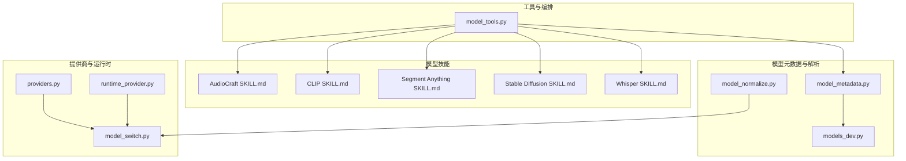
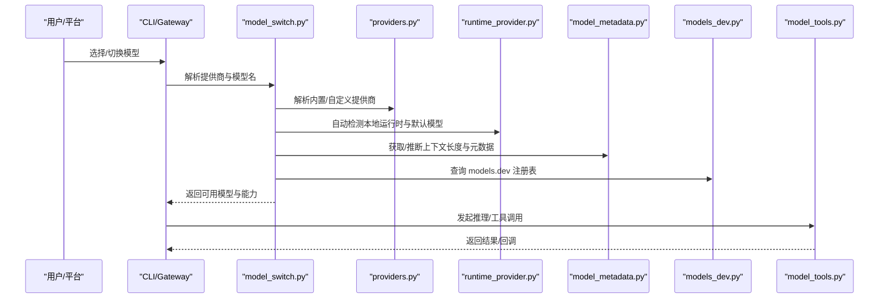
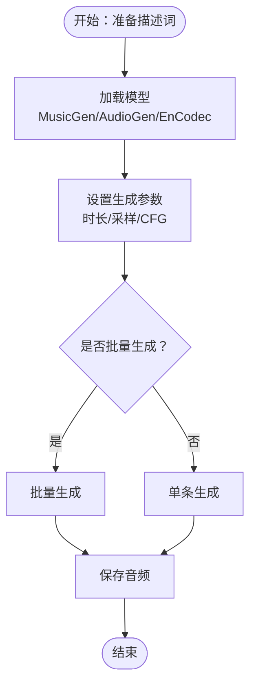
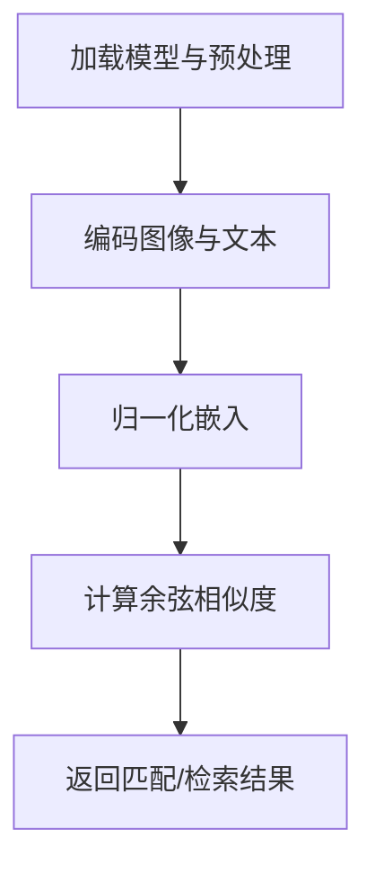
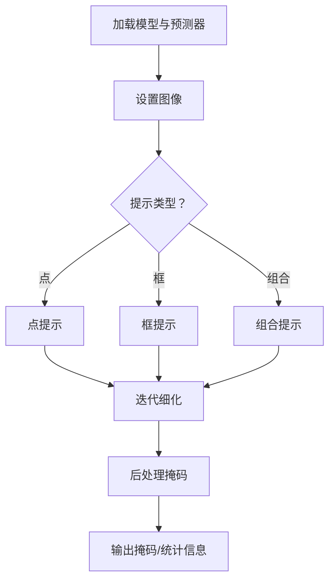
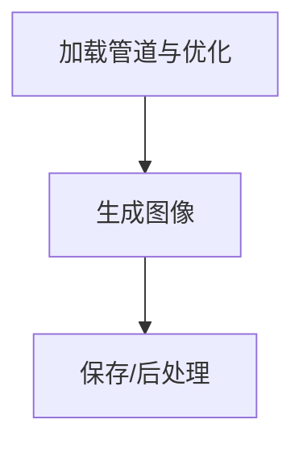
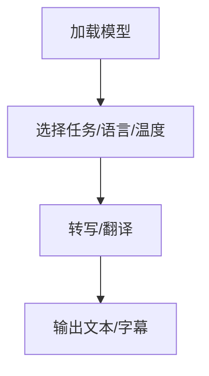
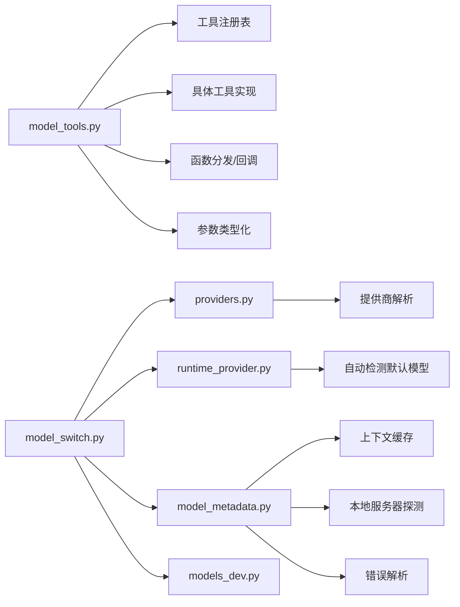

# 模型管理

<cite>
**本文引用的文件**
- [model_tools.py](file://model_tools.py)
- [SKILL.md（AudioCraft）](file://skills/mlops/models/audiocraft/SKILL.md)
- [SKILL.md（CLIP）](file://skills/mlops/models/clip/SKILL.md)
- [SKILL.md（Segment Anything）](file://skills/mlops/models/segment-anything/SKILL.md)
- [SKILL.md（Stable Diffusion）](file://skills/mlops/models/stable-diffusion/SKILL.md)
- [SKILL.md（Whisper）](file://skills/mlops/models/whisper/SKILL.md)
- [model_metadata.py](file://agent/model_metadata.py)
- [model_normalize.py](file://hermes_cli/model_normalize.py)
- [providers.py](file://hermes_cli/providers.py)
- [model_switch.py](file://hermes_cli/model_switch.py)
- [models_dev.py](file://agent/models_dev.py)
- [runtime_provider.py](file://hermes_cli/runtime_provider.py)
- [README.md（项目根目录）](file://README.md)
</cite>

## 目录
1. [简介](#简介)
2. [项目结构](#项目结构)
3. [核心组件](#核心组件)
4. [架构总览](#架构总览)
5. [详细组件分析](#详细组件分析)
6. [依赖分析](#依赖分析)
7. [性能考虑](#性能考虑)
8. [故障排查指南](#故障排查指南)
9. [结论](#结论)
10. [附录](#附录)

## 简介
本文件面向Hermes Agent的“模型管理”能力，系统化梳理并指导如何在该框架下完成以下任务：
- 音频类：AudioCraft（MusicGen/AudioGen/EnCodec）
- 视觉类：CLIP、Segment Anything（SAM）
- 图像生成类：Stable Diffusion（Diffusers）
- 语音类：Whisper（ASR/翻译/语言识别）

内容覆盖从安装依赖、模型下载与配置、推理与微调到版本控制、依赖管理、兼容性处理、部署监控与生命周期管理的全流程最佳实践，并提供不同模型类型的使用场景与性能对比建议。

## 项目结构
围绕模型管理的关键模块与技能文件如下：
- 工具层与模型编排：model_tools.py
- 模型技能文档：各模型的 SKILL.md（AudioCraft、CLIP、SAM、Stable Diffusion、Whisper）
- 模型元数据与上下文长度解析：agent/model_metadata.py
- 模型名标准化与提供商映射：hermes_cli/model_normalize.py
- 提供商解析与运行时提供者检测：hermes_cli/providers.py、hermes_cli/runtime_provider.py
- 模型切换与验证：hermes_cli/model_switch.py
- 模型注册表与元数据缓存：agent/models_dev.py

图表来源
- [model_tools.py:1-578](file://model_tools.py#L1-L578)
- [SKILL.md（AudioCraft）:1-568](file://skills/mlops/models/audiocraft/SKILL.md#L1-L568)
- [SKILL.md（CLIP）:1-257](file://skills/mlops/models/clip/SKILL.md#L1-L257)
- [SKILL.md（Segment Anything）:1-504](file://skills/mlops/models/segment-anything/SKILL.md#L1-L504)
- [SKILL.md（Stable Diffusion）:1-523](file://skills/mlops/models/stable-diffusion/SKILL.md#L1-L523)
- [SKILL.md（Whisper）:1-321](file://skills/mlops/models/whisper/SILL.md#L1-L321)
- [model_metadata.py:1-800](file://agent/model_metadata.py#L1-L800)
- [model_normalize.py:1-392](file://hermes_cli/model_normalize.py#L1-L392)
- [models_dev.py:1-680](file://agent/models_dev.py#L1-L680)
- [providers.py:320-519](file://hermes_cli/providers.py#L320-L519)
- [runtime_provider.py:78-108](file://hermes_cli/runtime_provider.py#L78-L108)
- [model_switch.py:383-697](file://hermes_cli/model_switch.py#L383-L697)

章节来源
- [model_tools.py:1-578](file://model_tools.py#L1-L578)
- [model_metadata.py:1-800](file://agent/model_metadata.py#L1-L800)
- [model_normalize.py:1-392](file://hermes_cli/model_normalize.py#L1-L392)
- [models_dev.py:1-680](file://agent/models_dev.py#L1-L680)
- [providers.py:320-519](file://hermes_cli/providers.py#L320-L519)
- [runtime_provider.py:78-108](file://hermes_cli/runtime_provider.py#L78-L108)
- [model_switch.py:383-697](file://hermes_cli/model_switch.py#L383-L697)

## 核心组件
- 工具发现与分发：model_tools.py 负责导入各工具模块、构建工具定义、类型化参数转换与函数调用分发，是模型推理与工具链的统一入口。
- 模型元数据与上下文长度：model_metadata.py 提供默认上下文长度、错误解析、本地服务器探测、端点元数据抓取与缓存等能力，保障长上下文会话稳定。
- 模型名标准化：model_normalize.py 将用户输入的模型名按提供商规范进行标准化（如点转连字符、添加 vendor/ 前缀、DeepSeek 归一化等）。
- 提供商解析与运行时检测：providers.py 解析内置/自定义提供商；runtime_provider.py 自动检测本地运行时（Ollama/LM Studio/vLLM/llama.cpp），并修正默认模型。
- 模型切换与验证：model_switch.py 完成“提供商解析—凭据—别名/聚合器—检测—元数据—结果构建”的完整切换链路。
- 模型注册表与缓存：models_dev.py 提供 models.dev 注册表的拉取、缓存与查询，作为模型能力与元数据来源之一。

章节来源
- [model_tools.py:1-578](file://model_tools.py#L1-L578)
- [model_metadata.py:1-800](file://agent/model_metadata.py#L1-L800)
- [model_normalize.py:1-392](file://hermes_cli/model_normalize.py#L1-L392)
- [providers.py:320-519](file://hermes_cli/providers.py#L320-L519)
- [runtime_provider.py:78-108](file://hermes_cli/runtime_provider.py#L78-L108)
- [model_switch.py:383-697](file://hermes_cli/model_switch.py#L383-L697)
- [models_dev.py:1-680](file://agent/models_dev.py#L1-L680)

## 架构总览
Hermes Agent 的模型管理以“工具层 + 模型技能 + 元数据与提供商解析 + 切换与缓存”为核心闭环，形成可扩展、可观测、可迁移的模型生命周期管理。

图表来源
- [model_switch.py:383-697](file://hermes_cli/model_switch.py#L383-L697)
- [providers.py:320-519](file://hermes_cli/providers.py#L320-L519)
- [runtime_provider.py:78-108](file://hermes_cli/runtime_provider.py#L78-L108)
- [model_metadata.py:1-800](file://agent/model_metadata.py#L1-L800)
- [models_dev.py:1-680](file://agent/models_dev.py#L1-L680)
- [model_tools.py:1-578](file://model_tools.py#L1-L578)

## 详细组件分析

### AudioCraft（音频生成）
- 使用场景：文本到音乐（MusicGen）、文本到音效（AudioGen）、音频压缩（EnCodec）。
- 关键特性：多尺寸模型（小/中/大/立体声/风格转移）、采样参数（top_k/top_p/温度/CFG）、批量生成、半精度优化。
- 推理流程要点：加载预训练模型、设置生成参数、批量生成、保存输出。
- 性能优化：使用更小模型、减少时长、半精度、批量处理、清理显存。
- 兼容性：支持 HuggingFace Transformers 与原生 Audiocraft；注意采样率与设备（CPU/GPU）。

图表来源
- [SKILL.md（AudioCraft）:57-126](file://skills/mlops/models/audiocraft/SKILL.md#L57-L126)
- [SKILL.md（AudioCraft）:175-270](file://skills/mlops/models/audiocraft/SKILL.md#L175-L270)
- [SKILL.md（AudioCraft）:315-370](file://skills/mlops/models/audiocraft/SKILL.md#L315-L370)

章节来源
- [SKILL.md（AudioCraft）:1-568](file://skills/mlops/models/audiocraft/SKILL.md#L1-L568)

### CLIP（视觉-语言）
- 使用场景：零样本图像分类、图文相似度、跨模态检索、内容审核。
- 关键特性：ViT/RN 系列模型、嵌入归一化、批处理、与向量库集成。
- 推理流程要点：加载模型与预处理、编码图像与文本、计算相似度、检索排序。
- 性能优化：ViT-B/32 平衡速度与质量；GPU 加速；批处理；缓存嵌入。
- 兼容性：torch/torchvision/ftfy/regex/tqdm；注意预处理一致性。

图表来源
- [SKILL.md（CLIP）:48-78](file://skills/mlops/models/clip/SKILL.md#L48-L78)
- [SKILL.md（CLIP）:101-146](file://skills/mlops/models/clip/SKILL.md#L101-L146)
- [SKILL.md（CLIP）:173-195](file://skills/mlops/models/clip/SKILL.md#L173-L195)

章节来源
- [SKILL.md（CLIP）:1-257](file://skills/mlops/models/clip/SKILL.md#L1-L257)

### Segment Anything（SAM，图像分割）
- 使用场景：零样本对象分割、交互式标注、自动掩码生成、ONNX 部署。
- 关键特性：点/框/掩码提示、自动掩码生成、多尺寸模型（ViT-B/L/H）、ONNX 导出。
- 推理流程要点：加载模型与预测器、设置图像、点/框提示、迭代细化、后处理掩码。
- 性能优化：ViT-B 更快；半精度；降低 points_per_side；ONNX 推理。
- 兼容性：OpenCV/PyCOCOTools/matplotlib 可选；注意分辨率与提示坐标。

图表来源
- [SKILL.md（Segment Anything）:70-100](file://skills/mlops/models/segment-anything/SKILL.md#L70-L100)
- [SKILL.md（Segment Anything）:165-232](file://skills/mlops/models/segment-anything/SKILL.md#L165-L232)
- [SKILL.md（Segment Anything）:234-283](file://skills/mlops/models/segment-anything/SKILL.md#L234-L283)

章节来源
- [SKILL.md（Segment Anything）:1-504](file://skills/mlops/models/segment-anything/SKILL.md#L1-L504)

### Stable Diffusion（图像生成）
- 使用场景：文本到图像、图像到图像、修复/扩图、ControlNet/LoRA 微调。
- 关键特性：Diffusers 管道、调度器、VAE 切片、内存优化、多模型族（SD 1.x/SDXL/SD 3.0/Flux）。
- 推理流程要点：加载管道、设置精度与优化、生成图像、保存输出。
- 性能优化：启用 CPU 卸载/注意力切片/xFormers；VAE 切片；FP16/BF16；快速调度器（如 LCM）。
- 兼容性：diffusers/transformers/acCELERATE/torch；注意高度/宽度需为 8 的倍数。

图表来源
- [SKILL.md（Stable Diffusion）:51-96](file://skills/mlops/models/stable-diffusion/SKILL.md#L51-L96)
- [SKILL.md（Stable Diffusion）:167-193](file://skills/mlops/models/stable-diffusion/SKILL.md#L167-L193)
- [SKILL.md（Stable Diffusion）:331-366](file://skills/mlops/models/stable-diffusion/SKILL.md#L331-L366)

章节来源
- [SKILL.md（Stable Diffusion）:1-523](file://skills/mlops/models/stable-diffusion/SKILL.md#L1-L523)

### Whisper（语音识别）
- 使用场景：多语言语音转写、英文翻译、字幕生成、实时流式转写。
- 关键特性：6 种模型大小（tiny/base/small/medium/large/turbo）、多语言、GPU 加速、命令行与库接口。
- 推理流程要点：加载模型、指定语言/任务、生成字幕或纯文本。
- 性能优化：turbo/base 优先；指定语言；GPU；更快实现 faster-whisper；分块处理长音频。
- 兼容性：openai-whisper/faster-whisper/ffmpeg；注意音频格式与采样率。

图表来源
- [SKILL.md（Whisper）:53-70](file://skills/mlops/models/whisper/SKILL.md#L53-L70)
- [SKILL.md（Whisper）:93-152](file://skills/mlops/models/whisper/SKILL.md#L93-L152)
- [SKILL.md（Whisper）:176-208](file://skills/mlops/models/whisper/SKILL.md#L176-L208)

章节来源
- [SKILL.md（Whisper）:1-321](file://skills/mlops/models/whisper/SKILL.md#L1-L321)

### 模型元数据与上下文长度解析
- 默认上下文长度与回退策略：针对未知模型采用层级探测（128K→64K→32K→16K→8K），确保会话稳定性。
- 错误解析：从错误消息中提取实际上下文上限与可用输出令牌数，区分“输入过长”与“输出过大”两类错误。
- 本地服务器探测：自动识别 Ollama/LM Studio/vLLM/llama.cpp，并读取其上下文长度。
- 缓存机制：持久化上下文长度到 YAML 文件，避免重复探测。

章节来源
- [model_metadata.py:1-800](file://agent/model_metadata.py#L1-L800)

### 模型名标准化与提供商映射
- 标准化规则：根据提供商类型（聚合器/Anthropic/Copilot/DeepSeek/自定义）对模型名进行前缀剥离、点转连字符、Canonical 化。
- 供应商前缀映射：将“claude/gpt/gemini/deepseek/qwen”等映射到聚合器期望的 vendor/model 格式。
- DeepSeek 特例：将通用别名映射到“deepseek-chat”或“deepseek-reasoner”。

章节来源
- [model_normalize.py:1-392](file://hermes_cli/model_normalize.py#L1-L392)

### 提供商解析与运行时检测
- 提供商解析：优先内置 models.dev，其次用户自定义 providers，再回退到自定义 providers 列表。
- 运行时检测：通过 /api/tags、/api/v1/models、/v1/props、/version 等端点识别本地服务类型，必要时修正默认模型。

章节来源
- [providers.py:320-519](file://hermes_cli/providers.py#L320-L519)
- [runtime_provider.py:78-108](file://hermes_cli/runtime_provider.py#L78-L108)

### 模型切换与验证
- 切换链路：显式提供商→凭据→目标提供商别名/聚合器→目录搜索→检测提供商→凭据→标准化→models.dev 元数据→构建结果。
- 验证：对请求模型进行接受性校验，收集警告信息，决定是否持久化切换。

章节来源
- [model_switch.py:383-697](file://hermes_cli/model_switch.py#L383-L697)

### 模型注册表与缓存
- models.dev 注册表：离线优先（磁盘缓存）→内存缓存（1小时）→网络抓取→后台刷新。
- 查询：按提供商/模型 ID 获取完整元数据，支持大小写不敏感回退。

章节来源
- [models_dev.py:1-680](file://agent/models_dev.py#L1-L680)

## 依赖分析
- 工具层依赖：model_tools.py 通过工具注册表集中管理工具发现、Schema 生成、参数类型化与执行回调。
- 模型技能依赖：各模型技能文档明确 Python 包依赖与版本范围，遵循最小可用原则。
- 元数据与提供商：model_metadata.py 与 providers.py/ runtime_provider.py 协作，保证上下文长度与提供商正确性。
- 切换与缓存：model_switch.py 串联 providers、runtime_provider、models_dev、model_metadata，形成闭环。

图表来源
- [model_tools.py:1-578](file://model_tools.py#L1-L578)
- [model_metadata.py:1-800](file://agent/model_metadata.py#L1-L800)
- [providers.py:320-519](file://hermes_cli/providers.py#L320-L519)
- [runtime_provider.py:78-108](file://hermes_cli/runtime_provider.py#L78-L108)
- [model_switch.py:383-697](file://hermes_cli/model_switch.py#L383-L697)
- [models_dev.py:1-680](file://agent/models_dev.py#L1-L680)

章节来源
- [model_tools.py:1-578](file://model_tools.py#L1-L578)
- [model_metadata.py:1-800](file://agent/model_metadata.py#L1-L800)
- [providers.py:320-519](file://hermes_cli/providers.py#L320-L519)
- [runtime_provider.py:78-108](file://hermes_cli/runtime_provider.py#L78-L108)
- [model_switch.py:383-697](file://hermes_cli/model_switch.py#L383-L697)
- [models_dev.py:1-680](file://agent/models_dev.py#L1-L680)

## 性能考虑
- 批量与并行：AudioCraft/Stable Diffusion/CLIP 支持批量处理，显著提升吞吐；Whisper 建议分块长音频。
- 精度与显存：半精度（FP16/BF16）与注意力切片、VAE 切片、CPU 卸载等可降低显存占用。
- 调度器与步数：Stable Diffusion 的调度器（如 DPM++、LCM）可显著缩短推理时间；Whisper turbo/base 在速度与质量间取得平衡。
- 本地加速：GPU 加速（10-20×）与更快实现（faster-whisper）可大幅提升实时性。
- 上下文长度：model_metadata.py 的层级探测与缓存避免反复探测，提升稳定性。

章节来源
- [SKILL.md（AudioCraft）:508-545](file://skills/mlops/models/audiocraft/SKILL.md#L508-L545)
- [SKILL.md（Stable Diffusion）:331-366](file://skills/mlops/models/stable-diffusion/SKILL.md#L331-L366)
- [SKILL.md（Whisper）:263-285](file://skills/mlops/models/whisper/SKILL.md#L263-L285)
- [model_metadata.py:1-800](file://agent/model_metadata.py#L1-L800)

## 故障排查指南
- CUDA 显存不足（OOM）：AudioCraft/Stable Diffusion 使用更小模型、降低时长/分辨率、启用 CPU 卸载/切片、半精度。
- 生成质量差：调整 CFG/温度/采样参数；改进提示词；Whisper 指定语言、初始提示。
- 本地服务器不可用：runtime_provider.py 自动检测失败时，检查端口与路径；确保 /api/tags、/models、/v1/props 端点可达。
- 上下文超限：model_metadata.py 的错误解析可识别“输入过长”与“输出过大”，前者压缩历史/减小窗口，后者降低 max_tokens。
- 模型名不匹配：使用 model_normalize.py 标准化模型名，避免聚合器/提供商差异导致的 404。

章节来源
- [SKILL.md（AudioCraft）:546-555](file://skills/mlops/models/audiocraft/SKILL.md#L546-L555)
- [SKILL.md（Stable Diffusion）:479-511](file://skills/mlops/models/stable-diffusion/SKILL.md#L479-L511)
- [SKILL.md（Whisper）:303-311](file://skills/mlops/models/whisper/SKILL.md#L303-L311)
- [runtime_provider.py:78-108](file://hermes_cli/runtime_provider.py#L78-L108)
- [model_metadata.py:610-679](file://agent/model_metadata.py#L610-L679)
- [model_normalize.py:1-392](file://hermes_cli/model_normalize.py#L1-L392)

## 结论
Hermes Agent 的模型管理以“工具层 + 技能文档 + 元数据与提供商解析 + 切换与缓存”为核心，形成可扩展、可观测、可迁移的模型生命周期管理方案。通过标准化模型名、自动检测本地运行时、层级探测上下文长度与 models.dev 元数据，结合各模型技能文档中的最佳实践，可在不同场景下高效完成模型下载、配置、推理与微调，并实现稳定的部署与运维。

## 附录
- 使用场景与性能对比（基于技能文档与实现细节）
  - AudioCraft：适合音乐/音效生成，GPU 加速显著；批量优于逐条。
  - CLIP：零样本图像理解，ViT-B/32 平衡速度与质量；批处理与嵌入缓存。
  - SAM：零样本分割，ViT-B 更快；ONNX 便于边缘部署。
  - Stable Diffusion：高质量文本到图像，调度器与精度优化显著影响速度；ControlNet/LoRA 微调增强可控性。
  - Whisper：多语言 ASR/翻译，turbo/base 优先；faster-whisper 提升实时性；分块处理长音频。

章节来源
- [SKILL.md（AudioCraft）:18-41](file://skills/mlops/models/audiocraft/SKILL.md#L18-L41)
- [SKILL.md（CLIP）:18-38](file://skills/mlops/models/clip/SKILL.md#L18-L38)
- [SKILL.md（Segment Anything）:18-41](file://skills/mlops/models/segment-anything/SKILL.md#L18-L41)
- [SKILL.md（Stable Diffusion）:18-41](file://skills/mlops/models/stable-diffusion/SKILL.md#L18-L41)
- [SKILL.md（Whisper）:18-38](file://skills/mlops/models/whisper/SKILL.md#L18-L38)