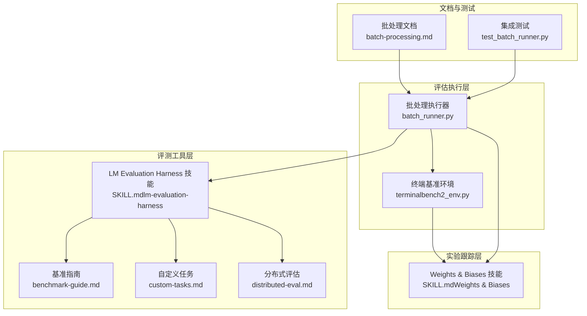
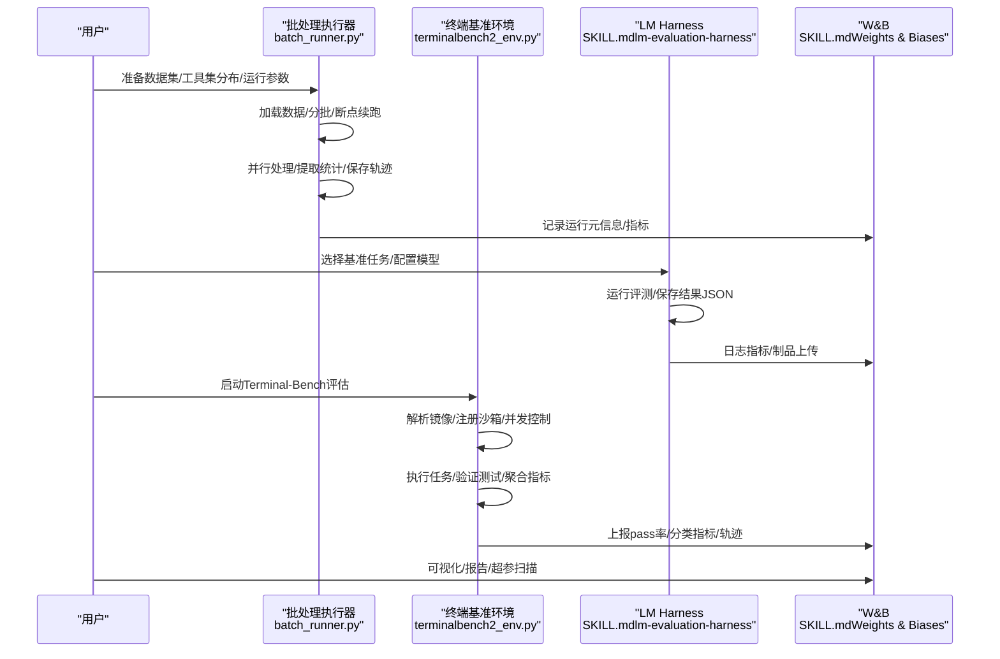
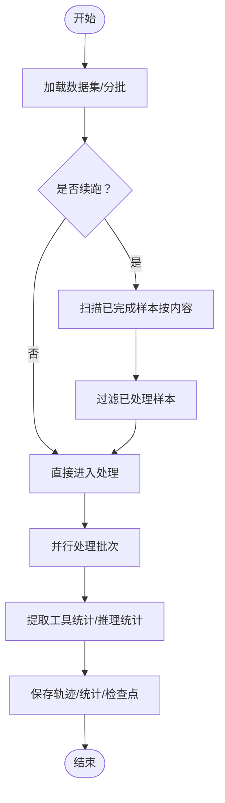
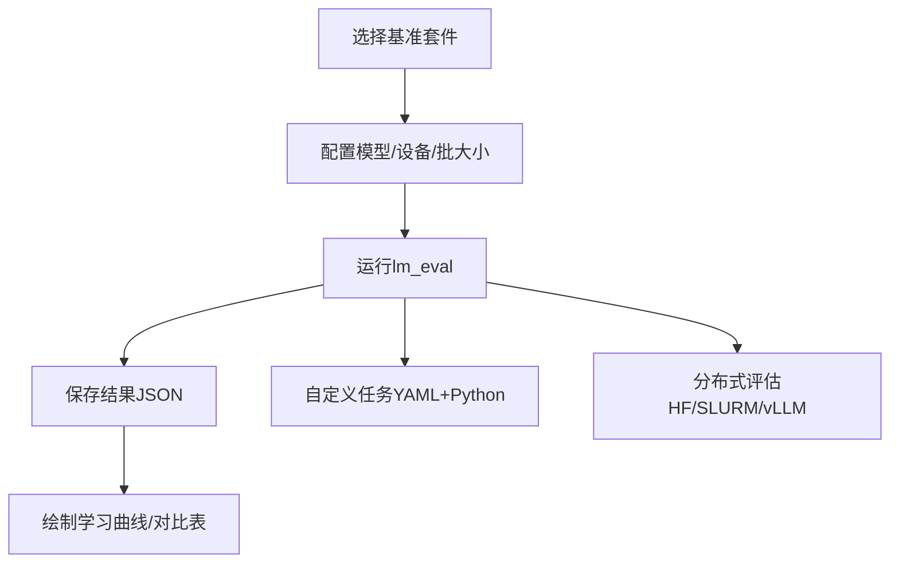
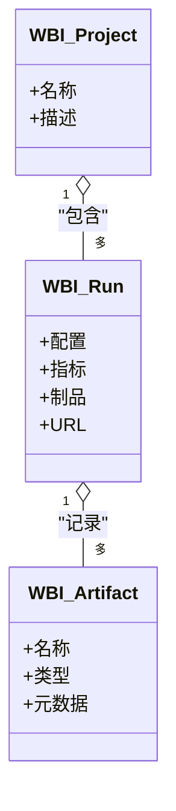
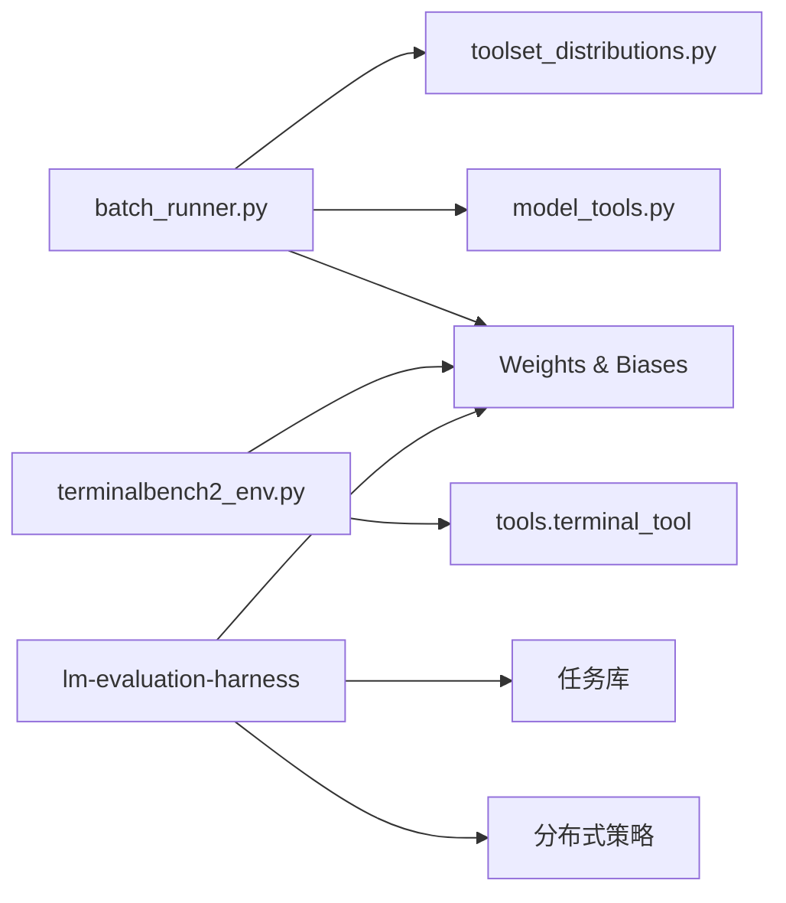

# 模型评估

<cite>
**本文引用的文件**
- [batch_runner.py](file://batch_runner.py)
- [terminalbench2_env.py](file://environments/benchmarks/terminalbench_2/terminalbench2_env.py)
- [SKILL.md（lm-evaluation-harness）](file://skills/mlops/evaluation/lm-evaluation-harness/SKILL.md)
- [benchmark-guide.md](file://skills/mlops/evaluation/lm-evaluation-harness/references/benchmark-guide.md)
- [custom-tasks.md](file://skills/mlops/evaluation/lm-evaluation-harness/references/custom-tasks.md)
- [distributed-eval.md](file://skills/mlops/evaluation/lm-evaluation-harness/references/distributed-eval.md)
- [SKILL.md（Weights & Biases）](file://skills/mlops/evaluation/weights-and-biases/SKILL.md)
- [batch-processing.md（网站文档）](file://website/docs/user-guide/features/batch-processing.md)
- [test_batch_runner.py](file://tests/integration/test_batch_runner.py)
</cite>

## 目录
1. [简介](#简介)
2. [项目结构](#项目结构)
3. [核心组件](#核心组件)
4. [架构总览](#架构总览)
5. [详细组件分析](#详细组件分析)
6. [依赖分析](#依赖分析)
7. [性能考虑](#性能考虑)
8. [故障排查指南](#故障排查指南)
9. [结论](#结论)
10. [附录](#附录)

## 简介
本文件面向Hermes Agent的模型评估能力，系统化介绍如何使用LM Evaluation Harness进行标准化基准评测、在Weights & Biases中进行实验跟踪与可视化，并结合项目内的批处理评估框架实现分布式与可恢复的评估流程。内容覆盖基准测试选择、自定义任务创建、分布式评估策略、实验跟踪与A/B测试设计、结果分析与可视化，以及常见问题与解决方案。

## 项目结构
围绕“模型评估”的关键模块包括：
- 批处理评估执行器：负责并行运行、断点续跑、轨迹保存与统计聚合
- 终端基准环境：Terminal-Bench 2.0评估环境，支持沙箱隔离、并发控制与W&B日志
- 基准评测工具：LM Evaluation Harness技能包，提供标准任务、自定义任务与分布式评估参考
- 实验跟踪：Weights & Biases技能包，提供项目/运行管理、指标记录、可视化与模型制品管理
- 文档与测试：网站文档给出批处理用法示例；集成测试提供运行参数与验证流程



图示来源
- [batch_runner.py:1-1288](file://batch_runner.py#L1-L1288)
- [terminalbench2_env.py:1-1017](file://environments/benchmarks/terminalbench_2/terminalbench2_env.py#L1-L1017)
- [SKILL.md（lm-evaluation-harness）:1-494](file://skills/mlops/evaluation/lm-evaluation-harness/SKILL.md#L1-L494)
- [benchmark-guide.md:1-489](file://skills/mlops/evaluation/lm-evaluation-harness/references/benchmark-guide.md#L1-L489)
- [custom-tasks.md:1-603](file://skills/mlops/evaluation/lm-evaluation-harness/references/custom-tasks.md#L1-L603)
- [distributed-eval.md:280-345](file://skills/mlops/evaluation/lm-evaluation-harness/references/distributed-eval.md#L280-L345)
- [SKILL.md（Weights & Biases）:1-594](file://skills/mlops/evaluation/weights-and-biases/SKILL.md#L1-L594)
- [batch-processing.md（网站文档）:202-227](file://website/docs/user-guide/features/batch-processing.md#L202-L227)
- [test_batch_runner.py:83-132](file://tests/integration/test_batch_runner.py#L83-L132)

章节来源
- [batch_runner.py:1-1288](file://batch_runner.py#L1-L1288)
- [terminalbench2_env.py:1-1017](file://environments/benchmarks/terminalbench_2/terminalbench2_env.py#L1-L1017)
- [SKILL.md（lm-evaluation-harness）:1-494](file://skills/mlops/evaluation/lm-evaluation-harness/SKILL.md#L1-L494)
- [benchmark-guide.md:1-489](file://skills/mlops/evaluation/lm-evaluation-harness/references/benchmark-guide.md#L1-L489)
- [custom-tasks.md:1-603](file://skills/mlops/evaluation/lm-evaluation-harness/references/custom-tasks.md#L1-L603)
- [distributed-eval.md:280-345](file://skills/mlops/evaluation/lm-evaluation-harness/references/distributed-eval.md#L280-L345)
- [SKILL.md（Weights & Biases）:1-594](file://skills/mlops/evaluation/weights-and-biases/SKILL.md#L1-L594)
- [batch-processing.md（网站文档）:202-227](file://website/docs/user-guide/features/batch-processing.md#L202-L227)
- [test_batch_runner.py:83-132](file://tests/integration/test_batch_runner.py#L83-L132)

## 核心组件
- 批处理执行器（BatchRunner）
  - 并行批处理、断点续跑、轨迹持久化、工具调用统计与推理覆盖率统计
  - 支持按工具集分布采样、容器镜像按提示动态注入、多后端（Docker/Modal等）沙箱隔离
- 终端基准环境（TerminalBench2EvalEnv）
  - 面向Terminal-Bench 2.0的任务评估，支持并发控制、超时保护、测试脚本验证与W&B指标上报
- LM Evaluation Harness（评测套件）
  - 标准化基准任务、快速训练进度跟踪、模型对比、vLLM加速、分布式评估策略
- Weights & Biases（实验跟踪）
  - 项目/运行管理、配置追踪、指标日志、模型制品、超参扫描、可视化与报告

章节来源
- [batch_runner.py:514-800](file://batch_runner.py#L514-L800)
- [terminalbench2_env.py:221-310](file://environments/benchmarks/terminalbench_2/terminalbench2_env.py#L221-L310)
- [SKILL.md（lm-evaluation-harness）:39-333](file://skills/mlops/evaluation/lm-evaluation-harness/SKILL.md#L39-L333)
- [SKILL.md（Weights & Biases）:121-224](file://skills/mlops/evaluation/weights-and-biases/SKILL.md#L121-L224)

## 架构总览
下图展示从数据准备到结果分析的完整评估工作流，涵盖批处理执行、基准评测与实验跟踪三大部分：



图示来源
- [batch_runner.py:792-800](file://batch_runner.py#L792-L800)
- [terminalbench2_env.py:784-820](file://environments/benchmarks/terminalbench_2/terminalbench2_env.py#L784-L820)
- [SKILL.md（lm-evaluation-harness）:100-147](file://skills/mlops/evaluation/lm-evaluation-harness/SKILL.md#L100-L147)
- [SKILL.md（Weights & Biases）:170-198](file://skills/mlops/evaluation/weights-and-biases/SKILL.md#L170-L198)

## 详细组件分析

### 批处理执行器（BatchRunner）
- 数据加载与分批：支持截断样本数、过滤无效条目、索引与内容双重去重
- 并行处理：多进程池、批量写入、轨迹格式化、工具调用统计归一化
- 断点续跑：检查点文件、基于内容的已完成样本扫描、失败样本重试
- 输出与统计：每轮批次工具使用统计、推理覆盖率统计、批量完成标记



图示来源
- [batch_runner.py:624-791](file://batch_runner.py#L624-L791)
- [batch_runner.py:388-512](file://batch_runner.py#L388-L512)

章节来源
- [batch_runner.py:514-800](file://batch_runner.py#L514-L800)
- [batch_processing.md（网站文档）:202-227](file://website/docs/user-guide/features/batch-processing.md#L202-L227)
- [test_batch_runner.py:83-132](file://tests/integration/test_batch_runner.py#L83-L132)

### 终端基准环境（TerminalBench2EvalEnv）
- 数据集加载与过滤：支持按任务名过滤、后端不兼容跳过、类别索引构建
- 任务执行：镜像解析（Hub镜像或Dockerfile回退）、沙箱注册、代理循环、测试脚本上传与执行
- 超时与并发：单任务墙钟超时、信号量限制沙箱创建并发、异步完成收集
- 指标聚合与日志：总体与分类通过率、评估耗时、W&B指标上报、轨迹持久化

```mermaid
sequenceDiagram
participant ENV as "环境"
participant IMG as "镜像解析"
participant SANDBOX as "沙箱注册"
participant LOOP as "代理循环"
participant TEST as "测试验证"
participant LOG as "W&B日志"
ENV->>IMG : 解析任务镜像Hub/Dockerfile
ENV->>SANDBOX : 注册任务沙箱docker/modal
ENV->>LOOP : 运行代理对话工具+命令
LOOP->>TEST : 上传测试集/执行test.sh
TEST-->>ENV : 返回奖励通过/失败
ENV->>LOG : 聚合指标/轨迹/耗时
```

图示来源
- [terminalbench2_env.py:417-462](file://environments/benchmarks/terminalbench_2/terminalbench2_env.py#L417-L462)
- [terminalbench2_env.py:467-621](file://environments/benchmarks/terminalbench_2/terminalbench2_env.py#L467-L621)
- [terminalbench2_env.py:784-996](file://environments/benchmarks/terminalbench_2/terminalbench2_env.py#L784-L996)

章节来源
- [terminalbench2_env.py:1-1017](file://environments/benchmarks/terminalbench_2/terminalbench2_env.py#L1-L1017)

### LM Evaluation Harness（评测套件）
- 基准任务选择：MMLU/GSM8K/HellaSwag/TruthfulQA/HumanEval/MBPP/IFEval/LongBench等
- 快速训练跟踪：周期性评估检查点、学习曲线绘制
- 模型对比：批量评估多模型、生成对比表格
- vLLM加速与分布式：数据并行/张量并行/节点级并行策略与内存估算
- 自定义任务：YAML配置、Jinja模板、Python辅助函数、过滤链与多指标



图示来源
- [SKILL.md（lm-evaluation-harness）:41-333](file://skills/mlops/evaluation/lm-evaluation-harness/SKILL.md#L41-L333)
- [benchmark-guide.md:22-489](file://skills/mlops/evaluation/lm-evaluation-harness/references/benchmark-guide.md#L22-L489)
- [custom-tasks.md:1-603](file://skills/mlops/evaluation/lm-evaluation-harness/references/custom-tasks.md#L1-L603)
- [distributed-eval.md:280-345](file://skills/mlops/evaluation/lm-evaluation-harness/references/distributed-eval.md#L280-L345)

章节来源
- [SKILL.md（lm-evaluation-harness）:1-494](file://skills/mlops/evaluation/lm-evaluation-harness/SKILL.md#L1-L494)
- [benchmark-guide.md:1-489](file://skills/mlops/evaluation/lm-evaluation-harness/references/benchmark-guide.md#L1-L489)
- [custom-tasks.md:1-603](file://skills/mlops/evaluation/lm-evaluation-harness/references/custom-tasks.md#L1-L603)
- [distributed-eval.md:280-345](file://skills/mlops/evaluation/lm-evaluation-harness/references/distributed-eval.md#L280-L345)

### Weights & Biases（实验跟踪）
- 项目与运行：项目组织、运行命名、标签与备注
- 配置追踪：自动记录超参、数据拆分、代码版本
- 指标日志：标量、直方图、媒体、表格
- 模型制品：检查点上传、Artifacts注册、模型仓库
- 超参扫描：网格/随机/贝叶斯策略、代理执行
- 可视化与报告：图表、报告、团队协作



图示来源
- [SKILL.md（Weights & Biases）:121-224](file://skills/mlops/evaluation/weights-and-biases/SKILL.md#L121-L224)
- [SKILL.md（Weights & Biases）:324-377](file://skills/mlops/evaluation/weights-and-biases/SKILL.md#L324-L377)

章节来源
- [SKILL.md（Weights & Biases）:1-594](file://skills/mlops/evaluation/weights-and-biases/SKILL.md#L1-L594)

## 依赖分析
- 批处理执行器依赖工具集分布与模型工具映射，确保轨迹schema一致性与错误计数归一化
- 终端基准环境依赖工具上下文与沙箱清理，保障并发安全与资源回收
- LM Evaluation Harness依赖任务库与分布式策略，支持HF/vLLM/多节点
- Weights & Biases贯穿各组件，作为统一的实验跟踪与可视化平台



图示来源
- [batch_runner.py:39-44](file://batch_runner.py#L39-L44)
- [terminalbench2_env.py:60-67](file://environments/benchmarks/terminalbench_2/terminalbench2_env.py#L60-L67)
- [SKILL.md（lm-evaluation-harness）:378-392](file://skills/mlops/evaluation/lm-evaluation-harness/SKILL.md#L378-L392)
- [SKILL.md（Weights & Biases）:121-198](file://skills/mlops/evaluation/weights-and-biases/SKILL.md#L121-L198)

章节来源
- [batch_runner.py:1-1288](file://batch_runner.py#L1-L1288)
- [terminalbench2_env.py:1-1017](file://environments/benchmarks/terminalbench_2/terminalbench2_env.py#L1-L1017)
- [SKILL.md（lm-evaluation-harness）:378-392](file://skills/mlops/evaluation/lm-evaluation-harness/SKILL.md#L378-L392)
- [SKILL.md（Weights & Biases）:121-198](file://skills/mlops/evaluation/weights-and-biases/SKILL.md#L121-L198)

## 性能考虑
- 批处理并行度与资源：合理设置工作进程数、批大小与并发上限，避免I/O瓶颈与内存溢出
- 推理加速：优先使用vLLM后端，结合张量并行与设备映射优化显存占用
- 分布式评估：根据模型规模选择数据并行或张量并行，多节点场景使用HF SLURM作业调度
- 指标聚合：对工具调用统计与推理覆盖率进行归一化，保证跨任务可比性
- 超时与容错：为长任务设置墙钟超时，启用断点续跑与失败样本重试

## 故障排查指南
- LM Harness常见问题
  - 速度慢：切换vLLM后端、减少few-shot示例、评估子集
  - 显存不足：降低批大小、量化或CPU卸载
  - 结果异常：核对few-shot数量、任务名与模型/分词器匹配
  - HumanEval未执行：启用代码执行开关
- 批处理执行器
  - 工具统计缺失：确认消息历史中存在tool_calls与tool响应
  - 轨迹不一致：检查工具映射与schema归一化逻辑
  - 断点续跑失效：确认检查点文件与已完成样本扫描逻辑
- 终端基准环境
  - 沙箱创建阻塞：调整最大并发、使用信号量限流
  - 测试验证失败：检查测试脚本上传与下载、退出码与reward.txt
  - 资源清理：确保清理所有沙箱与线程池

章节来源
- [SKILL.md（lm-evaluation-harness）:393-461](file://skills/mlops/evaluation/lm-evaluation-harness/SKILL.md#L393-L461)
- [batch_runner.py:670-757](file://batch_runner.py#L670-L757)
- [terminalbench2_env.py:840-883](file://environments/benchmarks/terminalbench_2/terminalbench2_env.py#L840-L883)

## 结论
通过批处理执行器、LM Evaluation Harness与Weights & Biases的协同，Hermes Agent实现了从数据准备、分布式评估到实验跟踪与可视化的完整闭环。建议在实际评估中遵循基准选择最佳实践、建立断点续跑与并发控制机制、利用W&B进行指标与制品管理，并以A/B测试设计持续迭代模型质量。

## 附录
- 完整评估工作流示例（步骤化）
  - 数据准备：构造JSONL数据集，包含prompt字段与可选image/cwd
  - 批处理评估：指定批大小、运行名、工具集分布与并发数
  - 基准评测：选择合适任务套件，配置模型与后端（HF/vLLM），输出结果JSON
  - 实验跟踪：初始化W&B项目与运行，记录配置、指标与制品
  - 结果分析：对比不同模型/检查点的学习曲线，生成对比表格与可视化报告
- A/B测试设计要点
  - 对比组：同一任务集上不同模型/提示工程/推理策略
  - 指标：准确率、通过率、延迟、成本、工具使用率
  - 统计显著性：采用配对二项检验或Bootstrap置信区间
  - 可视化：趋势图、箱线图、热力图与报告卡片

章节来源
- [batch-processing.md（网站文档）:202-227](file://website/docs/user-guide/features/batch-processing.md#L202-L227)
- [SKILL.md（lm-evaluation-harness）:246-333](file://skills/mlops/evaluation/lm-evaluation-harness/SKILL.md#L246-L333)
- [SKILL.md（Weights & Biases）:449-477](file://skills/mlops/evaluation/weights-and-biases/SKILL.md#L449-L477)
- [test_batch_runner.py:83-132](file://tests/integration/test_batch_runner.py#L83-L132)