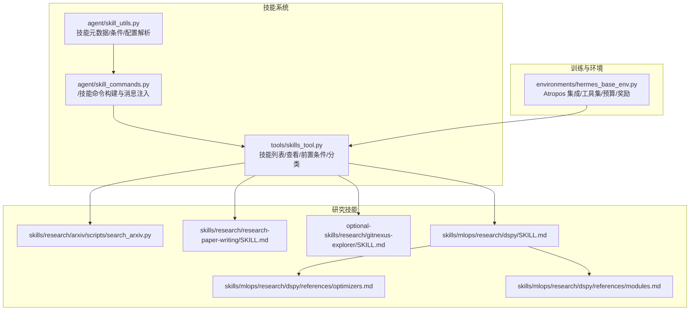
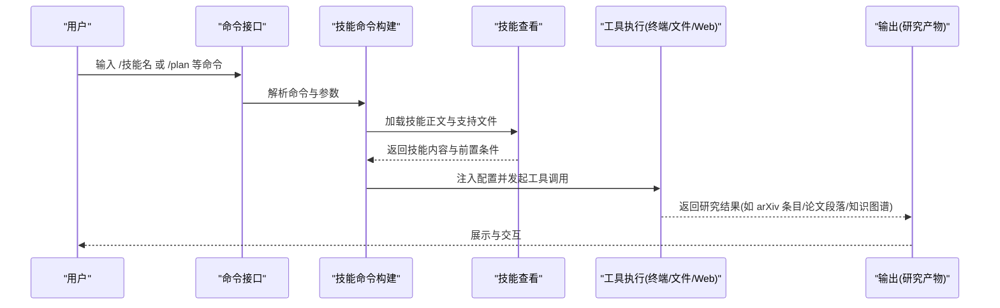
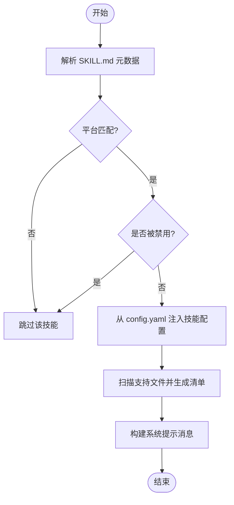
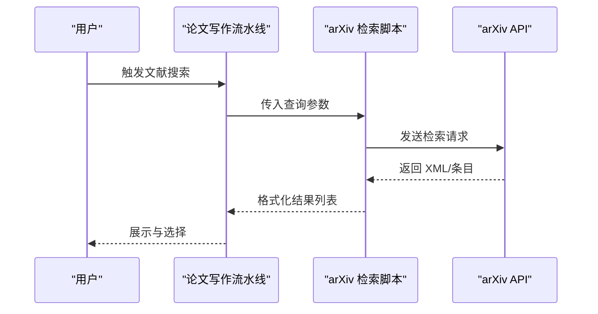
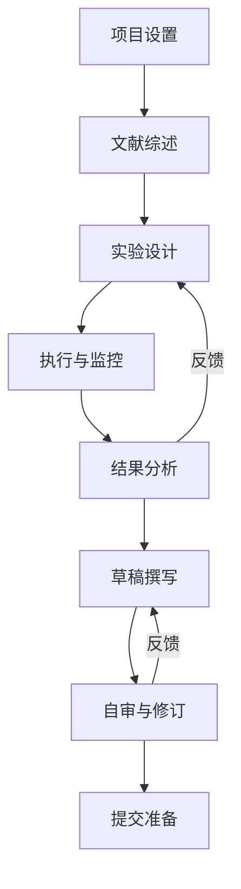
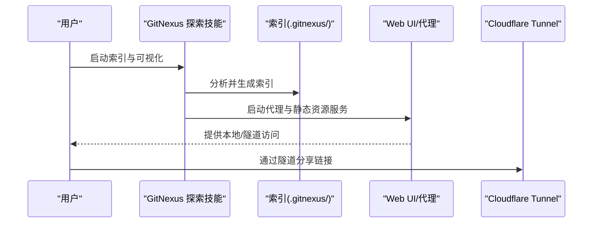
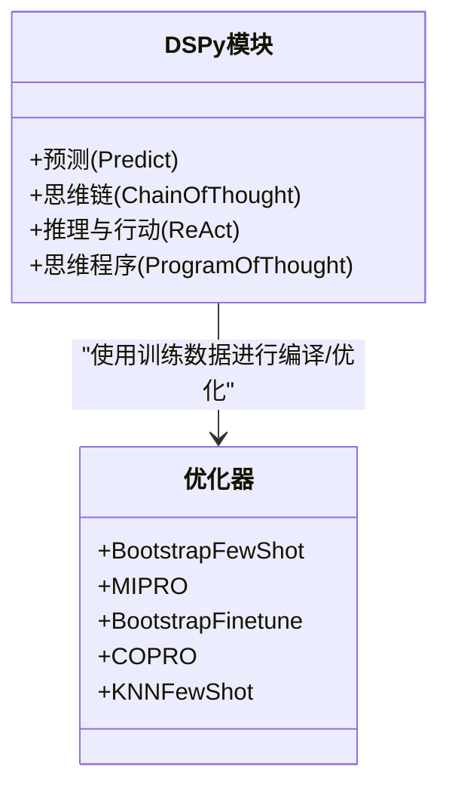
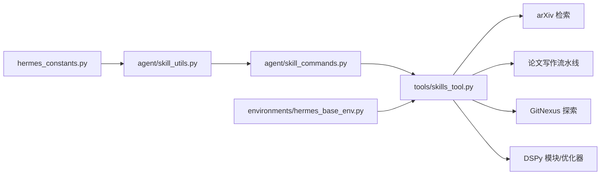

# 研究工具

<cite>
**本文引用的文件**
- [README.md](file://README.md)
- [hermes_constants.py](file://hermes_constants.py)
- [agent/skill_utils.py](file://agent/skill_utils.py)
- [agent/skill_commands.py](file://agent/skill_commands.py)
- [tools/skills_tool.py](file://tools/skills_tool.py)
- [environments/hermes_base_env.py](file://environments/hermes_base_env.py)
- [skills/research/arxiv/scripts/search_arxiv.py](file://skills/research/arxiv/scripts/search_arxiv.py)
- [skills/research/research-paper-writing/SKILL.md](file://skills/research/research-paper-writing/SKILL.md)
- [optional-skills/research/gitnexus-explorer/SKILL.md](file://optional-skills/research/gitnexus-explorer/SKILL.md)
- [skills/mlops/research/dspy/SKILL.md](file://skills/mlops/research/dspy/SKILL.md)
- [skills/mlops/research/dspy/references/optimizers.md](file://skills/mlops/research/dspy/references/optimizers.md)
- [skills/mlops/research/dspy/references/modules.md](file://skills/mlops/research/dspy/references/modules.md)
</cite>

## 目录
1. [简介](#简介)
2. [项目结构](#项目结构)
3. [核心组件](#核心组件)
4. [架构总览](#架构总览)
5. [详细组件分析](#详细组件分析)
6. [依赖关系分析](#依赖关系分析)
7. [性能考量](#性能考量)
8. [故障排查指南](#故障排查指南)
9. [结论](#结论)
10. [附录](#附录)

## 简介
本文件面向使用 Hermes Agent 的研究者与工程师，系统化阐述如何利用研究类技能（如 arXiv 检索、论文写作流水线、GitNexus 代码知识图谱、DSPy 模块与优化器）开展机器学习研究工作。内容覆盖：
- 研究工具的使用方法与典型场景
- 程序合成、提示工程、模块设计与优化器配置
- 研究工作流设计、实验管理与结果分析
- 完整研究项目模板与最佳实践
- 研究工具在机器学习研究中的作用与局限性

## 项目结构
Hermes Agent 将“技能”作为可组合的研究能力单元，通过统一的技能发现、加载与注入机制，将研究工具无缝集成到对话或批处理流程中。研究相关能力主要分布在以下位置：
- 核心技能系统：技能元数据解析、命令注册、按平台过滤、外部目录支持
- 研究技能示例：arXiv 检索、论文写作流水线、GitNexus 知识图谱、DSPy 模块与优化器
- 环境与训练：Atropos 集成的环境基类，支持两阶段（OpenAI 服务器/受控 VLLM 服务器）与工具集采样



**图表来源**
- [agent/skill_utils.py:1-444](file://agent/skill_utils.py#L1-L444)
- [agent/skill_commands.py:1-369](file://agent/skill_commands.py#L1-L369)
- [tools/skills_tool.py:1-800](file://tools/skills_tool.py#L1-L800)
- [environments/hermes_base_env.py:1-715](file://environments/hermes_base_env.py#L1-L715)

**章节来源**
- [README.md:1-179](file://README.md#L1-L179)
- [hermes_constants.py:1-301](file://hermes_constants.py#L1-L301)

## 核心组件
- 技能元数据与条件解析：从 SKILL.md 提取名称、描述、平台、工具集/工具依赖、配置变量声明等，并进行平台匹配与禁用过滤。
- 技能命令构建：将 /技能名 命令映射到具体技能内容，注入运行时配置与支持文件清单，形成系统提示。
- 技能查看与前置条件：支持列出技能、按分类筛选、查看技能正文与关联文件；检查平台与环境变量要求，必要时提示网关端安全输入或本地交互。
- 研究技能示例：arXiv 检索脚本、论文写作流水线（含迭代式实验设计-分析-写作-审阅）、GitNexus 知识图谱可视化、DSPy 模块与优化器参考。
- 训练环境基类：支持两阶段模式（OpenAI 服务器直连/受控 VLLM 服务器），按组采样工具集，构造轨迹与奖励，便于 RL 训练与评估。

**章节来源**
- [agent/skill_utils.py:1-444](file://agent/skill_utils.py#L1-L444)
- [agent/skill_commands.py:1-369](file://agent/skill_commands.py#L1-L369)
- [tools/skills_tool.py:1-800](file://tools/skills_tool.py#L1-L800)
- [environments/hermes_base_env.py:1-715](file://environments/hermes_base_env.py#L1-L715)

## 架构总览
下图展示研究工具在 Hermes 中的调用链路：用户通过命令触发技能，系统解析技能元数据与前置条件，注入配置与支持文件，随后在终端后端执行工具调用，最终产出研究结果（如论文草稿、知识图谱、优化后的 DSPy 模块）。



**图表来源**
- [agent/skill_commands.py:291-369](file://agent/skill_commands.py#L291-L369)
- [tools/skills_tool.py:779-800](file://tools/skills_tool.py#L779-L800)
- [agent/skill_utils.py:377-413](file://agent/skill_utils.py#L377-L413)

## 详细组件分析

### 组件A：技能系统与命令注入
- 平台兼容性与禁用过滤：根据 SKILL.md 的 platforms 字段与当前系统平台进行匹配，同时读取配置中的 disabled/platform_disabled 列表进行过滤。
- 技能配置注入：从 config.yaml 读取 skills.config.* 键值，注入到技能消息中，避免模型直接访问配置文件。
- 支持文件清单：自动扫描 references/templates/scripts/assets 子目录，生成可加载文件清单，便于后续 skill_view 调用。
- 命令规范化：将空格/下划线统一为短横线，保证跨平台命令名一致性。



**图表来源**
- [agent/skill_utils.py:92-169](file://agent/skill_utils.py#L92-L169)
- [agent/skill_utils.py:241-256](file://agent/skill_utils.py#L241-L256)
- [agent/skill_utils.py:377-413](file://agent/skill_utils.py#L377-L413)
- [agent/skill_commands.py:121-198](file://agent/skill_commands.py#L121-L198)

**章节来源**
- [agent/skill_utils.py:1-444](file://agent/skill_utils.py#L1-L444)
- [agent/skill_commands.py:1-369](file://agent/skill_commands.py#L1-L369)

### 组件B：arXiv 检索与文献发现
- 功能：基于 arXiv API 进行检索，支持查询词、作者、分类、ID 列表、排序方式与最大结果数。
- 输出：格式化显示标题、ID、发表/更新日期、作者、类别、摘要与链接。
- 应用：作为论文写作流水线的“文献发现”环节，支撑相关工作整理与引用验证。



**图表来源**
- [skills/research/arxiv/scripts/search_arxiv.py:20-80](file://skills/research/arxiv/scripts/search_arxiv.py#L20-L80)

**章节来源**
- [skills/research/arxiv/scripts/search_arxiv.py:1-115](file://skills/research/arxiv/scripts/search_arxiv.py#L1-L115)

### 组件C：论文写作流水线（迭代式研究工作流）
- 阶段化流程：从项目设置、文献综述、实验设计、执行与监控、结果分析、草稿撰写、自审与修订、提交准备，形成闭环迭代。
- 关键实践：
  - 实验设计与基线：明确主张-实验-证据映射，设计强基线与消融实验。
  - 结果分析：统计显著性、效应量、置信区间；对负结果与未完成实验诚实报告。
  - 写作与迭代：采用 Autoreason 等策略进行多轮审阅与修订，确保贡献清晰、证据充分。
  - 版本控制与成本估算：Git 提交规范、实验日志与成本追踪。
- 工具集成：与 arXiv、语义学者、CrossRef 等 API 协作，自动化引用验证与文献组织。



**图表来源**
- [skills/research/research-paper-writing/SKILL.md:25-43](file://skills/research/research-paper-writing/SKILL.md#L25-L43)

**章节来源**
- [skills/research/research-paper-writing/SKILL.md:90-700](file://skills/research/research-paper-writing/SKILL.md#L90-L700)

### 组件D：GitNexus 知识图谱探索
- 功能：对代码库进行索引，生成符号、调用链、聚类与执行流的知识图谱，通过 Web UI 可视化；支持通过 Cloudflare Tunnel 远程访问。
- 使用场景：快速理解大型仓库结构、共享远程探索链接、与论文写作中的“相关工作”整理结合。
- 注意事项：浏览器渲染节点上限、嵌入搜索耗时、多仓库服务等。



**图表来源**
- [optional-skills/research/gitnexus-explorer/SKILL.md:146-175](file://optional-skills/research/gitnexus-explorer/SKILL.md#L146-L175)

**章节来源**
- [optional-skills/research/gitnexus-explorer/SKILL.md:1-214](file://optional-skills/research/gitnexus-explorer/SKILL.md#L1-L214)

### 组件E：DSPy 模块与优化器（程序合成与提示工程）
- 模块类型：Predict、ChainOfThought、ReAct、ProgramOfThought 等，分别适用于不同推理与工具使用需求。
- 优化器：BootstrapFewShot、MIPRO、BootstrapFinetune、COPRO、KNNFewShot 等，依据数据规模与质量选择。
- 最佳实践：从简单模块开始，逐步引入推理与优化；使用描述性签名；以代表性数据集训练；保存/加载优化模型；启用追踪以便调试。
- 与研究工作流结合：在论文写作的“方法”部分，使用 DSPy 生成可复现的提示与模块；在实验设计阶段，用优化器提升模块在特定任务上的表现。



**图表来源**
- [skills/mlops/research/dspy/SKILL.md:109-164](file://skills/mlops/research/dspy/SKILL.md#L109-L164)
- [skills/mlops/research/dspy/references/optimizers.md:16-23](file://skills/mlops/research/dspy/references/optimizers.md#L16-L23)

**章节来源**
- [skills/mlops/research/dspy/SKILL.md:109-585](file://skills/mlops/research/dspy/SKILL.md#L109-L585)
- [skills/mlops/research/dspy/references/optimizers.md:1-567](file://skills/mlops/research/dspy/references/optimizers.md#L1-L567)
- [skills/mlops/research/dspy/references/modules.md:115-159](file://skills/mlops/research/dspy/references/modules.md#L115-L159)

### 组件F：Atropos 环境与工具集采样（研究训练与评估）
- 两阶段模式：Phase 1 使用 OpenAI 服务器直连（原生工具调用解析），Phase 2 使用受控 VLLM 服务器（精确 token 与 logprobs）。
- 工具集解析：支持按分布采样或显式启用/禁用工具集，构建工具定义与有效名称集合。
- 预算与结果管理：按工具阈值与回合预算控制工具结果大小，避免上下文溢出。
- 奖励计算：通过 ToolContext 在沙箱内调用任意工具进行验证与评分，便于 RL 训练与评估。

```mermaid
sequenceDiagram
participant ENV as "HermesAgentBaseEnv"
participant TM as "ServerManager"
participant LOOP as "HermesAgentLoop"
participant TOOL as "工具集"
participant VER as "奖励计算"
ENV->>TM : 选择服务器类型(OpenAI/VLLM)
ENV->>LOOP : 初始化Agent(温度/预算/工具定义)
LOOP->>TOOL : 执行工具调用
TOOL-->>LOOP : 返回结果
LOOP->>VER : 构造ToolContext并验证
VER-->>LOOP : 返回奖励
LOOP-->>ENV : 生成轨迹与评分
```

**图表来源**
- [environments/hermes_base_env.py:221-715](file://environments/hermes_base_env.py#L221-L715)

**章节来源**
- [environments/hermes_base_env.py:1-715](file://environments/hermes_base_env.py#L1-L715)

## 依赖关系分析
- 技能系统依赖 hermes_constants 获取配置路径与技能根目录，确保跨平台一致的文件定位。
- 技能命令构建依赖技能查看工具，实现“先加载后注入”的渐进披露模式，降低令牌消耗。
- 研究技能之间存在协作关系：arXiv 检索为论文写作提供文献基础；GitNexus 为方法与相关工作提供代码背景；DSPy 为模块化与优化提供工程化手段。
- Atropos 环境为研究训练提供标准化框架，支持工具集采样与奖励计算，便于将研究工作转化为可复现的训练数据与模型。



**图表来源**
- [hermes_constants.py:226-247](file://hermes_constants.py#L226-L247)
- [agent/skill_utils.py:15-17](file://agent/skill_utils.py#L15-L17)
- [tools/skills_tool.py:72-88](file://tools/skills_tool.py#L72-L88)

**章节来源**
- [hermes_constants.py:1-301](file://hermes_constants.py#L1-L301)
- [agent/skill_utils.py:1-444](file://agent/skill_utils.py#L1-L444)
- [tools/skills_tool.py:1-800](file://tools/skills_tool.py#L1-L800)
- [environments/hermes_base_env.py:1-715](file://environments/hermes_base_env.py#L1-L715)

## 性能考量
- 技能加载与令牌开销：采用渐进披露（仅列表元数据，按需加载全文与支持文件），减少上下文占用。
- 工具执行并发：合理设置线程池大小与终端超时，避免工具调用阻塞导致的吞吐下降。
- 结果预算与预览：通过工具结果阈值与回合预算控制大结果持久化，优先保留预览以维持对话流畅度。
- 两阶段服务器选择：在需要精确 token 与 logprobs 的训练阶段使用 VLLM 服务器，在快速验证与评估阶段使用 OpenAI 服务器。

[本节为通用指导，不涉及具体文件分析]

## 故障排查指南
- 技能不可用或被禁用：检查 config.yaml 中的 skills.disabled 与 platform_disabled 字段，确认平台匹配与禁用列表。
- 缺少前置环境变量：技能前端会提示缺失项与帮助信息；在网关界面可通过提示手动添加或在本地 CLI 交互输入。
- 工具执行失败：查看工具错误缓冲区与 wandb 日志中的工具错误详情，定位失败工具、参数与错误信息。
- 大结果导致上下文溢出：调整工具结果阈值与回合预算，或启用工具结果持久化与预览策略。

**章节来源**
- [tools/skills_tool.py:275-344](file://tools/skills_tool.py#L275-L344)
- [environments/hermes_base_env.py:462-488](file://environments/hermes_base_env.py#L462-L488)

## 结论
Hermes Agent 的研究工具体系以“技能”为核心，将提示工程、程序合成、模块设计与优化器配置有机整合，配合论文写作流水线与代码知识图谱，形成从文献发现、实验设计、结果分析到论文撰写的闭环工作流。通过 Atropos 环境与工具集采样，研究工作可进一步扩展到 RL 训练与评估场景。建议在实际应用中遵循“先简单再复杂、以数据驱动优化”的原则，结合版本控制与成本估算，持续迭代研究流程与模型模块。

[本节为总结性内容，不涉及具体文件分析]

## 附录

### A. 研究项目模板（基于论文写作流水线）
- 项目设置
  - 工作区组织：paper/、experiments/、code/、results/、tasks/、human_eval/ 等子目录
  - 版本控制：初始化仓库、建立分支策略、提交规范
  - 贡献声明：明确单一贡献点、证据与读者价值
- 文献综述
  - 种子论文：从代码库引用出发
  - 搜索策略：广度优先+深度优先的迭代模式
  - 引用验证：逐条检索、比对与 BibTeX 生成
- 实验设计
  - 主张-实验-证据映射
  - 基线与消融设计
  - 评估协议：指标、聚合、统计检验、样本量
- 执行与监控
  - 并行执行与失败恢复
  - 定时监控与静默模式
  - 实验日志与快照代码
- 结果分析
  - 统计显著性与效应量
  - 图表与表格规范
  - 负结果与未完成实验的诚实报告
- 草稿撰写与修订
  - 基于实验日志的结构化桥接
  - Autoreason 等迭代策略
- 提交准备
  - 会议/期刊格式转换
  - 后接受交付物（海报、演讲、代码）

**章节来源**
- [skills/research/research-paper-writing/SKILL.md:90-700](file://skills/research/research-paper-writing/SKILL.md#L90-L700)

### B. DSPy 模块与优化器选型速查
- 模块类型：Predict（基础预测）、ChainOfThought（思维链）、ReAct（工具使用）、ProgramOfThought（程序生成）
- 优化器：BootstrapFewShot（通用）、MIPRO（指令调优）、BootstrapFinetune（微调）、COPRO（提示优化）、KNNFewShot（快速基线）
- 选择建议：数据规模小选 BootstrapFewShot/KNNFewShot；有指令调优需求选 MIPRO；需要微调且数据充足选 BootstrapFinetune；需要提示优化选 COPRO

**章节来源**
- [skills/mlops/research/dspy/SKILL.md:109-164](file://skills/mlops/research/dspy/SKILL.md#L109-L164)
- [skills/mlops/research/dspy/references/optimizers.md:16-23](file://skills/mlops/research/dspy/references/optimizers.md#L16-L23)

### C. 研究工具的作用与局限性
- 作用
  - 自动化文献检索与引用验证，降低信息噪音
  - 提供可迭代的论文写作流程，提升产出质量与一致性
  - 通过知识图谱与模块化工具，加速代码理解与实验设计
  - 以数据驱动优化提示与模块，提高模型在特定任务上的稳定性
- 局限性
  - 引用验证仍需人工把关，避免误用与遗漏
  - 负结果与未完成实验的报告需要研究伦理与审稿人接受度考量
  - DSPy 优化依赖高质量训练数据，数据偏差可能放大
  - 工具执行与网络环境影响实验可复现性，需严格记录与隔离

**章节来源**
- [skills/research/research-paper-writing/SKILL.md:306-343](file://skills/research/research-paper-writing/SKILL.md#L306-L343)
- [skills/mlops/research/dspy/SKILL.md:557-578](file://skills/mlops/research/dspy/SKILL.md#L557-L578)