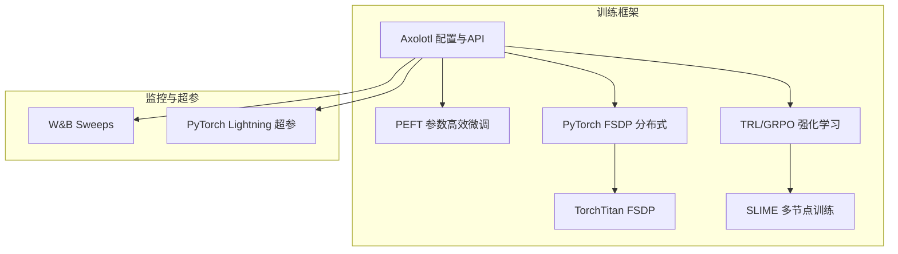
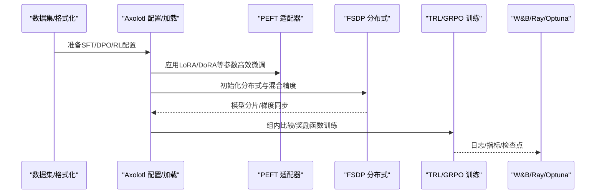
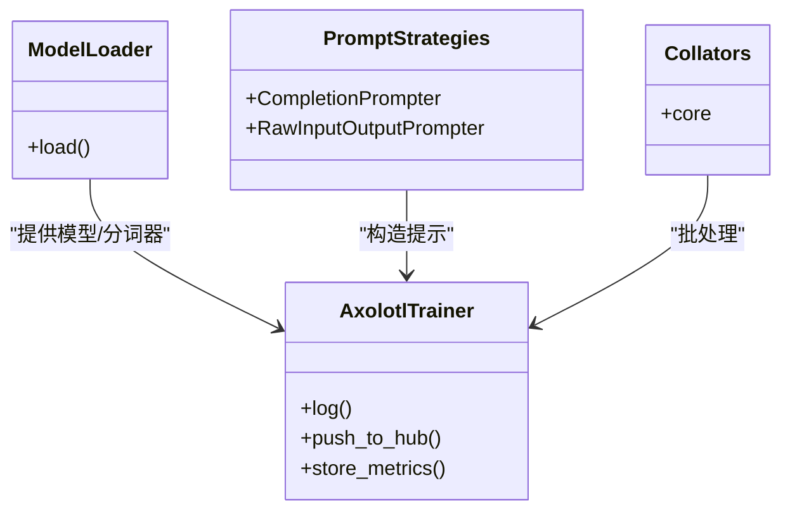
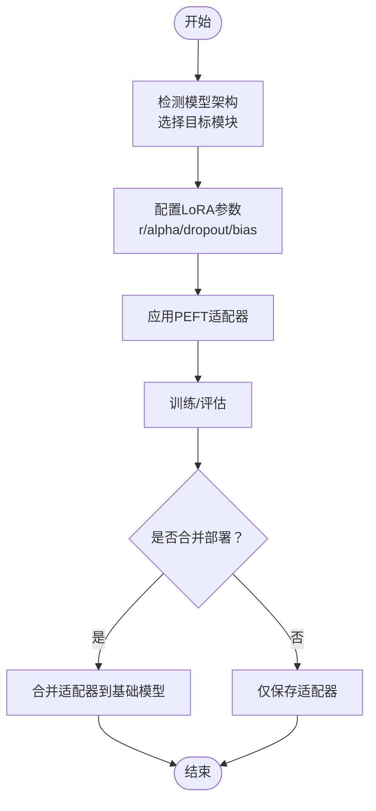
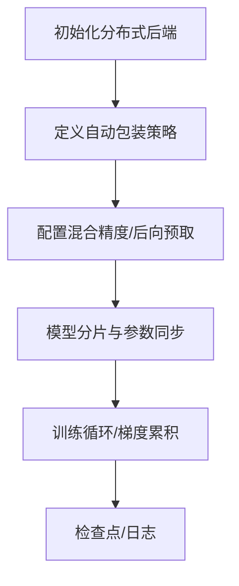
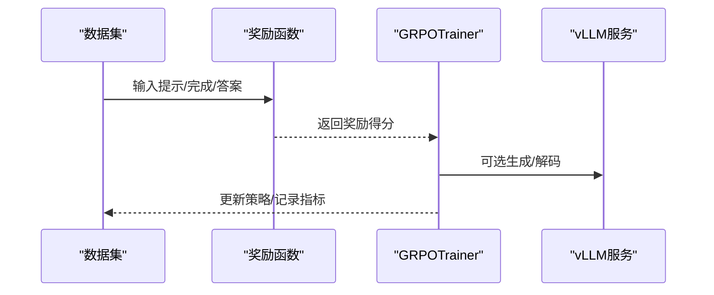
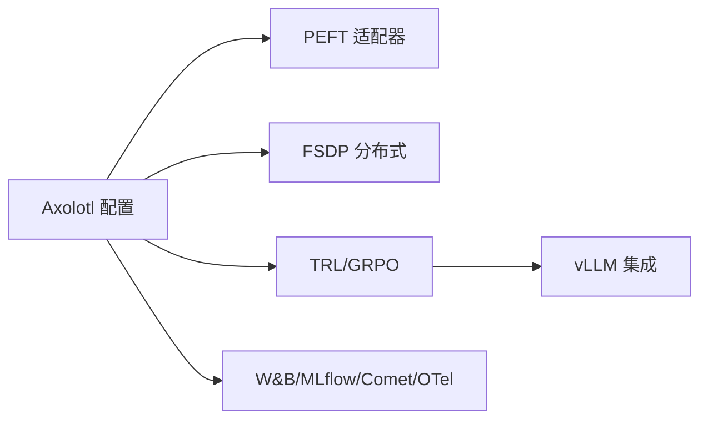

# 训练框架

<cite>
**本文引用的文件**
- [skills/mlops/training/axolotl/references/other.md](file://skills/mlops/training/axolotl/references/other.md)
- [skills/mlops/training/axolotl/references/api.md](file://skills/mlops/training/axolotl/references/api.md)
- [skills/mlops/training/grpo-rl-training/SKILL.md](file://skills/mlops/training/grpo-rl-training/SKILL.md)
- [skills/mlops/training/peft/SKILL.md](file://skills/mlops/training/peft/SKILL.md)
- [skills/mlops/training/peft/references/advanced-usage.md](file://skills/mlops/training/peft/references/advanced-usage.md)
- [skills/mlops/training/pytorch-fsdp/SKILL.md](file://skills/mlops/training/pytorch-fsdp/SKILL.md)
- [skills/mlops/training/pytorch-fsdp/references/other.md](file://skills/mlops/training/pytorch-fsdp/references/other.md)
- [optional-skills/mlops/slime/SKILL.md](file://optional-skills/mlops/slime/SKILL.md)
- [optional-skills/mlops/torchtitan/references/fsdp.md](file://optional-skills/mlops/torchtitan/references/fsdp.md)
- [skills/mlops/evaluation/weights-and-biases/references/sweeps.md](file://skills/mlops/evaluation/weights-and-biases/references/sweeps.md)
- [optional-skills/mlops/pytorch-lightning/references/hyperparameter-tuning.md](file://optional-skills/mlops/pytorch-lightning/references/hyperparameter-tuning.md)
- [skills/mlops/training/unsloth/references/llms-txt.md](file://skills/mlops/training/unsloth/references/llms-txt.md)
</cite>

## 目录
1. [简介](#简介)
2. [项目结构](#项目结构)
3. [核心组件](#核心组件)
4. [架构总览](#架构总览)
5. [详细组件分析](#详细组件分析)
6. [依赖关系分析](#依赖关系分析)
7. [性能考量](#性能考量)
8. [故障排查指南](#故障排查指南)
9. [结论](#结论)
10. [附录](#附录)

## 简介
本文件面向Hermes Agent训练框架技能，系统梳理Axolotl、PEFT、PyTorch FSDP、TRL（含GRPO）、Unsloth等训练框架与工具在仓库中的使用方式与最佳实践。内容覆盖指令微调（SFT）、偏好优化（DPO/KTO/ORPO/SimPO等）、强化学习（RL）训练（GRPO/RLHF）、参数高效微调（LoRA/DoRA/rsLoRA/AdaLoRA/LoftQ等）、分布式训练（FSDP/DeepSpeed/TorchTitan）以及训练数据准备、超参数调优与训练监控的完整流程，并提供不同场景下的框架选择建议与性能优化策略。

## 项目结构
训练相关能力主要分布在以下位置：
- Axolotl：训练配置参考与API说明，涵盖混合精度、FSDP、注意力优化、vLLM集成、奖励建模、RL（DPO/GRPO等）等
- PEFT：LoRA/DoRA/rsLoRA/AdaLoRA/LoftQ等参数高效微调方案与加载合并
- PyTorch FSDP：分布式训练与自动包装策略、混合精度、后向预取等
- TRL（GRPO）：基于组内比较的强化学习训练工作流
- TorchTitan：FSDP配置示例与参数差异
- SLIME：异步/多节点强化学习训练工作流
- 监控与超参：Weights & Biases Sweep、Ray Tune/Optuna等

**图表来源**
- [skills/mlops/training/axolotl/references/other.md:1635-3030](file://skills/mlops/training/axolotl/references/other.md#L1635-L3030)
- [skills/mlops/training/peft/SKILL.md:51-224](file://skills/mlops/training/peft/SKILL.md#L51-L224)
- [skills/mlops/training/pytorch-fsdp/SKILL.md:70-74](file://skills/mlops/training/pytorch-fsdp/SKILL.md#L70-L74)
- [skills/mlops/training/grpo-rl-training/SKILL.md:1-200](file://skills/mlops/training/grpo-rl-training/SKILL.md#L1-L200)
- [optional-skills/mlops/torchtitan/references/fsdp.md:105-127](file://optional-skills/mlops/torchtitan/references/fsdp.md#L105-L127)
- [optional-skills/mlops/slime/SKILL.md:141-208](file://optional-skills/mlops/slime/SKILL.md#L141-L208)
- [skills/mlops/evaluation/weights-and-biases/references/sweeps.md:376-711](file://skills/mlops/evaluation/weights-and-biases/references/sweeps.md#L376-L711)
- [optional-skills/mlops/pytorch-lightning/references/hyperparameter-tuning.md:74-105](file://optional-skills/mlops/pytorch-lightning/references/hyperparameter-tuning.md#L74-L105)

**章节来源**
- [skills/mlops/training/axolotl/references/other.md:1-200](file://skills/mlops/training/axolotl/references/other.md#L1-L200)
- [skills/mlops/training/axolotl/references/api.md:1-200](file://skills/mlops/training/axolotl/references/api.md#L1-L200)

## 核心组件
- Axolotl：提供统一的训练配置入口，支持SFT/DPO/KTO/ORPO/SimPO/GRPO等任务类型，内置混合精度、注意力优化、FSDP/DeepSpeed、vLLM、奖励函数与评估指标等能力；其API模块包含模型加载器、训练器基类、提示策略、collator等。
- PEFT：LoRA/DoRA/rsLoRA/AdaLoRA/LoftQ等高效微调方案，支持加载、合并与部署；提供高级用法如DoRA、AdaLoRA自适应秩、LoftQ量化感知初始化等。
- PyTorch FSDP：分布式数据并行，支持自动包装策略、混合精度、后向预取、梯度检查点等；提供与TorchTitan的配置对比。
- TRL（GRPO）：无需独立奖励模型的组相对策略优化，通过组内比较提升样本效率；提供奖励函数组合、生成采样、vLLM集成等。
- SLIME：多节点/多GPU异步强化学习训练，支持缓冲区与权重同步策略。
- 监控与超参：W&B Sweep、Ray Tune/Optuna等超参搜索与实验管理。

**章节来源**
- [skills/mlops/training/axolotl/references/api.md:38-120](file://skills/mlops/training/axolotl/references/api.md#L38-L120)
- [skills/mlops/training/peft/SKILL.md:51-224](file://skills/mlops/training/peft/SKILL.md#L51-L224)
- [skills/mlops/training/pytorch-fsdp/SKILL.md:70-74](file://skills/mlops/training/pytorch-fsdp/SKILL.md#L70-L74)
- [skills/mlops/training/grpo-rl-training/SKILL.md:1-200](file://skills/mlops/training/grpo-rl-training/SKILL.md#L1-L200)
- [optional-skills/mlops/slime/SKILL.md:141-208](file://optional-skills/mlops/slime/SKILL.md#L141-L208)
- [skills/mlops/evaluation/weights-and-biases/references/sweeps.md:376-711](file://skills/mlops/evaluation/weights-and-biases/references/sweeps.md#L376-L711)
- [optional-skills/mlops/pytorch-lightning/references/hyperparameter-tuning.md:74-105](file://optional-skills/mlops/pytorch-lightning/references/hyperparameter-tuning.md#L74-L105)

## 架构总览
下图展示从数据到模型训练再到监控的关键路径，体现Axolotl作为统一入口如何串联PEFT、FSDP、TRL与监控工具。

**图表来源**
- [skills/mlops/training/axolotl/references/other.md:1635-3030](file://skills/mlops/training/axolotl/references/other.md#L1635-L3030)
- [skills/mlops/training/peft/SKILL.md:51-224](file://skills/mlops/training/peft/SKILL.md#L51-L224)
- [skills/mlops/training/pytorch-fsdp/SKILL.md:70-74](file://skills/mlops/training/pytorch-fsdp/SKILL.md#L70-L74)
- [skills/mlops/training/grpo-rl-training/SKILL.md:1-200](file://skills/mlops/training/grpo-rl-training/SKILL.md#L1-L200)
- [skills/mlops/evaluation/weights-and-biases/references/sweeps.md:376-711](file://skills/mlops/evaluation/weights-and-biases/references/sweeps.md#L376-L711)
- [optional-skills/mlops/pytorch-lightning/references/hyperparameter-tuning.md:74-105](file://optional-skills/mlops/pytorch-lightning/references/hyperparameter-tuning.md#L74-L105)

## 详细组件分析

### Axolotl：统一训练配置与API
- 配置要点：混合精度（bf16/fp16/fp8）、注意力优化（FlashAttention/SDP/XFormers/FlexAttention）、FSDP/DeepSpeed、vLLM、奖励建模、RL类型（DPO/GRPO等）、数据集与评估、日志与监控（W&B/MLflow/Comet/OpenTelemetry）。
- API要点：模型加载器、训练器基类、提示策略、collator、数据打包补丁等。
- 常见问题：NCCL通信、显存不足、适配器合并不匹配、聊天模板边界、FA2版本冲突等。

**图表来源**
- [skills/mlops/training/axolotl/references/api.md:38-120](file://skills/mlops/training/axolotl/references/api.md#L38-L120)
- [skills/mlops/training/axolotl/references/api.md:168-200](file://skills/mlops/training/axolotl/references/api.md#L168-L200)

**章节来源**
- [skills/mlops/training/axolotl/references/other.md:1-200](file://skills/mlops/training/axolotl/references/other.md#L1-L200)
- [skills/mlops/training/axolotl/references/other.md:1635-3030](file://skills/mlops/training/axolotl/references/other.md#L1635-L3030)
- [skills/mlops/training/axolotl/references/api.md:38-120](file://skills/mlops/training/axolotl/references/api.md#L38-L120)

### PEFT：参数高效微调（LoRA/DoRA/rsLoRA/AdaLoRA/LoftQ）
- LoRA基础：目标模块选择、秩r与alpha关系、dropout、bias设置、加载与合并。
- 高级变体：DoRA（权重分解）、rsLoRA（秩稳定缩放）、AdaLoRA（自适应秩）、LoftQ（量化感知初始化）。
- 实战建议：根据显存选择LoRA/QLoRA；对大模型可提高秩并结合梯度检查点；合并适配器用于部署。

**图表来源**
- [skills/mlops/training/peft/SKILL.md:51-224](file://skills/mlops/training/peft/SKILL.md#L51-L224)
- [skills/mlops/training/peft/references/advanced-usage.md:1-155](file://skills/mlops/training/peft/references/advanced-usage.md#L1-L155)

**章节来源**
- [skills/mlops/training/peft/SKILL.md:51-224](file://skills/mlops/training/peft/SKILL.md#L51-L224)
- [skills/mlops/training/peft/references/advanced-usage.md:1-155](file://skills/mlops/training/peft/references/advanced-usage.md#L1-L155)

### PyTorch FSDP：分布式训练
- 关键配置：自动包装策略（按层/按大小）、混合精度、后向预取、梯度检查点、offload等。
- 与TorchTitan对比：移除旧参数、启用DTensor、meta初始化等。
- 注意事项：设备ID与local_rank、环境变量、通信后端初始化。

**图表来源**
- [skills/mlops/training/pytorch-fsdp/SKILL.md:70-74](file://skills/mlops/training/pytorch-fsdp/SKILL.md#L70-L74)
- [skills/mlops/training/pytorch-fsdp/references/other.md:1716-3352](file://skills/mlops/training/pytorch-fsdp/references/other.md#L1716-L3352)
- [optional-skills/mlops/torchtitan/references/fsdp.md:105-127](file://optional-skills/mlops/torchtitan/references/fsdp.md#L105-L127)

**章节来源**
- [skills/mlops/training/pytorch-fsdp/SKILL.md:70-74](file://skills/mlops/training/pytorch-fsdp/SKILL.md#L70-L74)
- [skills/mlops/training/pytorch-fsdp/references/other.md:1716-3352](file://skills/mlops/training/pytorch-fsdp/references/other.md#L1716-L3352)
- [optional-skills/mlops/torchtitan/references/fsdp.md:105-127](file://optional-skills/mlops/torchtitan/references/fsdp.md#L105-L127)

### TRL（GRPO）：强化学习训练
- GRPO算法：组内比较、奖励函数组合、生成采样、vLLM集成、重要性采样级别、损失形式等。
- 工作流：数据准备（系统提示+用户输入）、奖励函数实现（正确性/格式/长度/风格）、训练配置与执行、保存模型。

**图表来源**
- [skills/mlops/training/grpo-rl-training/SKILL.md:1-200](file://skills/mlops/training/grpo-rl-training/SKILL.md#L1-L200)
- [skills/mlops/training/axolotl/references/other.md:1668-1740](file://skills/mlops/training/axolotl/references/other.md#L1668-L1740)

**章节来源**
- [skills/mlops/training/grpo-rl-training/SKILL.md:1-200](file://skills/mlops/training/grpo-rl-training/SKILL.md#L1-L200)
- [skills/mlops/training/axolotl/references/other.md:1668-1740](file://skills/mlops/training/axolotl/references/other.md#L1668-L1740)

### SLIME：异步/多节点强化学习
- 场景：大模型长生成时间、高GPU空闲等待、内存缓冲需求。
- 参数：异步缓冲区大小、权重同步间隔、rollout批大小、全局批大小等。
- 流程：启动多个节点与GPU、异步rollout与训练重叠、定期权重同步、可视化与监控。

**章节来源**
- [optional-skills/mlops/slime/SKILL.md:141-208](file://optional-skills/mlops/slime/SKILL.md#L141-L208)

### 监控与超参数调优
- W&B Sweeps：定义超参空间（学习率、批次、优化器、正则等），自动运行与早停。
- Ray Tune/Optuna：种群基于训练、贝叶斯优化等策略进行超参搜索。
- 日志与指标：令牌数/秒、困惑度、BLEU/COMET/TER等语言学指标。

**章节来源**
- [skills/mlops/evaluation/weights-and-biases/references/sweeps.md:376-711](file://skills/mlops/evaluation/weights-and-biases/references/sweeps.md#L376-L711)
- [optional-skills/mlops/pytorch-lightning/references/hyperparameter-tuning.md:74-105](file://optional-skills/mlops/pytorch-lightning/references/hyperparameter-tuning.md#L74-L105)

## 依赖关系分析
- Axolotl与PEFT：Axolotl配置中直接启用adapter/peft参数，模型加载时应用PEFT适配器。
- Axolotl与FSDP：通过fsdp/fsdp_config开启分片与混合精度，配合梯度检查点与offload降低显存。
- Axolotl与TRL：通过rl字段选择DPO/GRPO等，或在trl子配置中指定奖励函数、vLLM等。
- 监控工具：W&B/MLflow/Comet/OTel与训练循环集成，记录指标与模型Artifacts。

**图表来源**
- [skills/mlops/training/axolotl/references/other.md:1635-3030](file://skills/mlops/training/axolotl/references/other.md#L1635-L3030)
- [skills/mlops/training/grpo-rl-training/SKILL.md:1-200](file://skills/mlops/training/grpo-rl-training/SKILL.md#L1-L200)

**章节来源**
- [skills/mlops/training/axolotl/references/other.md:1635-3030](file://skills/mlops/training/axolotl/references/other.md#L1635-L3030)
- [skills/mlops/training/grpo-rl-training/SKILL.md:1-200](file://skills/mlops/training/grpo-rl-training/SKILL.md#L1-L200)

## 性能考量
- 混合精度：BF16优先，FP8需torch.compile；FSDP+FP8 all-gather可提速。
- 注意力优化：FlashAttention/SDP/XFormers/FlexAttention按硬件与驱动选择。
- 批大小与梯度累积：在固定显存下平衡有效批大小；Unsloth对梯度累积行为进行了修正以保证一致性。
- 分布式：合理设置自动包装策略、后向预取、offload与CPU RAM高效加载。
- LoRA参数：秩r与alpha关系、target_modules选择、dropout与bias设置；DoRA/rsLoRA在质量与稳定性上的权衡。

**章节来源**
- [skills/mlops/training/axolotl/references/other.md:7-90](file://skills/mlops/training/axolotl/references/other.md#L7-L90)
- [skills/mlops/training/unsloth/references/llms-txt.md:6149-7935](file://skills/mlops/training/unsloth/references/llms-txt.md#L6149-L7935)
- [skills/mlops/training/peft/references/advanced-usage.md:1-155](file://skills/mlops/training/peft/references/advanced-usage.md#L1-L155)

## 故障排查指南
- NCCL通信问题：检查GPU互连与环境变量。
- 显存不足：降低序列长度、批大小或启用梯度检查点/激活卸载；使用QLoRA/DoRA等高效微调。
- 适配器合并失败：检查词表大小与嵌入扩展/收缩策略；使用官方合并命令。
- 聊天模板错误：核对message_property_mappings、EOT/EOS掩码与模板边界。
- FA2版本冲突：更换CUDA版本或回退FA2版本。
- vLLM兼容性：确保PyTorch与vLLM版本匹配。

**章节来源**
- [skills/mlops/training/axolotl/references/other.md:93-200](file://skills/mlops/training/axolotl/references/other.md#L93-L200)

## 结论
Hermes Agent训练框架技能以Axolotl为核心，结合PEFT实现参数高效微调，借助PyTorch FSDP实现大规模分布式训练，并通过TRL（GRPO）与SLIME构建灵活的强化学习训练管线。配合W&B/Ray/Optuna等监控与超参工具，可在不同规模与场景下实现高质量、高效率的模型训练与部署。

## 附录
- 框架选择建议
  - 小显存/快速原型：LoRA + BF16 + 梯度检查点
  - 大模型/长上下文：DoRA/rsLoRA + FP8+FSDP + 注意力优化
  - 强化学习：GRPO（组内比较）或SLIME（异步/多节点）
  - 超参搜索：W&B Sweeps、Ray Tune/Optuna
- 训练监控建议
  - 指标：困惑度、BLEU/COMET/TER、tokens/sec、奖励分布
  - 检查点：周期保存、最佳模型保存、合并适配器部署