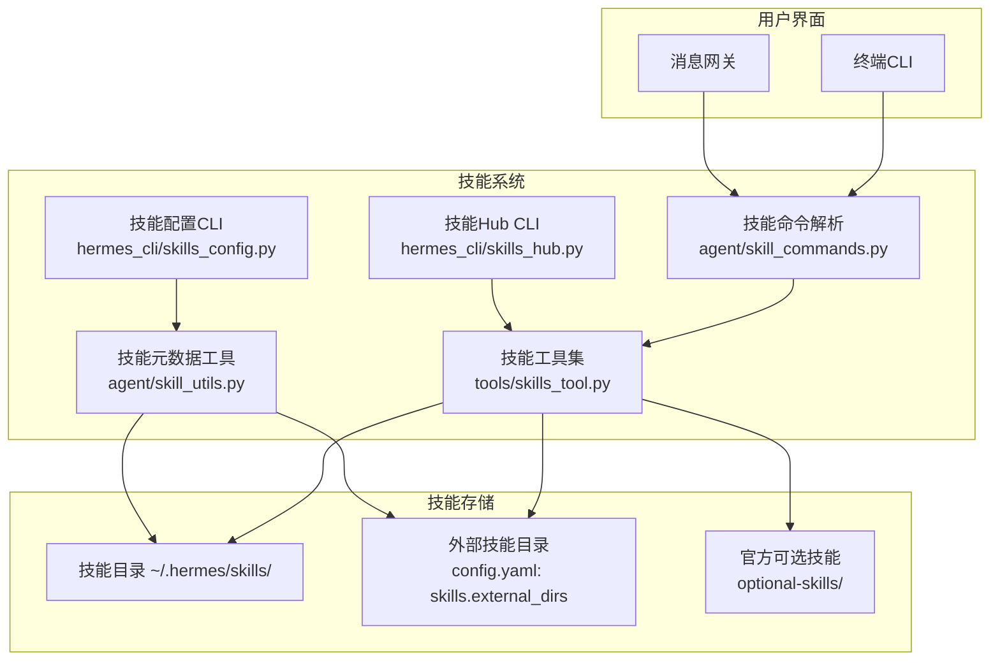
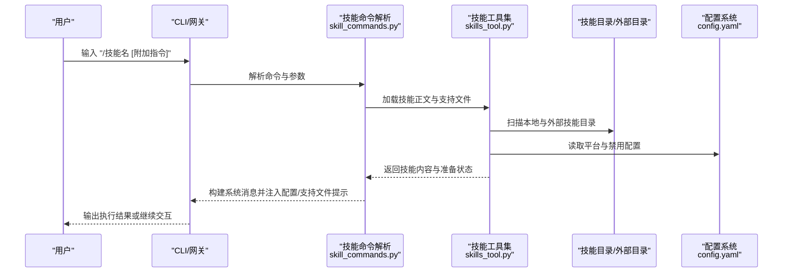
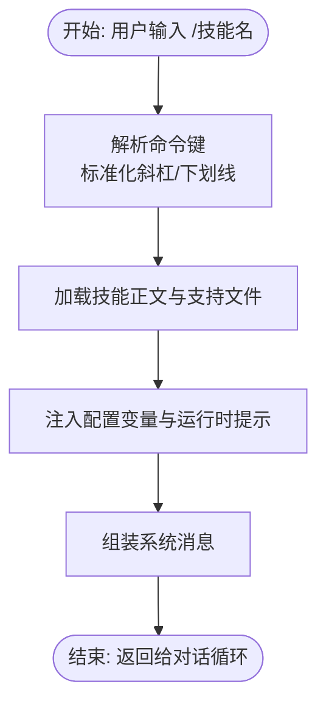
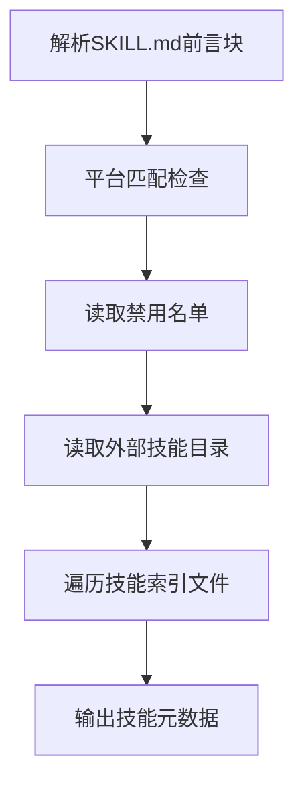
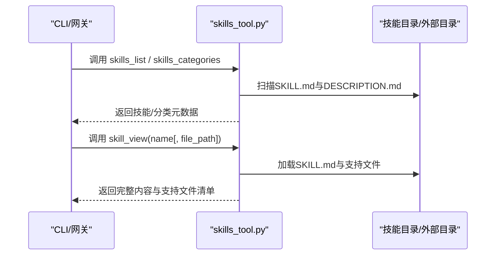
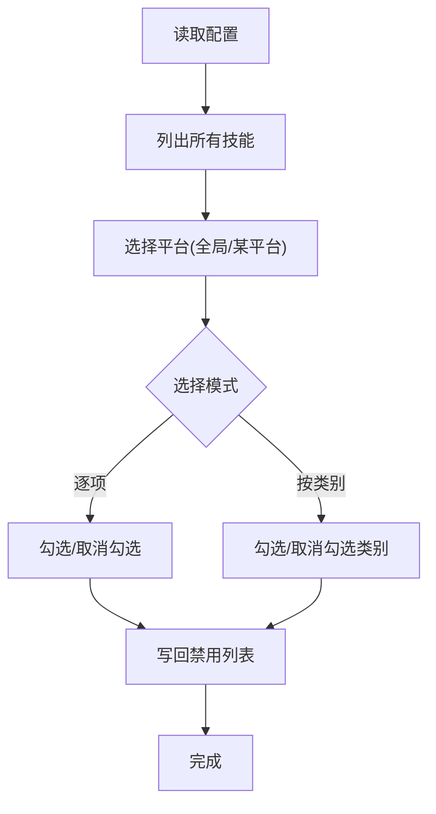
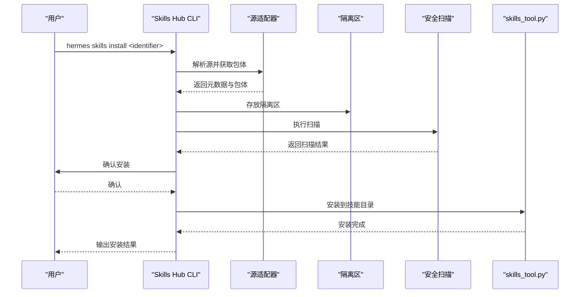
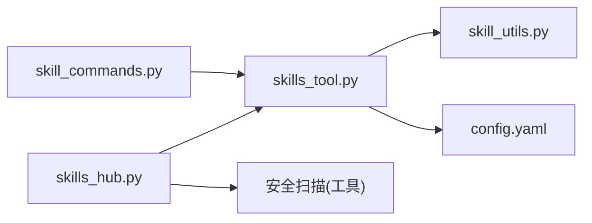

# 专业技能

<cite>
**本文引用的文件**
- [README.md](file://README.md)
- [agent/skill_commands.py](file://agent/skill_commands.py)
- [agent/skill_utils.py](file://agent/skill_utils.py)
- [tools/skills_tool.py](file://tools/skills_tool.py)
- [hermes_cli/skills_config.py](file://hermes_cli/skills_config.py)
- [hermes_cli/skills_hub.py](file://hermes_cli/skills_hub.py)
- [optional-skills/DESCRIPTION.md](file://optional-skills/DESCRIPTION.md)
- [skills/data-science/DESCRIPTION.md](file://skills/data-science/DESCRIPTION.md)
- [skills/email/DESCRIPTION.md](file://skills/email/DESCRIPTION.md)
- [skills/media/DESCRIPTION.md](file://skills/media/DESCRIPTION.md)
- [skills/mlops/DESCRIPTION.md](file://skills/mlops/DESCRIPTION.md)
</cite>

## 目录
1. [简介](#简介)
2. [项目结构](#项目结构)
3. [核心组件](#核心组件)
4. [架构总览](#架构总览)
5. [详细组件分析](#详细组件分析)
6. [依赖关系分析](#依赖关系分析)
7. [性能考量](#性能考量)
8. [故障排除指南](#故障排除指南)
9. [结论](#结论)
10. [附录](#附录)

## 简介
本文件面向Hermes Agent的专业技能体系，系统性梳理其技能发现、加载、配置与使用的完整流程，并结合仓库中已有的技能分类（如数据科学、邮件、媒体、MLOps等）说明各领域技能的应用场景、技术特点与使用方法。文档同时给出技能集成方式、工作流程、最佳实践与故障排除建议，帮助用户按需选择与部署专业技能。

## 项目结构
Hermes Agent通过“技能”（Skill）组织能力，技能以目录形式存放于用户家目录下的技能目录中，每个技能由一个标准格式的主文档与可选的支持文件组成。技能系统的核心模块包括：
- 技能扫描与命令注册：在交互界面中将技能暴露为“/技能名”的命令
- 技能内容加载与注入：按需加载技能正文、支持文件与配置注入
- 技能配置与平台适配：读取配置文件控制启用/禁用、平台兼容性与外部技能目录
- 技能分发与安装：通过Skills Hub浏览、搜索、安装、更新与卸载官方或第三方技能

**图示来源**
- [agent/skill_commands.py:1-369](file://agent/skill_commands.py#L1-L369)
- [agent/skill_utils.py:1-444](file://agent/skill_utils.py#L1-L444)
- [tools/skills_tool.py:1-800](file://tools/skills_tool.py#L1-L800)
- [hermes_cli/skills_hub.py:1-800](file://hermes_cli/skills_hub.py#L1-L800)
- [hermes_cli/skills_config.py:1-178](file://hermes_cli/skills_config.py#L1-L178)

**章节来源**
- [README.md:1-179](file://README.md#L1-L179)
- [agent/skill_commands.py:1-369](file://agent/skill_commands.py#L1-L369)
- [agent/skill_utils.py:1-444](file://agent/skill_utils.py#L1-L444)
- [tools/skills_tool.py:1-800](file://tools/skills_tool.py#L1-L800)
- [hermes_cli/skills_hub.py:1-800](file://hermes_cli/skills_hub.py#L1-L800)
- [hermes_cli/skills_config.py:1-178](file://hermes_cli/skills_config.py#L1-L178)
- [optional-skills/DESCRIPTION.md:1-25](file://optional-skills/DESCRIPTION.md#L1-L25)

## 核心组件
- 技能命令解析与消息构建
  - 将“/技能名”类命令解析为技能调用，加载技能正文与支持文件，注入配置与运行时提示，形成系统消息供模型执行
  - 支持会话预加载多个技能，便于复杂任务的持续指导
- 技能元数据与平台适配
  - 解析SKILL.md中的YAML前言块，提取名称、描述、平台限制、前置条件、配置变量声明等
  - 按当前操作系统过滤不兼容技能；支持全局与平台维度的禁用列表
- 技能工具集
  - 提供技能清单、查看、分类描述、环境变量要求检测与密钥采集提示
  - 支持外部技能目录扩展，统一扫描与去重
- 技能配置CLI
  - 提供按类别或逐项切换技能启用/禁用的能力，支持全局与平台维度
- 技能Hub CLI
  - 浏览、搜索、安装、更新、卸载、审计第三方与官方技能，内置安全扫描与锁定文件管理

**章节来源**
- [agent/skill_commands.py:200-369](file://agent/skill_commands.py#L200-L369)
- [agent/skill_utils.py:52-116](file://agent/skill_utils.py#L52-L116)
- [agent/skill_utils.py:261-356](file://agent/skill_utils.py#L261-L356)
- [tools/skills_tool.py:512-586](file://tools/skills_tool.py#L512-L586)
- [hermes_cli/skills_config.py:27-47](file://hermes_cli/skills_config.py#L27-L47)
- [hermes_cli/skills_hub.py:144-182](file://hermes_cli/skills_hub.py#L144-L182)

## 架构总览
下图展示从用户输入到技能执行的关键路径，以及与配置、外部目录与Hub的交互：

**图示来源**
- [agent/skill_commands.py:291-327](file://agent/skill_commands.py#L291-L327)
- [tools/skills_tool.py:779-800](file://tools/skills_tool.py#L779-L800)
- [agent/skill_utils.py:121-168](file://agent/skill_utils.py#L121-L168)

## 详细组件分析

### 技能命令解析与消息构建
- 功能要点
  - 命令标准化：将“/技能名”与“/技能_名”等价映射，避免平台命令命名差异导致的不可用
  - 内容加载：按技能相对路径加载SKILL.md与支持文件，自动补充支持文件清单提示
  - 配置注入：从配置文件解析技能声明的配置变量，生成“技能配置”块注入消息
  - 运行时提示：支持在调用时追加运行时备注，便于动态上下文
- 典型流程
  - 解析命令键 → 加载技能元数据与正文 → 注入配置与支持文件提示 → 组装系统消息返回

**图示来源**
- [agent/skill_commands.py:272-327](file://agent/skill_commands.py#L272-L327)
- [agent/skill_commands.py:121-197](file://agent/skill_commands.py#L121-L197)

**章节来源**
- [agent/skill_commands.py:272-327](file://agent/skill_commands.py#L272-L327)
- [agent/skill_commands.py:121-197](file://agent/skill_commands.py#L121-L197)

### 技能元数据与平台适配
- 功能要点
  - 前言块解析：支持嵌套结构与回退解析，确保健壮性
  - 平台匹配：基于sys.platform前缀映射，仅加载兼容技能
  - 外部目录：从配置读取外部技能目录，去重与绝对化处理
  - 禁用策略：支持全局与平台维度的禁用名单
- 关键接口
  - 解析前言块、提取平台/配置/条件字段
  - 获取禁用名单、外部目录列表
  - 遍历技能索引文件，迭代器式扫描

**图示来源**
- [agent/skill_utils.py:52-86](file://agent/skill_utils.py#L52-L86)
- [agent/skill_utils.py:92-115](file://agent/skill_utils.py#L92-L115)
- [agent/skill_utils.py:121-168](file://agent/skill_utils.py#L121-L168)
- [agent/skill_utils.py:174-224](file://agent/skill_utils.py#L174-L224)
- [agent/skill_utils.py:432-444](file://agent/skill_utils.py#L432-L444)

**章节来源**
- [agent/skill_utils.py:52-86](file://agent/skill_utils.py#L52-L86)
- [agent/skill_utils.py:92-115](file://agent/skill_utils.py#L92-L115)
- [agent/skill_utils.py:121-168](file://agent/skill_utils.py#L121-L168)
- [agent/skill_utils.py:174-224](file://agent/skill_utils.py#L174-L224)
- [agent/skill_utils.py:432-444](file://agent/skill_utils.py#L432-L444)

### 技能工具集（清单、查看、分类）
- 功能要点
  - 技能清单：按分类与名称排序，返回最小元数据，降低token开销
  - 技能查看：按需加载完整内容、标签、相关文件与支持文件清单
  - 分类描述：支持CATEGORY/DESCRIPTION.md，提供领域概览
  - 环境变量与前置条件：收集并提示缺失的环境变量与命令依赖
- 关键接口
  - skills_list、skills_categories、skill_view
  - 前言块解析、平台匹配、禁用过滤、外部目录合并

**图示来源**
- [tools/skills_tool.py:711-777](file://tools/skills_tool.py#L711-L777)
- [tools/skills_tool.py:632-706](file://tools/skills_tool.py#L632-L706)
- [tools/skills_tool.py:779-800](file://tools/skills_tool.py#L779-L800)

**章节来源**
- [tools/skills_tool.py:711-777](file://tools/skills_tool.py#L711-L777)
- [tools/skills_tool.py:632-706](file://tools/skills_tool.py#L632-L706)
- [tools/skills_tool.py:779-800](file://tools/skills_tool.py#L779-L800)

### 技能配置CLI（启用/禁用、按平台）
- 功能要点
  - 列出所有技能（忽略禁用状态），按类别统计
  - 交互式勾选：按类别或逐项切换启用/禁用
  - 支持全局与平台维度的禁用列表持久化
- 工作流
  - 读取配置 → 选择平台 → 选择模式（逐项/按类别）→ 更新禁用集合 → 写回配置

**图示来源**
- [hermes_cli/skills_config.py:125-178](file://hermes_cli/skills_config.py#L125-L178)
- [hermes_cli/skills_config.py:27-47](file://hermes_cli/skills_config.py#L27-L47)

**章节来源**
- [hermes_cli/skills_config.py:125-178](file://hermes_cli/skills_config.py#L125-L178)
- [hermes_cli/skills_config.py:27-47](file://hermes_cli/skills_config.py#L27-L47)

### 技能Hub CLI（浏览、搜索、安装、更新、卸载、审计）
- 功能要点
  - 浏览：跨源并行搜索，去重后按信任度排序，分页显示
  - 搜索：统一查询入口，支持限定来源
  - 安装：下载、隔离区暂存、安全扫描、确认后安装至技能目录
  - 更新：检查并批量更新Hub安装的技能
  - 卸载：删除并清理缓存
  - 审计：对已安装技能重新扫描并输出报告
- 关键流程
  - 解析短名称 → 源路由 → 获取元数据与包体 → 隔离区 → 扫描 → 策略判断 → 安装/更新/卸载

**图示来源**
- [hermes_cli/skills_hub.py:310-466](file://hermes_cli/skills_hub.py#L310-L466)
- [hermes_cli/skills_hub.py:144-182](file://hermes_cli/skills_hub.py#L144-L182)

**章节来源**
- [hermes_cli/skills_hub.py:310-466](file://hermes_cli/skills_hub.py#L310-L466)
- [hermes_cli/skills_hub.py:144-182](file://hermes_cli/skills_hub.py#L144-L182)

### 各专业领域技能概览与使用建议
- 数据科学
  - 场景：交互式探索、Jupyter内核、数据分析与可视化
  - 特点：以SKILL.md定义步骤与工具链，必要时声明前置环境变量与命令
  - 使用：在CLI中输入“/数据科学”或在网关中使用对应命令触发
  - 最佳实践：提前在配置中声明数据路径与工具链位置，减少运行时提示
- 邮件管理
  - 场景：终端内收发、搜索与管理邮件
  - 特点：支持多平台接入，强调安全密钥采集与平台提示
  - 使用：通过“/邮件”命令进入邮件工作流
  - 最佳实践：在网关环境中配置密钥采集，或在本地CLI中交互输入
- 媒体处理
  - 场景：YouTube转录、GIF搜索、音乐生成、音频可视化
  - 特点：依赖外部服务与API密钥，提供setup帮助与收集密钥
  - 使用：通过“/媒体”命令进入媒体工作流
  - 最佳实践：在本地CLI中完成密钥采集，避免网关表面不支持安全输入
- MLOps
  - 场景：训练、微调、部署与优化ML/AI模型
  - 特点：涉及大量工具与框架，强调前置条件与环境变量
  - 使用：通过“/mlops”命令进入MLOps工作流
  - 最佳实践：在本地CLI中完成环境初始化与密钥配置，再在网关中执行

**章节来源**
- [skills/data-science/DESCRIPTION.md:1-4](file://skills/data-science/DESCRIPTION.md#L1-L4)
- [skills/email/DESCRIPTION.md:1-4](file://skills/email/DESCRIPTION.md#L1-L4)
- [skills/media/DESCRIPTION.md:1-4](file://skills/media/DESCRIPTION.md#L1-L4)
- [skills/mlops/DESCRIPTION.md:1-4](file://skills/mlops/DESCRIPTION.md#L1-L4)

## 依赖关系分析
- 组件耦合
  - 技能命令解析依赖技能工具集进行内容加载与支持文件枚举
  - 技能工具集依赖配置系统与外部目录配置，保证扫描范围与平台兼容
  - Skills Hub CLI独立于核心Agent逻辑，通过隔离区与安全扫描保障安装安全性
- 外部依赖
  - YAML解析（CSafeLoader优先）、平台标识映射、终端后端环境变量
  - 可选技能目录与官方可选技能集合

**图示来源**
- [agent/skill_commands.py:45-79](file://agent/skill_commands.py#L45-L79)
- [tools/skills_tool.py:485-510](file://tools/skills_tool.py#L485-L510)
- [hermes_cli/skills_hub.py:314-390](file://hermes_cli/skills_hub.py#L314-L390)

**章节来源**
- [agent/skill_commands.py:45-79](file://agent/skill_commands.py#L45-L79)
- [tools/skills_tool.py:485-510](file://tools/skills_tool.py#L485-L510)
- [hermes_cli/skills_hub.py:314-390](file://hermes_cli/skills_hub.py#L314-L390)

## 性能考量
- 渐进披露与token优化
  - 列表阶段仅返回名称与描述，避免一次性加载全文
  - 查看阶段按需加载SKILL.md与支持文件，减少不必要的IO
- 扫描与缓存
  - 外部目录与本地目录合并扫描，去重与绝对化处理，避免重复读取
  - 安装/卸载后清空技能系统提示缓存，确保新技能立即生效
- 并行搜索
  - Hub浏览阶段对多个源并行搜索，设置超时上限，提升响应速度

**章节来源**
- [tools/skills_tool.py:711-777](file://tools/skills_tool.py#L711-L777)
- [tools/skills_tool.py:632-706](file://tools/skills_tool.py#L632-L706)
- [hermes_cli/skills_hub.py:202-218](file://hermes_cli/skills_hub.py#L202-L218)
- [hermes_cli/skills_hub.py:456-466](file://hermes_cli/skills_hub.py#L456-L466)

## 故障排除指南
- 技能未出现在命令列表
  - 检查平台兼容性：确认SKILL.md中platforms字段与当前系统匹配
  - 检查禁用列表：确认是否被全局或平台维度禁用
  - 检查外部目录：确认skills.external_dirs配置有效且目录存在
- 技能加载失败或报错
  - 检查SKILL.md前言块语法，确保YAML格式正确
  - 检查支持文件是否存在与可读
- 网关表面无法安全输入密钥
  - 在本地CLI中完成密钥采集，或手动将密钥写入~/.hermes/.env
- Hub安装被阻止
  - 查看扫描报告，修正危险项后再尝试
  - 确认隔离区路径合法，避免安装到不受支持的位置
- 技能更新后未生效
  - 手动触发会话重置或等待下次会话加载
  - 清理技能系统提示缓存以强制刷新

**章节来源**
- [agent/skill_utils.py:92-115](file://agent/skill_utils.py#L92-L115)
- [agent/skill_utils.py:121-168](file://agent/skill_utils.py#L121-L168)
- [tools/skills_tool.py:386-393](file://tools/skills_tool.py#L386-L393)
- [hermes_cli/skills_hub.py:375-402](file://hermes_cli/skills_hub.py#L375-L402)
- [hermes_cli/skills_hub.py:456-466](file://hermes_cli/skills_hub.py#L456-L466)

## 结论
Hermes Agent的技能系统以“渐进披露”和“按需加载”为核心设计，结合配置与外部目录扩展、平台适配与安全扫描，实现了灵活、可维护、可扩展的专业技能集合。用户可通过CLI与网关两种入口高效地发现、配置与使用技能，并借助Skills Hub获得官方与社区的高质量能力扩展。建议在实际使用中：
- 明确任务域，优先启用相关领域的技能
- 在本地CLI中完成密钥与环境配置，再在网关中执行
- 定期通过Hub更新技能，保持能力与安全基线
- 对高风险技能谨慎启用，并定期审计

## 附录
- 官方可选技能说明
  - 仓库自带但默认不激活的官方技能集合，通过Skills Hub浏览与安装
- 技能目录结构
  - 每个技能以目录形式组织，主文档为SKILL.md，支持references/templates/assets等子目录
- 平台与配置
  - 通过config.yaml控制禁用列表、外部目录与技能配置变量

**章节来源**
- [optional-skills/DESCRIPTION.md:1-25](file://optional-skills/DESCRIPTION.md#L1-L25)
- [tools/skills_tool.py:14-67](file://tools/skills_tool.py#L14-L67)