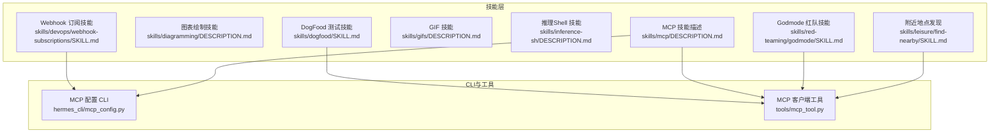
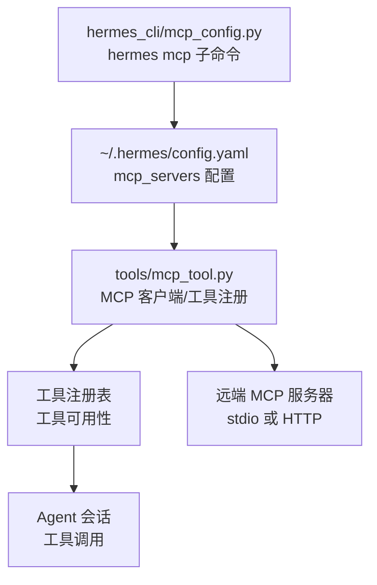
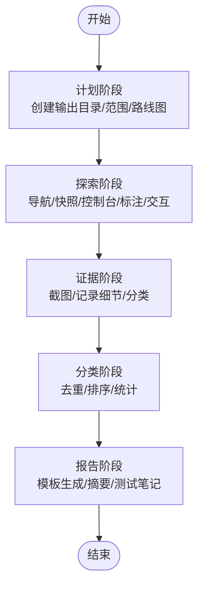
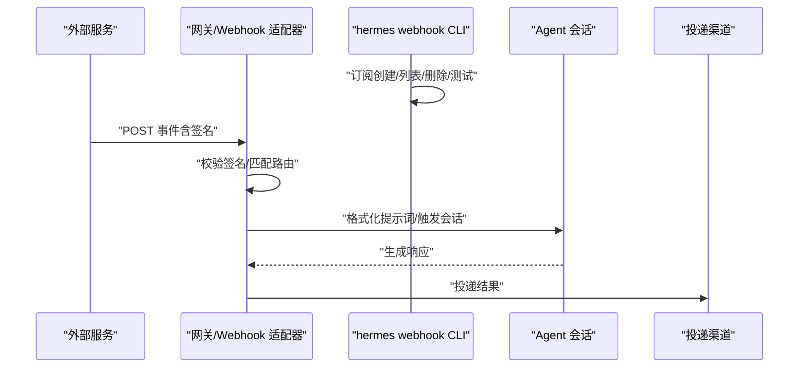
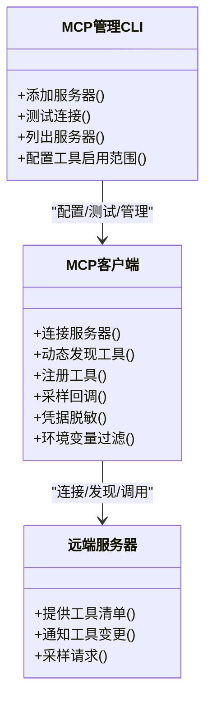
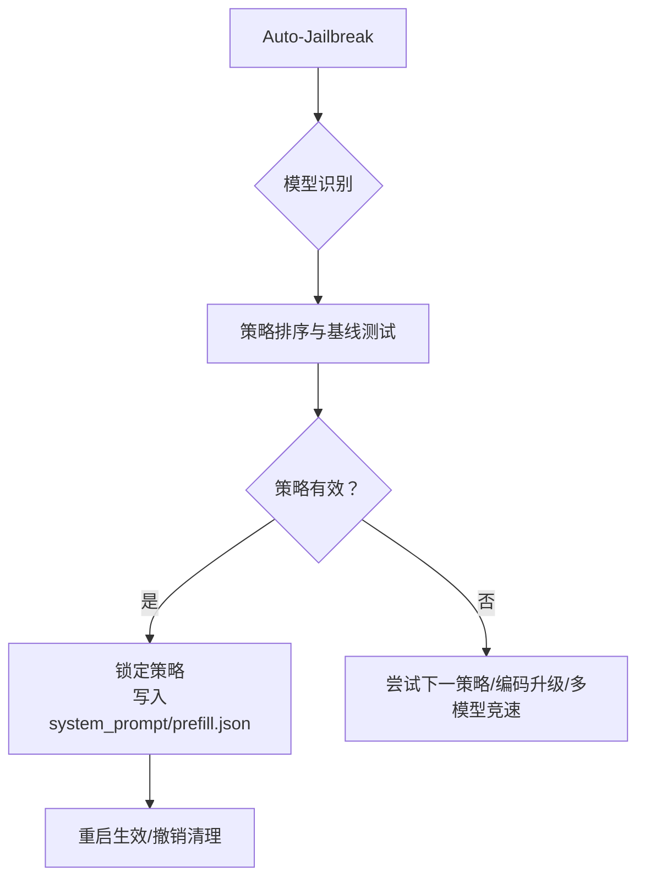
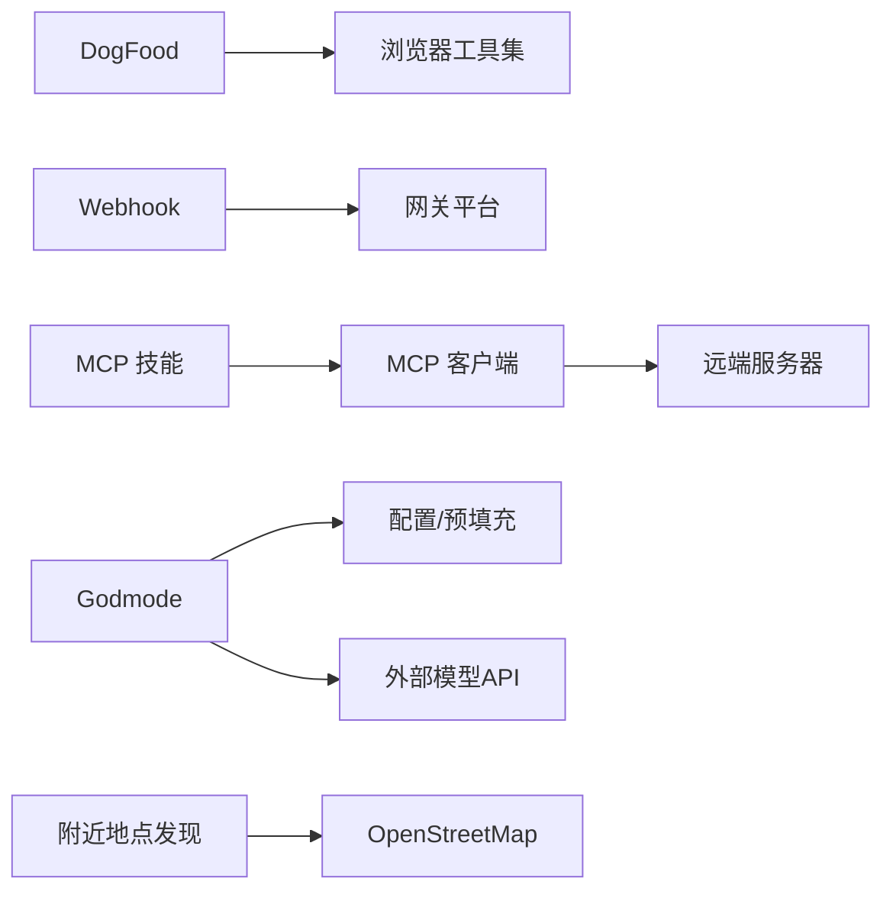

# 其他专业技能

<cite>
**本文引用的文件**
- [skills/dogfood/SKILL.md](file://skills/dogfood/SKILL.md)
- [skills/diagramming/DESCRIPTION.md](file://skills/diagramming/DESCRIPTION.md)
- [skills/devops/webhook-subscriptions/SKILL.md](file://skills/devops/webhook-subscriptions/SKILL.md)
- [skills/gifs/DESCRIPTION.md](file://skills/gifs/DESCRIPTION.md)
- [skills/inference-sh/DESCRIPTION.md](file://skills/inference-sh/DESCRIPTION.md)
- [skills/red-teaming/godmode/SKILL.md](file://skills/red-teaming/godmode/SKILL.md)
- [skills/mcp/DESCRIPTION.md](file://skills/mcp/DESCRIPTION.md)
- [skills/leisure/find-nearby/SKILL.md](file://skills/leisure/find-nearby/SKILL.md)
- [hermes_cli/mcp_config.py](file://hermes_cli/mcp_config.py)
- [tools/mcp_tool.py](file://tools/mcp_tool.py)
</cite>

## 目录
1. [简介](#简介)
2. [项目结构](#项目结构)
3. [核心组件](#核心组件)
4. [架构总览](#架构总览)
5. [详细组件分析](#详细组件分析)
6. [依赖关系分析](#依赖关系分析)
7. [性能考量](#性能考量)
8. [故障排查指南](#故障排查指南)
9. [结论](#结论)
10. [附录](#附录)

## 简介
本章节面向Hermes Agent的“其他专业技能”，系统性梳理以下特殊用途能力：内部测试（DogFood）、图表绘制、信息订阅（Webhook）、GIF处理、推理Shell、休闲娱乐（附近地点发现）、MCP协议集成与工具桥接、以及红队测试（Godmode）。文档将从功能特性、应用场景、使用方法、质量保障流程、可视化方案、内容管理、工具集成、安全与合规、性能与成本、故障排查等方面进行深入说明，并提供配置方法、使用技巧与注意事项。

## 项目结构
围绕“其他专业技能”的实现，主要涉及如下模块：
- 技能层：各技能的描述与使用说明位于skills目录下对应子目录的SKILL.md或DESCRIPTION.md中。
- 命令行与配置：hermes_cli子命令负责MCP服务器管理；tools/mcp_tool.py提供MCP客户端能力与工具注册。
- 平台与网关：devops/webhook-subscriptions技能通过网关平台接收外部事件并触发会话运行。
- 辅助工具：部分技能依赖终端工具、浏览器工具集、图像生成工具等。

**图示来源**
- [skills/dogfood/SKILL.md:1-162](file://skills/dogfood/SKILL.md#L1-L162)
- [skills/devops/webhook-subscriptions/SKILL.md:1-181](file://skills/devops/webhook-subscriptions/SKILL.md#L1-L181)
- [skills/mcp/DESCRIPTION.md:1-4](file://skills/mcp/DESCRIPTION.md#L1-L4)
- [hermes_cli/mcp_config.py:1-717](file://hermes_cli/mcp_config.py#L1-L717)
- [tools/mcp_tool.py:1-800](file://tools/mcp_tool.py#L1-L800)

**章节来源**
- [skills/dogfood/SKILL.md:1-162](file://skills/dogfood/SKILL.md#L1-L162)
- [skills/devops/webhook-subscriptions/SKILL.md:1-181](file://skills/devops/webhook-subscriptions/SKILL.md#L1-L181)
- [skills/mcp/DESCRIPTION.md:1-4](file://skills/mcp/DESCRIPTION.md#L1-L4)
- [hermes_cli/mcp_config.py:1-717](file://hermes_cli/mcp_config.py#L1-L717)
- [tools/mcp_tool.py:1-800](file://tools/mcp_tool.py#L1-L800)

## 核心组件
- 内部测试（DogFood）：系统化探索式Web应用QA，覆盖计划、探索、证据收集、分类与报告生成的完整闭环，强调静默JS错误、交互元素标注与截图证据。
- 图表绘制：基于Excalidraw等工具生成流程图、架构图、示意图，支持AI辅助的视觉分析与标注。
- 信息订阅（Webhook）：动态订阅外部服务事件，自动触发Agent运行，支持HMAC签名验证、事件过滤与多平台投递。
- GIF处理：搜索、下载与工作于GIF与短时机动画媒体的技能集合。
- 推理Shell：通过inference.sh平台统一访问多类AI能力（图像生成、视频生成、LLM、搜索、3D、音频等），简化多源密钥管理。
- 休闲娱乐：基于OpenStreetMap的附近地点发现，支持坐标、地址、地标、邮编等多种输入方式。
- MCP协议：内置原生MCP客户端，支持HTTP/stdio传输、动态工具发现、采样回调（server-initiated LLM请求）、环境变量过滤与凭据脱敏。
- 红队测试（Godmode）：针对API服务模型的安全绕过技术，包括GODMODE模板、Parseltongue输入混淆、多模型竞速、预填充消息注入与持久化策略。

**章节来源**
- [skills/dogfood/SKILL.md:1-162](file://skills/dogfood/SKILL.md#L1-L162)
- [skills/diagramming/DESCRIPTION.md:1-4](file://skills/diagramming/DESCRIPTION.md#L1-L4)
- [skills/devops/webhook-subscriptions/SKILL.md:1-181](file://skills/devops/webhook-subscriptions/SKILL.md#L1-L181)
- [skills/gifs/DESCRIPTION.md:1-4](file://skills/gifs/DESCRIPTION.md#L1-L4)
- [skills/inference-sh/DESCRIPTION.md:1-20](file://skills/inference-sh/DESCRIPTION.md#L1-L20)
- [skills/leisure/find-nearby/SKILL.md:1-70](file://skills/leisure/find-nearby/SKILL.md#L1-L70)
- [skills/mcp/DESCRIPTION.md:1-4](file://skills/mcp/DESCRIPTION.md#L1-L4)
- [skills/red-teaming/godmode/SKILL.md:1-404](file://skills/red-teaming/godmode/SKILL.md#L1-L404)

## 架构总览
下图展示MCP技能在系统中的位置与交互：CLI负责服务器与工具配置，MCP客户端连接远端服务器，动态发现工具并注册到工具注册表，供Agent在会话中调用。

**图示来源**
- [hermes_cli/mcp_config.py:1-717](file://hermes_cli/mcp_config.py#L1-L717)
- [tools/mcp_tool.py:1-800](file://tools/mcp_tool.py#L1-L800)

**章节来源**
- [hermes_cli/mcp_config.py:1-717](file://hermes_cli/mcp_config.py#L1-L717)
- [tools/mcp_tool.py:1-800](file://tools/mcp_tool.py#L1-L800)

## 详细组件分析

### 内部测试（DogFood）
- 功能概述
  - 系统化探索式Web应用QA：导航、快照、控制台检查、视觉标注、交互测试、证据截图、问题分类与报告生成。
  - 强调静默JS错误、键盘导航、滚动长页、边缘用例（空状态、404等）。
- 质量保证流程
  - 计划阶段：输出目录结构、范围与路线图。
  - 探索阶段：每次交互后检查控制台与视觉变化，确保行为符合预期。
  - 证据阶段：记录URL、步骤、期望/实际行为、控制台错误与截图路径。
  - 分类阶段：去重、合并同类问题、按严重度排序、统计汇总。
  - 报告阶段：使用模板生成可内嵌图片的Markdown报告。
- 使用建议
  - 每次显著交互后执行控制台检查。
  - 对交互元素使用标注模式以便后续引用。
  - 结合表单无效输入与边界条件测试。
  - 将截图以媒体占位符形式回传，便于用户在线查看。

**图示来源**
- [skills/dogfood/SKILL.md:29-136](file://skills/dogfood/SKILL.md#L29-L136)

**章节来源**
- [skills/dogfood/SKILL.md:1-162](file://skills/dogfood/SKILL.md#L1-L162)

### 图表绘制
- 功能概述
  - 利用Excalidraw等工具生成流程图、架构图、示意图，结合AI视觉分析提升可读性。
- 可视化方案
  - 通过视觉标注与元素编号，将交互元素映射到后续命令引用，便于精确操作。
  - 支持将截图作为证据内嵌至报告或对话中。
- 应用场景
  - 设计评审、需求澄清、技术讲解、跨团队沟通。

**章节来源**
- [skills/diagramming/DESCRIPTION.md:1-4](file://skills/diagramming/DESCRIPTION.md#L1-L4)

### 信息订阅（Webhook）
- 功能概述
  - 创建与管理Webhook订阅，使外部服务（GitHub、GitLab、Stripe、CI/CD、IoT、监控）在事件发生时自动触发Agent运行。
- 内容管理
  - 支持事件类型过滤、提示词模板（点号访问嵌套字段）、技能选择与投递目标（Telegram、Discord、GitHub评论等）。
- 安全与合规
  - HMAC签名验证、静态路由不可被动态订阅覆盖、订阅持久化至配置文件。
- 运行机制
  - CLI写入订阅配置，适配器热加载并在请求到达时格式化提示词并触发会话，响应投递给指定渠道。
- 故障排查
  - 确认网关运行、监听端口可达、签名匹配、事件类型正确、必要时使用测试命令验证路由。

**图示来源**
- [skills/devops/webhook-subscriptions/SKILL.md:164-169](file://skills/devops/webhook-subscriptions/SKILL.md#L164-L169)

**章节来源**
- [skills/devops/webhook-subscriptions/SKILL.md:1-181](file://skills/devops/webhook-subscriptions/SKILL.md#L1-L181)

### GIF处理
- 功能概述
  - 提供搜索、下载与处理GIF及短时机动画媒体的能力集合。
- 应用场景
  - 社交传播、创意表达、演示素材、情绪调节。

**章节来源**
- [skills/gifs/DESCRIPTION.md:1-4](file://skills/gifs/DESCRIPTION.md#L1-L4)

### 推理Shell（inference.sh）
- 功能概述
  - 通过单一API密钥访问图像生成、视频生成、LLM、搜索、3D、音频、社交自动化等多类能力。
- 使用建议
  - 统一密钥管理，减少多源密钥维护成本。
  - 根据任务类型选择合适模型与参数。

**章节来源**
- [skills/inference-sh/DESCRIPTION.md:1-20](file://skills/inference-sh/DESCRIPTION.md#L1-L20)

### 休闲娱乐（附近地点发现）
- 功能概述
  - 基于OpenStreetMap发现附近餐厅、咖啡馆、酒吧、药店等场所，支持坐标、地址、城市、邮编、地标输入。
- 工作流
  - 获取位置（坐标/地址/地标/邮编）→偏好确认（类型/半径/是否营业）→执行脚本→呈现结果与谷歌地图链接→必要时交叉检索营业时间。
- 注意事项
  - 地区覆盖差异、模糊邮编需补充国家/州信息、可适当扩大半径。

**章节来源**
- [skills/leisure/find-nearby/SKILL.md:1-70](file://skills/leisure/find-nearby/SKILL.md#L1-L70)

### MCP协议（工具集成）
- 功能概述
  - 内置原生MCP客户端，支持HTTP与stdio传输、动态工具发现、通知驱动的工具刷新、采样回调（server-initiated LLM请求）、环境变量过滤与凭据脱敏。
- CLI管理
  - hermes mcp add：添加服务器、自动探测工具、选择启用范围、保存配置。
  - hermes mcp list/test/configure：列出、测试连接、重新配置工具启用范围。
- 安全与稳定性
  - 连接失败重试、超时控制、凭据脱敏、仅传递安全环境变量。
- 采样回调
  - 服务器可请求LLM完成，支持速率限制、模型白名单、最大轮次限制与审计日志。

**图示来源**
- [hermes_cli/mcp_config.py:219-408](file://hermes_cli/mcp_config.py#L219-L408)
- [tools/mcp_tool.py:720-800](file://tools/mcp_tool.py#L720-L800)

**章节来源**
- [skills/mcp/DESCRIPTION.md:1-4](file://skills/mcp/DESCRIPTION.md#L1-L4)
- [hermes_cli/mcp_config.py:1-717](file://hermes_cli/mcp_config.py#L1-L717)
- [tools/mcp_tool.py:1-800](file://tools/mcp_tool.py#L1-L800)

### 红队测试（Godmode）
- 功能概述
  - 针对API服务模型的安全绕过技术，包括GODMODE系统提示模板、Parseltongue输入混淆、多模型竞速、预填充消息注入与持久化策略。
- 攻击模式
  - GODMODE CLASSIC：特定模型的系统提示模板。
  - PARSELTONGUE：33种输入混淆技术，分轻/标/重三层。
  - ULTRAPLINIAN：通过OpenRouter并行查询N模型，综合评分择优。
- 自动化与持久化
  - 自动检测模型、测试策略、锁定最优策略并写入配置与预填充消息文件，支持撤销。
- 使用建议
  - 优先尝试预填充+系统提示组合；对顽固拒绝采用编码升级与多模型竞速；注意灰度与硬性内容的区别；谨慎使用竞速带来的成本。

**图示来源**
- [skills/red-teaming/godmode/SKILL.md:55-116](file://skills/red-teaming/godmode/SKILL.md#L55-L116)

**章节来源**
- [skills/red-teaming/godmode/SKILL.md:1-404](file://skills/red-teaming/godmode/SKILL.md#L1-L404)

## 依赖关系分析
- 技能与工具
  - DogFood依赖浏览器工具集（导航、快照、点击、类型、滚动、返回、按键、视觉标注、控制台）。
  - Webhook订阅依赖网关平台与外部服务的事件推送。
  - MCP技能依赖MCP客户端与远端服务器工具清单。
  - Godmode依赖系统提示与预填充消息，结合外部模型API。
- 配置与持久化
  - MCP服务器配置存储于用户家目录配置文件；Webhook订阅持久化于独立JSON文件；DogFood输出目录结构由技能自身管理。
- 外部依赖
  - MCP SDK可选依赖；inference.sh平台API；OpenStreetMap数据；浏览器工具集。

**图示来源**
- [skills/dogfood/SKILL.md:19-150](file://skills/dogfood/SKILL.md#L19-L150)
- [skills/devops/webhook-subscriptions/SKILL.md:164-169](file://skills/devops/webhook-subscriptions/SKILL.md#L164-L169)
- [skills/mcp/DESCRIPTION.md:1-4](file://skills/mcp/DESCRIPTION.md#L1-L4)
- [skills/red-teaming/godmode/SKILL.md:1-404](file://skills/red-teaming/godmode/SKILL.md#L1-L404)
- [skills/leisure/find-nearby/SKILL.md:1-70](file://skills/leisure/find-nearby/SKILL.md#L1-L70)

**章节来源**
- [skills/dogfood/SKILL.md:1-162](file://skills/dogfood/SKILL.md#L1-L162)
- [skills/devops/webhook-subscriptions/SKILL.md:1-181](file://skills/devops/webhook-subscriptions/SKILL.md#L1-L181)
- [skills/mcp/DESCRIPTION.md:1-4](file://skills/mcp/DESCRIPTION.md#L1-L4)
- [skills/red-teaming/godmode/SKILL.md:1-404](file://skills/red-teaming/godmode/SKILL.md#L1-L404)
- [skills/leisure/find-nearby/SKILL.md:1-70](file://skills/leisure/find-nearby/SKILL.md#L1-L70)

## 性能考量
- DogFood
  - 控制台检查与视觉标注频率应平衡覆盖率与效率；建议批量截图后统一上传，减少往返次数。
- Webhook
  - 订阅热加载采用时间戳门控，开销极低；建议合理设置事件过滤与提示词模板，避免冗余触发。
- MCP
  - 采样回调默认线程化调用，避免阻塞事件循环；建议配置合理的速率限制与最大轮次，防止无限工具循环。
- Godmode
  - 多模型竞速成本较高，建议先用轻量策略与编码升级，必要时再切换到竞速；灰度内容更易突破，硬性内容需直接换模型或放弃。
- 附近地点发现
  - OSM数据社区维护，覆盖因地区而异；可通过扩大半径与补充地理上下文提高召回。

[本节为通用指导，无需具体文件分析]

## 故障排查指南
- DogFood
  - 若出现静默JS错误：务必在导航与重大交互后执行控制台检查；优先修复高危问题。
- Webhook
  - 网关未运行：检查服务状态与健康端点；签名不匹配：核对服务侧密钥与订阅密钥；防火墙/NAT：使用隧道暴露本地服务；事件类型不符：使用测试命令验证路由。
- MCP
  - 连接失败：检查URL/命令与参数、认证头、环境变量；工具为空：确认服务器已正确提供工具清单；动态发现：等待通知触发刷新。
- Godmode
  - 策略失效：模型更新导致边界技巧失效；采用编码升级或多模型竞速；预填充持久化：注意ephemeral特性与重启后重载。
- 附近地点发现
  - 结果稀疏：扩大半径；模糊邮编：补充国家/州；覆盖差异：不同地区数据质量不同。

**章节来源**
- [skills/devops/webhook-subscriptions/SKILL.md:171-181](file://skills/devops/webhook-subscriptions/SKILL.md#L171-L181)
- [skills/red-teaming/godmode/SKILL.md:390-404](file://skills/red-teaming/godmode/SKILL.md#L390-L404)

## 结论
上述“其他专业技能”覆盖了从质量保障、可视化、自动化触发、多媒体处理、推理资源聚合、地理信息到协议集成与安全研究的广泛场景。通过标准化的配置与CLI管理、完善的错误处理与安全机制，Hermes Agent能够在复杂环境中稳定地交付高质量的自动化能力。建议在生产使用中遵循最小权限原则、严格验证外部输入、合理控制成本与风险。

[本节为总结，无需具体文件分析]

## 附录
- 最佳实践
  - DogFood：建立固定检查点，记录静默错误与交互变化；报告中使用媒体占位符便于溯源。
  - Webhook：明确事件类型与提示词模板，配置签名与投递目标；定期测试路由。
  - MCP：优先启用必要工具，配置超时与速率限制；利用采样回调增强协作式工具链。
  - Godmode：先轻后重，先预填充后模板，最后竞速；关注灰度与硬性内容差异。
  - 附近地点发现：补充地理上下文，扩大半径，交叉检索营业时间。
- 配置要点
  - MCP：在配置文件中定义服务器与工具启用范围；CLI用于添加、测试与重新配置。
  - Webhook：启用网关平台，配置端口与全局密钥；订阅持久化于配置文件。
  - DogFood：输出目录结构清晰，截图路径纳入报告模板。
  - Godmode：系统提示与预填充消息写入配置；必要时撤销清理。

[本节为通用指导，无需具体文件分析]