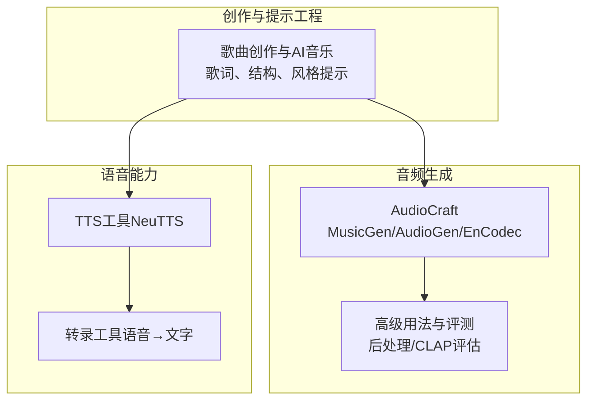
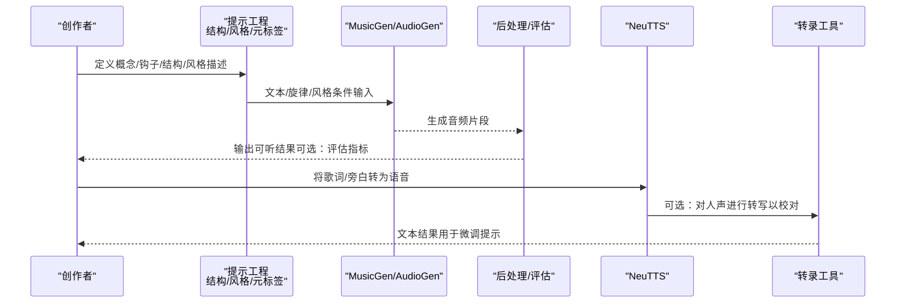
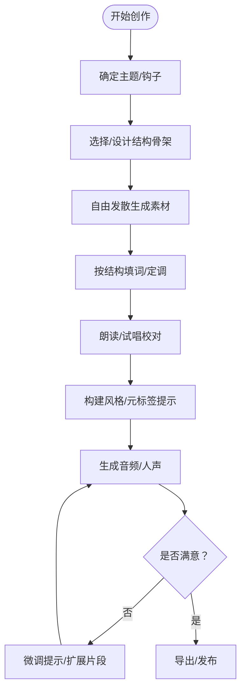
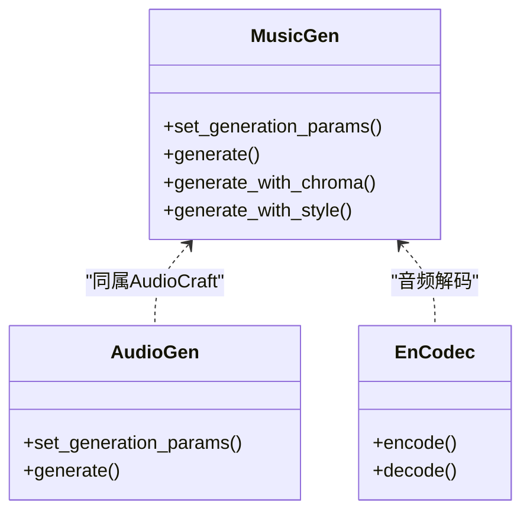
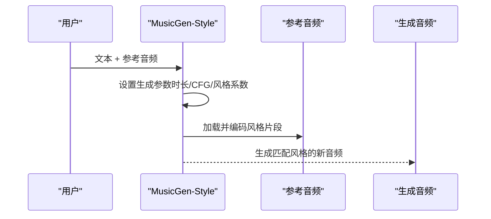
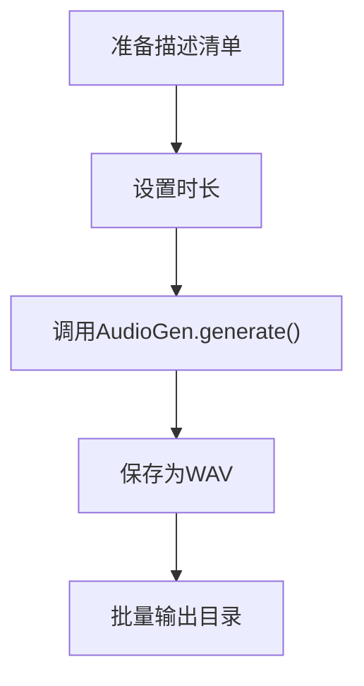
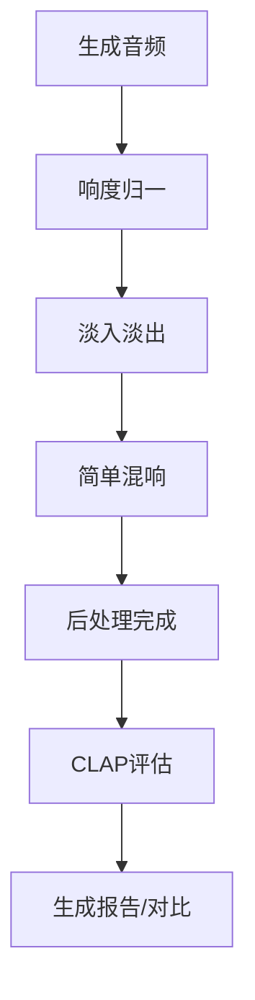
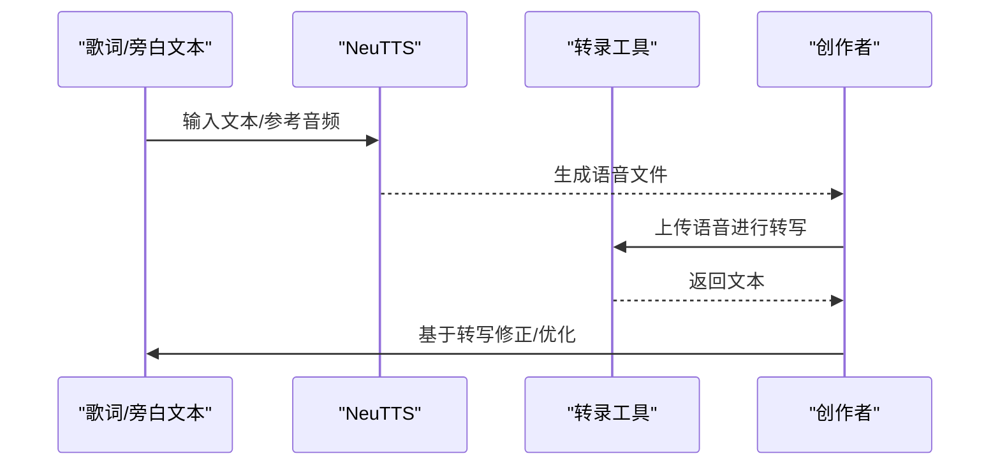
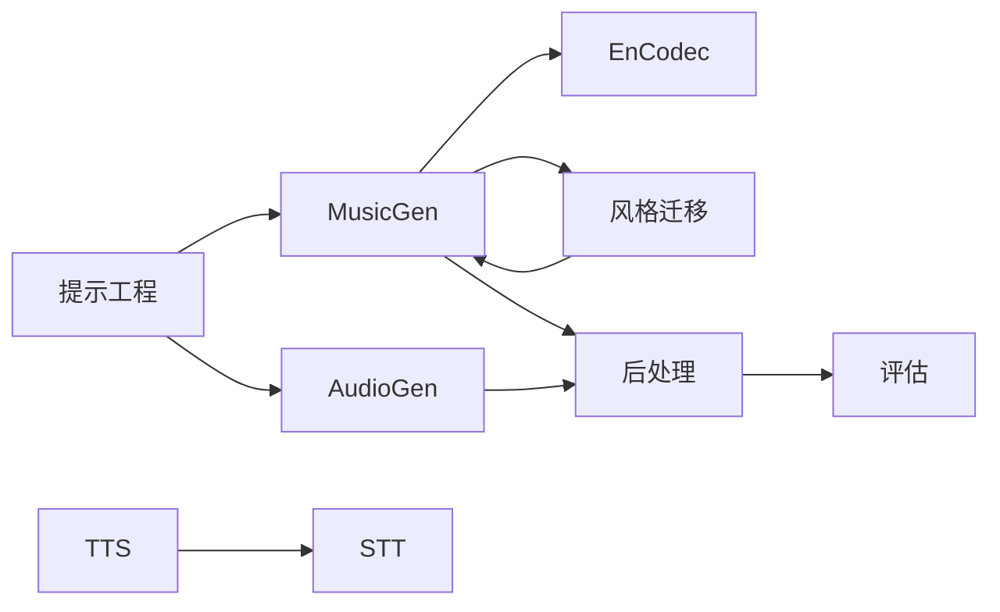

# AI音乐创作技能

<cite>
**本文引用的文件**
- [技能：歌曲创作与AI音乐](file://skills/creative/songwriting-and-ai-music/SKILL.md)
- [技能：AudioCraft音频生成](file://skills/mlops/models/audiocraft/SKILL.md)
- [AudioCraft高级用法与评测](file://skills/mlops/models/audiocraft/references/advanced-usage.md)
- [NeuTTS语音合成工具](file://tools/tts_tool.py)
- [NeuTTS独立合成器](file://tools/neutts_synth.py)
- [转录工具模块](file://tools/transcription_tools.py)
</cite>

## 目录
1. [简介](#简介)
2. [项目结构](#项目结构)
3. [核心组件](#核心组件)
4. [架构总览](#架构总览)
5. [详细组件分析](#详细组件分析)
6. [依赖关系分析](#依赖关系分析)
7. [性能考量](#性能考量)
8. [故障排查指南](#故障排查指南)
9. [结论](#结论)
10. [附录](#附录)

## 简介
本文件面向“AI音乐创作技能”，系统化梳理从创意到成品的全流程：包括AI音乐生成的基本原理、音频合成技术、创作流程与结构设计、旋律与和声编排、歌词生成方法、风格与情感表达策略，并提供流行、电子、古典等风格的实践参考。同时给出质量评估、技巧提升与作品优化建议，帮助创作者高效产出高质量音乐作品。

## 项目结构
围绕AI音乐创作，本仓库提供了多类能力：
- 歌词与结构创作指导（提示工程、韵律、动态弧线）
- 基于文本的音乐生成（MusicGen）、音效生成（AudioGen）与风格迁移（MusicGen-Style）
- 音频后处理与评估指标
- 文本转语音（TTS）与语音转文字（STT）能力，支撑人声参与与反馈闭环

图示来源
- [技能：歌曲创作与AI音乐:1-290](file://skills/creative/songwriting-and-ai-music/SKILL.md#L1-L290)
- [技能：AudioCraft音频生成:1-568](file://skills/mlops/models/audiocraft/SKILL.md#L1-L568)
- [AudioCraft高级用法与评测:530-646](file://skills/mlops/models/audiocraft/references/advanced-usage.md#L530-L646)
- [NeuTTS语音合成工具:460-510](file://tools/tts_tool.py#L460-L510)
- [转录工具模块:1-709](file://tools/transcription_tools.py#L1-L709)

章节来源
- [技能：歌曲创作与AI音乐:1-290](file://skills/creative/songwriting-and-ai-music/SKILL.md#L1-L290)
- [技能：AudioCraft音频生成:1-568](file://skills/mlops/models/audiocraft/SKILL.md#L1-L568)

## 核心组件
- 创作提示工程与结构设计：提供结构骨架、韵律与节拍、情感动态、钩子与副歌定位等创作方法论。
- 文本驱动音乐生成：使用MusicGen进行文本到音乐生成、基于旋律条件生成、立体声生成、续写等。
- 音效与环境音生成：使用AudioGen生成环境音、动作音效等。
- 风格迁移与参考生成：使用MusicGen-Style进行风格参考生成。
- 音频后处理与评估：提供响度归一、淡入淡出、简单混响等后处理，以及CLAP一致性评估。
- 语音合成与转写：NeuTTS本地语音合成；转录工具支持多提供商（本地/云端），用于将语音反馈纳入创作迭代。

章节来源
- [技能：歌曲创作与AI音乐:25-290](file://skills/creative/songwriting-and-ai-music/SKILL.md#L25-L290)
- [技能：AudioCraft音频生成:175-314](file://skills/mlops/models/audiocraft/SKILL.md#L175-L314)
- [AudioCraft高级用法与评测:530-646](file://skills/mlops/models/audiocraft/references/advanced-usage.md#L530-L646)
- [NeuTTS语音合成工具:460-510](file://tools/tts_tool.py#L460-L510)
- [转录工具模块:1-709](file://tools/transcription_tools.py#L1-L709)

## 架构总览
下图展示从“创意与提示”到“生成与评估”的端到端工作流：

图示来源
- [技能：歌曲创作与AI音乐:154-228](file://skills/creative/songwriting-and-ai-music/SKILL.md#L154-L228)
- [技能：AudioCraft音频生成:175-314](file://skills/mlops/models/audiocraft/SKILL.md#L175-L314)
- [AudioCraft高级用法与评测:530-646](file://skills/mlops/models/audiocraft/references/advanced-usage.md#L530-L646)
- [NeuTTS语音合成工具:460-510](file://tools/tts_tool.py#L460-L510)
- [转录工具模块:1-709](file://tools/transcription_tools.py#L1-L709)

## 详细组件分析

### 组件A：歌曲结构与创作流程
- 结构骨架：ABABCB、AABA、ABAB、AAA等常见模板，强调“服务于情感而非刻板公式”。
- 六大板块：前奏、主歌、预副歌、副歌、桥段、尾奏，按需取舍。
- 韵律与节拍：近韵、头韵、内韵、节奏重音与行内韵的混合使用。
- 情感动态：能量映射、对比技巧（静中有动、慢中有快、低中有高）。
- 钩子与副歌：标题即钩子，旋律、歌词、情绪三者契合；通常置于首/尾。
- 修订迭代：先生成原始素材，再逐步完善结构与韵律。

图示来源
- [技能：歌曲创作与AI音乐:25-118](file://skills/creative/songwriting-and-ai-music/SKILL.md#L25-L118)
- [技能：歌曲创作与AI音乐:255-270](file://skills/creative/songwriting-and-ai-music/SKILL.md#L255-L270)

章节来源
- [技能：歌曲创作与AI音乐:25-118](file://skills/creative/songwriting-and-ai-music/SKILL.md#L25-L118)
- [技能：歌曲创作与AI音乐:255-270](file://skills/creative/songwriting-and-ai-music/SKILL.md#L255-L270)

### 组件B：文本到音乐生成（MusicGen）
- 模型变体：small/medium/large、melody、melody-large、stereo、style等。
- 关键参数：时长、top_k、温度、CFG系数等。
- 使用方式：纯文本生成、基于旋律条件生成、仅风格参考生成、音频续写、批量生成、Gradio演示等。
- 立体声输出：支持双声道空间分布。
- 性能优化：小模型、减少时长、半精度、批处理、显存占用表。

图示来源
- [技能：AudioCraft音频生成:152-174](file://skills/mlops/models/audiocraft/SKILL.md#L152-L174)
- [技能：AudioCraft音频生成:175-314](file://skills/mlops/models/audiocraft/SKILL.md#L175-L314)
- [技能：AudioCraft音频生成:315-370](file://skills/mlops/models/audiocraft/SKILL.md#L315-L370)

章节来源
- [技能：AudioCraft音频生成:152-174](file://skills/mlops/models/audiocraft/SKILL.md#L152-L174)
- [技能：AudioCraft音频生成:175-314](file://skills/mlops/models/audiocraft/SKILL.md#L175-L314)
- [技能：AudioCraft音频生成:315-370](file://skills/mlops/models/audiocraft/SKILL.md#L315-L370)

### 组件C：风格迁移与参考生成（MusicGen-Style）
- 通过参考音频进行风格迁移，适合“在特定风格下生成新内容”。
- 参数：时长、CFG系数、风格影响系数、风格片段长度等。
- 适用场景：保持既有风格的同时探索新的歌词或旋律方向。

图示来源
- [技能：AudioCraft音频生成:271-314](file://skills/mlops/models/audiocraft/SKILL.md#L271-L314)

章节来源
- [技能：AudioCraft音频生成:271-314](file://skills/mlops/models/audiocraft/SKILL.md#L271-L314)

### 组件D：音效与环境音生成（AudioGen）
- 用途：自然环境、城市交通、动作音效等。
- 流程：设置时长 → 描述 → 生成 → 保存。
- 批量处理：支持批量音效生成与目录输出。

图示来源
- [技能：AudioCraft音频生成:315-338](file://skills/mlops/models/audiocraft/SKILL.md#L315-L338)
- [技能：AudioCraft音频生成:420-466](file://skills/mlops/models/audiocraft/SKILL.md#L420-L466)

章节来源
- [技能：AudioCraft音频生成:315-338](file://skills/mlops/models/audiocraft/SKILL.md#L315-L338)
- [技能：AudioCraft音频生成:420-466](file://skills/mlops/models/audiocraft/SKILL.md#L420-L466)

### 组件E：音频后处理与评估
- 后处理：响度归一、淡入淡出、简单混响。
- 评估：CLAP一致性指标，衡量文本与音频的语义一致性。
- 模型对比：不同MusicGen变体在质量与时耗上的权衡。

图示来源
- [AudioCraft高级用法与评测:530-594](file://skills/mlops/models/audiocraft/references/advanced-usage.md#L530-L594)
- [AudioCraft高级用法与评测:596-646](file://skills/mlops/models/audiocraft/references/advanced-usage.md#L596-L646)

章节来源
- [AudioCraft高级用法与评测:530-594](file://skills/mlops/models/audiocraft/references/advanced-usage.md#L530-L594)
- [AudioCraft高级用法与评测:596-646](file://skills/mlops/models/audiocraft/references/advanced-usage.md#L596-L646)

### 组件F：文本转语音（TTS）与语音转文字（STT）
- TTS：NeuTTS本地语音合成，支持参考音频/文本，子进程运行避免常驻内存。
- STT：本地faster-whisper优先，支持Groq/OpenAI/Mistral多提供商自动降级。
- 工作流：歌词/旁白→TTS→转写→校对→微调提示。

图示来源
- [NeuTTS语音合成工具:460-510](file://tools/tts_tool.py#L460-L510)
- [NeuTTS独立合成器:51-105](file://tools/neutts_synth.py#L51-L105)
- [转录工具模块:593-666](file://tools/transcription_tools.py#L593-L666)

章节来源
- [NeuTTS语音合成工具:460-510](file://tools/tts_tool.py#L460-L510)
- [NeuTTS独立合成器:51-105](file://tools/neutts_synth.py#L51-L105)
- [转录工具模块:593-666](file://tools/transcription_tools.py#L593-L666)

## 依赖关系分析
- MusicGen/AudioGen/EnCodec属于同一生态，分别负责音乐生成、音效生成与音频压缩/解压。
- MusicGen-Style依赖参考音频以实现风格迁移。
- TTS与STT形成“语音输入→文本理解→反馈优化”的闭环。
- 后处理与评估模块贯穿生成链路，提升成品质量与可比性。

图示来源
- [技能：AudioCraft音频生成:152-174](file://skills/mlops/models/audiocraft/SKILL.md#L152-L174)
- [技能：AudioCraft音频生成:271-314](file://skills/mlops/models/audiocraft/SKILL.md#L271-L314)
- [AudioCraft高级用法与评测:530-594](file://skills/mlops/models/audiocraft/references/advanced-usage.md#L530-L594)
- [转录工具模块:1-709](file://tools/transcription_tools.py#L1-L709)

章节来源
- [技能：AudioCraft音频生成:152-174](file://skills/mlops/models/audiocraft/SKILL.md#L152-L174)
- [技能：AudioCraft音频生成:271-314](file://skills/mlops/models/audiocraft/SKILL.md#L271-L314)
- [AudioCraft高级用法与评测:530-594](file://skills/mlops/models/audiocraft/references/advanced-usage.md#L530-L594)
- [转录工具模块:1-709](file://tools/transcription_tools.py#L1-L709)

## 性能考量
- 显存与时长：不同模型变体在VRAM与生成时间上差异显著，应根据硬件选择合适规模。
- 批处理：一次传入多个提示，比多次单条生成更高效。
- 半精度与小模型：在资源受限时优先使用小模型与半精度。
- 后处理成本：归一、淡入淡出、混响等操作计算开销较低，可作为标准流程。

章节来源
- [技能：AudioCraft音频生成:508-545](file://skills/mlops/models/audiocraft/SKILL.md#L508-L545)

## 故障排查指南
- CUDA显存不足：改用小模型、缩短时长、关闭不必要的后处理。
- 音质不佳：提高CFG系数、优化提示词、尝试不同温度。
- 生成过短：检查最大时长设置。
- 音频伪影：调整温度或采样参数。
- 立体声无效：确认使用立体声模型变体。
- STT不可用：安装faster-whisper或配置本地命令模板；或设置GROQ/OpenAI/Mistral密钥。

章节来源
- [技能：AudioCraft音频生成:546-555](file://skills/mlops/models/audiocraft/SKILL.md#L546-L555)
- [转录工具模块:194-275](file://tools/transcription_tools.py#L194-L275)

## 结论
通过“提示工程—文本生成—风格迁移—后处理—评估—语音闭环”的完整链路，创作者可以系统化地生成高质量音乐作品。结合不同风格与情感表达策略，配合TTS/STT形成的人机协作流程，能够持续迭代与优化作品质量。

## 附录
- 实战风格参考
  - 流行：强调钩子与副歌的重复性与记忆点，结构多为ABABCB。
  - 电子：突出节奏与空间感，可利用立体声与环境音增强氛围。
  - 古典：注重和声与织体，可借助风格迁移保留传统配器特征。
- 评估与优化建议
  - 使用CLAP一致性评估文本与音频的语义贴合度。
  - 以“情感弧线”为维度持续微调提示，避免平铺直叙。
  - 保留少量原句/结构，增强辨识度与情感连接。