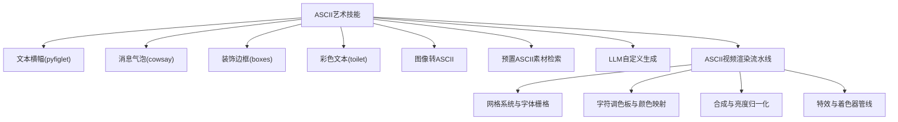
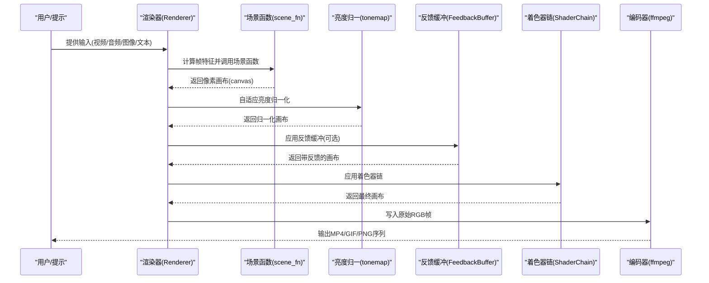
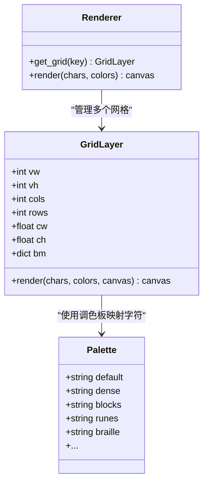
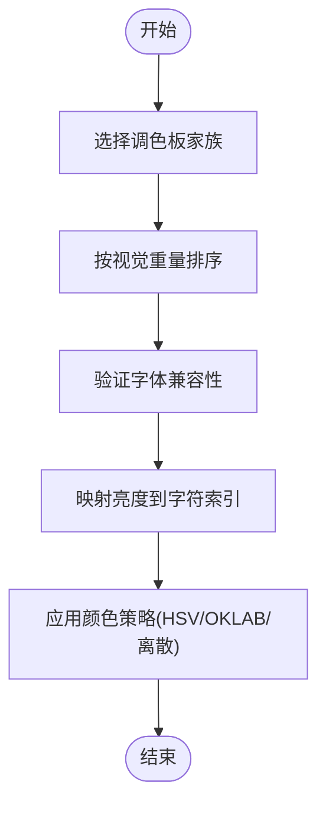
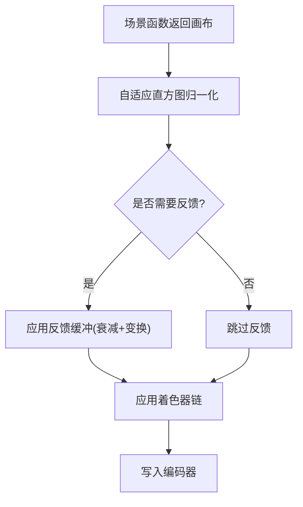
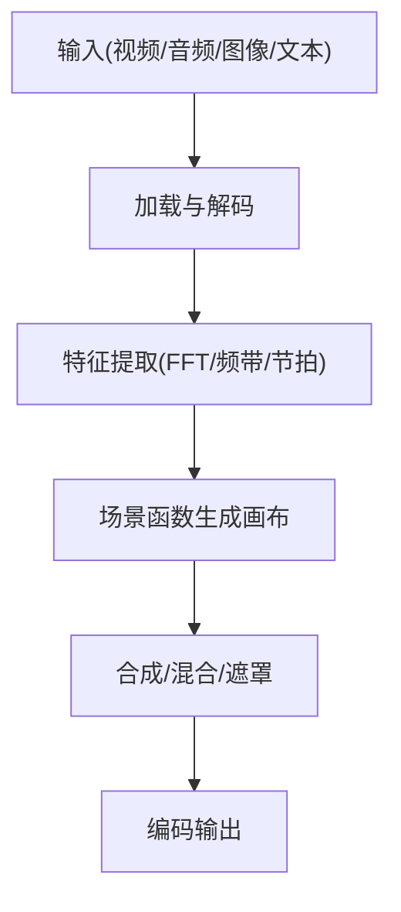
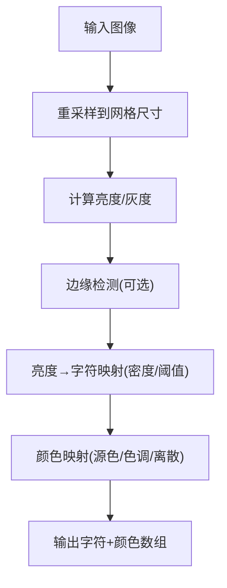
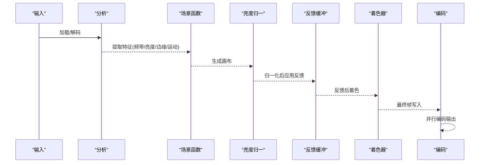
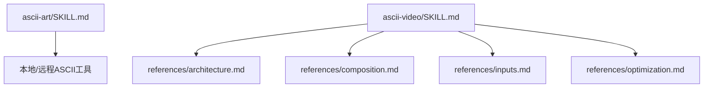

# ASCII艺术技能

<cite>
**本文引用的文件**
- [ascii-art/SKILL.md](file://skills/creative/ascii-art/SKILL.md)
- [ascii-video/SKILL.md](file://skills/creative/ascii-video/SKILL.md)
- [ascii-video/README.md](file://skills/creative/ascii-video/README.md)
- [ascii-video/references/architecture.md](file://skills/creative/ascii-video/references/architecture.md)
- [ascii-video/references/composition.md](file://skills/creative/ascii-video/references/composition.md)
- [ascii-video/references/inputs.md](file://skills/creative/ascii-video/references/inputs.md)
- [ascii-video/references/optimization.md](file://skills/creative/ascii-video/references/optimization.md)
</cite>

## 目录
1. [简介](#简介)
2. [项目结构](#项目结构)
3. [核心组件](#核心组件)
4. [架构总览](#架构总览)
5. [详细组件分析](#详细组件分析)
6. [依赖关系分析](#依赖关系分析)
7. [性能考量](#性能考量)
8. [故障排查指南](#故障排查指南)
9. [结论](#结论)
10. [附录](#附录)

## 简介
本文件系统化梳理了仓库中“ASCII艺术”相关能力，覆盖文本横幅（pyfiglet）、消息气泡（cowsay）、装饰边框（boxes）、彩色文本（toilet）、图像转ASCII、预置ASCII素材检索、以及高级的“ASCII视频”渲染流水线。文档重点阐述：
- 创作原理：字符密度控制、对比度调整、分辨率优化、亮度归一化、颜色映射策略
- 工具使用：本地与远程工具链、多模式输入（文本、音频、视频、图像序列）
- 实战案例：从照片到ASCII艺术的转换流程、视频转ASCII的完整工作流
- 技巧与风格：字符画制作技巧、艺术风格选择、作品展示方法

## 项目结构
围绕ASCII艺术的技能与参考文档主要位于以下路径：
- 文本与简单ASCII工具：skills/creative/ascii-art/SKILL.md
- 高级ASCII视频渲染：skills/creative/ascii-video/SKILL.md、README.md
- 参考资料：ascii-video/references 下的 architecture、composition、inputs、optimization 等文档

图表来源
- [ascii-art/SKILL.md:19-322](file://skills/creative/ascii-art/SKILL.md#L19-L322)
- [ascii-video/SKILL.md:1-233](file://skills/creative/ascii-video/SKILL.md#L1-L233)
- [ascii-video/README.md:1-52](file://skills/creative/ascii-video/README.md#L1-L52)

章节来源
- [ascii-art/SKILL.md:19-322](file://skills/creative/ascii-art/SKILL.md#L19-L322)
- [ascii-video/SKILL.md:1-233](file://skills/creative/ascii-video/SKILL.md#L1-L233)
- [ascii-video/README.md:1-52](file://skills/creative/ascii-video/README.md#L1-L52)

## 核心组件
- 文本横幅（pyfiglet）：本地安装，支持571种字体，可设置宽度与样式；适合标题、徽标等场景。
- 消息气泡（cowsay）：在ASCII角色气泡中输出文本，支持多种角色与表情修饰。
- 装饰边框（boxes）：为任意文本添加70+种边框样式，可与pyfiglet/asciified组合使用。
- 彩色文本（toilet）：支持ANSI色彩与滤镜效果，适合终端视觉效果。
- 图像转ASCII：推荐使用ascii-image-converter或jp2a，支持颜色输出、尺寸设定、负片、Braille字符等。
- 预置ASCII素材检索：通过网页抓取与解析提取HTML中的ASCII艺术。
- LLM自定义生成：基于Unicode字符集进行创意定制，遵循最大宽高限制与等宽要求。
- ASCII视频渲染：完整的6阶段流水线（输入→分析→场景函数→亮度归一→着色→编码），支持多网格叠加、反馈缓冲、遮罩与过渡。

章节来源
- [ascii-art/SKILL.md:19-322](file://skills/creative/ascii-art/SKILL.md#L19-L322)
- [ascii-video/SKILL.md:24-63](file://skills/creative/ascii-video/SKILL.md#L24-L63)

## 架构总览
ASCII视频渲染采用“场景函数→亮度归一→反馈缓冲→着色器→编码”的流水线，核心模块包括：
- 网格系统与字体栅格：按分辨率自动计算字符网格，预光栅化字符位图以提升渲染效率。
- 字符调色板与颜色映射：密度梯度、块元素、符号、脚本、点阵等多类调色板；HSV/OKLAB/离散RGB等多种颜色策略。
- 合成与亮度归一：像素混合模式、多网格叠加、自适应直方图归一化与伽马校正。
- 特效与着色器：38种可组合着色器、反馈缓冲的空间变换、遮罩与过渡。
- 输入与特征：音频频谱分析、视频亮度/边缘/运动检测、图像序列与文本歌词等。

图表来源
- [ascii-video/README.md:24-38](file://skills/creative/ascii-video/README.md#L24-L38)
- [ascii-video/SKILL.md:49-63](file://skills/creative/ascii-video/SKILL.md#L49-L63)

章节来源
- [ascii-video/README.md:24-38](file://skills/creative/ascii-video/README.md#L24-L38)
- [ascii-video/SKILL.md:49-63](file://skills/creative/ascii-video/SKILL.md#L49-L63)

## 详细组件分析

### 组件A：网格系统与字符栅格
- 分辨率预设与网格密度：提供横屏、竖屏、方形、超宽、4K等预设；网格密度从xs到xxl，适配不同视觉需求。
- 字体选择与检测：跨平台字体偏好列表，自动检测可用字体；背景层与文本层可使用不同字体增强层次感。
- 预光栅化与渲染瓶颈：初始化时对所有字符进行位图预光栅化；渲染阶段逐单元格叠加，是主要性能瓶颈。
- 多网格叠加：在同一帧上渲染多个密度的网格，利用字符尺度差异产生纹理互穿，丰富视觉细节。

图表来源
- [ascii-video/references/architecture.md:158-205](file://skills/creative/ascii-video/references/architecture.md#L158-L205)
- [ascii-video/references/architecture.md:245-364](file://skills/creative/ascii-video/references/architecture.md#L245-L364)

章节来源
- [ascii-video/references/architecture.md:5-71](file://skills/creative/ascii-video/references/architecture.md#L5-L71)
- [ascii-video/references/architecture.md:72-137](file://skills/creative/ascii-video/references/architecture.md#L72-L137)
- [ascii-video/references/architecture.md:158-205](file://skills/creative/ascii-video/references/architecture.md#L158-L205)
- [ascii-video/references/architecture.md:245-364](file://skills/creative/ascii-video/references/architecture.md#L245-L364)

### 组件B：字符调色板与颜色映射
- 设计原则：按视觉重量排序、保持家族一致性、非线性映射曲线、确保字体兼容性。
- 调色板库：密度梯度、块元素、符号/主题、脚本/文字系统、点阵/星形/半填充/交叉阴影等。
- 颜色策略：角度映射、距离映射、频率映射、值映射、时间循环、源采样、离散调色板、温度、互补、三元、邻近、单色等。
- OKLAB/OKLCH：提供感知均匀的颜色插值与和谐配色生成，避免HSV在某些色域中的不均匀问题。

图表来源
- [ascii-video/references/architecture.md:247-255](file://skills/creative/ascii-video/references/architecture.md#L247-L255)
- [ascii-video/references/architecture.md:256-312](file://skills/creative/ascii-video/references/architecture.md#L256-L312)
- [ascii-video/references/architecture.md:368-432](file://skills/creative/ascii-video/references/architecture.md#L368-L432)
- [ascii-video/references/architecture.md:434-508](file://skills/creative/ascii-video/references/architecture.md#L434-L508)

章节来源
- [ascii-video/references/architecture.md:247-312](file://skills/creative/ascii-video/references/architecture.md#L247-L312)
- [ascii-video/references/architecture.md:368-432](file://skills/creative/ascii-video/references/architecture.md#L368-L432)
- [ascii-video/references/architecture.md:434-508](file://skills/creative/ascii-video/references/architecture.md#L434-L508)

### 组件C：合成与亮度归一化
- 像素混合模式：提供20种混合模式，区分增亮/减暗/对比/颜色效果/纹理混合等类别，指导在不同场景下的选择。
- 多网格叠加：通过屏幕/差值等混合模式叠加不同密度网格，实现纹理互穿与层次丰富。
- 自适应亮度归一化：基于百分位数的自适应拉伸与伽马校正，避免线性缩放导致的高光截断或低光不可见。
- 反馈缓冲：对前一帧进行衰减与空间变换后与当前帧混合，形成轨迹/拖尾/旋转曼陀罗等效果。

图表来源
- [ascii-video/references/composition.md:268-304](file://skills/creative/ascii-video/references/composition.md#L268-L304)
- [ascii-video/references/composition.md:392-428](file://skills/creative/ascii-video/references/composition.md#L392-L428)

章节来源
- [ascii-video/references/composition.md:7-65](file://skills/creative/ascii-video/references/composition.md#L7-L65)
- [ascii-video/references/composition.md:172-264](file://skills/creative/ascii-video/references/composition.md#L172-L264)
- [ascii-video/references/composition.md:268-304](file://skills/creative/ascii-video/references/composition.md#L268-L304)
- [ascii-video/references/composition.md:392-428](file://skills/creative/ascii-video/references/composition.md#L392-L428)

### 组件D：输入与特征提取
- 音频分析：分频带能量、谱质心、平坦度、通量、节拍检测与指数衰减，用于驱动视觉参数。
- 视频采样：ffmpeg管道解码或OpenCV读取；亮度/边缘/运动检测作为驱动参数。
- 图像序列：静态图像转ASCII与纹理源加载；支持多帧序列动画。
- 文本/歌词：SRT解析与时序显示模式（打字机、淡入、闪烁、散射、波浪）。
- 无输入生成：合成特征模拟音频特征，驱动纯生成式ASCII动画。

图表来源
- [ascii-video/references/inputs.md:5-97](file://skills/creative/ascii-video/references/inputs.md#L5-L97)
- [ascii-video/references/inputs.md:98-197](file://skills/creative/ascii-video/references/inputs.md#L98-L197)
- [ascii-video/references/inputs.md:223-290](file://skills/creative/ascii-video/references/inputs.md#L223-L290)

章节来源
- [ascii-video/references/inputs.md:5-97](file://skills/creative/ascii-video/references/inputs.md#L5-L97)
- [ascii-video/references/inputs.md:98-197](file://skills/creative/ascii-video/references/inputs.md#L98-L197)
- [ascii-video/references/inputs.md:223-290](file://skills/creative/ascii-video/references/inputs.md#L223-L290)

### 组件E：图像转ASCII（从照片到ASCII艺术）
- 光学密度控制：将图像像素亮度映射到字符集，密度梯度调色板提供平滑过渡；稀疏调色板可获得图形化/海报化效果。
- 对比度调整：通过伽马校正与自适应直方图归一化提升整体可见度；必要时结合着色器增强对比。
- 分辨率优化：根据目标显示设备选择合适的网格密度；大尺寸网格适合标题，小网格适合细节纹理。
- 边缘增强：使用边缘检测在轮廓区域采用更精细的字符（如方框绘制），在平坦区域使用亮度字符，提升细节表现。
- 颜色保留：可选择源像素颜色作为字符颜色，或采用色调映射策略（距离/角度/频率/温度等）。

图表来源
- [ascii-video/references/inputs.md:118-161](file://skills/creative/ascii-video/references/inputs.md#L118-L161)
- [ascii-video/references/architecture.md:337-364](file://skills/creative/ascii-video/references/architecture.md#L337-L364)
- [ascii-video/references/composition.md:268-304](file://skills/creative/ascii-video/references/composition.md#L268-L304)

章节来源
- [ascii-video/references/inputs.md:118-161](file://skills/creative/ascii-video/references/inputs.md#L118-L161)
- [ascii-video/references/architecture.md:337-364](file://skills/creative/ascii-video/references/architecture.md#L337-L364)
- [ascii-video/references/composition.md:268-304](file://skills/creative/ascii-video/references/composition.md#L268-L304)

### 组件F：ASCII视频工作流（从照片到ASCII视频）
- 模式选择：视频→ASCII、音频响应、生成式、混合、歌词/文本叠加、TTS旁白等。
- 管道执行：输入→分析→场景函数→亮度归一→着色→编码；每步均可配置参数与着色器。
- 多网格与反馈：在不同密度网格上渲染并叠加，配合反馈缓冲创造轨迹与递归效果。
- 性能与质量：硬件自适应、并行编码、向量化与预光栅化减少瓶颈。

图表来源
- [ascii-video/README.md:24-38](file://skills/creative/ascii-video/README.md#L24-L38)
- [ascii-video/SKILL.md:49-63](file://skills/creative/ascii-video/SKILL.md#L49-L63)
- [ascii-video/references/architecture.md:686-730](file://skills/creative/ascii-video/references/architecture.md#L686-L730)

章节来源
- [ascii-video/README.md:24-38](file://skills/creative/ascii-video/README.md#L24-L38)
- [ascii-video/SKILL.md:49-63](file://skills/creative/ascii-video/SKILL.md#L49-L63)
- [ascii-video/references/architecture.md:686-730](file://skills/creative/ascii-video/references/architecture.md#L686-L730)

## 依赖关系分析
- 工具链依赖：Python 3.10+、NumPy、Pillow、SciPy（音频模式）、ffmpeg、可选OpenCV与ElevenLabs API（TTS）。
- 文件组织：ascii-art为独立技能，ascii-video为复杂渲染流水线，二者共享部分颜色与合成概念但实现方式不同。
- 参考文档：architecture、composition、inputs、optimization等文档相互引用，构成完整的知识体系。

图表来源
- [ascii-art/SKILL.md:1-18](file://skills/creative/ascii-art/SKILL.md#L1-L18)
- [ascii-video/SKILL.md:194-206](file://skills/creative/ascii-video/SKILL.md#L194-L206)

章节来源
- [ascii-art/SKILL.md:1-18](file://skills/creative/ascii-art/SKILL.md#L1-L18)
- [ascii-video/SKILL.md:194-206](file://skills/creative/ascii-video/SKILL.md#L194-L206)

## 性能考量
- 渲染瓶颈：字符渲染为逐单元格叠加，是主要性能瓶颈；建议预光栅化、多网格密度组合、并行编码。
- 性能预算：特征提取1-5ms、效果函数2-15ms、字符渲染80-150ms、着色器5-25ms、ffmpeg编码约5ms；目标单线程5-10fps，8核可达40-80fps。
- 优化策略：向量化计算、预光栅化字符位图、预烘焙静态背景纹理、避免Python循环、合理使用混合模式与遮罩。

章节来源
- [ascii-video/references/optimization.md:200-235](file://skills/creative/ascii-video/references/optimization.md#L200-L235)

## 故障排查指南
- 亮度问题：避免使用线性乘法提升亮度，应使用自适应直方图归一化与伽马校正；根据场景类型调整伽马值。
- 字体兼容：并非所有Unicode字符在所有字体中可渲染，应在初始化时验证并剔除缺失字符。
- ffmpeg死锁：长时编码不要使用stderr=subprocess.PIPE，应重定向至文件。
- 字体高度：macOS下Pillow的textbbox高度不正确，应使用font.getmetrics()获取ascent+descent。
- 混合模式陷阱：在深色输入上使用会压暗的混合模式（如multiply/overlay）需谨慎；screen/add更适合深色输入。

章节来源
- [ascii-video/SKILL.md:149-179](file://skills/creative/ascii-video/SKILL.md#L149-L179)
- [ascii-video/references/composition.md:67-92](file://skills/creative/ascii-video/references/composition.md#L67-L92)

## 结论
ASCII艺术技能涵盖从简单文本横幅到复杂ASCII视频渲染的全栈能力。通过合理的字符密度控制、对比度调整、分辨率优化与亮度归一化，可以稳定产出高质量的ASCII作品。对于图像转ASCII，建议结合边缘检测与颜色映射策略，在保证细节的同时兼顾可读性。对于视频场景，多网格叠加与反馈缓冲能显著提升视觉层次与动态表现。

## 附录
- 使用建议
  - 文本横幅：优先pyfiglet，字体风格与内容契合度决定视觉效果。
  - 图像转ASCII：先确定目标分辨率与网格密度，再进行亮度归一与伽马校正，最后叠加颜色或色调映射。
  - ASCII视频：先明确创意概念与美学维度，再设计场景表与着色器组合，最后进行质量验证与性能优化。
- 展示方法
  - 文本/图像：直接在终端或支持ANSI的环境中展示；注意字体等宽与终端配色。
  - 视频：导出MP4/GIF/PNG序列，结合音频混音与播放器展示；必要时进行同步校验。