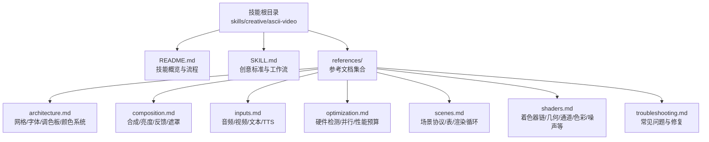
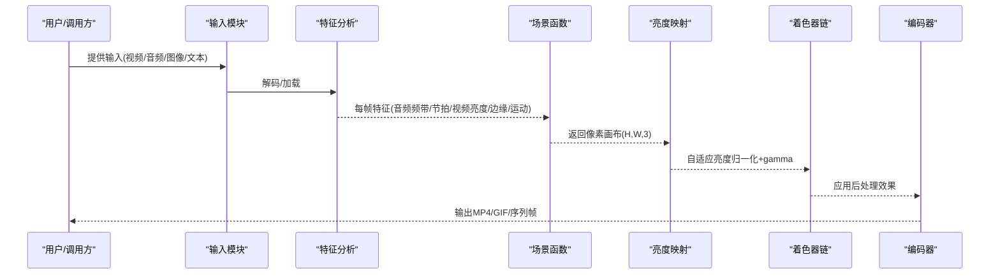
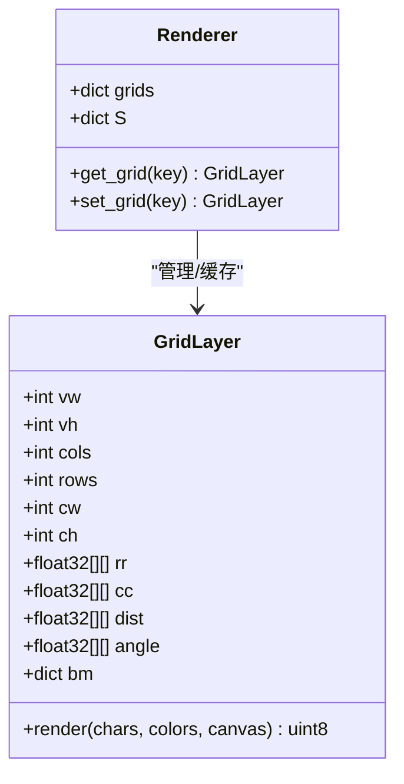
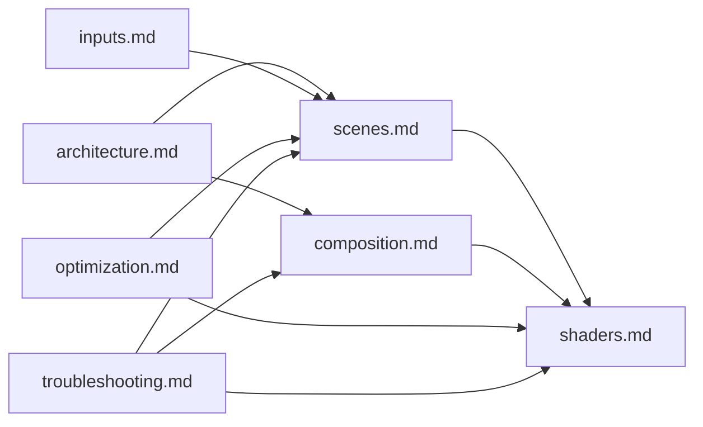

# ASCII视频技能

<cite>
**本文档引用的文件**
- [README.md](file://skills/creative/ascii-video/README.md)
- [SKILL.md](file://skills/creative/ascii-video/SKILL.md)
- [architecture.md](file://skills/creative/ascii-video/references/architecture.md)
- [composition.md](file://skills/creative/ascii-video/references/composition.md)
- [inputs.md](file://skills/creative/ascii-video/references/inputs.md)
- [optimization.md](file://skills/creative/ascii-video/references/optimization.md)
- [scenes.md](file://skills/creative/ascii-video/references/scenes.md)
- [shaders.md](file://skills/creative/ascii-video/references/shaders.md)
- [troubleshooting.md](file://skills/creative/ascii-video/references/troubleshooting.md)
</cite>

## 目录
1. [简介](#简介)
2. [项目结构](#项目结构)
3. [核心组件](#核心组件)
4. [架构总览](#架构总览)
5. [详细组件分析](#详细组件分析)
6. [依赖关系分析](#依赖关系分析)
7. [性能考量](#性能考量)
8. [故障排除指南](#故障排除指南)
9. [结论](#结论)
10. [附录](#附录)

## 简介
本技能为ASCII视频生产流水线，将任意内容（视频/音频/图像/文本/纯数学）转换为彩色ASCII字符视频输出（MP4/GIF/图片序列）。系统覆盖：视频转ASCII、音频驱动可视化、生成式ASCII动画、混合音视频反应、歌词/文本叠加、实时终端渲染等。核心特性包括：多密度网格系统、字体光栅化、效果库、着色器链、音频分析、并行编码与自适应亮度管理。

## 项目结构
ASCII视频技能位于创意技能目录下，采用“技能描述 + 参考文档”的组织方式：
- 技能说明：概述模式、工作流、创意标准与实现要点
- 参考文档：架构、合成与亮度、输入源、优化、场景系统、着色器、故障排除等

图表来源
- [README.md:1-291](file://skills/creative/ascii-video/README.md#L1-L291)
- [SKILL.md:1-233](file://skills/creative/ascii-video/SKILL.md#L1-L233)

章节来源
- [README.md:1-291](file://skills/creative/ascii-video/README.md#L1-L291)
- [SKILL.md:1-233](file://skills/creative/ascii-video/SKILL.md#L1-L233)

## 核心组件
- 输入与特征提取：支持视频采样、音频分析（FFT/节拍/频带）、图像序列、文本/歌词、TTS语音
- 场景函数：返回像素画布的可组合场景，支持多网格、多层合成
- 亮度管理：自适应百分位归一化 + gamma校正，替代线性增益
- 着色器链：38个可组合后处理效果，含几何、通道、色彩、发光、噪声、线条、色调、数据/故障等
- 并行编码：多进程分段渲染，拼接与音频混流
- 字符渲染：预光栅化字体位图，按网格密度合成字符画布

章节来源
- [README.md:24-62](file://skills/creative/ascii-video/README.md#L24-L62)
- [SKILL.md:49-63](file://skills/creative/ascii-video/SKILL.md#L49-L63)

## 架构总览
ASCII视频流水线遵循统一的六阶段：输入 → 分析 → 场景函数 → 亮度映射 → 着色器 → 编码。该流程在不同模式下共享同一架构，差异在于输入与特征提取。

图表来源
- [README.md:24-38](file://skills/creative/ascii-video/README.md#L24-L38)
- [scenes.md:470-523](file://skills/creative/ascii-video/references/scenes.md#L470-L523)

章节来源
- [README.md:24-38](file://skills/creative/ascii-video/README.md#L24-L38)
- [scenes.md:470-523](file://skills/creative/ascii-video/references/scenes.md#L470-L523)

## 详细组件分析

### 网格系统与字符渲染
- 多密度网格：xs/sm/md/lg/xl/xxl，适配不同视觉密度与用途
- 字体选择与度量：跨平台字体探测、字形高度使用getmetrics避免macOS错误
- 预光栅化：初始化时对所有字符生成位图缓存，渲染时按需查找
- 渲染循环：逐单元格合成字符位图，使用np.maximum进行加法混合

图表来源
- [architecture.md:154-205](file://skills/creative/ascii-video/references/architecture.md#L154-L205)
- [architecture.md:245-268](file://skills/creative/ascii-video/references/architecture.md#L245-L268)

章节来源
- [architecture.md:5-24](file://skills/creative/ascii-video/references/architecture.md#L5-L24)
- [architecture.md:154-205](file://skills/creative/ascii-video/references/architecture.md#L154-L205)
- [architecture.md:245-268](file://skills/creative/ascii-video/references/architecture.md#L245-L268)

### 调色板与颜色系统
- 调色板家族：密度梯度、块元素、点阵/星形/半填/交叉 Hatch、数学符号、框线、音符、脚本/文字系统、项目定制等
- 颜色策略：角度映射、距离映射、频率映射、值映射、时间循环、源采样、离散RGB调色板、温度、互补/三元/邻近/补色、单色
- OKLAB/OKLCH：感知均匀的颜色空间，用于平滑渐变与和谐配色

章节来源
- [architecture.md:245-366](file://skills/creative/ascii-video/references/architecture.md#L245-L366)
- [architecture.md:368-509](file://skills/creative/ascii-video/references/architecture.md#L368-L509)

### 值场与色调场生成器
- 值场（21种）：三角函数类（正弦/平滑噪声/环/螺旋/隧道/漩涡/干涉/极光/涟漪/等离子/菱形/噪声）、噪声类（值噪声/fBM/域变形/Voronoi）、仿真类（反应-扩散/细胞自动机/奇异吸引子/时序噪声）、SDF类（圆/矩形/环/线/三角/星/心形）
- 色调场（9种）：固定色相、角度映射彩虹、距离渐变、时间循环、音频光谱质心、水平/垂直梯度、等离子变化、OKLCH彩虹
- 坐标变换（11种）：旋转/缩放/倾斜/平铺镜像/极坐标/逆极坐标/扭曲/鱼眼/波形位移/莫比乌斯共形变换

章节来源
- [architecture.md:100-142](file://skills/creative/ascii-video/references/architecture.md#L100-L142)
- [architecture.md:143-149](file://skills/creative/ascii-video/references/architecture.md#L143-L149)

### 合成与亮度管理
- 像素级混合模式：20种混合模式（基础/对比/差值/冲印/线性光/硬混合/明暗/颗粒），支持线性光空间混合
- 多网格合成：sm/md/lg三层纹理干扰，精细与粗犷字符交错产生自然纹理
- 自适应亮度映射：百分位归一化 + gamma校正，替代线性增益，保证不同场景亮度一致
- 反馈缓冲：前一帧衰减叠加，可选空间变换（缩放/收缩/旋转/平移/镜像）与色相漂移，形成轨迹/回音/热浪等效果
- 遮罩/模板：圆形/矩形/环/径向渐变、基于值场的遮罩、文本模板、动画遮罩（光圈/擦除/溶解）

章节来源
- [composition.md:7-65](file://skills/creative/ascii-video/references/composition.md#L7-L65)
- [composition.md:172-224](file://skills/creative/ascii-video/references/composition.md#L172-L224)
- [composition.md:268-366](file://skills/creative/ascii-video/references/composition.md#L268-L366)
- [composition.md:392-521](file://skills/creative/ascii-video/references/composition.md#L392-L521)
- [composition.md:524-722](file://skills/creative/ascii-video/references/composition.md#L524-L722)

### 场景系统与创作指导
- 场景协议（v2）：场景函数接收Renderer、特征字典、局部时间、状态字典，返回像素画布
- 场景表：定义时间轴、默认网格、场景函数、gamma、着色器链、反馈配置
- 设计模式：层次结构（背景/内容/强调）、方向参数弧（线性/缓出/缓入/阶跃揭示）、场景概念（涌现/下降/碰撞/熵增）、组合技巧（反向双系统/波碰撞/渐进碎片化/熵消耗/阶梯进入）
- 渲染循环：每场景独立进程池渲染，拼接与音频混流

章节来源
- [scenes.md:207-267](file://skills/creative/ascii-video/references/scenes.md#L207-L267)
- [scenes.md:410-448](file://skills/creative/ascii-video/references/scenes.md#L410-L448)
- [scenes.md:470-523](file://skills/creative/ascii-video/references/scenes.md#L470-L523)

### 着色器管道
- 组合式后处理：几何（CRT桶形/像素化/波形畸变/位移图/万花筒/镜像）、通道（色差/通道偏移/通道交换/RBG径向分离）、色彩（反色/海报化/阈值/太阳化/色相旋转/饱和/色彩分级/色彩抖动/色带）、发光/模糊（辉光/边缘辉光/柔焦/径向模糊）、噪声（胶片颗粒/静态噪声）、线条/图案（扫描线/网点）、色调（晕影/对比/伽马/色阶/亮度）、故障/数据（故障条带/方块故障/像素排序/数据弯曲）
- 动态响应：部分着色器根据节拍衰减与能量强度自适应调节参数

章节来源
- [shaders.md:143-172](file://skills/creative/ascii-video/references/shaders.md#L143-L172)
- [shaders.md:294-306](file://skills/creative/ascii-video/references/shaders.md#L294-L306)
- [shaders.md:309-388](file://skills/creative/ascii-video/references/shaders.md#L309-L388)

### 输入与特征提取
- 音频分析：采样到单声道/22050Hz，计算RMS/6频带/光谱质心/平坦度/通量/节拍检测与指数衰减
- 视频采样：ffmpeg管道解码/重采样，L*a*b*亮度映射到字符，边缘加权字符映射，运动检测
- 文本/歌词：SRT解析、打字机/淡入/闪烁/散射/波形显示
- TTS集成：ElevenLabs语音生成、声纹池、语音分配、文本音素修正、音频混流与淡出

章节来源
- [inputs.md:5-96](file://skills/creative/ascii-video/references/inputs.md#L5-L96)
- [inputs.md:98-196](file://skills/creative/ascii-video/references/inputs.md#L98-L196)
- [inputs.md:223-576](file://skills/creative/ascii-video/references/inputs.md#L223-L576)

### 性能优化与并行
- 硬件检测：CPU核数/内存/平台/ffmpeg可用性，自动推导worker数与质量档位
- 性能预算：特征提取/效果函数/字符渲染/着色器/编码的耗时目标
- 预光栅化与缓存：字符位图、距离场晕影、CRT畸变坐标、纹理烘焙
- 向量化与批处理：避免Python循环，使用广播与索引；矩阵雨/火焰列使用批量赋值
- 并行渲染：进程池分段渲染，独立ffmpeg子进程，stderr写日志避免死锁
- 内存管理：特征数组共享、画布复用、字符数组按帧分配、位图缓存按网格初始化

章节来源
- [optimization.md:5-66](file://skills/creative/ascii-video/references/optimization.md#L5-L66)
- [optimization.md:200-235](file://skills/creative/ascii-video/references/optimization.md#L200-L235)
- [optimization.md:299-310](file://skills/creative/ascii-video/references/optimization.md#L299-L310)
- [optimization.md:476-548](file://skills/creative/ascii-video/references/optimization.md#L476-L548)

## 依赖关系分析
ASCII视频技能内部模块高度内聚、低耦合，通过统一接口连接：
- architecture.md：网格/字体/调色板/颜色系统，为渲染与合成提供基础设施
- composition.md：合成/亮度/反馈/遮罩，负责画面合成与视觉一致性
- inputs.md：输入与特征提取，为场景函数提供数据
- scenes.md：场景协议与渲染循环，组织创意表达
- shaders.md：着色器链，提供后处理能力
- optimization.md：性能与并行，保障工程可行性
- troubleshooting.md：诊断与修复，降低开发风险

图表来源
- [architecture.md:1-800](file://skills/creative/ascii-video/references/architecture.md#L1-L800)
- [composition.md:1-800](file://skills/creative/ascii-video/references/composition.md#L1-L800)
- [inputs.md:1-686](file://skills/creative/ascii-video/references/inputs.md#L1-L686)
- [scenes.md:1-1012](file://skills/creative/ascii-video/references/scenes.md#L1-L1012)
- [shaders.md:1-1386](file://skills/creative/ascii-video/references/shaders.md#L1-L1386)
- [optimization.md:1-689](file://skills/creative/ascii-video/references/optimization.md#L1-L689)
- [troubleshooting.md:1-368](file://skills/creative/ascii-video/references/troubleshooting.md#L1-L368)

章节来源
- [architecture.md:1-800](file://skills/creative/ascii-video/references/architecture.md#L1-L800)
- [composition.md:1-800](file://skills/creative/ascii-video/references/composition.md#L1-L800)
- [inputs.md:1-686](file://skills/creative/ascii-video/references/inputs.md#L1-L686)
- [scenes.md:1-1012](file://skills/creative/ascii-video/references/scenes.md#L1-L1012)
- [shaders.md:1-1386](file://skills/creative/ascii-video/references/shaders.md#L1-L1386)
- [optimization.md:1-689](file://skills/creative/ascii-video/references/optimization.md#L1-L689)
- [troubleshooting.md:1-368](file://skills/creative/ascii-video/references/troubleshooting.md#L1-L368)

## 性能考量
- 目标帧耗时：约100-200ms/帧（单核5-10fps，8核40-80fps）
- 渲染瓶颈：字符渲染（逐单元格合成）占大头，避免Python循环
- 优化手段：预光栅化、纹理烘焙、坐标数组缓存、向量化效果、PIL批量文本渲染、快速模糊、晕影缓存、半分辨率颗粒
- 并行策略：进程池分段渲染，独立ffmpeg子进程，stderr写文件避免死锁
- 质量档位：草稿/预览/生产/极致/自动，依据硬件与时长自适应降级

章节来源
- [optimization.md:200-235](file://skills/creative/ascii-video/references/optimization.md#L200-L235)
- [optimization.md:476-548](file://skills/creative/ascii-video/references/optimization.md#L476-L548)
- [optimization.md:595-610](file://skills/creative/ascii-video/references/optimization.md#L595-L610)

## 故障排除指南
- 亮度问题：使用自适应tonemap替代线性增益；检查gamma、着色器破坏亮度、反馈乘法
- ffmpeg死锁：stderr重定向文件，不要pipe
- pickling错误：场景函数必须模块级定义，不能是lambda或闭包
- 广播陷阱：broadcast_to后必须copy；hsv2rgb输入形状需一致
- 文本不可读：应用文本底色遮罩 + 逆晕影着色器；避免对可读文本使用万花筒/镜像
- 字体问题：macOS使用getmetrics；验证字符是否在字体中
- 同步问题：节拍时间戳提取与视觉节拍检测对比，修正累积误差

章节来源
- [troubleshooting.md:5-21](file://skills/creative/ascii-video/references/troubleshooting.md#L5-L21)
- [troubleshooting.md:22-60](file://skills/creative/ascii-video/references/troubleshooting.md#L22-L60)
- [troubleshooting.md:184-223](file://skills/creative/ascii-video/references/troubleshooting.md#L184-L223)
- [troubleshooting.md:225-270](file://skills/creative/ascii-video/references/troubleshooting.md#L225-L270)

## 结论
ASCII视频技能以“可组合”为核心理念，将网格系统、效果库、着色器链与并行编码有机结合，既满足创意表达又兼顾工程效率。通过自适应亮度管理与严格的性能预算，可在多平台上稳定产出高质量ASCII字符视频。建议在创作中优先考虑场景概念与层次结构，配合动态响应与反馈，打造具有情感张力与视觉复杂性的作品。

## 附录

### 实战案例与最佳实践
- 动画制作：使用多网格合成（如sm+md+lg）叠加不同值场与色调场，结合屏幕/差值/排除等混合模式
- 视觉效果：在强节拍处触发万花筒/镜像/故障条带；使用反馈缓冲创造轨迹与回音
- 播放优化：启用bloom（阈值130）、适度晕影（≤0.25）、使用screen混合而非overlay
- 质量控制：测试关键帧（起始/中间/结束）亮度均值>8；确保每段有差异化调色板/网格/着色器
- 编码格式：H.264（libx264）+ yuv420p；GIF适合短片段；序列帧便于后期编辑
- 兼容性：ffmpeg在PATH；跨平台字体路径探测；macOS注意字体度量与缺失字形

章节来源
- [README.md:246-246](file://skills/creative/ascii-video/README.md#L246-L246)
- [composition.md:356-358](file://skills/creative/ascii-video/references/composition.md#L356-L358)
- [shaders.md:309-388](file://skills/creative/ascii-video/references/shaders.md#L309-L388)
- [optimization.md:595-610](file://skills/creative/ascii-video/references/optimization.md#L595-L610)