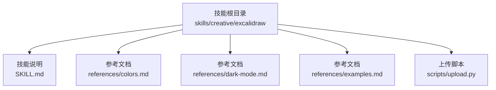
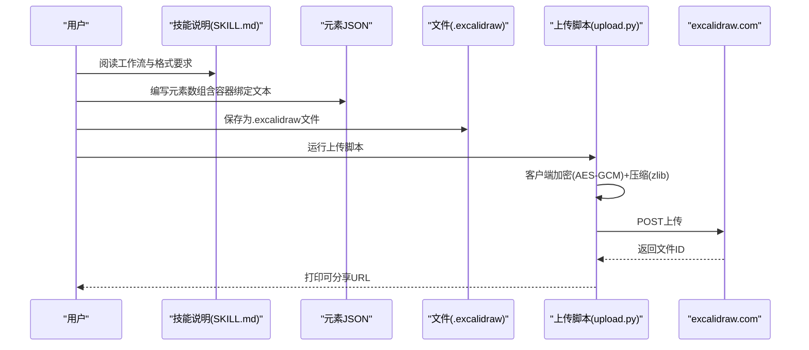
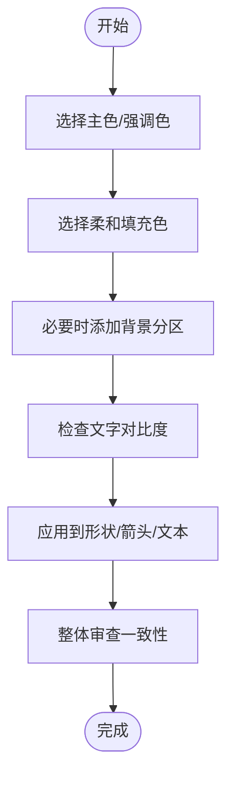
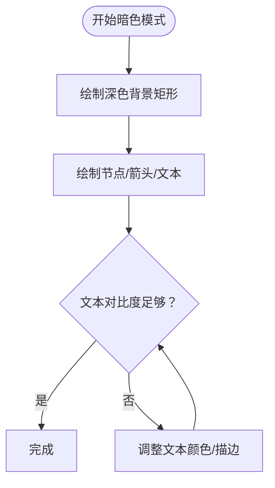
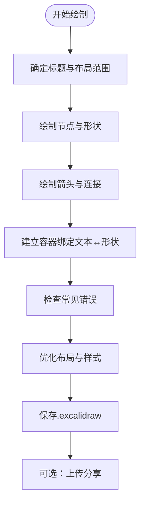
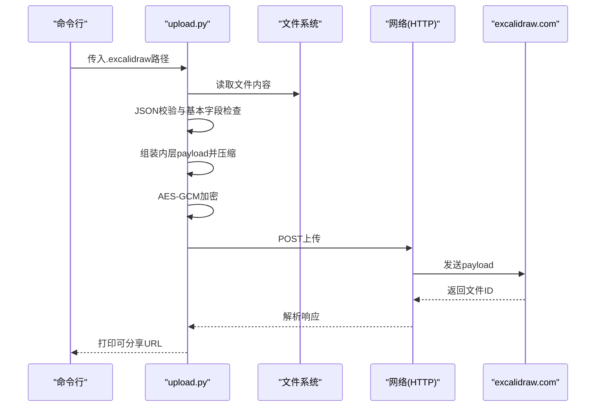
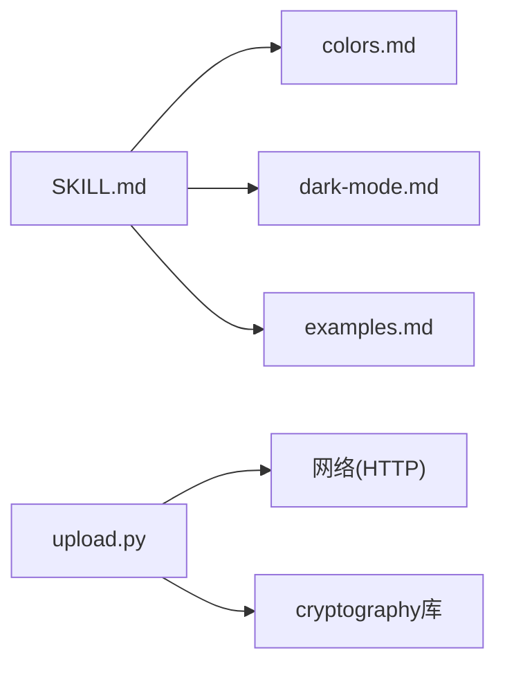

# Excalidraw绘图技能

<cite>
**本文引用的文件**
- [SKILL.md](file://skills/creative/excalidraw/SKILL.md)
- [colors.md](file://skills/creative/excalidraw/references/colors.md)
- [dark-mode.md](file://skills/creative/excalidraw/references/dark-mode.md)
- [examples.md](file://skills/creative/excalidraw/references/examples.md)
- [upload.py](file://skills/creative/excalidraw/scripts/upload.py)
- [DESCRIPTION.md（绘图技能总览）](file://skills/diagramming/DESCRIPTION.md)
- [DESCRIPTION.md（创意技能总览）](file://skills/creative/DESCRIPTION.md)
</cite>

## 目录
1. [简介](#简介)
2. [项目结构](#项目结构)
3. [核心组件](#核心组件)
4. [架构概览](#架构概览)
5. [详细组件分析](#详细组件分析)
6. [依赖关系分析](#依赖关系分析)
7. [性能考量](#性能考量)
8. [故障排查指南](#故障排查指南)
9. [结论](#结论)
10. [附录](#附录)

## 简介
本文件面向“Excalidraw绘图技能”，系统性介绍如何使用Excalidraw手绘风格JSON格式进行可视化创作，涵盖颜色系统、暗色模式、绘图示例、上传分享流程、文件格式与版本管理建议，以及优化技巧、样式统一与协作分享方法。该技能以纯JSON元素数组为核心，无需外部渲染库，直接保存为.excalidraw文件并在excalidraw.com上打开编辑。

## 项目结构
Excalidraw绘图技能位于创意类技能目录下，包含技能说明、参考文档与上传脚本三部分：
- 技能说明：定义工作流、保存与上传步骤、格式要求与注意事项
- 参考文档：颜色系统、暗色模式配色与示例、完整可复制的示例集合
- 上传脚本：本地加密后上传至excalidraw.com，生成可分享链接

**图示来源**
- [SKILL.md](file://skills/creative/excalidraw/SKILL.md)
- [colors.md](file://skills/creative/excalidraw/references/colors.md)
- [dark-mode.md](file://skills/creative/excalidraw/references/dark-mode.md)
- [examples.md](file://skills/creative/excalidraw/references/examples.md)
- [upload.py](file://skills/creative/excalidraw/scripts/upload.py)

**章节来源**
- [SKILL.md](file://skills/creative/excalidraw/SKILL.md)
- [DESCRIPTION.md（绘图技能总览）](file://skills/diagramming/DESCRIPTION.md)
- [DESCRIPTION.md（创意技能总览）](file://skills/creative/DESCRIPTION.md)

## 核心组件
- 技能说明（SKILL.md）
  - 工作流：加载技能 → 编写元素JSON → 保存.excalidraw → 可选上传分享
  - 文件格式：标准.excalidraw包体包含类型、版本、来源、元素数组与应用状态
  - 上传：通过终端运行上传脚本，生成可分享URL
- 参考文档
  - 颜色系统：主色、柔和填充、背景分区与文字对比规则
  - 暗色模式：深色背景矩形作为首元素，配套文本与形状配色
  - 示例：最小连接框图、过程图、序列图等完整可复制示例
- 上传脚本（upload.py）
  - 客户端加密（AES-GCM）+ 压缩（zlib），上传至官方API
  - 输出包含文件ID与密钥片段的可分享URL

**章节来源**
- [SKILL.md](file://skills/creative/excalidraw/SKILL.md)
- [colors.md](file://skills/creative/excalidraw/references/colors.md)
- [dark-mode.md](file://skills/creative/excalidraw/references/dark-mode.md)
- [examples.md](file://skills/creative/excalidraw/references/examples.md)
- [upload.py](file://skills/creative/excalidraw/scripts/upload.py)

## 架构概览
从创作到分享的端到端流程如下：

**图示来源**
- [SKILL.md](file://skills/creative/excalidraw/SKILL.md)
- [upload.py](file://skills/creative/excalidraw/scripts/upload.py)

## 详细组件分析

### 组件A：颜色系统与样式规范
- 主色与强调色：用于描边、箭头与重点强调
- 柔和填充：用于形状背景，体现状态或层级
- 背景分区：在分层图中使用低透明度分区突出层次
- 文字对比：白底与深色文字的对比规则，避免不可读配色
- 使用建议：统一主题色，保持一致性；深色模式下优先使用明亮主色作为描边

**图示来源**
- [colors.md](file://skills/creative/excalidraw/references/colors.md)

**章节来源**
- [colors.md](file://skills/creative/excalidraw/references/colors.md)

### 组件B：暗色模式设计
- 设计要点：以大面积深色背景矩形作为首元素，覆盖视口
- 文本与形状：深色背景下的文本使用高对比度颜色；形状填充采用深色系；描边使用主色保证可见性
- 示例：提供暗色模式标签矩形的完整元素组合

**图示来源**
- [dark-mode.md](file://skills/creative/excalidraw/references/dark-mode.md)

**章节来源**
- [dark-mode.md](file://skills/creative/excalidraw/references/dark-mode.md)

### 组件C：绘图示例与最佳实践
- 示例一：两个带标签的连接框图，展示最小流程
- 示例二：光合作用过程图，包含背景分区、多节点与方向箭头
- 示例三：UML风格序列图，包含参与者、虚线生命线与消息箭头
- 最佳实践清单：避免使用无效的label属性；确保容器绑定双向链接；为文本设置字体族与自动换行参数；注意元素重叠与箭头标签长度；装饰元素置于末尾

**图示来源**
- [examples.md](file://skills/creative/excalidraw/references/examples.md)

**章节来源**
- [examples.md](file://skills/creative/excalidraw/references/examples.md)

### 组件D：上传与分享流程
- 功能：对.excalidraw内容进行客户端加密与压缩，上传至官方API，返回可分享URL
- 加密与编码：AES-GCM 128位密钥+随机nonce；外层元数据描述压缩与加密方式
- 依赖：需要安装cryptography库
- 错误处理：文件不存在、JSON解析失败、缺少元素键、HTTP状态异常等

**图示来源**
- [upload.py](file://skills/creative/excalidraw/scripts/upload.py)

**章节来源**
- [upload.py](file://skills/creative/excalidraw/scripts/upload.py)

## 依赖关系分析
- 技能说明依赖参考文档提供颜色、模式与示例支撑
- 上传脚本独立于平台，仅依赖Python标准库与cryptography第三方库
- 整体耦合度低，便于维护与扩展

**图示来源**
- [SKILL.md](file://skills/creative/excalidraw/SKILL.md)
- [colors.md](file://skills/creative/excalidraw/references/colors.md)
- [dark-mode.md](file://skills/creative/excalidraw/references/dark-mode.md)
- [examples.md](file://skills/creative/excalidraw/references/examples.md)
- [upload.py](file://skills/creative/excalidraw/scripts/upload.py)

**章节来源**
- [SKILL.md](file://skills/creative/excalidraw/SKILL.md)
- [upload.py](file://skills/creative/excalidraw/scripts/upload.py)

## 性能考量
- 文件体积控制：减少不必要的元素与冗余文本；合理使用透明度与阴影
- 渲染效率：在浏览器端打开.excalidraw时，尽量避免过长的文本与复杂曲线
- 上传速度：确保网络稳定；若文件较大，建议先在本地简化元素数量
- 版本兼容：遵循.excalidraw包体字段与元素类型约定，避免使用非标准字段

## 故障排查指南
- 问题：形状无标签或空白
  - 原因：使用了无效的label属性
  - 处理：改用容器绑定（形状的boundElements与文本的containerId必须成对出现）
- 问题：深色背景下文字不可见
  - 原因：默认深色文本在深色背景上不可读
  - 处理：显式设置文本strokeColor为高对比度颜色
- 问题：上传失败或无文件ID
  - 原因：网络异常、依赖缺失、文件非JSON或缺少元素键
  - 处理：确认cryptography已安装；检查.excalidraw内容为有效JSON且包含元素数组；重试网络请求
- 问题：箭头标签溢出
  - 原因：标签过长而箭头过短
  - 处理：缩短标签或延长箭头；必要时拆分为多段注释

**章节来源**
- [examples.md](file://skills/creative/excalidraw/references/examples.md)
- [dark-mode.md](file://skills/creative/excalidraw/references/dark-mode.md)
- [upload.py](file://skills/creative/excalidraw/scripts/upload.py)

## 结论
Excalidraw绘图技能以简洁的JSON元素模型实现手绘风格可视化创作，配合统一的颜色系统、暗色模式与丰富示例，能够高效产出流程图、架构图与序列图等。通过内置上传脚本，可快速生成可分享链接，便于团队协作与知识沉淀。建议在实际使用中坚持容器绑定、统一配色与清晰布局的原则，并结合示例与参考文档持续优化。

## 附录

### A. 文件格式与版本管理建议
- 包体字段：类型、版本、来源、元素数组、应用状态
- 元素字段：通用位置尺寸、描边/填充、手绘质感、透明度等
- 版本演进：遵循.excalidraw版本号；如需迁移，建议保留原始元素数组与应用状态，逐步更新字段

**章节来源**
- [SKILL.md](file://skills/creative/excalidraw/SKILL.md)

### B. 协作与分享方法
- 本地协作：多人共享同一.excalidraw文件，定期同步更新
- 在线分享：使用上传脚本生成可分享URL，支持客户端加密保护
- 团队规范：统一颜色与字体族；为关键节点添加容器绑定文本；导出时保留原始ID以便追踪

**章节来源**
- [SKILL.md](file://skills/creative/excalidraw/SKILL.md)
- [upload.py](file://skills/creative/excalidraw/scripts/upload.py)