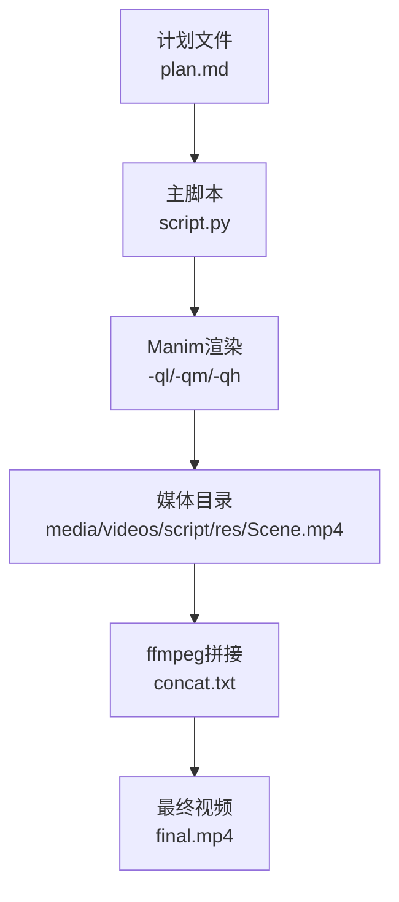
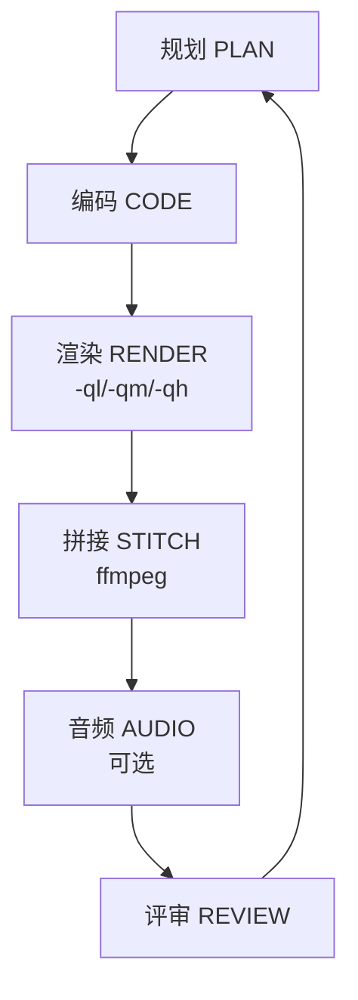
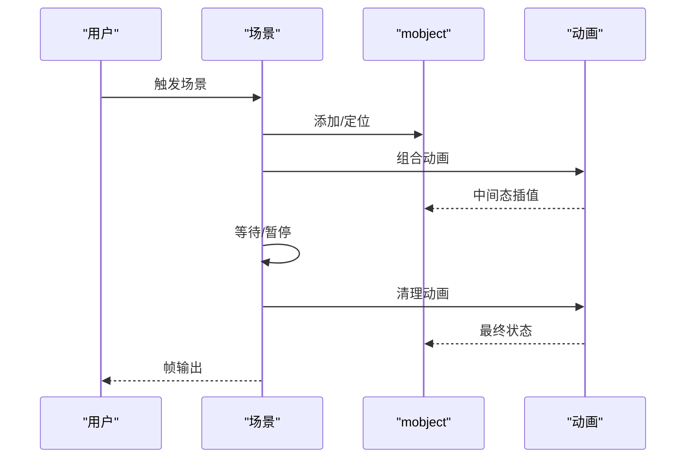
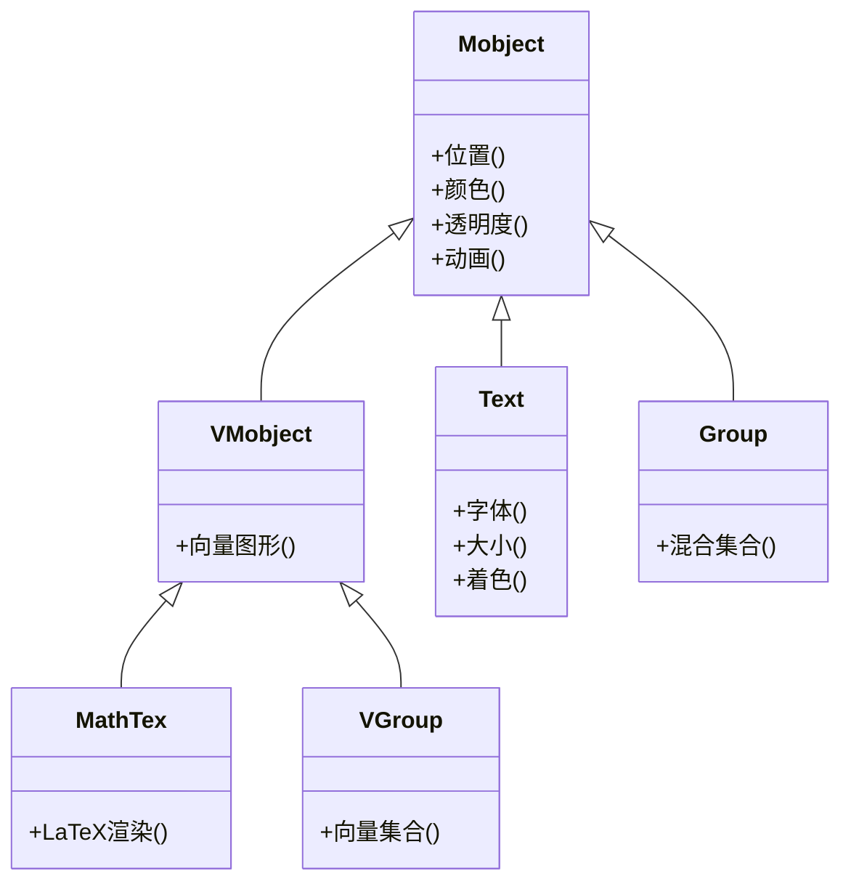
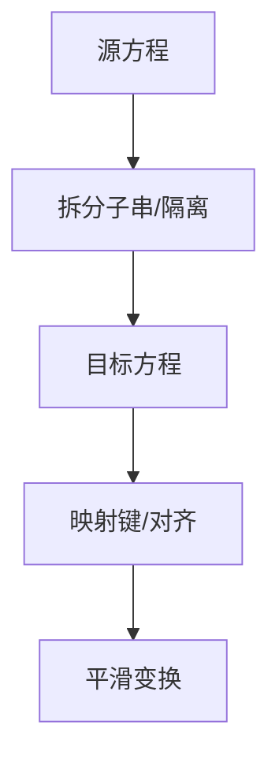
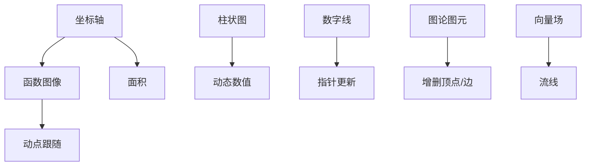
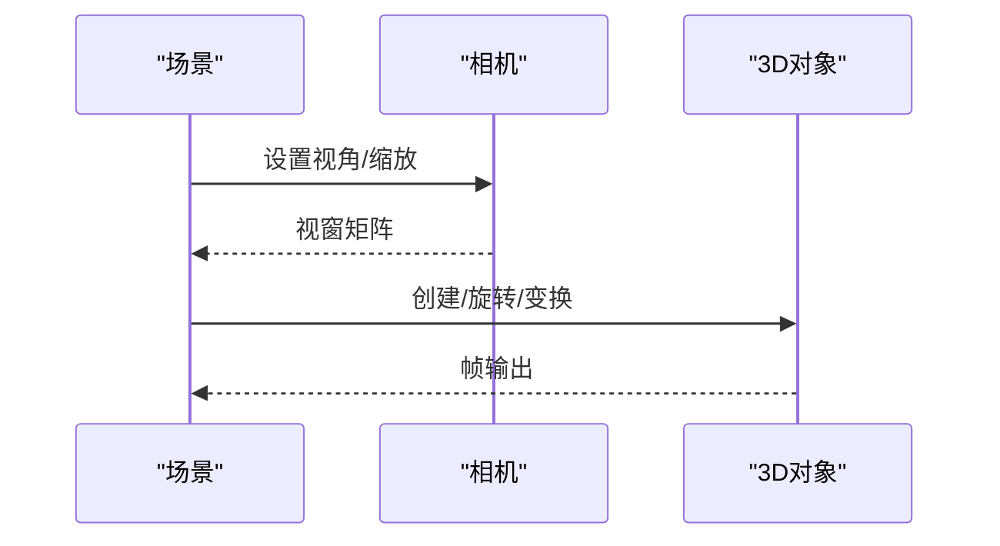
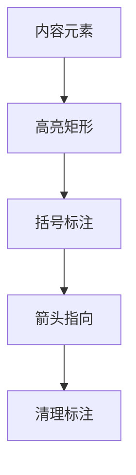
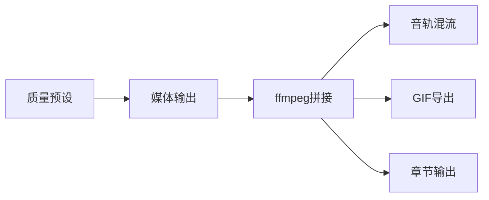
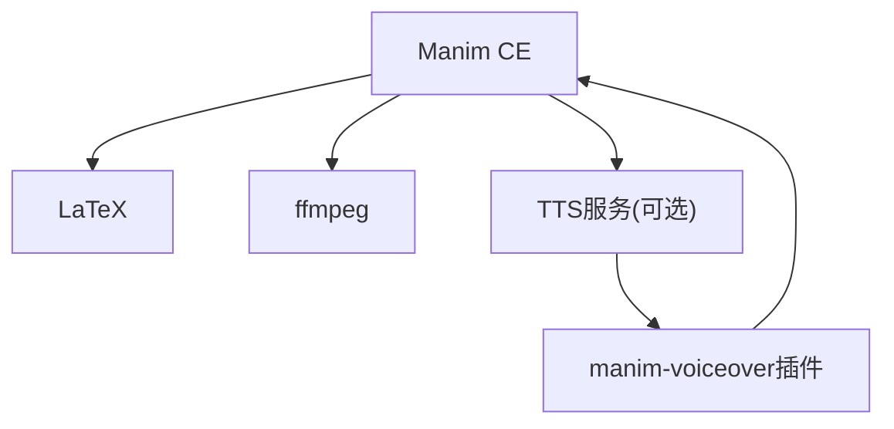

# Manim视频技能

<cite>
**本文引用的文件**
- [技能说明 SKILL.md](file://skills/creative/manim-video/SKILL.md)
- [技能自述 README.md](file://skills/creative/manim-video/README.md)
- [安装脚本 setup.sh](file://skills/creative/manim-video/scripts/setup.sh)
- [场景规划参考 scene-planning.md](file://skills/creative/manim-video/references/scene-planning.md)
- [动画参考 animations.md](file://skills/creative/manim-video/references/animations.md)
- [对象参考 mobjects.md](file://skills/creative/manim-video/references/mobjects.md)
- [视觉设计参考 visual-design.md](file://skills/creative/manim-video/references/visual-design.md)
- [方程与LaTeX参考 equations.md](file://skills/creative/manim-video/references/equations.md)
- [图表与数据参考 graphs-and-data.md](file://skills/creative/manim-video/references/graphs-and-data.md)
- [相机与3D参考 camera-and-3d.md](file://skills/creative/manim-video/references/camera-and-3d.md)
- [装饰元素参考 decorations.md](file://skills/creative/manim-video/references/decorations.md)
- [渲染参考 rendering.md](file://skills/creative/manim-video/references/rendering.md)
- [故障排除参考 troubleshooting.md](file://skills/creative/manim-video/references/troubleshooting.md)
- [生产质量检查清单 production-quality.md](file://skills/creative/manim-video/references/production-quality.md)
</cite>

## 目录
1. [简介](#简介)
2. [项目结构](#项目结构)
3. [核心组件](#核心组件)
4. [架构总览](#架构总览)
5. [详细组件分析](#详细组件分析)
6. [依赖关系分析](#依赖关系分析)
7. [性能考量](#性能考量)
8. [故障排除指南](#故障排除指南)
9. [结论](#结论)
10. [附录](#附录)

## 简介
本技能面向使用Manim Community Edition进行数学与技术类动画制作的创作者，提供从创意策划到最终渲染的完整工作流。该技能强调“先规划、后编码”的工程化流程，确保输出具备清晰的叙事弧线、一致的视觉语言与可复用的动画模式。支持的概念包括：概念解释、方程式推导、算法可视化、数据故事、架构图构建、论文讲解以及3D可视化。

## 项目结构
Manim视频技能采用“单脚本多场景”的组织方式，便于独立渲染与拼接：
- 计划文件：用于定义叙事弧线、场景列表、视觉元素与配色方案
- 主脚本：包含所有场景类，每个场景均可独立渲染
- 拼接清单：ffmpeg场景列表文件
- 输出产物：最终MP4与媒体目录（由Manim生成）

**图表来源**
- [技能说明 SKILL.md:65-76](file://skills/creative/manim-video/SKILL.md#L65-L76)
- [渲染参考 rendering.md:38-46](file://skills/creative/manim-video/references/rendering.md#L38-L46)

**章节来源**
- [技能说明 SKILL.md:65-76](file://skills/creative/manim-video/SKILL.md#L65-L76)
- [渲染参考 rendering.md:38-46](file://skills/creative/manim-video/references/rendering.md#L38-L46)

## 核心组件
- 创意标准与设计原则：强调几何优先于代数、分层透明度引导注意力、每场景一个新概念、空间一致性、色彩即含义等12条核心原则
- 动画系统：围绕mobject与动画对象展开，涵盖创建、移除、变换、移动、强调、速率函数与组合
- 对象体系：文本、形状、矩阵、表格、数字线、向量场、复杂平面等
- 方程与LaTeX：MathTex、逐段呈现、高亮标注、匹配变换与子串隔离
- 图表与数据：坐标轴、函数图像、面积、柱状图、动态计数器、图论图元、矢量场流线
- 相机与3D：MovingCameraScene、ThreeDScene、3D表面、参数曲线、缩放内视图、线性变换场景
- 装饰元素：高亮矩形、背景矩形、括号、箭头、虚线、角度标记、删除线、下划线
- 渲染管线：Manim命令行、质量预设、ffmpeg拼接、音轨合成、GIF导出、章节标记
- 生产质量：预编码、预渲染与后渲染检查清单，覆盖文本、空间布局、动画节奏、色彩一致性与数据可视化的最低要求

**章节来源**
- [视觉设计参考 visual-design.md:1-125](file://skills/creative/manim-video/references/visual-design.md#L1-L125)
- [动画参考 animations.md:1-283](file://skills/creative/manim-video/references/animations.md#L1-L283)
- [对象参考 mobjects.md:1-334](file://skills/creative/manim-video/references/mobjects.md#L1-L334)
- [方程与LaTeX参考 equations.md:1-217](file://skills/creative/manim-video/references/equations.md#L1-L217)
- [图表与数据参考 graphs-and-data.md:1-164](file://skills/creative/manim-video/references/graphs-and-data.md#L1-L164)
- [相机与3D参考 camera-and-3d.md:1-136](file://skills/creative/manim-video/references/camera-and-3d.md#L1-L136)
- [装饰元素参考 decorations.md:1-203](file://skills/creative/manim-video/references/decorations.md#L1-L203)
- [渲染参考 rendering.md:1-186](file://skills/creative/manim-video/references/rendering.md#L1-L186)
- [生产质量检查清单 production-quality.md:1-191](file://skills/creative/manim-video/references/production-quality.md#L1-L191)

## 架构总览
Manim视频技能的工程化架构分为“创意—编码—渲染—拼接—音频—评审”六个阶段，贯穿从概念解释到最终发布的全流程。

**图表来源**
- [技能说明 SKILL.md:52-64](file://skills/creative/manim-video/SKILL.md#L52-L64)

**章节来源**
- [技能说明 SKILL.md:52-64](file://skills/creative/manim-video/SKILL.md#L52-L64)

## 详细组件分析

### 场景规划与叙事弧
- 叙事弧类型：发现式、问题—解决、对比、逐步构建（架构/系统）
- 场景过渡：干净切分、承接式、变换桥
- 一致性：共享常量、颜色、字号、速度；避免超过5-6个同时可见元素
- 时长估算：标题卡、概念引入、方程揭示、算法步骤、数据对比、顿悟时刻、结论

**图表来源**
- [场景规划参考 scene-planning.md:5-25](file://skills/creative/manim-video/references/scene-planning.md#L5-L25)

**章节来源**
- [场景规划参考 scene-planning.md:1-119](file://skills/creative/manim-video/references/scene-planning.md#L1-L119)

### 动画系统与时间节奏
- 动画对象：创建、移除、变换、移动、强调、速率函数与组合
- 时间模式：展示后暂停、降噪聚焦、干净退出
- 更新机制：updater与always_redraw、轨迹追踪TracedPath
- 线性变换：ApplyMatrix与LinearTransformationScene

**图表来源**
- [动画参考 animations.md:3-147](file://skills/creative/manim-video/references/animations.md#L3-L147)

**章节来源**
- [动画参考 animations.md:1-283](file://skills/creative/manim-video/references/animations.md#L1-L283)

### 对象体系与可视化建模
- 文本与数学：Text、MathTex、MarkupText、多部分着色
- 几何与图形：圆、方、线、弧、扇形、环、布尔运算
- 特殊对象：NumberLine、Table、Code、Variable、BulletedList
- 复杂变换：ComplexPlane、apply_complex_function、prepare_for_nonlinear_transform

**图表来源**
- [对象参考 mobjects.md:1-334](file://skills/creative/manim-video/references/mobjects.md#L1-L334)

**章节来源**
- [对象参考 mobjects.md:1-334](file://skills/creative/manim-video/references/mobjects.md#L1-L334)

### 方程与LaTeX渲染
- 基础与多行对齐、分段增量呈现、选择性着色
- 匹配变换：TransformMatchingTex、key_map、matched_keys、substrings_to_isolate
- 注解：括号标注、高亮矩形、交叉标记

**图表来源**
- [方程与LaTeX参考 equations.md:119-217](file://skills/creative/manim-video/references/equations.md#L119-L217)

**章节来源**
- [方程与LaTeX参考 equations.md:1-217](file://skills/creative/manim-video/references/equations.md#L1-L217)

### 图表与数据可视化
- 坐标轴与函数图像、面积、动点跟随
- 柱状图与动态数值变化、数字线指针
- 图论图元：Graph/DiGraph自动布局
- 向量场：ArrowVectorField与StreamLines

**图表来源**
- [图表与数据参考 graphs-and-data.md:1-164](file://skills/creative/manim-video/references/graphs-and-data.md#L1-L164)

**章节来源**
- [图表与数据参考 graphs-and-data.md:1-164](file://skills/creative/manim-video/references/graphs-and-data.md#L1-L164)

### 相机控制与3D渲染
- 2D相机：MovingCameraScene的缩放、平移、保存/恢复
- 3D场景：ThreeDScene视角、Surface、Ambient旋转、ParametricFunction
- 缩放内视图：ZoomedScene的放大与弹出
- 线性变换：LinearTransformationScene网格与基向量

**图表来源**
- [相机与3D参考 camera-and-3d.md:1-136](file://skills/creative/manim-video/references/camera-and-3d.md#L1-L136)

**章节来源**
- [相机与3D参考 camera-and-3d.md:1-136](file://skills/creative/manim-video/references/camera-and-3d.md#L1-L136)

### 装饰元素与视觉润色
- 高亮与标注：SurroundingRectangle、BackgroundRectangle、Brace、箭头、虚线、角度、删除线、下划线
- 标注生命周期：出现—停留—消失，避免长期占用屏幕
- 颜色高亮策略：创建时t2c、创建后set_color_by_tex、索引着色

**图表来源**
- [装饰元素参考 decorations.md:1-203](file://skills/creative/manim-video/references/decorations.md#L1-L203)

**章节来源**
- [装饰元素参考 decorations.md:1-203](file://skills/creative/manim-video/references/decorations.md#L1-L203)

### 渲染与后处理
- 质量预设：草稿(-ql)、预览(-qm)、生产(-qh)，分辨率与帧率对应不同用途
- 输出结构：媒体目录按分辨率与场景分类
- 拼接：ffmpeg concat无损拼接
- 音频：音轨与视频混流、背景音乐淡入淡出、GIF导出
- 章节：manim-sections按章节输出，便于局部重渲染

**图表来源**
- [渲染参考 rendering.md:11-133](file://skills/creative/manim-video/references/rendering.md#L11-L133)

**章节来源**
- [渲染参考 rendering.md:1-186](file://skills/creative/manim-video/references/rendering.md#L1-L186)

### 生产质量与检查清单
- 预编码：叙述脚本、场景列表、配色、字体、分辨率与宽高比
- 文本质量：避免重叠、宽度限制、字体一致性
- 空间布局：坐标预算、填充画面、同时元素上限
- 动画节奏：多样性审计、节奏曲线、转场质量
- 色彩一致性：深背景下的颜色选择、结构/上下文/主体分层透明度
- 数据可视化：轴标签、起始零、颜色与标注一致、关键点标注
- 预渲染与后渲染：逐项核对，观看全片体验

**章节来源**
- [生产质量检查清单 production-quality.md:1-191](file://skills/creative/manim-video/references/production-quality.md#L1-L191)

## 依赖关系分析
Manim视频技能的依赖链路清晰，核心工具与外部系统如下：
- Manim Community Edition：场景渲染与动画引擎
- LaTeX：MathTex方程渲染
- ffmpeg：场景拼接、格式转换、音轨混流
- TTS（可选）：ElevenLabs或本地TTS，配合manim-voiceover插件实现语音同步

**图表来源**
- [技能说明 SKILL.md:41-51](file://skills/creative/manim-video/SKILL.md#L41-L51)
- [渲染参考 rendering.md:134-186](file://skills/creative/manim-video/references/rendering.md#L134-L186)

**章节来源**
- [技能说明 SKILL.md:41-51](file://skills/creative/manim-video/SKILL.md#L41-L51)
- [渲染参考 rendering.md:134-186](file://skills/creative/manim-video/references/rendering.md#L134-L186)

## 性能考量
- 质量与速度权衡：草稿(-ql)用于布局与节奏测试，预览(-qm)用于文本可读性验证，生产(-qh)用于最终交付
- 渲染优化：开发期使用低分辨率与较低FPS；减少Surface分辨率；缩短等待时间；必要时禁用缓存
- 输出一致性：拼接前确保所有片段分辨率、帧率与编解码一致
- 文本渲染：低分辨率草稿文本可读性差，建议在中等分辨率下检查字距与可读性

**章节来源**
- [渲染参考 rendering.md:21-30](file://skills/creative/manim-video/references/rendering.md#L21-L30)
- [故障排除参考 troubleshooting.md:107-116](file://skills/creative/manim-video/references/troubleshooting.md#L107-L116)

## 故障排除指南
- LaTeX相关：原始字符串、括号闭合、包缺失、模板定制
- 对象与分组：VGroup与Text混用导致TypeError；Group不支持save_state/restore；使用Group(*self.mobjects)统一清理
- 文本渲染：Text不支持letter_spacing，使用MarkupText；to_edge需buff>=0.5；避免文本重叠
- 动画错误：未添加的对象不可直接动画；Transform后变量指向变更；同一对象重复动画；updater与动画冲突
- 渲染问题：模糊输出通常来自低分辨率草稿；拼接失败多因分辨率/帧率/编码不一致；清理缓存目录

**章节来源**
- [故障排除参考 troubleshooting.md:1-136](file://skills/creative/manim-video/references/troubleshooting.md#L1-L136)

## 结论
Manim视频技能通过系统化的工作流、严谨的设计原则与完善的参考文档，为数学与技术类动画创作提供了从创意到生产的全栈能力。遵循“先规划、后编码”的工程化路径，结合高质量的视觉语言与稳定的渲染管线，能够持续产出具有教学价值与视觉美感的教育视频。

## 附录
- 安装与前置条件：Python 3.10+、Manim CE、LaTeX、ffmpeg；可通过安装脚本进行校验
- 使用示例：概念解释、方程式推导、算法可视化、数据故事、架构图、论文讲解、3D可视化

**章节来源**
- [技能自述 README.md:1-24](file://skills/creative/manim-video/README.md#L1-L24)
- [安装脚本 setup.sh:1-15](file://skills/creative/manim-video/scripts/setup.sh#L1-L15)
- [技能说明 SKILL.md:25-40](file://skills/creative/manim-video/SKILL.md#L25-L40)