# p5.js编程技能

<cite>
**本文引用的文件**
- [README.md](file://skills/creative/p5js/README.md)
- [SKILL.md](file://skills/creative/p5js/SKILL.md)
- [viewer.html](file://skills/creative/p5js/templates/viewer.html)
- [setup.sh](file://skills/creative/p5js/scripts/setup.sh)
- [serve.sh](file://skills/creative/p5js/scripts/serve.sh)
- [render.sh](file://skills/creative/p5js/scripts/render.sh)
- [export-frames.js](file://skills/creative/p5js/scripts/export-frames.js)
- [core-api.md](file://skills/creative/p5js/references/core-api.md)
- [visual-effects.md](file://skills/creative/p5js/references/visual-effects.md)
- [animation.md](file://skills/creative/p5js/references/animation.md)
- [color-systems.md](file://skills/creative/p5js/references/color-systems.md)
- [webgl-and-3d.md](file://skills/creative/p5js/references/webgl-and-3d.md)
- [interaction.md](file://skills/creative/p5js/references/interaction.md)
- [typography.md](file://skills/creative/p5js/references/typography.md)
- [export-pipeline.md](file://skills/creative/p5js/references/export-pipeline.md)
</cite>

## 目录
1. [简介](#简介)
2. [项目结构](#项目结构)
3. [核心组件](#核心组件)
4. [架构总览](#架构总览)
5. [详细组件分析](#详细组件分析)
6. [依赖关系分析](#依赖关系分析)
7. [性能考量](#性能考量)
8. [故障排查指南](#故障排查指南)
9. [结论](#结论)
10. [附录](#附录)

## 简介
本文件面向希望掌握p5.js编程技能的创作者与工程师，系统梳理从概念到实现再到导出的全流程：涵盖动画原理、颜色系统、核心API、交互设计、几何图形与3D/WebGL、视觉效果与排版设计，并提供交互式艺术、数据可视化与创意编程的实践路径。同时给出渲染脚本、服务配置与HTML模板的使用方法，帮助你快速构建可在浏览器中运行的单文件可视化作品。

## 项目结构
该技能包采用“模板 + 参考文档 + 脚本”的组织方式：
- 模板：viewer.html 提供可探索的交互式生成艺术界面（种子导航、参数滑杆、下载等）
- 参考文档：按主题拆分，覆盖核心API、动画、颜色、3D/WebGL、交互、文本、导出等
- 脚本：setup.sh（环境检查）、serve.sh（本地开发服务器）、render.sh（端到端渲染管线）、export-frames.js（帧导出）

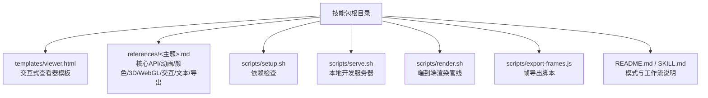

图示来源
- [README.md:43-64](file://skills/creative/p5js/README.md#L43-L64)
- [SKILL.md:41-57](file://skills/creative/p5js/SKILL.md#L41-L57)

章节来源
- [README.md:1-65](file://skills/creative/p5js/README.md#L1-L65)
- [SKILL.md:1-100](file://skills/creative/p5js/SKILL.md#L1-L100)

## 核心组件
- 单文件HTML结构：内联p5.js脚本，无构建步骤，直接在浏览器打开即可运行
- 交互式查看器模板：内置种子导航、参数滑杆、下载按钮，适合可探索的生成艺术
- 参考文档体系：按主题拆分，便于查阅与复用
- 导出与渲染脚本：支持PNG/GIF/MP4/SVG，含头文件与性能建议

章节来源
- [SKILL.md:134-271](file://skills/creative/p5js/SKILL.md#L134-L271)
- [viewer.html:1-120](file://skills/creative/p5js/templates/viewer.html#L1-L120)

## 架构总览
下图展示从“创意概念”到“最终输出”的生产流水线，以及各阶段使用的工具与参考：

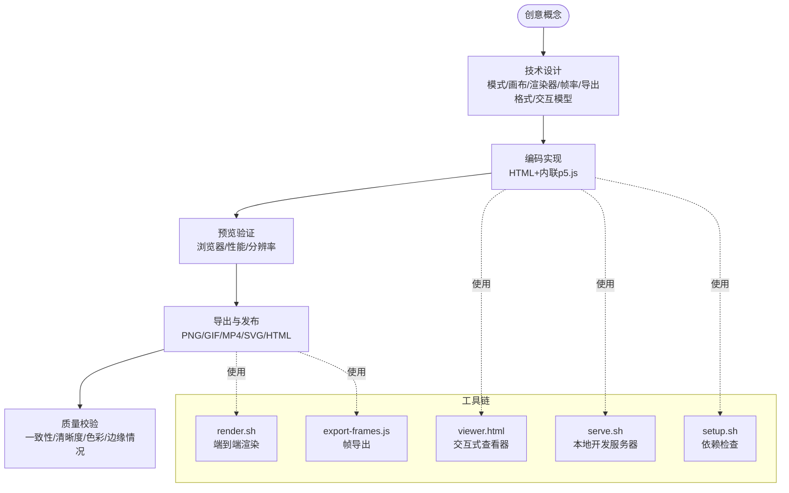

图示来源
- [SKILL.md:64-106](file://skills/creative/p5js/SKILL.md#L64-L106)
- [render.sh:1-109](file://skills/creative/p5js/scripts/render.sh#L1-L109)
- [export-frames.js:1-180](file://skills/creative/p5js/scripts/export-frames.js#L1-L180)
- [serve.sh:1-29](file://skills/creative/p5js/scripts/serve.sh#L1-L29)
- [setup.sh:1-88](file://skills/creative/p5js/scripts/setup.sh#L1-L88)

## 详细组件分析

### 1) 核心API与绘制循环
- 画布与坐标系：P2D默认左上角原点；WEBGL原点在中心且Y轴向上
- 绘制循环：preload → setup → draw；frameRate、noLoop、redraw、millis等控制
- 变换与合成：push/pop隔离变换；createGraphics离屏缓冲用于分层与轨迹
- 响应式与像素密度：pixelDensity(1)保证导出一致性；windowResized重算布局

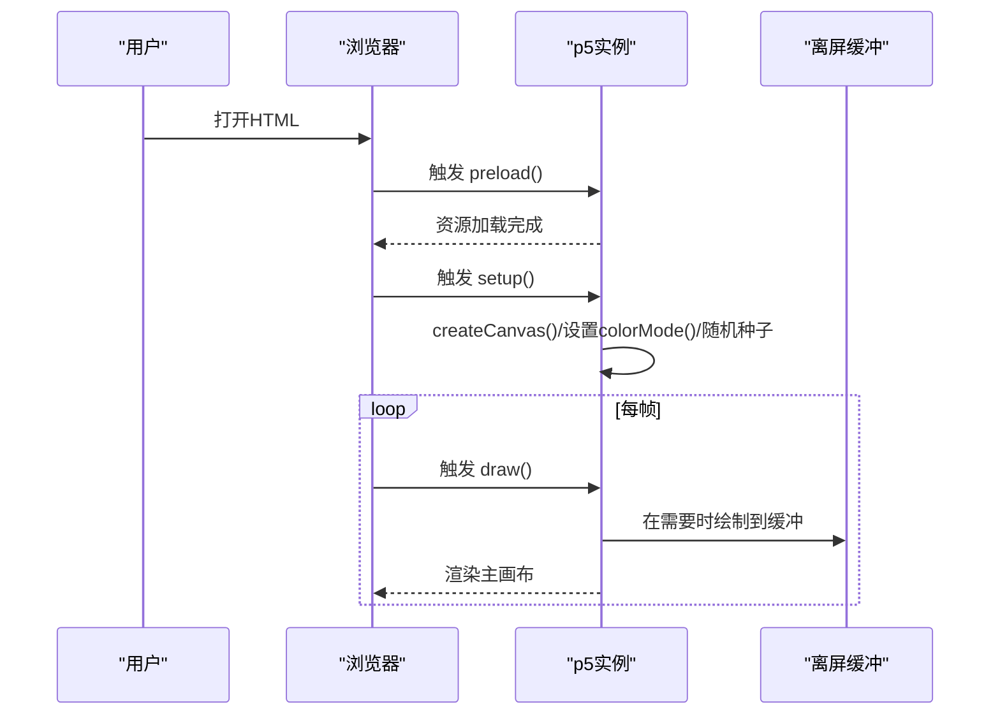

图示来源
- [core-api.md:5-98](file://skills/creative/p5js/references/core-api.md#L5-L98)
- [core-api.md:139-224](file://skills/creative/p5js/references/core-api.md#L139-L224)

章节来源
- [core-api.md:1-120](file://skills/creative/p5js/references/core-api.md#L1-L120)
- [core-api.md:139-224](file://skills/creative/p5js/references/core-api.md#L139-L224)

### 2) 动画原理与运动系统
- 时间驱动：使用millis()或frameCount进行时间基动画；推荐smoothstep等缓动函数
- 缓动与弹簧：easeIn/easeOut、弹性、阻尼弹簧，适合自然运动
- 状态机与时间轴：多场景序列化，配合淡入淡出与过渡
- 噪声驱动：对位置、旋转、缩放、色彩进行有机变化

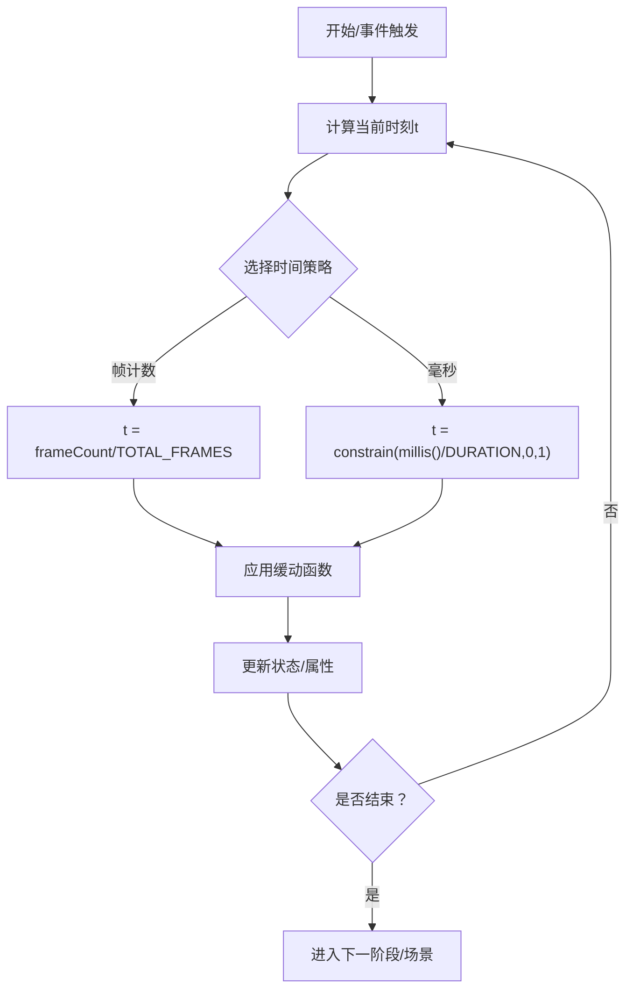

图示来源
- [animation.md:16-107](file://skills/creative/p5js/references/animation.md#L16-L107)
- [animation.md:167-206](file://skills/creative/p5js/references/animation.md#L167-L206)
- [animation.md:208-260](file://skills/creative/p5js/references/animation.md#L208-L260)

章节来源
- [animation.md:1-108](file://skills/creative/p5js/references/animation.md#L1-L108)
- [animation.md:109-166](file://skills/creative/p5js/references/animation.md#L109-L166)
- [animation.md:167-260](file://skills/creative/p5js/references/animation.md#L167-L260)

### 3) 颜色系统与配色方案
- 推荐使用HSB模式，便于色调轮转、去饱和与明暗调整
- 渐变与噪声渐变：线性/径向/基于噪声的渐变渲染
- 混合模式：ADD/MULTIPLY/SCREEN/OVERLAY等，注意使用后重置BLEND
- 背景纹理：噪点背景、晕影、胶片颗粒

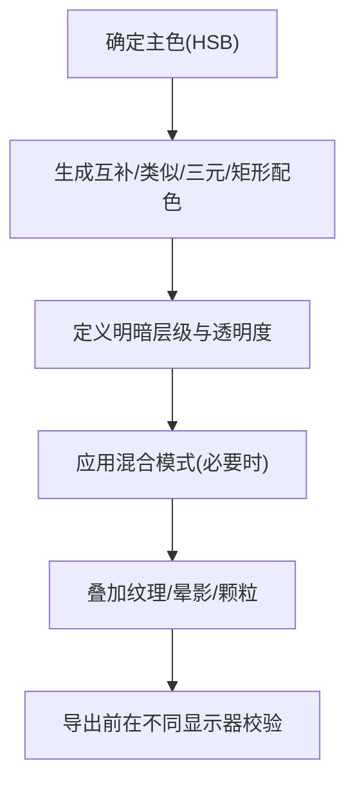

图示来源
- [color-systems.md:5-64](file://skills/creative/p5js/references/color-systems.md#L5-L64)
- [color-systems.md:103-155](file://skills/creative/p5js/references/color-systems.md#L103-L155)
- [color-systems.md:262-295](file://skills/creative/p5js/references/color-systems.md#L262-L295)

章节来源
- [color-systems.md:1-120](file://skills/creative/p5js/references/color-systems.md#L1-L120)
- [color-systems.md:121-220](file://skills/creative/p5js/references/color-systems.md#L121-L220)
- [color-systems.md:221-353](file://skills/creative/p5js/references/color-systems.md#L221-L353)

### 4) 几何图形与粒子系统
- 基础形状与顶点系统：beginShape/endShape、贝塞尔/Catmull-Rom曲线、自定义顶点
- 流场与跟随：网格化流场、粒子跟随向量场、边界处理
- 粒子系统：基础物理、吸引/排斥、布洛伊 flocking、轨迹积累
- 像素级特效：像素读写、滤镜、点描/半调/交叉线稿、像素排序

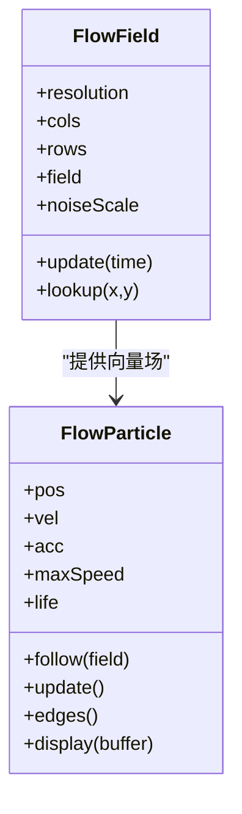

图示来源
- [visual-effects.md:83-156](file://skills/creative/p5js/references/visual-effects.md#L83-L156)

章节来源
- [visual-effects.md:1-120](file://skills/creative/p5js/references/visual-effects.md#L1-L120)
- [visual-effects.md:121-220](file://skills/creative/p5js/references/visual-effects.md#L121-L220)
- [visual-effects.md:221-360](file://skills/creative/p5js/references/visual-effects.md#L221-L360)

### 5) 3D与WebGL
- 模式切换：WEBGL坐标系、相机、透视/正交投影
- 光照：环境光、方向光、点光源、聚光灯、图像光照
- 材质与纹理：普通材质、发光、镜面高光、金属度、纹理映射
- 自定义几何与着色器：buildGeometry、手动p5.Geometry、GLSL片段/顶点着色器
- 多通道渲染：帧缓冲、后处理滤镜

图示来源
- [webgl-and-3d.md:3-21](file://skills/creative/p5js/references/webgl-and-3d.md#L3-L21)
- [webgl-and-3d.md:48-149](file://skills/creative/p5js/references/webgl-and-3d.md#L48-L149)
- [webgl-and-3d.md:151-185](file://skills/creative/p5js/references/webgl-and-3d.md#L151-L185)
- [webgl-and-3d.md:187-243](file://skills/creative/p5js/references/webgl-and-3d.md#L187-L243)
- [webgl-and-3d.md:244-331](file://skills/creative/p5js/references/webgl-and-3d.md#L244-L331)
- [webgl-and-3d.md:367-424](file://skills/creative/p5js/references/webgl-and-3d.md#L367-L424)

章节来源
- [webgl-and-3d.md:1-120](file://skills/creative/p5js/references/webgl-and-3d.md#L1-L120)
- [webgl-and-3d.md:121-244](file://skills/creative/p5js/references/webgl-and-3d.md#L121-L244)
- [webgl-and-3d.md:245-366](file://skills/creative/p5js/references/webgl-and-3d.md#L245-L366)
- [webgl-and-3d.md:367-424](file://skills/creative/p5js/references/webgl-and-3d.md#L367-L424)

### 6) 交互设计与输入
- 鼠标/键盘/触摸：持续状态与事件回调；拖拽、点击生成、滚轮缩放
- DOM控件：滑杆、按钮、复选框、下拉、颜色选择、文本输入
- 音频输入：麦克风/音频文件、FFT频谱、波形、节拍检测
- 滚动驱动：页面滚动进度驱动动画
- 实例模式：避免全局污染，适合嵌入与框架集成

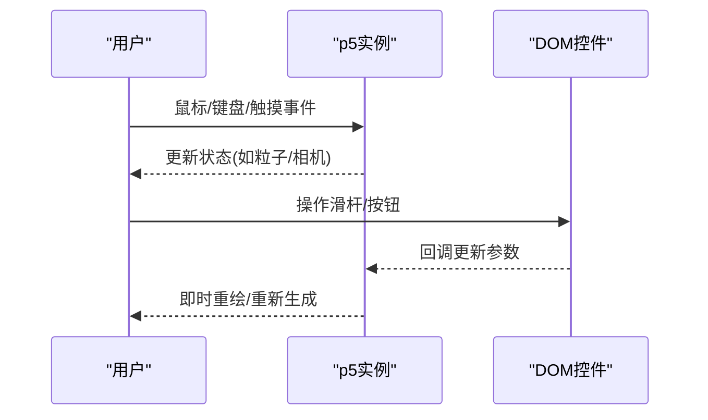

图示来源
- [interaction.md:3-49](file://skills/creative/p5js/references/interaction.md#L3-L49)
- [interaction.md:123-176](file://skills/creative/p5js/references/interaction.md#L123-L176)
- [interaction.md:177-217](file://skills/creative/p5js/references/interaction.md#L177-L217)
- [interaction.md:219-270](file://skills/creative/p5js/references/interaction.md#L219-L270)
- [interaction.md:271-352](file://skills/creative/p5js/references/interaction.md#L271-L352)
- [interaction.md:354-399](file://skills/creative/p5js/references/interaction.md#L354-L399)

章节来源
- [interaction.md:1-120](file://skills/creative/p5js/references/interaction.md#L1-L120)
- [interaction.md:120-240](file://skills/creative/p5js/references/interaction.md#L120-L240)
- [interaction.md:240-360](file://skills/creative/p5js/references/interaction.md#L240-L360)
- [interaction.md:360-399](file://skills/creative/p5js/references/interaction.md#L360-L399)

### 7) 文字与排版
- 字体加载：系统字体、OTF/TTF、Google Fonts
- 文本渲染：基本文本、多行、文本度量、边界盒
- 文本粒子：textToPoints将轮廓转为点阵，结合寻路形成动态文字
- 运动文字：波浪、打字机、逐字动画
- 文本遮罩：用白色区域裁剪显示内容

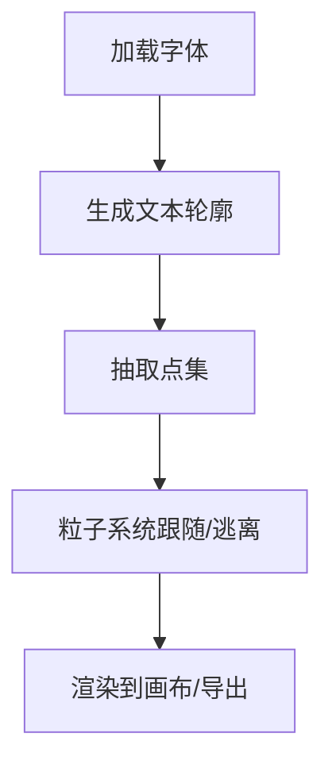

图示来源
- [typography.md:3-77](file://skills/creative/p5js/references/typography.md#L3-L77)
- [typography.md:90-184](file://skills/creative/p5js/references/typography.md#L90-L184)
- [typography.md:186-259](file://skills/creative/p5js/references/typography.md#L186-L259)
- [typography.md:261-303](file://skills/creative/p5js/references/typography.md#L261-L303)

章节来源
- [typography.md:1-120](file://skills/creative/p5js/references/typography.md#L1-L120)
- [typography.md:120-240](file://skills/creative/p5js/references/typography.md#L120-L240)
- [typography.md:240-303](file://skills/creative/p5js/references/typography.md#L240-L303)

### 8) 导出与渲染管线
- PNG/GIF：内置saveCanvas/saveGif；GIF需小画布与低帧率
- MP4：帧序列 + ffmpeg；render.sh一键完成；export-frames.js支持确定性捕获
- SVG：p5.js-svg渲染矢量；限制较多（无像素操作、blendMode、WebGL）
- 批量与批次：批量种子导出、分块渲染（超大分辨率）、平台导出（fxhash等）
- 视频注意事项：YUV420导致暗色丢失、静态帧需动画化、场景过渡与淡入淡出

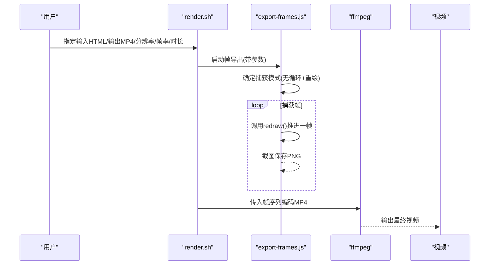

图示来源
- [export-pipeline.md:1-159](file://skills/creative/p5js/references/export-pipeline.md#L1-L159)
- [export-pipeline.md:160-270](file://skills/creative/p5js/references/export-pipeline.md#L160-L270)
- [export-pipeline.md:271-380](file://skills/creative/p5js/references/export-pipeline.md#L271-L380)
- [export-pipeline.md:381-465](file://skills/creative/p5js/references/export-pipeline.md#L381-L465)
- [export-pipeline.md:474-567](file://skills/creative/p5js/references/export-pipeline.md#L474-L567)
- [render.sh:1-109](file://skills/creative/p5js/scripts/render.sh#L1-L109)
- [export-frames.js:1-180](file://skills/creative/p5js/scripts/export-frames.js#L1-L180)

章节来源
- [export-pipeline.md:1-200](file://skills/creative/p5js/references/export-pipeline.md#L1-L200)
- [export-pipeline.md:200-400](file://skills/creative/p5js/references/export-pipeline.md#L200-L400)
- [export-pipeline.md:400-567](file://skills/creative/p5js/references/export-pipeline.md#L400-L567)
- [render.sh:1-109](file://skills/creative/p5js/scripts/render.sh#L1-L109)
- [export-frames.js:1-180](file://skills/creative/p5js/scripts/export-frames.js#L1-L180)

### 9) HTML模板与工作流
- viewer.html：固定布局（侧栏+画布），内置种子导航、参数滑杆、动作按钮、响应式画布
- 单文件HTML：内联p5.js与算法，无需构建，直接打开
- 本地开发：serve.sh启动本地服务器，解决跨域与本地资源加载问题
- 环境准备：setup.sh检查Node/Puppeteer/ffmpeg/Python等依赖

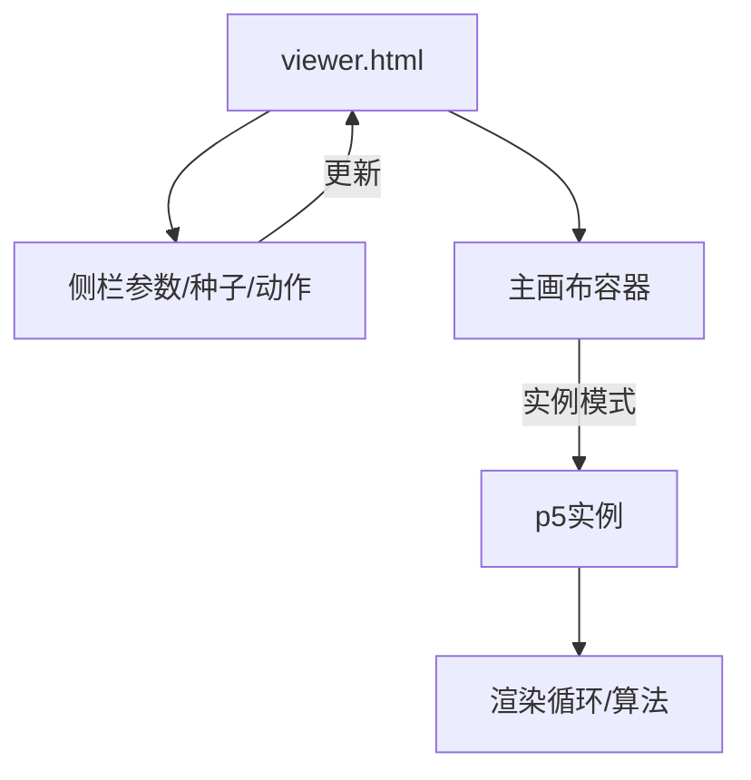

图示来源
- [viewer.html:1-120](file://skills/creative/p5js/templates/viewer.html#L1-L120)
- [viewer.html:259-395](file://skills/creative/p5js/templates/viewer.html#L259-L395)
- [setup.sh:1-88](file://skills/creative/p5js/scripts/setup.sh#L1-L88)
- [serve.sh:1-29](file://skills/creative/p5js/scripts/serve.sh#L1-L29)

章节来源
- [viewer.html:1-200](file://skills/creative/p5js/templates/viewer.html#L1-L200)
- [setup.sh:1-88](file://skills/creative/p5js/scripts/setup.sh#L1-L88)
- [serve.sh:1-29](file://skills/creative/p5js/scripts/serve.sh#L1-L29)

## 依赖关系分析
- p5.js版本：默认1.11.3，强调稳定性与兼容性；2.x新增特性（如OKLCH、splineVertex、async setup等）按需使用
- 外部库：p5.sound.js（音频）、p5.js-svg（矢量导出）、CCapture.js（确定性视频捕获）
- 运行时：浏览器原生Canvas/WebGL；Node.js + Puppeteer用于头像导出
- 脚本耦合：render.sh依赖export-frames.js；export-frames.js依赖Puppeteer与浏览器渲染

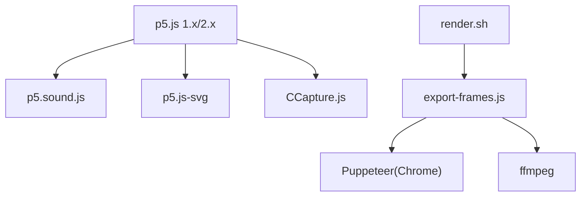

图示来源
- [SKILL.md:41-57](file://skills/creative/p5js/SKILL.md#L41-L57)
- [export-pipeline.md:406-473](file://skills/creative/p5js/references/export-pipeline.md#L406-L473)
- [render.sh:1-109](file://skills/creative/p5js/scripts/render.sh#L1-L109)
- [export-frames.js:1-180](file://skills/creative/p5js/scripts/export-frames.js#L1-L180)

章节来源
- [SKILL.md:41-63](file://skills/creative/p5js/SKILL.md#L41-L63)
- [export-pipeline.md:406-473](file://skills/creative/p5js/references/export-pipeline.md#L406-L473)

## 性能考量
- 关闭友好错误系统（FES）与retina倍率，统一像素密度
- 热路径优先使用Math.*而非p5封装；向量化绘制；像素级优化
- 分层与离屏缓冲：减少每帧绘制复杂度；轨迹使用半透明矩形衰减
- 参数设计：暴露算法本质参数，而非表面外观开关
- 导出分辨率与帧率：根据用途选择（交互60fps、导出30fps起）

章节来源
- [SKILL.md:272-331](file://skills/creative/p5js/SKILL.md#L272-L331)
- [SKILL.md:388-414](file://skills/creative/p5js/SKILL.md#L388-L414)
- [core-api.md:18-36](file://skills/creative/p5js/references/core-api.md#L18-L36)

## 故障排查指南
- 性能问题：启用性能面板，定位热路径；减少每帧绘制数量；使用createGraphics分层
- 导出暗色丢失：确保可见内容亮度≥10；先导出PNG再对比
- 静态内容读作冻结：添加渐显、缓慢参数漂移、轻微相机运动或动态叠加
- 场景硬切：加入淡入淡出包络；使用smoothstep平滑过渡
- 头像导出重复/跳帧：确保Sketch使用noLoop()并设置window._p5Ready
- 本地资源加载失败：使用serve.sh启动本地服务器；或通过CDN/同源策略

章节来源
- [export-pipeline.md:180-258](file://skills/creative/p5js/references/export-pipeline.md#L180-L258)
- [export-pipeline.md:140-158](file://skills/creative/p5js/references/export-pipeline.md#L140-L158)
- [export-pipeline.md:354-384](file://skills/creative/p5js/references/export-pipeline.md#L354-L384)
- [setup.sh:1-88](file://skills/creative/p5js/scripts/setup.sh#L1-L88)

## 结论
本技能包提供了从创意到实现再到导出的一体化工作流：以单文件HTML为核心，结合模板、参考文档与脚本工具，既能快速产出交互式生成艺术，也能稳定导出高质量视频与矢量图。遵循性能与参数设计原则，配合确定性导出与场景过渡，可显著提升作品的专业度与可复现性。

## 附录
- 模式速览：生成艺术、数据可视化、交互体验、动画/动效、3D场景、图像处理、音频响应
- 导出格式决策：单帧PNG、打印PNG、短循环GIF、长动画MP4、矢量SVG、批量变体、HTML部署、头像渲染
- 版本与特性：p5.js 1.x稳定兼容，2.x引入OKLCH/OKLAB、splineVertex、shader.modify等新能力

章节来源
- [README.md:11-31](file://skills/creative/p5js/README.md#L11-L31)
- [export-pipeline.md:367-380](file://skills/creative/p5js/references/export-pipeline.md#L367-L380)
- [core-api.md:327-411](file://skills/creative/p5js/references/core-api.md#L327-L411)