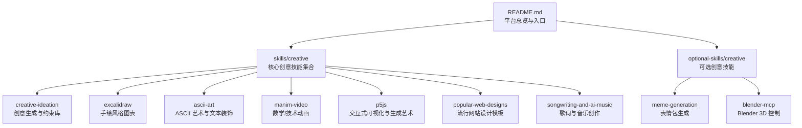
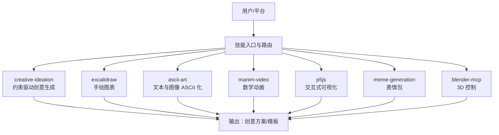
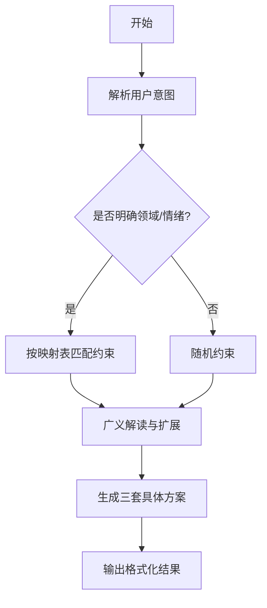
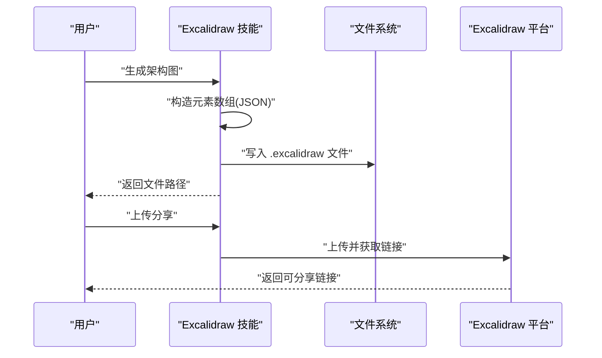
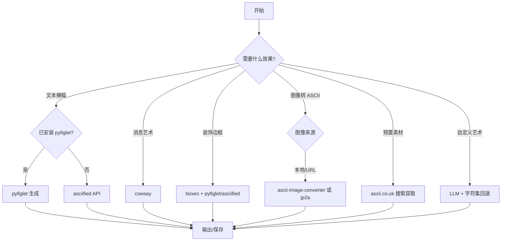
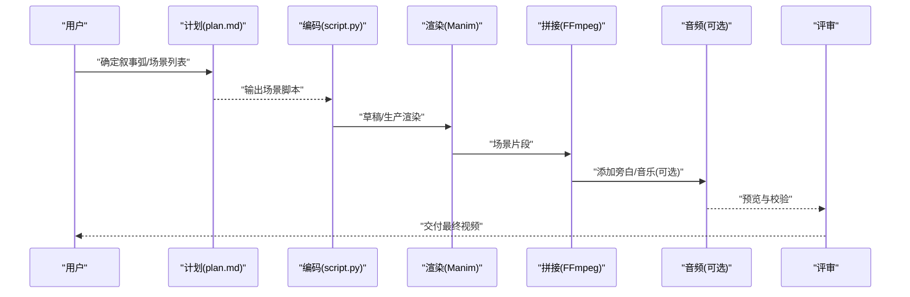
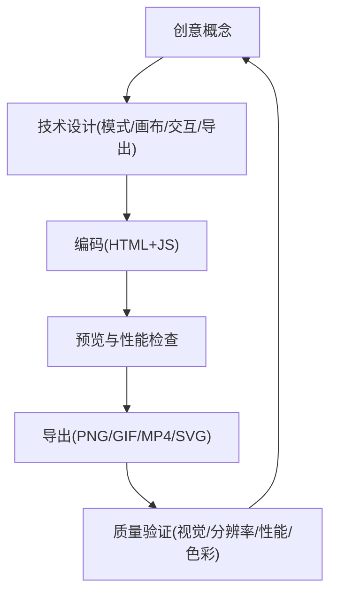
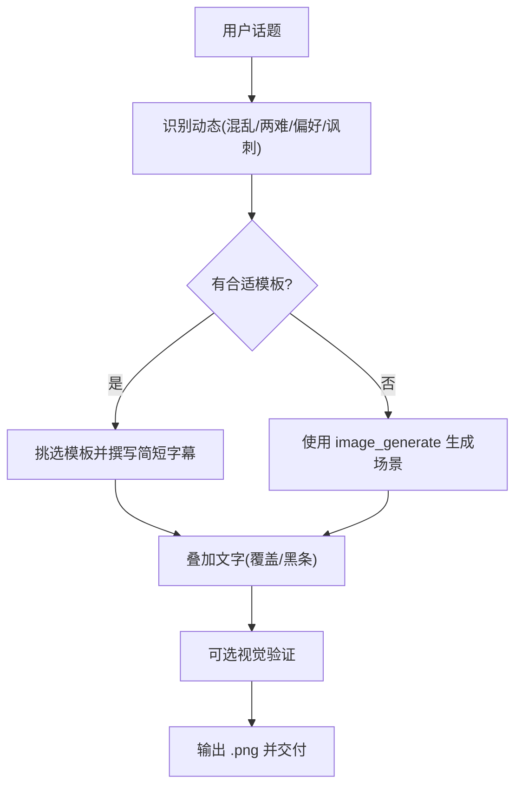
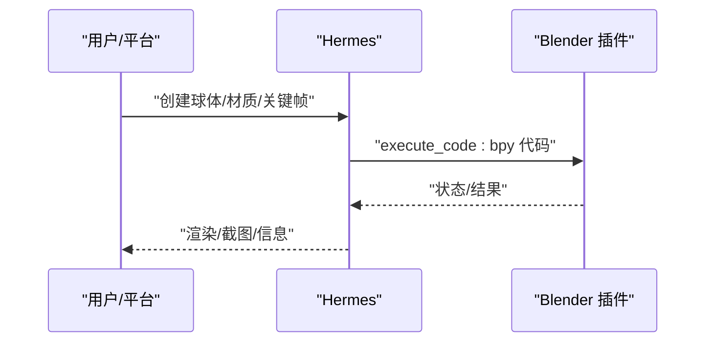
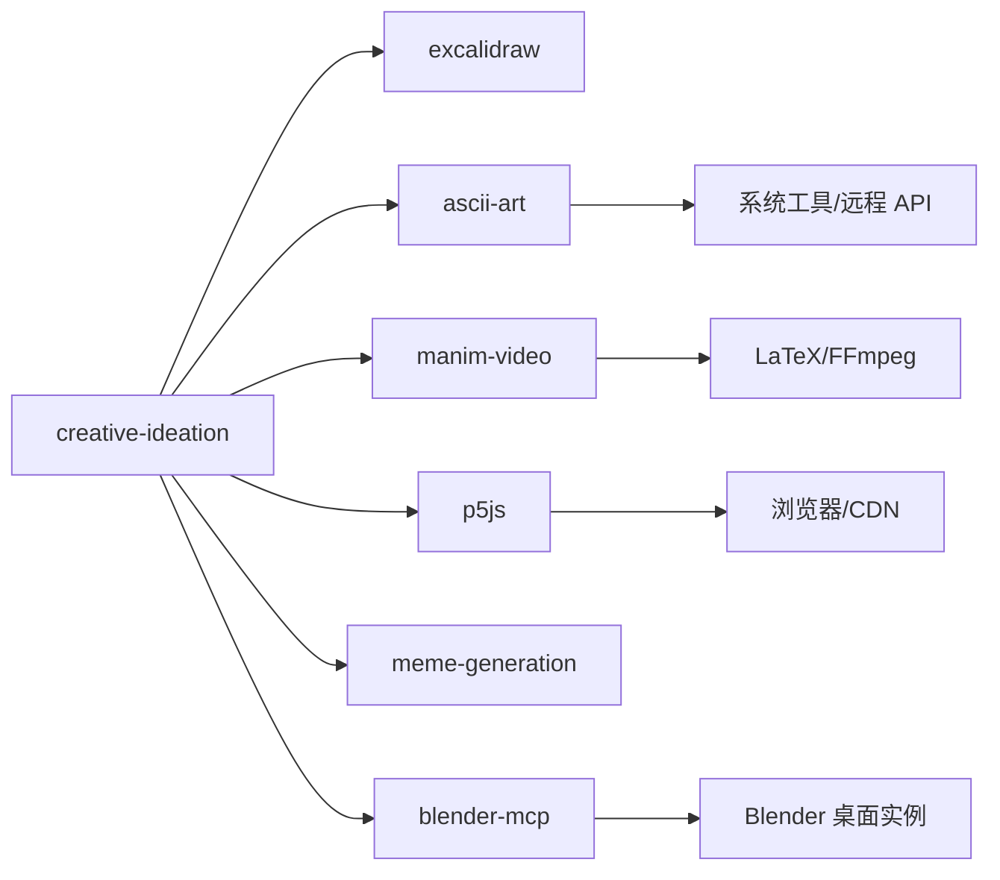

# 创意构思技能

<cite>
**本文引用的文件**
- [README.md](file://README.md)
- [skills/creative/creative-ideation/SKILL.md](file://skills/creative/creative-ideation/SKILL.md)
- [skills/creative/creative-ideation/references/full-prompt-library.md](file://skills/creative/creative-ideation/references/full-prompt-library.md)
- [skills/creative/excalidraw/SKILL.md](file://skills/creative/excalidraw/SKILL.md)
- [skills/creative/ascii-art/SKILL.md](file://skills/creative/ascii-art/SKILL.md)
- [skills/creative/manim-video/SKILL.md](file://skills/creative/manim-video/SKILL.md)
- [skills/creative/manim-video/README.md](file://skills/creative/manim-video/README.md)
- [skills/creative/p5js/SKILL.md](file://skills/creative/p5js/SKILL.md)
- [optional-skills/creative/meme-generation/SKILL.md](file://optional-skills/creative/meme-generation/SKILL.md)
- [optional-skills/creative/blender-mcp/SKILL.md](file://optional-skills/creative/blender-mcp/SKILL.md)
- [skills/creative/DESCRIPTION.md](file://skills/creative/DESCRIPTION.md)
- [skills/research/research-paper-writing/references/reviewer-guidelines.md](file://skills/research/research-paper-writing/references/reviewer-guidelines.md)
- [skills/research/research-paper-writing/references/experiment-patterns.md](file://skills/research/research-paper-writing/references/experiment-patterns.md)
- [skills/research/research-paper-writing/references/autoreason-methodology.md](file://skills/research/research-paper-writing/references/autoreason-methodology.md)
</cite>

## 目录
1. [引言](#引言)
2. [项目结构](#项目结构)
3. [核心组件](#核心组件)
4. [架构总览](#架构总览)
5. [详细组件分析](#详细组件分析)
6. [依赖关系分析](#依赖关系分析)
7. [性能考量](#性能考量)
8. [故障排查指南](#故障排查指南)
9. [结论](#结论)
10. [附录](#附录)

## 引言
本文件系统化梳理“创意构思技能”，围绕以下目标展开：  
- 理论基础：约束驱动、思维导图、灵感激发、提示词工程、创意模板与思维框架  
- 实践工具：ASCII 艺术、手绘风格图表、交互式可视化、数学动画、表情包生成、Blender 控制  
- 流程体系：创意库构建、主题扩展、概念验证、迭代优化、团队协作  
- 案例实践：产品设计、故事创作、解决方案开发  

本指南既面向初学者，也面向希望提升创意产出质量与效率的进阶用户。

## 项目结构
创意相关能力主要分布在两个路径：  
- 核心创意技能（skills/creative）：提供可直接使用的创意工具与工作流  
- 可选创意技能（optional-skills/creative）：补充特定创意方向（如表情包、3D 控制）

**图表来源**
- [README.md:1-179](file://README.md#L1-L179)
- [skills/creative/DESCRIPTION.md:1-4](file://skills/creative/DESCRIPTION.md#L1-L4)

**章节来源**
- [README.md:1-179](file://README.md#L1-L179)
- [skills/creative/DESCRIPTION.md:1-4](file://skills/creative/DESCRIPTION.md#L1-L4)

## 核心组件
- 创意生成与约束库（creative-ideation）：通过“约束 + 方向”驱动创意，提供约束库与匹配策略，支持输出三套具体方案与资源链接。
- 手绘风格图表（excalidraw）：以 Excalidraw JSON 构建架构图、流程图、序列图等，支持上传分享。
- ASCII 艺术（ascii-art）：多工具链（pyfiglet、asciified、cowsay、boxes、toilet、图像转 ASCII、预置素材、LLM 回退）组合，覆盖文本横幅、消息艺术、边框、彩色效果、图像转 ASCII、天气/二维码等。
- 数学动画（manim-video）：教育级动画管线，强调“先叙事再渲染”，提供场景规划、颜色与排版、LaTeX/FFmpeg 工具链、分镜拼接与可选配音。
- 交互式可视化（p5js）：浏览器端生成艺术与数据可视化，强调“首帧即精品”，提供模式、栈、管线、参数设计哲学与导出策略。
- 表情包生成（meme-generation）：基于模板或自绘场景叠加文字，支持智能默认定位与黑条模式，保证可读性。
- Blender 3D 控制（blender-mcp）：通过 socket 协议在 Blender 中执行任意 bpy 代码，支持对象、材质、关键帧与渲染。

**章节来源**
- [skills/creative/creative-ideation/SKILL.md:1-148](file://skills/creative/creative-ideation/SKILL.md#L1-L148)
- [skills/creative/excalidraw/SKILL.md:1-195](file://skills/creative/excalidraw/SKILL.md#L1-L195)
- [skills/creative/ascii-art/SKILL.md:1-322](file://skills/creative/ascii-art/SKILL.md#L1-L322)
- [skills/creative/manim-video/SKILL.md:1-265](file://skills/creative/manim-video/SKILL.md#L1-L265)
- [skills/creative/p5js/SKILL.md:1-548](file://skills/creative/p5js/SKILL.md#L1-L548)
- [optional-skills/creative/meme-generation/SKILL.md:1-130](file://optional-skills/creative/meme-generation/SKILL.md#L1-L130)
- [optional-skills/creative/blender-mcp/SKILL.md:1-117](file://optional-skills/creative/blender-mcp/SKILL.md#L1-L117)

## 架构总览
创意构思技能采用“工具即服务”的模块化架构：  
- 用户通过平台命令或对话触发技能  
- 技能根据输入选择合适的创意模板/约束/模式  
- 调用本地工具链或外部服务（如 API、渲染引擎）完成产出  
- 支持上传/导出/分享，形成闭环

**图表来源**
- [skills/creative/creative-ideation/SKILL.md:19-28](file://skills/creative/creative-ideation/SKILL.md#L19-L28)
- [skills/creative/excalidraw/SKILL.md:19-54](file://skills/creative/excalidraw/SKILL.md#L19-L54)
- [skills/creative/ascii-art/SKILL.md:19-322](file://skills/creative/ascii-art/SKILL.md#L19-L322)
- [skills/creative/manim-video/SKILL.md:52-76](file://skills/creative/manim-video/SKILL.md#L52-L76)
- [skills/creative/p5js/SKILL.md:64-78](file://skills/creative/p5js/SKILL.md#L64-L78)
- [optional-skills/creative/meme-generation/SKILL.md:18-90](file://optional-skills/creative/meme-generation/SKILL.md#L18-L90)
- [optional-skills/creative/blender-mcp/SKILL.md:14-32](file://optional-skills/creative/blender-mcp/SKILL.md#L14-L32)

## 详细组件分析

### 组件一：创意生成（creative-ideation）
- 理论基础：规则是“提示即约束”，无约束则无创意；鼓励广义解读，允许跨领域迁移
- 工作流：挑选约束 → 广义解读 → 生成三套具体方案 → 输出格式化模板
- 约束库：开发者类、制作者类、通用类，以及“匹配用户语境”的映射表
- 扩展资源：完整提示库（通信、界面、哲学、转换、身份、规模、起点等主题）

**图表来源**
- [skills/creative/creative-ideation/SKILL.md:19-97](file://skills/creative/creative-ideation/SKILL.md#L19-L97)
- [skills/creative/creative-ideation/SKILL.md:98-148](file://skills/creative/creative-ideation/SKILL.md#L98-L148)
- [skills/creative/creative-ideation/references/full-prompt-library.md:1-111](file://skills/creative/creative-ideation/references/full-prompt-library.md#L1-L111)

**章节来源**
- [skills/creative/creative-ideation/SKILL.md:1-148](file://skills/creative/creative-ideation/SKILL.md#L1-L148)
- [skills/creative/creative-ideation/references/full-prompt-library.md:1-111](file://skills/creative/creative-ideation/references/full-prompt-library.md#L1-L111)

### 组件二：思维导图与可视化（excalidraw）
- 用途：快速绘制架构图、流程图、序列图、概念图等
- 工作流：加载技能 → 编写元素 JSON → 保存 .excalidraw 文件 → 可选上传分享
- 关键点：元素类型、容器绑定、标注、箭头绑定、绘制顺序、尺寸与配色建议

**图表来源**
- [skills/creative/excalidraw/SKILL.md:19-54](file://skills/creative/excalidraw/SKILL.md#L19-L54)
- [skills/creative/excalidraw/SKILL.md:56-195](file://skills/creative/excalidraw/SKILL.md#L56-L195)

**章节来源**
- [skills/creative/excalidraw/SKILL.md:1-195](file://skills/creative/excalidraw/SKILL.md#L1-L195)

### 组件三：ASCII 艺术与文本装饰（ascii-art）
- 多工具链组合：pyfiglet、asciified API、cowsay、boxes、toilet、图像转 ASCII、预置素材、LLM 回退
- 决策流：按可用性与需求选择工具，必要时回退到下一个选项
- 最佳实践：字体选择、宽度控制、颜色与对比度、预览与调整

**图表来源**
- [skills/creative/ascii-art/SKILL.md:19-322](file://skills/creative/ascii-art/SKILL.md#L19-L322)

**章节来源**
- [skills/creative/ascii-art/SKILL.md:1-322](file://skills/creative/ascii-art/SKILL.md#L1-L322)

### 组件四：数学与技术动画（manim-video）
- 创意标准：先叙事再渲染、几何优先于代数、首帧即精品、分层透明度、留白与呼吸节奏
- 工作流：PLAN → CODE → RENDER → STITCH → AUDIO（可选）→ REVIEW
- 模式：概念解释、方程推导、算法可视化、数据故事、架构图、论文讲解、3D 可视化
- 关键实现：LaTeX 渲染、FFmpeg 拼接、颜色与排版规范、性能目标

**图表来源**
- [skills/creative/manim-video/SKILL.md:52-76](file://skills/creative/manim-video/SKILL.md#L52-L76)
- [skills/creative/manim-video/SKILL.md:131-188](file://skills/creative/manim-video/SKILL.md#L131-L188)
- [skills/creative/manim-video/README.md:1-24](file://skills/creative/manim-video/README.md#L1-L24)

**章节来源**
- [skills/creative/manim-video/SKILL.md:1-265](file://skills/creative/manim-video/SKILL.md#L1-L265)
- [skills/creative/manim-video/README.md:1-24](file://skills/creative/manim-video/README.md#L1-L24)

### 组件五：交互式可视化与生成艺术（p5js）
- 创意标准：首帧即精品、超越参考词汇、主动创意、层次丰富、统一美学
- 工作流：CONCEPT → DESIGN → CODE → PREVIEW → EXPORT → VERIFY
- 模式：生成艺术、数据可视化、交互体验、动画/运动图形、3D 场景、图像处理、音频响应
- 关键实现：p5.js API、WebGL/着色器、导出与捕获、性能优化、参数设计哲学

**图表来源**
- [skills/creative/p5js/SKILL.md:64-78](file://skills/creative/p5js/SKILL.md#L64-L78)
- [skills/creative/p5js/SKILL.md:134-271](file://skills/creative/p5js/SKILL.md#L134-L271)

**章节来源**
- [skills/creative/p5js/SKILL.md:1-548](file://skills/creative/p5js/SKILL.md#L1-L548)

### 组件六：表情包生成（meme-generation）
- 使用场景：用户请求制作或生成表情包、对特定情境/挫折进行幽默表达
- 模板策略：经典模板（ curated 与动态模板）、自绘场景叠加（覆盖/黑条）
- 质量保障：短标题、字段数量匹配、可读性验证、避免不当内容

**图表来源**
- [optional-skills/creative/meme-generation/SKILL.md:18-90](file://optional-skills/creative/meme-generation/SKILL.md#L18-L90)
- [optional-skills/creative/meme-generation/SKILL.md:67-90](file://optional-skills/creative/meme-generation/SKILL.md#L67-L90)

**章节来源**
- [optional-skills/creative/meme-generation/SKILL.md:1-130](file://optional-skills/creative/meme-generation/SKILL.md#L1-L130)

### 组件七：Blender 3D 控制（blender-mcp）
- 协议：TCP 套接字 + UTF-8 JSON，支持执行任意 bpy 代码、查询场景/对象信息、截图
- 典型流程：安装插件 → 启动服务器 → 连接验证 → 发送命令 → 获取结果
- 注意事项：断开重连、分步执行、绝对路径、渲染输出

**图表来源**
- [optional-skills/creative/blender-mcp/SKILL.md:33-78](file://optional-skills/creative/blender-mcp/SKILL.md#L33-L78)
- [optional-skills/creative/blender-mcp/SKILL.md:80-117](file://optional-skills/creative/blender-mcp/SKILL.md#L80-L117)

**章节来源**
- [optional-skills/creative/blender-mcp/SKILL.md:1-117](file://optional-skills/creative/blender-mcp/SKILL.md#L1-L117)

## 依赖关系分析
- 技能内聚性：各技能独立、职责清晰，适合按需组合使用
- 外部依赖：manim-video 依赖 LaTeX 与 FFmpeg；p5js 依赖浏览器环境与 CDN；ASCII 艺术依赖系统工具或远程 API；Blender MCP 依赖桌面 Blender 实例
- 耦合点：部分技能共享“创意标准”（如“首帧即精品”“叙事优先”），形成一致的创意质量基线

**图表来源**
- [skills/creative/manim-video/SKILL.md:25-51](file://skills/creative/manim-video/SKILL.md#L25-L51)
- [skills/creative/p5js/SKILL.md:41-57](file://skills/creative/p5js/SKILL.md#L41-L57)
- [skills/creative/ascii-art/SKILL.md:23-82](file://skills/creative/ascii-art/SKILL.md#L23-L82)
- [optional-skills/creative/blender-mcp/SKILL.md:5-6](file://optional-skills/creative/blender-mcp/SKILL.md#L5-L6)

**章节来源**
- [skills/creative/manim-video/SKILL.md:25-51](file://skills/creative/manim-video/SKILL.md#L25-L51)
- [skills/creative/p5js/SKILL.md:41-57](file://skills/creative/p5js/SKILL.md#L41-L57)
- [skills/creative/ascii-art/SKILL.md:23-82](file://skills/creative/ascii-art/SKILL.md#L23-L82)
- [optional-skills/creative/blender-mcp/SKILL.md:5-6](file://optional-skills/creative/blender-mcp/SKILL.md#L5-L6)

## 性能考量
- manim：优先草稿质量（-ql）迭代，生产仅在最终阶段使用高分辨率（-qh）
- p5js：禁用友好错误系统（FES）以降低开销；使用 Math.* 替代 p5 包装函数；避免在 draw() 中频繁 console.log 或操作 DOM；使用 offscreen buffers 分层合成
- ASCII：优先本地工具链（pyfiglet/boxes/toilet），远程 API 作为备选，减少网络延迟
- Blender：复杂场景拆分为多个 execute_code 调用，避免超时；确保渲染输出使用绝对路径

**章节来源**
- [skills/creative/manim-video/SKILL.md:214-223](file://skills/creative/manim-video/SKILL.md#L214-L223)
- [skills/creative/p5js/SKILL.md:272-298](file://skills/creative/p5js/SKILL.md#L272-L298)
- [skills/creative/p5js/SKILL.md:388-414](file://skills/creative/p5js/SKILL.md#L388-L414)
- [optional-skills/creative/blender-mcp/SKILL.md:110-117](file://optional-skills/creative/blender-mcp/SKILL.md#L110-L117)

## 故障排查指南
- manim：LaTeX 错误（使用原始字符串）、文本替换顺序（先 FadeOut 再 Write）、非添加对象动画（先 add 再 animate）
- p5js：FES 导致性能下降、随机数种子一致性、WebGL 坐标系差异、导出帧率与无循环渲染
- ASCII：字体名称大小写敏感、URL 编码空格、emoji 不渲染
- Blender：socket 未打开、插件未启动、分步执行避免超时、渲染路径必须绝对

**章节来源**
- [skills/creative/manim-video/SKILL.md:189-213](file://skills/creative/manim-video/SKILL.md#L189-L213)
- [skills/creative/p5js/SKILL.md:272-298](file://skills/creative/p5js/SKILL.md#L272-L298)
- [skills/creative/p5js/SKILL.md:435-443](file://skills/creative/p5js/SKILL.md#L435-L443)
- [skills/creative/ascii-art/SKILL.md:77-82](file://skills/creative/ascii-art/SKILL.md#L77-L82)
- [optional-skills/creative/blender-mcp/SKILL.md:110-117](file://optional-skills/creative/blender-mcp/SKILL.md#L110-L117)

## 结论
创意构思技能通过“约束驱动 + 多模态工具链”的组合，为从零到一的创意产出提供了系统化支撑。建议在实践中：  
- 先用 creative-ideation 明确方向与约束，再选择合适工具落地  
- 严格遵循“首帧即精品”“叙事优先”等创意标准  
- 建立创意库与模板库，沉淀主题扩展与复用机制  
- 以小步快跑的方式进行概念验证与迭代优化  
- 在团队协作中引入评审与打分机制，持续改进质量

## 附录

### 附录A：创意评估与评审参考
- 影响力与重要性、原创性与贡献、可比性与应用潜力
- 评分尺度与打分维度（流畅度、相关性、事实准确性、连贯性、信息量、整体偏好）
- 互评一致性指标（Krippendorff’s alpha）

**章节来源**
- [skills/research/research-paper-writing/references/reviewer-guidelines.md:52-89](file://skills/research/research-paper-writing/references/reviewer-guidelines.md#L52-L89)
- [skills/research/research-paper-writing/references/experiment-patterns.md:250-284](file://skills/research/research-paper-writing/references/experiment-patterns.md#L250-L284)

### 附录B：迭代优化方法（Autoreason 循环）
- 角色分工：批评者、作者、综合者、盲评小组
- 迭代配置：收敛阈值、温度参数、评委数量、最大轮次
- 目标：在有限轮次内收敛至高质量方案

**章节来源**
- [skills/research/research-paper-writing/references/autoreason-methodology.md:58-112](file://skills/research/research-paper-writing/references/autoreason-methodology.md#L58-L112)