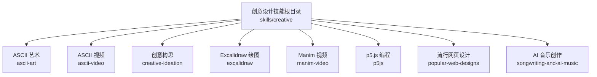
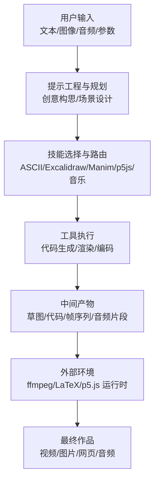
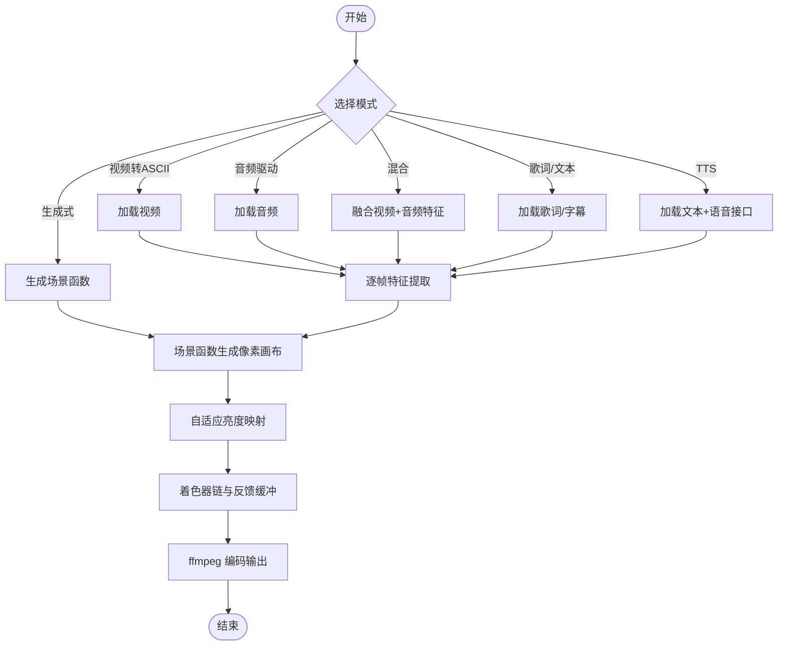
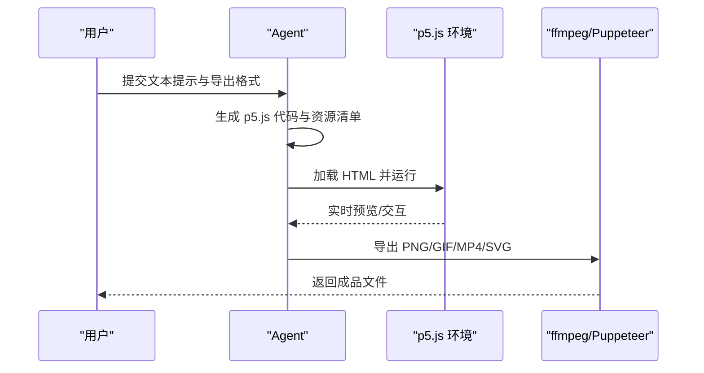
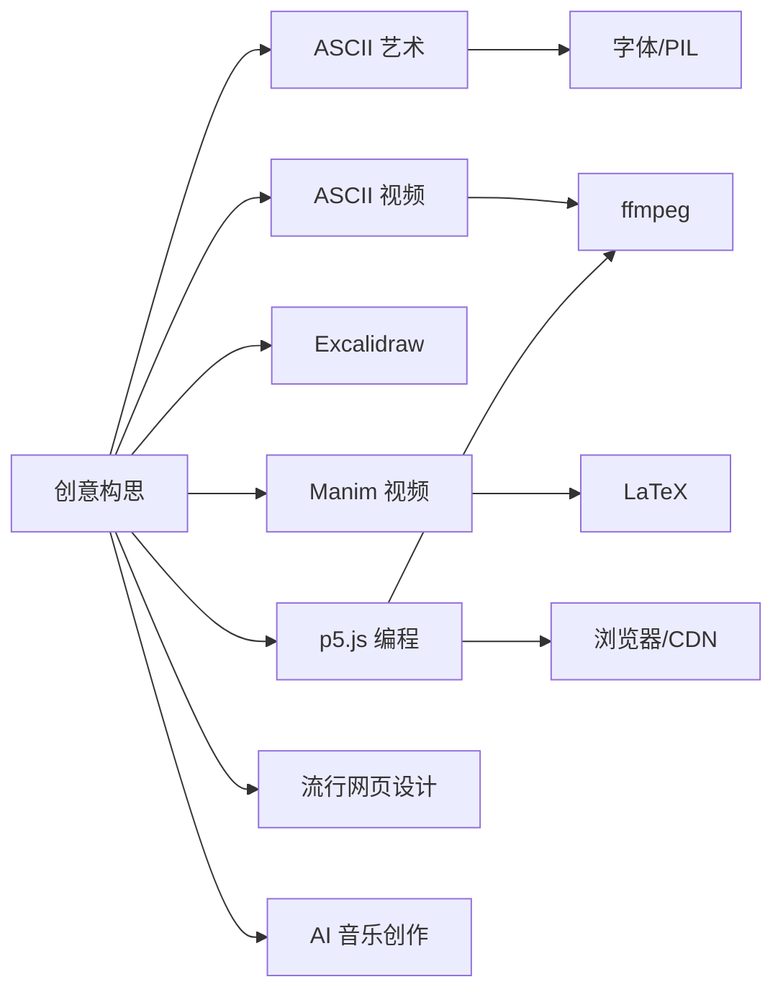

# 创意设计技能

<cite>
**本文引用的文件**
- [skills/creative/DESCRIPTION.md](file://skills/creative/DESCRIPTION.md)
- [skills/creative/ascii-art/README.md](file://skills/creative/ascii-art/README.md)
- [skills/creative/ascii-video/README.md](file://skills/creative/ascii-video/README.md)
- [skills/creative/creative-ideation/README.md](file://skills/creative/creative-ideation/README.md)
- [skills/creative/excalidraw/README.md](file://skills/creative/excalidraw/README.md)
- [skills/creative/manim-video/README.md](file://skills/creative/manim-video/README.md)
- [skills/creative/p5js/README.md](file://skills/creative/p5js/README.md)
- [skills/creative/popular-web-designs/README.md](file://skills/creative/popular-web-designs/README.md)
- [skills/creative/songwriting-and-ai-music/README.md](file://skills/creative/songwriting-and-ai-music/README.md)
</cite>

## 目录
1. [简介](#简介)
2. [项目结构](#项目结构)
3. [核心组件](#核心组件)
4. [架构总览](#架构总览)
5. [详细组件分析](#详细组件分析)
6. [依赖关系分析](#依赖关系分析)
7. [性能考量](#性能考量)
8. [故障排查指南](#故障排查指南)
9. [结论](#结论)
10. [附录](#附录)

## 简介
本文件系统性梳理 Hermes Agent 的创意设计技能体系，覆盖 ASCII 艺术与视频、创意构思、Excalidraw 绘图、Manim 视频、p5.js 编程、流行网页设计、AI 音乐创作等能力。文档从技术实现、使用方法、应用场景、创作流程到优化建议进行分层讲解，帮助不同背景的用户快速上手并高效产出高质量创意作品。

## 项目结构
创意设计技能位于 skills/creative 目录下，每个子技能以独立 README 提供使用说明、模式、工作流与参考内容。整体采用“功能域 + 技术栈”的组织方式：  
- ASCII 艺术与 ASCII 视频：基于字符栅格、字体光栅化、着色器链与 ffmpeg 编码的全流程管线  
- Excalidraw：面向手绘风格草图与概念图的矢量绘图  
- Manim：数学与技术动画的生成式视频创作  
- p5.js：浏览器端交互式视觉艺术与导出流水线  
- 流行网页设计：现代网站设计范式与最佳实践  
- AI 音乐创作：歌词/旋律/风格提示下的自动作曲与编曲  
- 创意构思：从文本到视觉方案的策划与迭代

章节来源
- [skills/creative/DESCRIPTION.md:1-4](file://skills/creative/DESCRIPTION.md#L1-L4)

## 核心组件
- ASCII 艺术：将图像/文本转为字符画，强调调色板、密度层级与字体兼容性
- ASCII 视频：以帧级字符栅格合成 + 多通道着色器后处理 + ffmpeg 编码输出
- 创意构思：从需求到视觉方案的策划、迭代与素材组织
- Excalidraw：手绘风矢量绘图，支持草图化与概念表达
- Manim：数学/算法/架构等可视化动画的生成式视频
- p5.js：浏览器端交互式视觉艺术与多格式导出
- 流行网页设计：现代网站设计范式与落地实践
- AI 音乐创作：歌词/风格/情绪提示下的自动作曲与编曲

章节来源
- [skills/creative/ascii-art/README.md](file://skills/creative/ascii-art/README.md)
- [skills/creative/ascii-video/README.md](file://skills/creative/ascii-video/README.md)
- [skills/creative/creative-ideation/README.md](file://skills/creative/creative-ideation/README.md)
- [skills/creative/excalidraw/README.md](file://skills/creative/excalidraw/README.md)
- [skills/creative/manim-video/README.md](file://skills/creative/manim-video/README.md)
- [skills/creative/p5js/README.md](file://skills/creative/p5js/README.md)
- [skills/creative/popular-web-designs/README.md](file://skills/creative/popular-web-designs/README.md)
- [skills/creative/songwriting-and-ai-music/README.md](file://skills/creative/songwriting-and-ai-music/README.md)

## 架构总览
创意设计技能在 Hermes Agent 中通过“提示工程 + 工具调用 + 外部环境”协同完成。Agent 依据输入（文本/图像/音频）选择合适技能，生成中间产物（代码/草图/脚本），再由外部工具（如 ffmpeg、p5.js 运行时、LaTeX 渲染器）完成最终渲染与导出。

## 详细组件分析

### ASCII 艺术
- 使用方法
  - 输入：图像或文本
  - 输出：字符画（可选带调色板与密度层级）
  - 关键点：调色板验证、字体兼容、密度网格选择
- 技术特点
  - 字符栅格系统与字体光栅化
  - 可视化亮度场与色彩映射策略
  - 支持多种字符族（密度梯度、块元素、点阵、数学符号等）
- 应用场景
  - 数据可视化热力图、信息密度图
  - 艺术风格化头像、标题牌
  - 低带宽传输的替代视觉表达
- 创作技巧
  - 优先选择与主题匹配的字符族
  - 控制密度层级以平衡细节与可读性
  - 注意字体兼容性与空白字形剔除
- 优化建议
  - 预先验证字符集与字体高度
  - 合理选择网格尺寸与调色板
  - 输出前进行亮度与对比度校正

章节来源
- [skills/creative/ascii-art/README.md](file://skills/creative/ascii-art/README.md)

### ASCII 视频
- 使用方法
  - 模式：视频转 ASCII、音频驱动、生成式、混合、歌词/文本、TTS 叙述
  - 管线：输入 → 分析 → 场景函数 → 映射 → 着色 → 编码
- 技术实现
  - 网格系统与多密度叠加
  - 值场/色调场生成器（三角函数、噪声、仿真、SDF）
  - 38 种可组合着色器与反馈缓冲
  - ffmpeg 编码与音频同步
- 性能与硬件适配
  - 自动检测 CPU/内存/平台，自适应分辨率与帧率
  - 渲染时间估算与降级策略
- 应用场景
  - 音乐可视化、节拍驱动效果
  - 数学/算法演示的字符化版本
  - 教育短片与极简风格广告
- 创作流程
  - 设计场景层次与参数弧（随时间变化的主参）
  - 选择值场/色调场与着色器组合
  - 执行渲染与后处理，导出 MP4/GIF/PNG 序列
- 优化建议
  - 将非必要 Python 循环向量化
  - 使用合适的网格密度与分辨率
  - 避免 ffmpeg 死锁（重定向错误输出）

图表来源
- [skills/creative/ascii-video/README.md:24-37](file://skills/creative/ascii-video/README.md#L24-L37)

章节来源
- [skills/creative/ascii-video/README.md:1-291](file://skills/creative/ascii-video/README.md#L1-L291)

### 创意构思
- 使用方法
  - 输入：需求描述、目标受众、风格偏好、约束条件
  - 输出：视觉方案、草图方向、素材清单、迭代计划
- 技术特点
  - 结合场景设计模式与参数弧，避免随机性
  - 层次化构图与视觉隐喻
- 应用场景
  - 视觉品牌与信息图设计
  - 动画/视频分镜与节奏规划
  - 交互体验的叙事结构设计
- 创作技巧
  - 先定场景概念，再选字符/色彩/运动策略
  - 使用过渡与遮罩增强空间感
- 优化建议
  - 在早期阶段明确主参的时间曲线
  - 通过多方案对比筛选最优构图

章节来源
- [skills/creative/creative-ideation/README.md](file://skills/creative/creative-ideation/README.md)

### Excalidraw 绘图
- 使用方法
  - 输入：草图描述、形状/布局要求、风格标签
  - 输出：矢量草图（可导出 PNG/SVG/WebP）
- 技术特点
  - 手绘风格与概念表达
  - 线条与形状的自然化渲染
- 应用场景
  - 架构草图、流程图、原型图
  - 快速概念验证与团队协作
- 创作技巧
  - 先粗后细：轮廓→细节→标注
  - 使用分组与对齐提升可读性
- 优化建议
  - 保持线条简洁，避免过度装饰
  - 合理使用透明度与填充

章节来源
- [skills/creative/excalidraw/README.md](file://skills/creative/excalidraw/README.md)

### Manim 视频
- 使用方法
  - 输入：文本提示（解释器、推导、算法、数据故事、架构）
  - 输出：高质量数学/技术动画视频
- 技术实现
  - 全流程：创意规划 → 代码生成 → 渲染 → 场景拼接 → 迭代优化
  - 依赖：Python 3.10+、Manim CE、LaTeX、ffmpeg
- 应用场景
  - 教育类短视频、技术讲解
  - 算法可视化、公式推导演示
- 创作技巧
  - 将复杂概念拆分为清晰的步骤
  - 使用缓动与过渡增强可理解性
- 优化建议
  - 合理设置帧率与分辨率
  - 预渲染关键帧以减少重算

章节来源
- [skills/creative/manim-video/README.md:1-24](file://skills/creative/manim-video/README.md#L1-L24)

### p5.js 编程
- 使用方法
  - 输入：文本提示（生成艺术、数据可视化、交互体验、动画、3D、图像处理、音频驱动）
  - 输出：单文件 HTML（可直接运行）、PNG/GIF/MP4/SVG 导出
- 技术实现
  - 模式：生成艺术、数据可视化、交互体验、动画/动效、3D 场景、图像处理、音频驱动
  - 导出：浏览器预览、Puppeteer 头/headless 渲染、ffmpeg 编码
- 应用场景
  - 网页内交互装置、数据仪表盘
  - 实验性动画与粒子系统
- 创作技巧
  - 明确视觉层次与色彩搭配
  - 使用离屏缓冲与帧序列优化性能
- 优化建议
  - 避免每帧重复昂贵计算
  - 使用 CDN 资源与最小化依赖

图表来源
- [skills/creative/p5js/README.md:23-42](file://skills/creative/p5js/README.md#L23-L42)

章节来源
- [skills/creative/p5js/README.md:1-65](file://skills/creative/p5js/README.md#L1-L65)

### 流行网页设计
- 使用方法
  - 输入：设计目标、风格偏好、内容结构
  - 输出：符合现代审美的网页设计方案与实现要点
- 技术特点
  - 现代布局范式、响应式与无障碍
  - 视觉层次与交互一致性
- 应用场景
  - 个人作品集、产品展示页、企业官网
- 创作技巧
  - 以用户为中心的设计思维
  - 使用网格系统与留白
- 优化建议
  - 注重首屏与加载性能
  - 跨设备与跨浏览器测试

章节来源
- [skills/creative/popular-web-designs/README.md](file://skills/creative/popular-web-designs/README.md)

### AI 音乐创作
- 使用方法
  - 输入：歌词/风格/情绪/乐器偏好
  - 输出：自动作曲与编曲的音频片段
- 技术特点
  - 基于提示的风格迁移与和声生成
  - 支持多轨编排与动态变化
- 应用场景
  - 视频/游戏背景音乐
  - 海报/广告的短音乐片段
- 创作技巧
  - 明确主旋律与副旋律层次
  - 使用情绪与风格标签引导生成
- 优化建议
  - 对生成结果进行人工微调
  - 控制音轨数量与混响以提升空间感

章节来源
- [skills/creative/songwriting-and-ai-music/README.md](file://skills/creative/songwriting-and-ai-music/README.md)

## 依赖关系分析
- 内部耦合
  - 创意构思贯穿各技能，作为统一的策划与迭代中枢
  - ASCII 视频与 p5.js 均依赖外部渲染与编码工具
- 外部依赖
  - ffmpeg：视频编码与音频同步
  - LaTeX：数学公式渲染（Manim）
  - p5.js 运行时与浏览器：交互式艺术与导出
  - 字体与 PIL：ASCII 字符栅格化
- 潜在风险
  - ffmpeg 死锁、字体兼容性、渲染瓶颈、导出格式不一致

## 性能考量
- 渲染瓶颈
  - ASCII 视频中每单元格合成的 Python 循环不可避免，需尽量向量化与并行化
  - p5.js 中避免每帧重复昂贵计算，使用离屏缓冲与帧序列
- 硬件适配
  - 自动检测 CPU/内存/平台，按性能动态调整分辨率与帧率
  - 长时渲染时启用降级策略，避免超时
- 导出优化
  - ffmpeg 错误输出重定向，避免缓冲区阻塞
  - 选择合适的导出格式与压缩参数

## 故障排查指南
- ASCII 视频
  - 亮度问题：使用自适应映射而非线性缩放
  - 渲染卡顿：检查循环向量化与并行度
  - ffmpeg 死锁：不要将 stderr 管道化，改用文件重定向
  - 字体高度：macOS 使用字体度量而非文本边界框
  - 字体兼容：初始化时验证字符集，空白字形静默剔除
- p5.js
  - 性能：避免每帧重建大对象；使用帧序列导出
  - 导出：确保 Puppeteer 与 ffmpeg 可用
- Manim
  - LaTeX：确保安装完整宏包；必要时预渲染静态图
- Excalidraw
  - 导出：确认矢量格式与分辨率设置
- 流行网页设计
  - 兼容性：跨浏览器与跨设备测试
- AI 音乐
  - 风格漂移：细化提示词与风格标签
  - 混音：控制音轨与混响，避免过载

章节来源
- [skills/creative/ascii-video/README.md:247-258](file://skills/creative/ascii-video/README.md#L247-L258)
- [skills/creative/p5js/README.md:57-65](file://skills/creative/p5js/README.md#L57-L65)
- [skills/creative/manim-video/README.md:17-24](file://skills/creative/manim-video/README.md#L17-L24)

## 结论
Hermes Agent 的创意设计技能以“提示驱动 + 工具协同”为核心，覆盖从草图到成品的全链路创作流程。通过合理选择技能、遵循技术特性与优化建议，可在多种媒体形式（图像、视频、网页、音频）中高效产出高质量创意作品。

## 附录
- 快速上手清单
  - 准备 ffmpeg/LaTeX/p5.js 运行时/字体资源
  - 明确输入类型与导出格式
  - 选择合适技能并细化提示词
  - 预渲染关键帧与导出成品
- 推荐工作流
  - 创意构思 → 技能选择 → 代码/草图生成 → 预览与迭代 → 导出与发布