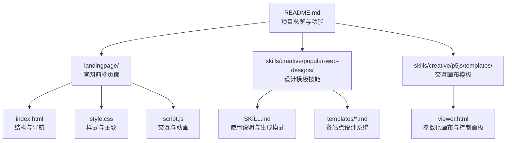
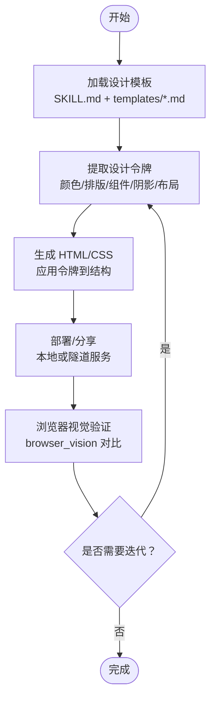
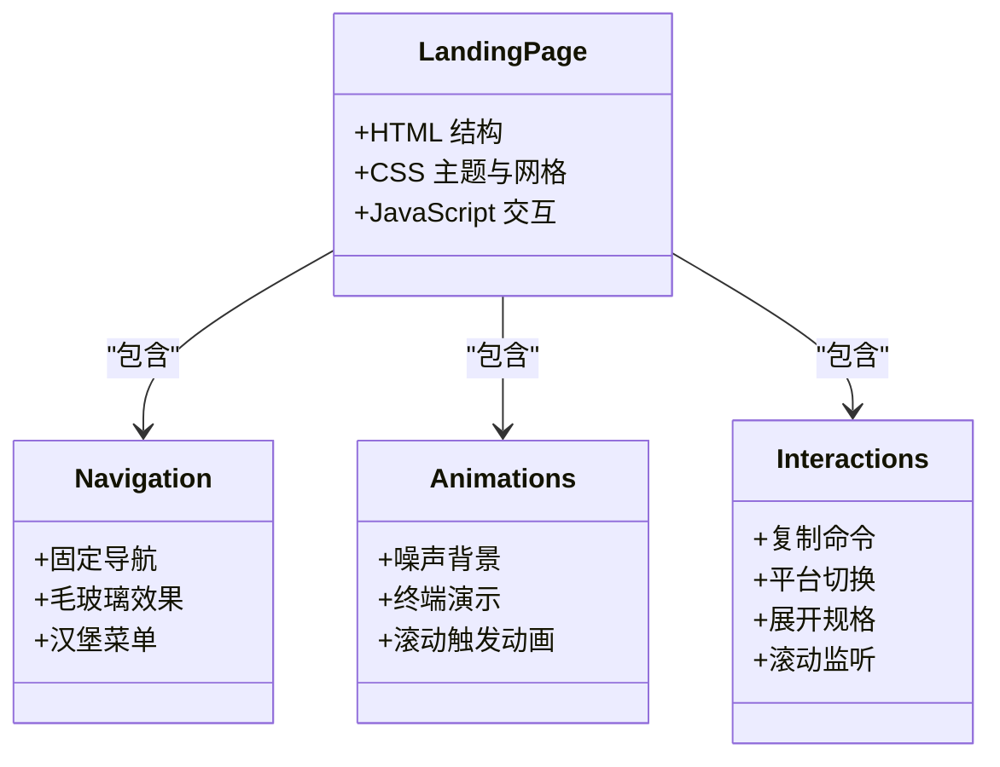
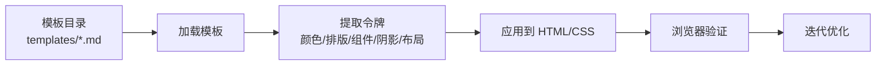
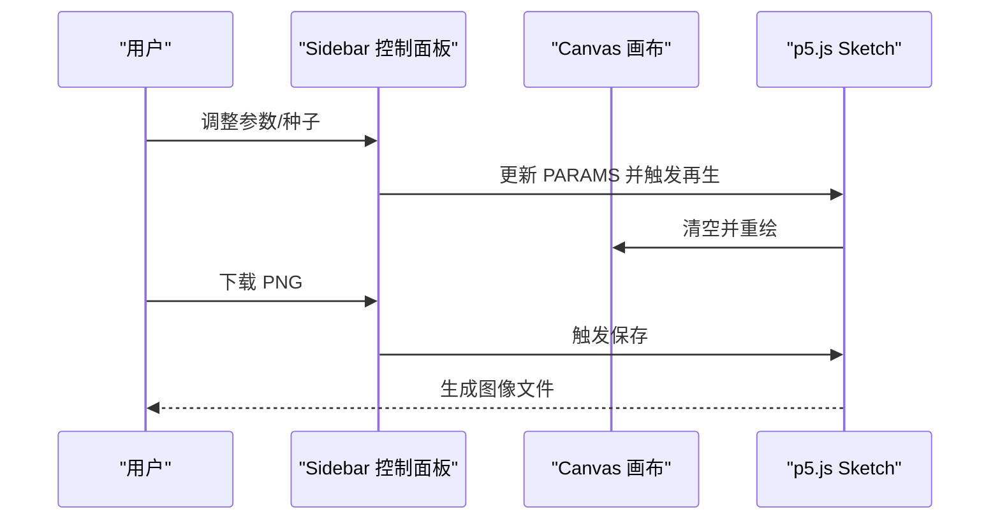
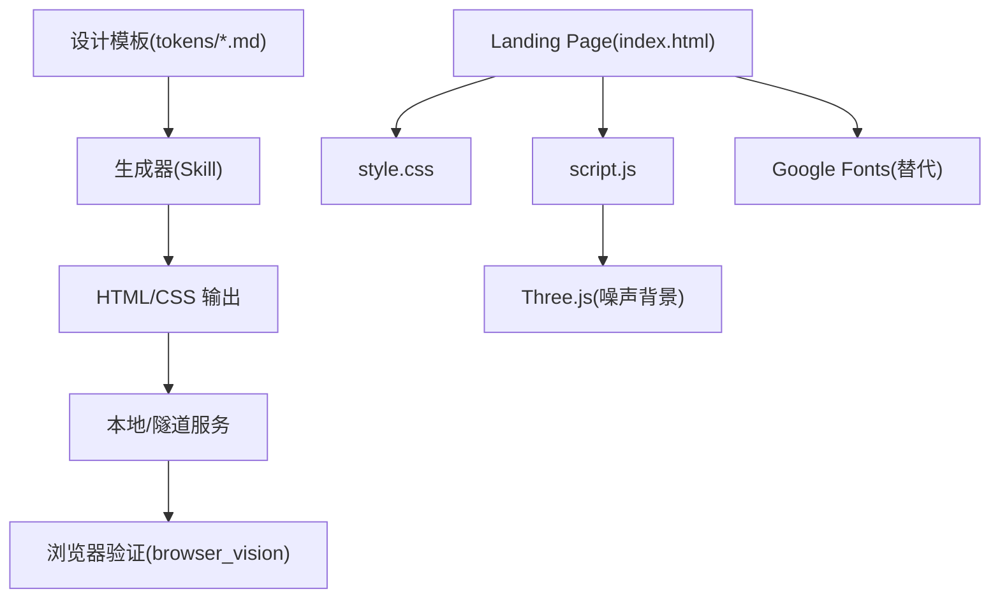

# 流行网页设计技能

<cite>
**本文引用的文件**
- [README.md](file://README.md)
- [landingpage/index.html](file://landingpage/index.html)
- [landingpage/style.css](file://landingpage/style.css)
- [landingpage/script.js](file://landingpage/script.js)
- [SKILL.md](file://skills/creative/popular-web-designs/SKILL.md)
- [airbnb.md](file://skills/creative/popular-web-designs/templates/airbnb.md)
- [apple.md](file://skills/creative/popular-web-designs/templates/apple.md)
- [figma.md](file://skills/creative/popular-web-designs/templates/figma.md)
- [viewer.html](file://skills/creative/p5js/templates/viewer.html)
</cite>

## 目录
1. [引言](#引言)
2. [项目结构](#项目结构)
3. [核心组件](#核心组件)
4. [架构总览](#架构总览)
5. [详细组件分析](#详细组件分析)
6. [依赖关系分析](#依赖关系分析)
7. [性能考量](#性能考量)
8. [故障排查指南](#故障排查指南)
9. [结论](#结论)
10. [附录](#附录)

## 引言
本文件面向希望掌握“流行网页设计技能”的读者，系统梳理现代网页设计趋势、UI/UX 设计原则与响应式布局技术，并结合本仓库中的落地实践（官网 Landing Page、流行网站设计模板与生成工作流）进行深入解析。内容覆盖：
- 现代设计风格：极简主义、变量字体、几何按钮、无彩色界面、摄影驱动等
- 设计系统与实现：颜色、排版、组件、阴影、布局、交互反馈
- 模板结构与生成流程：从设计令牌到可运行 HTML/CSS 的转换路径
- 实战案例：Airbnb、Apple、Figma 等网站的设计特色与实现要点
- 模板使用、定制修改与部署发布：本地开发、云服务与验证闭环

## 项目结构
本仓库中与“流行网页设计”直接相关的核心资源包括：
- 官网 Landing Page：HTML/CSS/JS 前端页面，展示设计理念与交互细节
- 流行网站设计模板技能：提供真实站点的设计系统与实现指南
- p5.js 可交互画布模板：用于生成式艺术与可视化原型

图表来源
- [README.md](file://README.md)
- [landingpage/index.html](file://landingpage/index.html)
- [landingpage/style.css](file://landingpage/style.css)
- [landingpage/script.js](file://landingpage/script.js)
- [SKILL.md](file://skills/creative/popular-web-designs/SKILL.md)
- [viewer.html](file://skills/creative/p5js/templates/viewer.html)

章节来源
- [README.md](file://README.md)
- [landingpage/index.html](file://landingpage/index.html)
- [landingpage/style.css](file://landingpage/style.css)
- [landingpage/script.js](file://landingpage/script.js)
- [SKILL.md](file://skills/creative/popular-web-designs/SKILL.md)
- [viewer.html](file://skills/creative/p5js/templates/viewer.html)

## 核心组件
- 官网 Landing Page：采用深色主题、动态背景与终端演示，强调“渐进增强”的交互体验与无障碍滚动触发
- 流行网站设计模板：提供可复用的设计令牌（颜色、排版、组件、阴影、布局、响应式断点），支持按需加载与生成
- 交互画布模板：基于 p5.js 的参数化画布，内置种子导航、参数调节与导出能力，便于快速原型验证

章节来源
- [landingpage/index.html](file://landingpage/index.html)
- [landingpage/style.css](file://landingpage/style.css)
- [landingpage/script.js](file://landingpage/script.js)
- [SKILL.md](file://skills/creative/popular-web-designs/SKILL.md)
- [viewer.html](file://skills/creative/p5js/templates/viewer.html)

## 架构总览
下图展示了“设计系统 → 生成器 → 验证”的完整工作流：

图表来源
- [SKILL.md](file://skills/creative/popular-web-designs/SKILL.md)

## 详细组件分析

### 官网 Landing Page 组件分析
官网 Landing Page 是一个典型的现代响应式单页应用，具备以下特征：
- 视觉主题：深色背景、科技蓝为主色、网格纹理与柔和光晕营造氛围
- 导航与移动端适配：固定导航栏、毛玻璃效果、汉堡菜单与移动端展开
- 动态元素：噪声背景（Three.js）、终端演示（打字机效果）、滚动触发动画
- 交互细节：复制命令、平台切换、展开/收起规格说明、滚动时导航边框变化

图表来源
- [landingpage/index.html](file://landingpage/index.html)
- [landingpage/style.css](file://landingpage/style.css)
- [landingpage/script.js](file://landingpage/script.js)

章节来源
- [landingpage/index.html](file://landingpage/index.html)
- [landingpage/style.css](file://landingpage/style.css)
- [landingpage/script.js](file://landingpage/script.js)

### 流行网站设计模板组件分析
该技能提供 54 个真实站点的设计系统，涵盖企业/消费者、文档/营销、深色/浅色等多种风格。其核心价值在于“设计令牌”的标准化与可执行性。

图表来源
- [SKILL.md](file://skills/creative/popular-web-designs/SKILL.md)

章节来源
- [SKILL.md](file://skills/creative/popular-web-designs/SKILL.md)

#### Airbnb 设计特色与实现要点
- 色彩体系：以 Rausch 红为核心品牌色，搭配近黑文本与多级阴影卡片
- 排版与圆角：大字号标题、圆润按钮与导航控件，强调“触摸友好”
- 响应式策略：多达 61 个断点，网格列数与搜索栏形态随尺寸变化
- 图像处理：轮播与全宽图片，保持一致的叠加层位置与质量自适应

章节来源
- [airbnb.md](file://skills/creative/popular-web-designs/templates/airbnb.md)

#### Apple 设计特色与实现要点
- 字体系统：SF Pro Display/Text 的光学尺寸与负间距，强调“产品即雕塑”的极简叙事
- 色彩方案：纯黑/纯白二元对比，仅在交互元素使用 Apple Blue
- 组件风格：胶囊形 CTA、导航半透明玻璃效果、卡片阴影模拟物理光源
- 布局哲学：全宽画布、居中内容、段落间留白如电影节奏

章节来源
- [apple.md](file://skills/creative/popular-web-designs/templates/apple.md)

#### Figma 设计特色与实现要点
- 字体与权重：figmaSans 的非常见字重停靠（320–540），通过微调权重建立层级
- 几何语言：胶囊与圆形按钮，焦点轮廓采用虚线，呼应编辑器选择手柄
- 色彩策略：界面层严格黑白，产品截图与英雄区使用多色渐变
- 排版细节：全局开启 OpenType kern，正文普遍负间距；monospace 用于标签并正间距

章节来源
- [figma.md](file://skills/creative/popular-web-designs/templates/figma.md)

### 交互画布模板组件分析
该模板为 p5.js 交互画布提供统一的布局与控制面板，便于参数化生成与导出。

图表来源
- [viewer.html](file://skills/creative/p5js/templates/viewer.html)

章节来源
- [viewer.html](file://skills/creative/p5js/templates/viewer.html)

## 依赖关系分析
- 设计模板依赖于“设计令牌”的一致性，生成器通过模板引擎或手工拼接将令牌映射到 HTML/CSS
- Landing Page 依赖 Three.js 进行噪声背景渲染，依赖系统字体或 Google Fonts 替代方案
- 交互画布模板依赖 p5.js CDN 与浏览器环境

图表来源
- [SKILL.md](file://skills/creative/popular-web-designs/SKILL.md)
- [landingpage/index.html](file://landingpage/index.html)
- [landingpage/style.css](file://landingpage/style.css)
- [landingpage/script.js](file://landingpage/script.js)

章节来源
- [SKILL.md](file://skills/creative/popular-web-designs/SKILL.md)
- [landingpage/index.html](file://landingpage/index.html)
- [landingpage/style.css](file://landingpage/style.css)
- [landingpage/script.js](file://landingpage/script.js)

## 性能考量
- 资源加载
  - 使用预连接与字体预加载，减少首屏阻塞
  - 将噪声背景渲染限制在非“减少动态”偏好用户场景
- 交互性能
  - 滚动触发动画采用 IntersectionObserver，避免高频计算
  - 终端演示采用分步渲染与节流，保证流畅度
- 生成效率
  - 设计令牌集中管理，避免重复计算与样式漂移
  - 参数化画布通过随机种子与噪声种子确保可重现性

## 故障排查指南
- 字体显示异常
  - 若系统字体不可用，使用 Google Fonts 替代链接（参见模板注释）
- 动画卡顿
  - 检查是否启用“减少动态”偏好；必要时禁用噪声背景与滚动动画
- 画布尺寸问题
  - 确认容器尺寸与设备像素比设置；在窗口大小变化时重新计算画布尺寸
- 生成结果偏差
  - 使用 browser_vision 进行对比验证；核对设计令牌与组件规格的一致性

章节来源
- [SKILL.md](file://skills/creative/popular-web-designs/SKILL.md)
- [landingpage/script.js](file://landingpage/script.js)
- [viewer.html](file://skills/creative/p5js/templates/viewer.html)

## 结论
本仓库提供了从“设计系统到可运行页面”的完整实践路径：以 Landing Page 展示现代前端交互与视觉语言，以流行网站设计模板沉淀真实站点的设计令牌与实现细节，并以交互画布模板支撑参数化生成与快速验证。通过遵循设计规范、优化用户体验与跨平台兼容性，可以高效产出高质量的网页设计与原型。

## 附录
- 快速开始
  - 加载模板：使用技能视图加载目标站点的模板文件
  - 应用令牌：将颜色、排版、组件、阴影、布局等令牌映射到 HTML/CSS
  - 生成与验证：写入文件并通过隧道服务发布，使用浏览器视觉验证
- 推荐流程
  - 选择风格 → 加载模板 → 应用令牌 → 生成页面 → 部署发布 → 验证迭代

章节来源
- [SKILL.md](file://skills/creative/popular-web-designs/SKILL.md)