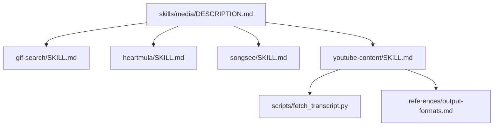
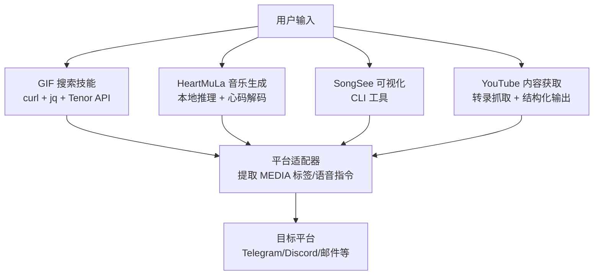
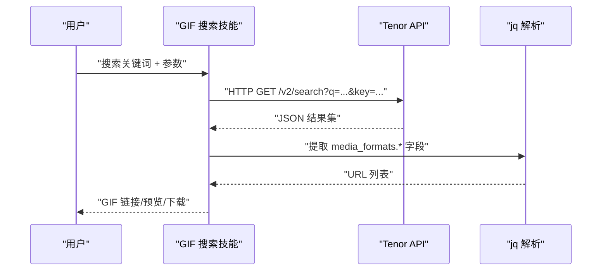
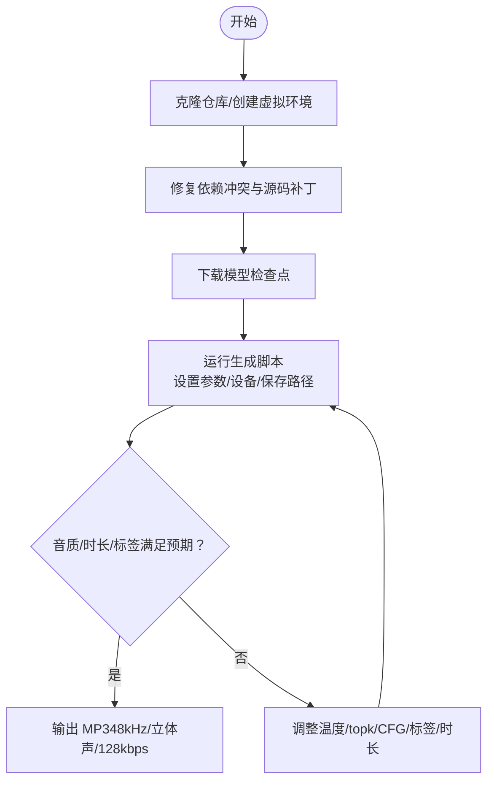
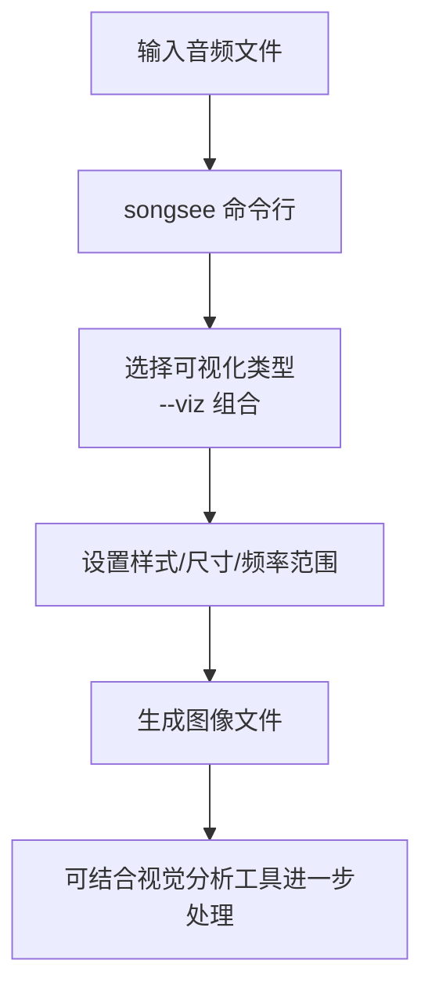
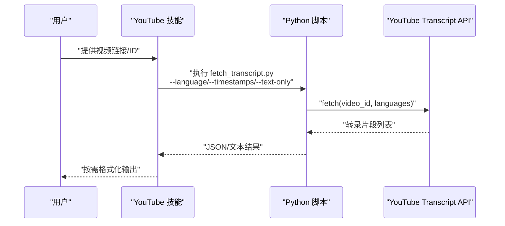
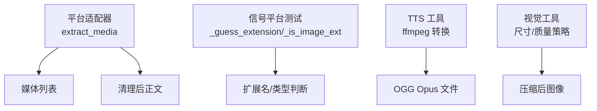

# 媒体处理技能

<cite>
**本文引用的文件**
- [skills/media/DESCRIPTION.md](file://skills/media/DESCRIPTION.md)
- [skills/media/gif-search/SKILL.md](file://skills/media/gif-search/SKILL.md)
- [skills/media/heartmula/SKILL.md](file://skills/media/heartmula/SKILL.md)
- [skills/media/songsee/SKILL.md](file://skills/media/songsee/SKILL.md)
- [skills/media/youtube-content/SKILL.md](file://skills/media/youtube-content/SKILL.md)
- [skills/media/youtube-content/scripts/fetch_transcript.py](file://skills/media/youtube-content/scripts/fetch_transcript.py)
- [skills/media/youtube-content/references/output-formats.md](file://skills/media/youtube-content/references/output-formats.md)
- [tools/tts_tool.py](file://tools/tts_tool.py)
- [tools/vision_tools.py](file://tools/vision_tools.py)
- [tests/gateway/test_platform_base.py](file://tests/gateway/test_platform_base.py)
- [tests/gateway/test_signal.py](file://tests/gateway/test_signal.py)
</cite>

## 目录
1. [简介](#简介)
2. [项目结构](#项目结构)
3. [核心组件](#核心组件)
4. [架构总览](#架构总览)
5. [详细组件分析](#详细组件分析)
6. [依赖关系分析](#依赖关系分析)
7. [性能考虑](#性能考虑)
8. [故障排查指南](#故障排查指南)
9. [结论](#结论)
10. [附录](#附录)

## 简介
本文件系统性梳理 Hermes Agent 的媒体处理技能，覆盖以下能力：
- GIF 搜索与下载（Tenor API）
- HeartMuLa 音乐生成（开源 Suno 替代）
- SongSee 音频可视化（频谱图、梅尔频带、MFCC 等）
- YouTube 内容获取与转录提取（结构化输出）

文档从架构、数据流、处理逻辑、集成点、错误处理与性能优化等方面进行深入解析，并提供可操作的应用案例与最佳实践。

## 项目结构
媒体处理技能位于 skills/media 下，每个子技能以独立的 SKILL.md 文档描述安装、使用与参数；部分技能包含脚本或参考示例。

图表来源
- [skills/media/DESCRIPTION.md:1-4](file://skills/media/DESCRIPTION.md#L1-L4)
- [skills/media/gif-search/SKILL.md:1-87](file://skills/media/gif-search/SKILL.md#L1-L87)
- [skills/media/heartmula/SKILL.md:1-171](file://skills/media/heartmula/SKILL.md#L1-L171)
- [skills/media/songsee/SKILL.md:1-83](file://skills/media/songsee/SKILL.md#L1-L83)
- [skills/media/youtube-content/SKILL.md:1-73](file://skills/media/youtube-content/SKILL.md#L1-L73)
- [skills/media/youtube-content/scripts/fetch_transcript.py:1-125](file://skills/media/youtube-content/scripts/fetch_transcript.py#L1-L125)
- [skills/media/youtube-content/references/output-formats.md:1-57](file://skills/media/youtube-content/references/output-formats.md#L1-L57)

章节来源
- [skills/media/DESCRIPTION.md:1-4](file://skills/media/DESCRIPTION.md#L1-L4)

## 核心组件
- GIF 搜索（Tenor API）：通过 curl + jq 调用 Tenor 搜索接口，支持多格式返回（gif、tinygif、mp4、webm），便于在聊天中直接发送预览或全量 GIF。
- HeartMuLa 音乐生成：基于开源模型家族（HeartMuLa、HeartCodec、HeartTranscriptor、HeartCLAP），支持本地/离线生成歌曲，提供参数调优与硬件要求说明。
- SongSee 音频可视化：命令行工具，支持多种音频特征图（频谱、梅尔、色度、HPSS、自相似、响度、节拍、MFCC、通量）拼接为多面板图像。
- YouTube 内容获取：封装转录抓取脚本，支持多种 URL 形态与语言回退链，输出 JSON/纯文本/时间戳文本，并提供章节、摘要、主题摘要、推文式串、博客文章、名言等格式模板。

章节来源
- [skills/media/gif-search/SKILL.md:15-87](file://skills/media/gif-search/SKILL.md#L15-L87)
- [skills/media/heartmula/SKILL.md:11-171](file://skills/media/heartmula/SKILL.md#L11-L171)
- [skills/media/songsee/SKILL.md:15-83](file://skills/media/songsee/SKILL.md#L15-L83)
- [skills/media/youtube-content/SKILL.md:10-73](file://skills/media/youtube-content/SKILL.md#L10-L73)

## 架构总览
媒体处理技能的典型工作流如下：用户输入触发技能 → 技能根据类型调用外部 API 或本地工具 → 输出结构化结果或媒体文件 → 平台层进行媒体识别与投递。

图表来源
- [skills/media/gif-search/SKILL.md:34-56](file://skills/media/gif-search/SKILL.md#L34-L56)
- [skills/media/heartmula/SKILL.md:102-158](file://skills/media/heartmula/SKILL.md#L102-L158)
- [skills/media/songsee/SKILL.md:28-45](file://skills/media/songsee/SKILL.md#L28-L45)
- [skills/media/youtube-content/SKILL.md:20-36](file://skills/media/youtube-content/SKILL.md#L20-L36)
- [tests/gateway/test_platform_base.py:258-290](file://tests/gateway/test_platform_base.py#L258-L290)

## 详细组件分析

### GIF 搜索（Tenor API）
- 外部集成：通过 Tenor 免费 API 获取搜索结果，支持多格式媒体字段（gif、tinygif、mp4、webm 等）。
- 关键流程：
  - 参数校验与编码（q、limit、key、media_filter、contentfilter、locale）
  - 使用 curl 发起请求，jq 提取所需字段
  - 支持下载完整 GIF 或预览 tinygif
- 实用建议：
  - 在聊天中优先使用 tinygif 降低带宽
  - 对特殊字符进行 URL 编码
  - 可直接在 Markdown 中渲染 GIF

图表来源
- [skills/media/gif-search/SKILL.md:34-56](file://skills/media/gif-search/SKILL.md#L34-L56)

章节来源
- [skills/media/gif-search/SKILL.md:15-87](file://skills/media/gif-search/SKILL.md#L15-L87)

### HeartMuLa 音乐生成
- 组件构成：HeartMuLa（3B/7B）、HeartCodec（高保真重建）、HeartTranscriptor（歌词转写）、HeartCLAP（音文对齐）。
- 安装与运行：
  - 克隆仓库、创建 Python 3.10 虚拟环境
  - 修复依赖冲突与源码补丁（RoPE 缓存、HeartCodec 加载）
  - 下载模型检查点（可并行）
  - 运行示例脚本，指定歌词、标签、保存路径与设备
- 关键参数与性能：
  - 采样温度、topk、CFG 缩放、最大时长
  - dtype 设置（HeartMuLa 推荐 bfloat16；HeartCodec 推荐 float32）
  - RTF 约等于 1，GPU 推荐 16GB+ VRAM
- 注意事项：
  - 不要在 HeartCodec 上使用 bf16，会降低音质
  - 标签可能被忽略，建议调整顺序或增加上下文
  - macOS 不支持 Triton，Linux/CUDA 为 GPU 加速首选

图表来源
- [skills/media/heartmula/SKILL.md:32-115](file://skills/media/heartmula/SKILL.md#L32-L115)
- [skills/media/heartmula/SKILL.md:144-158](file://skills/media/heartmula/SKILL.md#L144-L158)

章节来源
- [skills/media/heartmula/SKILL.md:11-171](file://skills/media/heartmula/SKILL.md#L11-L171)

### SongSee 音频可视化
- 工具特性：支持多种可视化类型（频谱、梅尔、色度、HPSS、自相似、响度、节拍、MFCC、通量），可拼接为多面板图像。
- 常用参数：--viz、--style、--width/--height、--window/--hop、--min-freq/--max-freq、--start/--duration、--format/-o。
- 使用场景：音频分析、音乐制作调试、可视化文档。

图表来源
- [skills/media/songsee/SKILL.md:28-77](file://skills/media/songsee/SKILL.md#L28-L77)

章节来源
- [skills/media/songsee/SKILL.md:15-83](file://skills/media/songsee/SKILL.md#L15-L83)

### YouTube 内容获取与转录
- 功能概述：从 YouTube 抓取转录，支持多种 URL 形态与语言回退链，输出 JSON/纯文本/时间戳文本，并可转换为章节、摘要、主题摘要、推文式串、博客文章、名言等格式。
- 关键脚本：fetch_transcript.py
  - 视频 ID 提取（支持 v=、youtu.be/、shorts/、embed/、live/、11 字符 ID）
  - 时间戳格式化（HH:MM:SS 或 MM:SS）
  - 异常处理：禁用转录、无可用转录、依赖缺失
- 输出格式参考：提供章节、摘要、章节摘要、推文式串、博客文章、名言等示例模板。

图表来源
- [skills/media/youtube-content/scripts/fetch_transcript.py:76-125](file://skills/media/youtube-content/scripts/fetch_transcript.py#L76-L125)
- [skills/media/youtube-content/SKILL.md:20-36](file://skills/media/youtube-content/SKILL.md#L20-L36)

章节来源
- [skills/media/youtube-content/SKILL.md:10-73](file://skills/media/youtube-content/SKILL.md#L10-L73)
- [skills/media/youtube-content/scripts/fetch_transcript.py:1-125](file://skills/media/youtube-content/scripts/fetch_transcript.py#L1-125)
- [skills/media/youtube-content/references/output-formats.md:1-57](file://skills/media/youtube-content/references/output-formats.md#L1-L57)

## 依赖关系分析
- 平台媒体识别：平台适配器可从消息中提取 MEDIA 标签与语音指令，移除指令标记并保留正文，确保媒体正确投递。
- 媒体格式识别：信号平台测试覆盖常见二进制签名与扩展判断，保证图片/视频/文档等媒体的正确识别与处理。
- 媒体转换与压缩：TTS 工具提供 MP3 到 OGG Opus 的转换，用于 Telegram 语音气泡；视觉工具提供尺寸缩放与质量阶梯策略，保障传输效率与兼容性。

图表来源
- [tests/gateway/test_platform_base.py:258-290](file://tests/gateway/test_platform_base.py#L258-L290)
- [tests/gateway/test_signal.py:133-164](file://tests/gateway/test_signal.py#L133-L164)
- [tools/tts_tool.py:133-170](file://tools/tts_tool.py#L133-L170)
- [tools/vision_tools.py:347-375](file://tools/vision_tools.py#L347-L375)

章节来源
- [tests/gateway/test_platform_base.py:258-290](file://tests/gateway/test_platform_base.py#L258-L290)
- [tests/gateway/test_signal.py:133-164](file://tests/gateway/test_signal.py#L133-L164)
- [tools/tts_tool.py:133-170](file://tools/tts_tool.py#L133-L170)
- [tools/vision_tools.py:347-375](file://tools/vision_tools.py#L347-L375)

## 性能考虑
- API 限流与重试
  - Tenor API：注意免费额度与速率限制，建议对高频查询做去重与缓存。
  - YouTube Transcript API：避免频繁请求相同视频，必要时使用语言回退链减少失败重试。
- 本地推理优化
  - HeartMuLa：优先使用 16GB+ VRAM 设备；bf16 仅用于 HeartMuLa，HeartCodec 使用 fp32；合理设置 max_audio_length_ms 与 topk/temperature。
  - 多 GPU：通过 --mula_device 与 --codec_device 分配到不同设备，提升吞吐。
- 媒体传输优化
  - GIF 预览：在聊天场景优先使用 tinygif，降低带宽占用。
  - 图像压缩：按需缩小尺寸与阶梯降低质量，JPEG 可叠加质量步进，PNG 以尺寸为主。
  - 音频转换：Telegram 语音气泡使用单声道 64kbps OGG Opus，兼顾体积与兼容性。

## 故障排查指南
- Tenor API
  - 现象：返回“禁用转录/无可用转录”等错误
  - 处理：确认视频确实开启字幕；检查 TENOR_API_KEY 是否正确；尝试简化查询词与 limit。
- YouTube 转录
  - 现象：转录为空或报依赖缺失
  - 处理：安装 youtube-transcript-api；不指定语言时自动回退；若仍为空，提示用户检查视频隐私状态。
- HeartMuLa
  - 现象：依赖冲突导致安装失败；生成缓慢或音质异常
  - 处理：按技能文档升级 transformers 与 datasets；不要对 HeartCodec 使用 bf16；无 NVIDIA 显卡时建议云端 GPU 或在线演示。
- 媒体识别与投递
  - 现象：消息中包含 MEDIA 标签但未正确识别
  - 处理：确认平台适配器已移除 [[audio_as_voice]] 等指令标记；检查扩展名识别是否正确。

章节来源
- [skills/media/gif-search/SKILL.md:27-28](file://skills/media/gif-search/SKILL.md#L27-L28)
- [skills/media/youtube-content/SKILL.md:67-73](file://skills/media/youtube-content/SKILL.md#L67-L73)
- [skills/media/heartmula/SKILL.md:48-58](file://skills/media/heartmula/SKILL.md#L48-L58)
- [skills/media/heartmula/SKILL.md:159-164](file://skills/media/heartmula/SKILL.md#L159-L164)
- [tests/gateway/test_platform_base.py:258-290](file://tests/gateway/test_platform_base.py#L258-L290)
- [tests/gateway/test_signal.py:133-164](file://tests/gateway/test_signal.py#L133-L164)

## 结论
Hermes Agent 的媒体处理技能围绕“搜索—生成—可视化—转录”的闭环构建，既可对接公开 API（Tenor、YouTube），也可在本地完成高质量音频生成与可视化。通过合理的参数调优、缓存与传输策略，可在多平台高效交付媒体内容，满足内容聚合、格式转换与批量处理等实际场景需求。

## 附录
- 实际应用案例
  - 内容聚合：使用 YouTube 技能抓取转录并生成章节/摘要，再结合 GIF 搜索补充视觉素材。
  - 批量处理：HeartMuLa 生成多首歌曲后，使用 SongSee 生成频谱图作为对比材料；TTS 工具统一转为 OGG 后批量投递。
  - 质量控制：视觉工具按平台限制进行尺寸与质量阶梯压缩；音频转换采用固定码率与单声道以适配语音气泡。
- API 限制与缓存策略
  - Tenor：对热门关键词做本地缓存；限制并发与重试次数。
  - YouTube：对同一视频 ID 做短期缓存；语言回退链逐级尝试。
  - HeartMuLa：模型懒加载与 dtype 优化；多 GPU 并行生成。
- 性能优化建议
  - 预热模型与缓存常用资源；对大文件先压缩再传输；在平台侧启用合适的媒体格式与尺寸上限。