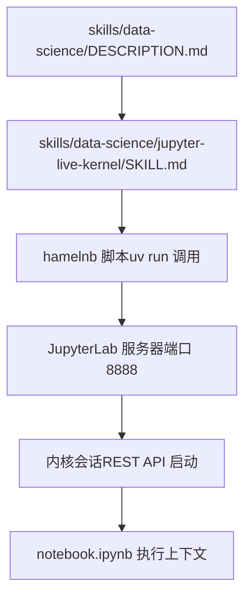
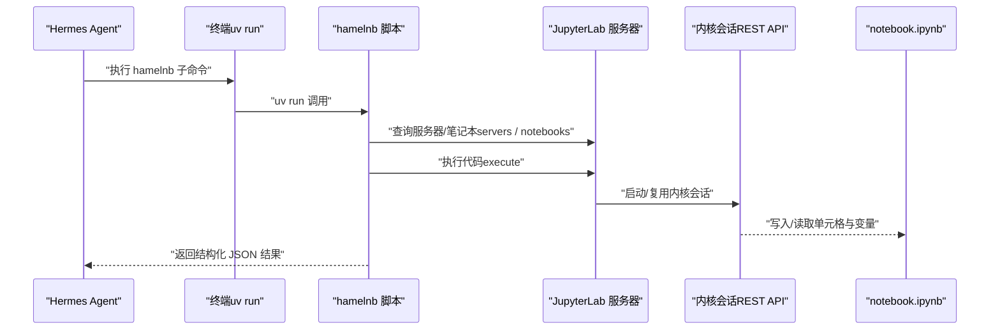
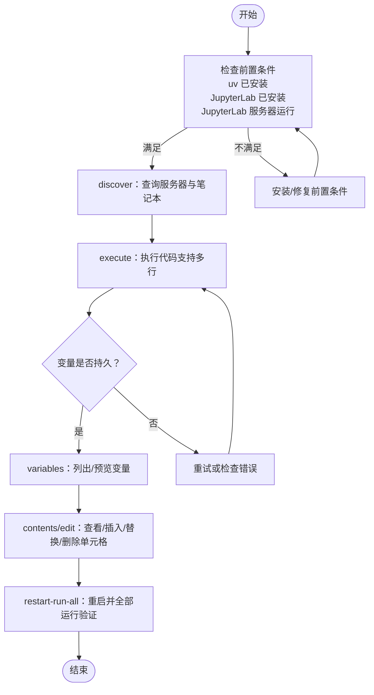

# 数据科学技能

<cite>
**本文引用的文件**
- [skills/data-science/DESCRIPTION.md](file://skills/data-science/DESCRIPTION.md)
- [skills/data-science/jupyter-live-kernel/SKILL.md](file://skills/data-science/jupyter-live-kernel/SKILL.md)
</cite>

## 目录
1. [简介](#简介)
2. [项目结构](#项目结构)
3. [核心组件](#核心组件)
4. [架构总览](#架构总览)
5. [详细组件分析](#详细组件分析)
6. [依赖关系分析](#依赖关系分析)
7. [性能考虑](#性能考虑)
8. [故障排查指南](#故障排查指南)
9. [结论](#结论)
10. [附录](#附录)

## 简介
本文件面向Hermes Agent的数据科学技能，聚焦“Jupyter 实时内核（hamelnb）”能力，系统阐述其在数据科学工作流中的使用方法、配置要点、应用场景与最佳实践。该技能通过一个“有状态”的Python REPL，支持变量持久化、逐步构建与迭代探索，适用于数据处理、可视化、机器学习实验等任务。与一次性脚本执行工具相比，它更适合需要中间态检查、API探索或复杂代码分步构建的场景。

## 项目结构
- 数据科学技能位于 skills/data-science 目录下，包含：
  - 概述文件：skills/data-science/DESCRIPTION.md
  - Jupyter 实时内核技能：skills/data-science/jupyter-live-kernel/SKILL.md
- 该技能通过终端命令调用 hamelnb 提供的脚本，与本地运行的 JupyterLab 服务交互，无需额外工具即可完成状态化的代码执行。

图示来源
- [skills/data-science/DESCRIPTION.md:1-4](file://skills/data-science/DESCRIPTION.md#L1-L4)
- [skills/data-science/jupyter-live-kernel/SKILL.md:18-172](file://skills/data-science/jupyter-live-kernel/SKILL.md#L18-L172)

章节来源
- [skills/data-science/DESCRIPTION.md:1-4](file://skills/data-science/DESCRIPTION.md#L1-L4)
- [skills/data-science/jupyter-live-kernel/SKILL.md:18-172](file://skills/data-science/jupyter-live-kernel/SKILL.md#L18-L172)

## 核心组件
- 技能元信息与分类
  - 技能名称：jupyter-live-kernel
  - 分类：data-science
  - 标签：jupyter、notebook、repl、data-science、exploration、iterative
  - 描述：通过 hamelnb 使用一个“有状态”的 Jupyter 内核进行迭代式 Python 执行；适合探索、中间态检查、API 探测、复杂代码逐步构建等。
- 关键差异
  - 与 execute_code 的区别：后者用于一次性脚本且无状态；前者用于需要变量持久化的迭代过程。
  - 与 terminal 的区别：后者用于 shell 命令、构建、安装、版本控制等；前者用于 Python 代码执行与探索。
- 使用原则
  - 如果你会把任务交给 Jupyter Notebook 完成，就使用该技能。

章节来源
- [skills/data-science/jupyter-live-kernel/SKILL.md:24-32](file://skills/data-science/jupyter-live-kernel/SKILL.md#L24-L32)
- [skills/data-science/jupyter-live-kernel/SKILL.md:18-22](file://skills/data-science/jupyter-live-kernel/SKILL.md#L18-L22)

## 架构总览
下图展示了从 Hermes Agent 到 JupyterLab 的端到端交互路径，以及 hamelnb 脚本如何通过 uv 运行并与 Jupyter 服务通信。

图示来源
- [skills/data-science/jupyter-live-kernel/SKILL.md:82-138](file://skills/data-science/jupyter-live-kernel/SKILL.md#L82-L138)

## 详细组件分析

### 组件A：Jupyter 实时内核技能（hamelnb）
- 功能定位
  - 提供“有状态”的 Python REPL，变量在多次执行之间保持。
  - 支持多行代码、变量列表与预览、笔记本内容查看与编辑、重启并全部运行验证等。
- 核心子命令与用途
  - discover：发现服务器与笔记本
  - execute：执行代码（主操作），支持多行与状态持久化
  - variables：列出与预览变量
  - contents/edit：查看与编辑笔记本单元格
  - restart-run-all：重启并全部运行（验证）
- 参数与约定
  - 建议始终使用 --compact 以节省 token。
  - 参数顺序重要：--path 等标志需置于子子命令之前。
  - 默认每次执行超时约 30 秒；长任务可传入更长超时。
- 配置与前置条件
  - 需要安装 uv，并通过 uv tool 安装 JupyterLab。
  - 需要本地运行 JupyterLab 服务器（默认端口 8888，无 token/password）。
  - 若无现有笔记本，可通过 REST API 创建会话并启动内核。

图示来源
- [skills/data-science/jupyter-live-kernel/SKILL.md:34-81](file://skills/data-science/jupyter-live-kernel/SKILL.md#L34-L81)
- [skills/data-science/jupyter-live-kernel/SKILL.md:82-138](file://skills/data-science/jupyter-live-kernel/SKILL.md#L82-L138)

章节来源
- [skills/data-science/jupyter-live-kernel/SKILL.md:18-172](file://skills/data-science/jupyter-live-kernel/SKILL.md#L18-L172)

### 典型使用场景与工作流
- 数据处理
  - 逐步加载数据、清洗、变换与验证，利用变量持久化与中间态检查。
- 可视化
  - 在同一会话中累积绘图命令，动态调整样式与布局，快速迭代。
- 机器学习实验
  - 加载数据集、定义模型、训练与评估，逐步微调参数并记录结果。
- API 探索
  - 通过交互式探索接口响应，逐步构建请求与解析逻辑。
- 笔记本维护
  - 查看/插入/替换/删除单元格，确保可重复性与可追溯性。

章节来源
- [skills/data-science/jupyter-live-kernel/SKILL.md:24-32](file://skills/data-science/jupyter-live-kernel/SKILL.md#L24-L32)
- [skills/data-science/jupyter-live-kernel/SKILL.md:140-166](file://skills/data-science/jupyter-live-kernel/SKILL.md#L140-L166)

### 安装与配置
- 安装 uv 与 JupyterLab
  - 通过 uv tool 安装 JupyterLab。
- 启动 JupyterLab
  - 使用指定端口与目录启动，关闭 token/password 以便本地无感访问。
- 准备笔记本与会话
  - 若无现有笔记本，创建最小 .ipynb 并通过 REST API 启动内核会话。
- 脚本位置与调用
  - hamelnb 脚本位于用户技能目录，通过 uv run 调用。

章节来源
- [skills/data-science/jupyter-live-kernel/SKILL.md:34-81](file://skills/data-science/jupyter-live-kernel/SKILL.md#L34-L81)
- [skills/data-science/jupyter-live-kernel/SKILL.md:40-50](file://skills/data-science/jupyter-live-kernel/SKILL.md#L40-L50)

### 依赖管理与环境隔离
- 内核 Python 来自 JupyterLab 环境，因此新增包需先安装到该环境中。
- 建议在 JupyterLab 环境内统一管理依赖，避免与系统或其他虚拟环境冲突。

章节来源
- [skills/data-science/jupyter-live-kernel/SKILL.md:145-147](file://skills/data-science/jupyter-live-kernel/SKILL.md#L145-L147)

### 性能优化与超时策略
- 默认每次执行超时约 30 秒；长任务或初始化阶段请设置更长超时。
- 使用 --compact 输出以减少 token 消耗。
- 首次执行可能因内核初始化而超时，建议自动重试一次。

章节来源
- [skills/data-science/jupyter-live-kernel/SKILL.md:167-171](file://skills/data-science/jupyter-live-kernel/SKILL.md#L167-L171)
- [skills/data-science/jupyter-live-kernel/SKILL.md:149-150](file://skills/data-science/jupyter-live-kernel/SKILL.md#L149-L150)
- [skills/data-science/jupyter-live-kernel/SKILL.md:142-143](file://skills/data-science/jupyter-live-kernel/SKILL.md#L142-L143)

## 依赖关系分析
- 组件耦合
  - 该技能对 JupyterLab 服务器与内核会话存在直接依赖。
  - hamelnb 脚本作为中介，负责与 Jupyter 服务交互并返回结构化结果。
- 外部依赖
  - uv：用于运行 hamelnb 脚本。
  - JupyterLab：提供内核与笔记本执行环境。
- 潜在风险
  - 会话未建立或服务器不可达会导致无法执行。
  - 内核初始化时间较长可能导致首次超时。

图示来源
- [skills/data-science/jupyter-live-kernel/SKILL.md:36-38](file://skills/data-science/jupyter-live-kernel/SKILL.md#L36-L38)
- [skills/data-science/jupyter-live-kernel/SKILL.md:52-66](file://skills/data-science/jupyter-live-kernel/SKILL.md#L52-L66)
- [skills/data-science/jupyter-live-kernel/SKILL.md:74-80](file://skills/data-science/jupyter-live-kernel/SKILL.md#L74-L80)

章节来源
- [skills/data-science/jupyter-live-kernel/SKILL.md:34-81](file://skills/data-science/jupyter-live-kernel/SKILL.md#L34-L81)

## 性能考虑
- 选择合适的超时时间：根据任务复杂度与数据规模设置合理超时。
- 控制输出体积：优先使用 --compact，减少 token 占用。
- 避免不必要的重启：仅在需要验证时使用 restart-run-all。
- 包管理集中化：在 JupyterLab 环境中统一安装依赖，减少切换成本。

## 故障排查指南
- 问题：首次执行超时
  - 处理：等待内核初始化后重试一次。
- 问题：找不到会话或无法执行
  - 处理：确认 JupyterLab 服务器已启动，并通过 REST API 创建会话。
- 问题：变量未持久或报错
  - 处理：检查 execute 语法与多行代码引号；阅读错误 JSON 中的异常类型与值。
- 问题：WebSocket 超时
  - 处理：某些操作在内核重启后可能首次超时，重试一次通常可解决。
- 问题：包缺失导致导入失败
  - 处理：在 JupyterLab 环境中安装所需包，因为内核 Python 来自该环境。

章节来源
- [skills/data-science/jupyter-live-kernel/SKILL.md:142-143](file://skills/data-science/jupyter-live-kernel/SKILL.md#L142-L143)
- [skills/data-science/jupyter-live-kernel/SKILL.md:158-159](file://skills/data-science/jupyter-live-kernel/SKILL.md#L158-L159)
- [skills/data-science/jupyter-live-kernel/SKILL.md:161-162](file://skills/data-science/jupyter-live-kernel/SKILL.md#L161-L162)
- [skills/data-science/jupyter-live-kernel/SKILL.md:164-165](file://skills/data-science/jupyter-live-kernel/SKILL.md#L164-L165)
- [skills/data-science/jupyter-live-kernel/SKILL.md:145-147](file://skills/data-science/jupyter-live-kernel/SKILL.md#L145-L147)

## 结论
Jupyter 实时内核技能为数据科学工作流提供了强大的“有状态”执行能力，特别适合需要逐步探索、中间态检查与复杂代码迭代的场景。通过合理的安装配置、依赖管理与性能优化策略，可以显著提升自动化数据科学任务的效率与稳定性。建议在日常工作中优先采用该技能处理探索性与实验性任务，并结合 restart-run-all 进行关键节点的验证。

## 附录
- 快速参考
  - 发现服务器与笔记本：使用 discover 子命令
  - 执行代码：execute 子命令，支持多行与状态持久化
  - 变量检查：variables 子命令，列出与预览
  - 笔记本编辑：contents 与 edit 子命令
  - 验证执行：restart-run-all 子命令
- 最佳实践
  - 始终使用 --compact
  - 注意参数顺序与会话生命周期
  - 将依赖集中在 JupyterLab 环境中
  - 对长任务设置更长超时