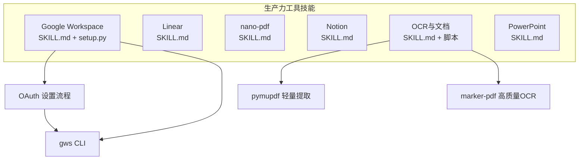
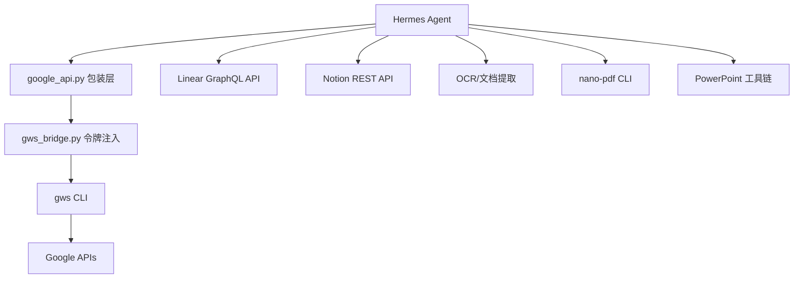
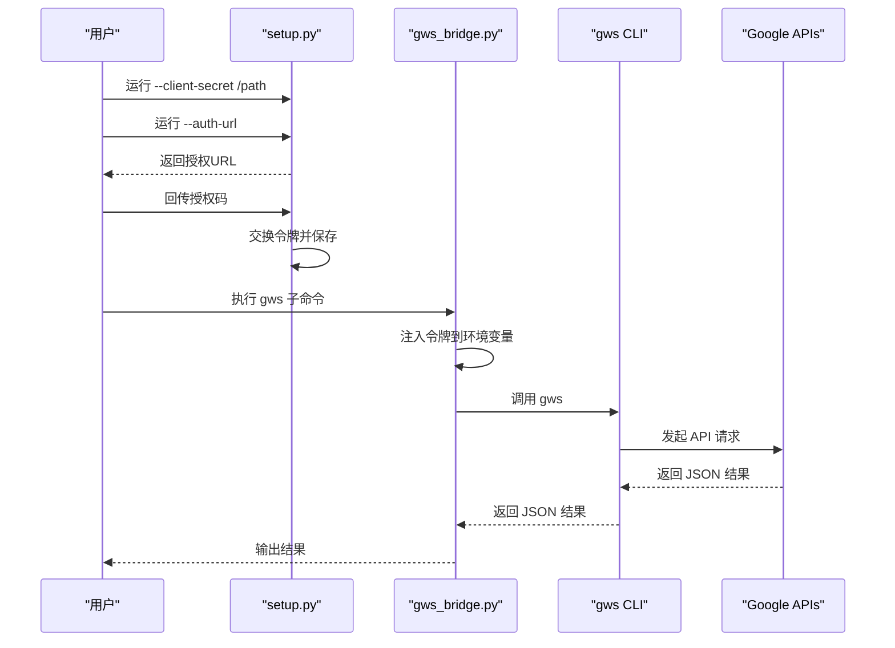
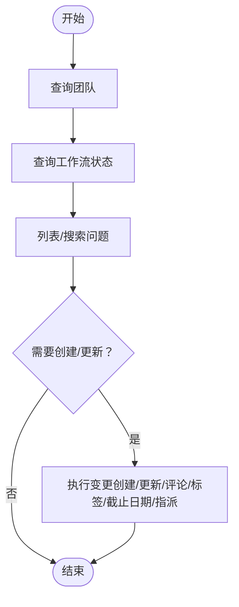
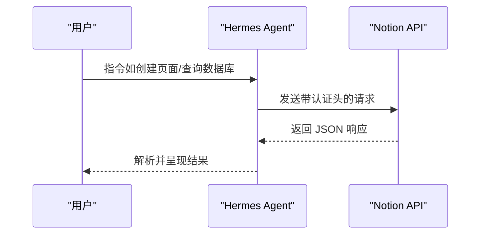
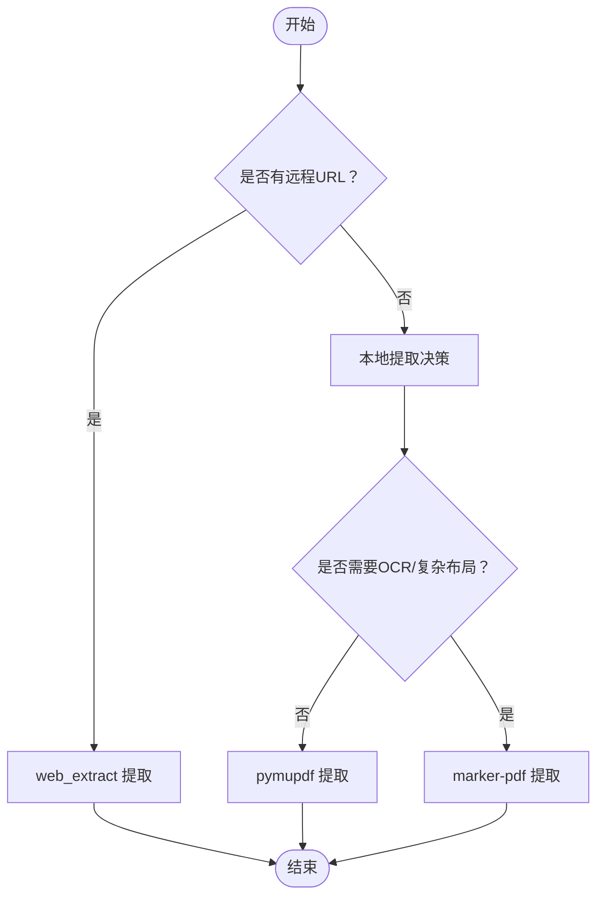
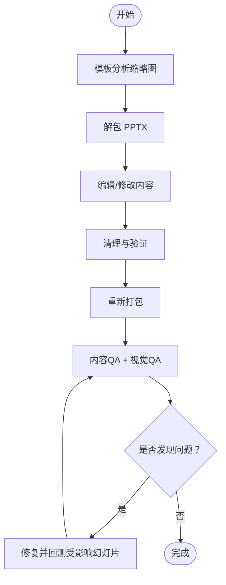
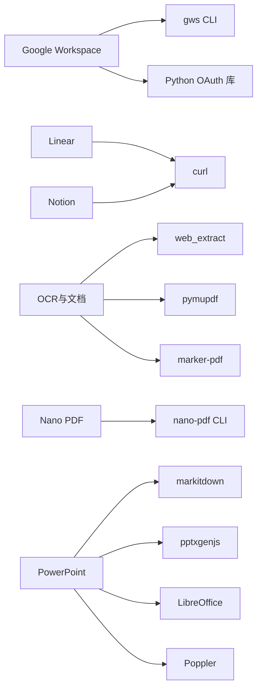

# 生产力工具技能

<cite>
**本文引用的文件**
- [SKILL.md（Google Workspace）](file://skills/productivity/google-workspace/SKILL.md)
- [setup.py（Google Workspace）](file://skills/productivity/google-workspace/scripts/setup.py)
- [SKILL.md（Linear）](file://skills/productivity/linear/SKILL.md)
- [SKILL.md（nano-pdf）](file://skills/productivity/nano-pdf/SKILL.md)
- [SKILL.md（Notion）](file://skills/productivity/notion/SKILL.md)
- [SKILL.md（OCR与文档）](file://skills/productivity/ocr-and-documents/SKILL.md)
- [extract_pymupdf.py（OCR与文档）](file://skills/productivity/ocr-and-documents/scripts/extract_pymupdf.py)
- [extract_marker.py（OCR与文档）](file://skills/productivity/ocr-and-documents/scripts/extract_marker.py)
- [SKILL.md（PowerPoint）](file://skills/productivity/powerpoint/SKILL.md)
</cite>

## 目录
1. [简介](#简介)
2. [项目结构](#项目结构)
3. [核心组件](#核心组件)
4. [架构总览](#架构总览)
5. [详细组件分析](#详细组件分析)
6. [依赖关系分析](#依赖关系分析)
7. [性能考量](#性能考量)
8. [故障排查指南](#故障排查指南)
9. [结论](#结论)
10. [附录](#附录)

## 简介
本文件系统性梳理 Hermes Agent 中的生产力工具技能，覆盖以下能力：
- Google Workspace：Gmail/日历/驱动/联系人/表格/文档的命令行集成与自动化
- Linear：基于 GraphQL 的问题与项目管理
- Nano PDF：自然语言编辑 PDF 文本
- Notion：通过 API 管理页面、数据库与块
- OCR 文档处理：远程提取与本地轻量/高质量 OCR 提取
- PowerPoint：读取、解析、编辑与生成演示文稿

文档聚焦各工具的 API 集成方式、数据同步与自动化工作流，给出典型应用场景（文档处理、项目管理、会议记录、报告生成）与效率提升案例，并提供配置、集成与使用技巧。

## 项目结构
生产力工具技能位于 skills/productivity 下，每个工具一个子目录，包含技能说明与可选脚本：
- google-workspace：包含技能说明与 OAuth 设置脚本
- linear：包含技能说明与 GraphQL 使用示例
- nano-pdf：包含技能说明与使用建议
- notion：包含技能说明与 API 基础用法
- ocr-and-documents：包含技能说明与本地提取脚本
- powerpoint：包含技能说明与设计与质量保障建议

**图表来源**
- [SKILL.md（Google Workspace）:23-32](file://skills/productivity/google-workspace/SKILL.md#L23-L32)
- [setup.py（Google Workspace）:244-337](file://skills/productivity/google-workspace/scripts/setup.py#L244-L337)
- [SKILL.md（OCR与文档）:58-110](file://skills/productivity/ocr-and-documents/SKILL.md#L58-L110)

**章节来源**
- [SKILL.md（Google Workspace）:1-249](file://skills/productivity/google-workspace/SKILL.md#L1-L249)
- [SKILL.md（Linear）:1-298](file://skills/productivity/linear/SKILL.md#L1-L298)
- [SKILL.md（nano-pdf）:1-52](file://skills/productivity/nano-pdf/SKILL.md#L1-L52)
- [SKILL.md（Notion）:1-172](file://skills/productivity/notion/SKILL.md#L1-L172)
- [SKILL.md（OCR与文档）:1-172](file://skills/productivity/ocr-and-documents/SKILL.md#L1-L172)
- [SKILL.md（PowerPoint）:1-233](file://skills/productivity/powerpoint/SKILL.md#L1-L233)

## 核心组件
- Google Workspace 技能：通过 gws CLI 与 OAuth2 自动刷新令牌，提供 Gmail/日历/驱动/联系人/表格/文档的统一命令行接口
- Linear 技能：GraphQL API 操作，支持查询与变更（创建/更新问题、状态流转、评论、标签、项目）
- Notion 技能：基于 curl 的 REST API，支持搜索、创建、更新页面与数据库、查询数据源
- OCR 与文档技能：远程优先（web_extract），本地提供轻量（pymupdf）与高质量（marker-pdf）两种提取方案
- Nano PDF 技能：以自然语言指令修改 PDF 文本内容
- PowerPoint 技能：读取/解析/编辑/生成演示文稿，强调设计与质量保障流程

**章节来源**
- [SKILL.md（Google Workspace）:19-33](file://skills/productivity/google-workspace/SKILL.md#L19-L33)
- [SKILL.md（Linear）:15-37](file://skills/productivity/linear/SKILL.md#L15-L37)
- [SKILL.md（Notion）:15-41](file://skills/productivity/notion/SKILL.md#L15-L41)
- [SKILL.md（OCR与文档）:13-51](file://skills/productivity/ocr-and-documents/SKILL.md#L13-L51)
- [SKILL.md（nano-pdf）:13-15](file://skills/productivity/nano-pdf/SKILL.md#L13-L15)
- [SKILL.md（PowerPoint）:7-16](file://skills/productivity/powerpoint/SKILL.md#L7-L16)

## 架构总览
Google Workspace 技能采用三层架构：Python 包装层负责 OAuth 与参数兼容，桥接脚本负责令牌刷新注入，最终调用官方 gws CLI 访问 Google API；其他技能多为直接调用第三方 API 或本地 CLI 工具。

**图表来源**
- [SKILL.md（Google Workspace）:23-32](file://skills/productivity/google-workspace/SKILL.md#L23-L32)
- [setup.py（Google Workspace）:121-167](file://skills/productivity/google-workspace/scripts/setup.py#L121-L167)

## 详细组件分析

### Google Workspace 技能
- 架构与职责
  - 包装层：保持与 v1 CLI 接口一致，委托给 gws
  - 桥接层：在调用 gws 前注入环境变量中的令牌，实现自动刷新
  - OAuth 设置：提供非交互式设置流程，支持部分授权与范围检查
- 关键流程
  - 安装 gws 后，运行设置脚本完成客户端凭据与授权码交换，保存令牌
  - 使用包装脚本执行 Gmail/日历/驱动/联系人/表格/文档操作
- 输出格式
  - 统一 JSON 输出，便于解析与后续处理
- 规则与限制
  - 强制用户确认后才发送邮件或创建/删除事件
  - 日历时间需包含时区信息
  - 遵守速率限制，避免连续快速调用

**图表来源**
- [SKILL.md（Google Workspace）:23-32](file://skills/productivity/google-workspace/SKILL.md#L23-L32)
- [setup.py（Google Workspace）:244-337](file://skills/productivity/google-workspace/scripts/setup.py#L244-L337)

**章节来源**
- [SKILL.md（Google Workspace）:19-134](file://skills/productivity/google-workspace/SKILL.md#L19-L134)
- [setup.py（Google Workspace）:1-398](file://skills/productivity/google-workspace/scripts/setup.py#L1-L398)

### Linear 技能
- API 基础
  - 端点：GraphQL POST 到 https://api.linear.app/graphql
  - 认证：Authorization 头部使用 API Key（无 Bearer 前缀）
  - 请求体：JSON，Content-Type: application/json
- 典型工作流
  - 查询团队与工作流状态 → 列表/搜索问题 → 创建/更新问题 → 添加评论/标签 → 设置截止日期/指派 → 标记完成
- 分页与过滤
  - Relay 风格游标分页，first 限制结果数量
  - 支持多种比较器与组合逻辑
- 速率限制
  - 每小时请求数与复杂度点限制，应合理使用 first 并监控剩余配额

**图表来源**
- [SKILL.md（Linear）:248-297](file://skills/productivity/linear/SKILL.md#L248-L297)

**章节来源**
- [SKILL.md（Linear）:19-298](file://skills/productivity/linear/SKILL.md#L19-L298)

### Notion 技能
- API 基础
  - 使用 Authorization: Bearer + Notion-Version 头
  - 数据库在该版本中称为“数据源”，区分 database_id 与 data_source_id
- 常见操作
  - 搜索、获取页面与块、在数据库中创建条目、查询数据源、更新页面属性、添加内容块
- 注意事项
  - 需要在 Notion 中与集成共享目标页面/数据库
  - 速率限制约每秒 3 次请求
  - 无法通过 API 设置视图筛选（UI 独占）

**图表来源**
- [SKILL.md（Notion）:29-41](file://skills/productivity/notion/SKILL.md#L29-L41)

**章节来源**
- [SKILL.md（Notion）:19-172](file://skills/productivity/notion/SKILL.md#L19-L172)

### OCR 与文档技能
- 远程优先策略
  - 若文档有 URL，优先使用 web_extract（无需本地依赖）
  - 仅在本地文件、失败或批量处理时使用本地提取
- 本地提取方案
  - 轻量方案（pymupdf）：安装小、速度快、适合文本 PDF，不支持 OCR
  - 高质量方案（marker-pdf）：支持 OCR、公式、表格、表单、布局分析，首次安装需 ~5GB 空间
- 辅助脚本
  - extract_pymupdf.py：文本/Markdown/表格/图片/元数据/指定页提取
  - extract_marker.py：Markdown/JSON 输出、图像导出、LLM 增强准确性、磁盘空间检查

**图表来源**
- [SKILL.md（OCR与文档）:19-51](file://skills/productivity/ocr-and-documents/SKILL.md#L19-L51)
- [extract_pymupdf.py（OCR与文档）:1-99](file://skills/productivity/ocr-and-documents/scripts/extract_pymupdf.py#L1-L99)
- [extract_marker.py（OCR与文档）:1-88](file://skills/productivity/ocr-and-documents/scripts/extract_marker.py#L1-L88)

**章节来源**
- [SKILL.md（OCR与文档）:13-172](file://skills/productivity/ocr-and-documents/SKILL.md#L13-L172)
- [extract_pymupdf.py（OCR与文档）:1-99](file://skills/productivity/ocr-and-documents/scripts/extract_pymupdf.py#L1-L99)
- [extract_marker.py（OCR与文档）:1-88](file://skills/productivity/ocr-and-documents/scripts/extract_marker.py#L1-L88)

### Nano PDF 技能
- 功能概述
  - 使用自然语言指令对 PDF 指定页面进行文本修改（如标题、日期、内容）
- 使用要点
  - 页面编号可能因版本而异，若命中错误页面可±1 再试
  - 修改后务必校验输出 PDF
  - 工具内置 LLM，需配置相应 API Key
  - 更复杂的版式修改可能需要其他工具

**章节来源**
- [SKILL.md（nano-pdf）:13-52](file://skills/productivity/nano-pdf/SKILL.md#L13-L52)

### PowerPoint 技能
- 快速参考
  - 内容读取：使用 markitdown 提取文本
  - 编辑与创建：按模板分析、解包/修改/打包流程
  - 设计与排版：提供配色、字体、间距与常见误区建议
- 质量保障
  - 内容与视觉双重 QA，建议使用子代理进行“新鲜视角”检查
  - 可将幻灯片转图像进行人工审阅
- 依赖
  - 文本提取：pip 安装 markitdown[pptx]
  - 缩略图网格：Pillow
  - 从零创建：npm 安装 pptxgenjs
  - 转换与渲染：LibreOffice、Poppler

**图表来源**
- [SKILL.md（PowerPoint）:34-204](file://skills/productivity/powerpoint/SKILL.md#L34-L204)

**章节来源**
- [SKILL.md（PowerPoint）:7-233](file://skills/productivity/powerpoint/SKILL.md#L7-L233)

## 依赖关系分析
- Google Workspace
  - 依赖：gws CLI（官方 Rust CLI）、Python OAuth 库
  - 令牌管理：本地 JSON 文件存储，桥接脚本注入环境变量
- Linear
  - 依赖：curl（无额外 Python 依赖）
  - 认证：API Key（环境变量）
- Notion
  - 依赖：curl（无额外 Python 依赖）
  - 认证：API Key（环境变量）
- OCR 与文档
  - 远程：web_extract（无本地依赖）
  - 本地：pymupdf（轻量）、marker-pdf（高质量，首次安装需大空间）
- Nano PDF
  - 依赖：CLI 工具（需 LLM API Key）
- PowerPoint
  - 依赖：Python 包与 npm 工具链（markitdown、pptxgenjs、LibreOffice、Poppler）

**图表来源**
- [SKILL.md（Google Workspace）:44-54](file://skills/productivity/google-workspace/SKILL.md#L44-L54)
- [SKILL.md（Linear）:7-9](file://skills/productivity/linear/SKILL.md#L7-L9)
- [SKILL.md（Notion）:11-12](file://skills/productivity/notion/SKILL.md#L11-L12)
- [SKILL.md（OCR与文档）:15-17](file://skills/productivity/ocr-and-documents/SKILL.md#L15-L17)
- [SKILL.md（PowerPoint）:226-233](file://skills/productivity/powerpoint/SKILL.md#L226-L233)

**章节来源**
- [SKILL.md（Google Workspace）:44-54](file://skills/productivity/google-workspace/SKILL.md#L44-L54)
- [SKILL.md（Linear）:7-9](file://skills/productivity/linear/SKILL.md#L7-L9)
- [SKILL.md（Notion）:11-12](file://skills/productivity/notion/SKILL.md#L11-L12)
- [SKILL.md（OCR与文档）:15-17](file://skills/productivity/ocr-and-documents/SKILL.md#L15-L17)
- [SKILL.md（PowerPoint）:226-233](file://skills/productivity/powerpoint/SKILL.md#L226-L233)

## 性能考量
- Google Workspace
  - 令牌刷新与 gws CLI 调用开销低；注意避免连续快速调用，遵守速率限制
- Linear
  - 合理使用 first 限制结果数量，减少复杂度成本；关注剩余请求配额
- Notion
  - 速率限制约每秒 3 次请求；批量操作时注意节流
- OCR 与文档
  - pymupdf 适合大多数文本 PDF，速度极快；marker-pdf 首次安装模型需耐心等待
  - 大文件/大批量建议使用命令行批处理与并行（在满足资源前提下）
- PowerPoint
  - 渲染与转换为图像会消耗 CPU/内存；建议按需渲染特定页数

[本节为通用指导，无需列出具体文件来源]

## 故障排查指南
- Google Workspace
  - 未认证：运行设置流程（客户端密钥、授权 URL、授权码交换、检查）
  - 刷新失败：令牌被撤销，需重新授权
  - gws 命令未找到：安装 gws CLI
  - 权限不足：启用对应 API 并授予所需作用域
  - 高级保护：需管理员允许 OAuth 客户端
- Linear
  - 401/403：检查 API Key 是否正确设置
  - GraphQL 错误：检查响应中的 errors 数组
  - 速率限制：降低请求频率或增加 first 限制
- Notion
  - 401：检查 API Key 与 Notion 版本头
  - 403：确保集成已分享目标页面/数据库
  - 速率限制：控制请求节奏
- OCR 与文档
  - web_extract 失败：尝试本地提取或提供 URL
  - marker-pdf 空间不足：释放磁盘空间或改用 pymupdf
- Nano PDF
  - 页面编号偏差：±1 再试
  - 输出异常：检查 LLM API Key 与提示词
- PowerPoint
  - 渲染失败：检查 LibreOffice/Poppler 是否可用
  - 视觉问题：使用图像化检查与子代理复核

**章节来源**
- [SKILL.md（Google Workspace）:233-249](file://skills/productivity/google-workspace/SKILL.md#L233-L249)
- [SKILL.md（Linear）:284-297](file://skills/productivity/linear/SKILL.md#L284-L297)
- [SKILL.md（Notion）:164-172](file://skills/productivity/notion/SKILL.md#L164-L172)
- [SKILL.md（OCR与文档）:163-172](file://skills/productivity/ocr-and-documents/SKILL.md#L163-L172)
- [SKILL.md（nano-pdf）:46-52](file://skills/productivity/nano-pdf/SKILL.md#L46-L52)
- [SKILL.md（PowerPoint）:141-204](file://skills/productivity/powerpoint/SKILL.md#L141-L204)

## 结论
上述技能将多个生产力工具以统一的命令行与脚本方式接入 Hermes Agent，形成“远程优先 + 本地增强”的文档与项目管理能力矩阵。通过 OAuth/API Key 认证、CLI 工具与脚本化流程，显著提升任务自动化、文档管理与团队协作效率。建议结合实际场景选择合适工具与提取策略，并遵循各工具的速率限制与质量保障流程。

[本节为总结性内容，无需列出具体文件来源]

## 附录
- 配置清单
  - Google Workspace：安装 gws CLI，准备客户端密钥，完成 OAuth 授权，保存令牌
  - Linear：获取 API Key，设置环境变量
  - Notion：创建集成，复制 API Key，共享目标页面/数据库
  - OCR 与文档：根据需求安装 pymupdf 或 marker-pdf
  - Nano PDF：安装 CLI 并配置 LLM API Key
  - PowerPoint：安装 Python 包与 npm 工具链，准备 LibreOffice/Poppler
- 使用技巧
  - 文档处理：优先远程提取；本地提取优先考虑 pymupdf；需要 OCR/复杂布局再用 marker-pdf
  - 项目管理：先查团队与状态，再列表/搜索，最后创建/更新与评论
  - 会议与报告：利用 Google Calendar 与 Notion/PowerPoint 协作，配合 OCR 提取会议纪要与附件
  - 质量保障：PowerPoint 建议双轨 QA（内容+视觉），必要时子代理参与

[本节为通用指导，无需列出具体文件来源]