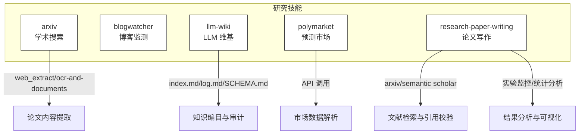
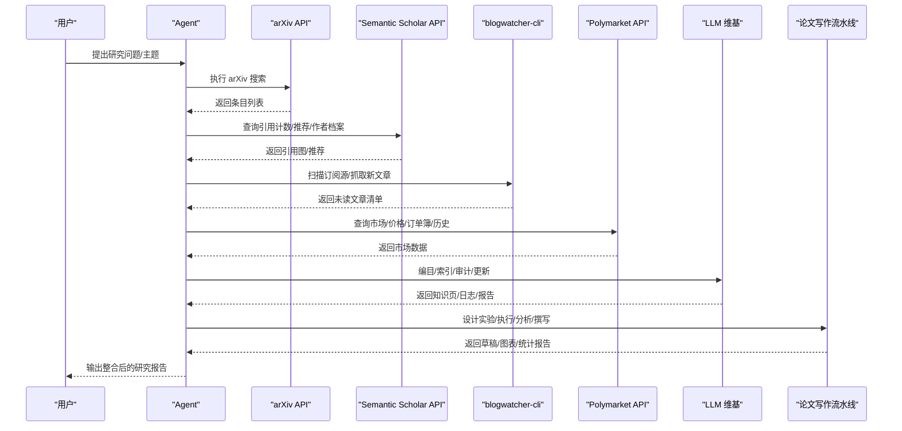
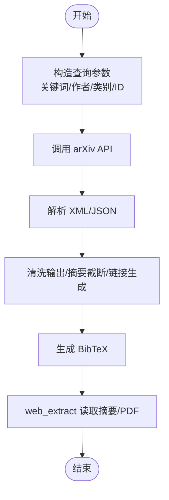
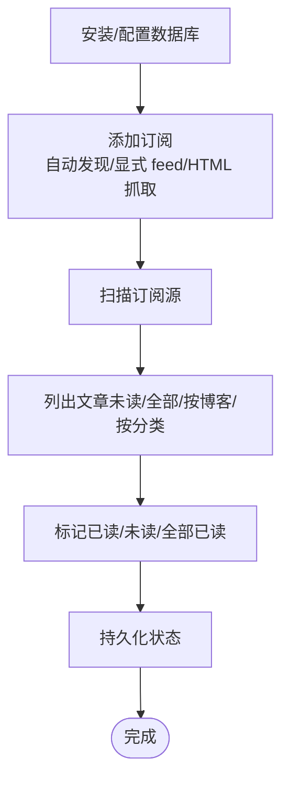
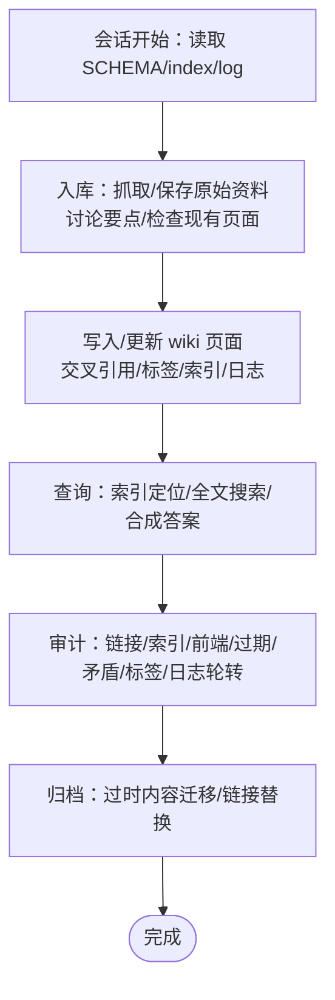
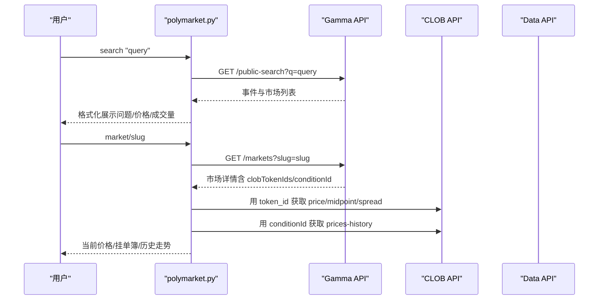
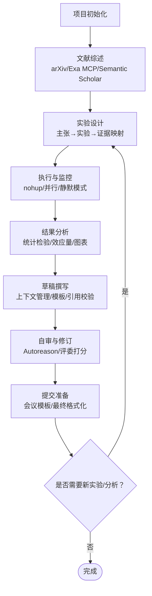
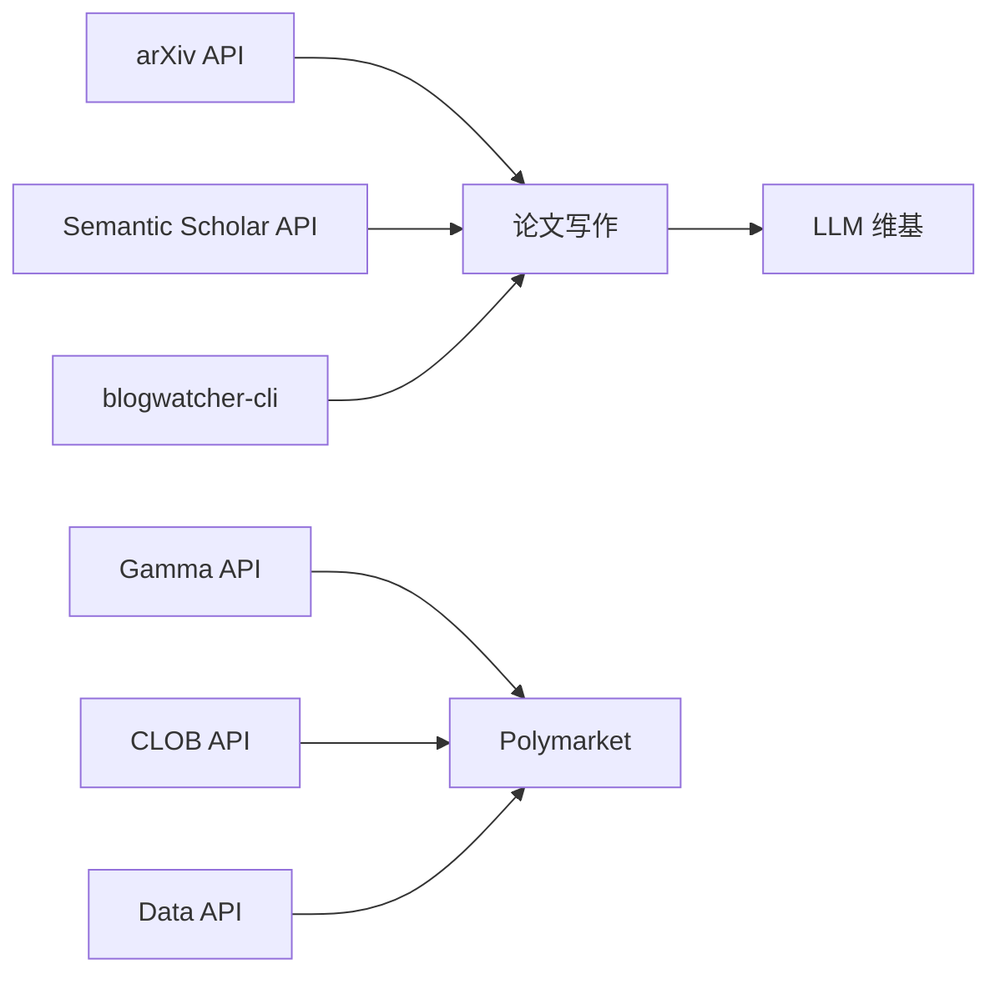

# 研究技能

<cite>
**本文档引用的文件**
- [README.md](file://README.md)
- [DESCRIPTION.md](file://skills/research/DESCRIPTION.md)
- [arxiv/SKILL.md](file://skills/research/arxiv/SKILL.md)
- [arxiv/scripts/search_arxiv.py](file://skills/research/arxiv/scripts/search_arxiv.py)
- [blogwatcher/SKILL.md](file://skills/research/blogwatcher/SKILL.md)
- [llm-wiki/SKILL.md](file://skills/research/llm-wiki/SKILL.md)
- [polymarket/SKILL.md](file://skills/research/polymarket/SKILL.md)
- [polymarket/scripts/polymarket.py](file://skills/research/polymarket/scripts/polymarket.py)
- [polymarket/references/api-endpoints.md](file://skills/research/polymarket/references/api-endpoints.md)
- [research-paper-writing/SKILL.md](file://skills/research/research-paper-writing/SKILL.md)
- [research-paper-writing/references/citation-workflow.md](file://skills/research/research-paper-writing/references/citation-workflow.md)
- [research-paper-writing/references/experiment-patterns.md](file://skills/research/research-paper-writing/references/experiment-patterns.md)
</cite>

## 目录
1. [简介](#简介)
2. [项目结构](#项目结构)
3. [核心组件](#核心组件)
4. [架构总览](#架构总览)
5. [详细组件分析](#详细组件分析)
6. [依赖关系分析](#依赖关系分析)
7. [性能考量](#性能考量)
8. [故障排查指南](#故障排查指南)
9. [结论](#结论)
10. [附录](#附录)

## 简介
本文件系统化梳理 Hermes Agent 的研究技能体系，聚焦以下研究能力与工作流：
- 学术资源检索：基于 arXiv 的结构化搜索、语义学者（Semantic Scholar）引用图与推荐、BibTeX 自动生成与校验
- 内容监测：RSS/Atom 订阅与文章抓取、分类过滤、未读追踪
- 知识构建：基于 Karpathy LLM Wiki 模式构建可链接的 Markdown 知识库，支持编目、索引、审计与持续维护
- 预测市场数据：Polymarket 公共 API 的市场查询、价格、挂单簿与历史走势
- 论文写作：从实验设计到分析、撰写、自审与修订的端到端流水线，覆盖 NeurIPS、ICML、ICLR、ACL、AAAI、COLM 等会议模板与规范

目标是帮助研究者以自动化方式完成“发现—评估—阅读—整理—分析—写作”的闭环，提升研究效率与质量。

## 项目结构
研究技能位于 skills/research 目录下，每个子技能独立封装为一个技能包，包含：
- 技能说明文档（SKILL.md）
- 可选脚本（scripts/*.py）
- 参考资料（references/*）

图表来源
- [arxiv/SKILL.md:1-282](file://skills/research/arxiv/SKILL.md#L1-L282)
- [blogwatcher/SKILL.md:1-137](file://skills/research/blogwatcher/SKILL.md#L1-L137)
- [llm-wiki/SKILL.md:1-461](file://skills/research/llm-wiki/SKILL.md#L1-L461)
- [polymarket/SKILL.md:1-77](file://skills/research/polymarket/SKILL.md#L1-L77)
- [research-paper-writing/SKILL.md:1-800](file://skills/research/research-paper-writing/SKILL.md#L1-L800)

章节来源
- [README.md:1-179](file://README.md#L1-L179)
- [DESCRIPTION.md:1-4](file://skills/research/DESCRIPTION.md#L1-L4)

## 核心组件
- arXiv 学术搜索：提供关键词、作者、类别、ID 的多维度检索，支持 XML 解析与 BibTeX 生成，并可结合网页提取工具读取摘要或 PDF 内容。
- 博客监测：通过 blogwatcher-cli 管理订阅源、自动扫描、HTML 回退抓取、OPML 导入与分类过滤，统一未读管理。
- LLM 维基：以三层结构（原始资料、实体/概念/对比/查询页面、Schema）组织知识，强调一致性、交叉引用与审计。
- Polymarket 预测市场：通过 Gamma/CLOB/Data 三个公共 API 获取市场、订单簿、成交与历史价格，支持趋势与流动性分析。
- 论文写作流水线：覆盖项目初始化、文献综述、实验设计、执行与监控、结果分析、草稿撰写、自审修订与提交准备，配套模板与引用校验流程。

章节来源
- [arxiv/SKILL.md:1-282](file://skills/research/arxiv/SKILL.md#L1-L282)
- [blogwatcher/SKILL.md:1-137](file://skills/research/blogwatcher/SKILL.md#L1-L137)
- [llm-wiki/SKILL.md:1-461](file://skills/research/llm-wiki/SKILL.md#L1-L461)
- [polymarket/SKILL.md:1-77](file://skills/research/polymarket/SKILL.md#L1-L77)
- [research-paper-writing/SKILL.md:1-800](file://skills/research/research-paper-writing/SKILL.md#L1-L800)

## 架构总览
研究技能在 Hermes Agent 的技能系统中协同工作，形成“发现—评估—阅读—整理—分析—写作”的闭环。

图表来源
- [arxiv/SKILL.md:191-241](file://skills/research/arxiv/SKILL.md#L191-L241)
- [blogwatcher/SKILL.md:54-137](file://skills/research/blogwatcher/SKILL.md#L54-L137)
- [polymarket/SKILL.md:34-77](file://skills/research/polymarket/SKILL.md#L34-L77)
- [llm-wiki/SKILL.md:236-461](file://skills/research/llm-wiki/SKILL.md#L236-L461)
- [research-paper-writing/SKILL.md:25-800](file://skills/research/research-paper-writing/SKILL.md#L25-L800)

## 详细组件分析

### arXiv 学术搜索
- 功能要点
  - 支持按 all/ti/au/abs/cat/co 前缀与布尔运算（AND/OR/ANDNOT/短语）组合检索
  - 排序与分页参数（sortBy、sortOrder、start、max_results）
  - 通过 id_list 获取特定论文
  - XML 解析与 BibTeX 生成
  - 结合 web_extract 或 OCR 工具读取摘要与 PDF 内容
- 数据来源与处理
  - 使用 export.arxiv.org API；arXiv ID 支持版本后缀与最新版本解析
  - 引用数据与推荐由 Semantic Scholar 补充
- 实用示例
  - 基础搜索、清洗输出、按日期排序、按 ID 获取、BibTeX 生成、摘要/全文提取
- 脚本与命令
  - 命令行脚本 search_arxiv.py 支持多种查询参数与排序选项

图表来源
- [arxiv/SKILL.md:26-188](file://skills/research/arxiv/SKILL.md#L26-L188)
- [arxiv/scripts/search_arxiv.py:20-80](file://skills/research/arxiv/scripts/search_arxiv.py#L20-L80)

章节来源
- [arxiv/SKILL.md:26-188](file://skills/research/arxiv/SKILL.md#L26-L188)
- [arxiv/scripts/search_arxiv.py:1-115](file://skills/research/arxiv/scripts/search_arxiv.py#L1-L115)

### 博客监测（Blogwatcher）
- 功能要点
  - 自动发现 RSS/Atom 源，失败时回退 HTML 抓取
  - OPML 导入批量订阅
  - 分类过滤、未读标记、全量/增量扫描
  - Docker 持久化数据库配置
- 使用流程
  - 安装与持久化配置
  - 添加/移除订阅、导入 OPML
  - 扫描并列出未读文章
  - 标记已读/全部已读
- 注意事项
  - 默认数据库路径与环境变量覆盖
  - 分类字段来自 RSS/Atom，可用于后续筛选

图表来源
- [blogwatcher/SKILL.md:19-137](file://skills/research/blogwatcher/SKILL.md#L19-L137)

章节来源
- [blogwatcher/SKILL.md:1-137](file://skills/research/blogwatcher/SKILL.md#L1-L137)

### LLM 维基（Karpathy 模式）
- 架构与分层
  - Layer 1：原始资料（articles/papers/transcripts/assets）
  - Layer 2：实体/概念/对比/查询页面（Markdown）
  - Layer 3：Schema（约定、标签体系、页面阈值）
- 核心操作
  - 初始化：创建目录结构、编写 SCHEMA.md/index.md/log.md
  - 入库：抓取/保存原始资料，讨论要点，检查现有页面，写入/更新 wiki，更新索引与日志
  - 查询：基于 index.md 与全文搜索，合成答案并归档有价值的问答
  - 审计：链接完整性、索引一致性、前端校验、过期内容、矛盾点、页面规模、标签审计、日志轮转
- 规范与最佳实践
  - 每个页面至少两条外部链接
  - 标签必须来自 Schema 的分类体系
  - 更新时更新 updated 字段，遵循页面阈值与拆分规则
  - 与 Obsidian 集成，支持 Graph View 与 Dataview 查询

图表来源
- [llm-wiki/SKILL.md:58-461](file://skills/research/llm-wiki/SKILL.md#L58-L461)

章节来源
- [llm-wiki/SKILL.md:1-461](file://skills/research/llm-wiki/SKILL.md#L1-L461)

### Polymarket 预测市场
- 数据接口
  - Gamma API：发现、搜索、浏览事件与市场
  - CLOB API：实时价格、挂单簿、中间价、价差、历史价格
  - Data API：最近交易、未平仓头寸
- 关键字段与解析
  - outcomePrices/outcomes/clobTokenIds 为双编码 JSON 字符串，需二次解析
  - 价格即概率，0.65 表示 65%
  - conditionId 用于历史价格查询
- 典型工作流
  - 搜索事件/市场 → 解析嵌套结构 → 展示问题、当前价格（百分比）、成交量
  - 深挖：使用 clobTokenIds 获取订单簿，使用 conditionId 获取历史走势
- 脚本与命令
  - polymarket.py 提供 search/trending/market/event/price/book/history/trades 等命令

图表来源
- [polymarket/SKILL.md:34-77](file://skills/research/polymarket/SKILL.md#L34-L77)
- [polymarket/scripts/polymarket.py:96-232](file://skills/research/polymarket/scripts/polymarket.py#L96-L232)
- [polymarket/references/api-endpoints.md:1-221](file://skills/research/polymarket/references/api-endpoints.md#L1-L221)

章节来源
- [polymarket/SKILL.md:1-77](file://skills/research/polymarket/SKILL.md#L1-L77)
- [polymarket/scripts/polymarket.py:1-285](file://skills/research/polymarket/scripts/polymarket.py#L1-L285)
- [polymarket/references/api-endpoints.md:1-221](file://skills/research/polymarket/references/api-endpoints.md#L1-L221)

### 论文写作流水线
- 生命周期与阶段
  - 项目初始化、文献综述、实验设计、执行与监控、结果分析、草稿撰写、自审与修订、提交准备
  - 迭代循环：结果触发新实验，评审触发新分析
- 文献检索与引用校验
  - 使用 arXiv/Exa MCP/Semantic Scholar 检索与验证
  - 强制 5 步引用验证流程：搜索→验证存在→获取 BibTeX→验证声明→加入 .bib
  - BibTeX 管理与 LaTeX 引用命令
- 实验设计与执行
  - 映射“主张→实验→证据”，设计强基线、消融、计算匹配比较
  - 实验脚本设计原则：增量保存、保留中间产物、分离关注点、配置管理
  - 人类评价设计：维度定义、指南与示例、盲评面板、一致性度量
- 结果分析与可视化
  - 统计显著性检验、置信区间、效应量
  - 图表规范：SciencePlots/matplotlib、颜色无障碍配色、矢量输出
- 自审与迭代
  - Autoreason 方法论：批评、作者修订、合成、评委打分、收敛判断
  - 失败模式与修复策略

图表来源
- [research-paper-writing/SKILL.md:25-800](file://skills/research/research-paper-writing/SKILL.md#L25-L800)
- [research-paper-writing/references/citation-workflow.md:71-381](file://skills/research/research-paper-writing/references/citation-workflow.md#L71-L381)
- [research-paper-writing/references/experiment-patterns.md:7-729](file://skills/research/research-paper-writing/references/experiment-patterns.md#L7-L729)

章节来源
- [research-paper-writing/SKILL.md:1-800](file://skills/research/research-paper-writing/SKILL.md#L1-L800)
- [research-paper-writing/references/citation-workflow.md:1-565](file://skills/research/research-paper-writing/references/citation-workflow.md#L1-L565)
- [research-paper-writing/references/experiment-patterns.md:1-729](file://skills/research/research-paper-writing/references/experiment-patterns.md#L1-L729)

## 依赖关系分析
- 技能内聚与耦合
  - arXiv 与 Semantic Scholar 在论文写作中互补：前者检索元数据，后者提供引用图与推荐
  - Polymarket 与研究主题结合：用于技术/政策事件的概率估计与趋势跟踪
  - LLM 维基作为知识中枢，被多个技能复用（文献综述、实验记录、结果整理）
- 外部依赖
  - arXiv API（免费、无密钥）
  - Semantic Scholar API（免费额度，JSON）
  - Polymarket 公共 API（Gamma/CLOB/Data，无需认证）
  - 工具链：web_extract、OCR、LaTeX、matplotlib/SciencePlots、统计库

图表来源
- [arxiv/SKILL.md:191-241](file://skills/research/arxiv/SKILL.md#L191-L241)
- [polymarket/SKILL.md:34-77](file://skills/research/polymarket/SKILL.md#L34-L77)
- [research-paper-writing/SKILL.md:231-353](file://skills/research/research-paper-writing/SKILL.md#L231-L353)
- [llm-wiki/SKILL.md:236-330](file://skills/research/llm-wiki/SKILL.md#L236-L330)

章节来源
- [arxiv/SKILL.md:191-241](file://skills/research/arxiv/SKILL.md#L191-L241)
- [polymarket/SKILL.md:34-77](file://skills/research/polymarket/SKILL.md#L34-L77)
- [research-paper-writing/SKILL.md:231-353](file://skills/research/research-paper-writing/SKILL.md#L231-L353)
- [llm-wiki/SKILL.md:236-330](file://skills/research/llm-wiki/SKILL.md#L236-L330)

## 性能考量
- API 速率限制
  - arXiv：约每 3 秒一次请求
  - Semantic Scholar：免费 1 RPS，有密钥可达更高频率
  - Polymarket：Gamma/CLOB/Data 各自限流，整体较为宽松
- 并发与批处理
  - 批量入库时先一次性搜索/检查现有页面，再统一更新，避免重复 IO
  - 实验执行采用 nohup 并行运行，注意 API 限速与资源竞争
- 上下文窗口管理
  - 论文写作中按章节加载上下文，避免将所有实验文件一次性载入
- 可视化与输出
  - 图表统一使用矢量 PDF 输出，确保打印与缩放清晰

## 故障排查指南
- arXiv
  - 问题：返回空结果或摘要缺失
  - 处理：确认查询语法、检查摘要字段中的撤稿/更正提示
- Semantic Scholar
  - 问题：请求超时/限流
  - 处理：增加延时、使用密钥、缓存结果
- Polymarket
  - 问题：双编码字段解析错误
  - 处理：使用 json.loads 对 outcomePrices/outcomes/clobTokenIds 二次解析
  - 问题：新市场历史为空
  - 处理：接受数据缺失，继续观察
- LLM 维基
  - 问题：孤立页面/断链
  - 处理：执行链接审计，补充交叉引用
  - 问题：标签不一致
  - 处理：在 SCHEMA 中新增标签后方可使用
- 论文写作
  - 问题：引用不准确/遗漏
  - 处理：严格走“搜索→验证→获取→核对→加入”流程
  - 问题：实验中断/重跑
  - 处理：增量保存与恢复逻辑，避免重复计算

章节来源
- [arxiv/SKILL.md:253-282](file://skills/research/arxiv/SKILL.md#L253-L282)
- [polymarket/SKILL.md:58-77](file://skills/research/polymarket/SKILL.md#L58-L77)
- [polymarket/scripts/polymarket.py:40-90](file://skills/research/polymarket/scripts/polymarket.py#L40-L90)
- [llm-wiki/SKILL.md:290-330](file://skills/research/llm-wiki/SKILL.md#L290-L330)
- [research-paper-writing/references/citation-workflow.md:511-547](file://skills/research/research-paper-writing/references/citation-workflow.md#L511-L547)
- [research-paper-writing/references/experiment-patterns.md:473-514](file://skills/research/research-paper-writing/references/experiment-patterns.md#L473-L514)

## 结论
Hermes Agent 的研究技能通过标准化的数据接口与工作流，将“发现—评估—阅读—整理—分析—写作”串联为可重复、可审计、可迭代的研究过程。借助 arXiv/Semantic Scholar、Polymarket、LLM 维基与论文写作流水线，研究者可以高效地进行文献综述、趋势分析、实验设计与成果产出，同时保证引用质量与写作规范。

## 附录
- 会议模板与引用规范
  - ACL/NeurIPS/ICML/ICLR/AAAI/COLM 等会议模板与 .bst/.sty 文件参见对应模板目录
- 最佳实践清单
  - 引用：永远程序化获取 BibTeX，逐条验证
  - 实验：增量保存、保留中间产物、分离关注点、盲评与一致性度量
  - 维基：先定向后创建、交叉引用、标签约束、定期审计
  - 市场：价格即概率、注意双编码字段、关注流动性与历史缺失