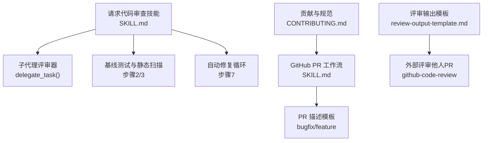
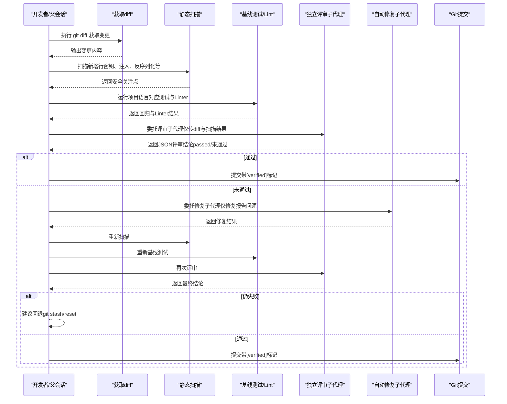
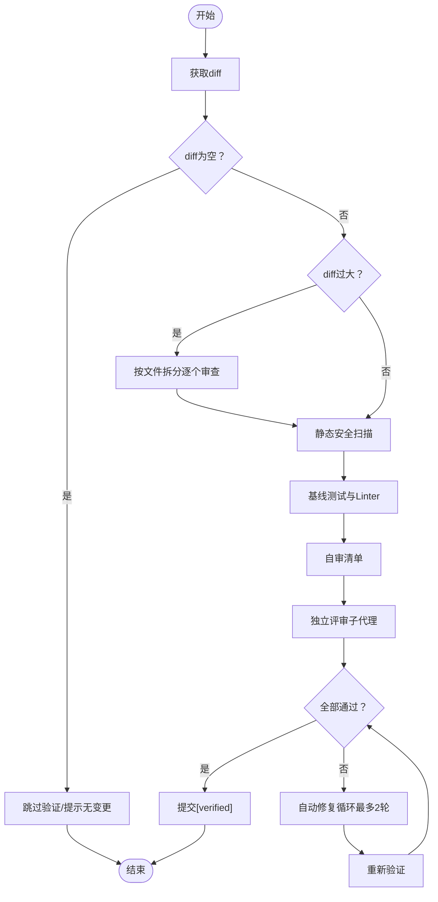
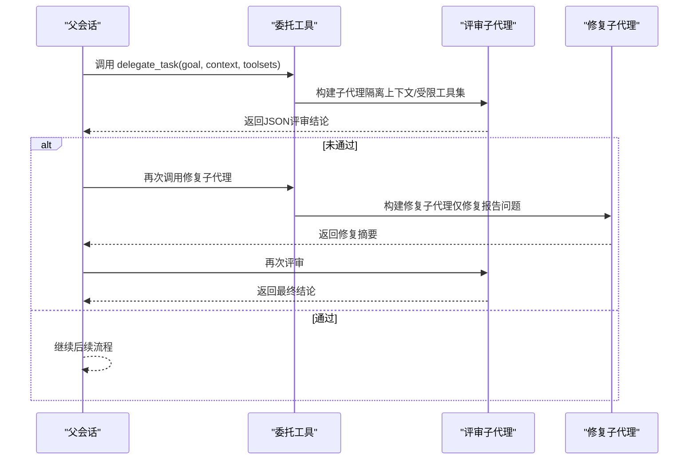
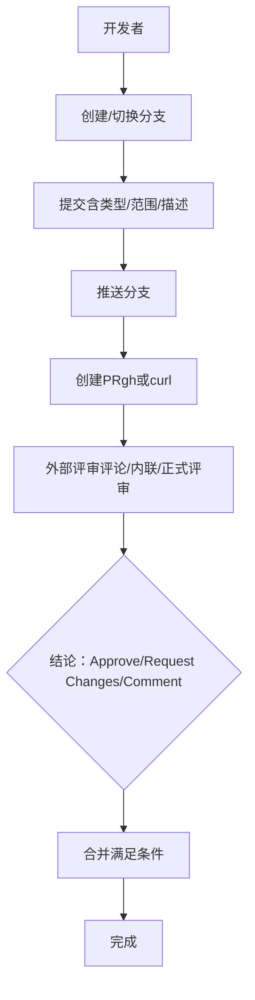
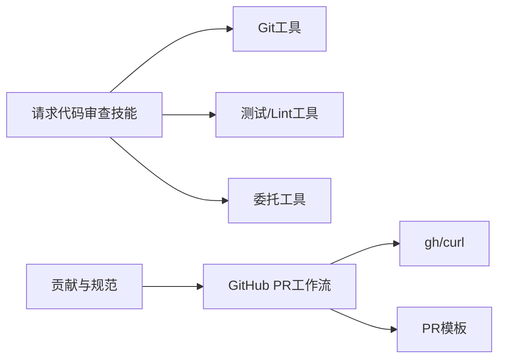

# 代码审查请求

<cite>
**本文引用的文件**
- [SKILL.md（请求代码审查）](file://skills/software-development/requesting-code-review/SKILL.md)
- [SKILL.md（GitHub 代码审查）](file://skills/github/github-code-review/SKILL.md)
- [SKILL.md（GitHub PR 工作流）](file://skills/github/github-pr-workflow/SKILL.md)
- [PR 模板（缺陷修复）](file://skills/github/github-pr-workflow/templates/pr-body-bugfix.md)
- [PR 模板（新功能）](file://skills/github/github-pr-workflow/templates/pr-body-feature.md)
- [PR 模板（通用）](file://.github/PULL_REQUEST_TEMPLATE.md)
- [贡献指南](file://CONTRIBUTING.md)
- [委托工具](file://tools/delegate_tool.py)
- [子代理驱动开发](file://skills/software-development/subagent-driven-development/SKILL.md)
- [审查输出模板](file://skills/github/github-code-review/references/review-output-template.md)
</cite>

## 目录
1. [简介](#简介)
2. [项目结构](#项目结构)
3. [核心组件](#核心组件)
4. [架构总览](#架构总览)
5. [详细组件分析](#详细组件分析)
6. [依赖关系分析](#依赖关系分析)
7. [性能考量](#性能考量)
8. [故障排查指南](#故障排查指南)
9. [结论](#结论)
10. [附录](#附录)

## 简介
本文件面向使用 Hermes Agent 的开发者与团队，系统化阐述“请求代码审查”技能的使用方法与最佳实践。内容覆盖从提交前自检、自动化静态扫描与基线回归检测，到独立子代理评审、自动修复循环与最终提交的完整流程；并结合不同类型的变更场景（新功能、Bug 修复、性能优化、安全加固）给出审查重点与清单。同时提供审查沟通模板、反馈处理方式与团队协作建议，帮助提升代码质量与交付效率。

## 项目结构
与“请求代码审查”直接相关的核心位置如下：
- 技能定义：skills/software-development/requesting-code-review/SKILL.md
- GitHub 集成与 PR 流程：skills/github/github-pr-workflow/SKILL.md 及其模板
- 评审输出格式参考：skills/github/github-code-review/references/review-output-template.md
- 子代理评审与委托：tools/delegate_tool.py 与 skills/software-development/subagent-driven-development/SKILL.md
- 贡献与 PR 规范：CONTRIBUTING.md 与 .github/PULL_REQUEST_TEMPLATE.md

图表来源
- [SKILL.md（请求代码审查）](file://skills/software-development/requesting-code-review/SKILL.md)
- [委托工具](file://tools/delegate_tool.py)
- [SKILL.md（GitHub PR 工作流）](file://skills/github/github-pr-workflow/SKILL.md)
- [PR 模板（缺陷修复）](file://skills/github/github-pr-workflow/templates/pr-body-bugfix.md)
- [PR 模板（新功能）](file://skills/github/github-pr-workflow/templates/pr-body-feature.md)
- [贡献指南](file://CONTRIBUTING.md)
- [审查输出模板](file://skills/github/github-code-review/references/review-output-template.md)

章节来源
- [SKILL.md（请求代码审查）](file://skills/software-development/requesting-code-review/SKILL.md)
- [SKILL.md（GitHub PR 工作流）](file://skills/github/github-pr-workflow/SKILL.md)
- [贡献指南](file://CONTRIBUTING.md)

## 核心组件
- 请求代码审查技能：提供“提交前验证流水线”，包括静态安全扫描、基线测试与 Lint、自审清单、独立子代理评审、自动修复循环与最终提交标记。
- 子代理评审器：通过 delegate_task 创建“新鲜上下文”的子代理，避免自我审查与认知偏差，Fail-closed 确保不可解析结果即失败。
- 基线测试与 Lint：在不污染当前工作区的前提下捕获变更引入的新问题，减少回归风险。
- 自动修复循环：针对评审发现的问题，由第三个子代理精确修复，最多两轮，避免过度重构或引入新问题。
- GitHub PR 工作流：标准化分支、提交、推送、创建 PR、监控 CI、合并策略与模板化 PR 描述。
- 审查输出模板：统一严重级别、结论与评论格式，便于外部评审与内审复用。

章节来源
- [SKILL.md（请求代码审查）](file://skills/software-development/requesting-code-review/SKILL.md)
- [委托工具](file://tools/delegate_tool.py)
- [SKILL.md（GitHub PR 工作流）](file://skills/github/github-pr-workflow/SKILL.md)
- [审查输出模板](file://skills/github/github-code-review/references/review-output-template.md)

## 架构总览
下图展示“请求代码审查”技能在本地执行时的关键交互：父会话负责收集 diff、执行静态扫描与基线测试，随后通过委托工具启动独立子代理进行评审；若失败则进入自动修复循环，再次验证，最终生成带“已验证”标记的提交。

图表来源
- [SKILL.md（请求代码审查）](file://skills/software-development/requesting-code-review/SKILL.md)
- [委托工具](file://tools/delegate_tool.py)

## 详细组件分析

### 组件A：请求代码审查技能（本地预提交验证）
- 触发时机：完成任务后、提交前、推送前、合并前。
- 关键步骤：
  - 步骤1：获取 diff，必要时按文件拆分以控制大小。
  - 步骤2：静态安全扫描（硬编码凭据、命令注入、危险 eval/exec、反序列化、SQL 注入等）。
  - 步骤3：基线测试与 Lint（按项目语言自动检测），记录变更前失败数，仅统计新增失败。
  - 步骤4：自审清单（输入校验、参数化查询、路径校验、异常处理、调试输出、注释清理、新增测试等）。
  - 步骤5：独立评审子代理（仅接收 diff 与扫描结果，Fail-closed）。
  - 步骤6：综合评估（任一失败即进入修复循环）。
  - 步骤7：自动修复循环（最多两轮），修复后重跑全链路验证。
  - 步骤8：提交（带 [verified] 标记）。
- 适用场景：新功能、Bug 修复、性能优化、安全加固、重构等。

图表来源
- [SKILL.md（请求代码审查）](file://skills/software-development/requesting-code-review/SKILL.md)

章节来源
- [SKILL.md（请求代码审查）](file://skills/software-development/requesting-code-review/SKILL.md)

### 组件B：子代理评审与自动修复（委托工具）
- 委托模式：父会话通过 delegate_task 为每次任务构建“新鲜上下文”的子代理，隔离历史信息，避免自我审查。
- 工具集限制：自动剔除不允许的工具集，确保子代理聚焦任务本身。
- 并发与配额：支持批量子代理并发执行，受最大并发数与迭代次数配置约束。
- Fail-closed：当评审子代理返回非 JSON 或无法解析 diff 时，视为未通过，触发修复循环。
- 自动修复：第三个子代理仅修复报告的具体问题，不重构、不添加新功能，修复后再次全流程验证。

图表来源
- [委托工具](file://tools/delegate_tool.py)
- [SKILL.md（请求代码审查）](file://skills/software-development/requesting-code-review/SKILL.md)

章节来源
- [委托工具](file://tools/delegate_tool.py)
- [SKILL.md（请求代码审查）](file://skills/software-development/requesting-code-review/SKILL.md)

### 组件C：GitHub PR 工作流与评审模板
- 分支与提交：遵循 Conventional Commits，分支命名规范，推送后创建 PR。
- PR 描述模板：缺陷修复与新功能两类模板，强制填写关键字段，降低评审成本。
- 外部评审：使用 gh 或 curl 对 PR 进行评论、内联评论与正式评审（Approve/Request Changes/Comment）。
- 评审结论模板：统一严重级别与结论格式，便于快速扫描与决策。

图表来源
- [SKILL.md（GitHub PR 工作流）](file://skills/github/github-pr-workflow/SKILL.md)
- [PR 模板（缺陷修复）](file://skills/github/github-pr-workflow/templates/pr-body-bugfix.md)
- [PR 模板（新功能）](file://skills/github/github-pr-workflow/templates/pr-body-feature.md)
- [PR 模板（通用）](file://.github/PULL_REQUEST_TEMPLATE.md)
- [审查输出模板](file://skills/github/github-code-review/references/review-output-template.md)

章节来源
- [SKILL.md（GitHub PR 工作流）](file://skills/github/github-pr-workflow/SKILL.md)
- [PR 模板（缺陷修复）](file://skills/github/github-pr-workflow/templates/pr-body-bugfix.md)
- [PR 模板（新功能）](file://skills/github/github-pr-workflow/templates/pr-body-feature.md)
- [PR 模板（通用）](file://.github/PULL_REQUEST_TEMPLATE.md)
- [审查输出模板](file://skills/github/github-code-review/references/review-output-template.md)

### 组件D：子代理驱动开发（与请求代码审查衔接）
- 两阶段评审：先“规范符合性”再“代码质量”，每个任务完成后均执行。
- 问题闭环：实现子代理 → 规范评审 → 质量评审 → 修复 → 再评审，直至批准。
- 效率保障：每任务新鲜上下文，避免状态污染；并行子代理提升吞吐。

章节来源
- [子代理驱动开发](file://skills/software-development/subagent-driven-development/SKILL.md)

## 依赖关系分析
- 请求代码审查技能依赖：
  - Git 工具链（diff、status、add、commit）。
  - 项目语言测试框架与 Linter（pytest、eslint、mypy、clippy、go vet 等）。
  - 子代理评审能力（delegate_task）。
- GitHub 集成依赖：
  - gh 或 curl 访问 GitHub API。
  - PR 模板与评审模板。
- 贡献与规范依赖：
  - Conventional Commits、PR 模板、测试与跨平台兼容要求。

图表来源
- [SKILL.md（请求代码审查）](file://skills/software-development/requesting-code-review/SKILL.md)
- [SKILL.md（GitHub PR 工作流）](file://skills/github/github-pr-workflow/SKILL.md)
- [贡献指南](file://CONTRIBUTING.md)

章节来源
- [SKILL.md（请求代码审查）](file://skills/software-development/requesting-code-review/SKILL.md)
- [SKILL.md（GitHub PR 工作流）](file://skills/github/github-pr-workflow/SKILL.md)
- [贡献指南](file://CONTRIBUTING.md)

## 性能考量
- 子代理并发：合理设置最大并发数，避免资源争用；对长耗时任务可降低并发或增加迭代预算。
- 工具选择：优先使用轻量级 Linter（如 ruff、eslint），避免在大仓库中运行重型测试套件。
- 差分大小：超过阈值时按文件拆分，减少单次评审压力。
- 缓存与复用：利用基线测试结果缓存，避免重复计算。

## 故障排查指南
- 空 diff：检查 git status，确认有变更；如无变更，跳过验证。
- 非 Git 仓库：技能自动跳过，无需干预。
- 大 diff：按文件拆分逐一审查，避免超时或模型上下文不足。
- 评审子代理返回非 JSON：重试一次更严格的提示，仍失败则按未通过处理。
- 误报：在修复提示中明确指出“意图性行为”，引导修复子代理精准定位。
- 未找到测试框架：跳过回归检查，评审结论仍有效。
- Lint 工具未安装：静默跳过，不作为阻断因素。
- 自动修复引入新问题：计入新一轮验证，继续循环直至稳定。

章节来源
- [SKILL.md（请求代码审查）](file://skills/software-development/requesting-code-review/SKILL.md)

## 结论
“请求代码审查”技能通过“提交前验证 + 独立评审 + 自动修复”的闭环，显著提升了代码质量与交付稳定性。结合 GitHub PR 工作流与评审模板，可实现内外协同、可追溯、可量化的审查过程。建议团队在 CI 中保留该验证步骤，并在 PR 描述中使用模板化字段，以降低沟通成本、加速评审决策。

## 附录

### 不同类型变更的审查重点
- 新功能：关注设计一致性、边界条件、错误处理、测试覆盖率、文档与示例。
- Bug 修复：根因分析是否彻底、是否引入回归、是否补充回归测试。
- 性能优化：基准测试数据、影响面评估、资源消耗与可扩展性。
- 安全加固：输入校验、权限最小化、加密与密钥管理、日志脱敏、依赖审计。

### 代码审查清单与检查要点
- 安全：硬编码密钥、命令注入、反序列化、SQL 注入、路径遍历、eval/exec。
- 正确性：边界条件、空值处理、异常路径、竞态与并发安全。
- 可维护性：命名清晰、模块职责单一、注释与文档、复杂度控制。
- 测试：单元测试、集成测试、回归测试、测试可重复性。
- 性能：热点路径优化、内存与 CPU 使用、I/O 与网络调用。
- 兼容性：跨平台、依赖版本、接口向后兼容。

### 审查沟通与反馈处理
- 使用统一的严重级别与结论模板，便于快速扫描与追踪。
- 对于“建议”类问题，明确改进方向但不阻塞合并；“警告/关键”必须修复。
- 外部评审采用 PR 评论与内联评论相结合，提供可操作的修复建议。
- 团队协作建议：评审结论与修改记录在 PR 中同步，保持透明与可追溯。

章节来源
- [审查输出模板](file://skills/github/github-code-review/references/review-output-template.md)
- [SKILL.md（GitHub 代码审查）](file://skills/github/github-code-review/SKILL.md)
- [贡献指南](file://CONTRIBUTING.md)