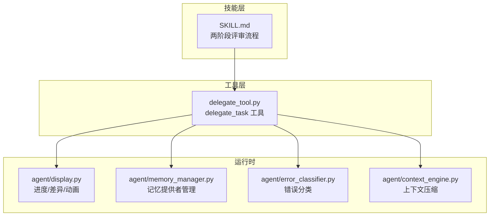
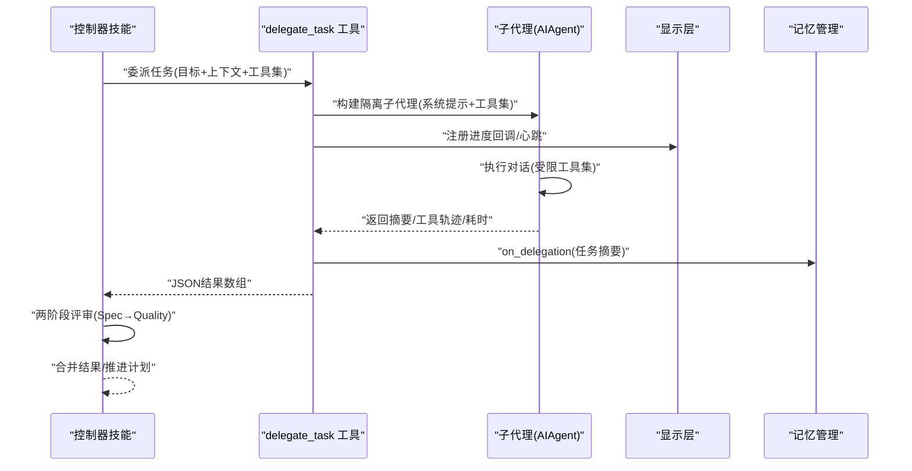
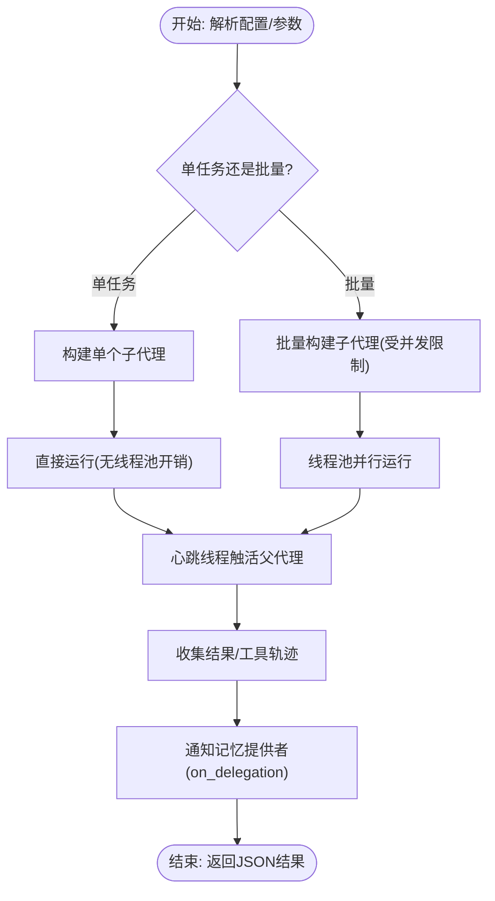
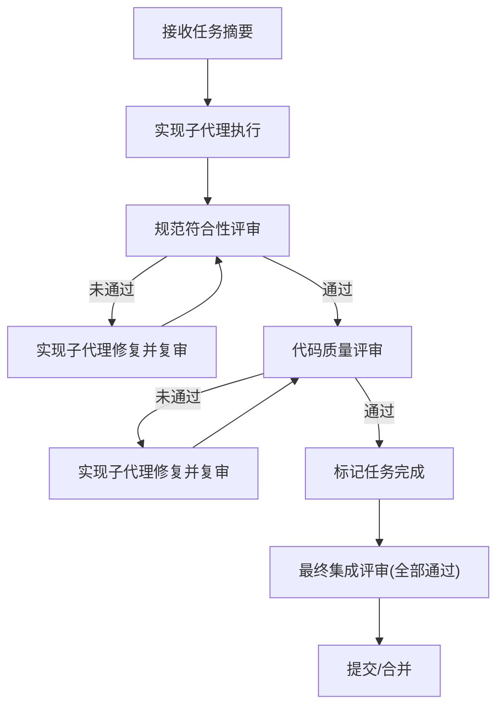
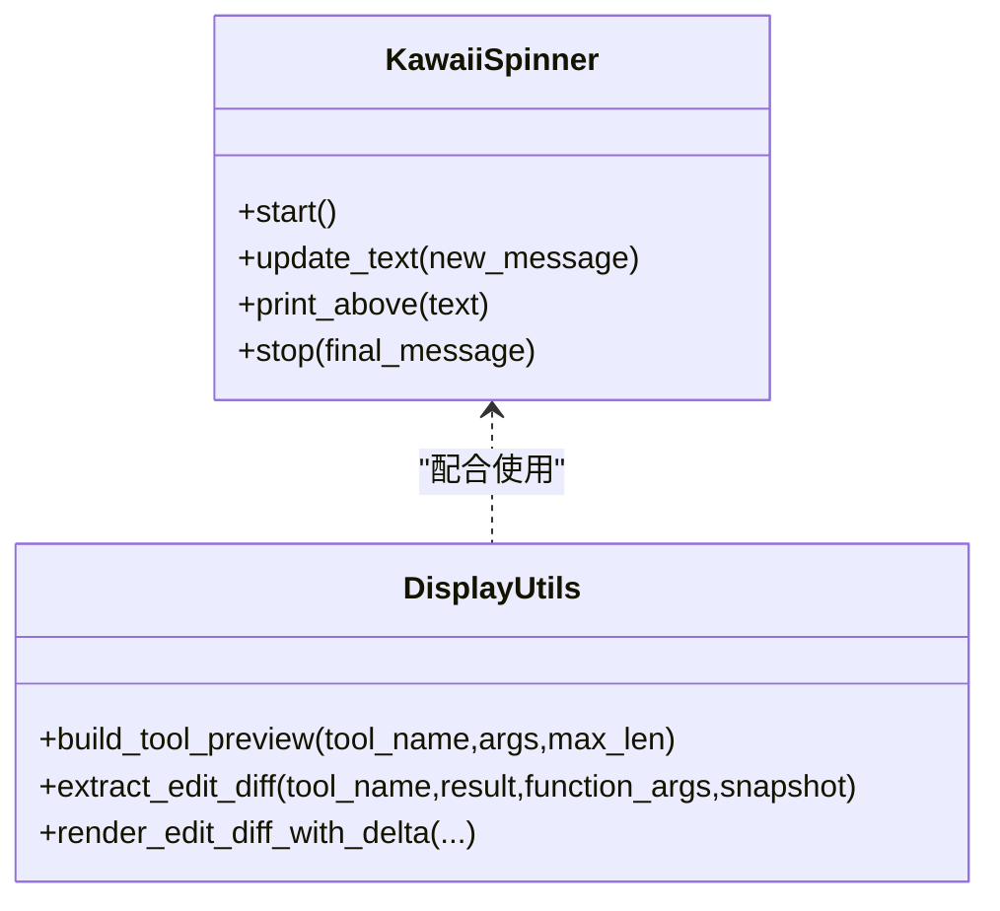
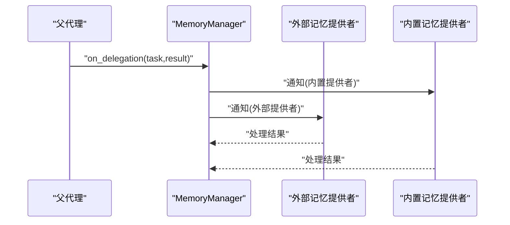
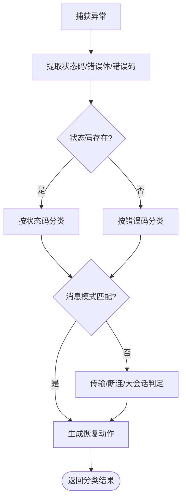
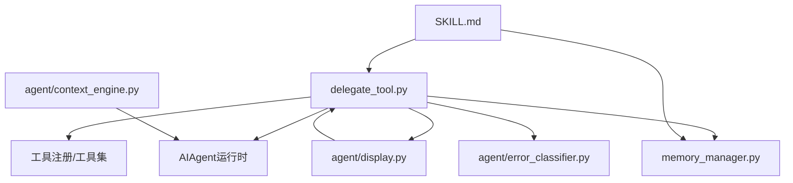
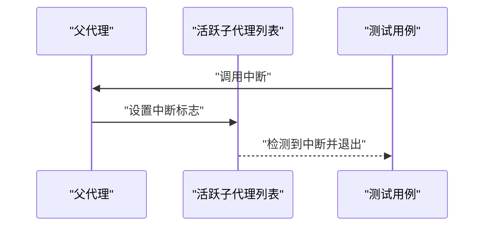

# 子代理驱动开发

<cite>
**本文引用的文件**
- [delegate_tool.py](file://tools/delegate_tool.py)
- [SKILL.md](file://skills/software-development/subagent-driven-development/SKILL.md)
- [display.py](file://agent/display.py)
- [memory_manager.py](file://agent/memory_manager.py)
- [error_classifier.py](file://agent/error_classifier.py)
- [context_engine.py](file://agent/context_engine.py)
- [test_cli_interrupt_subagent.py](file://tests/cli/test_cli_interrupt_subagent.py)
</cite>

## 目录
1. [简介](#简介)
2. [项目结构](#项目结构)
3. [核心组件](#核心组件)
4. [架构总览](#架构总览)
5. [详细组件分析](#详细组件分析)
6. [依赖分析](#依赖分析)
7. [性能考虑](#性能考虑)
8. [故障排查指南](#故障排查指南)
9. [结论](#结论)
10. [附录](#附录)

## 简介
本文件面向希望使用 Hermes Agent 的“子代理驱动开发”能力的开发者与技术用户，系统性阐述如何基于子代理（Subagent）体系实现智能化软件开发：从子代理的创建、配置、协调到监控；覆盖代码生成、测试执行、文档编写、代码重构等典型场景；解释子代理间通信机制、任务分配策略、结果整合方法与冲突解决机制；并提供可操作的开发案例、性能优化建议、错误处理与安全控制要点。

## 项目结构
围绕子代理驱动开发的核心代码主要分布在以下模块：
- 工具层：delegate_tool.py 提供 delegate_task 工具，负责子代理的构建、执行、进度回调与中断传播。
- 技能层：skills/software-development/subagent-driven-development/SKILL.md 定义了完整的两阶段评审流程与最佳实践。
- 展示层：agent/display.py 提供 CLI 进度反馈、工具调用预览与差异渲染。
- 记忆层：agent/memory_manager.py 提供记忆提供者管理与委托结果通知。
- 错误分类：agent/error_classifier.py 提供统一的 API 错误分类与恢复策略。
- 上下文引擎：agent/context_engine.py 提供上下文压缩与生命周期钩子。

**图表来源**
- [delegate_tool.py:623-814](file://tools/delegate_tool.py#L623-L814)
- [SKILL.md:35-175](file://skills/software-development/subagent-driven-development/SKILL.md#L35-L175)
- [display.py:577-763](file://agent/display.py#L577-L763)
- [memory_manager.py:320-333](file://agent/memory_manager.py#L320-L333)
- [error_classifier.py:222-396](file://agent/error_classifier.py#L222-L396)
- [context_engine.py:32-185](file://agent/context_engine.py#L32-L185)

**章节来源**
- [delegate_tool.py:1-1104](file://tools/delegate_tool.py#L1-L1104)
- [SKILL.md:1-343](file://skills/software-development/subagent-driven-development/SKILL.md#L1-L343)
- [display.py:1-800](file://agent/display.py#L1-L800)
- [memory_manager.py:1-363](file://agent/memory_manager.py#L1-L363)
- [error_classifier.py:1-810](file://agent/error_classifier.py#L1-L810)
- [context_engine.py:1-185](file://agent/context_engine.py#L1-L185)

## 核心组件
- 子代理调度器（delegate_task）
  - 支持单任务与批量并行两种模式，自动限制并发数量，构建隔离上下文与独立终端会话。
  - 通过系统提示词限定任务范围，避免子代理访问被禁用工具集。
  - 提供进度回调与心跳机制，确保网关空闲超时不会误杀正在工作的子代理。
- 两阶段评审流程（Spec Review + Code Quality Review）
  - 每个任务先由“实现子代理”完成，再经“规范符合性评审子代理”与“代码质量评审子代理”逐级把关。
  - 规范符合性优先于质量评审，问题闭环修复后方可进入下一阶段。
- 进度与可视化（Display）
  - 提供 KawaiiSpinner 动画、工具调用预览、文件变更内联 diff 渲染，便于观察子代理执行状态。
- 记忆与结果整合（Memory Manager）
  - 在委托完成后向所有注册的记忆提供者广播结果，用于后续检索与审计。
- 错误分类与恢复（Error Classifier）
  - 统一识别鉴权失败、配额/限流、服务端错误、上下文溢出、模型不存在等场景，指导重试、压缩或降级。
- 上下文压缩（Context Engine）
  - 在接近上下文阈值时触发压缩，保障长对话稳定性。

**章节来源**
- [delegate_tool.py:623-814](file://tools/delegate_tool.py#L623-L814)
- [SKILL.md:35-175](file://skills/software-development/subagent-driven-development/SKILL.md#L35-L175)
- [display.py:577-763](file://agent/display.py#L577-L763)
- [memory_manager.py:320-333](file://agent/memory_manager.py#L320-L333)
- [error_classifier.py:222-396](file://agent/error_classifier.py#L222-L396)
- [context_engine.py:32-185](file://agent/context_engine.py#L32-L185)

## 架构总览
子代理驱动开发的整体流程如下：控制器技能读取计划，按任务拆分并委派给子代理；子代理在隔离环境中执行具体工作；完成后返回摘要与工具轨迹；控制器进行两阶段评审，最终整合结果并推进下一步。

**图表来源**
- [delegate_tool.py:623-814](file://tools/delegate_tool.py#L623-L814)
- [memory_manager.py:320-333](file://agent/memory_manager.py#L320-L333)

**章节来源**
- [delegate_tool.py:388-469](file://tools/delegate_tool.py#L388-L469)
- [SKILL.md:55-175](file://skills/software-development/subagent-driven-development/SKILL.md#L55-L175)

## 详细组件分析

### 子代理调度器（delegate_task）
- 任务模式
  - 单任务：goal + 可选 context/toolsets。
  - 批量并行：tasks 数组，最多受 max_concurrent_children 限制。
- 隔离与安全
  - 子代理继承父代理的模型/凭据/路由策略，但被禁止使用 delegate_task、clarify、memory、send_message、execute_code 等工具。
  - 深度限制 MAX_DEPTH 防止递归子代。
- 资源与并发
  - 默认最大并发 3，可通过配置覆盖；每个子代理有独立迭代预算。
  - 子代理使用独立会话数据库与任务 ID，避免上下文污染。
- 进度与心跳
  - 注册 tool_progress_callback 将子代理工具调用汇总回传至父代理。
  - 后台线程定期向父代理“触活”，防止网关因无活动而终止。
- 结果与追踪
  - 返回 JSON 包含每个任务的状态、摘要、API 调用次数、耗时、令牌用量与工具轨迹。
  - 记录工具调用与结果，支持匹配并统计错误率。

**图表来源**
- [delegate_tool.py:623-814](file://tools/delegate_tool.py#L623-L814)

**章节来源**
- [delegate_tool.py:56-82](file://tools/delegate_tool.py#L56-L82)
- [delegate_tool.py:238-397](file://tools/delegate_tool.py#L238-L397)
- [delegate_tool.py:399-622](file://tools/delegate_tool.py#L399-L622)
- [delegate_tool.py:800-814](file://tools/delegate_tool.py#L800-L814)

### 两阶段评审流程（Spec Review + Code Quality Review）
- 实现子代理
  - 基于完整任务描述与项目上下文进行实现，遵循 TDD 流程（如适用）。
- 规范符合性评审子代理
  - 对照原始任务规格逐项核对，输出 PASS 或列出缺失项。
- 代码质量评审子代理
  - 检查风格、健壮性、测试覆盖率、安全性与潜在缺陷。
- 问题闭环
  - 发现问题后由实现子代理修复并重新评审，直至双通道均通过。
- 最终集成评审
  - 全部任务完成后进行整体一致性检查与回归验证。

**图表来源**
- [SKILL.md:55-175](file://skills/software-development/subagent-driven-development/SKILL.md#L55-L175)

**章节来源**
- [SKILL.md:55-175](file://skills/software-development/subagent-driven-development/SKILL.md#L55-L175)

### 进度与可视化（Display）
- KawaiiSpinner
  - 提供多种动画与“思考中”表情，配合工具预览与差异渲染，提升可观测性。
- 工具调用预览
  - 自动截断并展示工具主参摘要，便于快速理解子代理行为。
- 内联 diff
  - 对文件写入类操作生成统一格式差异，支持节流与省略策略，避免输出过载。

**图表来源**
- [display.py:577-763](file://agent/display.py#L577-L763)
- [display.py:176-281](file://agent/display.py#L176-L281)
- [display.py:417-571](file://agent/display.py#L417-L571)

**章节来源**
- [display.py:577-763](file://agent/display.py#L577-L763)
- [display.py:176-281](file://agent/display.py#L176-L281)
- [display.py:417-571](file://agent/display.py#L417-L571)

### 记忆与结果整合（Memory Manager）
- 生命周期钩子
  - 在委托完成后调用 on_delegation，向外部记忆提供者广播任务与摘要，便于后续检索与审计。
- 多提供者管理
  - 仅允许一个非内置记忆提供者，避免冲突；内置提供者始终可用。

**图表来源**
- [memory_manager.py:320-333](file://agent/memory_manager.py#L320-L333)

**章节来源**
- [memory_manager.py:320-333](file://agent/memory_manager.py#L320-L333)

### 错误分类与恢复（Error Classifier）
- 分类维度
  - 鉴权失败、计费/配额、限流、服务端错误、传输超时、上下文溢出、请求格式错误、模型不存在、Anthropic 特定签名问题等。
- 恢复策略
  - 依据分类决定是否重试、是否压缩上下文、是否轮换凭据、是否回退到其他提供商。
- 优先级管线
  - 先处理状态码与错误码，再匹配消息模式，最后根据会话规模判断是否为上下文溢出。

**图表来源**
- [error_classifier.py:222-396](file://agent/error_classifier.py#L222-L396)

**章节来源**
- [error_classifier.py:222-396](file://agent/error_classifier.py#L222-L396)

### 上下文压缩（Context Engine）
- 触发条件
  - 当消息长度接近阈值或达到保护窗口时触发压缩。
- 压缩策略
  - 支持摘要、图结构等策略；可暴露工具以辅助检索。
- 生命周期
  - 会话开始、结束与重置时分别进行初始化、清理与状态重置。

**章节来源**
- [context_engine.py:32-185](file://agent/context_engine.py#L32-L185)

## 依赖分析
- 子代理调度器依赖
  - 工具注册表（工具集过滤）、AIAgent 运行时（会话/令牌统计）、内存管理（委托结果通知）、显示层（进度回调）、错误分类（异常恢复）。
- 两阶段评审流程依赖
  - 子代理调度器（委派任务）、文件/终端工具（评审所需）、记忆管理（历史检索）。
- 显示层与上下文引擎
  - 与子代理执行状态强耦合，提供可观测性与稳定性保障。

**图表来源**
- [delegate_tool.py:286-397](file://tools/delegate_tool.py#L286-L397)
- [memory_manager.py:320-333](file://agent/memory_manager.py#L320-L333)
- [display.py:577-763](file://agent/display.py#L577-L763)
- [error_classifier.py:222-396](file://agent/error_classifier.py#L222-L396)
- [context_engine.py:32-185](file://agent/context_engine.py#L32-L185)

**章节来源**
- [delegate_tool.py:286-397](file://tools/delegate_tool.py#L286-L397)
- [memory_manager.py:320-333](file://agent/memory_manager.py#L320-L333)
- [display.py:577-763](file://agent/display.py#L577-L763)
- [error_classifier.py:222-396](file://agent/error_classifier.py#L222-L396)
- [context_engine.py:32-185](file://agent/context_engine.py#L32-L185)

## 性能考虑
- 并发与迭代预算
  - 合理设置 delegation.max_concurrent_children 与 delegation.max_iterations，避免资源争用与过度调用。
- 工具集最小化
  - 仅启用必要工具集，减少子代理推理负担与 API 调用成本。
- 心跳与资源回收
  - 心跳线程确保网关不误判空闲；子代理结束后及时关闭工具资源，避免僵尸进程。
- 上下文压缩
  - 在接近阈值前主动压缩，降低大模型调用频率与延迟。
- 凭据轮换
  - 使用共享凭据池在不同子代理间轮换，缓解限流影响。

**章节来源**
- [delegate_tool.py:56-82](file://tools/delegate_tool.py#L56-L82)
- [delegate_tool.py:433-469](file://tools/delegate_tool.py#L433-L469)
- [delegate_tool.py:816-845](file://tools/delegate_tool.py#L816-L845)
- [context_engine.py:32-185](file://agent/context_engine.py#L32-L185)

## 故障排查指南
- 中断传播
  - 父代理中断会传递到活跃子代理列表；测试覆盖了中断检测与等待逻辑。
- 错误分类
  - 使用统一分类器识别错误类型，指导重试、压缩或回退。
- 记忆提供者冲突
  - 仅允许一个外部记忆提供者；重复注册会被拒绝并记录警告。
- 子代理深度限制
  - 达到 MAX_DEPTH 时拒绝进一步委派，防止递归嵌套。

**图表来源**
- [test_cli_interrupt_subagent.py:130-164](file://tests/cli/test_cli_interrupt_subagent.py#L130-L164)

**章节来源**
- [test_cli_interrupt_subagent.py:130-164](file://tests/cli/test_cli_interrupt_subagent.py#L130-L164)
- [memory_manager.py:86-131](file://agent/memory_manager.py#L86-L131)
- [delegate_tool.py:645-653](file://tools/delegate_tool.py#L645-L653)

## 结论
通过子代理驱动开发，Hermes Agent 将复杂的软件开发任务分解为可编排、可评审、可追溯的子任务流。借助两阶段评审、隔离执行、进度可视化与错误分类恢复，团队可在保证质量的同时显著提升交付效率。结合上下文压缩与凭据轮换等性能优化手段，可在长周期项目中保持稳定与高效。

## 附录
- 开发案例（概念性流程）
  - 读取计划 → 创建任务清单 → 逐项委派实现子代理 → 规范符合性评审 → 代码质量评审 → 标记完成 → 最终集成评审 → 提交合并。
- 关键配置参考
  - delegation.max_concurrent_children：批量子代理并发上限。
  - delegation.max_iterations：单个子代理最大迭代次数。
  - delegation.provider/base_url/api_key：子代理专属提供商与凭据解析路径。
- 安全与合规
  - 禁止子代理使用 delegate_task、clarify、memory、send_message、execute_code 等高风险工具。
  - 深度限制 MAX_DEPTH 防止递归滥用。
  - 记忆提供者注册严格限制，避免冲突与数据泄露。