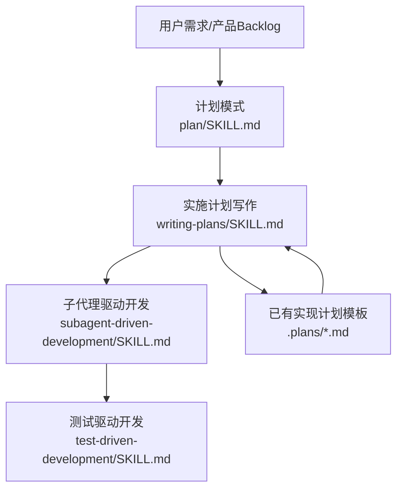
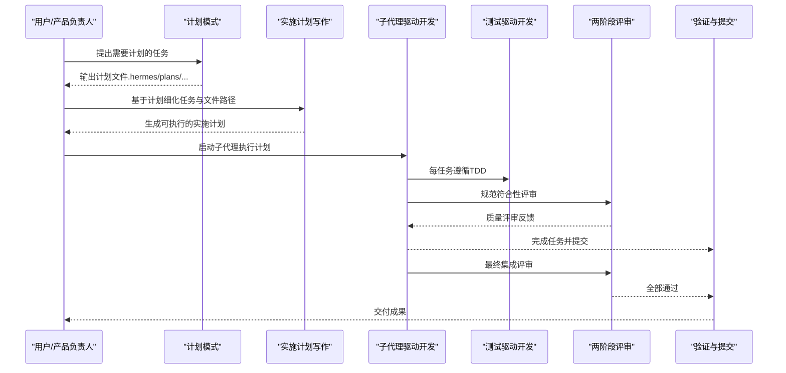
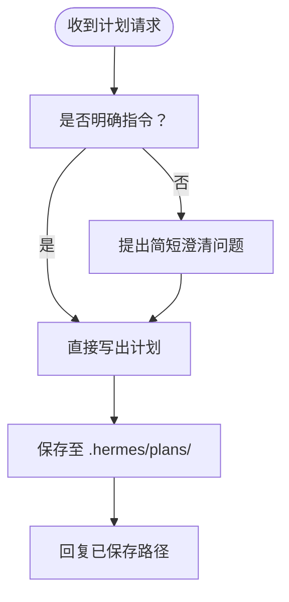
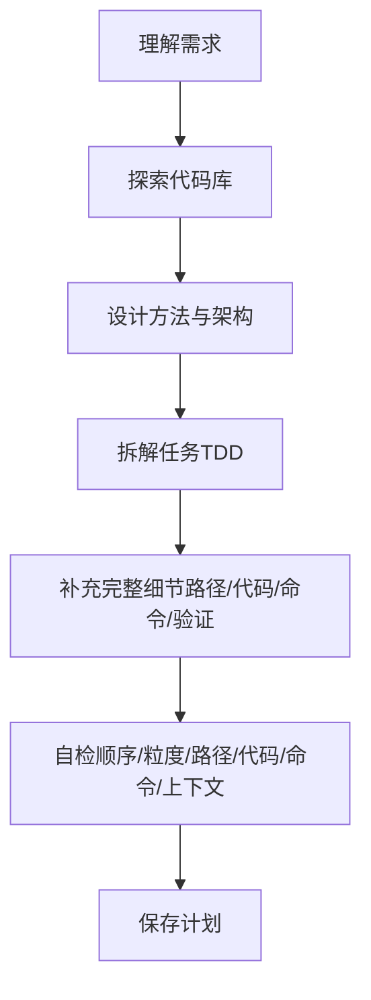
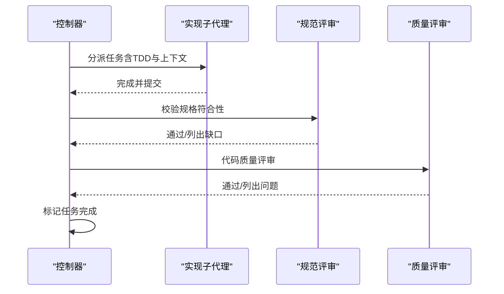
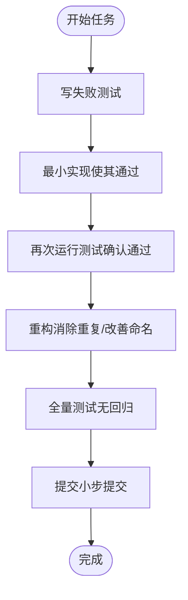
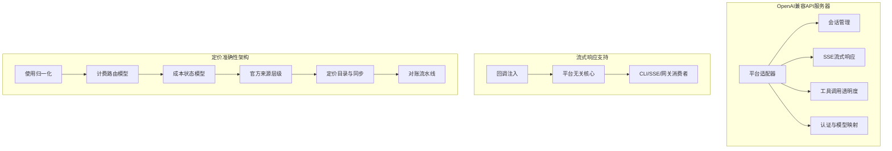
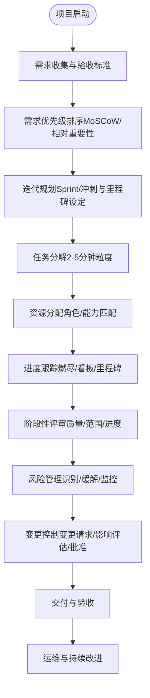
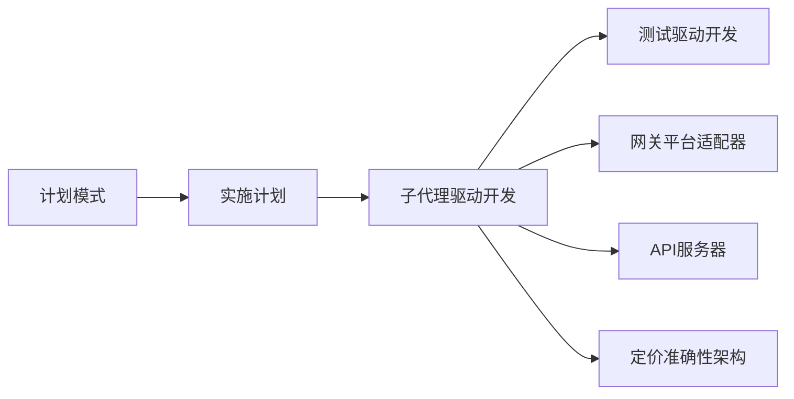

# 开发计划制定

<cite>
**本文引用的文件**
- [plan/SKILL.md](file://skills/software-development/plan/SKILL.md)
- [writing-plans/SKILL.md](file://skills/software-development/writing-plans/SKILL.md)
- [subagent-driven-development/SKILL.md](file://skills/software-development/subagent-driven-development/SKILL.md)
- [test-driven-development/SKILL.md](file://skills/software-development/test-driven-development/SKILL.md)
- [openai-api-server.md](file://.plans/openai-api-server.md)
- [streaming-support.md](file://.plans/streaming-support.md)
- [2026-03-16-pricing-accuracy-architecture-design.md](file://docs/plans/2026-03-16-pricing-accuracy-architecture-design.md)
- [one-three-one-rule/SKILL.md](file://optional-skills/communication/one-three-one-rule/SKILL.md)
- [README.md](file://README.md)
</cite>

## 目录
1. [简介](#简介)
2. [项目结构](#项目结构)
3. [核心组件](#核心组件)
4. [架构总览](#架构总览)
5. [详细组件分析](#详细组件分析)
6. [依赖关系分析](#依赖关系分析)
7. [性能考量](#性能考量)
8. [故障排查指南](#故障排查指南)
9. [结论](#结论)
10. [附录](#附录)

## 简介
本文件面向Hermes Agent的使用者与贡献者，系统化阐述“开发计划制定”的方法论与实操流程。围绕项目规划、任务分解、时间估算与资源分配，结合敏捷开发的实践（需求收集、优先级排序、迭代规划、里程碑设定），给出可复用的模板与最佳实践，并覆盖Web应用、移动应用、桌面软件、数据分析等多类场景。同时，文档整合了仓库内已有的实现计划与技能说明，提供从“计划—执行—评审—交付”的闭环工作流，以及风险管理、变更控制与进度跟踪的关键要点。

## 项目结构
Hermes Agent在“计划—执行—评审—交付”链路中，提供了以下关键能力：
- 计划模式：仅输出计划，不执行代码，确保先有计划再行动。
- 实施计划写作：将复杂需求拆解为可执行的任务清单，明确文件路径、测试与验证步骤。
- 子代理驱动开发：按任务分发子代理，两阶段评审（规范符合性→代码质量）。
- 测试驱动开发：以“红-绿-重构”循环保证质量与可维护性。
- 已有实现计划：如OpenAI兼容API服务器、流式响应支持、定价准确性架构设计等，可直接作为模板参考。

图示来源
- [plan/SKILL.md:13-58](file://skills/software-development/plan/SKILL.md#L13-L58)
- [writing-plans/SKILL.md:13-297](file://skills/software-development/writing-plans/SKILL.md#L13-L297)
- [subagent-driven-development/SKILL.md:13-343](file://skills/software-development/subagent-driven-development/SKILL.md#L13-L343)
- [test-driven-development/SKILL.md:13-343](file://skills/software-development/test-driven-development/SKILL.md#L13-L343)
- [openai-api-server.md:1-292](file://.plans/openai-api-server.md#L1-L292)
- [streaming-support.md:1-706](file://.plans/streaming-support.md#L1-L706)

章节来源
- [README.md:1-179](file://README.md#L1-L179)

## 核心组件
- 计划模式（Plan Mode）
  - 仅输出计划，不执行任何写入或外部动作；保存于工作区的“.hermes/plans/”目录，便于跨后端一致存放。
  - 输出要求：目标、现状假设、方法、步骤、可能改动文件、测试与验证、风险与权衡。
- 实施计划写作（Writing Implementation Plans）
  - 将需求转化为“可执行的实施计划”，强调“每个任务=2-5分钟专注工作量”。
  - 计划结构：标题、目标、架构、技术栈、任务列表（含文件路径、测试、步骤、命令与预期输出）。
  - 原则：DRY、YAGNI、TDD、频繁提交。
- 子代理驱动开发（Subagent-Driven Development）
  - 每个任务由独立子代理执行，两阶段评审（规范符合性→代码质量）。
  - 关键流程：读取计划→逐任务委派→规范评审→质量评审→标记完成→最终集成评审→验证与提交。
- 测试驱动开发（Test-Driven Development）
  - 强制“先写失败测试”，再最小实现通过，最后重构。
  - 遵循“红-绿-重构”循环，确保测试覆盖行为而非实现细节，避免回归。

章节来源
- [plan/SKILL.md:13-58](file://skills/software-development/plan/SKILL.md#L13-L58)
- [writing-plans/SKILL.md:13-297](file://skills/software-development/writing-plans/SKILL.md#L13-L297)
- [subagent-driven-development/SKILL.md:13-343](file://skills/software-development/subagent-driven-development/SKILL.md#L13-L343)
- [test-driven-development/SKILL.md:13-343](file://skills/software-development/test-driven-development/SKILL.md#L13-L343)

## 架构总览
下图展示了从需求到交付的端到端流程，以及各技能之间的协作关系：

图示来源
- [plan/SKILL.md:13-58](file://skills/software-development/plan/SKILL.md#L13-L58)
- [writing-plans/SKILL.md:13-297](file://skills/software-development/writing-plans/SKILL.md#L13-L297)
- [subagent-driven-development/SKILL.md:13-343](file://skills/software-development/subagent-driven-development/SKILL.md#L13-L343)
- [test-driven-development/SKILL.md:13-343](file://skills/software-development/test-driven-development/SKILL.md#L13-L343)

## 详细组件分析

### 组件A：计划模式（Plan Mode）
- 行为特征
  - 仅规划，不执行；输出为Markdown计划文件，保存在工作区的“.hermes/plans/”目录。
  - 若请求不明确，基于上下文推断任务；必要时提出简短澄清问题。
- 输出要求
  - 包含目标、当前上下文/假设、建议方法、分步计划、可能改动文件、测试/验证、风险与权衡。
- 交互风格
  - 明确指令时直接输出；若不明确，先澄清再输出；保存后简要告知保存位置。

图示来源
- [plan/SKILL.md:13-58](file://skills/software-development/plan/SKILL.md#L13-L58)

章节来源
- [plan/SKILL.md:13-58](file://skills/software-development/plan/SKILL.md#L13-L58)

### 组件B：实施计划写作（Writing Implementation Plans）
- 写作原则
  - 每个任务粒度为2-5分钟；任务顺序：基础设施→核心功能（每项TDD）→边界情况→集成→清理与文档。
  - 计划必须包含：目标、架构、技术栈、任务列表（含文件路径、测试、步骤、命令与预期输出）。
- 常见错误与纠正
  - 任务过大、描述模糊、缺少文件路径、缺少验证步骤、缺少完整代码示例。
- 执行交接
  - 计划完成后，建议使用“子代理驱动开发”按任务委派执行，并在每次任务后进行两阶段评审。

图示来源
- [writing-plans/SKILL.md:131-202](file://skills/software-development/writing-plans/SKILL.md#L131-L202)

章节来源
- [writing-plans/SKILL.md:13-297](file://skills/software-development/writing-plans/SKILL.md#L13-L297)

### 组件C：子代理驱动开发（Subagent-Driven Development）
- 核心流程
  - 一次性读取并解析计划，提取所有任务；对每个任务：
    - 委派实现子代理（提供完整上下文与TDD指导）
    - 规范符合性评审（检查是否满足原始任务规格）
    - 代码质量评审（风格、健壮性、安全性、测试覆盖）
    - 标记完成；重复直至全部任务完成
  - 最终集成评审与全量测试，确认可合并。
- 红灯规则
  - 不得跳过任一阶段评审；不得在存在未修复的重要/严重问题时推进；不得在评审未结束时进入下一任务。
- 效率与质量
  - 每任务一个新子代理，避免上下文污染；两阶段评审前置问题，降低后期返工成本。

图示来源
- [subagent-driven-development/SKILL.md:35-187](file://skills/software-development/subagent-driven-development/SKILL.md#L35-L187)

章节来源
- [subagent-driven-development/SKILL.md:13-343](file://skills/software-development/subagent-driven-development/SKILL.md#L13-L343)

### 组件D：测试驱动开发（Test-Driven Development）
- 核心循环
  - 红：写失败测试（明确行为、单一职责）
  - 绿：最小实现使其通过（允许“作弊”以快速通过）
  - 重构：消除重复、改善命名、提取助手、简化表达
- 常见误区与纠正
  - 在实现后再写测试、测试立即通过、测试覆盖实现细节、忽略边界与异常。
- 与子代理协作
  - 在委派任务时强制要求TDD流程，确保测试先行、无回归。

图示来源
- [test-driven-development/SKILL.md:54-176](file://skills/software-development/test-driven-development/SKILL.md#L54-L176)

章节来源
- [test-driven-development/SKILL.md:13-343](file://skills/software-development/test-driven-development/SKILL.md#L13-L343)

### 组件E：已有实现计划模板与最佳实践
- OpenAI兼容API服务器
  - 场景：为前端生态提供统一的OpenAI兼容REST API与SSE流式响应。
  - 关键点：网关平台适配器、会话管理（有状态/无状态）、流式响应、工具调用透明度、认证与模型映射。
  - 分阶段实现：MVP（非流式）→SSE流式→增强特性（工具透明、并发限制、CORS、使用统计）。
- 流式响应支持
  - 设计原则：特性开关、回调注入、优雅降级、平台无关核心。
  - 分阶段实现：核心流式基础设施→网关消费者（Telegram/Discord等）→CLI→API服务器真实SSE。
- 定价准确性架构设计
  - 目标：仅在有官方来源支撑时显示美元成本，区分“实际/估计/包含/未知”，并支持事后对账。
  - 关键模块：使用归一化、计费路由模型、成本状态模型、官方来源层级、定价目录与同步、对账流水线。

图示来源
- [openai-api-server.md:1-292](file://.plans/openai-api-server.md#L1-L292)
- [streaming-support.md:1-706](file://.plans/streaming-support.md#L1-L706)
- [2026-03-16-pricing-accuracy-architecture-design.md:1-609](file://docs/plans/2026-03-16-pricing-accuracy-architecture-design.md#L1-L609)

章节来源
- [.plans/openai-api-server.md:1-292](file://.plans/openai-api-server.md#L1-L292)
- [.plans/streaming-support.md:1-706](file://.plans/streaming-support.md#L1-L706)
- [docs/plans/2026-03-16-pricing-accuracy-architecture-design.md:1-609](file://docs/plans/2026-03-16-pricing-accuracy-architecture-design.md#L1-L609)

### 概念性总览
以下为通用项目管理流程的概念图，适用于多种项目类型（Web/移动/桌面/数据分析）：

（本图为概念性流程，无需代码映射）

## 依赖关系分析
- 技能耦合
  - 计划模式与实施计划写作强关联：前者产出计划，后者细化为可执行任务。
  - 子代理驱动开发依赖实施计划写作提供的任务清单与上下文。
  - 测试驱动开发贯穿子代理执行的每个任务，确保质量门禁。
- 外部依赖
  - 平台适配器（Telegram/Discord/Slack等）与API服务器依赖于网关基础设施。
  - 定价准确性架构依赖官方计费API与定价目录同步机制。
- 循环依赖规避
  - 子代理不重复读取计划文件，而是在委派时直接提供完整上下文，避免循环依赖与上下文污染。

图示来源
- [plan/SKILL.md:13-58](file://skills/software-development/plan/SKILL.md#L13-L58)
- [writing-plans/SKILL.md:13-297](file://skills/software-development/writing-plans/SKILL.md#L13-L297)
- [subagent-driven-development/SKILL.md:13-343](file://skills/software-development/subagent-driven-development/SKILL.md#L13-L343)
- [test-driven-development/SKILL.md:13-343](file://skills/software-development/test-driven-development/SKILL.md#L13-L343)
- [openai-api-server.md:1-292](file://.plans/openai-api-server.md#L1-L292)
- [streaming-support.md:1-706](file://.plans/streaming-support.md#L1-L706)
- [2026-03-16-pricing-accuracy-architecture-design.md:1-609](file://docs/plans/2026-03-16-pricing-accuracy-architecture-design.md#L1-L609)

章节来源
- [subagent-driven-development/SKILL.md:254-283](file://skills/software-development/subagent-driven-development/SKILL.md#L254-L283)

## 性能考量
- 任务粒度与吞吐
  - 2-5分钟任务提升并行度与反馈速度，降低单次任务失败的影响面。
- 流式响应与平台差异
  - CLI与网关平台对消息编辑速率有限制，需在流式预览与最终发送之间做协调，避免重复消息与速率限制冲突。
- 评审效率
  - 两阶段评审前置问题，减少后期大规模返工，提高整体交付速度与质量稳定性。

（本节为通用指导，无需特定文件引用）

## 故障排查指南
- 子代理执行卡住
  - 检查是否存在未修复的重要/严重问题；确认评审流程是否严格执行；必要时启用新的修复子代理。
- 流式响应重复消息
  - 确保在流式已交付的情况下跳过最终发送路径；或在最终编辑时使用后处理版本，避免前后不一致。
- 定价显示不准确
  - 核对计费路由模型与官方来源层级；确认是否已启用对账流水线；检查定价目录同步状态。
- 变更控制未落实
  - 所有变更均需走变更请求流程，评估影响并获得批准；避免未经评审的紧急变更。

章节来源
- [subagent-driven-development/SKILL.md:218-237](file://skills/software-development/subagent-driven-development/SKILL.md#L218-L237)
- [streaming-support.md:584-646](file://.plans/streaming-support.md#L584-L646)
- [2026-03-16-pricing-accuracy-architecture-design.md:372-430](file://docs/plans/2026-03-16-pricing-accuracy-architecture-design.md#L372-L430)

## 结论
通过“计划模式—实施计划写作—子代理驱动开发—测试驱动开发”的闭环，Hermes Agent为复杂项目提供了可复制、可扩展的开发计划制定方法。结合已有实现计划模板（OpenAI兼容API服务器、流式响应支持、定价准确性架构），团队可在Web应用、移动应用、桌面软件、数据分析等多场景中高效落地。配合风险管理、变更控制与进度跟踪，可显著提升交付质量与交付速度。

（本节为总结，无需特定文件引用）

## 附录

### A. 敏捷开发计划制定流程（实践模板）
- 需求收集
  - 明确目标、验收标准、约束条件与成功指标。
- 优先级排序
  - 使用MoSCoW或相对重要性矩阵，形成产品Backlog。
- 迭代规划
  - 划定Sprint周期，确定每轮交付内容与里程碑。
- 任务分解
  - 每任务控制在2-5分钟内完成；明确文件路径、测试与验证步骤。
- 资源分配
  - 基于角色与能力匹配，合理安排子代理与评审人员。
- 进度跟踪
  - 使用看板/燃尽图跟踪任务进展，定期回顾与调整。
- 风险管理
  - 识别技术与业务风险，制定缓解措施与应急预案。
- 变更控制
  - 所有变更需经变更请求与影响评估，获得批准后实施。
- 交付与验收
  - 两阶段评审通过后进行最终集成评审与全量测试，确保可合并。

（本节为通用模板，无需特定文件引用）

### B. 不同项目类型的计划模板与最佳实践
- Web应用
  - 前后端分离、API优先、单元测试与端到端测试并重；采用流式响应提升用户体验。
- 移动应用
  - 注重平台差异与权限管理；采用模块化与组件化设计；重视回归测试。
- 桌面软件
  - 跨平台打包与安装流程；关注性能与内存占用；完善自动化测试。
- 数据分析项目
  - 明确数据来源与清洗策略；版本化数据与脚本；可视化与报告自动化。

（本节为通用指导，无需特定文件引用）

### C. 实际案例：从启动到交付的完整规划
- 案例背景：为前端生态提供OpenAI兼容API与SSE流式响应。
- 步骤
  - 需求收集：明确兼容性矩阵与SSE格式要求。
  - 优先级排序：MVP（非流式）→SSE流式→增强特性。
  - 任务分解：平台适配器、会话管理、工具透明度、认证与模型映射。
  - 资源分配：网关组负责平台适配器与SSE；后端组负责会话与工具集成。
  - 进度跟踪：里程碑（MVP发布、SSE上线、增强特性完成）。
  - 风险管理：客户端断连、速率限制、工具调用透明度争议。
  - 变更控制：所有接口变更需评估兼容性与迁移成本。
  - 交付与验收：全量测试、兼容性验证、性能基准测试。

章节来源
- [.plans/openai-api-server.md:1-292](file://.plans/openai-api-server.md#L1-L292)
- [.plans/streaming-support.md:1-706](file://.plans/streaming-support.md#L1-L706)