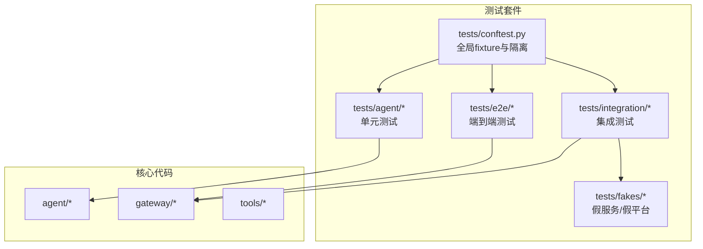
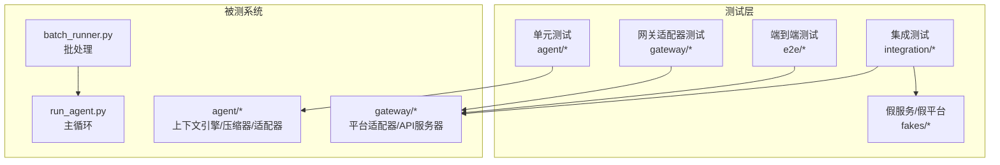
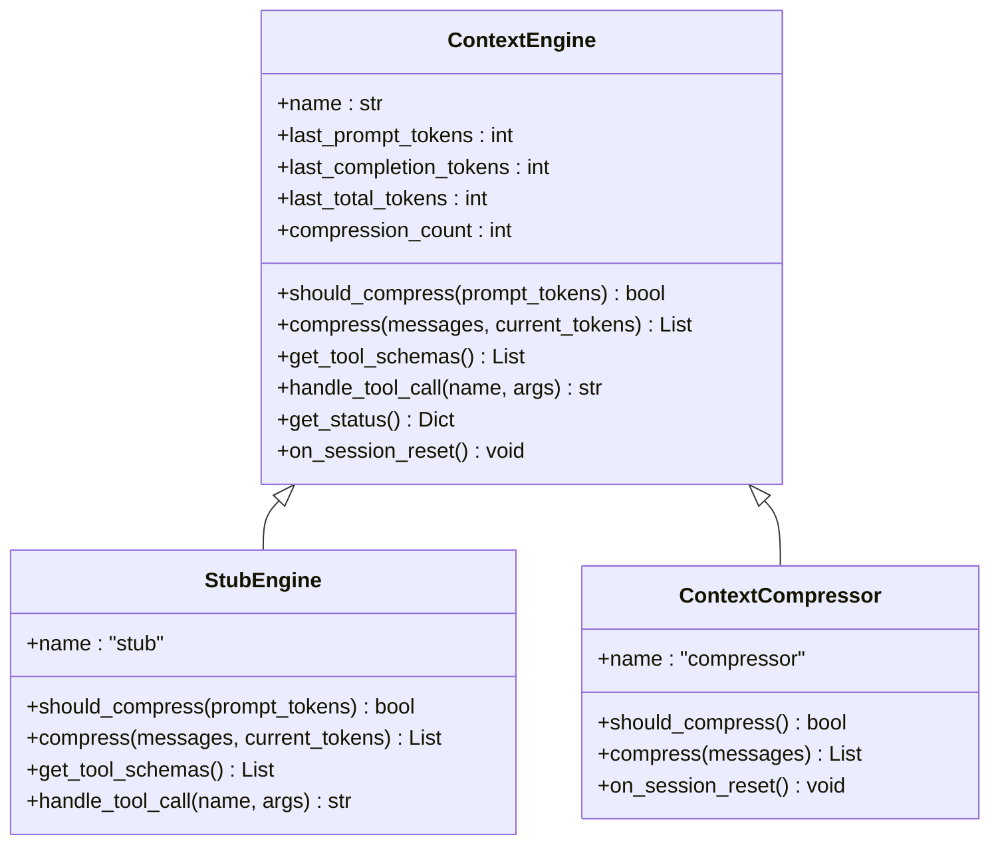
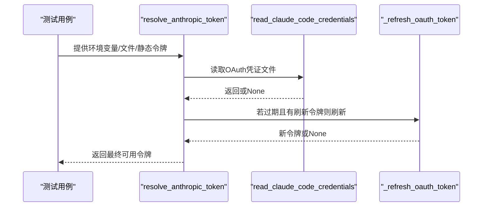
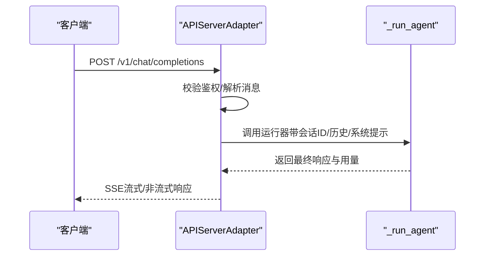
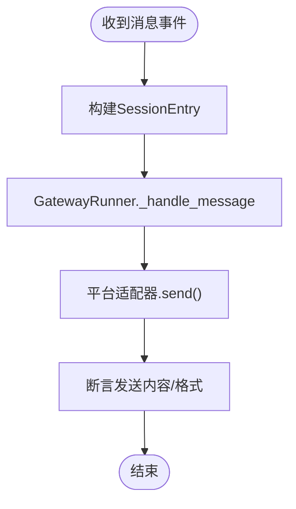
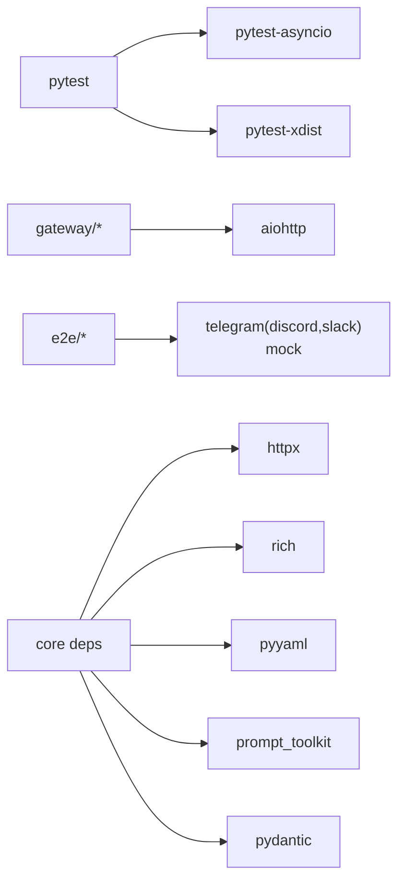

# 测试驱动开发

<cite>
**本文引用的文件**
- [README.md](file://README.md)
- [pyproject.toml](file://pyproject.toml)
- [tests/conftest.py](file://tests/conftest.py)
- [tests/agent/test_anthropic_adapter.py](file://tests/agent/test_anthropic_adapter.py)
- [tests/agent/test_context_engine.py](file://tests/agent/test_context_engine.py)
- [tests/agent/test_context_compressor.py](file://tests/agent/test_context_compressor.py)
- [tests/gateway/test_api_server.py](file://tests/gateway/test_api_server.py)
- [tests/e2e/conftest.py](file://tests/e2e/conftest.py)
- [tests/integration/test_batch_runner.py](file://tests/integration/test_batch_runner.py)
- [tests/fakes/fake_ha_server.py](file://tests/fakes/fake_ha_server.py)
- [requirements.txt](file://requirements.txt)
- [SKILL.md](file://skills/software-development/test-driven-development/SKILL.md)
</cite>

## 目录
1. [引言](#引言)
2. [项目结构](#项目结构)
3. [核心组件](#核心组件)
4. [架构总览](#架构总览)
5. [详细组件分析](#详细组件分析)
6. [依赖分析](#依赖分析)
7. [性能考量](#性能考量)
8. [故障排查指南](#故障排查指南)
9. [结论](#结论)
10. [附录](#附录)

## 引言
本文件面向Hermes Agent的测试驱动开发（TDD）实践，系统阐述红绿重构循环、测试先行原则、单元测试与集成测试、端到端测试与性能测试的编写方法，并结合仓库现有测试用例，给出测试框架选择与配置、测试数据准备与管理、自动化测试策略及持续集成中的TDD落地建议。同时提供基于仓库真实测试文件的TDD案例路径，帮助读者快速上手并建立高质量的测试文化。

## 项目结构
Hermes Agent采用分层模块化组织：核心业务逻辑位于agent、gateway、tools等包；测试集中在tests目录下，按功能域划分（agent、gateway、e2e、integration、fakes等），并辅以pytest配置与共享fixture，确保测试隔离、可重复与可扩展。

图表来源
- [tests/conftest.py:1-122](file://tests/conftest.py#L1-L122)
- [tests/agent/test_anthropic_adapter.py:1-800](file://tests/agent/test_anthropic_adapter.py#L1-L800)
- [tests/gateway/test_api_server.py:1-1000](file://tests/gateway/test_api_server.py#L1-L1000)
- [tests/integration/test_batch_runner.py:1-133](file://tests/integration/test_batch_runner.py#L1-L133)
- [tests/e2e/conftest.py:1-267](file://tests/e2e/conftest.py#L1-L267)
- [tests/fakes/fake_ha_server.py:1-302](file://tests/fakes/fake_ha_server.py#L1-L302)

章节来源
- [README.md:140-161](file://README.md#L140-L161)
- [pyproject.toml:123-129](file://pyproject.toml#L123-L129)

## 核心组件
- 测试框架与运行器：pytest（含并发执行、标记过滤、共享fixture）
- 隔离与环境：自动注入项目根路径、临时HOME隔离、事件循环提供、统一超时保护
- 标记与分组：使用integration标记区分外部依赖测试，支持按需跳过
- 平台与异步：对aiohttp、Telegram、Discord、Slack等平台进行mock，避免真实网络调用

章节来源
- [tests/conftest.py:1-122](file://tests/conftest.py#L1-L122)
- [pyproject.toml:123-129](file://pyproject.toml#L123-L129)

## 架构总览
下图展示了测试体系与被测系统的交互关系：单元测试直接覆盖agent层；网关适配器测试覆盖API兼容端点；端到端测试模拟消息流；集成测试通过假服务验证真实协议行为；批量运行器用于大规模轨迹生成与统计。

图表来源
- [tests/agent/test_context_engine.py:1-251](file://tests/agent/test_context_engine.py#L1-L251)
- [tests/gateway/test_api_server.py:1-1000](file://tests/gateway/test_api_server.py#L1-L1000)
- [tests/e2e/conftest.py:1-267](file://tests/e2e/conftest.py#L1-L267)
- [tests/integration/test_batch_runner.py:1-133](file://tests/integration/test_batch_runner.py#L1-L133)
- [tests/fakes/fake_ha_server.py:1-302](file://tests/fakes/fake_ha_server.py#L1-L302)

## 详细组件分析

### 组件A：上下文引擎与压缩器（单元测试）
- 职责：定义上下文引擎抽象接口，提供默认行为与状态管理；在满足阈值时触发压缩，保护首尾消息，保留关键对话片段。
- 关键测试要点：
  - 抽象类不可实例化校验
  - 默认工具schema为空、未知工具调用返回错误
  - 压缩阈值计算、压缩计数与状态重置
  - 保护首尾消息策略、工具调用结果合并与孤儿清理
- 实践价值：通过最小实现快速通过测试，再逐步完善压缩算法与边界条件。

图表来源
- [tests/agent/test_context_engine.py:15-86](file://tests/agent/test_context_engine.py#L15-L86)
- [tests/agent/test_context_engine.py:171-191](file://tests/agent/test_context_engine.py#L171-L191)
- [tests/agent/test_context_compressor.py:9-21](file://tests/agent/test_context_compressor.py#L9-L21)

章节来源
- [tests/agent/test_context_engine.py:1-251](file://tests/agent/test_context_engine.py#L1-L251)
- [tests/agent/test_context_compressor.py:1-200](file://tests/agent/test_context_compressor.py#L1-L200)

### 组件B：Anthropic适配器（单元测试）
- 职责：令牌解析与构建、消息/工具格式转换、缓存控制、OAuth刷新与写入。
- 关键测试要点：
  - OAuth与API Key优先级判定
  - 客户端初始化参数与默认头设置
  - 凭证读取、有效期判断、刷新与回写
  - 消息转换（图片块、工具调用/结果、孤儿清理）、缓存控制透传
- 实践价值：通过小步提交与最小实现，逐步完善多模型/多端点适配。

图表来源
- [tests/agent/test_anthropic_adapter.py:180-267](file://tests/agent/test_anthropic_adapter.py#L180-L267)
- [tests/agent/test_anthropic_adapter.py:269-317](file://tests/agent/test_anthropic_adapter.py#L269-L317)
- [tests/agent/test_anthropic_adapter.py:341-386](file://tests/agent/test_anthropic_adapter.py#L341-L386)

章节来源
- [tests/agent/test_anthropic_adapter.py:1-800](file://tests/agent/test_anthropic_adapter.py#L1-L800)

### 组件C：API服务器适配器（集成/单元测试）
- 职责：提供OpenAI兼容端点（聊天补全、响应查询、模型列表、健康检查），支持鉴权、CORS、安全头、SSE流式输出、会话ID派生与历史拼接。
- 关键测试要点：
  - 环境与配置注入、鉴权校验（无/正确/错误/格式错误）
  - 响应存储LRU、链式previous_response_id
  - SSE流式输出、工具进度事件、空用户消息校验
  - 会话ID确定性、不同对话不同ID
- 实践价值：通过端到端请求-响应验证，确保协议一致性与错误处理。

图表来源
- [tests/gateway/test_api_server.py:355-781](file://tests/gateway/test_api_server.py#L355-L781)
- [tests/gateway/test_api_server.py:819-1000](file://tests/gateway/test_api_server.py#L819-L1000)

章节来源
- [tests/gateway/test_api_server.py:1-1000](file://tests/gateway/test_api_server.py#L1-L1000)

### 组件D：端到端消息流（e2e测试）
- 职责：模拟Telegram/Discord/Slack消息事件，验证从adapter.handle_message到GatewayRunner处理再到adapter.send的完整异步链路。
- 关键测试要点：
  - 平台库mock（无真实SDK也可导入）
  - 会话创建/加载、消息捕获、发送结果断言
  - 不同平台通用行为的一致性
- 实践价值：在不连接真实平台的前提下，覆盖命令分发、权限校验、语音回复等复杂场景。

图表来源
- [tests/e2e/conftest.py:126-241](file://tests/e2e/conftest.py#L126-L241)

章节来源
- [tests/e2e/conftest.py:1-267](file://tests/e2e/conftest.py#L1-L267)

### 组件E：批量运行器（集成测试）
- 职责：对样本数据集进行批处理，产出checkpoint、statistics与批次文件，便于大体量轨迹生成与统计分析。
- 关键测试要点：
  - 数据集创建与清理
  - 输出目录结构与文件存在性校验
  - 统计信息与工具调用统计解析
- 实践价值：在本地或CI中验证批处理流程与资源占用，避免真实API调用带来的成本与风险。

章节来源
- [tests/integration/test_batch_runner.py:1-133](file://tests/integration/test_batch_runner.py#L1-L133)

### 组件F：假Home Assistant服务（集成测试）
- 职责：提供WebSocket与REST接口的假HA服务，用于验证与真实协议一致的行为（认证、事件推送、服务调用）。
- 关键测试要点：
  - 认证握手、事件队列、通知与服务调用收集
  - 错误场景（401/500）与异常关闭处理
- 实践价值：在不依赖真实HA部署的情况下，完成协议一致性与健壮性测试。

章节来源
- [tests/fakes/fake_ha_server.py:1-302](file://tests/fakes/fake_ha_server.py#L1-L302)

## 依赖分析
- 测试框架与插件：pytest、pytest-asyncio、pytest-xdist（并行执行）
- 平台SDK：aiohttp（网关）、telegram/disco/slack（e2e测试中mock）
- 工具与环境：httpx、rich、pyyaml、prompt_toolkit、pydantic等（核心依赖）
- 可选依赖：messaging、dev、acp、mcp等（按功能启用）

图表来源
- [pyproject.toml:42-108](file://pyproject.toml#L42-L108)
- [requirements.txt:1-37](file://requirements.txt#L1-L37)

章节来源
- [pyproject.toml:1-129](file://pyproject.toml#L1-L129)
- [requirements.txt:1-37](file://requirements.txt#L1-L37)

## 性能考量
- 并行执行：pytest-xdist开启自动并行，缩短测试总时长
- 超时保护：单测超时信号处理，避免挂起阻塞CI流水线
- 异步测试：pytest-asyncio确保协程测试稳定运行
- 批量测试：集成测试仅做结构与统计校验，避免真实API调用
- 假服务：通过fakes模块降低网络与外部依赖开销

章节来源
- [tests/conftest.py:77-122](file://tests/conftest.py#L77-L122)
- [pyproject.toml:123-129](file://pyproject.toml#L123-L129)

## 故障排查指南
- 单测超时：检查是否存在未关闭的事件循环或阻塞I/O；确认conftest中事件循环注入是否生效
- 平台SDK缺失：e2e测试通过mock补齐，确保模块可导入；如仍报错，检查sys.modules替换是否成功
- 鉴权失败：核对API密钥配置与Authorization头格式；确认测试中是否正确注入
- SSE流中断：关注None哨兵与工具进度事件的处理逻辑，避免提前关闭流
- 批处理输出缺失：确认输出目录命名与权限；检查checkpoint与statistics文件是否生成

章节来源
- [tests/conftest.py:19-43](file://tests/conftest.py#L19-L43)
- [tests/e2e/conftest.py:28-114](file://tests/e2e/conftest.py#L28-L114)
- [tests/gateway/test_api_server.py:355-781](file://tests/gateway/test_api_server.py#L355-L781)
- [tests/integration/test_batch_runner.py:44-91](file://tests/integration/test_batch_runner.py#L44-L91)

## 结论
Hermes Agent的测试体系以pytest为核心，结合单元、集成、端到端与假服务策略，实现了高覆盖率与低耦合的测试架构。通过严格的TDD流程（红-绿-重构）与完备的fixture与mock机制，团队可以在保证质量的同时加速迭代。建议在新功能开发中坚持“先写测试”的原则，利用仓库现有的测试模式与工具，持续完善测试矩阵与覆盖率。

## 附录

### TDD方法论与实践要点
- 红灯：编写最小失败测试，明确期望行为
- 绿灯：写出最简实现通过测试，不添加额外功能
- 红灯：重构消除重复、改善命名与结构
- 循环推进：逐个行为推进，保持测试纯净与可读

章节来源
- [SKILL.md:13-280](file://skills/software-development/test-driven-development/SKILL.md#L13-L280)

### 测试类型与编写指南
- 单元测试：聚焦单一职责与边界条件，使用pytest与unittest.mock
- 集成测试：验证组件间协作与外部依赖契约，使用假服务与最小化外部依赖
- 端到端测试：覆盖真实消息流与平台交互，确保命令分发与响应一致性
- 性能测试：评估批处理吞吐、内存与CPU占用，结合CI定时任务执行

章节来源
- [tests/agent/test_anthropic_adapter.py:1-800](file://tests/agent/test_anthropic_adapter.py#L1-L800)
- [tests/gateway/test_api_server.py:1-1000](file://tests/gateway/test_api_server.py#L1-L1000)
- [tests/e2e/conftest.py:1-267](file://tests/e2e/conftest.py#L1-L267)
- [tests/integration/test_batch_runner.py:1-133](file://tests/integration/test_batch_runner.py#L1-L133)
- [tests/fakes/fake_ha_server.py:1-302](file://tests/fakes/fake_ha_server.py#L1-L302)

### 测试框架选择与配置
- 运行器：pytest（addopts、markers、testpaths）
- 并行：pytest-xdist
- 异步：pytest-asyncio
- 标记：integration用于跳过需要外部服务的测试
- 共享fixture：全局隔离、事件循环、超时保护

章节来源
- [pyproject.toml:123-129](file://pyproject.toml#L123-L129)
- [tests/conftest.py:19-122](file://tests/conftest.py#L19-L122)

### 测试数据准备与管理
- 临时目录与HOME隔离：避免污染用户环境
- 配置字典：提供最小化配置，便于单元测试
- 假服务：通过fakes模块提供真实协议行为的可控替代

章节来源
- [tests/conftest.py:19-67](file://tests/conftest.py#L19-L67)
- [tests/fakes/fake_ha_server.py:77-162](file://tests/fakes/fake_ha_server.py#L77-L162)

### 自动化测试与持续集成
- CI策略：默认跳过integration标记，必要时显式启用
- 并行执行：利用pytest-xdist提升吞吐
- 超时保护：防止个别测试导致流水线停滞
- 输出验证：集成测试仅验证结构与统计，避免真实API调用

章节来源
- [pyproject.toml:123-129](file://pyproject.toml#L123-L129)
- [tests/conftest.py:77-122](file://tests/conftest.py#L77-L122)
- [tests/integration/test_batch_runner.py:44-91](file://tests/integration/test_batch_runner.py#L44-L91)