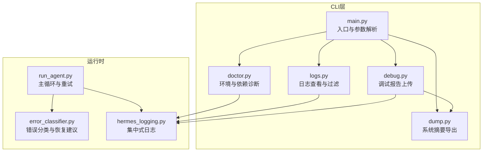
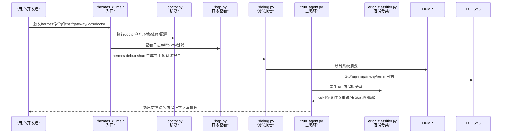
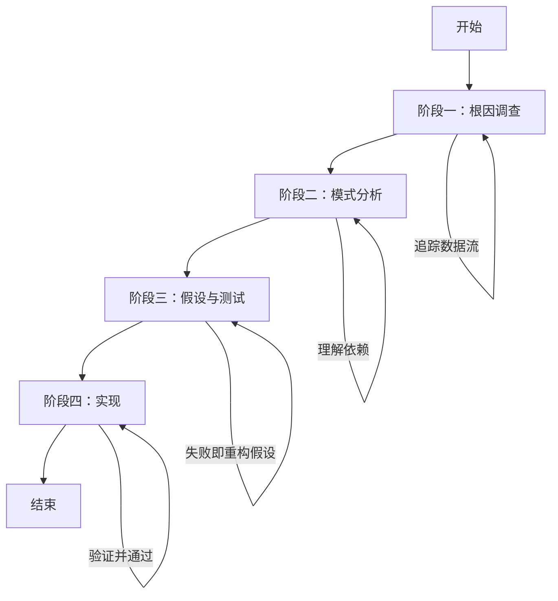
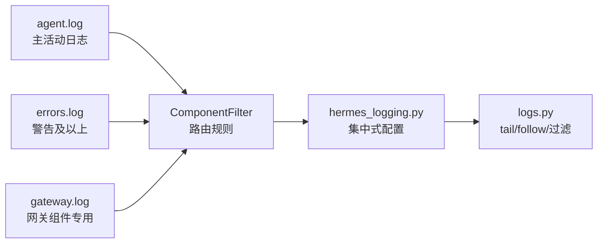
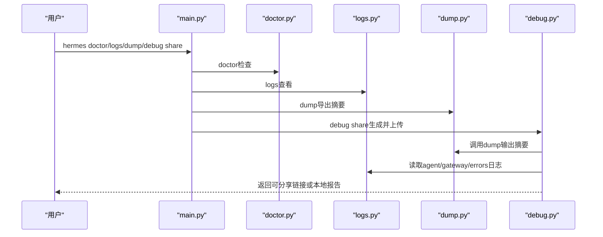
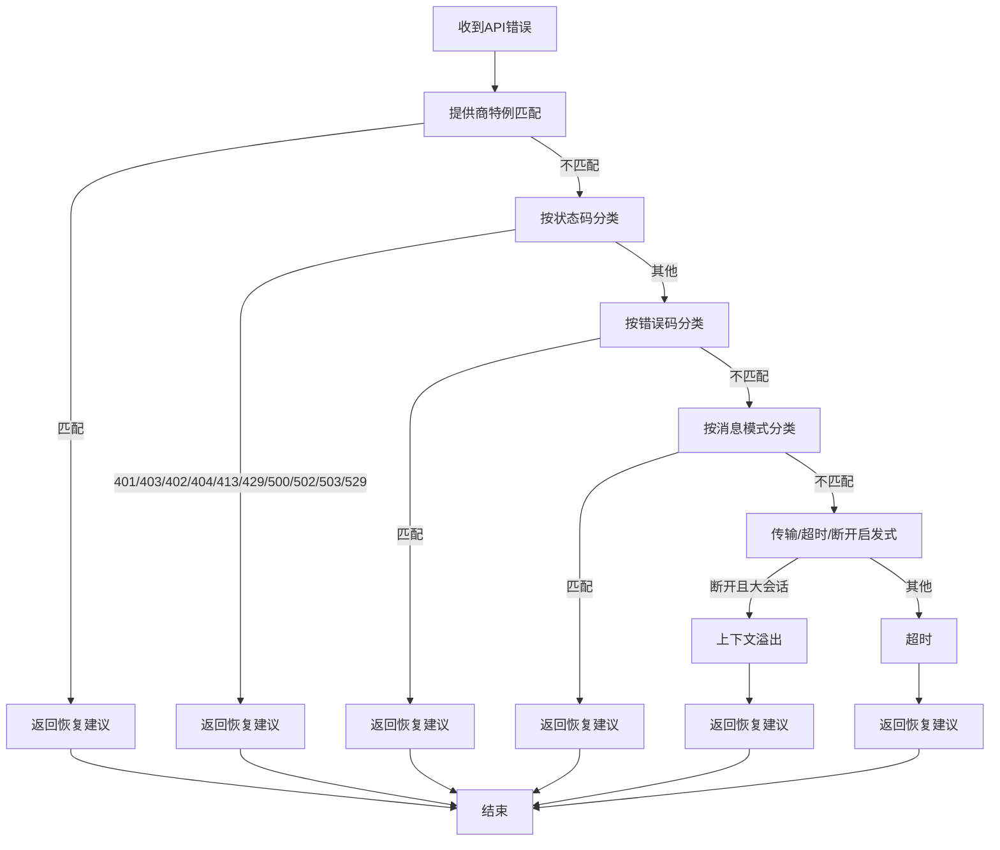
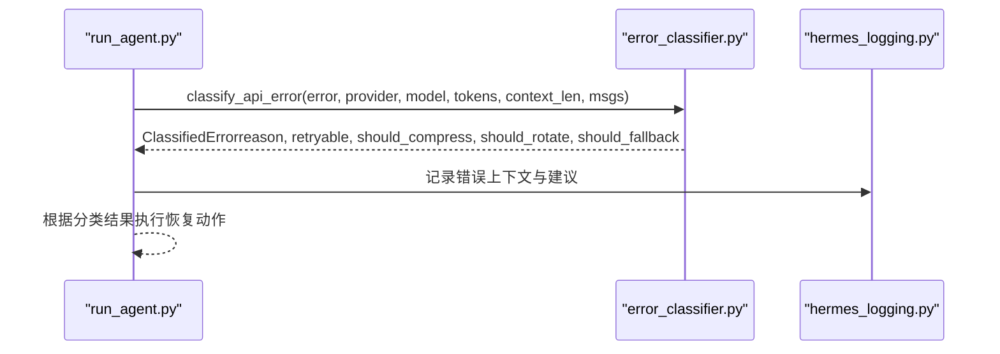
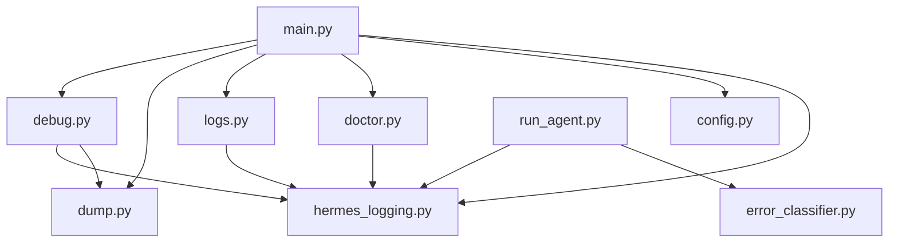

# 系统性调试

<cite>
**本文引用的文件**   
- [systematic-debugging/SKILL.md](file://skills/software-development/systematic-debugging/SKILL.md)
- [debug.py](file://hermes_cli/debug.py)
- [logs.py](file://hermes_cli/logs.py)
- [dump.py](file://hermes_cli/dump.py)
- [doctor.py](file://hermes_cli/doctor.py)
- [hermes_logging.py](file://hermes_logging.py)
- [error_classifier.py](file://agent/error_classifier.py)
- [run_agent.py](file://run_agent.py)
- [main.py](file://hermes_cli/main.py)
- [config.py](file://hermes_cli/config.py)
</cite>

## 目录
1. [简介](#简介)
2. [项目结构](#项目结构)
3. [核心组件](#核心组件)
4. [架构总览](#架构总览)
5. [详细组件分析](#详细组件分析)
6. [依赖分析](#依赖分析)
7. [性能考虑](#性能考虑)
8. [故障排查指南](#故障排查指南)
9. [结论](#结论)
10. [附录](#附录)

## 简介
本文件面向Hermes Agent使用者与维护者，系统化梳理“系统性调试”的方法论与工具链，覆盖问题定位、根因分析、调试策略制定与解决方案实施全流程，并结合Hermes已有的日志体系、诊断命令与错误分类机制，给出可操作的调试实践与最佳实践清单。文档同时总结了内存泄漏、并发问题、性能瓶颈、兼容性问题等典型场景的调试要点与工具使用技巧。

## 项目结构
围绕“系统性调试”，Hermes在CLI层提供了诊断与日志查看工具，在运行时提供了统一的日志与错误分类能力，并通过技能（Skill）定义了标准化的四阶段调试流程。下图展示关键模块之间的关系与调用路径：

图表来源
- [main.py:1-200](file://hermes_cli/main.py#L1-L200)
- [doctor.py:162-800](file://hermes_cli/doctor.py#L162-L800)
- [logs.py:1-391](file://hermes_cli/logs.py#L1-L391)
- [dump.py:1-345](file://hermes_cli/dump.py#L1-L345)
- [debug.py:1-337](file://hermes_cli/debug.py#L1-L337)
- [run_agent.py:1-200](file://run_agent.py#L1-L200)
- [error_classifier.py:1-810](file://agent/error_classifier.py#L1-L810)
- [hermes_logging.py:1-395](file://hermes_logging.py#L1-L395)

章节来源
- [main.py:1-200](file://hermes_cli/main.py#L1-L200)

## 核心组件
- 系统性调试技能：提供四阶段调试流程（根因调查、模式分析、假设与测试、实现），强调“先理解再修复”。
- 日志系统：集中式文件日志、按组件路由、会话上下文注入、轮转与脱敏格式化。
- 诊断工具：doctor（环境/依赖/配置）、logs（tail/follow/过滤）、dump（系统摘要）、debug share（上传调试报告）。
- 错误分类：对API错误进行结构化分类，指导重试、凭证轮换、降级或压缩上下文等恢复动作。
- 运行时集成：主循环在异常时调用错误分类器，依据分类结果执行恢复策略。

章节来源
- [systematic-debugging/SKILL.md:53-367](file://skills/software-development/systematic-debugging/SKILL.md#L53-L367)
- [hermes_logging.py:1-395](file://hermes_logging.py#L1-L395)
- [doctor.py:162-800](file://hermes_cli/doctor.py#L162-L800)
- [logs.py:1-391](file://hermes_cli/logs.py#L1-L391)
- [dump.py:1-345](file://hermes_cli/dump.py#L1-L345)
- [debug.py:1-337](file://hermes_cli/debug.py#L1-L337)
- [error_classifier.py:1-810](file://agent/error_classifier.py#L1-L810)
- [run_agent.py:1-200](file://run_agent.py#L1-L200)

## 架构总览
下图展示“系统性调试”在Hermes中的端到端工作流：从问题发现、证据收集、根因定位，到修复验证与回归保障。

图表来源
- [main.py:1-200](file://hermes_cli/main.py#L1-L200)
- [doctor.py:162-800](file://hermes_cli/doctor.py#L162-L800)
- [logs.py:1-391](file://hermes_cli/logs.py#L1-L391)
- [dump.py:1-345](file://hermes_cli/dump.py#L1-L345)
- [debug.py:1-337](file://hermes_cli/debug.py#L1-L337)
- [run_agent.py:1-200](file://run_agent.py#L1-L200)
- [error_classifier.py:1-810](file://agent/error_classifier.py#L1-L810)

## 详细组件分析

### 组件A：系统性调试技能（四阶段流程）
- 阶段一：根因调查（阅读错误消息、稳定复现、检查变更、多组件证据、追踪数据流）
- 阶段二：模式分析（寻找工作示例、对比参考实现、识别差异、理解依赖）
- 阶段三：假设与测试（单一假设、最小化验证、失败即重构假设）
- 阶段四：实现（创建回归测试、修复根因、验证并通过全量测试）

图表来源
- [systematic-debugging/SKILL.md:53-367](file://skills/software-development/systematic-debugging/SKILL.md#L53-L367)

章节来源
- [systematic-debugging/SKILL.md:53-367](file://skills/software-development/systematic-debugging/SKILL.md#L53-L367)

### 组件B：日志系统与日志查看（集中式、组件分离、会话上下文）
- 日志文件：agent.log（主活动）、errors.log（警告及以上快速筛）与gateway.log（网关组件独享）。
- 组件分离：通过过滤器将gateway.*记录路由至gateway.log，其余进入agent.log。
- 会话上下文：线程本地存储注入session_tag，便于跨组件关联。
- 日志查看：支持tail/follow、级别过滤、会话过滤、时间范围、组件过滤与实时监控。

图表来源
- [hermes_logging.py:131-154](file://hermes_logging.py#L131-L154)
- [hermes_logging.py:224-254](file://hermes_logging.py#L224-L254)
- [logs.py:138-247](file://hermes_cli/logs.py#L138-L247)

章节来源
- [hermes_logging.py:1-395](file://hermes_logging.py#L1-L395)
- [logs.py:1-391](file://hermes_cli/logs.py#L1-L391)

### 组件C：诊断与报告（doctor、logs、dump、debug share）
- doctor：检查Python版本/虚拟环境、必要包、配置文件、认证状态、目录结构、外部工具、API连通性等；支持自动修复建议。
- logs：tail/follow日志、按级别/会话/组件/时间段过滤；列出日志文件大小与年龄。
- dump：输出版本、操作系统、Python/OpenAI SDK、模型/提供商、终端后端、平台配置、功能概要、配置覆盖项等摘要。
- debug share：采集系统摘要与最近日志尾部，尝试上传到paste服务，失败时打印本地报告；也可仅本地输出。

图表来源
- [main.py:1-200](file://hermes_cli/main.py#L1-L200)
- [doctor.py:162-800](file://hermes_cli/doctor.py#L162-L800)
- [logs.py:138-247](file://hermes_cli/logs.py#L138-L247)
- [dump.py:212-345](file://hermes_cli/dump.py#L212-L345)
- [debug.py:247-337](file://hermes_cli/debug.py#L247-L337)

章节来源
- [doctor.py:162-800](file://hermes_cli/doctor.py#L162-L800)
- [logs.py:138-247](file://hermes_cli/logs.py#L138-L247)
- [dump.py:212-345](file://hermes_cli/dump.py#L212-L345)
- [debug.py:247-337](file://hermes_cli/debug.py#L247-L337)

### 组件D：错误分类与恢复策略（API错误结构化解析）
- 分类维度：鉴权/配额/服务器/传输/上下文/负载/模型/请求格式/提供商特例/未知。
- 恢复建议：是否可重试、是否需要压缩上下文、是否轮换凭证、是否回退到其他提供商。
- 分类优先级：提供商特例→状态码+消息细化→错误码→消息模式→传输错误→大会话断开→未知。

图表来源
- [error_classifier.py:222-395](file://agent/error_classifier.py#L222-L395)
- [error_classifier.py:400-504](file://agent/error_classifier.py#L400-L504)
- [error_classifier.py:613-739](file://agent/error_classifier.py#L613-L739)

章节来源
- [error_classifier.py:1-810](file://agent/error_classifier.py#L1-L810)

### 组件E：运行时主循环与错误分类集成
- 主循环负责对话与工具调用，异常时调用错误分类器，依据分类结果决定重试、压缩上下文、轮换凭证或回退。
- 日志系统在运行时写入agent.log与errors.log，便于后续定位。

图表来源
- [run_agent.py:1-200](file://run_agent.py#L1-L200)
- [error_classifier.py:222-395](file://agent/error_classifier.py#L222-L395)
- [hermes_logging.py:224-242](file://hermes_logging.py#L224-L242)

章节来源
- [run_agent.py:1-200](file://run_agent.py#L1-L200)
- [error_classifier.py:1-810](file://agent/error_classifier.py#L1-L810)
- [hermes_logging.py:1-395](file://hermes_logging.py#L1-L395)

## 依赖分析
- CLI入口与初始化：main.py在启动早期设置日志、IPv4偏好、加载.env，确保后续子命令可用一致的运行时环境。
- 诊断与日志：doctor依赖配置与环境变量；logs依赖hermes_logging的组件前缀映射；debug share依赖dump与日志读取。
- 运行时：run_agent在异常路径调用error_classifier，后者依赖HTTP状态码、错误体与消息文本进行分类。

图表来源
- [main.py:146-165](file://hermes_cli/main.py#L146-L165)
- [config.py:1-200](file://hermes_cli/config.py#L1-L200)
- [doctor.py:162-800](file://hermes_cli/doctor.py#L162-L800)
- [logs.py:1-391](file://hermes_cli/logs.py#L1-L391)
- [dump.py:1-345](file://hermes_cli/dump.py#L1-L345)
- [debug.py:1-337](file://hermes_cli/debug.py#L1-L337)
- [run_agent.py:1-200](file://run_agent.py#L1-L200)
- [error_classifier.py:1-810](file://agent/error_classifier.py#L1-L810)
- [hermes_logging.py:1-395](file://hermes_logging.py#L1-L395)

章节来源
- [main.py:146-165](file://hermes_cli/main.py#L146-L165)
- [config.py:1-200](file://hermes_cli/config.py#L1-L200)

## 性能考虑
- 日志轮转与脱敏：避免敏感信息落盘，控制文件大小与备份数量，减少磁盘压力。
- 日志级别与噪声抑制：默认抑制第三方库噪声，仅在需要时开启详细日志。
- 大型日志文件读取：logs模块采用“从末尾分块读取”策略，提高大文件tail/follow性能。
- 会话上下文：通过线程本地存储注入session_tag，避免全局状态污染，降低并发上下文切换成本。
- 错误分类与恢复：基于结构化分类减少重复判断与字符串匹配开销，提升异常处理吞吐。

## 故障排查指南

### 常见问题与调试步骤
- 启动/运行无日志
  - 使用logs列出日志文件与大小，确认日志目录存在且有新文件。
  - 使用doctor检查日志目录权限、SQLite WAL大小、外部工具可用性。
- API错误频繁
  - 使用logs按级别/组件过滤，定位具体模块。
  - 在run_agent中观察错误分类结果，根据should_compress/should_fallback/should_rotate提示采取措施。
- 网络/代理/超时
  - 使用logs --since查看近时段日志，结合错误分类中的transport/timeout分支判断。
  - doctor检查网络连通性与API密钥有效性。
- 上下文过长/令牌不足
  - 错误分类将此类错误归类为context_overflow，应启用压缩或减少历史消息。
- 平台/后端差异
  - doctor列出已配置平台，确认环境变量与后端设置正确。

### 工具使用技巧
- hermes logs
  - tail/follow：hermes logs -f 实时查看最新日志。
  - 过滤：hermes logs --level WARNING --component tools --session <ID> --since 1h。
- hermes doctor
  - 自动检查Python版本、包安装、配置文件、认证状态、目录结构、外部工具与API连通性。
  - 支持hermes doctor --fix自动修复可自动修复的问题。
- hermes dump
  - 输出版本、模型/提供商、终端后端、平台配置、功能概要与配置覆盖项，便于问题描述与复现。
- hermes debug share
  - 自动生成系统摘要与日志尾部，尝试上传到paste服务；失败时打印本地报告供人工提交。

### 调试流程最佳实践
- 明确问题范围：先用logs定位到具体组件与时间窗口，再用doctor核对环境与配置。
- 稳定复现：使用terminal运行最小化测试用例，保留--tb=long输出以便回溯。
- 追踪数据流：利用search_files定位函数/变量引用，结合日志中的session_tag串联上下游。
- 逐步缩小：每次只改一个变量，验证后再推进；若失败，回到上一步并形成新假设。
- 回归保障：修复后添加最小化回归测试，确保问题不会再次出现。

章节来源
- [logs.py:138-247](file://hermes_cli/logs.py#L138-L247)
- [doctor.py:162-800](file://hermes_cli/doctor.py#L162-L800)
- [dump.py:212-345](file://hermes_cli/dump.py#L212-L345)
- [debug.py:247-337](file://hermes_cli/debug.py#L247-L337)
- [systematic-debugging/SKILL.md:53-367](file://skills/software-development/systematic-debugging/SKILL.md#L53-L367)

## 结论
通过将“系统性调试技能”与Hermes的诊断工具、日志系统与错误分类机制相结合，可以形成从问题发现到根因修复再到回归保障的闭环。遵循四阶段流程、善用doctor/logs/dump/debug share等工具、理解错误分类的恢复建议，能够显著提升调试效率与修复质量，降低“症状式修复”带来的二次问题风险。

## 附录

### 常见调试场景与工具映射
- 内存泄漏
  - 使用logs观察长时间运行进程的内存占用趋势（需结合外部监控工具）。
  - doctor检查系统资源与容器/服务状态。
- 并发问题
  - 关注日志中的会话ID与组件边界，使用logs --component与--session过滤交叉验证。
  - run_agent中注意线程安全与共享状态访问点。
- 性能瓶颈
  - 使用logs --since与--level筛选高耗时路径；结合错误分类中的rate_limit/server_error/overloaded信号优化配额与后端选择。
- 兼容性问题
  - doctor检查不同平台/后端（Docker/SSH/Daytona）配置；dump输出当前模型/提供商/终端后端以辅助对比。

### 调试效率提升技巧
- 优先使用结构化日志与组件过滤，避免全量扫描。
- 将一次假设的修改限制在一个变量内，便于回滚与复现。
- 在修复前先写好最小化回归测试，确保修复可验证且可长期维护。
- 使用debug share快速共享可复现的环境与日志，缩短协作反馈周期。