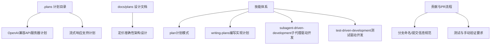
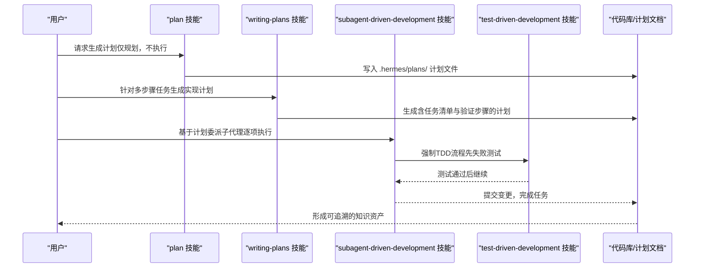
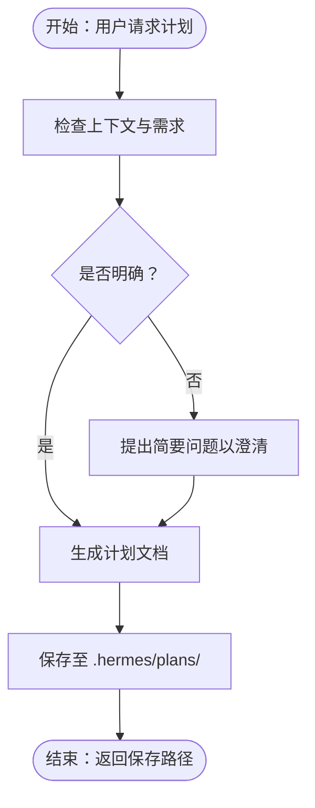
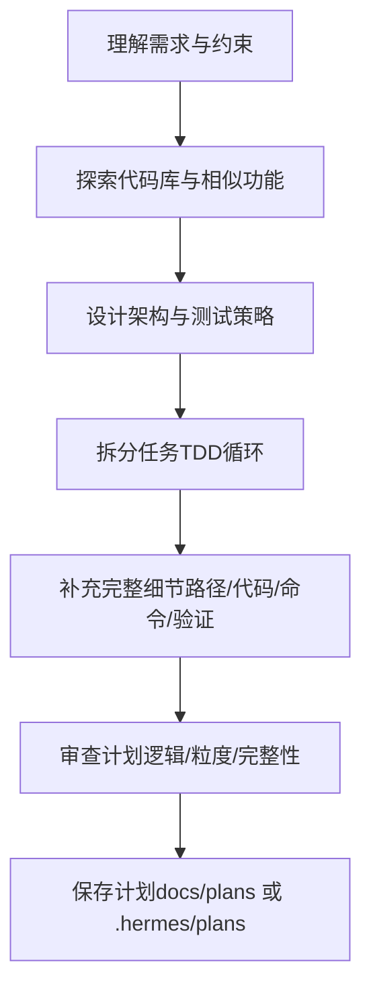
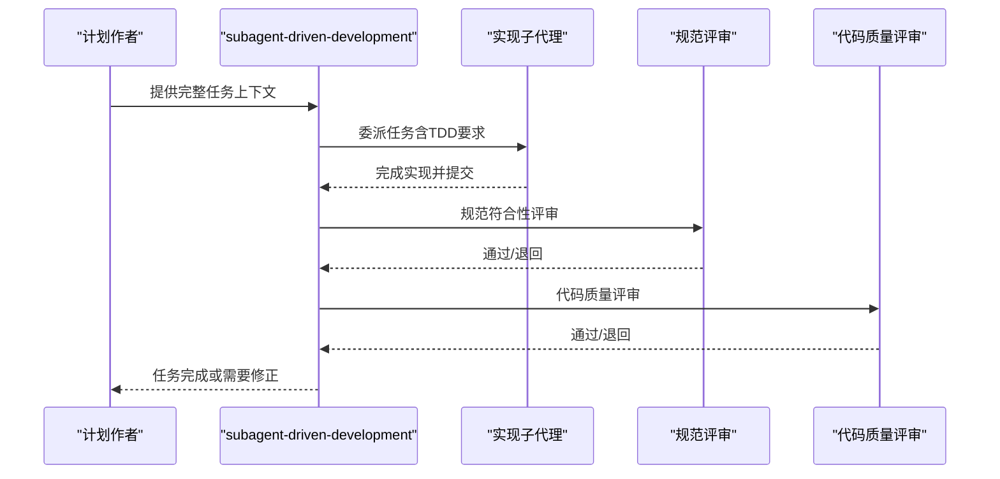
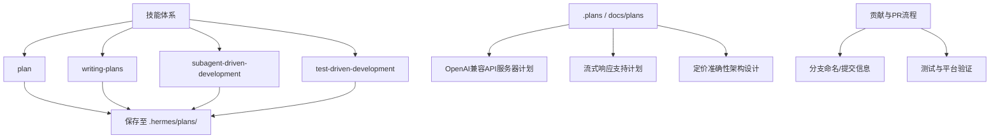

# 计划编写

<cite>
**本文档引用的文件**
- [README.md](file://README.md)
- [CONTRIBUTING.md](file://CONTRIBUTING.md)
- [AGENTS.md](file://AGENTS.md)
- [.plans/openai-api-server.md](file://.plans/openai-api-server.md)
- [.plans/streaming-support.md](file://.plans/streaming-support.md)
- [docs/plans/2026-03-16-pricing-accuracy-architecture-design.md](file://docs/plans/2026-03-16-pricing-accuracy-architecture-design.md)
- [skills/software-development/plan/SKILL.md](file://skills/software-development/plan/SKILL.md)
- [skills/software-development/writing-plans/SKILL.md](file://skills/software-development/writing-plans/SKILL.md)
- [skills/software-development/subagent-driven-development/SKILL.md](file://skills/software-development/subagent-driven-development/SKILL.md)
- [skills/software-development/test-driven-development/SKILL.md](file://skills/software-development/test-driven-development/SKILL.md)
- [website/docs/reference/skills-catalog.md](file://website/docs/reference/skills-catalog.md)
</cite>

## 目录
1. [简介](#简介)
2. [项目结构](#项目结构)
3. [核心组件](#核心组件)
4. [架构总览](#架构总览)
5. [详细组件分析](#详细组件分析)
6. [依赖关系分析](#依赖关系分析)
7. [性能考虑](#性能考虑)
8. [故障排除指南](#故障排除指南)
9. [结论](#结论)
10. [附录](#附录)

## 简介
本文件面向Hermes Agent计划编写场景，系统化阐述如何撰写高质量的开发计划文档，覆盖需求说明书、技术方案、项目计划、进度报告等各类文档的编写规范与模板；明确计划文档的结构组成、内容要求、格式标准与审核流程；解释不同计划类型（可行性研究、技术选型、风险评估、资源配置等）的特点与侧重点；提供写作技巧与实用模板，并总结版本管理、协作编辑与知识沉淀的最佳实践。本文以仓库中的计划文档与技能体系为依据，结合实际代码与文档，给出可操作的指导。

## 项目结构
Hermes Agent在计划与文档方面具备以下关键支撑：
- 计划文档存放：.plans 与 docs/plans 目录用于存放不同阶段的计划与设计文档
- 技能体系：提供“计划模式”“编写实现计划”“子代理驱动开发”“测试驱动开发”等技能，支撑从规划到执行的质量闭环
- 贡献与PR流程：统一的分支命名、提交信息规范、测试与平台验证要求，保障计划与实现的一致性

**图表来源**
- [.plans/openai-api-server.md:1-292](file://.plans/openai-api-server.md#L1-L292)
- [.plans/streaming-support.md:1-706](file://.plans/streaming-support.md#L1-L706)
- [docs/plans/2026-03-16-pricing-accuracy-architecture-design.md:1-609](file://docs/plans/2026-03-16-pricing-accuracy-architecture-design.md#L1-L609)
- [skills/software-development/plan/SKILL.md:1-58](file://skills/software-development/plan/SKILL.md#L1-L58)
- [skills/software-development/writing-plans/SKILL.md:1-297](file://skills/software-development/writing-plans/SKILL.md#L1-L297)
- [skills/software-development/subagent-driven-development/SKILL.md:53-89](file://skills/software-development/subagent-driven-development/SKILL.md#L53-L89)
- [skills/software-development/test-driven-development/SKILL.md:239-343](file://skills/software-development/test-driven-development/SKILL.md#L239-L343)
- [CONTRIBUTING.md:584-637](file://CONTRIBUTING.md#L584-L637)

**章节来源**
- [README.md:1-179](file://README.md#L1-L179)
- [CONTRIBUTING.md:584-637](file://CONTRIBUTING.md#L584-L637)

## 核心组件
围绕计划编写，Hermes Agent提供了以下关键能力：
- 计划模式（plan）：仅生成计划，不修改任何项目文件，输出保存在工作区的 .hermes/plans/ 下
- 编写实现计划（writing-plans）：面向多步骤任务，生成包含可执行任务、精确文件路径、完整代码示例与验证步骤的实现计划
- 子代理驱动开发（subagent-driven-development）：基于实现计划，逐项委派子代理执行，并进行两阶段评审（规范符合性与代码质量）
- 测试驱动开发（test-driven-development）：强制先写失败测试，再实现最小代码，确保质量与可维护性

上述技能与仓库中的计划文档共同构成“从规划到执行”的闭环，既满足高层设计的严谨性，也保证落地执行的可追踪性。

**章节来源**
- [skills/software-development/plan/SKILL.md:1-58](file://skills/software-development/plan/SKILL.md#L1-L58)
- [skills/software-development/writing-plans/SKILL.md:1-297](file://skills/software-development/writing-plans/SKILL.md#L1-L297)
- [skills/software-development/subagent-driven-development/SKILL.md:250-282](file://skills/software-development/subagent-driven-development/SKILL.md#L250-L282)
- [skills/software-development/test-driven-development/SKILL.md:239-343](file://skills/software-development/test-driven-development/SKILL.md#L239-L343)
- [website/docs/reference/skills-catalog.md:286-299](file://website/docs/reference/skills-catalog.md#L286-L299)

## 架构总览
下图展示了计划文档在Hermes Agent中的生成与执行架构：从“计划模式”或“编写实现计划”开始，到“子代理驱动开发”执行，再到“测试驱动开发”验证，最终形成可追溯的知识资产。

**图表来源**
- [skills/software-development/plan/SKILL.md:1-58](file://skills/software-development/plan/SKILL.md#L1-L58)
- [skills/software-development/writing-plans/SKILL.md:1-297](file://skills/software-development/writing-plans/SKILL.md#L1-L297)
- [skills/software-development/subagent-driven-development/SKILL.md:53-89](file://skills/software-development/subagent-driven-development/SKILL.md#L53-L89)
- [skills/software-development/test-driven-development/SKILL.md:284-343](file://skills/software-development/test-driven-development/SKILL.md#L284-L343)

## 详细组件分析

### 组件A：计划模式（plan）
- 角色定位：仅生成计划，不修改任何项目文件
- 输出位置：.hermes/plans/ 目录，按时间戳命名
- 适用场景：需求澄清、高层规划、跨团队沟通
- 关键约束：不可执行外部动作，仅生成可读文档

**图表来源**
- [skills/software-development/plan/SKILL.md:1-58](file://skills/software-development/plan/SKILL.md#L1-L58)

**章节来源**
- [skills/software-development/plan/SKILL.md:1-58](file://skills/software-development/plan/SKILL.md#L1-L58)

### 组件B：编写实现计划（writing-plans）
- 角色定位：面向多步骤任务，生成可执行的实现计划
- 结构要点：目标、架构、技术栈、任务清单、文件路径、测试与验证、风险与权衡
- 任务粒度：每项任务约2-5分钟，步骤清晰、文件路径精确、代码可复制、命令可复现
- 执行交接：完成后建议使用“子代理驱动开发”进行落地

**图表来源**
- [skills/software-development/writing-plans/SKILL.md:131-203](file://skills/software-development/writing-plans/SKILL.md#L131-L203)

**章节来源**
- [skills/software-development/writing-plans/SKILL.md:1-297](file://skills/software-development/writing-plans/SKILL.md#L1-L297)

### 组件C：子代理驱动开发（subagent-driven-development）
- 角色定位：执行实现计划，逐项委派子代理，两阶段评审（规范符合性→代码质量）
- 关键流程：读取完整任务文本→委派实现→评审→通过后合并
- 与TDD结合：在委派时明确TDD步骤，确保质量

**图表来源**
- [skills/software-development/subagent-driven-development/SKILL.md:53-89](file://skills/software-development/subagent-driven-development/SKILL.md#L53-L89)

**章节来源**
- [skills/software-development/subagent-driven-development/SKILL.md:250-282](file://skills/software-development/subagent-driven-development/SKILL.md#L250-L282)

### 组件D：测试驱动开发（test-driven-development）
- 规则：先写失败测试→运行验证失败→实现最小代码→运行验证通过→重构→提交
- 验证清单：每个新函数/方法都有测试；测试先失败；无回归；真实行为验证；边界与错误覆盖
- 与子代理结合：在委派任务时强制TDD流程，避免“先实现后测试”的反模式

**章节来源**
- [skills/software-development/test-driven-development/SKILL.md:239-343](file://skills/software-development/test-driven-development/SKILL.md#L239-L343)

### 组件E：计划文档模板与规范
- 模板来源：仓库中已有多个高质量计划文档，涵盖API服务、流式响应、定价架构等
- 共同特征：目标明确、现状与假设、方法论、步骤分解、文件影响面、测试与验证、风险与权衡
- 版本与协作：采用时间戳命名与集中存储，便于检索与回溯

**章节来源**
- [.plans/openai-api-server.md:1-292](file://.plans/openai-api-server.md#L1-L292)
- [.plans/streaming-support.md:1-706](file://.plans/streaming-support.md#L1-L706)
- [docs/plans/2026-03-16-pricing-accuracy-architecture-design.md:1-609](file://docs/plans/2026-03-16-pricing-accuracy-architecture-design.md#L1-L609)

## 依赖关系分析
计划编写在Hermes Agent中与以下模块存在强耦合关系：
- 技能系统：plan、writing-plans、subagent-driven-development、test-driven-development 四个技能协同，形成“规划→执行→验证”的闭环
- 文档与计划：.plans 与 docs/plans 目录承载不同阶段的计划与设计，便于版本化管理与知识沉淀
- 贡献流程：分支命名、提交信息、测试与平台验证要求，保障计划与实现的一致性与可追溯性

**图表来源**
- [skills/software-development/plan/SKILL.md:1-58](file://skills/software-development/plan/SKILL.md#L1-L58)
- [skills/software-development/writing-plans/SKILL.md:1-297](file://skills/software-development/writing-plans/SKILL.md#L1-L297)
- [skills/software-development/subagent-driven-development/SKILL.md:53-89](file://skills/software-development/subagent-driven-development/SKILL.md#L53-L89)
- [skills/software-development/test-driven-development/SKILL.md:239-343](file://skills/software-development/test-driven-development/SKILL.md#L239-L343)
- [.plans/openai-api-server.md:1-292](file://.plans/openai-api-server.md#L1-L292)
- [.plans/streaming-support.md:1-706](file://.plans/streaming-support.md#L1-L706)
- [docs/plans/2026-03-16-pricing-accuracy-architecture-design.md:1-609](file://docs/plans/2026-03-16-pricing-accuracy-architecture-design.md#L1-L609)
- [CONTRIBUTING.md:584-637](file://CONTRIBUTING.md#L584-L637)

**章节来源**
- [CONTRIBUTING.md:584-637](file://CONTRIBUTING.md#L584-L637)

## 性能考虑
- 计划粒度控制：任务越小，执行与评审成本越低，回滚与并行收益越高
- 评审效率：两阶段评审（规范→质量）可显著降低后期返工
- 自动化验证：在子代理执行过程中嵌入测试命令与验证步骤，减少人工干预
- 文档检索：统一的命名与目录结构（时间戳+语义化文件名）提升检索效率

## 故障排除指南
- 计划未保存或路径错误
  - 检查保存位置是否为 .hermes/plans/，并确认相对路径在不同后端（本地/容器/SSH/Modal/Daytona）下有效
  - 参考：[skills/software-development/plan/SKILL.md:42-51](file://skills/software-development/plan/SKILL.md#L42-L51)
- 计划过于宽泛或模糊
  - 使用“编写实现计划”技能，细化到精确文件路径、完整代码示例与可复现实验命令
  - 参考：[skills/software-development/writing-plans/SKILL.md:176-183](file://skills/software-development/writing-plans/SKILL.md#L176-L183)
- 执行阶段出现回归或边界问题
  - 强制TDD流程，确保每个功能点都有失败→通过的测试证据链
  - 参考：[skills/software-development/test-driven-development/SKILL.md:239-343](file://skills/software-development/test-driven-development/SKILL.md#L239-L343)
- 子代理执行中断或结果不一致
  - 明确两阶段评审机制，必要时重新委派任务并补充测试用例
  - 参考：[skills/software-development/subagent-driven-development/SKILL.md:53-89](file://skills/software-development/subagent-driven-development/SKILL.md#L53-L89)

**章节来源**
- [skills/software-development/plan/SKILL.md:42-51](file://skills/software-development/plan/SKILL.md#L42-L51)
- [skills/software-development/writing-plans/SKILL.md:176-183](file://skills/software-development/writing-plans/SKILL.md#L176-L183)
- [skills/software-development/test-driven-development/SKILL.md:239-343](file://skills/software-development/test-driven-development/SKILL.md#L239-L343)
- [skills/software-development/subagent-driven-development/SKILL.md:53-89](file://skills/software-development/subagent-driven-development/SKILL.md#L53-L89)

## 结论
Hermes Agent通过“计划模式”“编写实现计划”“子代理驱动开发”“测试驱动开发”四大技能，以及集中化的计划文档存储与严格的贡献流程，构建了从高层规划到落地执行的完整闭环。遵循本文档提供的结构、规范与最佳实践，可以高效产出高质量的计划文档，并将其转化为可追踪、可验证、可持续的知识资产。

## 附录

### 不同类型计划的特点与侧重点
- 可行性研究：聚焦业务价值、技术门槛与资源投入，强调“是否值得做”
- 技术选型：对比多种方案的优劣与约束，强调“选哪个更合适”
- 风险评估：识别技术、进度、资源与外部依赖风险，强调“如何规避与缓解”
- 资源配置：明确人员、工具、预算与时间窗口，强调“如何分配与监控”
- 实施计划：细化到可执行的任务、精确文件路径与验证步骤，强调“如何做、何时做、如何验”

### 计划文档结构与模板要点
- 头部信息：目标、现状与假设、方法论、技术栈
- 任务清单：目标明确、步骤清晰、文件路径精确、代码可复制、命令可复现
- 风险与权衡：列出关键风险、替代方案与取舍理由
- 验证与交付：测试清单、验收标准、交付物与里程碑

### 版本管理、协作编辑与知识沉淀最佳实践
- 版本管理：采用时间戳命名与集中存储，便于检索与回溯
- 协作编辑：使用统一的技能与流程（plan→writing-plans→subagent-driven-development→test-driven-development），减少歧义
- 知识沉淀：将计划与设计文档归档至 .plans 与 docs/plans，形成可检索的知识库

**章节来源**
- [.plans/openai-api-server.md:1-292](file://.plans/openai-api-server.md#L1-L292)
- [.plans/streaming-support.md:1-706](file://.plans/streaming-support.md#L1-L706)
- [docs/plans/2026-03-16-pricing-accuracy-architecture-design.md:1-609](file://docs/plans/2026-03-16-pricing-accuracy-architecture-design.md#L1-L609)
- [CONTRIBUTING.md:584-637](file://CONTRIBUTING.md#L584-L637)