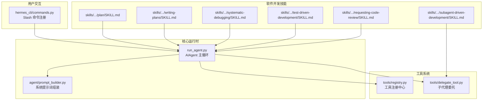
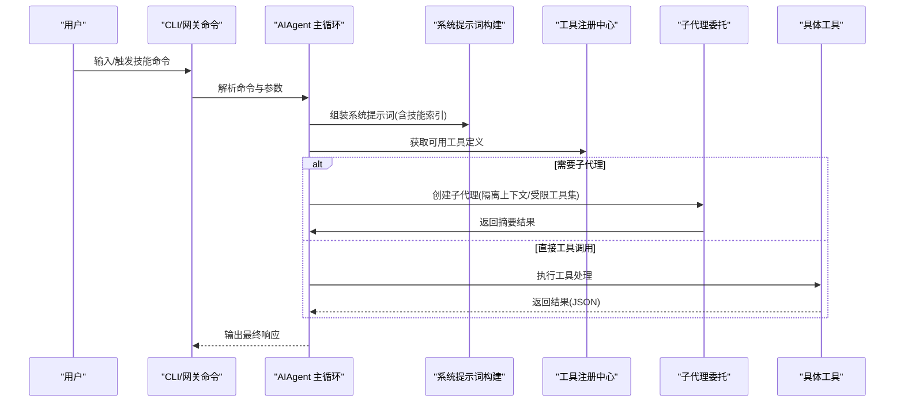
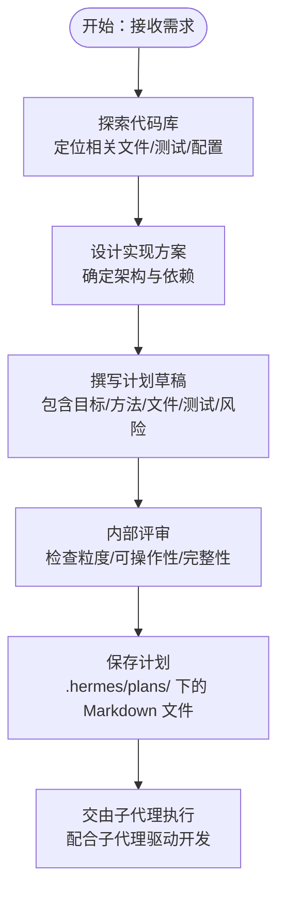
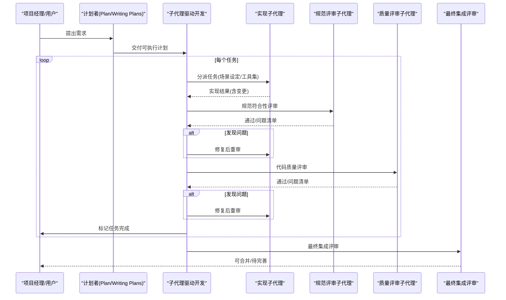
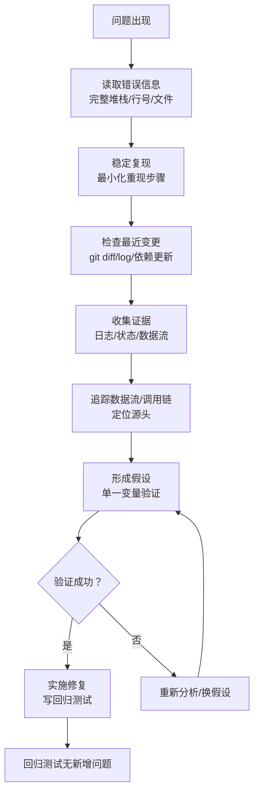
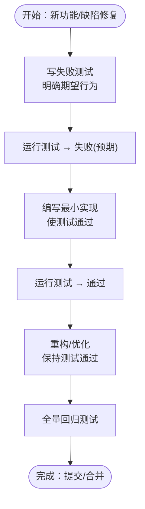
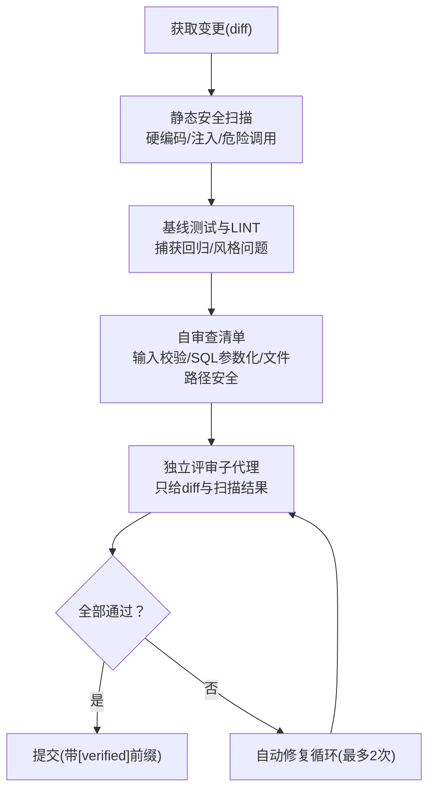
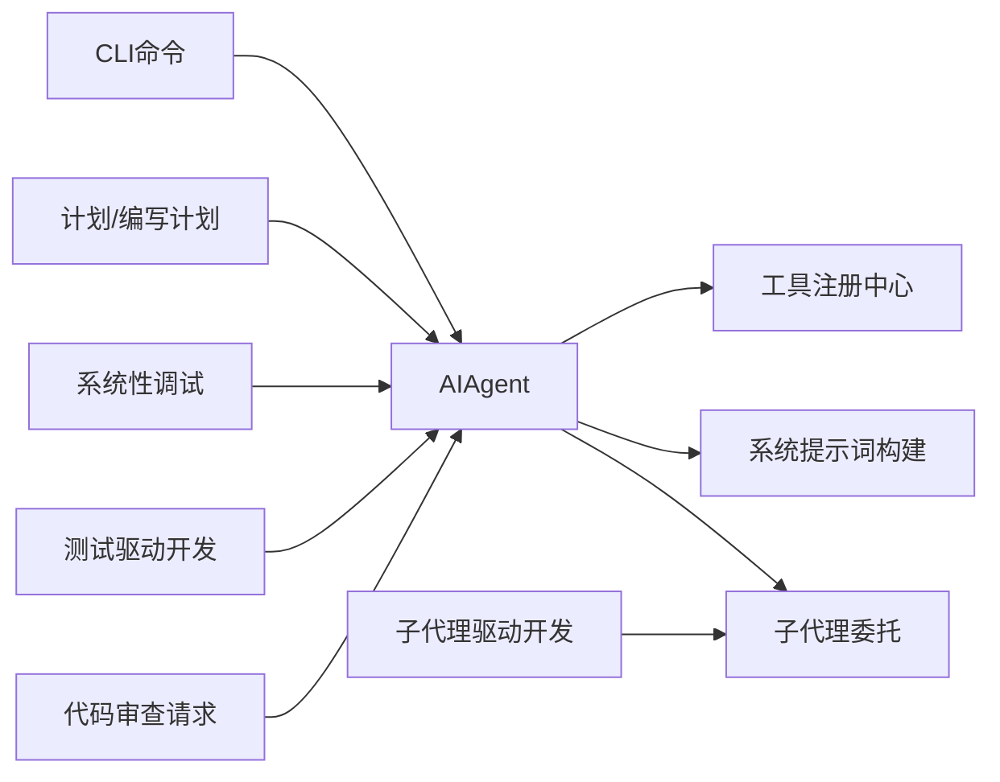

# 软件开发技能

<cite>
**本文引用的文件**
- [README.md](file://README.md)
- [CONTRIBUTING.md](file://CONTRIBUTING.md)
- [run_agent.py](file://run_agent.py)
- [agent/prompt_builder.py](file://agent/prompt_builder.py)
- [tools/registry.py](file://tools/registry.py)
- [hermes_cli/commands.py](file://hermes_cli/commands.py)
- [tools/delegate_tool.py](file://tools/delegate_tool.py)
- [skills/software-development/plan/SKILL.md](file://skills/software-development/plan/SKILL.md)
- [skills/software-development/writing-plans/SKILL.md](file://skills/software-development/writing-plans/SKILL.md)
- [skills/software-development/subagent-driven-development/SKILL.md](file://skills/software-development/subagent-driven-development/SKILL.md)
- [skills/software-development/systematic-debugging/SKILL.md](file://skills/software-development/systematic-debugging/SKILL.md)
- [skills/software-development/test-driven-development/SKILL.md](file://skills/software-development/test-driven-development/SKILL.md)
- [skills/software-development/requesting-code-review/SKILL.md](file://skills/software-development/requesting-code-review/SKILL.md)
</cite>

## 目录
1. [引言](#引言)
2. [项目结构](#项目结构)
3. [核心组件](#核心组件)
4. [架构总览](#架构总览)
5. [详细组件分析](#详细组件分析)
6. [依赖关系分析](#依赖关系分析)
7. [性能考量](#性能考量)
8. [故障排查指南](#故障排查指南)
9. [结论](#结论)
10. [附录](#附录)

## 引言
本文件面向Hermes Agent的软件开发技能体系，围绕“计划制定、代码审查请求、子代理驱动开发、系统性调试、测试驱动开发、计划编写”等关键能力，系统阐述其工作流程、最佳实践与应用场景，并结合项目中的实际实现（如AIAgent主循环、工具注册中心、子代理委托机制、系统提示词构建等）进行深入解析。同时，补充敏捷开发方法、代码质量管理、自动化测试与持续集成理念，以及软件开发生命周期（从需求分析到部署维护）的实践案例，帮助读者在真实工程中高效落地这些技能。

## 项目结构
Hermes Agent采用模块化与分层设计：核心运行时位于run_agent.py，工具系统通过集中注册中心统一管理，技能系统以可插拔方式注入到系统提示词中，CLI命令通过hermes_cli/commands.py统一注册与自动补全，子代理委托通过tools/delegate_tool.py实现隔离执行与并行调度。软件开发相关技能以skills/software-development目录下的多个技能文件形式存在，覆盖从计划到审查的完整闭环。

图示来源
- [run_agent.py](file://run_agent.py)
- [agent/prompt_builder.py](file://agent/prompt_builder.py)
- [tools/registry.py](file://tools/registry.py)
- [tools/delegate_tool.py](file://tools/delegate_tool.py)
- [hermes_cli/commands.py](file://hermes_cli/commands.py)
- [skills/software-development/plan/SKILL.md](file://skills/software-development/plan/SKILL.md)
- [skills/software-development/writing-plans/SKILL.md](file://skills/software-development/writing-plans/SKILL.md)
- [skills/software-development/subagent-driven-development/SKILL.md](file://skills/software-development/subagent-driven-development/SKILL.md)
- [skills/software-development/systematic-debugging/SKILL.md](file://skills/software-development/systematic-debugging/SKILL.md)
- [skills/software-development/test-driven-development/SKILL.md](file://skills/software-development/test-driven-development/SKILL.md)
- [skills/software-development/requesting-code-review/SKILL.md](file://skills/software-development/requesting-code-review/SKILL.md)

章节来源
- [README.md](file://README.md)
- [CONTRIBUTING.md](file://CONTRIBUTING.md)

## 核心组件
- AIAgent主循环：负责对话轮次、工具调用、上下文压缩与会话持久化，贯穿计划制定、子代理执行、系统性调试与测试驱动开发等流程。
- 工具注册中心：集中管理工具Schema与处理器，支持按工具集启用/禁用、可用性检查与异步桥接。
- 子代理委托：隔离上下文、限制工具集、并行执行任务，支持单任务与批量模式，保障父代仅看到摘要结果。
- 系统提示词构建：动态拼装身份、平台提示、技能索引、上下文文件与环境提示，确保模型遵循工具使用纪律与执行规范。
- CLI命令系统：统一的Slash命令注册、自动补全与平台映射，支撑技能命令与工具命令的无缝接入。

章节来源
- [run_agent.py](file://run_agent.py)
- [tools/registry.py](file://tools/registry.py)
- [tools/delegate_tool.py](file://tools/delegate_tool.py)
- [agent/prompt_builder.py](file://agent/prompt_builder.py)
- [hermes_cli/commands.py](file://hermes_cli/commands.py)

## 架构总览
下图展示从用户输入到工具执行与结果返回的关键路径，体现软件开发技能在系统中的位置与交互关系。

图示来源
- [run_agent.py](file://run_agent.py)
- [agent/prompt_builder.py](file://agent/prompt_builder.py)
- [tools/registry.py](file://tools/registry.py)
- [tools/delegate_tool.py](file://tools/delegate_tool.py)
- [hermes_cli/commands.py](file://hermes_cli/commands.py)

## 详细组件分析

### 计划制定与编写（Plan/Writing Plans）
- 计划模式（plan）：专注于生成可执行的Markdown计划，不直接执行，强调可操作性与可追踪性；输出保存在工作区的“.hermes/plans/”目录，便于版本控制与复核。
- 编写计划（writing-plans）：将复杂需求拆解为“可执行任务清单”，明确文件路径、测试命令、验证步骤与提交策略；强调“小步快跑、频繁提交”的工程实践。

图示来源
- [skills/software-development/plan/SKILL.md](file://skills/software-development/plan/SKILL.md)
- [skills/software-development/writing-plans/SKILL.md](file://skills/software-development/writing-plans/SKILL.md)

章节来源
- [skills/software-development/plan/SKILL.md](file://skills/software-development/plan/SKILL.md)
- [skills/software-development/writing-plans/SKILL.md](file://skills/software-development/writing-plans/SKILL.md)

### 子代理驱动开发（Subagent-Driven Development）
- 核心思想：每个任务一个子代理，两阶段评审（规范符合性 → 代码质量），确保高质量与快速迭代。
- 流程要点：读取计划 → 派发实现子代理 → 规范评审 → 质量评审 → 标记完成 → 最终集成评审 → 提交。
- 效率与成本权衡：子代理数量增加，但能早期发现问题，避免后期修复成本上升。

图示来源
- [skills/software-development/subagent-driven-development/SKILL.md](file://skills/software-development/subagent-driven-development/SKILL.md)
- [tools/delegate_tool.py](file://tools/delegate_tool.py)

章节来源
- [skills/software-development/subagent-driven-development/SKILL.md](file://skills/software-development/subagent-driven-development/SKILL.md)
- [tools/delegate_tool.py](file://tools/delegate_tool.py)

### 系统性调试（Systematic Debugging）
- 四阶段根因调查：根因调查 → 模式分析 → 假设与最小验证 → 实施修复。
- 关键原则：先理解再修复；在多组件系统中，先加诊断再定位失败边界；修复源头而非症状。
- 失败阈值：当尝试修复超过3次仍未解决，应质疑架构而非继续修补。

图示来源
- [skills/software-development/systematic-debugging/SKILL.md](file://skills/software-development/systematic-debugging/SKILL.md)

章节来源
- [skills/software-development/systematic-debugging/SKILL.md](file://skills/software-development/systematic-debugging/SKILL.md)

### 测试驱动开发（Test-Driven Development）
- 核心流程：红（写失败测试）→ 绿（最小实现通过）→ 红（重构保持绿）→ 黄（文档/规范）。
- 严禁行为：先写实现再写测试、测试立即通过、跳过TDD、删除已有测试。
- 与系统性调试联动：发现缺陷即刻写测试，系统性调试定位根因，TDD确保修复有效且不回退。

图示来源
- [skills/software-development/test-driven-development/SKILL.md](file://skills/software-development/test-driven-development/SKILL.md)

章节来源
- [skills/software-development/test-driven-development/SKILL.md](file://skills/software-development/test-driven-development/SKILL.md)

### 代码审查请求（Pre-Commit Code Verification）
- 自动化验证流水线：静态安全扫描 → 基线测试与LINT → 自身审查清单 → 独立评审子代理 → 结果评估与自动修复循环。
- 审查维度：安全问题（硬编码密钥、命令注入、反序列化风险）、逻辑错误（条件判断、异常处理、竞态）、风格与性能建议。
- 质量门禁：任一环节失败则阻断提交；最多两次自动修复循环，仍失败则升级人工介入。

图示来源
- [skills/software-development/requesting-code-review/SKILL.md](file://skills/software-development/requesting-code-review/SKILL.md)

章节来源
- [skills/software-development/requesting-code-review/SKILL.md](file://skills/software-development/requesting-code-review/SKILL.md)

### 系统提示词与技能注入（Prompt Builder 与 Skills Index）
- 技能索引：按平台与工具可用性过滤，构建紧凑的技能清单，避免无关技能干扰。
- 上下文文件安全：扫描潜在提示注入与隐藏字符，必要时阻断加载。
- 平台提示：针对不同消息平台给出格式与媒体发送指导，确保跨平台一致性。

章节来源
- [agent/prompt_builder.py](file://agent/prompt_builder.py)

### 工具系统与子代理委托
- 工具注册中心：统一Schema、处理器、可用性检查与异步桥接，支持工具集启用/禁用与UI元数据。
- 子代理委托：构建隔离上下文、受限工具集与专用系统提示，支持单任务与批量并行，心跳保活防止超时，完成后清理资源。

章节来源
- [tools/registry.py](file://tools/registry.py)
- [tools/delegate_tool.py](file://tools/delegate_tool.py)

## 依赖关系分析
- 运行时依赖：AIAgent依赖工具注册中心获取工具定义，依赖系统提示词构建器拼装上下文，依赖子代理委托执行复杂任务。
- 技能依赖：计划与审查技能依赖CLI命令系统与工具系统；子代理驱动开发依赖委托工具；系统性调试与TDD贯穿各环节。
- 平台依赖：CLI命令系统对不同平台（Telegram、Discord等）提供菜单与映射，确保命令一致体验。

图示来源
- [run_agent.py](file://run_agent.py)
- [tools/registry.py](file://tools/registry.py)
- [agent/prompt_builder.py](file://agent/prompt_builder.py)
- [tools/delegate_tool.py](file://tools/delegate_tool.py)
- [hermes_cli/commands.py](file://hermes_cli/commands.py)

章节来源
- [run_agent.py](file://run_agent.py)
- [tools/registry.py](file://tools/registry.py)
- [agent/prompt_builder.py](file://agent/prompt_builder.py)
- [tools/delegate_tool.py](file://tools/delegate_tool.py)
- [hermes_cli/commands.py](file://hermes_cli/commands.py)

## 性能考量
- 工具并行执行：基于工具类型与路径作用域判定是否可并行，避免冲突；限制最大并发线程数，降低资源争用。
- 上下文压缩：接近上下文上限时自动压缩，减少重复计算与传输成本。
- 子代理预算：子代理拥有独立迭代预算，避免父代预算被子任务过度消耗。
- 提示词缓存：技能索引与快照缓存减少冷启动时间，提升提示词构建效率。

章节来源
- [run_agent.py](file://run_agent.py)
- [agent/prompt_builder.py](file://agent/prompt_builder.py)

## 故障排查指南
- 常见问题
  - 工具不可用：检查工具可用性检查函数与工具集启用状态。
  - 子代理无法启动：确认深度限制、并发数配置与凭证继承。
  - 提示词注入阻断：检查上下文文件内容与威胁模式匹配。
  - 超时与中断：确认心跳机制与活动跟踪，必要时调整超时阈值。
- 排查步骤
  - 启用详细日志，定位错误来源（工具/子代理/提示词）。
  - 使用系统性调试四阶段逐步缩小范围。
  - 对比基线测试结果，确认回归引入点。
  - 在子代理中最小化复现实例，隔离问题。

章节来源
- [CONTRIBUTING.md](file://CONTRIBUTING.md)
- [skills/software-development/systematic-debugging/SKILL.md](file://skills/software-development/systematic-debugging/SKILL.md)

## 结论
Hermes Agent的软件开发技能体系以“计划—执行—评审—验证”为主线，结合子代理隔离执行、系统性调试与测试驱动开发，形成高可靠、可追溯、可扩展的工程实践框架。通过工具注册中心与系统提示词构建，技能得以动态注入与精准筛选；借助CLI命令系统与平台适配，用户体验与一致性得到保障。在实际项目中，建议以Writing Plans产出可执行计划，以Subagent-Driven Development落实执行与评审，以Systematic Debugging与TDD保证质量，以Requesting Code Review建立质量门禁，从而实现敏捷、稳健的持续交付。

## 附录
- 开发生命周期案例
  - 需求分析：使用Writing Plans将需求拆解为可执行任务，明确文件与测试。
  - 设计与计划：使用Plan技能生成可追踪的Markdown计划，纳入风险与验证。
  - 编码实现：以TDD驱动，先写失败测试，再实现并通过；子代理执行具体任务。
  - 测试验证：运行基线测试与LINT，静态扫描与独立评审子代理双重把关。
  - 部署维护：通过Pre-Commit审查与自动化流水线合并；上线后持续监控与回归测试。
- 开发规范与效率提升
  - 规范：遵循PEP 8、注释仅解释非显而易见意图、错误处理捕获具体异常。
  - 安全：避免shell注入、路径穿越与敏感信息泄露；危险命令需审批。
  - 效率：使用子代理并行执行、工具并行化、提示词缓存与上下文压缩；以CLI命令与自动补全提升交互效率。

章节来源
- [CONTRIBUTING.md](file://CONTRIBUTING.md)
- [README.md](file://README.md)