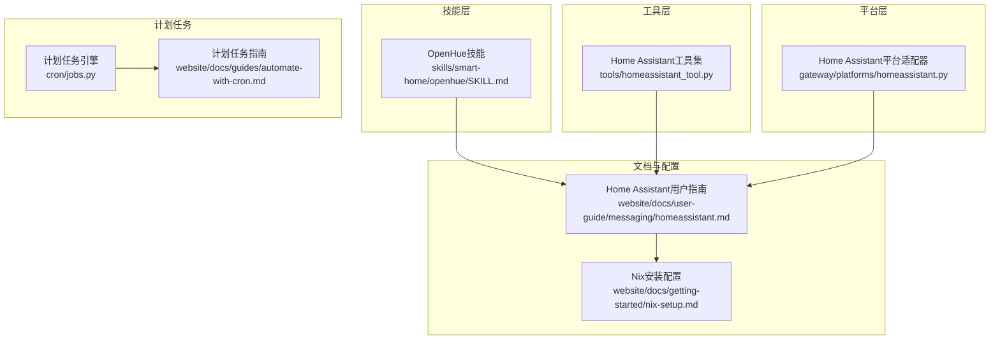
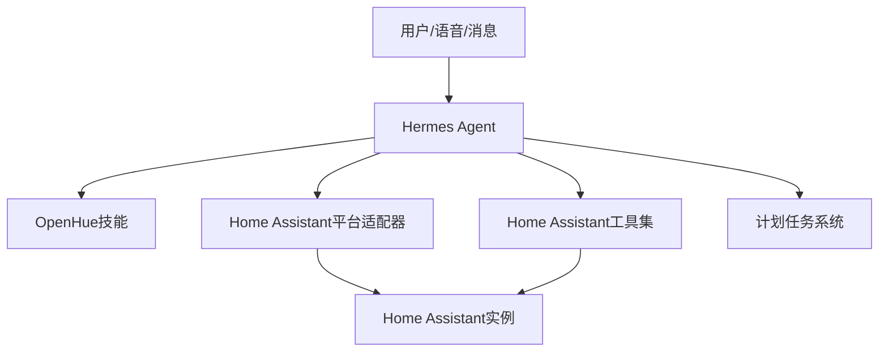
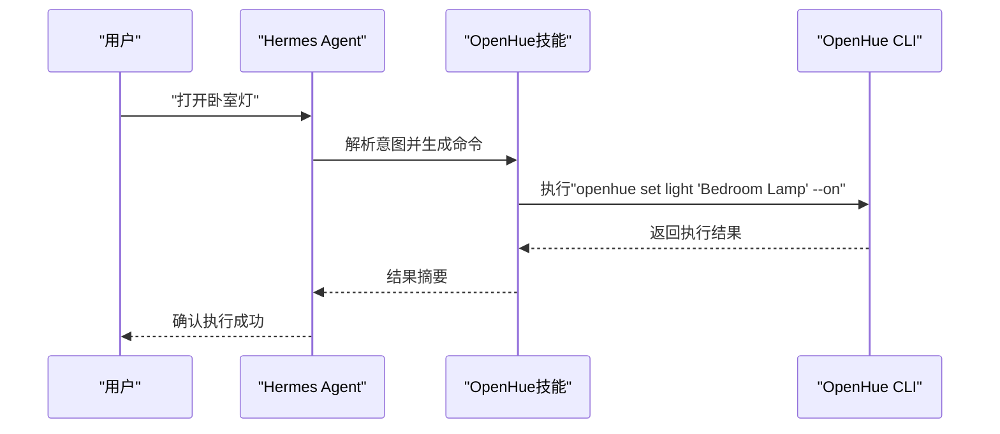
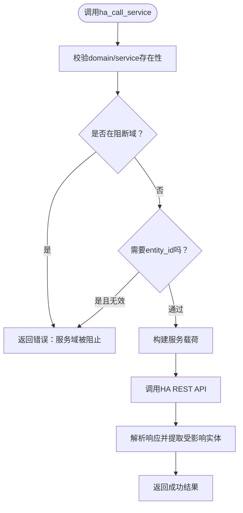
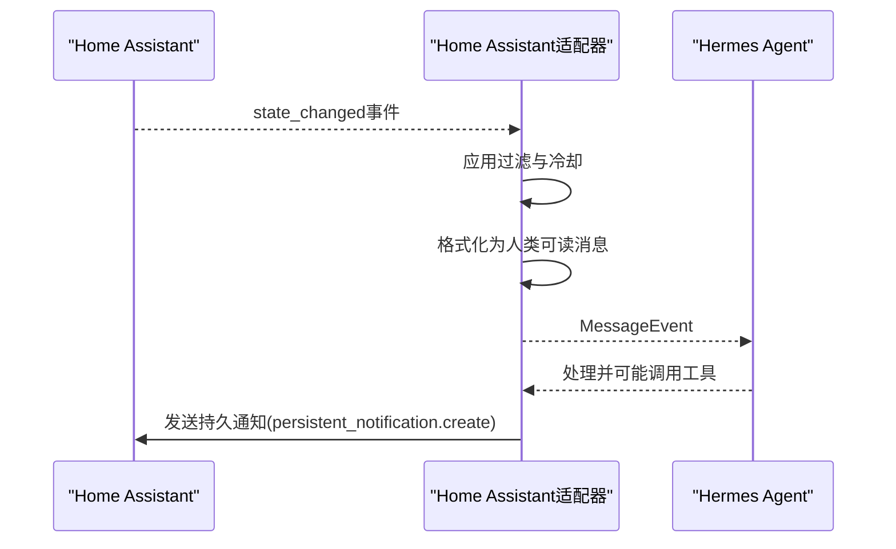
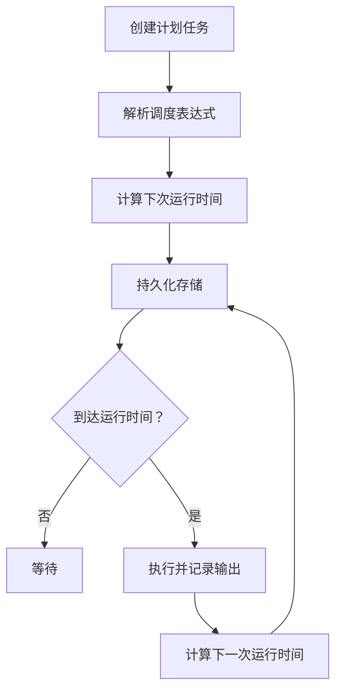
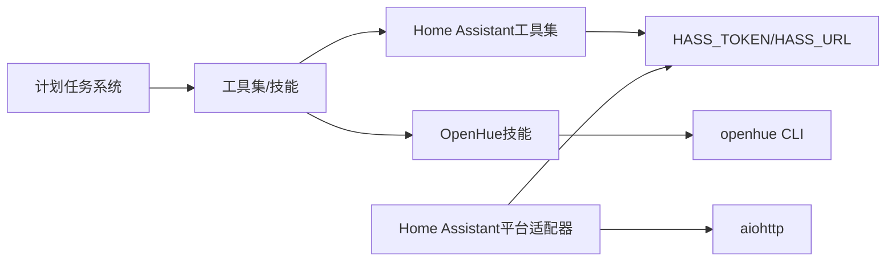

# 智能家居技能

<cite>
**本文档引用的文件**
- [SKILL.md](file://skills/smart-home/openhue/SKILL.md)
- [DESCRIPTION.md（智能家庭）](file://skills/smart-home/DESCRIPTION.md)
- [homeassistant.md（用户指南）](file://website/docs/user-guide/messaging/homeassistant.md)
- [homeassistant.py（平台适配器）](file://gateway/platforms/homeassistant.py)
- [homeassistant_tool.py（工具模块）](file://tools/homeassistant_tool.py)
- [test_homeassistant_tool.py（工具测试）](file://tests/tools/test_homeassistant_tool.py)
- [jobs.py（计划任务）](file://cron/jobs.py)
- [automate-with-cron.md（计划任务指南）](file://website/docs/guides/automate-with-cron.md)
- [cli.py（命令行接口）](file://cli.py)
- [main.py（Hermes CLI主程序）](file://hermes_cli/main.py)
- [run.py（网关运行入口）](file://gateway/run.py)
- [pairing.py（配对与安全）](file://gateway/pairing.py)
- [nix-setup.md（Nix安装配置）](file://website/docs/getting-started/nix-setup.md)
</cite>

## 目录
1. [简介](#简介)
2. [项目结构](#项目结构)
3. [核心组件](#核心组件)
4. [架构总览](#架构总览)
5. [详细组件分析](#详细组件分析)
6. [依赖关系分析](#依赖关系分析)
7. [性能考虑](#性能考虑)
8. [故障排除指南](#故障排除指南)
9. [结论](#结论)
10. [附录](#附录)

## 简介
本文件面向Hermes Agent的智能家居技能，重点覆盖以下内容：
- OpenHue智能家居控制系统技能的使用方法与配置流程
- 智能家居设备的连接、控制与管理能力：灯光控制、温度调节、安全监控等
- 场景设置、自动化规则配置与设备联动的实现思路
- 系统部署指南：设备兼容性检查、网络配置、安全设置
- 常见问题解决方案与性能优化建议

Hermes Agent同时支持两类智能家居集成路径：
- 通过Home Assistant工具集进行REST API控制与查询
- 通过OpenHue CLI直接控制Philips Hue设备

## 项目结构
智能家居相关的核心位置如下：
- 技能层：skills/smart-home/openhue 提供OpenHue CLI技能定义与使用说明
- 工具层：tools/homeassistant_tool.py 提供四个LLM可调用的Home Assistant工具
- 平台层：gateway/platforms/homeassistant.py 提供Home Assistant网关平台适配器
- 计划任务：cron/jobs.py 与网站指南提供定时自动化能力
- 文档：website/docs/user-guide/messaging/homeassistant.md 提供完整使用指南

**图表来源**
- [SKILL.md:1-109](file://skills/smart-home/openhue/SKILL.md#L1-L109)
- [homeassistant.md（用户指南）:1-253](file://website/docs/user-guide/messaging/homeassistant.md#L1-L253)
- [homeassistant.py（平台适配器）:1-450](file://gateway/platforms/homeassistant.py#L1-L450)
- [homeassistant_tool.py（工具模块）:1-491](file://tools/homeassistant_tool.py#L1-L491)
- [jobs.py（计划任务）:1-763](file://cron/jobs.py#L1-L763)
- [automate-with-cron.md（计划任务指南）:205-262](file://website/docs/guides/automate-with-cron.md#L205-L262)

**章节来源**
- [SKILL.md:1-109](file://skills/smart-home/openhue/SKILL.md#L1-L109)
- [DESCRIPTION.md（智能家庭）:1-4](file://skills/smart-home/DESCRIPTION.md#L1-L4)
- [homeassistant.md（用户指南）:1-253](file://website/docs/user-guide/messaging/homeassistant.md#L1-L253)

## 核心组件
- OpenHue技能：提供Philips Hue灯光、房间与场景的CLI控制能力，支持亮度、颜色、色温等参数调整，以及场景激活。
- Home Assistant工具集：注册四个LLM可调用工具，用于实体列表查询、状态获取、服务列表查询与服务调用。
- Home Assistant平台适配器：通过WebSocket订阅HA事件，按配置过滤事件并转发给代理；支持自动重连与事件格式化。
- 计划任务系统：提供人类可读的调度表达式解析、作业生命周期管理与输出存储。

**章节来源**
- [SKILL.md:1-109](file://skills/smart-home/openhue/SKILL.md#L1-L109)
- [homeassistant_tool.py（工具模块）:1-491](file://tools/homeassistant_tool.py#L1-L491)
- [homeassistant.py（平台适配器）:1-450](file://gateway/platforms/homeassistant.py#L1-L450)
- [jobs.py（计划任务）:1-763](file://cron/jobs.py#L1-L763)

## 架构总览
Hermes Agent的智能家居架构由“技能层”“工具层”“平台层”“计划任务”四部分协同组成：

**图表来源**
- [homeassistant.py（平台适配器）:1-450](file://gateway/platforms/homeassistant.py#L1-L450)
- [homeassistant_tool.py（工具模块）:1-491](file://tools/homeassistant_tool.py#L1-L491)
- [homeassistant.md（用户指南）:1-253](file://website/docs/user-guide/messaging/homeassistant.md#L1-L253)
- [jobs.py（计划任务）:1-763](file://cron/jobs.py#L1-L763)

## 详细组件分析

### OpenHue技能
- 功能概述：通过OpenHue CLI控制Philips Hue灯光、房间与场景，支持开关、亮度、颜色、色温等参数调整，以及场景激活。
- 安装与配对：Linux/macOS分别提供预编译二进制与包管理器安装方式；首次运行需在Hue桥上按下配对按钮。
- 使用场景：灯光开关与亮度调节、颜色与色温设置、房间级控制、场景激活、结合计划任务实现定时照明。

**图表来源**
- [SKILL.md:31-109](file://skills/smart-home/openhue/SKILL.md#L31-L109)

**章节来源**
- [SKILL.md:1-109](file://skills/smart-home/openhue/SKILL.md#L1-L109)

### Home Assistant工具集
- 工具清单：
  - ha_list_entities：按域或区域过滤列出实体
  - ha_get_state：获取单个实体的详细状态与属性
  - ha_list_services：列出可用服务及其参数
  - ha_call_service：调用服务控制设备
- 安全机制：禁止调用危险服务域（如shell_command、hassio等），校验entity_id格式，基于HASS_TOKEN进行认证。
- 可用性：当未设置HASS_TOKEN时，工具集不被注册到代理。

**图表来源**
- [homeassistant_tool.py（工具模块）:44-51](file://tools/homeassistant_tool.py#L44-L51)
- [homeassistant_tool.py（工具模块）:242-266](file://tools/homeassistant_tool.py#L242-L266)

**章节来源**
- [homeassistant_tool.py（工具模块）:1-491](file://tools/homeassistant_tool.py#L1-L491)
- [test_homeassistant_tool.py（工具测试）:216-251](file://tests/tools/test_homeassistant_tool.py#L216-L251)

### Home Assistant平台适配器
- 连接与认证：通过WebSocket连接HA，使用Long-Lived Access Token进行鉴权；订阅state_changed事件。
- 事件过滤：支持按域、实体ID过滤与忽略列表；支持冷却时间避免事件风暴。
- 自动重连：指数退避重连策略（5s→10s→30s→60s）。
- 出站消息：通过REST API发送持久通知，标题为“Hermes Agent”。

**图表来源**
- [homeassistant.py（平台适配器）:217-318](file://gateway/platforms/homeassistant.py#L217-L318)
- [homeassistant.py（平台适配器）:386-439](file://gateway/platforms/homeassistant.py#L386-L439)

**章节来源**
- [homeassistant.py（平台适配器）:1-450](file://gateway/platforms/homeassistant.py#L1-L450)

### 计划任务系统（Cron）
- 调度解析：支持“每X分钟/小时/天”“一次性延迟”“Cron表达式”“指定时间戳”等多种格式。
- 生命周期：创建、暂停/恢复、触发、删除、输出保存与交付目标配置。
- 容错与幂等：对一次性任务提供宽限期，对周期性任务提供“快进”策略避免重启后大量错过任务重放。

**图表来源**
- [jobs.py（计划任务）:117-203](file://cron/jobs.py#L117-L203)
- [jobs.py（计划任务）:284-313](file://cron/jobs.py#L284-L313)
- [automate-with-cron.md（计划任务指南）:205-262](file://website/docs/guides/automate-with-cron.md#L205-L262)

**章节来源**
- [jobs.py（计划任务）:1-763](file://cron/jobs.py#L1-L763)
- [automate-with-cron.md（计划任务指南）:205-262](file://website/docs/guides/automate-with-cron.md#L205-L262)
- [cli.py（命令行接口）:4969-5000](file://cli.py#L4969-L5000)
- [main.py（Hermes CLI主程序）:4874-4889](file://hermes_cli/main.py#L4874-L4889)

## 依赖关系分析
- OpenHue技能依赖本地系统已安装的openhue CLI，并要求Hue桥处于同一局域网。
- Home Assistant工具集与平台适配器均依赖HASS_TOKEN环境变量；平台适配器还依赖aiohttp。
- 计划任务系统独立于智能家居平台，但可与工具集配合实现自动化。

**图表来源**
- [SKILL.md:11-29](file://skills/smart-home/openhue/SKILL.md#L11-L29)
- [homeassistant_tool.py（工具模块）:31-36](file://tools/homeassistant_tool.py#L31-L36)
- [homeassistant.py（平台适配器）:24-29](file://gateway/platforms/homeassistant.py#L24-L29)

**章节来源**
- [SKILL.md:11-29](file://skills/smart-home/openhue/SKILL.md#L11-L29)
- [homeassistant_tool.py（工具模块）:31-36](file://tools/homeassistant_tool.py#L31-L36)
- [homeassistant.py（平台适配器）:24-29](file://gateway/platforms/homeassistant.py#L24-L29)

## 性能考虑
- 事件风暴防护：平台适配器提供冷却时间配置，避免高频状态变化导致的消息洪泛。
- 自动重连与心跳：WebSocket 30秒心跳与指数退避重连，提升连接稳定性。
- 工具调用超时：REST API调用设置合理超时，避免阻塞主线程。
- 计划任务快进策略：对周期性任务在长时间离线后采用“快进”而非重放，减少系统压力。
- 网络偏好：可通过配置强制IPv4以改善某些网络环境下的连接稳定性。

**章节来源**
- [homeassistant.py（平台适配器）:63-63](file://gateway/platforms/homeassistant.py#L63-L63)
- [homeassistant.py（平台适配器）:232-246](file://gateway/platforms/homeassistant.py#L232-L246)
- [run.py（网关运行入口）:211-218](file://gateway/run.py#L211-L218)
- [jobs.py（计划任务）:252-282](file://cron/jobs.py#L252-L282)

## 故障排除指南
- OpenHue无法连接
  - 确认openhue CLI已正确安装并可执行
  - 首次运行需在Hue桥上按下配对按钮
  - 确保Hue桥与运行Hermes的机器在同一局域网
- Home Assistant工具不可用
  - 检查HASS_TOKEN是否设置且有效
  - 确认HASS_URL指向正确的HA实例地址
- 平台事件未转发
  - 在配置中至少设置watch_domains、watch_entities或watch_all之一
  - 合理设置ignore_entities与cooldown_seconds
- WebSocket频繁断开
  - 检查网络稳定性与防火墙设置
  - 观察日志中的重连信息，确认退避策略生效
- 计划任务未执行
  - 使用/cron list查看任务状态
  - 使用/cron run立即触发测试
  - 检查调度表达式与交付目标配置

**章节来源**
- [SKILL.md:29-29](file://skills/smart-home/openhue/SKILL.md#L29-L29)
- [homeassistant.md（用户指南）:129-164](file://website/docs/user-guide/messaging/homeassistant.md#L129-L164)
- [homeassistant.py（平台适配器）:121-128](file://gateway/platforms/homeassistant.py#L121-L128)
- [automate-with-cron.md（计划任务指南）:205-262](file://website/docs/guides/automate-with-cron.md#L205-L262)

## 结论
Hermes Agent提供了两条智能家居集成路径：OpenHue CLI与Home Assistant工具集/平台。前者适合Hue生态的快速控制，后者则提供更广泛的设备控制与实时事件联动能力。通过计划任务系统，用户可以轻松实现定时自动化与场景联动。在部署时，应优先确保认证令牌正确配置、网络连通性良好，并根据实际需求设置事件过滤与冷却策略，以获得稳定高效的智能家居体验。

## 附录

### 部署与配置要点
- OpenHue
  - 安装CLI并完成Hue桥配对
  - 使用技能提供的常用命令进行灯光、房间与场景控制
- Home Assistant
  - 创建Long-Lived Access Token并配置HASS_TOKEN/HASS_URL
  - 启动网关后HA作为平台出现
  - 在配置中设置事件过滤与冷却参数
- 计划任务
  - 使用/cron命令创建、编辑、运行与删除任务
  - 支持多种调度表达式与交付目标

**章节来源**
- [homeassistant.md（用户指南）:15-47](file://website/docs/user-guide/messaging/homeassistant.md#L15-L47)
- [automate-with-cron.md（计划任务指南）:205-262](file://website/docs/guides/automate-with-cron.md#L205-L262)
- [nix-setup.md（Nix安装配置）:705-720](file://website/docs/getting-started/nix-setup.md#L705-L720)