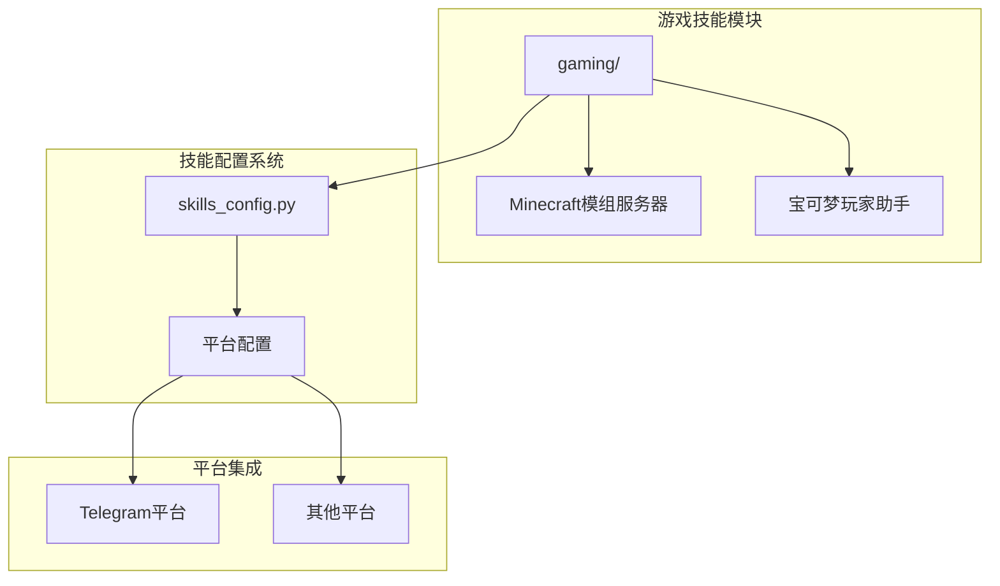
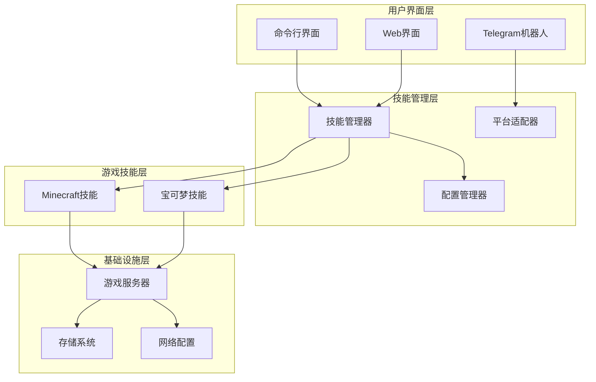
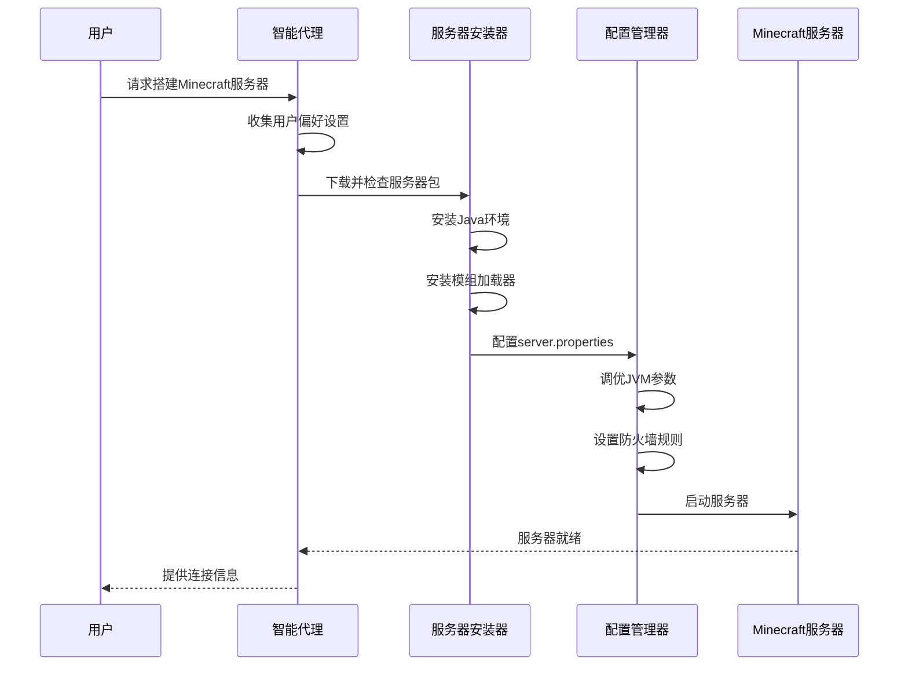
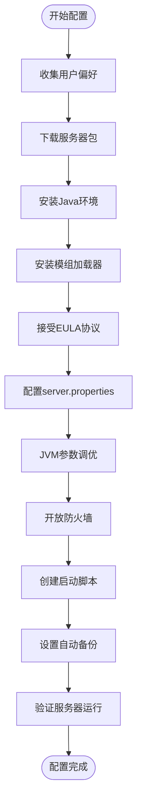
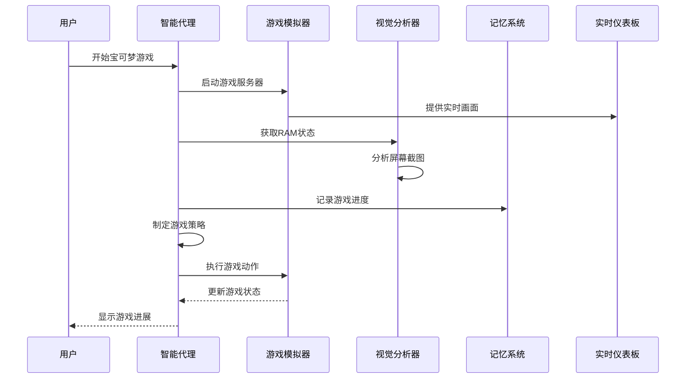
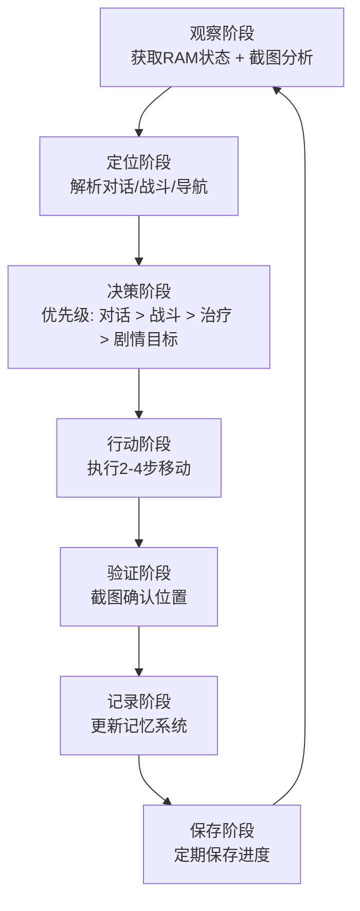
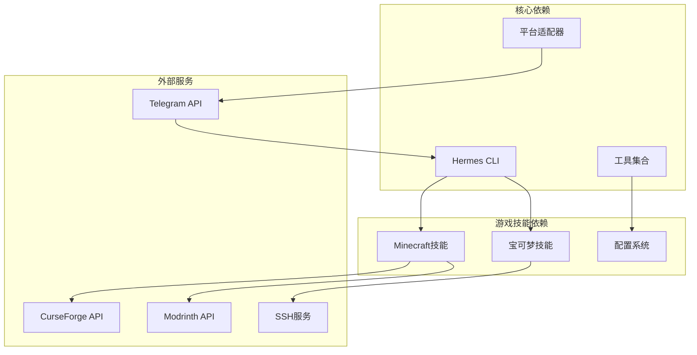

# 游戏娱乐技能

<cite>
**本文档引用的文件**
- [技能目录](file://website/docs/reference/skills-catalog.md)
- [游戏技能描述](file://skills/gaming/DESCRIPTION.md)
- [Minecraft模组服务器技能](file://skills/gaming/minecraft-modpack-server/SKILL.md)
- [宝可梦玩家助手技能](file://skills/gaming/pokemon-player/SKILL.md)
- [技能配置模块](file://hermes_cli/skills_config.py)
- [Telegram平台适配器](file://gateway/platforms/telegram.py)
</cite>

## 目录
1. [简介](#简介)
2. [项目结构](#项目结构)
3. [核心组件](#核心组件)
4. [架构概览](#架构概览)
5. [详细组件分析](#详细组件分析)
6. [依赖关系分析](#依赖关系分析)
7. [性能考虑](#性能考虑)
8. [故障排除指南](#故障排除指南)
9. [结论](#结论)
10. [附录](#附录)

## 简介

Hermes Agent的游戏娱乐技能模块提供了两个核心功能：Minecraft模组服务器管理和宝可梦玩家助手技能。这些技能旨在简化游戏服务器的部署和管理，同时为用户提供自动化的游戏体验。

Minecraft模组服务器技能专注于帮助用户从CurseForge/Modrinth服务器包快速搭建modded服务器，涵盖Java版本管理、JVM调优、防火墙配置、备份策略和启动脚本创建等完整流程。

宝可梦玩家助手技能则通过headless模拟实现自动游戏体验，支持ROM文件加载、实时状态监控、智能决策制定和远程可视化等功能。

## 项目结构

游戏娱乐技能在Hermes Agent中的组织结构如下：

**图表来源**
- [技能目录:75-82](file://website/docs/reference/skills-catalog.md#L75-L82)
- [游戏技能描述:1-4](file://skills/gaming/DESCRIPTION.md#L1-L4)

**章节来源**
- [技能目录:75-82](file://website/docs/reference/skills-catalog.md#L75-L82)
- [游戏技能描述:1-4](file://skills/gaming/DESCRIPTION.md#L1-L4)

## 核心组件

### Minecraft模组服务器技能

该技能提供了完整的Minecraft服务器部署解决方案，包括：

- **服务器包下载与检查**：支持从CurseForge/Modrinth下载和验证服务器包
- **Java环境管理**：根据Minecraft版本自动选择合适的Java版本
- **模组加载器安装**：支持NeoForge和Forge服务器安装
- **服务器配置优化**：自动配置server.properties文件
- **JVM参数调优**：针对不同硬件配置优化内存分配
- **防火墙设置**：自动配置端口访问权限
- **自动化备份**：设置定时备份策略
- **启动脚本生成**：创建一键启动脚本

### 宝可梦玩家助手技能

该技能实现了基于emulation的AI游戏助手：

- **头文件模拟**：使用pokemon-agent包进行无头游戏模拟
- **状态监控**：实时读取RAM中的游戏状态
- **视觉分析**：结合截图和视觉模型进行空间感知
- **智能决策**：基于游戏状态制定行动策略
- **远程可视化**：通过SSH反向隧道提供实时游戏画面
- **存档管理**：支持游戏进度保存和恢复
- **战斗策略**：内置宝可梦对战决策树

**章节来源**
- [Minecraft模组服务器技能:1-187](file://skills/gaming/minecraft-modpack-server/SKILL.md#L1-L187)
- [宝可梦玩家助手技能:1-216](file://skills/gaming/pokemon-player/SKILL.md#L1-L216)

## 架构概览

游戏娱乐技能的系统架构采用分层设计：

**图表来源**
- [技能配置模块:125-178](file://hermes_cli/skills_config.py#L125-L178)
- [Telegram平台适配器:114-200](file://gateway/platforms/telegram.py#L114-L200)

## 详细组件分析

### Minecraft模组服务器技能架构

**图表来源**
- [Minecraft模组服务器技能:32-62](file://skills/gaming/minecraft-modpack-server/SKILL.md#L32-L62)
- [Minecraft模组服务器技能:93-137](file://skills/gaming/minecraft-modpack-server/SKILL.md#L93-L137)

#### 关键配置流程

**图表来源**
- [Minecraft模组服务器技能:14-28](file://skills/gaming/minecraft-modpack-server/SKILL.md#L14-L28)
- [Minecraft模组服务器技能:32-187](file://skills/gaming/minecraft-modpack-server/SKILL.md#L32-L187)

**章节来源**
- [Minecraft模组服务器技能:1-187](file://skills/gaming/minecraft-modpack-server/SKILL.md#L1-L187)

### 宝可梦玩家助手技能架构

**图表来源**
- [宝可梦玩家助手技能:31-44](file://skills/gaming/pokemon-player/SKILL.md#L31-L44)
- [宝可梦玩家助手技能:68-94](file://skills/gaming/pokemon-player/SKILL.md#L68-L94)

#### 游戏进程循环

**图表来源**
- [宝可梦玩家助手技能:68-94](file://skills/gaming/pokemon-player/SKILL.md#L68-L94)
- [宝可梦玩家助手技能:155-178](file://skills/gaming/pokemon-player/SKILL.md#L155-L178)

**章节来源**
- [宝可梦玩家助手技能:1-216](file://skills/gaming/pokemon-player/SKILL.md#L1-L216)

## 依赖关系分析

游戏娱乐技能的依赖关系体现了模块化设计原则：

**图表来源**
- [技能配置模块:1-178](file://hermes_cli/skills_config.py#L1-L178)
- [Telegram平台适配器:1-200](file://gateway/platforms/telegram.py#L1-L200)

**章节来源**
- [技能配置模块:1-178](file://hermes_cli/skills_config.py#L1-L178)
- [Telegram平台适配器:1-200](file://gateway/platforms/telegram.py#L1-L200)

## 性能考虑

### Minecraft服务器性能优化

Minecraft模组服务器技能在性能方面提供了多层优化：

- **内存分配策略**：根据模组数量和玩家数量动态调整JVM堆大小
- **视距优化**：根据硬件配置自动调整视距和模拟距离
- **垃圾回收调优**：使用G1垃圾回收器优化大型模组服务器的内存管理
- **启动时间优化**：通过清理启动脚本避免不必要的重启循环

### 宝可梦游戏性能优化

宝可梦玩家助手技能在性能方面考虑了以下因素：

- **视觉分析频率控制**：限制截图频率以平衡精度和性能
- **内存使用优化**：合理管理游戏状态缓存
- **网络延迟处理**：通过SSH隧道优化远程可视化性能

## 故障排除指南

### Minecraft服务器常见问题

**问题1：服务器启动缓慢**
- 检查初始世界生成时间
- 确认JVM参数配置是否合理
- 验证硬件资源是否充足

**问题2：玩家无法连接**
- 检查防火墙设置
- 验证端口配置
- 确认在线模式设置

**问题3：模组冲突**
- 检查模组兼容性
- 更新模组加载器版本
- 查看服务器日志

### 宝可梦游戏常见问题

**问题1：游戏画面不显示**
- 检查SSH隧道连接
- 验证端口转发配置
- 确认浏览器兼容性

**问题2：操作响应异常**
- 检查视觉分析准确性
- 验证RAM状态读取
- 确认动作序列长度

**问题3：存档丢失**
- 检查备份策略
- 验证存档路径
- 确认保存时机

**章节来源**
- [Minecraft模组服务器技能:172-187](file://skills/gaming/minecraft-modpack-server/SKILL.md#L172-L187)
- [宝可梦玩家助手技能:208-216](file://skills/gaming/pokemon-player/SKILL.md#L208-L216)

## 结论

Hermes Agent的游戏娱乐技能模块为用户提供了专业级的游戏服务器管理和自动化游戏体验。通过模块化设计和完善的配置管理，用户可以轻松地部署Minecraft服务器或享受AI驱动的游戏过程。

这两个技能展现了现代AI代理在游戏领域的应用潜力，不仅简化了技术门槛，还提供了可扩展的功能框架。随着技能系统的持续发展，我们可以期待更多创新的游戏娱乐功能。

## 附录

### 技能配置最佳实践

1. **Minecraft服务器配置**
   - 根据预期玩家数量调整内存分配
   - 定期检查模组更新
   - 建立完整的备份策略

2. **宝可梦游戏配置**
   - 合理设置视觉分析频率
   - 建立游戏进度记录习惯
   - 定期保存关键节点

3. **平台集成建议**
   - 使用Telegram进行实时监控
   - 配置适当的权限控制
   - 建立错误通知机制