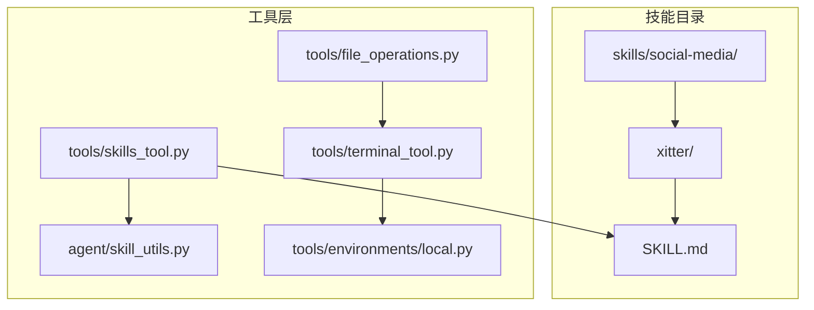
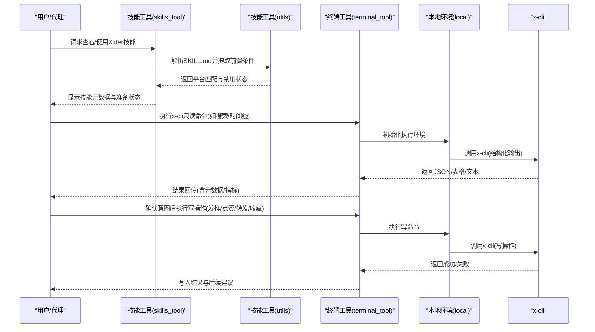
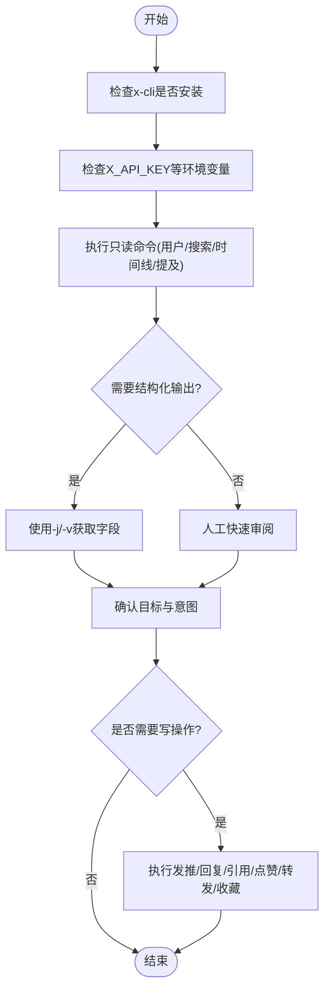
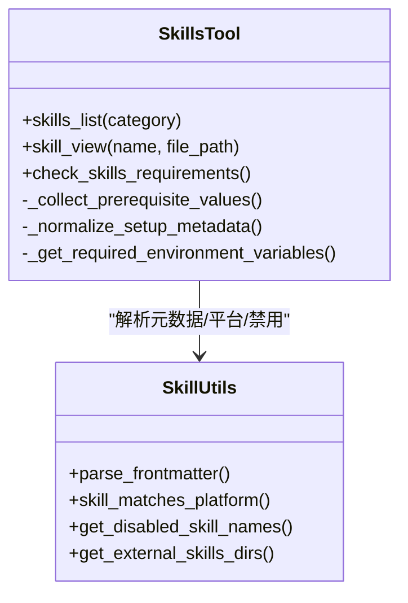
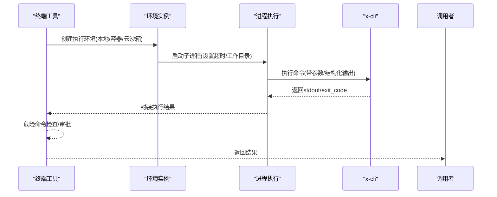
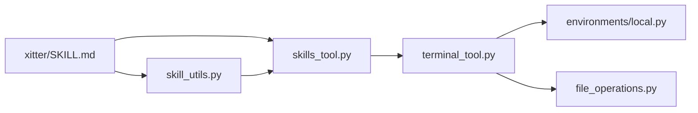

# 社交媒体技能

<cite>
**本文引用的文件**
- [skills/social-media/xitter/SKILL.md](file://skills/social-media/xitter/SKILL.md)
- [skills/social-media/DESCRIPTION.md](file://skills/social-media/DESCRIPTION.md)
- [tools/skills_tool.py](file://tools/skills_tool.py)
- [agent/skill_utils.py](file://agent/skill_utils.py)
- [tools/terminal_tool.py](file://tools/terminal_tool.py)
- [tools/file_operations.py](file://tools/file_operations.py)
- [tools/environments/local.py](file://tools/environments/local.py)
</cite>

## 目录
1. [简介](#简介)
2. [项目结构](#项目结构)
3. [核心组件](#核心组件)
4. [架构总览](#架构总览)
5. [详细组件分析](#详细组件分析)
6. [依赖关系分析](#依赖关系分析)
7. [性能考虑](#性能考虑)
8. [故障排除指南](#故障排除指南)
9. [结论](#结论)
10. [附录](#附录)

## 简介
本文件面向Hermes Agent的社交媒体技能，聚焦于Xitter（X/Twitter）管理能力的实现与使用。Xitter通过官方X API的x-cli终端客户端进行交互，支持内容发布、时间线浏览、搜索、点赞/转发、收藏、提及与用户查询等操作。该技能采用“上游原生CLI + 官方API”的稳定路径，避免了脆弱的会话/Cookie抓取方式，适合长期维护与生产使用。

在Hermes中，Xitter作为一项可发现、可配置、可按平台过滤的技能被加载与调用。其核心工作流是：确认x-cli安装与凭证就绪 → 执行只读命令验证 → 使用结构化输出抽取关键字段 → 在确认意图后执行写操作（发推、回复、引用、点赞、转发、收藏等）。

## 项目结构
- 技能目录组织遵循统一规范：每个技能以独立目录存放，主文档为SKILL.md，可选包含references、templates、assets等子目录。
- 社交媒体技能位于skills/social-media/下，其中Xitter为具体实现入口。
- 工具层提供技能发现、分类、前置条件检查、环境变量收集与安全提示等通用能力；终端工具负责跨本地/容器/云沙箱的命令执行；文件与环境模块提供底层执行支撑。

图表来源
- [skills/social-media/xitter/SKILL.md:1-203](file://skills/social-media/xitter/SKILL.md#L1-L203)
- [tools/skills_tool.py:1-120](file://tools/skills_tool.py#L1-L120)
- [agent/skill_utils.py:1-60](file://agent/skill_utils.py#L1-L60)
- [tools/terminal_tool.py:1-120](file://tools/terminal_tool.py#L1-L120)
- [tools/file_operations.py:343-374](file://tools/file_operations.py#L343-L374)
- [tools/environments/local.py:222-254](file://tools/environments/local.py#L222-L254)

章节来源
- [skills/social-media/xitter/SKILL.md:1-203](file://skills/social-media/xitter/SKILL.md#L1-L203)
- [skills/social-media/DESCRIPTION.md:1-4](file://skills/social-media/DESCRIPTION.md#L1-L4)

## 核心组件
- Xitter技能定义与使用说明：集中于SKILL.md，包含安装、凭证、常用命令、输出模式、工作流与注意事项。
- 技能发现与分类：tools/skills_tool.py提供技能列表、分类、前置条件解析与环境变量收集流程。
- 平台匹配与禁用过滤：agent/skill_utils.py提供平台兼容性判断、禁用技能集合读取与外部技能目录扫描。
- 终端执行与环境抽象：tools/terminal_tool.py封装本地/容器/云沙箱的命令执行、超时、后台任务、危险命令审批等。
- 文件与命令可用性：tools/file_operations.py提供命令存在性检测、执行结果封装等。
- 本地环境临时目录与运行：tools/environments/local.py提供本地临时目录选择与shell执行。

章节来源
- [tools/skills_tool.py:1-200](file://tools/skills_tool.py#L1-L200)
- [agent/skill_utils.py:1-120](file://agent/skill_utils.py#L1-L120)
- [tools/terminal_tool.py:1-120](file://tools/terminal_tool.py#L1-L120)
- [tools/file_operations.py:343-374](file://tools/file_operations.py#L343-L374)
- [tools/environments/local.py:222-254](file://tools/environments/local.py#L222-L254)

## 架构总览
Xitter在Hermes中的运行链路如下：
- 技能发现：系统扫描技能目录，解析SKILL.md的前置条件与平台信息，生成技能清单。
- 凭证与环境：根据前置条件要求收集或校验环境变量，确保x-cli可正常访问X API。
- 命令执行：通过终端工具在本地或受控环境中执行x-cli命令，支持结构化输出与错误处理。
- 写操作保护：严格遵循“先读取、再结构化抽取、最后写入”的流程，降低误操作风险。

图表来源
- [tools/skills_tool.py:512-586](file://tools/skills_tool.py#L512-L586)
- [agent/skill_utils.py:92-116](file://agent/skill_utils.py#L92-L116)
- [tools/terminal_tool.py:515-535](file://tools/terminal_tool.py#L515-L535)
- [tools/environments/local.py:222-254](file://tools/environments/local.py#L222-L254)
- [skills/social-media/xitter/SKILL.md:181-188](file://skills/social-media/xitter/SKILL.md#L181-L188)

## 详细组件分析

### Xitter技能实现与使用
- 功能范围：发推、回复、引用、获取/删除推文、搜索、时间线、用户资料、关注/粉丝、点赞/转发、收藏、提及。
- 安装与升级：通过uv工具安装/升级上游x-cli，确保与官方API保持一致。
- 凭证模型：官方API拆分为应用级与用户级凭证，需同时配置五项密钥，建议在~/.config/x-cli/.env中集中管理。
- 输出模式：支持-json(-j)、-verbose(-v)、-plain(-p/-md)等，便于机器解析与人类审阅。
- 工作流：先读取验证，再结构化抽取字段，最后在确认意图后执行写操作。

图表来源
- [skills/social-media/xitter/SKILL.md:181-188](file://skills/social-media/xitter/SKILL.md#L181-L188)
- [skills/social-media/xitter/SKILL.md:165-179](file://skills/social-media/xitter/SKILL.md#L165-L179)
- [skills/social-media/xitter/SKILL.md:54-82](file://skills/social-media/xitter/SKILL.md#L54-L82)

章节来源
- [skills/social-media/xitter/SKILL.md:1-203](file://skills/social-media/xitter/SKILL.md#L1-L203)

### 技能发现与前置条件
- 技能目录扫描：递归查找SKILL.md，解析前言元数据，过滤禁用与不兼容平台。
- 前置条件解析：从prerequisites与setup.collect_secrets中提取所需环境变量与命令，支持帮助链接与敏感信息收集回调。
- 分类与描述：支持CATEGORY/DESCRIPTION.md，用于展示类别概览与技能分组。

图表来源
- [tools/skills_tool.py:512-586](file://tools/skills_tool.py#L512-L586)
- [tools/skills_tool.py:152-206](file://tools/skills_tool.py#L152-L206)
- [agent/skill_utils.py:52-86](file://agent/skill_utils.py#L52-L86)
- [agent/skill_utils.py:92-116](file://agent/skill_utils.py#L92-L116)

章节来源
- [tools/skills_tool.py:1-200](file://tools/skills_tool.py#L1-L200)
- [agent/skill_utils.py:1-120](file://agent/skill_utils.py#L1-L120)

### 终端执行与环境抽象
- 多后端支持：local/docker/modal/ssh/daytona等，统一execute接口，支持超时、后台任务、持久化文件系统。
- 危险命令审批：对潜在高危命令进行拦截与审批提示，结合sudo密码缓存与交互式输入。
- 命令可用性检测：通过command -v等机制缓存命令可用性，减少重复探测开销。

图表来源
- [tools/terminal_tool.py:515-535](file://tools/terminal_tool.py#L515-L535)
- [tools/terminal_tool.py:148-152](file://tools/terminal_tool.py#L148-L152)
- [tools/file_operations.py:343-374](file://tools/file_operations.py#L343-L374)

章节来源
- [tools/terminal_tool.py:1-200](file://tools/terminal_tool.py#L1-L200)
- [tools/file_operations.py:343-374](file://tools/file_operations.py#L343-L374)

### 本地环境与临时目录
- 本地环境提供临时目录选择逻辑，优先使用POSIX风格的TMPDIR/TMP/TEMP，回退到系统默认临时目录。
- 与x-cli配合时，建议将凭证文件放置于~/.config/x-cli/.env，避免权限泄露与路径问题。

章节来源
- [tools/environments/local.py:222-254](file://tools/environments/local.py#L222-L254)

## 依赖关系分析
- Xitter技能依赖上游x-cli与官方X API，凭证由用户在~/.config/x-cli/.env中集中管理。
- 技能发现与前置条件解析依赖SKILL.md的前言元数据；平台兼容性与禁用列表来自配置与会话上下文。
- 命令执行依赖终端工具提供的多后端抽象，文件与命令可用性检测为执行前的轻量保障。

图表来源
- [skills/social-media/xitter/SKILL.md:1-203](file://skills/social-media/xitter/SKILL.md#L1-L203)
- [tools/skills_tool.py:512-586](file://tools/skills_tool.py#L512-L586)
- [agent/skill_utils.py:92-116](file://agent/skill_utils.py#L92-L116)
- [tools/terminal_tool.py:515-535](file://tools/terminal_tool.py#L515-L535)
- [tools/file_operations.py:343-374](file://tools/file_operations.py#L343-L374)
- [tools/environments/local.py:222-254](file://tools/environments/local.py#L222-L254)

章节来源
- [tools/skills_tool.py:512-586](file://tools/skills_tool.py#L512-L586)
- [agent/skill_utils.py:92-116](file://agent/skill_utils.py#L92-L116)

## 性能考虑
- 输出模式选择：在需要程序化解析时使用-j/-v，减少二次解析成本；仅在快速审阅时使用默认模式。
- 命令缓存：利用command -v缓存命令可用性，避免重复探测。
- 超时与后台：长任务使用后台执行与通知机制，短命令优先前台即时返回。
- 平台与禁用：通过平台匹配与禁用列表减少无关技能加载，提升发现效率。

## 故障排除指南
- 计划/配额限制：官方X API并非免费，若出现权限或配额错误，请先检查开发者计划。
- 权限不足：若只读成功但写入失败，需在开发者门户重新生成具备“读写”权限的访问令牌。
- 回复限制：X对程序化回复有限制，优先使用引用转发(tweet quote)而非回复(tweet reply)。
- 速率限制：注意各端点的速率限制与冷却窗口，合理安排批量任务。
- 凭证漂移：若轮换凭证，请确保~/.config/x-cli/.env仍指向当前有效文件。
- 环境变量缺失：技能工具会提示缺失的环境变量，可通过本地CLI或~/.hermes/.env补充。

章节来源
- [skills/social-media/xitter/SKILL.md:189-196](file://skills/social-media/xitter/SKILL.md#L189-L196)
- [tools/skills_tool.py:275-344](file://tools/skills_tool.py#L275-L344)

## 结论
Xitter技能以官方x-cli为核心，结合Hermes的技能发现、前置条件解析与多后端终端执行能力，提供了稳定、可扩展的X/Twitter管理方案。通过严格的“先读取、再结构化、后写入”流程与完善的凭证管理，既能满足日常运营需求，又能兼顾安全性与长期可维护性。

## 附录
- 快速验证命令示例：用户查询、推文搜索、提及检查等，建议在执行写操作前先行验证。
- 最佳实践：制定内容策略、建立互动节奏、定期分析指标、控制批量操作频率、妥善管理凭证与日志。

章节来源
- [skills/social-media/xitter/SKILL.md:116-125](file://skills/social-media/xitter/SKILL.md#L116-L125)
- [skills/social-media/xitter/SKILL.md:181-188](file://skills/social-media/xitter/SKILL.md#L181-L188)