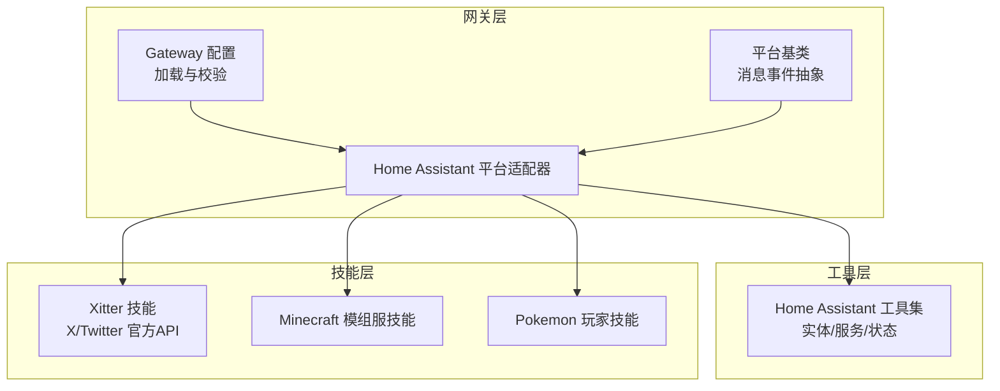
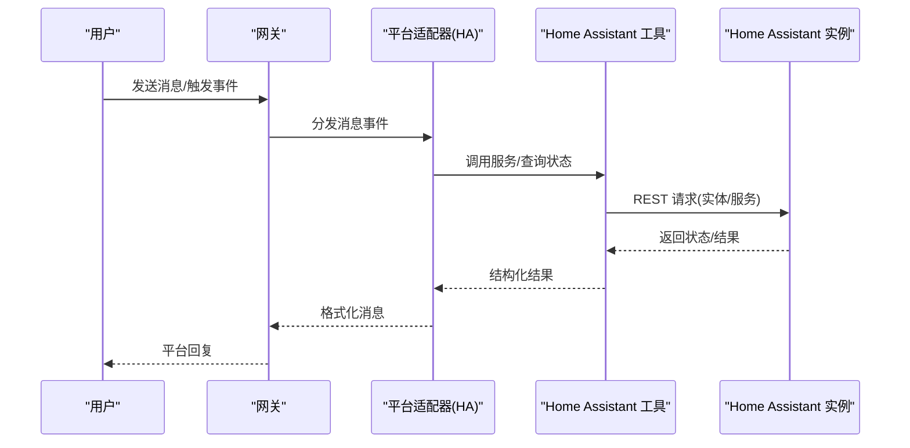
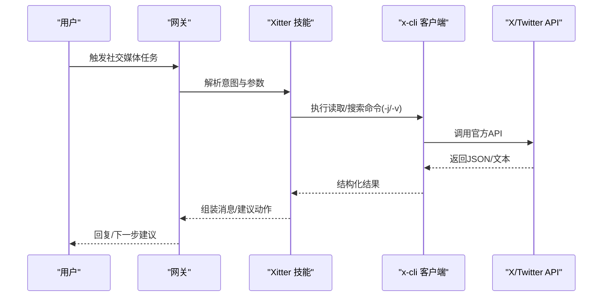
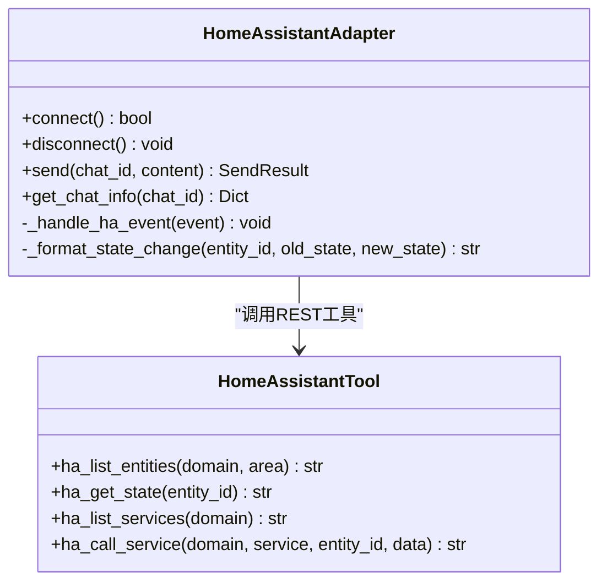
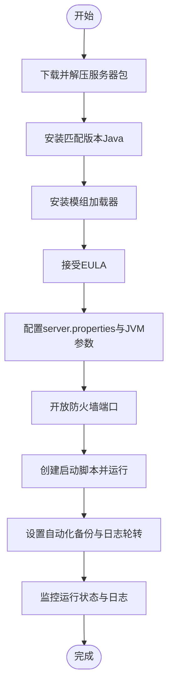
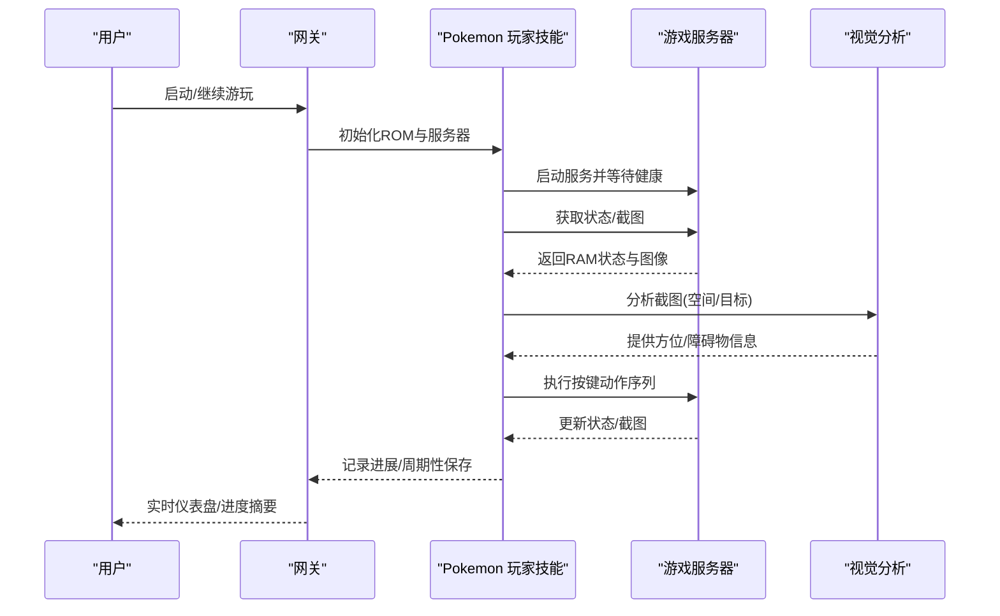
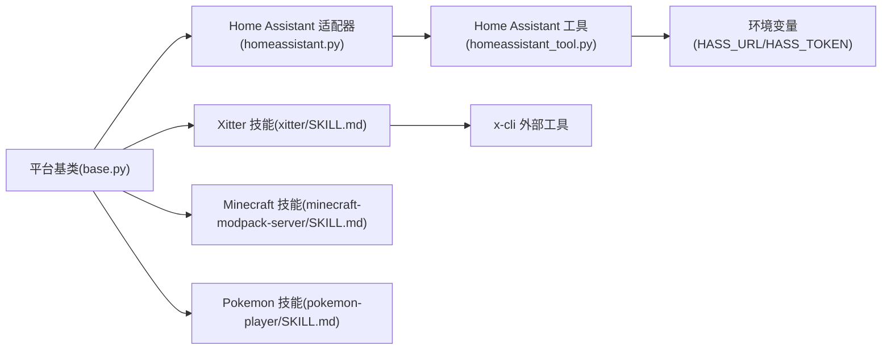

# 通信社交技能

<cite>
**本文档引用的文件**
- [README.md](file://README.md)
- [SKILL.md](file://skills/social-media/xitter/SKILL.md)
- [DESCRIPTION.md](file://skills/social-media/DESCRIPTION.md)
- [DESCRIPTION.md](file://skills/smart-home/DESCRIPTION.md)
- [DESCRIPTION.md](file://skills/gaming/DESCRIPTION.md)
- [homeassistant.py](file://gateway/platforms/homeassistant.py)
- [base.py](file://gateway/platforms/base.py)
- [homeassistant_tool.py](file://tools/homeassistant_tool.py)
- [SCHOOL.md](file://skills/gaming/minecraft-modpack-server/SKILL.md)
- [SKILL.md](file://skills/gaming/pokemon-player/SKILL.md)
- [config.py](file://gateway/config.py)
</cite>

## 目录
1. [简介](#简介)
2. [项目结构](#项目结构)
3. [核心组件](#核心组件)
4. [架构总览](#架构总览)
5. [详细组件分析](#详细组件分析)
6. [依赖关系分析](#依赖关系分析)
7. [性能考量](#性能考量)
8. [故障排除指南](#故障排除指南)
9. [结论](#结论)
10. [附录](#附录)

## 简介
本文件面向Hermes Agent在通信社交领域的技能体系，聚焦三大方向：
- 社交媒体管理：以Xitter技能为核心，实现X/Twitter的官方API交互，覆盖内容发布、粉丝互动、数据分析与运营辅助。
- 智能家居控制：通过Home Assistant平台适配器与REST工具，实现设备状态查询、服务调用、事件监控与通知投递。
- 游戏娱乐：提供Minecraft模组服搭建与运维、Pokemon游戏自动游玩的技能，满足服务器管理与玩家互动场景。

文档将从系统架构、组件关系、数据流、处理逻辑、集成点、错误处理与性能特性等方面进行深入解析，并提供配置方法、使用技巧与注意事项，帮助用户在实际通信社交场景中高效落地（如内容创作、社区管理、娱乐活动等）。

## 项目结构
Hermes Agent采用“网关-平台适配器-工具-技能”的分层架构：
- 网关负责多平台接入与消息路由，平台适配器实现具体平台协议，工具封装底层能力（如Home Assistant），技能定义业务流程与命令入口。
- 社交媒体、智能家居、游戏娱乐分别对应不同的技能目录与工具模块，通过统一的工具注册机制与平台适配器协同工作。

图示来源
- [config.py:431-670](file://gateway/config.py#L431-L670)
- [base.py:779-800](file://gateway/platforms/base.py#L779-L800)
- [homeassistant.py:51-138](file://gateway/platforms/homeassistant.py#L51-L138)
- [homeassistant_tool.py:454-491](file://tools/homeassistant_tool.py#L454-L491)
- [SKILL.md:1-203](file://skills/social-media/xitter/SKILL.md#L1-L203)
- [SCHOOL.md:1-187](file://skills/gaming/minecraft-modpack-server/SKILL.md#L1-L187)
- [SKILL.md:1-216](file://skills/gaming/pokemon-player/SKILL.md#L1-L216)

章节来源
- [README.md:1-179](file://README.md#L1-L179)
- [config.py:431-670](file://gateway/config.py#L431-L670)
- [base.py:779-800](file://gateway/platforms/base.py#L779-L800)

## 核心组件
- 平台适配器基类：定义消息事件、发送结果、消息截断与代理支持等通用能力，确保各平台一致性。
- Home Assistant平台适配器：连接HA WebSocket，订阅state_changed事件，格式化为人类可读消息并转发；通过REST API发送持久化通知。
- Home Assistant工具集：提供实体列表、单实体状态、服务清单与服务调用四大工具，统一认证与安全策略。
- Xitter技能：基于x-cli的官方X/Twitter API，支持发帖、搜索、读取时间线、用户查询、点赞/转推、提及与书签等。
- 游戏技能：Minecraft模组服搭建与运维指南；Pokemon自动游玩的服务器启动、状态观测、决策与输入执行流程。

章节来源
- [base.py:634-727](file://gateway/platforms/base.py#L634-L727)
- [homeassistant.py:51-138](file://gateway/platforms/homeassistant.py#L51-L138)
- [homeassistant_tool.py:454-491](file://tools/homeassistant_tool.py#L454-L491)
- [SKILL.md:1-203](file://skills/social-media/xitter/SKILL.md#L1-L203)
- [SCHOOL.md:1-187](file://skills/gaming/minecraft-modpack-server/SKILL.md#L1-L187)
- [SKILL.md:1-216](file://skills/gaming/pokemon-player/SKILL.md#L1-L216)

## 架构总览
Hermes Agent的通信社交技能通过以下路径协同工作：
- 平台接入：网关根据配置启用平台，平台适配器建立连接并监听事件或接收消息。
- 消息处理：平台适配器将平台事件标准化为消息事件，注入会话上下文后进入处理循环。
- 工具调用：技能根据意图调用工具（如HA服务调用、X API命令），工具通过REST或外部CLI完成操作。
- 结果反馈：工具返回结构化结果，平台适配器将文本或富媒体内容发送回平台。

图示来源
- [homeassistant.py:217-318](file://gateway/platforms/homeassistant.py#L217-L318)
- [homeassistant_tool.py:168-191](file://tools/homeassistant_tool.py#L168-L191)

章节来源
- [homeassistant.py:217-318](file://gateway/platforms/homeassistant.py#L217-L318)
- [homeassistant_tool.py:168-191](file://tools/homeassistant_tool.py#L168-L191)

## 详细组件分析

### 社交媒体技能：Xitter（X/Twitter）
Xitter技能通过官方X API与x-cli客户端协作，实现：
- 内容发布：发帖、回复、引用回帖。
- 数据读取：时间线浏览、用户资料查询、关注/粉丝列表、提及与书签。
- 互动操作：点赞、转推。
- 输出模式：支持JSON、Markdown、带元数据的详细输出，便于后续步骤提取字段。

图示来源
- [SKILL.md:126-196](file://skills/social-media/xitter/SKILL.md#L126-L196)

使用要点
- 凭证要求：需要完整的五项密钥（应用级与用户级），建议将凭证集中存储于专用环境文件并通过软链接共享。
- 成本与权限：官方API通常需付费计划，若写入失败，优先检查权限与配额。
- 输出模式：机器可读输出（-j）适合结构化提取，详细模式（-v）适合调试与审计。

章节来源
- [SKILL.md:54-125](file://skills/social-media/xitter/SKILL.md#L54-L125)
- [SKILL.md:165-196](file://skills/social-media/xitter/SKILL.md#L165-L196)

### 智能家居技能：Home Assistant 平台适配器与工具
Home Assistant平台适配器负责：
- 连接与认证：通过长连接令牌与WebSocket订阅state_changed事件。
- 事件过滤：支持按域/实体白名单、忽略列表与冷却时间，避免事件风暴。
- 消息格式化：将状态变更转换为人类可读描述，区分不同域（如HVAC、传感器、二进制传感器、照明、开关、风扇、报警面板等）。
- 发送通知：通过REST API向HA发送持久化通知，避免与事件监听竞争。

工具集提供：
- 列出实体：按域或区域筛选。
- 获取状态：查询单个实体的详细状态与属性。
- 列举服务：查看可用服务及参数说明。
- 调用服务：执行turn_on/turn_off/toggle/set_temperature等操作，内置安全拦截（禁止高危域）。

图示来源
- [homeassistant.py:51-138](file://gateway/platforms/homeassistant.py#L51-L138)
- [homeassistant_tool.py:454-491](file://tools/homeassistant_tool.py#L454-L491)

使用要点
- 事件过滤：建议配置watch_domains/watch_entities或watch_all，避免全量事件导致性能问题。
- 冷却时间：合理设置冷却秒数，降低重复事件的噪声。
- 安全限制：被拦截的服务域（如shell_command、command_line、python_script、hassio、rest_command）严禁直接调用。
- 通知投递：发送持久化通知时注意长度限制与超时处理。

章节来源
- [homeassistant.py:262-380](file://gateway/platforms/homeassistant.py#L262-L380)
- [homeassistant_tool.py:41-51](file://tools/homeassistant_tool.py#L41-L51)

### 游戏娱乐技能：Minecraft模组服与Pokemon自动游玩
- Minecraft模组服技能涵盖下载与检查包、安装Java与模组加载器、接受EULA、配置server.properties、JVM参数调优、防火墙开放、创建启动脚本、设置自动化备份与定时任务等完整流程。
- Pokemon玩家技能提供头目自动游玩：启动游戏服务器、读取RAM状态、截图结合视觉分析、决策与按键输入、保存/加载进度、实时仪表盘与SSH反向隧道。

图示来源
- [SCHOOL.md:30-187](file://skills/gaming/minecraft-modpack-server/SKILL.md#L30-L187)

图示来源
- [SKILL.md:31-94](file://skills/gaming/pokemon-player/SKILL.md#L31-L94)

使用要点
- Minecraft：务必开启飞行（allow-flight=true）、适当max-tick-time、首次启动耗时较长属正常；在线模式与安全配置需一致。
- Pokemon：建议每15-20步保存一次，对话处理使用加速键组合，地图传送需额外等待黑屏过渡；导航优先结合RAM状态与视觉分析。

章节来源
- [SCHOOL.md:172-187](file://skills/gaming/minecraft-modpack-server/SKILL.md#L172-L187)
- [SKILL.md:104-154](file://skills/gaming/pokemon-player/SKILL.md#L104-L154)

## 依赖关系分析
- 平台适配器依赖：平台枚举、配置对象、会话源构建、消息事件类型与发送结果。
- Home Assistant工具依赖：环境变量（HASS_URL/HASS_TOKEN）、aiohttp异步HTTP客户端、正则校验实体ID、服务域黑名单。
- Xitter技能依赖：x-cli外部工具、官方X开发者门户凭证、终端输出模式切换。
- 游戏技能依赖：系统包管理、JVM安装、网络端口、SSH隧道与可视化仪表盘。

图示来源
- [base.py:48-69](file://gateway/platforms/base.py#L48-L69)
- [homeassistant.py:42-48](file://gateway/platforms/homeassistant.py#L42-L48)
- [homeassistant_tool.py:31-36](file://tools/homeassistant_tool.py#L31-L36)
- [SKILL.md:34-53](file://skills/social-media/xitter/SKILL.md#L34-L53)
- [SCHOOL.md:32-57](file://skills/gaming/minecraft-modpack-server/SKILL.md#L32-L57)
- [SKILL.md:18-36](file://skills/gaming/pokemon-player/SKILL.md#L18-L36)

章节来源
- [config.py:48-69](file://gateway/config.py#L48-L69)
- [base.py:48-69](file://gateway/platforms/base.py#L48-L69)

## 性能考量
- 事件风暴防护：Home Assistant适配器支持域/实体过滤与冷却时间，避免高频状态变更导致的消息洪泛。
- 异步I/O：工具与适配器广泛使用异步HTTP客户端，提升并发与响应速度。
- 输出模式选择：Xitter的JSON模式减少解析开销，HA工具的紧凑输出降低上下文压力。
- 资源调优：Minecraft JVM参数与视图距离需根据玩家数量与硬件性能动态调整；Pokemon游玩建议节制动作序列，配合截图验证以减少无效重试。

## 故障排除指南
- Home Assistant
  - 连接失败：检查HASS_TOKEN是否配置，WebSocket URL与端口可达性。
  - 事件未转发：确认已配置watch_domains/watch_entities或watch_all，否则默认丢弃事件。
  - 服务调用失败：检查服务域是否在黑名单内，实体ID格式是否正确，请求超时与HTTP状态码。
- Xitter
  - 权限/配额错误：确认开发者计划与权限（读写），必要时重新生成访问令牌。
  - 程序化回复受限：官方对程序化回复有限制，优先使用引用回帖。
  - 凭证漂移：当凭证轮换时，确保外部x-cli配置文件仍指向当前凭证位置。
- 游戏技能
  - Minecraft首启缓慢：初始世界生成与模组加载需要较长时间，耐心等待“Done”提示。
  - 在线模式拒绝：在线模式与安全配置需保持一致，否则客户端会被拒绝。
  - Pokemon导航卡住：截图验证位置，避免随机移动；建筑出口需先侧移再前进；传送后增加等待帧。

章节来源
- [homeassistant.py:101-139](file://gateway/platforms/homeassistant.py#L101-L139)
- [homeassistant_tool.py:242-265](file://tools/homeassistant_tool.py#L242-L265)
- [SKILL.md:189-196](file://skills/social-media/xitter/SKILL.md#L189-L196)
- [SCHOOL.md:172-180](file://skills/gaming/minecraft-modpack-server/SKILL.md#L172-L180)
- [SKILL.md:104-112](file://skills/gaming/pokemon-player/SKILL.md#L104-L112)

## 结论
Hermes Agent的通信社交技能通过统一的网关与平台适配器，将社交媒体、智能家居与游戏娱乐整合在同一框架下。Xitter提供稳定可靠的官方API入口，Home Assistant工具与适配器实现设备控制与事件监控，游戏技能则覆盖服务器运维与自动游玩。借助清晰的配置、工具注册与错误处理机制，用户可在内容创作、社区管理与娱乐活动中高效落地。

## 附录
- 配置方法
  - 网关配置：通过配置文件或环境变量启用平台、设置会话重置策略、快速命令与流式传输。
  - Home Assistant：设置HASS_URL与HASS_TOKEN，配置事件过滤与冷却时间。
  - Xitter：安装x-cli并准备官方开发者凭证，推荐将凭证集中管理并限制权限。
  - 游戏技能：按技能指引安装依赖、配置JVM参数、开放端口并设置自动化备份。
- 使用技巧
  - 先读后写：Xitter与HA均建议先执行只读命令，确认目标后再执行写操作。
  - 结构化输出：优先使用JSON模式以便后续步骤提取字段。
  - 事件节流：合理设置过滤与冷却，避免事件风暴。
- 注意事项
  - Home Assistant服务域黑名单不可绕过，严格遵循安全策略。
  - X API成本与权限需提前评估，避免因配额问题导致失败。
  - 游戏技能涉及外部进程与网络，确保资源充足与网络稳定。

章节来源
- [config.py:220-260](file://gateway/config.py#L220-L260)
- [homeassistant.py:82-87](file://gateway/platforms/homeassistant.py#L82-L87)
- [SKILL.md:91-115](file://skills/social-media/xitter/SKILL.md#L91-L115)
- [SCHOOL.md:139-171](file://skills/gaming/minecraft-modpack-server/SKILL.md#L139-L171)
- [SKILL.md:68-94](file://skills/gaming/pokemon-player/SKILL.md#L68-L94)