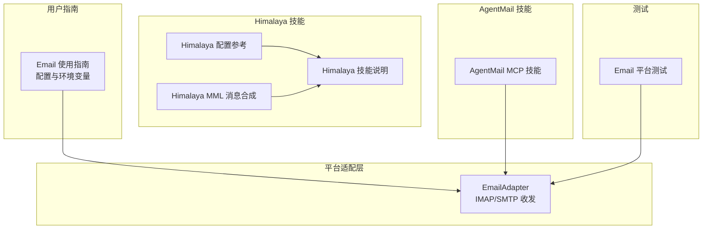
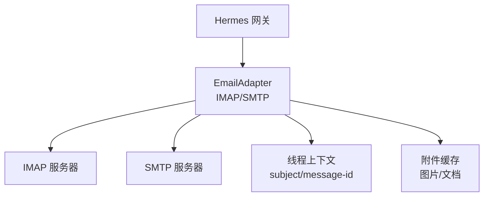
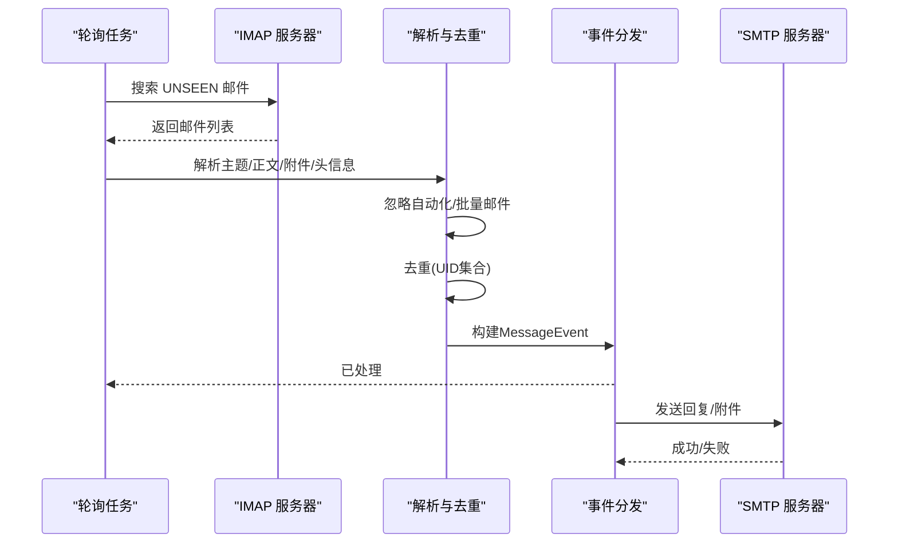
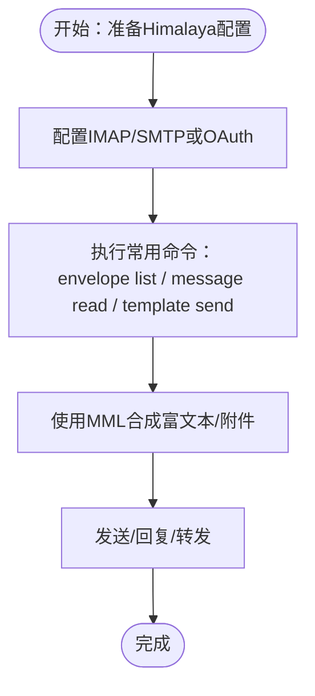
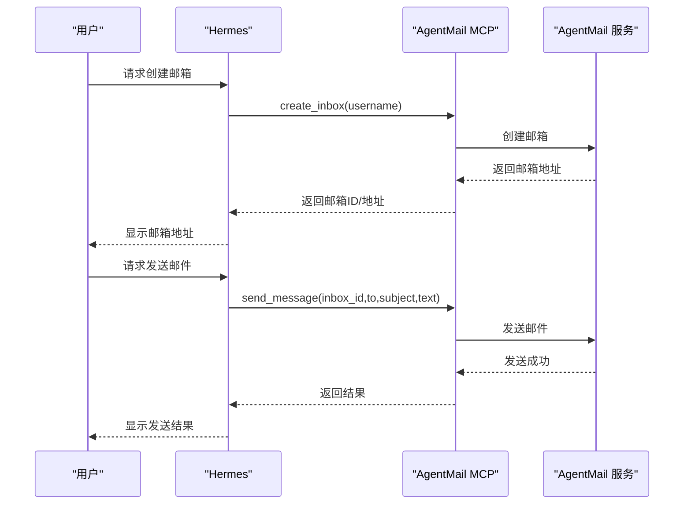
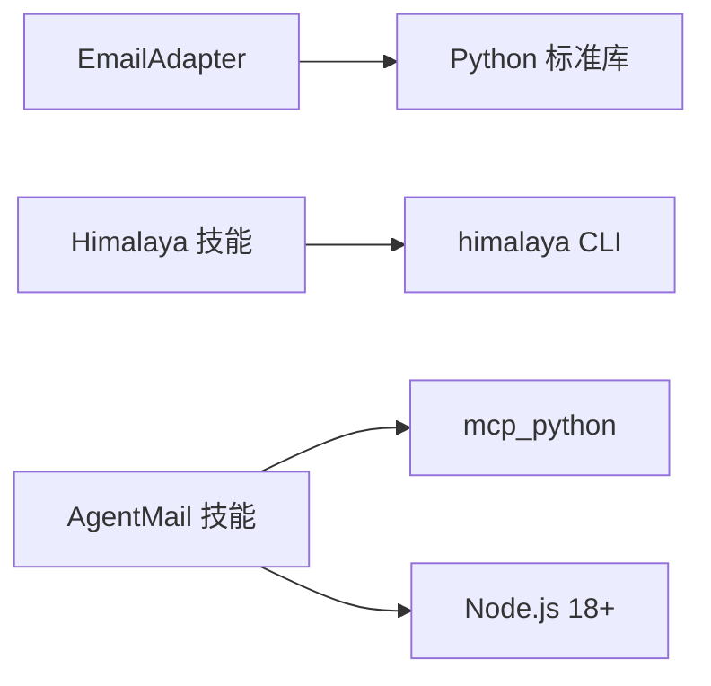

# 邮件管理技能

<cite>
**本文档引用的文件**
- [email.py](file://gateway/platforms/email.py)
- [email.md](file://website/docs/user-guide/messaging/email.md)
- [SKILL.md（Himalaya）](file://skills/email/himalaya/SKILL.md)
- [configuration.md（Himalaya 配置）](file://skills/email/himalaya/references/configuration.md)
- [message-composition.md（Himalaya 消息合成）](file://skills/email/himalaya/references/message-composition.md)
- [SKILL.md（AgentMail）](file://optional-skills/email/agentmail/SKILL.md)
- [test_email.py](file://tests/gateway/test_email.py)
</cite>

## 目录
1. [简介](#简介)
2. [项目结构](#项目结构)
3. [核心组件](#核心组件)
4. [架构总览](#架构总览)
5. [详细组件分析](#详细组件分析)
6. [依赖关系分析](#依赖关系分析)
7. [性能考虑](#性能考虑)
8. [故障排除指南](#故障排除指南)
9. [结论](#结论)
10. [附录](#附录)

## 简介
本文件面向Hermes Agent的邮件管理技能，重点覆盖以下能力与实践：
- 使用Himalaya邮件客户端进行IMAP/SMTP邮件收发、联系人与日历信息的检索（通过Google Workspace技能）、邮件模板与批量处理、过滤规则与自动化工作流
- 邮件账户配置、IMAP/SMTP设置、OAuth认证流程（如适用）
- 安全设置、性能优化与常见问题排查
- AgentMail MCP技能：为Agent提供专用邮箱地址，支持发送、接收与线程管理

本指南既适合初学者快速上手，也为高级用户提供深入的技术细节与最佳实践。

## 项目结构
邮件管理相关代码与文档主要分布在如下位置：
- 平台适配器：gateway/platforms/email.py（Email平台适配器，基于IMAP/SMTP）
- 用户指南：website/docs/user-guide/messaging/email.md（Email平台配置与使用说明）
- Himalaya技能：skills/email/himalaya/*（CLI邮件客户端，支持多账户、MML消息合成、IMAP/SMTP/OAuth）
- AgentMail技能：optional-skills/email/agentmail/SKILL.md（MCP技能，提供Agent专属邮箱）
- 测试用例：tests/gateway/test_email.py（Email平台适配器的功能验证）

**图表来源**
- [email.py:221-626](file://gateway/platforms/email.py#L221-L626)
- [email.md:1-191](file://website/docs/user-guide/messaging/email.md#L1-L191)
- [SKILL.md（Himalaya）:1-279](file://skills/email/himalaya/SKILL.md#L1-L279)
- [configuration.md（Himalaya 配置）:1-185](file://skills/email/himalaya/references/configuration.md#L1-L185)
- [message-composition.md（Himalaya 消息合成）:1-200](file://skills/email/himalaya/references/message-composition.md#L1-L200)
- [SKILL.md（AgentMail）:1-126](file://optional-skills/email/agentmail/SKILL.md#L1-L126)
- [test_email.py:1-800](file://tests/gateway/test_email.py#L1-L800)

**章节来源**
- [email.py:1-626](file://gateway/platforms/email.py#L1-L626)
- [email.md:1-191](file://website/docs/user-guide/messaging/email.md#L1-L191)
- [SKILL.md（Himalaya）:1-279](file://skills/email/himalaya/SKILL.md#L1-L279)
- [configuration.md（Himalaya 配置）:1-185](file://skills/email/himalaya/references/configuration.md#L1-L185)
- [message-composition.md（Himalaya 消息合成）:1-200](file://skills/email/himalaya/references/message-composition.md#L1-L200)
- [SKILL.md（AgentMail）:1-126](file://optional-skills/email/agentmail/SKILL.md#L1-L126)
- [test_email.py:1-800](file://tests/gateway/test_email.py#L1-L800)

## 核心组件
- Email平台适配器（IMAP/SMTP）
  - 负责轮询IMAP收件箱、解析邮件、构建MessageEvent并分发；通过SMTP发送回复、带附件的邮件
  - 支持自动忽略自动化/批量邮件、去重UID、线程上下文维护（In-Reply-To/References）
- Himalaya邮件CLI技能
  - 多账户支持、IMAP/SMTP/OAuth配置、MML消息合成、富文本/附件处理、搜索与分页
- AgentMail MCP技能
  - 提供Agent专属邮箱地址，支持创建/删除邮箱、列出线程、获取线程、发送/回复/转发、更新消息状态、下载附件

**章节来源**
- [email.py:221-626](file://gateway/platforms/email.py#L221-L626)
- [SKILL.md（Himalaya）:1-279](file://skills/email/himalaya/SKILL.md#L1-L279)
- [SKILL.md（AgentMail）:1-126](file://optional-skills/email/agentmail/SKILL.md#L1-L126)

## 架构总览
下图展示Email平台适配器在Hermes中的角色与交互：

**图表来源**
- [email.py:221-626](file://gateway/platforms/email.py#L221-L626)

## 详细组件分析

### Email平台适配器（IMAP/SMTP）
- 连接与初始化
  - 从环境变量读取EMAIL_ADDRESS、EMAIL_PASSWORD、EMAIL_IMAP_HOST、EMAIL_SMTP_HOST等
  - 启动时测试IMAP连接并标记历史邮件为已读，随后按EMAIL_POLL_INTERVAL轮询新邮件
- 接收流程
  - 轮询UNSEEN邮件，解码主题与发件人，提取纯文本正文，剥离HTML标签
  - 自动跳过noreply/mailer-daemon/bounce等自动化来源及带特定头部的批量邮件
  - 附件本地缓存：图片转为可被视觉工具使用的路径，文档转为可访问的文件路径
  - 去重：维护seen UIDs集合，超过上限时仅保留最近一半
- 发送流程
  - 回复时继承线程上下文（In-Reply-To/References），避免重复“Re:”
  - 支持发送纯文本、带附件（MIME multipart）
  - 图片/文档发送：通过send_image/send_document封装
- 访问控制
  - EMAIL_ALLOWED_USERS白名单限制；未配置时未知发件人需配对码；可启用EMAIL_ALLOW_ALL_USERS（不推荐）

**图表来源**
- [email.py:320-464](file://gateway/platforms/email.py#L320-L464)
- [email.py:465-626](file://gateway/platforms/email.py#L465-L626)

**章节来源**
- [email.py:221-626](file://gateway/platforms/email.py#L221-L626)
- [email.md:94-135](file://website/docs/user-guide/messaging/email.md#L94-L135)

### Himalaya邮件CLI技能（IMAP/SMTP/OAuth）
- 安装与前置条件
  - 安装Himalaya CLI，准备配置文件~/.config/himalaya/config.toml
  - IMAP/SMTP凭据建议使用安全存储命令或系统钥匙串
- 配置要点
  - 支持Gmail/iCloud等服务商示例配置
  - 支持密码、命令输出密码、系统钥匙串三种认证方式
  - OAuth2配置（适用于支持OAuth2的提供商）
- 常用操作
  - 列目录、分页列出邮件、搜索、读取、导出原始MIME
  - 回复/转发/写信（推荐非交互式管道输入）
  - 移动/复制/删除、添加/移除标志、附件下载
  - 多账户切换与文件夹别名映射
- MML消息合成
  - 支持纯文本、HTML、混合内容、内联图片、多附件
  - 通过模板发送（template send）实现非交互式自动化

**图表来源**
- [SKILL.md（Himalaya）:43-279](file://skills/email/himalaya/SKILL.md#L43-L279)
- [configuration.md（Himalaya 配置）:5-185](file://skills/email/himalaya/references/configuration.md#L5-L185)
- [message-composition.md（Himalaya 消息合成）:1-200](file://skills/email/himalaya/references/message-composition.md#L1-L200)

**章节来源**
- [SKILL.md（Himalaya）:1-279](file://skills/email/himalaya/SKILL.md#L1-L279)
- [configuration.md（Himalaya 配置）:1-185](file://skills/email/himalaya/references/configuration.md#L1-L185)
- [message-composition.md（Himalaya 消息合成）:1-200](file://skills/email/himalaya/references/message-composition.md#L1-L200)

### AgentMail MCP技能（Agent专属邮箱）
- 功能概览
  - 列出/获取/创建/删除邮箱
  - 列出线程、获取线程、发送/回复/转发消息
  - 更新消息标签/状态、下载附件
- 使用流程
  - 获取API Key（Node.js 18+，安装mcp包）
  - 在~/.hermes/config.yaml中配置mcp_servers: agentmail
  - 重启Hermes后即可使用全部11个工具
- 典型工作流
  - 注册服务：创建专用邮箱，用该地址注册，轮询线程获取验证码
  - 主动外呼：创建邮箱，向目标发送邮件，轮询回复

**图表来源**
- [SKILL.md（AgentMail）:30-126](file://optional-skills/email/agentmail/SKILL.md#L30-L126)

**章节来源**
- [SKILL.md（AgentMail）:1-126](file://optional-skills/email/agentmail/SKILL.md#L1-L126)

### 邮件自动化工作流（结合Himalaya与AgentMail）
- 邮件模板与批量处理
  - 使用Himalaya的MML模板与管道输入，实现非交互式批量发送
  - 结合搜索语法与分页，批量筛选与处理
- 过滤规则与智能处理
  - 使用自动化/批量邮件过滤策略，避免噪音
  - 通过线程上下文与In-Reply-To/References保持对话连贯
- AgentMail用于对外服务注册与营销外呼
  - 为不同用途创建独立邮箱，自动注册、验证与跟进

**章节来源**
- [SKILL.md（Himalaya）:111-206](file://skills/email/himalaya/SKILL.md#L111-L206)
- [email.py:405-464](file://gateway/platforms/email.py#L405-L464)
- [SKILL.md（AgentMail）:90-126](file://optional-skills/email/agentmail/SKILL.md#L90-L126)

## 依赖关系分析
- Email平台适配器依赖Python标准库（imaplib/smtplib/email等），无需额外第三方包
- Himalaya技能依赖外部CLI与配置文件，支持多种认证方式
- AgentMail技能依赖Node.js与MCP服务器，通过mcp_python提供工具集

**图表来源**
- [email.py:18-45](file://gateway/platforms/email.py#L18-L45)
- [SKILL.md（Himalaya）:24-41](file://skills/email/himalaya/SKILL.md#L24-L41)
- [SKILL.md（AgentMail）:13-16](file://optional-skills/email/agentmail/SKILL.md#L13-L16)

**章节来源**
- [email.py:18-45](file://gateway/platforms/email.py#L18-L45)
- [SKILL.md（Himalaya）:24-41](file://skills/email/himalaya/SKILL.md#L24-L41)
- [SKILL.md（AgentMail）:13-16](file://optional-skills/email/agentmail/SKILL.md#L13-L16)

## 性能考虑
- 轮询间隔与连接频率
  - 默认轮询间隔15秒；可根据需要降低（更频繁轮询会增加IMAP连接数）
- 历史邮件处理
  - 启动时标记所有现有邮件为已读，避免重复处理
- 去重与内存控制
  - seen UIDs集合上限为2000，超过时仅保留最近一半，防止内存无限增长
- 附件处理
  - 可选择跳过附件以节省带宽与资源（skip_attachments）
- 文本提取与HTML剥离
  - 对HTML-only邮件进行标签剥离，保证正文可读性

**章节来源**
- [email.py:252-271](file://gateway/platforms/email.py#L252-L271)
- [email.py:320-330](file://gateway/platforms/email.py#L320-L330)
- [email.md:122-133](file://website/docs/user-guide/messaging/email.md#L122-L133)

## 故障排除指南
- 启动阶段
  - “IMAP连接失败”：检查EMAIL_IMAP_HOST/PORT，确认IMAP已启用
  - “SMTP连接失败”：检查EMAIL_SMTP_HOST/PORT，确保使用应用密码（如Gmail）
- 认证问题
  - “认证失败”：Gmail必须使用应用密码；先启用2FA再生成应用密码
- 收件与配对
  - “未收到消息”：确认EMAIL_ALLOWED_USERS是否包含发件人；检查垃圾箱
  - 未知发件人：未配置允许列表时会触发配对码
- 重复回复与并发
  - “重复回复”：确保只有一个网关实例运行；使用状态查询确认
- 响应速度
  - “响应慢”：降低EMAIL_POLL_INTERVAL（更频繁轮询）
- 线程显示
  - “回复未正确线程化”：部分Web客户端可能不识别自动化消息的线程头

**章节来源**
- [email.md:150-161](file://website/docs/user-guide/messaging/email.md#L150-L161)

## 结论
Hermes Agent的邮件管理技能通过Email平台适配器、Himalaya CLI与AgentMail MCP三部分协同，实现了从个人邮箱到Agent专属邮箱的完整邮件自动化能力。Email平台适配器提供稳定可靠的IMAP/SMTP收发与线程管理；Himalaya技能提供强大的CLI工具链与MML消息合成；AgentMail技能则为Agent提供独立身份与对外沟通能力。配合安全配置、性能调优与完善的故障排除流程，可在生产环境中可靠地支撑各类邮件自动化场景。

## 附录

### 环境变量与配置项
- Email平台
  - EMAIL_ADDRESS、EMAIL_PASSWORD、EMAIL_IMAP_HOST、EMAIL_SMTP_HOST、EMAIL_IMAP_PORT、EMAIL_SMTP_PORT、EMAIL_POLL_INTERVAL、EMAIL_ALLOWED_USERS、EMAIL_HOME_ADDRESS、EMAIL_ALLOW_ALL_USERS
- Himalaya
  - 配置文件：~/.config/himalaya/config.toml；支持密码、命令输出密码、系统钥匙串、OAuth2
- AgentMail
  - mcp_servers配置：command/args/env（含AGENTMAIL_API_KEY）

**章节来源**
- [email.md:177-191](file://website/docs/user-guide/messaging/email.md#L177-L191)
- [configuration.md（Himalaya 配置）:32-185](file://skills/email/himalaya/references/configuration.md#L32-L185)
- [SKILL.md（AgentMail）:36-45](file://optional-skills/email/agentmail/SKILL.md#L36-L45)