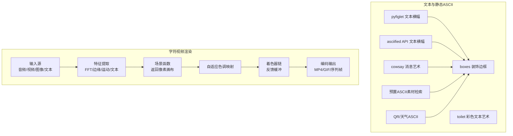
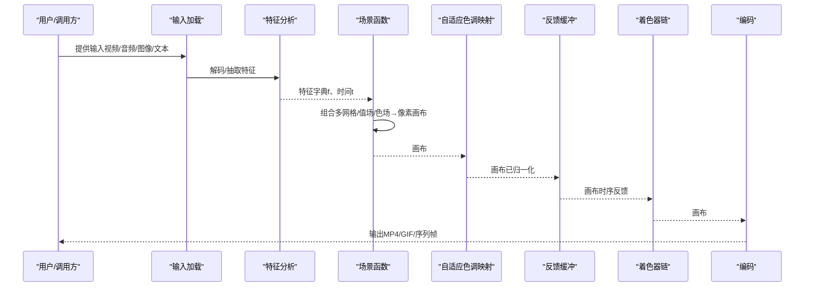
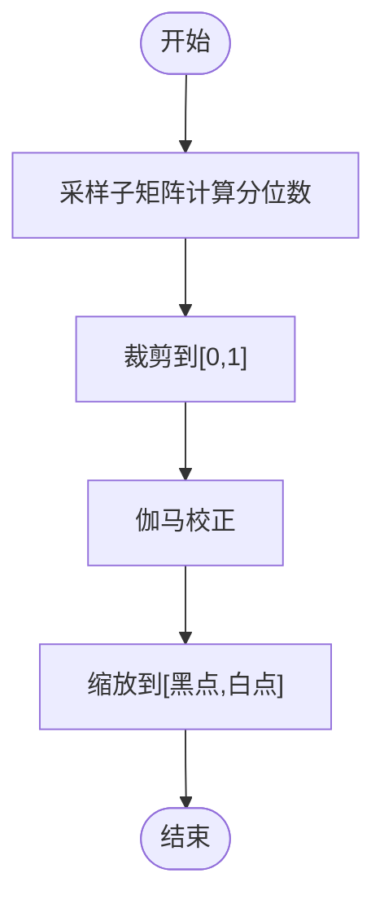
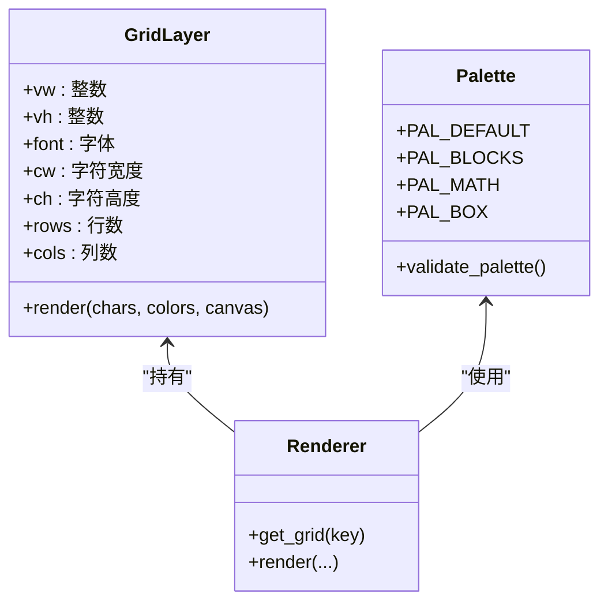
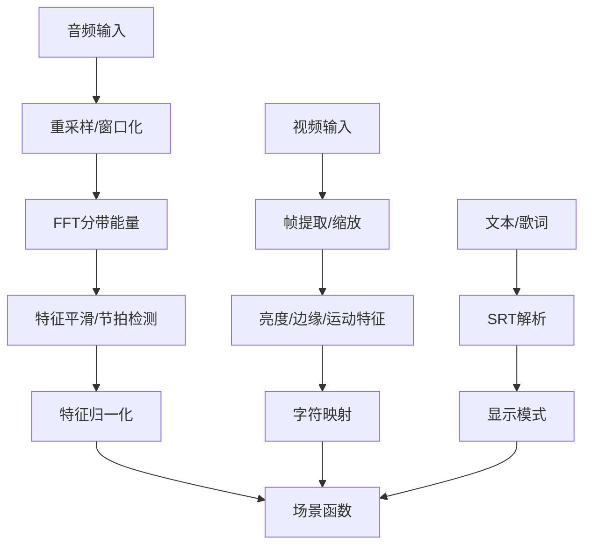
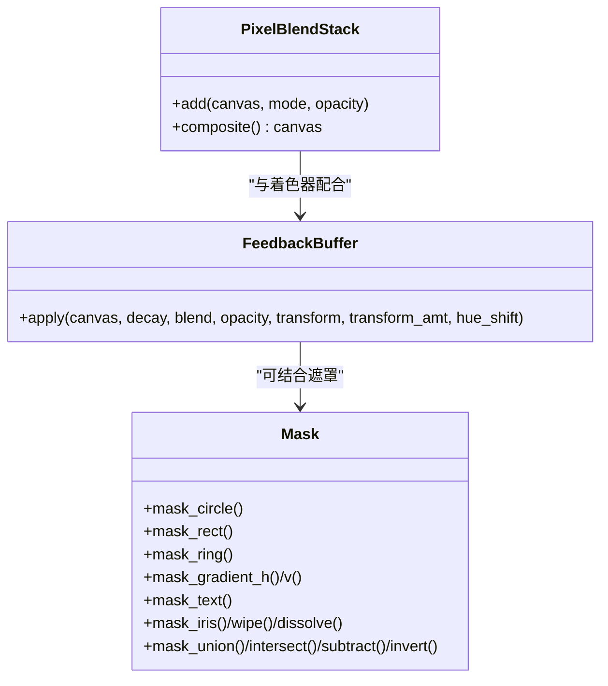
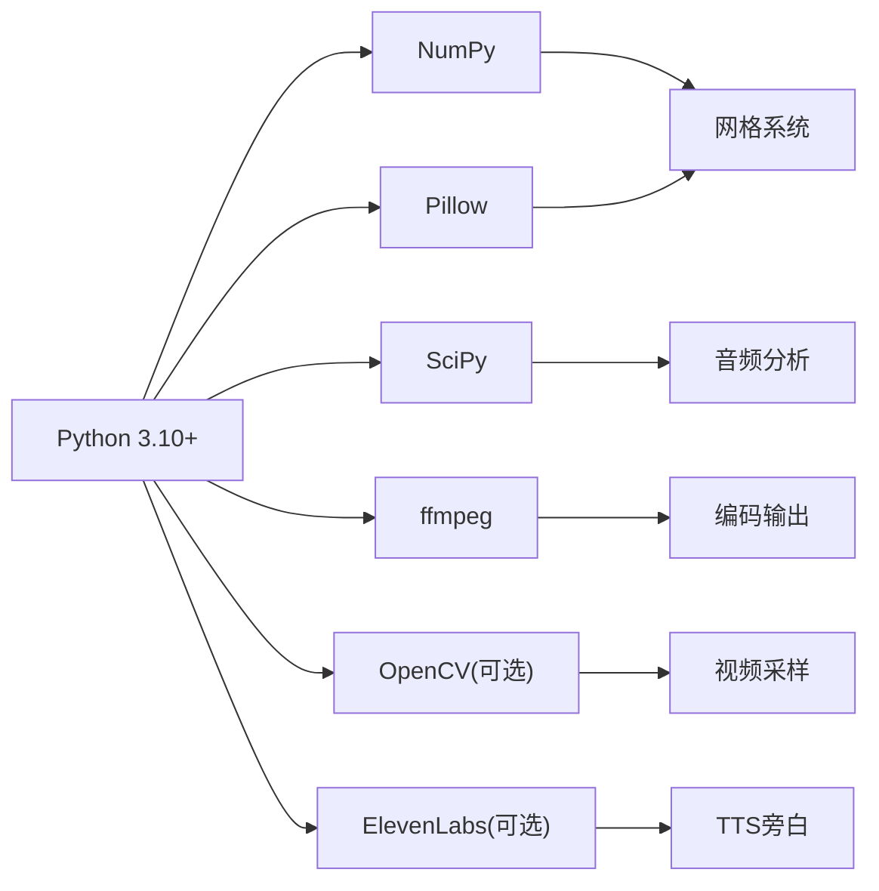

# ASCII艺术工具

<cite>
**本文档引用的文件**
- [SKILL.md](file://skills/creative/ascii-art/SKILL.md)
- [README.md](file://skills/creative/ascii-video/README.md)
- [SKILL.md](file://skills/creative/ascii-video/SKILL.md)
- [architecture.md](file://skills/creative/ascii-video/references/architecture.md)
- [composition.md](file://skills/creative/ascii-video/references/composition.md)
- [effects.md](file://skills/creative/ascii-video/references/effects.md)
- [inputs.md](file://skills/creative/ascii-video/references/inputs.md)
- [shaders.md](file://skills/creative/ascii-video/references/shaders.md)
- [scenes.md](file://skills/creative/ascii-video/references/scenes.md)
</cite>

## 目录
1. [简介](#简介)
2. [项目结构](#项目结构)
3. [核心组件](#核心组件)
4. [架构总览](#架构总览)
5. [详细组件分析](#详细组件分析)
6. [依赖关系分析](#依赖关系分析)
7. [性能考虑](#性能考虑)
8. [故障排除指南](#故障排除指南)
9. [结论](#结论)
10. [附录](#附录)

## 简介
本文件系统性阐述ASCII艺术工具的设计与实现，覆盖从文本横幅、消息艺术、装饰边框到图像转ASCII、预置素材检索、以及基于字符的视频渲染管线。文档重点解释ASCII艺术的生成原理（字符映射、亮度管理、色彩策略）、转换算法（网格系统、值场/色场、多层合成）、质量控制机制（自适应色调映射、反馈缓冲、遮罩系统）以及参数配置与输出样式定制。同时提供字符集选择、分辨率调整、艺术风格切换等高级功能的使用指南，并给出在代码注释美化、技术文档插图、创意表达等场景中的应用建议。

## 项目结构
ASCII艺术能力由两个主要技能模块构成：
- 文本与简单ASCII艺术：pyfiglet、asciified API、cowsay、boxes、toilet、预置ASCII素材检索、QR码/天气ASCII等。
- 字符视频渲染：基于Python的完整ASCII视频生产管线，支持视频转ASCII、音频驱动、生成式动画、歌词叠加、TTS旁白等。

**图表来源**
- [SKILL.md:1-322](file://skills/creative/ascii-art/SKILL.md#L1-L322)
- [README.md:1-291](file://skills/creative/ascii-video/README.md#L1-L291)
- [SKILL.md:1-233](file://skills/creative/ascii-video/SKILL.md#L1-L233)

**章节来源**
- [SKILL.md:1-322](file://skills/creative/ascii-art/SKILL.md#L1-L322)
- [README.md:1-291](file://skills/creative/ascii-video/README.md#L1-L291)
- [SKILL.md:1-233](file://skills/creative/ascii-video/SKILL.md#L1-L233)

## 核心组件
- 字符映射与亮度管理
  - 值场到字符映射：val2char系列函数，支持线性/伽马阈值映射、自定义阈值断点。
  - 自适应色调映射：按百分位归一化+伽马校正，避免线性增益导致高亮截断或低亮不可见。
- 多网格合成与色彩策略
  - 多密度网格组合：通过不同字体大小与字符密度叠加，形成纹理干涉与层次感。
  - 色彩策略：角度映射、距离映射、频率映射、值映射、时间循环、源采样、调色板索引、温度、互补、三元组、邻近、单色等。
- 输入与特征提取
  - 音频：FFT分带能量、光谱质心、平坦度、通量、节拍检测与衰减包络。
  - 视频：亮度、对比度、边缘密度、运动、主色调、颜色方差；可选边缘加权字符映射。
  - 文本/歌词：SRT解析、打字机/淡入/闪烁/散射/波浪等显示模式。
- 后处理与质量控制
  - 像素级混合模式：20种混合模式，支持线性光空间混合。
  - 反馈缓冲：时序递归、空间变换（缩放/收缩/旋转/平移/镜像）、色相漂移。
  - 遮罩系统：圆形/矩形/环形/径向渐变、值场作为遮罩、文本模板、动画遮罩（光圈/擦除/溶解）。
  - 着色器链：几何（CRT桶形、像素化、波形畸变、位移图、万花筒、镜像）、通道（色差、通道偏移、交换、径向分离）、色彩（反相、海报化、阈值、阳刻、色相旋转、饱和、色彩分级、色彩抖动、色彩渐变）、辉光/模糊（辉光、边缘辉光、柔焦、径向模糊）、噪声（胶片颗粒、静态噪声）、线条/图案（扫描线、半色调）、色调（晕影、对比、伽马、色阶、亮度）、故障/数据（故障条带、块故障、像素排序、数据弯曲）。
- 场景设计与合成
  - 层次结构：背景（低亮度氛围）、内容（主题视觉）、强调（稀疏亮点）。
  - 参数弧：线性上升、缓出、缓入、台阶揭示等，避免无方向的振荡。
  - 组合技巧：反向双系统、波碰撞、渐进碎片化、熵增消耗、交错层进入。

**章节来源**
- [architecture.md:245-366](file://skills/creative/ascii-video/references/architecture.md#L245-L366)
- [composition.md:1-390](file://skills/creative/ascii-video/references/composition.md#L1-L390)
- [inputs.md:1-180](file://skills/creative/ascii-video/references/inputs.md#L1-L180)
- [shaders.md:1-200](file://skills/creative/ascii-video/references/shaders.md#L1-L200)
- [scenes.md:18-196](file://skills/creative/ascii-video/references/scenes.md#L18-L196)

## 架构总览
ASCII视频渲染采用“输入→分析→场景函数→色调映射→着色器→编码”的六阶段流水线。每种模式（视频转ASCII、音频驱动、生成式、混合、歌词/文本、TTS旁白）共享同一架构，差异在于输入加载与特征提取。

**图表来源**
- [README.md:24-38](file://skills/creative/ascii-video/README.md#L24-L38)
- [SKILL.md:49-63](file://skills/creative/ascii-video/SKILL.md#L49-L63)

**章节来源**
- [README.md:24-38](file://skills/creative/ascii-video/README.md#L24-L38)
- [SKILL.md:49-63](file://skills/creative/ascii-video/SKILL.md#L49-L63)

## 详细组件分析

### 字符映射与亮度管理
- 值场到字符映射
  - val2char：将[0,1]值场映射到字符数组，支持掩码与调色板。
  - val2char_gamma：伽马修正映射，改善暗部可见性。
  - val2char_step：自定义阈值映射，适合分层/海报化风格。
- 自适应色调映射
  - 以1%与99.5%分位数裁剪动态范围，再施加伽马曲线，最后缩放到目标黑/白点。
  - 推荐默认伽马0.75；对破坏性后处理（如阳刻、海报化）采用更低伽马。
- 管线顺序
  - 先色调映射，再反馈缓冲，最后着色器，确保后续处理在合理范围内。

**图表来源**
- [composition.md:282-304](file://skills/creative/ascii-video/references/composition.md#L282-L304)

**章节来源**
- [architecture.md:337-366](file://skills/creative/ascii-video/references/architecture.md#L337-L366)
- [composition.md:268-390](file://skills/creative/ascii-video/references/composition.md#L268-L390)

### 多网格合成与色彩策略
- 网格系统
  - 支持多密度网格（xs/sm/md/lg/xl/xxl），自动适配分辨率与宽高比。
  - 预栅格化字符位图，按网格单元叠加合成。
- 多层合成
  - 使用屏幕/差值等混合模式叠加不同网格层，形成纹理干涉与层次。
- 色彩策略
  - 角度映射、距离映射、频率映射、值映射、时间循环、源采样、离散调色板、温度、互补、三元组、邻近、单色等。
  - OKLAB/OKLCH色彩空间用于感知均匀插值与和谐配色。

**图表来源**
- [architecture.md:154-205](file://skills/creative/ascii-video/references/architecture.md#L154-L205)
- [architecture.md:245-366](file://skills/creative/ascii-video/references/architecture.md#L245-L366)

**章节来源**
- [architecture.md:5-71](file://skills/creative/ascii-video/references/architecture.md#L5-L71)
- [architecture.md:154-242](file://skills/creative/ascii-video/references/architecture.md#L154-L242)
- [architecture.md:245-366](file://skills/creative/ascii-video/references/architecture.md#L245-L366)

### 输入与特征提取
- 音频分析
  - 分带能量（sub/bass/lomid/mid/himid/hi）、光谱质心、平坦度、通量、节拍检测与指数衰减包络。
  - EMA平滑减少视觉抖动。
- 视频采样与字符映射
  - 将视频帧缩放到网格尺寸，计算灰度亮度映射字符；可选边缘加权映射（边缘区域用框线字符）。
  - 运动检测用于粒子触发/密度调节。
- 文本/歌词
  - SRT解析，多种显示模式（打字机、淡入、闪烁、散射、波浪）。
- 生成式
  - 从时间合成类似音频特征，驱动纯生成式动画。

**图表来源**
- [inputs.md:5-97](file://skills/creative/ascii-video/references/inputs.md#L5-L97)
- [inputs.md:98-196](file://skills/creative/ascii-video/references/inputs.md#L98-L196)
- [inputs.md:223-290](file://skills/creative/ascii-video/references/inputs.md#L223-L290)

**章节来源**
- [inputs.md:5-97](file://skills/creative/ascii-video/references/inputs.md#L5-L97)
- [inputs.md:98-196](file://skills/creative/ascii-video/references/inputs.md#L98-L196)
- [inputs.md:223-290](file://skills/creative/ascii-video/references/inputs.md#L223-L290)

### 后处理与质量控制
- 像素级混合模式
  - 20种混合模式，支持线性光空间混合以获得更真实的光照叠加。
- 反馈缓冲
  - 时序递归，可选空间变换（缩放/收缩/旋转/平移/镜像）与色相漂移，产生轨迹、回音、旋转曼陀罗等效果。
- 遮罩系统
  - 形状遮罩（圆/矩形/环/梯度）、值场遮罩、文本模板遮罩、动画遮罩（光圈/擦除/溶解）与布尔运算。
- 文本背板
  - 在密集ASCII背景下为可读性添加暗色背板（高斯模糊软边缘）。

**图表来源**
- [composition.md:726-800](file://skills/creative/ascii-video/references/composition.md#L726-L800)
- [composition.md:392-522](file://skills/creative/ascii-video/references/composition.md#L392-L522)
- [composition.md:524-723](file://skills/creative/ascii-video/references/composition.md#L524-L723)

**章节来源**
- [composition.md:7-142](file://skills/creative/ascii-video/references/composition.md#L7-L142)
- [composition.md:392-522](file://skills/creative/ascii-video/references/composition.md#L392-L522)
- [composition.md:524-723](file://skills/creative/ascii-video/references/composition.md#L524-L723)

### 场景设计与合成
- 层次结构
  - 背景（低亮度氛围）、内容（主题视觉）、强调（稀疏亮点）。
- 参数弧
  - 线性上升、缓出、缓入、台阶揭示等，避免无方向振荡。
- 组合技巧
  - 反向双系统、波碰撞、渐进碎片化、熵增消耗、交错层进入。

**章节来源**
- [scenes.md:18-196](file://skills/creative/ascii-video/references/scenes.md#L18-L196)

### 文本与静态ASCII工具
- 文本横幅（pyfiglet本地）
  - 安装后直接渲染，支持571种字体，可设置宽度与预览。
- 文本横幅（asciified API远程）
  - 无需安装，通过REST接口返回纯文本ASCII，URL编码空格。
- 消息艺术（cowsay）
  - 经典说话气泡，支持多种角色与表情修改。
- 装饰边框（boxes）
  - 为任意文本添加70+内置边框样式，可与pyfiglet/asciified组合。
- 彩色文本艺术（toilet）
  - 支持ANSI彩色与滤镜（彩虹、金属、翻转、边框等）。
- 图像转ASCII
  - 推荐ascii-image-converter（现代）与jp2a（轻量JPEG）。
- 预置ASCII素材检索
  - 通过网页抓取+正则提取，支持多主题分类。
- 趣味ASCII（curl）
  - QR码ASCII、天气ASCII等。

**章节来源**
- [SKILL.md:19-322](file://skills/creative/ascii-art/SKILL.md#L19-L322)

## 依赖关系分析
- 技术栈
  - Python 3.10+、NumPy、Pillow、SciPy（音频模式）、ffmpeg（视频I/O）、可选OpenCV/TTS服务。
- 文件组织
  - ascii-art：纯文本工具与素材检索。
  - ascii-video：完整渲染管线与参考文档（架构、合成、效果、输入、着色器、场景）。
- 关键依赖
  - 网格系统依赖Pillow字体度量；色调映射依赖NumPy统计；音频分析依赖SciPy信号处理；编码依赖ffmpeg命令行。

**图表来源**
- [README.md:259-266](file://skills/creative/ascii-video/README.md#L259-L266)
- [SKILL.md:35-48](file://skills/creative/ascii-video/SKILL.md#L35-L48)

**章节来源**
- [README.md:259-266](file://skills/creative/ascii-video/README.md#L259-L266)
- [SKILL.md:35-48](file://skills/creative/ascii-video/SKILL.md#L35-L48)

## 性能考虑
- 渲染瓶颈
  - 每单元字符位图合成是瓶颈，约100-150ms/帧；需完全向量化，避免逐行列循环。
- 性能预算
  - 特征提取：1-5ms；效果函数：2-15ms；字符渲染：80-150ms；着色器：5-25ms；总计：约100-200ms/帧。
- 并行与硬件适配
  - 自动检测CPU/内存/平台/ffmpeg，按时长与内存动态降级分辨率与FPS。
- 已知陷阱
  - 不要使用线性增益提升亮度，应使用自适应色调映射。
  - 长时间ffmpeg管道不要将stderr设为PIPE，避免缓冲阻塞。
  - macOS下Pillow的textbbox高度不正确，应使用getmetrics()。

**章节来源**
- [README.md:247-258](file://skills/creative/ascii-video/README.md#L247-L258)
- [SKILL.md:184-193](file://skills/creative/ascii-video/SKILL.md#L184-L193)
- [architecture.md:167-170](file://skills/creative/ascii-video/references/architecture.md#L167-L170)

## 故障排除指南
- 亮度问题
  - 症状：整体过暗或过亮；原因：线性增益导致高亮截断或低亮不可见；解决：使用自适应色调映射，按场景调整伽马。
- ffmpeg死锁
  - 症状：长时间运行后进程挂起；原因：stderr PIPE缓冲填满；解决：重定向stderr到文件。
- 字体兼容性
  - 症状：某些Unicode字符在特定字体中空白；解决：初始化时验证字符渲染，移除无法渲染的字符。
- 音频/视频同步
  - 症状：视觉节拍与音频节拍不一致；解决：提取音频节拍与视频亮度跳变时间戳进行对比，定位漂移来源并修正。

**章节来源**
- [composition.md:368-390](file://skills/creative/ascii-video/references/composition.md#L368-L390)
- [inputs.md:579-676](file://skills/creative/ascii-video/references/inputs.md#L579-L676)
- [architecture.md:167-170](file://skills/creative/ascii-video/references/architecture.md#L167-L170)

## 结论
该ASCII艺术工具体系兼顾易用性与创造性：文本与静态ASCII工具满足快速美化与趣味需求；字符视频渲染管线提供强大的参数化与组合能力，支持从音频驱动到生成式动画的多样化输出。通过自适应色调映射、多网格合成、像素级混合、反馈缓冲与遮罩系统，能够稳定产出高质量、风格统一的ASCII艺术作品。建议在实际使用中优先明确创意概念与美学维度，再选择合适的字符调色板、色彩策略与着色器组合，并根据硬件条件与时长动态调整分辨率与FPS。

## 附录

### 输入格式与参数配置
- 文本横幅（pyfiglet）
  - 安装：pip安装pyfiglet；使用：指定字体与宽度；列出所有字体。
- 文本横幅（asciified API）
  - 使用：curl访问API，指定字体；注意URL编码空格。
- cowsay/boxes/toilet
  - 安装：apt/brew安装对应工具；使用：指定角色/滤镜/边框样式。
- 图像转ASCII
  - ascii-image-converter：支持颜色输出、尺寸、字符集、负像、URL直转、保存文本。
  - jp2a：轻量JPEG转ASCII，支持颜色化。
- 预置ASCII素材
  - 通过ascii.co.uk抓取HTML页面，正则提取pre标签内的ASCII艺术。
- 趣味ASCII
  - QR码ASCII：qrenco.de；天气ASCII：wttr.in。

**章节来源**
- [SKILL.md:23-322](file://skills/creative/ascii-art/SKILL.md#L23-L322)

### 输出样式定制与字符集选择
- 字符调色板
  - 密度渐变（经典ASCII）、块元素、符号/主题（数学、框线、电路、符文、炼金、 Zodiac、箭头、音乐）、脚本/文字系统（片假名、希腊、西里尔、阿拉伯）、点/点阵进度（圆点、盲文、星号、半填充、交叉 Hatch）、项目专属。
- 色彩策略
  - 角度映射、距离映射、频率映射、值映射、时间循环、源采样、离散调色板、温度、互补、三元组、邻近、单色。
- 着色器与风格
  - 清新现代、复古终端、故障艺术、电影感、梦幻、工业风、迷幻、数据损坏、递归无限等风格预设。

**章节来源**
- [architecture.md:245-366](file://skills/creative/ascii-video/references/architecture.md#L245-L366)
- [shaders.md:9-23](file://skills/creative/ascii-video/references/shaders.md#L9-L23)

### 应用场景与创作示例
- 代码注释美化
  - 使用pyfiglet/asciified生成标题横幅，配合boxes添加装饰边框；必要时用toilet增加彩色点缀。
- 技术文档插图
  - 使用ascii-image-converter将图片转ASCII作为插图；或用预置ASCII素材补充说明。
- 创意表达
  - 使用ascii-video渲染音频可视化、歌词叠加、TTS旁白等，结合多网格合成与着色器链打造独特风格。
- 示例思路
  - 字符密度控制：背景用xs/sm（密集纹理），内容用md（平衡），强调用lg/sm（稀疏亮点）。
  - 图像预处理：边缘加权映射突出轮廓；运动检测驱动粒子与密度变化。
  - 艺术效果优化：先色调映射，再反馈缓冲，最后着色器；根据场景调整伽马与混合模式。

**章节来源**
- [inputs.md:118-179](file://skills/creative/ascii-video/references/inputs.md#L118-L179)
- [composition.md:172-264](file://skills/creative/ascii-video/references/composition.md#L172-L264)
- [scenes.md:18-196](file://skills/creative/ascii-video/references/scenes.md#L18-L196)