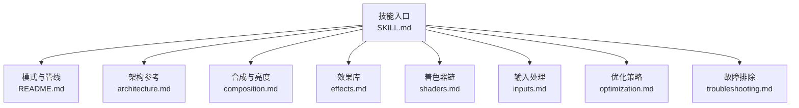
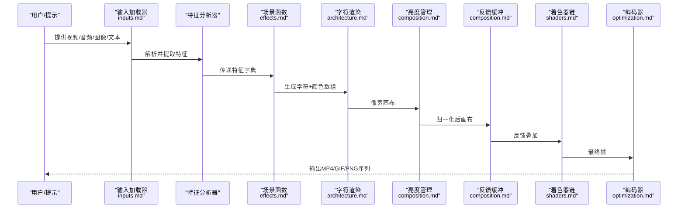
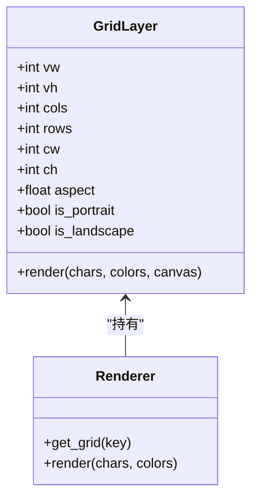
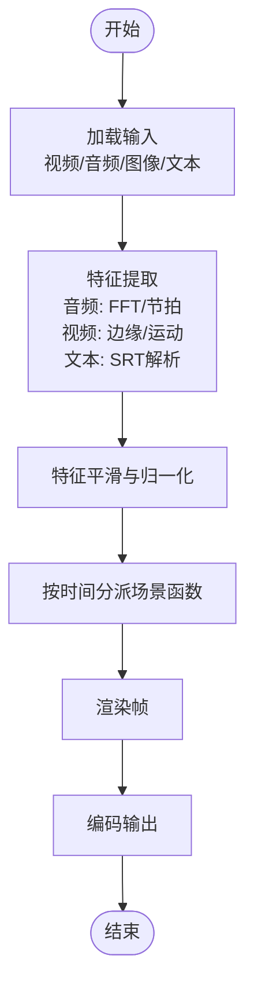
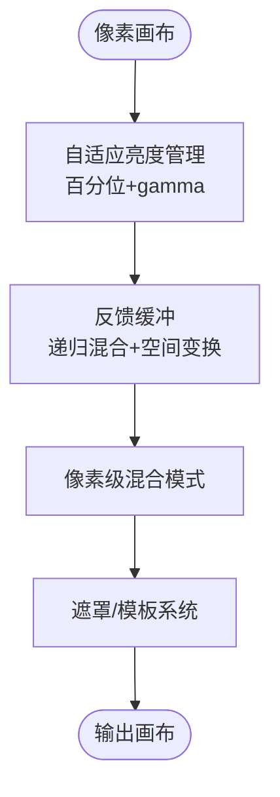
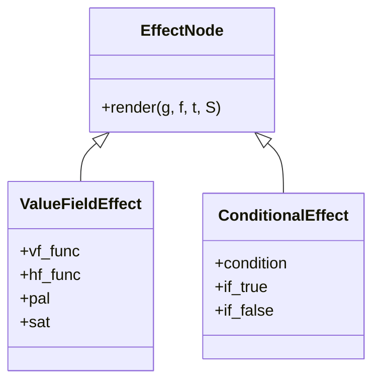
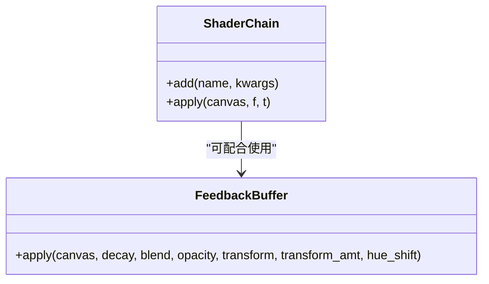
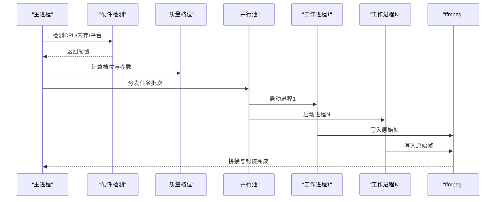
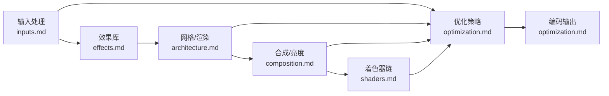

# ASCII视频工具

<cite>
**本文档引用的文件**
- [README.md](file://skills/creative/ascii-video/README.md)
- [SKILL.md](file://skills/creative/ascii-video/SKILL.md)
- [inputs.md](file://skills/creative/ascii-video/references/inputs.md)
- [architecture.md](file://skills/creative/ascii-video/references/architecture.md)
- [composition.md](file://skills/creative/ascii-video/references/composition.md)
- [effects.md](file://skills/creative/ascii-video/references/effects.md)
- [shaders.md](file://skills/creative/ascii-video/references/shaders.md)
- [optimization.md](file://skills/creative/ascii-video/references/optimization.md)
- [troubleshooting.md](file://skills/creative/ascii-video/references/troubleshooting.md)
</cite>

## 目录
1. [简介](#简介)
2. [项目结构](#项目结构)
3. [核心组件](#核心组件)
4. [架构总览](#架构总览)
5. [详细组件分析](#详细组件分析)
6. [依赖关系分析](#依赖关系分析)
7. [性能考量](#性能考量)
8. [故障排除指南](#故障排除指南)
9. [结论](#结论)
10. [附录](#附录)

## 简介
ASCII视频工具是一个端到端的ASCII字符视频渲染流水线，支持从任意内容（视频、音频、图像、纯文本）生成彩色ASCII字符动画，并通过GPU加速编码输出高质量视频。该工具不依赖GPU，完全基于CPU与Python生态，通过多密度字符网格、像素级合成、自适应亮度管理与可组合着色器链实现丰富的视觉表现。

工具特性与能力：
- 多模式渲染：视频转ASCII、音频驱动可视化、生成式动画、混合模式、歌词/字幕叠加、TTS旁白
- 高质量输出：默认1080p 24fps，支持草稿/预览/生产/极致/自动等质量档位
- 可扩展架构：模块化效果、着色器、调色板、颜色系统、反馈缓冲与遮罩系统
- 自动化适配：自动检测硬件、自适应工作进程数、分辨率与帧率、渲染时长估算
- 工程化流程：特征提取、场景函数、色调映射、着色器链、并行编码、拼接与封装

## 项目结构
ASCII视频技能位于skills/creative/ascii-video目录，采用“技能描述 + 参考文档”的组织方式：
- 技能说明：SKILL.md定义创意标准、工作流、栈与参考链接
- 模式与管线：README.md概述模式与6阶段管线
- 参考文档：architecture（网格/字体/调色）、composition（合成/亮度）、effects（效果）、shaders（着色器）、inputs（输入）、optimization（优化）、troubleshooting（故障排除）

**图表来源**
- [SKILL.md:1-233](file://skills/creative/ascii-video/SKILL.md#L1-L233)
- [README.md:1-251](file://skills/creative/ascii-video/README.md#L1-L251)

**章节来源**
- [SKILL.md:1-233](file://skills/creative/ascii-video/SKILL.md#L1-L233)
- [README.md:1-251](file://skills/creative/ascii-video/README.md#L1-L251)

## 核心组件
- 网格系统与字符渲染
  - 多密度网格（xs到xxl），按分辨率自适应列/行数，支持极稠密数据场、星雨、可读文本、巨型标题等用途
  - 字体选择与度量：跨平台字体探测、macOS使用getmetrics而非getbbox
  - 字符位图预光栅化缓存，避免每帧重复绘制
- 特征分析与输入
  - 音频：FFT、节拍检测、带能量、光谱质心、平坦度、通量、带比等
  - 视频：亮度、对比度、边缘密度、运动、主色调、色方差
  - 文本/歌词：SRT解析、打字机显示、淡入/闪烁/散射/波形等模式
  - TTS：ElevenLabs集成、语音池分配、音轨拼接与混音
- 场景函数与合成
  - 值场/色场生成器 + 多网格合成 + 像素级混合模式
  - 自适应亮度管理（百分位归一化 + gamma校正）
  - 反馈缓冲（递归轨迹、彩虹拖尾、旋转曼陀罗、颜色演化）
  - 遮罩/模板系统（圆形/矩形/环/渐变/文本模板、动画遮罩）
- 效果与粒子
  - 背景填充：正弦场、噪声、细胞/ Voronoi、视频源背景
  - 粒子系统：爆炸、上升灰烬、溶解云、星雨、轨道、重力井、蜂群、流场跟随
  - 数据/故障效果：水平位移、块破坏、扫描条、错误信息、十六进制流
  - 频谱/可视化：镜像频谱条、波形
- 着色器链
  - 几何：CRT桶形畸变、像素化、波形扭曲、万花筒、镜像（水平/垂直/四象限/对角）
  - 通道：色差、通道偏移/交换、RGB径向分离
  - 颜色：反相、海报化、阈值、负冲、色调旋转、饱和度、色彩分级、色彩抖动、色彩渐变
  - 光晕/模糊：辉光（阈值高亮）、边缘发光、柔焦、径向模糊
  - 噪声：胶片颗粒、静态噪点
  - 线条/图案：扫描线、半色调
  - 色调：暗角、对比度、伽马、色阶、亮度
  - 故障/数据：条带故障、块故障、像素排序、数据弯曲
- 并行编码与输出
  - 多进程分段渲染，ffmpeg管道直写，拼接与音频复用
  - 支持MP4/H.264、GIF（640x360@15fps）、PNG序列

**章节来源**
- [architecture.md:1-800](file://skills/creative/ascii-video/references/architecture.md#L1-L800)
- [composition.md:1-800](file://skills/creative/ascii-video/references/composition.md#L1-L800)
- [effects.md:1-800](file://skills/creative/ascii-video/references/effects.md#L1-L800)
- [shaders.md:1-800](file://skills/creative/ascii-video/references/shaders.md#L1-L800)
- [inputs.md:1-686](file://skills/creative/ascii-video/references/inputs.md#L1-L686)
- [optimization.md:1-689](file://skills/creative/ascii-video/references/optimization.md#L1-L689)

## 架构总览
ASCII视频工具采用“特征分析 → 场景函数 → 调色板映射 → 亮度管理 → 反馈缓冲 → 着色器链 → 编码”的六阶段流水线。每个阶段均可配置参数，支持按时间切分的场景表与并行渲染。

**图表来源**
- [README.md:24-63](file://skills/creative/ascii-video/README.md#L24-L63)
- [inputs.md:1-686](file://skills/creative/ascii-video/references/inputs.md#L1-L686)
- [effects.md:1-800](file://skills/creative/ascii-video/references/effects.md#L1-L800)
- [architecture.md:1-800](file://skills/creative/ascii-video/references/architecture.md#L1-L800)
- [composition.md:1-800](file://skills/creative/ascii-video/references/composition.md#L1-L800)
- [shaders.md:1-800](file://skills/creative/ascii-video/references/shaders.md#L1-L800)
- [optimization.md:1-689](file://skills/creative/ascii-video/references/optimization.md#L1-L689)

## 详细组件分析

### 组件A：网格系统与字符渲染
- 多密度网格：在不同密度上渲染同一场景，利用字符尺度差异产生纹理干涉，形成复杂视觉层次
- 字体与度量：跨平台字体探测，macOS使用getmetrics获取正确字符高度
- 位图缓存：初始化时预光栅化所有字符位图，渲染时直接采样，避免每帧Python循环
- 渲染器：逐单元格合成字符位图与颜色，使用np.maximum进行加法混合

**图表来源**
- [architecture.md:155-242](file://skills/creative/ascii-video/references/architecture.md#L155-L242)

**章节来源**
- [architecture.md:5-242](file://skills/creative/ascii-video/references/architecture.md#L5-L242)

### 组件B：特征分析与输入处理
- 音频分析：FFT、节拍检测、带能量、光谱质心、平坦度、通量、带比；指数衰减生成节拍脉冲
- 视频分析：亮度、对比度、边缘密度、运动、主色调、色方差
- 文本/歌词：SRT解析、打字机显示、淡入/闪烁/散射/波形
- TTS：ElevenLabs语音生成、语音池分配、音轨拼接与混音

**图表来源**
- [inputs.md:1-686](file://skills/creative/ascii-video/references/inputs.md#L1-L686)

**章节来源**
- [inputs.md:1-686](file://skills/creative/ascii-video/references/inputs.md#L1-L686)

### 组件C：合成与亮度管理
- 像素级混合模式：20种混合模式（screen/add/multiply/overlay/difference/exclusion等），支持透明度
- 自适应亮度管理：百分位归一化 + gamma校正，避免线性增益导致高亮截断或低亮不可见
- 反馈缓冲：递归帧混合，支持缩放/收缩/旋转/上下平移/镜像等空间变换与色调漂移
- 遮罩系统：圆形/矩形/环/径向渐变/文本模板、动画遮罩（光圈/擦除/溶解）

**图表来源**
- [composition.md:268-800](file://skills/creative/ascii-video/references/composition.md#L268-L800)

**章节来源**
- [composition.md:1-800](file://skills/creative/ascii-video/references/composition.md#L1-L800)

### 组件D：效果与粒子系统
- 背景填充：正弦场、噪声、细胞/Voronoi、视频源背景
- 粒子系统：爆炸（节拍触发）、上升灰烬、溶解云、星雨（3D投影）、轨道、重力井、蜂群（boids）、流场跟随
- 数据/故障效果：水平位移、块破坏、扫描条、错误信息、十六进制流
- 频谱/可视化：镜像频谱条、波形

**图表来源**
- [effects.md:684-783](file://skills/creative/ascii-video/references/effects.md#L684-L783)

**章节来源**
- [effects.md:1-800](file://skills/creative/ascii-video/references/effects.md#L1-L800)

### 组件E：着色器链与后处理
- 几何：CRT桶形畸变、像素化、波形扭曲、万花筒、镜像系列
- 通道：色差、通道偏移/交换、RGB径向分离
- 颜色：反相、海报化、阈值、负冲、色调旋转、饱和度、色彩分级、色彩抖动、色彩渐变
- 光晕/模糊：辉光（阈值高亮）、边缘发光、柔焦、径向模糊
- 噪声：胶片颗粒、静态噪点
- 线条/图案：扫描线、半色调
- 色调：暗角、对比度、伽马、色阶、亮度
- 故障/数据：条带故障、块故障、像素排序、数据弯曲

**图表来源**
- [shaders.md:143-172](file://skills/creative/ascii-video/references/shaders.md#L143-L172)
- [composition.md:392-521](file://skills/creative/ascii-video/references/composition.md#L392-L521)

**章节来源**
- [shaders.md:1-800](file://skills/creative/ascii-video/references/shaders.md#L1-L800)
- [composition.md:392-521](file://skills/creative/ascii-video/references/composition.md#L392-L521)

### 组件F：并行编码与输出
- 硬件检测：CPU核数、内存、平台、ffmpeg可用性
- 质量档位：草稿/预览/生产/极致/自动，自适应分辨率、帧率、CRF、网格密度
- 并行渲染：多进程分段渲染，每进程独立ffmpeg管道
- 拼接与封装：ffmpeg concat + 音频复用

**图表来源**
- [optimization.md:5-121](file://skills/creative/ascii-video/references/optimization.md#L5-L121)
- [optimization.md:476-548](file://skills/creative/ascii-video/references/optimization.md#L476-L548)

**章节来源**
- [optimization.md:1-689](file://skills/creative/ascii-video/references/optimization.md#L1-L689)

## 依赖关系分析
- 模块耦合
  - effects与architecture紧密耦合：效果通过_grid层生成值场/色场，再由_render_vf渲染到像素画布
  - composition与shaders共同作用于像素画布，前者负责合成与亮度，后者负责后处理
  - inputs与effects/scene函数对接，提供特征字典驱动视觉参数
  - optimization贯穿全局：硬件检测影响质量档位，质量档位决定网格密度、帧率、CRF与工作进程数
- 外部依赖
  - Python生态：NumPy、SciPy（信号）、Pillow（字体/图像）、ffmpeg（解码/编码/复用）
  - 可选：OpenCV（视频采样/边缘检测）、requests（TTS）

**图表来源**
- [inputs.md:1-686](file://skills/creative/ascii-video/references/inputs.md#L1-L686)
- [effects.md:1-800](file://skills/creative/ascii-video/references/effects.md#L1-L800)
- [architecture.md:1-800](file://skills/creative/ascii-video/references/architecture.md#L1-L800)
- [composition.md:1-800](file://skills/creative/ascii-video/references/composition.md#L1-L800)
- [shaders.md:1-800](file://skills/creative/ascii-video/references/shaders.md#L1-L800)
- [optimization.md:1-689](file://skills/creative/ascii-video/references/optimization.md#L1-L689)

**章节来源**
- [inputs.md:1-686](file://skills/creative/ascii-video/references/inputs.md#L1-L686)
- [effects.md:1-800](file://skills/creative/ascii-video/references/effects.md#L1-L800)
- [architecture.md:1-800](file://skills/creative/ascii-video/references/architecture.md#L1-L800)
- [composition.md:1-800](file://skills/creative/ascii-video/references/composition.md#L1-L800)
- [shaders.md:1-800](file://skills/creative/ascii-video/references/shaders.md#L1-L800)
- [optimization.md:1-689](file://skills/creative/ascii-video/references/optimization.md#L1-L689)

## 性能考量
- 性能预算
  - 单帧预算：特征提取1-5ms、效果函数2-15ms、字符渲染80-150ms（瓶颈）、着色器5-25ms、ffmpeg编码~5ms
  - 目标：100-200ms/帧（单核5-10fps，8核40-80fps）
- 关键优化
  - 位图预光栅化：初始化一次性生成字符位图缓存
  - 坐标数组缓存：网格相对坐标数组在初始化时生成
  - 向量化：效果函数必须全向量化，避免Python逐单元格循环
  - 粒子系统：限制数量、批量索引更新、及时裁剪
  - 布隆优化：4倍降采样+手工盒糊替代uniform_filter
  - 暗角缓存：距离场按分辨率与强度缓存
  - 胶片颗粒：半分辨率随机噪声+重采样
  - 并行渲染：多进程分段，每进程独立ffmpeg，stderr写文件避免死锁
- 渲染时间估算
  - 基线：1080p 24fps ~180ms/帧/核
  - 720p约减半，4K约乘四
  - 更重效果（大量粒子/密集网格/额外着色器）增加20-50%

**章节来源**
- [optimization.md:200-689](file://skills/creative/ascii-video/references/optimization.md#L200-L689)

## 故障排除指南
- 常见症状与修复
  - 全黑输出：检查gamma是否过高或场景未渲染非零画布
  - 过曝/过亮：替换线性增益为tonemap
  - ffmpeg卡死：stderr改写文件，不要PIPE
  - 只读数组错误：broadcast_to后添加.copy()
  - PicklingError：场景函数定义在模块顶层，避免lambda/闭包
  - 字体缺失Unicode：初始化时验证字符集
  - 音画不同步：使用整数帧计数，每帧重新计算时间
  - 单色输出：确保h/s/v数组形状一致
  - 文本不可读：使用apply_text_backdrop + reverse_vignette
  - 文本扭曲：不要对含可读文本的场景应用万花筒/镜像类着色器
- NumPy广播陷阱
  - broadcast_to视图只读，需.copy()
  - in-place运算需形状匹配，否则用+替代+=
  - hsv2rgb输入三数组形状必须一致
- 并行与进程隔离
  - macOS spawn vs Linux fork，模块级代码在每个进程中执行
  - 每个进程独立Renderer/FeedbackBuffer/随机种子
- ffmpeg问题
  - 死锁：stderr写文件
  - 帧数不匹配：显式计算n_frames
  - concat报unsafe：使用-safe 0
- 字体问题
  - macOS使用getmetrics获取正确字符高度
  - 验证字符集，缺失字符会呈现空洞
- 性能回归排查
  - 检查网格数量、粒子数量、着色器数量
  - 排查Python循环、未裁剪值域、过低亮度

**章节来源**
- [troubleshooting.md:1-368](file://skills/creative/ascii-video/references/troubleshooting.md#L1-L368)

## 结论
ASCII视频工具通过模块化的网格系统、向量化效果、自适应亮度管理与可组合着色器链，实现了从视频/音频/图像/文本到高质量ASCII字符视频的完整生产管线。其自动化硬件适配与并行编码机制确保了在不同设备上的稳定性能与可预测的渲染时长。遵循本文档的架构设计、组件实现与优化策略，可高效产出具有创意表达与技术深度的ASCII视频作品。

## 附录
- 创意标准与工作流
  - 创意优先：先构思视觉故事，再实现技术方案
  - 一致性：全片统一的色彩温度、字符调色板与运动语言
  - 层次感：每帧都值得细看，避免平面黑色背景
  - 变化：每一段/场景在效果、调色板、色彩策略、着色器强度上有所变化
- 最佳实践清单
  - 先渲染测试帧（起始/中间/结尾），验证亮度与一致性
  - 使用screen而非overlay混合深色ASCII层
  - 默认gamma 0.75，根据后处理调整
  - 多网格组合与遮罩提升复杂度
  - 控制粒子数量，避免性能瓶颈
  - 使用并行渲染与ffmpeg管道，避免stderr PIPE死锁
  - 初始化时验证字体与字符集，避免空洞
  - 使用质量档位与硬件检测，平衡画质与时长

**章节来源**
- [SKILL.md:8-148](file://skills/creative/ascii-video/SKILL.md#L8-L148)
- [optimization.md:111-157](file://skills/creative/ascii-video/references/optimization.md#L111-L157)