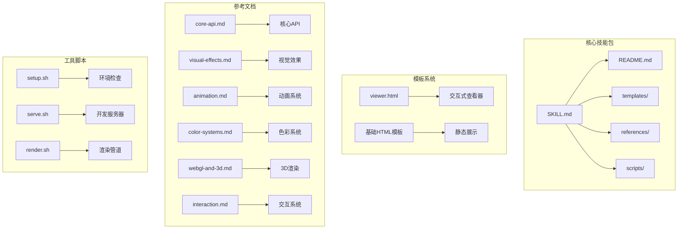
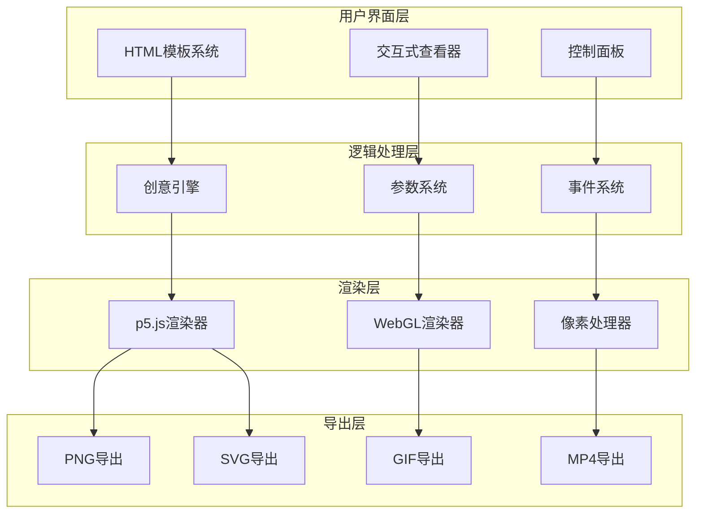
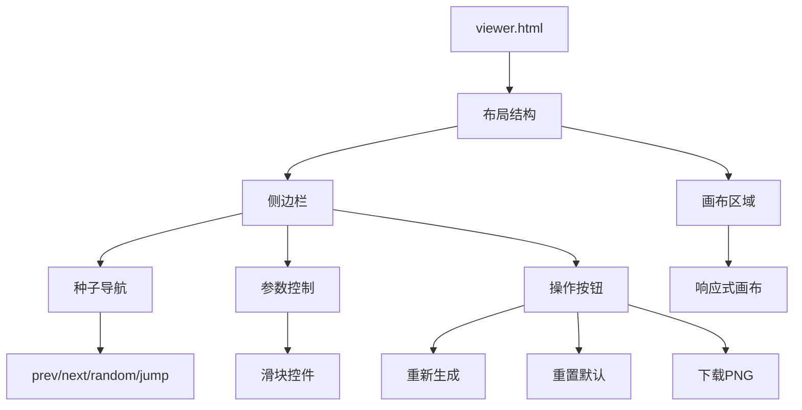
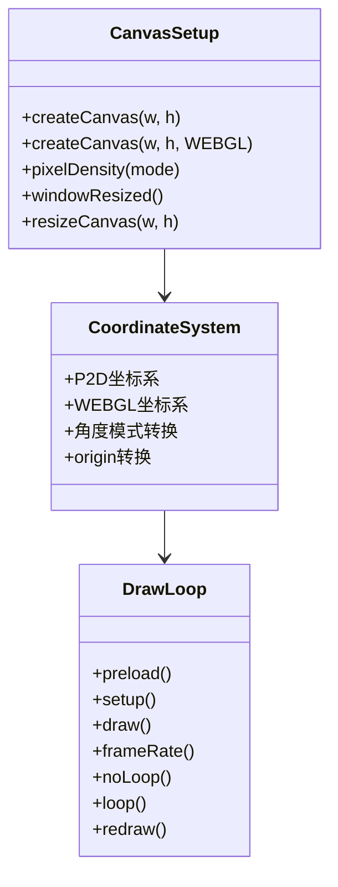
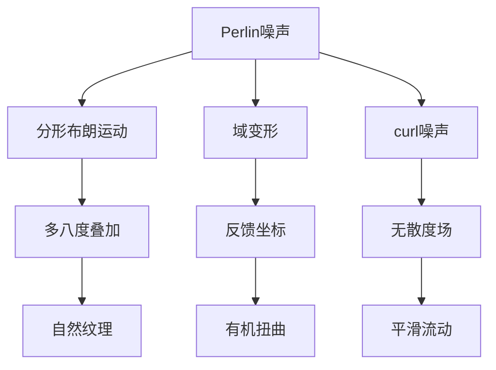
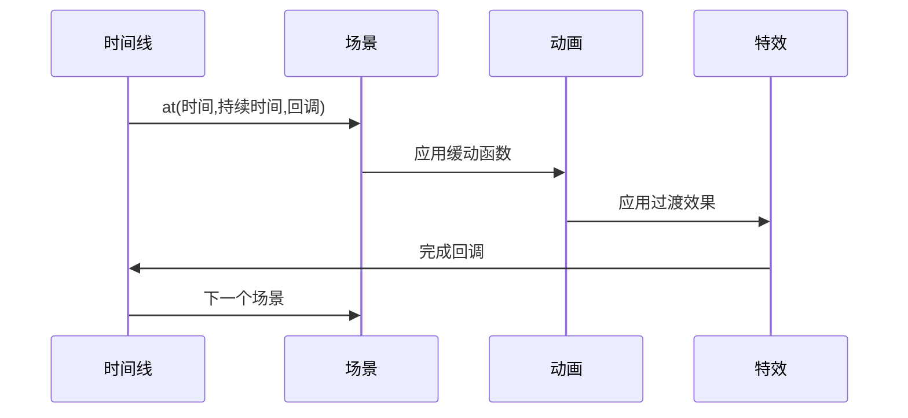
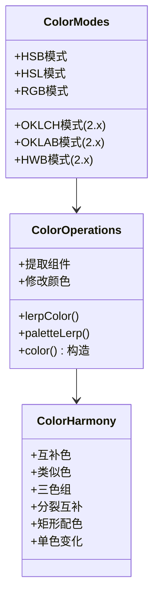
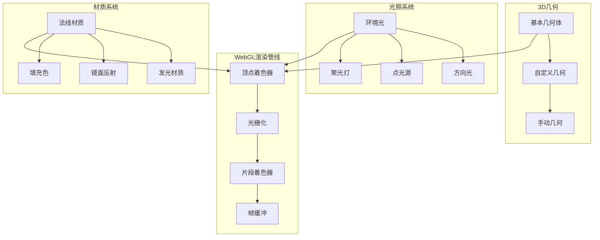
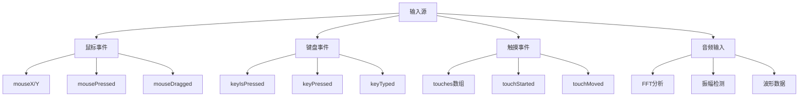
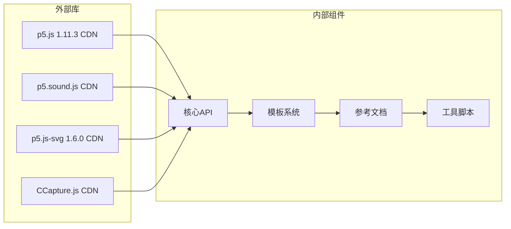

# P5JS创意编程工具

<cite>
**本文档引用的文件**
- [README.md](file://skills/creative/p5js/README.md)
- [SKILL.md](file://skills/creative/p5js/SKILL.md)
- [viewer.html](file://skills/creative/p5js/templates/viewer.html)
- [setup.sh](file://skills/creative/p5js/scripts/setup.sh)
- [serve.sh](file://skills/creative/p5js/scripts/serve.sh)
- [core-api.md](file://skills/creative/p5js/references/core-api.md)
- [shapes-and-geometry.md](file://skills/creative/p5js/references/shapes-and-geometry.md)
- [visual-effects.md](file://skills/creative/p5js/references/visual-effects.md)
- [animation.md](file://skills/creative/p5js/references/animation.md)
- [typography.md](file://skills/creative/p5js/references/typography.md)
- [color-systems.md](file://skills/creative/p5js/references/color-systems.md)
- [webgl-and-3d.md](file://skills/creative/p5js/references/webgl-and-3d.md)
- [interaction.md](file://skills/creative/p5js/references/interaction.md)
- [troubleshooting.md](file://skills/creative/p5js/references/troubleshooting.md)
</cite>

## 目录
1. [简介](#简介)
2. [项目结构](#项目结构)
3. [核心组件](#核心组件)
4. [架构概览](#架构概览)
5. [详细组件分析](#详细组件分析)
6. [依赖关系分析](#依赖关系分析)
7. [性能考虑](#性能考虑)
8. [故障排除指南](#故障排除指南)
9. [结论](#结论)
10. [附录](#附录)

## 简介

P5JS创意编程工具是一个基于p5.js的生产级创意编程平台，专注于在浏览器中创建交互式和生成式视觉艺术。该工具提供了完整的创意工作流程，从概念设计到最终导出，支持多种创意编程模式和高级视觉效果。

### 主要特性

- **多模式创作**：生成式艺术、数据可视化、交互体验、动画制作、3D场景、图像处理、音频响应
- **完整工作流**：从创意概念到最终导出的端到端解决方案
- **高性能渲染**：优化的渲染管道，支持大规模粒子系统和复杂视觉效果
- **灵活导出**：HTML、PNG、GIF、MP4、SVG等多种输出格式
- **实时交互**：鼠标、键盘、触摸、音频输入的完整交互支持

## 项目结构

P5JS创意编程工具采用模块化设计，主要包含以下核心组件：



**图表来源**
- [SKILL.md:43-57](file://skills/creative/p5js/SKILL.md#L43-L57)
- [README.md:43-65](file://skills/creative/p5js/README.md#L43-L65)

**章节来源**
- [README.md:1-65](file://skills/creative/p5js/README.md#L1-L65)
- [SKILL.md:41-57](file://skills/creative/p5js/SKILL.md#L41-L57)

## 核心组件

### 创意标准

该工具定义了严格的创意标准，确保输出的艺术作品具有专业水准：

- **首次渲染卓越性**：输出必须在首次加载时就具有视觉冲击力
- **超越教程水平**：避免使用默认配置或教程练习
- **创造性组合**：将参考词汇中的元素进行创新组合
- **美学一致性**：所有元素必须服务于统一的视觉语言

### 技术栈

| 层级 | 工具 | 目的 |
|------|------|------|
| 核心 | p5.js 1.11.3 (CDN) | 画布渲染、数学运算、变换、事件处理 |
| 3D | p5.js WebGL模式 | 3D几何、相机、光照、着色器 |
| 音频 | p5.sound.js (CDN) | FFT分析、振幅、麦克风输入、振荡器 |
| 导出 | 内置saveCanvas/saveGif/saveFrames | PNG、GIF、帧序列输出 |
| 捕获 | CCapture.js (可选) | 确定性帧率视频捕获 |
| 无头 | Puppeteer + Node.js (可选) | 自动化高分辨率渲染、ffmpeg生成MP4 |

**章节来源**
- [SKILL.md:41-57](file://skills/creative/p5js/SKILL.md#L41-L57)
- [SKILL.md:272-298](file://skills/creative/p5js/SKILL.md#L272-L298)

## 架构概览

P5JS创意编程工具采用分层架构设计，支持多种创作模式和导出需求：



**图表来源**
- [SKILL.md:64-78](file://skills/creative/p5js/SKILL.md#L64-L78)
- [viewer.html:259-395](file://skills/creative/p5js/templates/viewer.html#L259-L395)

### 工作流程

工具遵循六阶段工作流程：

1. **概念**：阐述创意愿景，确定情感、色彩体系、运动风格
2. **设计**：选择模式、画布尺寸、交互模型、导出格式
3. **编码**：编写单HTML文件，结构化组织代码
4. **预览**：在浏览器中验证视觉质量
5. **导出**：根据需要捕获输出
6. **验证**：检查是否符合创意概念

**章节来源**
- [SKILL.md:64-78](file://skills/creative/p5js/SKILL.md#L64-L78)
- [SKILL.md:134-271](file://skills/creative/p5js/SKILL.md#L134-L271)

## 详细组件分析

### HTML模板系统

模板系统提供了两种主要的HTML模板：

#### 交互式查看器模板

交互式查看器模板专为可探索的生成式艺术设计：



**图表来源**
- [viewer.html:1-395](file://skills/creative/p5js/templates/viewer.html#L1-L395)

#### 基础HTML模板

基础HTML模板适用于简单的静态展示：

- **配置部分**：包含种子、参数对象
- **颜色调色板**：预定义的颜色方案
- **全局状态**：粒子数组等可变状态
- **生命周期函数**：preload、setup、draw、事件处理

**章节来源**
- [viewer.html:1-395](file://skills/creative/p5js/templates/viewer.html#L1-L395)
- [SKILL.md:159-236](file://skills/creative/p5js/SKILL.md#L159-L236)

### 核心API参考

#### 画布设置

核心API提供了完整的画布管理功能：



**图表来源**
- [core-api.md:3-47](file://skills/creative/p5js/references/core-api.md#L3-L47)
- [core-api.md:49-86](file://skills/creative/p5js/references/core-api.md#L49-L86)

#### 变换系统

变换系统支持复杂的几何变换：

- **平移**：translate(x, y[, z])
- **旋转**：rotate(angle[, axis])
- **缩放**：scale(s[, sx, sy, sz])
- **剪切**：shearX(angle)、shearY(angle)
- **矩阵应用**：applyMatrix()

**章节来源**
- [core-api.md:100-137](file://skills/creative/p5js/references/core-api.md#L100-L137)

### 视觉效果系统

#### 噪声系统

噪声系统是生成式艺术的核心：



**图表来源**
- [visual-effects.md:3-81](file://skills/creative/p5js/references/visual-effects.md#L3-L81)

#### 粒子系统

粒子系统支持多种物理模拟：

- **基础物理粒子**：速度、加速度、衰减
- **吸引子驱动**：万有引力模拟
- **鸟类群集**：对齐、聚集、分离行为
- **流场跟随**：基于噪声场的运动

**章节来源**
- [visual-effects.md:158-259](file://skills/creative/p5js/references/visual-effects.md#L158-L259)

### 动画系统

#### 时间线系统

时间线系统支持复杂的多场景动画：



**图表来源**
- [animation.md:212-260](file://skills/creative/p5js/references/animation.md#L212-L260)

#### 缓动函数

支持多种缓动曲线：

- **线性插值**：lerp()
- **二次缓入/出**：easeInQuad、easeOutQuad
- **三次缓入/出**：easeInCubic、easeOutCubic
- **弹性效果**：easeOutElastic
- **弹跳效果**：easeOutBounce

**章节来源**
- [animation.md:42-94](file://skills/creative/p5js/references/animation.md#L42-L94)

### 色彩系统

#### 颜色模式

支持多种颜色模式：



**图表来源**
- [color-systems.md:1-353](file://skills/creative/p5js/references/color-systems.md#L1-L353)

#### 渐变渲染

支持多种渐变技术：

- **线性渐变**：通过插值创建平滑过渡
- **径向渐变**：从中心向外扩散
- **噪声渐变**：基于Perlin噪声的自然渐变
- **多点渐变**：多个颜色点的插值

**章节来源**
- [color-systems.md:103-155](file://skills/creative/p5js/references/color-systems.md#L103-L155)

### 3D与WebGL

#### WebGL渲染

WebGL模式提供完整的3D渲染能力：



**图表来源**
- [webgl-and-3d.md:1-424](file://skills/creative/p5js/references/webgl-and-3d.md#L1-L424)

#### 着色器系统

着色器系统支持自定义GLSL效果：

- **createShader**：创建自定义顶点和片段着色器
- **createFilterShader**：创建后处理滤镜
- **uniform变量**：时间、分辨率、鼠标位置等
- **多通道渲染**：帧缓冲和多重渲染

**章节来源**
- [webgl-and-3d.md:244-341](file://skills/creative/p5js/references/webgl-and-3d.md#L244-L341)

### 交互系统

#### 输入处理

支持多种输入方式：



**图表来源**
- [interaction.md:1-399](file://skills/creative/p5js/references/interaction.md#L1-L399)

#### DOM集成

内置DOM元素创建：

- **滑块控件**：createSlider()
- **按钮控件**：createButton()
- **复选框**：createCheckbox()
- **下拉菜单**：createSelect()
- **颜色选择器**：createColorPicker()
- **文本输入**：createInput()

**章节来源**
- [interaction.md:219-270](file://skills/creative/p5js/references/interaction.md#L219-L270)

## 依赖关系分析

### 外部依赖

P5JS创意编程工具的依赖关系相对简单，主要依赖于CDN资源：



**图表来源**
- [SKILL.md:47-56](file://skills/creative/p5js/SKILL.md#L47-L56)

### 内部模块依赖

内部模块之间存在清晰的层次关系：

- **模板系统**依赖**核心API**和**交互系统**
- **参考文档**为**模板系统**提供设计指导
- **工具脚本**支持**模板系统**的开发和部署

**章节来源**
- [SKILL.md:499-514](file://skills/creative/p5js/SKILL.md#L499-L514)

## 性能考虑

### 性能优化策略

工具提供了全面的性能优化指导：

#### 关键优化点

1. **禁用友好错误系统(FES)**：减少10倍性能开销
2. **像素密度控制**：始终使用pixelDensity(1)进行导出
3. **原生Math函数**：在热循环中使用Math.*替代p5包装函数
4. **绘制调用优化**：使用beginShape()减少绘制调用次数

#### 内存管理

- **对象池**：重用粒子和其他临时对象
- **空间哈希**：优化邻近查询性能
- **图形缓冲区清理**：及时释放不再使用的缓冲区

**章节来源**
- [troubleshooting.md:3-62](file://skills/creative/p5js/references/troubleshooting.md#L3-L62)
- [troubleshooting.md:136-164](file://skills/creative/p5js/references/troubleshooting.md#L136-L164)

### 性能目标

| 指标 | 目标 |
|------|------|
| 交互式帧率 | 60fps持续 |
| 动画导出帧率 | 30fps最低 |
| P2D形状粒子数 | 5,000-10,000在60fps |
| 像素缓冲粒子数 | 50,000-100,000在60fps |
| 画布分辨率 | 最高3840x2160(导出)，1920x1080(交互) |
| HTML文件大小 | <100KB(不含CDN库) |
| 首帧加载时间 | <2秒 |

## 故障排除指南

### 常见问题

#### 性能问题

**症状**：帧率下降、内存泄漏、浏览器卡顿

**解决方法**：
1. 确保禁用FES：p5.disableFriendlyErrors = true
2. 设置正确的像素密度：pixelDensity(1)
3. 使用原生Math函数替代p5包装函数
4. 实现对象池和空间哈希

#### 兼容性问题

**Safari问题**：
- WebGL着色器精度：声明precision mediump float;
- AudioContext需要用户手势：userStartAudio()
- blendMode选项行为差异

**Firefox问题**：
- textToPoints()点数可能不同
- WebGL扩展与Chrome差异
- 颜色配置文件影响

**移动设备问题**：
- 触摸事件需要return false阻止滚动
- devicePixelRatio可能是2x或3x
- 需要显式用户手势启动音频

**章节来源**
- [troubleshooting.md:414-431](file://skills/creative/p5js/references/troubleshooting.md#L414-L431)

### 调试技巧

#### 控制台日志

```javascript
// 每帧记录会带来巨大开销
// 建议改为定期或条件性记录
if (frameCount % 60 === 0) {
  console.log('FPS:', frameRate().toFixed(1));
}
```

#### 可视化调试

```javascript
// 在画布上显示调试信息
if (CONFIG.debug) {
  fill(255, 0, 0);
  noStroke();
  textSize(14);
  text('FPS: ' + frameRate().toFixed(1), 10, 10);
}
```

**章节来源**
- [troubleshooting.md:481-533](file://skills/creative/p5js/references/troubleshooting.md#L481-L533)

## 结论

P5JS创意编程工具提供了一个完整、专业的创意编程解决方案。通过精心设计的模板系统、丰富的参考文档和强大的性能优化，该工具能够支持从简单到复杂的各种创意项目。

### 核心优势

1. **专业级工作流程**：从概念到导出的完整流程
2. **高性能渲染**：优化的渲染管道支持复杂视觉效果
3. **灵活的导出选项**：多种格式支持不同的发布需求
4. **全面的交互支持**：鼠标、键盘、触摸、音频的完整集成
5. **详细的文档支持**：丰富的参考文档和最佳实践指导

### 适用场景

- **教育用途**：作为p5.js学习和教学的高级示例
- **商业项目**：用于创建交互式网页艺术和数据可视化
- **个人创作**：支持独立艺术家和设计师的创意实验
- **演示用途**：快速创建演示和原型

## 附录

### 快速开始

1. **安装依赖**：
```bash
bash skills/creative/p5js/scripts/setup.sh
```

2. **本地开发**：
```bash
bash skills/creative/p5js/scripts/serve.sh
```

3. **创建第一个项目**：
   - 从viewer.html模板开始
   - 修改参数控制系统
   - 实现自定义算法
   - 测试和优化性能

### 导出指南

#### 单帧导出
- PNG：使用saveCanvas()或按's'键保存
- GIF：使用saveGif()或按'g'键保存

#### 视频导出
- 使用render.sh脚本生成MP4
- 通过Puppeteer进行无头渲染
- 支持批量导出和自定义参数

#### 批量处理
- 支持多场景视频合成
- 提供per-clip架构支持
- 自动化的帧序列生成

**章节来源**
- [setup.sh:1-88](file://skills/creative/p5js/scripts/setup.sh#L1-L88)
- [serve.sh:1-29](file://skills/creative/p5js/scripts/serve.sh#L1-L29)
- [SKILL.md:253-271](file://skills/creative/p5js/SKILL.md#L253-L271)