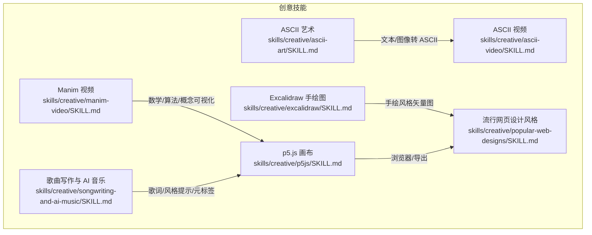
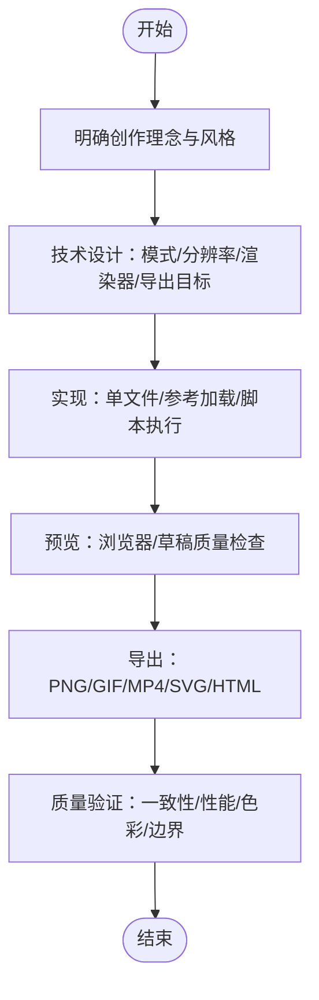
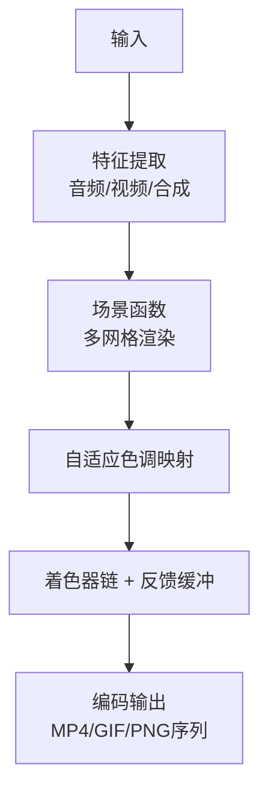
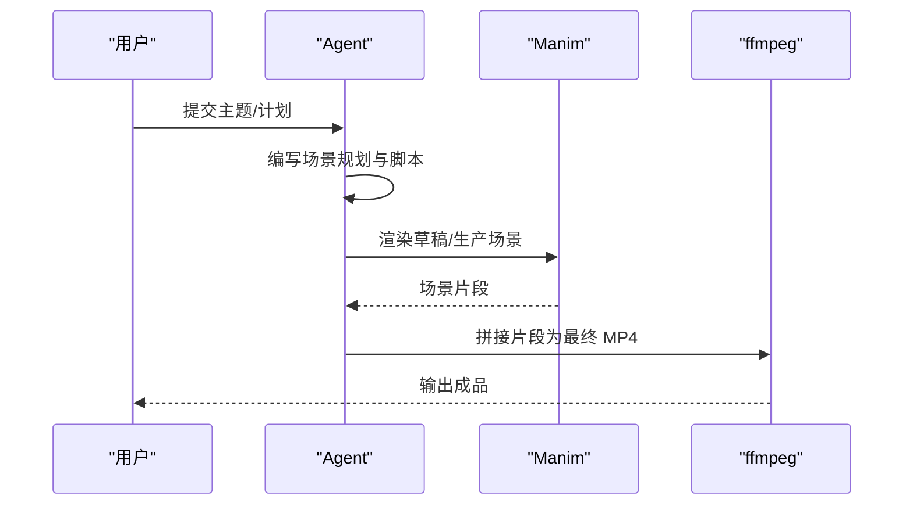
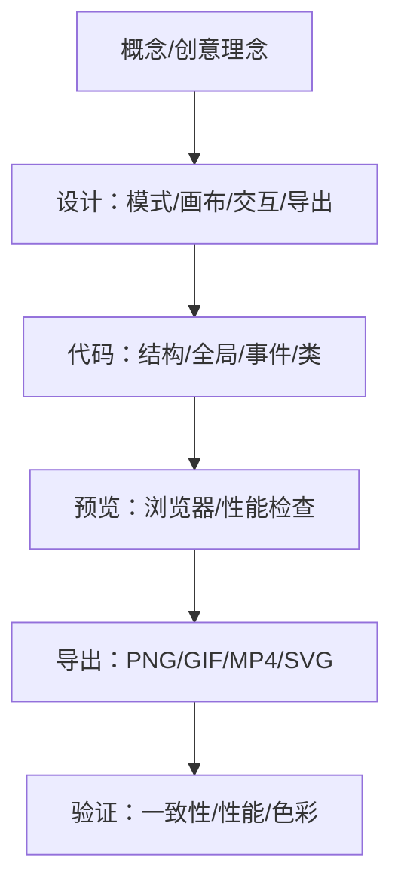
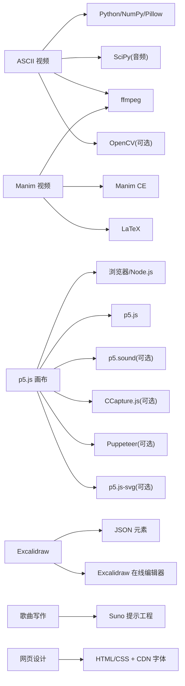

# 创意工具

<cite>
**本文引用的文件**
- [skills/creative/DESCRIPTION.md](file://skills/creative/DESCRIPTION.md)
- [skills/creative/ascii-art/SKILL.md](file://skills/creative/ascii-art/SKILL.md)
- [skills/creative/ascii-video/SKILL.md](file://skills/creative/ascii-video/SKILL.md)
- [skills/creative/ascii-video/README.md](file://skills/creative/ascii-video/README.md)
- [skills/creative/manim-video/SKILL.md](file://skills/creative/manim-video/SKILL.md)
- [skills/creative/manim-video/README.md](file://skills/creative/manim-video/README.md)
- [skills/creative/p5js/SKILL.md](file://skills/creative/p5js/SKILL.md)
- [skills/creative/p5js/README.md](file://skills/creative/p5js/README.md)
- [skills/creative/excalidraw/SKILL.md](file://skills/creative/excalidraw/SKILL.md)
- [skills/creative/songwriting-and-ai-music/SKILL.md](file://skills/creative/songwriting-and-ai-music/SKILL.md)
- [skills/creative/popular-web-designs/SKILL.md](file://skills/creative/popular-web-designs/SKILL.md)
</cite>

## 目录
1. [简介](#简介)
2. [项目结构](#项目结构)
3. [核心组件](#核心组件)
4. [架构总览](#架构总览)
5. [详细组件分析](#详细组件分析)
6. [依赖关系分析](#依赖关系分析)
7. [性能考量](#性能考量)
8. [故障排查指南](#故障排查指南)
9. [结论](#结论)
10. [附录](#附录)

## 简介
本文件系统化梳理 Hermes Agent 的创意工具技能集合，覆盖 ASCII 艺术、视频生成（含音频可视化与生成式动画）、图表与手绘图、交互式与生成式视觉艺术、音乐创作与 AI 歌词生成、以及网页设计风格模板等方向。文档面向不同技术背景的用户，既提供创作流程、参数配置与输出格式说明，也给出组合使用建议、质量优化技巧与版权注意事项，帮助以更低试错成本获得高质量创意产出。

## 项目结构
创意工具位于 skills/creative 目录下，每个子技能均提供独立的 SKILL.md（能力说明）与 README.md（使用说明），并可按需加载参考文档或脚本进行实现与导出。

**图表来源**
- [skills/creative/ascii-art/SKILL.md:1-322](file://skills/creative/ascii-art/SKILL.md#L1-L322)
- [skills/creative/ascii-video/SKILL.md:1-233](file://skills/creative/ascii-video/SKILL.md#L1-L233)
- [skills/creative/manim-video/SKILL.md:1-265](file://skills/creative/manim-video/SKILL.md#L1-L265)
- [skills/creative/p5js/SKILL.md:1-548](file://skills/creative/p5js/SKILL.md#L1-L548)
- [skills/creative/excalidraw/SKILL.md:1-195](file://skills/creative/excalidraw/SKILL.md#L1-L195)
- [skills/creative/songwriting-and-ai-music/SKILL.md:1-290](file://skills/creative/songwriting-and-ai-music/SKILL.md#L1-L290)
- [skills/creative/popular-web-designs/SKILL.md:1-207](file://skills/creative/popular-web-designs/SKILL.md#L1-L207)

**章节来源**
- [skills/creative/DESCRIPTION.md:1-4](file://skills/creative/DESCRIPTION.md#L1-L4)

## 核心组件
- ASCII 艺术：多工具链合一，支持本地 pyfiglet、远程 asciified API、cowsay、boxes、toilet、图像转 ASCII、预设艺术检索与 LLM 自定义生成，覆盖文本横幅、消息气泡、装饰边框、彩色字符效果与图片转 ASCII。
- ASCII 视频：从任意输入（视频/音频/图像/生成式）到彩色字符视频的完整管线，支持亮度自适应调校、多网格合成、反馈缓冲、着色器链与并行编码，输出 MP4/GIF/序列帧。
- Manim 视频：数学与技术动画生产管线，强调叙事弧与教学性，提供场景规划、LaTeX 方程渲染、3D/相机控制、旁白与音频拼接，适合解释器风格的教育视频。
- p5.js 画布：浏览器端交互与生成式艺术，涵盖噪声/粒子/流场、WebGL/着色器、像素处理、动文字体、音频响应、鼠标键盘交互与头像导出，支持 PNG/GIF/MP4/SVG。
- Excalidraw 手绘图：基于 JSON 元素的“手绘风”矢量图，可直接在 excalidraw.com 打开编辑，支持容器绑定、箭头标注、颜色与排版规范。
- 歌曲写作与 AI 音乐：系统化歌词结构、韵律、情感动态、副歌定位、拟声与 AI 提示工程（Suno），并提供元标签体系与工作流。
- 流行网页设计风格：54 套真实网站的设计系统模板，包含配色、字体、组件、布局与阴影等设计令牌，便于快速生成风格一致的页面。

**章节来源**
- [skills/creative/ascii-art/SKILL.md:1-322](file://skills/creative/ascii-art/SKILL.md#L1-L322)
- [skills/creative/ascii-video/SKILL.md:1-233](file://skills/creative/ascii-video/SKILL.md#L1-L233)
- [skills/creative/manim-video/SKILL.md:1-265](file://skills/creative/manim-video/SKILL.md#L1-L265)
- [skills/creative/p5js/SKILL.md:1-548](file://skills/creative/p5js/SKILL.md#L1-L548)
- [skills/creative/excalidraw/SKILL.md:1-195](file://skills/creative/excalidraw/SKILL.md#L1-L195)
- [skills/creative/songwriting-and-ai-music/SKILL.md:1-290](file://skills/creative/songwriting-and-ai-music/SKILL.md#L1-L290)
- [skills/creative/popular-web-designs/SKILL.md:1-207](file://skills/creative/popular-web-designs/SKILL.md#L1-L207)

## 架构总览
各技能遵循“创作理念—技术设计—实现—验证”的统一流程，部分技能提供参考文档与脚本以加速迭代。

[本图为通用流程示意，不直接映射具体源码文件，故无图表来源]

## 详细组件分析

### ASCII 艺术（多工具链）
- 功能特性
  - 文本横幅：pyfiglet（本地安装）、asciified API（远程无安装）
  - 消息艺术：cowsay（带角色与表情修饰）
  - 装饰边框：boxes（70+样式）
  - 彩色字符：toilet（ANSI 效果与滤镜）
  - 图像转 ASCII：ascii-image-converter 或 jp2a
  - 预设艺术检索：ascii.co.uk 主题分类；GitHub Octocat API
  - LLM 自定义：Unicode 字符集与尺寸约束
- 使用场景
  - 快速生成终端横幅、消息气泡、装饰边框
  - 将图片转为 ASCII 艺术用于复古/极客风格
  - 搜索经典 ASCII 艺术作为素材
- 技术实现要点
  - 工具选择与回退策略（已安装优先，否则远程/LLM）
  - 字体与字符兼容性（缺失字形静默过滤）
  - 输出宽度/高度限制与等宽字体要求
- 参数与输出
  - 文本、字体、宽度、颜色/滤镜、URL 参数、图像尺寸与负片
- 组合使用
  - pyfiglet + boxes；asciified + boxes；toilet + cowsay
- 质量优化
  - 选择与主题匹配的字体与字符集
  - 控制最大宽度/高度避免溢出
- 版权注意
  - 预设艺术保留作者署名；引用时注明来源

**章节来源**
- [skills/creative/ascii-art/SKILL.md:1-322](file://skills/creative/ascii-art/SKILL.md#L1-L322)

### ASCII 视频（字符驱动的动画视频）
- 功能特性
  - 多模式：视频转 ASCII、音频驱动、生成式、混合（视频+音频）、歌词/文本叠加、TTS 叙述
  - 完整管线：输入→分析→场景函数→色调映射→着色→编码
  - 多网格、字符调色板、色彩策略、值场/色调场、坐标变换、粒子系统、时间连贯性
  - 着色器管线（38 种）、反馈缓冲、遮罩与转场
- 使用场景
  - 音乐可视化、矩阵风格、数据流/信息可视化、短片开场/片尾
- 技术实现要点
  - 亮度调校：使用自适应百分位直方图归一化，避免线性放大导致截断
  - 字体兼容：macOS 使用 getmetrics 获取单元格高度
  - ffmpeg：避免长任务管道阻塞（stderr 文件重定向）
- 参数与输出
  - 分辨率/帧率/质量档位（draft/preview/production/max/auto）
  - 输出：MP4/GIF/PNG 序列
- 组合使用
  - 音频驱动 + 歌词叠加；生成式 + 反馈缓冲；混合模式 + 着色器情绪
- 性能与瓶颈
  - 单像素组合循环约 100-150ms/帧，需向量化其余计算
- 版权注意
  - 使用自有素材；第三方音频需授权

**图表来源**
- [skills/creative/ascii-video/SKILL.md:49-63](file://skills/creative/ascii-video/SKILL.md#L49-L63)
- [skills/creative/ascii-video/README.md:24-38](file://skills/creative/ascii-video/README.md#L24-L38)

**章节来源**
- [skills/creative/ascii-video/SKILL.md:1-233](file://skills/creative/ascii-video/SKILL.md#L1-L233)
- [skills/creative/ascii-video/README.md:1-291](file://skills/creative/ascii-video/README.md#L1-L291)

### Manim 视频（数学/技术动画）
- 功能特性
  - 场景规划、LaTeX 方程渲染、3D/相机控制、旁白与音频拼接
  - 教学性标准：几何优先于代数、分层透明度、留白与节奏
- 使用场景
  - 数学/计算机科学解释器风格视频、算法可视化、论文讲解
- 技术实现要点
  - 颜色/字号/动画节奏模板；LaTeX 原始字符串；边缘间距；替换文本前先淡出
- 参数与输出
  - 质量档位（草稿/中/生产）；最终 MP4 拼接
- 组合使用
  - 旁白 + 背景音乐；LaTeX + 几何图形；3D 场景 + 相机推拉
- 版权注意
  - 使用自有素材；第三方音频需授权

**图表来源**
- [skills/creative/manim-video/SKILL.md:52-64](file://skills/creative/manim-video/SKILL.md#L52-L64)
- [skills/creative/manim-video/README.md:1-24](file://skills/creative/manim-video/README.md#L1-L24)

**章节来源**
- [skills/creative/manim-video/SKILL.md:1-265](file://skills/creative/manim-video/SKILL.md#L1-L265)
- [skills/creative/manim-video/README.md:1-24](file://skills/creative/manim-video/README.md#L1-L24)

### p5.js 画布（交互式与生成式艺术）
- 功能特性
  - 2D/3D 渲染、噪声/粒子/流场、WebGL/着色器、像素处理、动文字体、音频响应、交互（鼠标/键盘/触控）、导出（PNG/GIF/MP4/SVG）
- 使用场景
  - 交互式生成艺术、数据可视化、运动图形、浏览器内艺术作品
- 技术实现要点
  - 关闭友好错误系统、像素密度设置、颜色模式（HSB）、offscreen 缓冲、实例模式
  - 性能：向量化绘制、像素缓冲、避免 draw 内 DOM 操作
- 参数与输出
  - 导出：saveCanvas/saveGif/saveFrames；头像导出：Puppeteer + ffmpeg
- 组合使用
  - 噪声场 + 粒子 + 音频响应；3D 场景 + 着色器；交互 + 动画
- 版权注意
  - 使用自有素材；第三方媒体需授权

**图表来源**
- [skills/creative/p5js/SKILL.md:64-78](file://skills/creative/p5js/SKILL.md#L64-L78)

**章节来源**
- [skills/creative/p5js/SKILL.md:1-548](file://skills/creative/p5js/SKILL.md#L1-L548)
- [skills/creative/p5js/README.md:1-65](file://skills/creative/p5js/README.md#L1-L65)

### Excalidraw 手绘图
- 功能特性
  - 通过标准元素 JSON 生成 .excalidraw 文件，可在 excalidraw.com 打开编辑
  - 支持容器绑定、箭头标注、颜色与排版规范
- 使用场景
  - 架构图、流程图、序列图、概念图
- 技术实现要点
  - 元素字段与默认值；容器绑定与文本对齐；绘制顺序（z-order）
- 参数与输出
  - 保存为 .excalidraw 文件；上传生成分享链接
- 组合使用
  - 手绘风格 + 标注 + 颜色分区
- 版权注意
  - 自有内容；第三方素材需授权

**章节来源**
- [skills/creative/excalidraw/SKILL.md:1-195](file://skills/creative/excalidraw/SKILL.md#L1-L195)

### 歌曲写作与 AI 音乐
- 功能特性
  - 歌词结构、韵律/节拍、情感动态、副歌定位、拟声技巧
  - AI 提示工程（Suno 风格描述、元标签、BPM/调性、排除风格）
- 使用场景
  - 歌词创作、副歌钩子、段落结构、AI 歌曲生成与扩展
- 技术实现要点
  - 结构标签与元标签配合；动态旅程描述；语音人设塑造
- 参数与输出
  - 风格描述、元标签、歌词文本；生成后迭代与扩展
- 组合使用
  - 结构标签 + 元标签 + 风格描述；副歌钩子 + 情感递进
- 版权注意
  - 遵守商标与艺人名称使用限制；第三方音乐素材需授权

**章节来源**
- [skills/creative/songwriting-and-ai-music/SKILL.md:1-290](file://skills/creative/songwriting-and-ai-music/SKILL.md#L1-L290)

### 流行网页设计风格
- 功能特性
  - 54 套真实网站设计系统模板，包含配色、字体、组件、布局与阴影等设计令牌
- 使用场景
  - 快速生成风格一致的 Landing Page/Dashboard/UI
- 技术实现要点
  - 设计令牌映射到 CSS 自定义属性；字体替代方案；组件与布局规范
- 参数与输出
  - HTML + CSS；CDN 字体链接；浏览器验证
- 组合使用
  - 设计令牌 + 组件规范 + 交互补充
- 版权注意
  - 字体替代方案尽量贴近原版；避免直接复制受版权保护的资源

**章节来源**
- [skills/creative/popular-web-designs/SKILL.md:1-207](file://skills/creative/popular-web-designs/SKILL.md#L1-L207)

## 依赖关系分析
- 工具链依赖
  - ASCII 视频：Python、NumPy、Pillow、SciPy、ffmpeg、可选 OpenCV、ElevenLabs API
  - Manim：Python、Manim Community Edition、LaTeX、ffmpeg
  - p5.js：浏览器/Node.js、p5.js、可选 p5.sound、可选 CCapture.js、可选 Puppeteer + ffmpeg、可选 p5.js-svg
  - Excalidraw：JSON 文件 + 在线编辑器
  - 歌曲写作：Suno 提示工程（风格描述/元标签）
  - 网页设计：HTML/CSS + CDN 字体
- 并发与性能
  - ASCII 视频：并发渲染 N 个剪辑片段
  - p5.js：实例模式与 offscreen 缓冲减少主画布压力
- 外部集成
  - TTS（ElevenLabs）、音频分析（FFT/节拍）、字体/图像/视频 I/O

**图表来源**
- [skills/creative/ascii-video/SKILL.md:35-48](file://skills/creative/ascii-video/SKILL.md#L35-L48)
- [skills/creative/manim-video/SKILL.md:25-51](file://skills/creative/manim-video/SKILL.md#L25-L51)
- [skills/creative/p5js/SKILL.md:41-57](file://skills/creative/p5js/SKILL.md#L41-L57)
- [skills/creative/excalidraw/SKILL.md:15-25](file://skills/creative/excalidraw/SKILL.md#L15-L25)
- [skills/creative/songwriting-and-ai-music/SKILL.md:154-229](file://skills/creative/songwriting-and-ai-music/SKILL.md#L154-L229)
- [skills/creative/popular-web-designs/SKILL.md:30-80](file://skills/creative/popular-web-designs/SKILL.md#L30-L80)

**章节来源**
- [skills/creative/ascii-video/SKILL.md:35-48](file://skills/creative/ascii-video/SKILL.md#L35-L48)
- [skills/creative/manim-video/SKILL.md:25-51](file://skills/creative/manim-video/SKILL.md#L25-L51)
- [skills/creative/p5js/SKILL.md:41-57](file://skills/creative/p5js/SKILL.md#L41-L57)
- [skills/creative/excalidraw/SKILL.md:15-25](file://skills/creative/excalidraw/SKILL.md#L15-L25)
- [skills/creative/songwriting-and-ai-music/SKILL.md:154-229](file://skills/creative/songwriting-and-ai-music/SKILL.md#L154-L229)
- [skills/creative/popular-web-designs/SKILL.md:30-80](file://skills/creative/popular-web-designs/SKILL.md#L30-L80)

## 性能考量
- ASCII 视频
  - 渲染瓶颈在于逐像素字符合成，建议：向量化非瓶颈路径、合理选择网格密度、自适应质量档位
- p5.js
  - 关闭友好错误系统、使用 offscreen 缓冲、实例模式、避免 draw 内 DOM 操作与 console.log
- Manim
  - 草稿质量先行、生产质量最后；LaTeX 与 ffmpeg 串联；避免复杂一次性渲染
- 网页设计
  - 字体替代与 CDN 引用；组件化 CSS；最小化重排与重绘

[本节为通用指导，不直接分析具体文件，故无章节来源]

## 故障排查指南
- ASCII 视频
  - 亮度问题：使用自适应色调映射而非线性放大
  - ffmpeg 死锁：避免长时间管道 stderr PIPE，改用文件重定向
  - 字体兼容：验证字符集，缺失字形会静默跳过
- p5.js
  - 性能：关闭友好错误系统、使用 Math.* 替代 p5 包装、offscreen 缓冲、像素缓冲
  - WebGL：注意坐标系差异、矩阵栈管理、纹理绑定顺序
- Manim
  - LaTeX 转义：使用原始字符串；替换文本前先淡出；边缘间距 ≥ 0.5
- 网页设计
  - 字体替代：严格匹配权重/字距；组件样式与布局分离
- 歌曲写作
  - AI 歌词：先测试专有名词/生僻词发音；元标签与风格描述保持一致

**章节来源**
- [skills/creative/ascii-video/SKILL.md:149-183](file://skills/creative/ascii-video/SKILL.md#L149-L183)
- [skills/creative/p5js/SKILL.md:272-332](file://skills/creative/p5js/SKILL.md#L272-L332)
- [skills/creative/manim-video/SKILL.md:189-214](file://skills/creative/manim-video/SKILL.md#L189-L214)
- [skills/creative/popular-web-designs/SKILL.md:81-108](file://skills/creative/popular-web-designs/SKILL.md#L81-L108)
- [skills/creative/songwriting-and-ai-music/SKILL.md:231-253](file://skills/creative/songwriting-and-ai-music/SKILL.md#L231-L253)

## 结论
Hermes Agent 的创意工具技能以“创作理念—技术设计—实现—验证”为主线，覆盖从文本/图像到视频/网页的全链路创意生产。通过模块化的技能与参考文档，用户可以快速组合不同工具，构建高质量、风格一致且具备表现力的创意作品。建议在实践中优先确定风格与叙事，再选择合适工具与参数，并持续迭代以达到“首帧即精品”的效果。

[本节为总结性内容，不直接分析具体文件，故无章节来源]

## 附录
- 组合使用建议
  - “歌词 + 音乐风格 + 元标签” → AI 歌曲生成 → “p5.js 动画/Manim 解释器” → 最终拼接
  - “Excalidraw 手绘图 + 网页设计模板” → 快速落地产品原型
  - “ASCII 视频 + p5.js 动画” → 复古与现代风格对比
- 质量优化技巧
  - 明确美学维度（调色板/背景纹理/粒子/着色器/反馈/遮罩/转场）
  - 分节差异化配置，避免全篇同质化
  - 首帧即精良，减少返工
- 版权注意事项
  - 遵循第三方素材授权；避免使用受版权保护的字体/图像/音频；注明来源与作者署名

[本节为通用指导，不直接分析具体文件，故无章节来源]