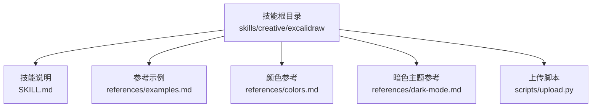
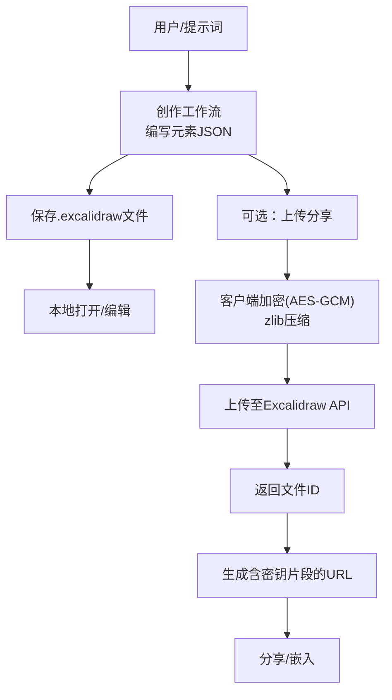
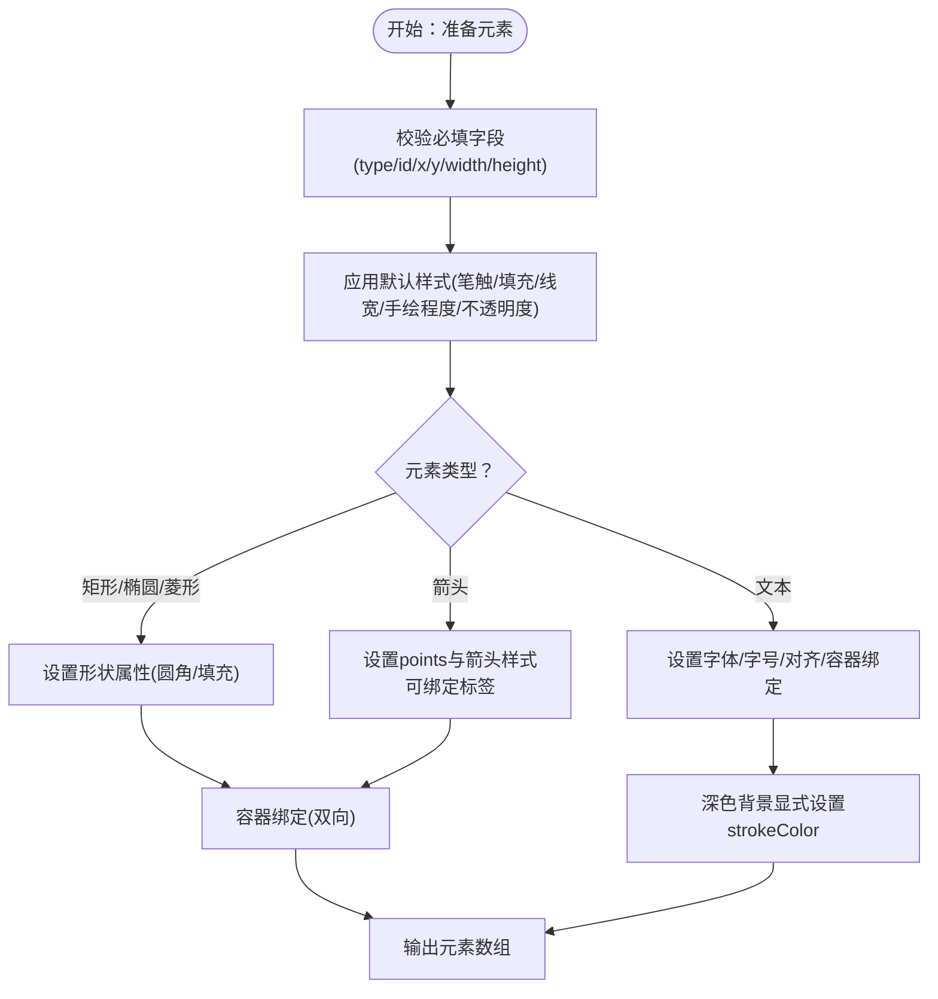
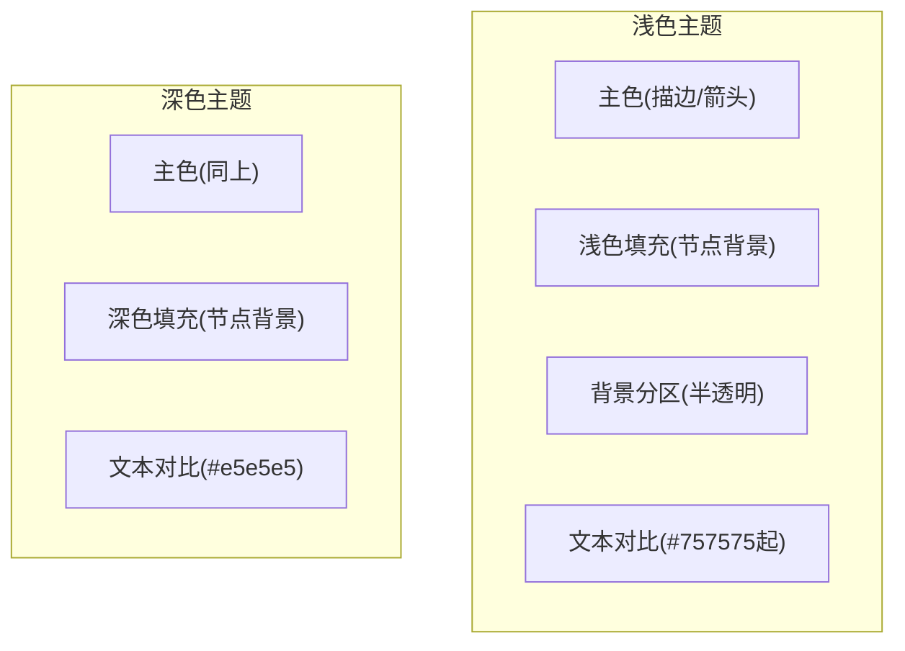
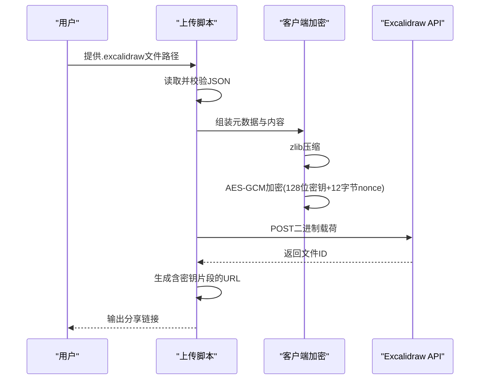
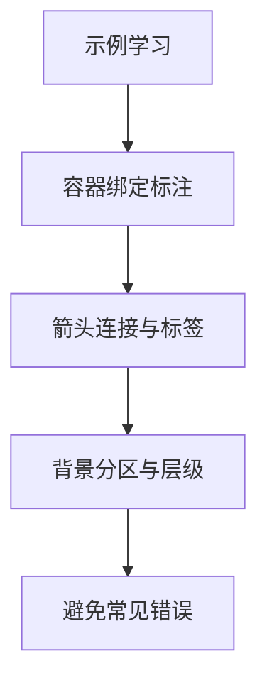
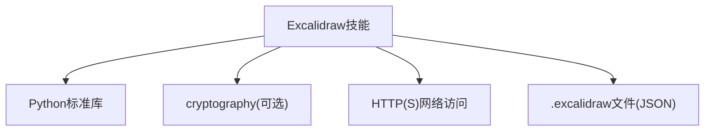

# 手绘风格图表工具

<cite>
**本文引用的文件**
- [SKILL.md](file://skills/creative/excalidraw/SKILL.md)
- [examples.md](file://skills/creative/excalidraw/references/examples.md)
- [colors.md](file://skills/creative/excalidraw/references/colors.md)
- [dark-mode.md](file://skills/creative/excalidraw/references/dark-mode.md)
- [upload.py](file://skills/creative/excalidraw/scripts/upload.py)
- [README.md](file://README.md)
</cite>

## 目录
1. [简介](#简介)
2. [项目结构](#项目结构)
3. [核心组件](#核心组件)
4. [架构总览](#架构总览)
5. [详细组件分析](#详细组件分析)
6. [依赖关系分析](#依赖关系分析)
7. [性能考量](#性能考量)
8. [故障排查指南](#故障排查指南)
9. [结论](#结论)
10. [附录](#附录)

## 简介
本文件面向“Excalidraw手绘风格图表工具”的使用者与集成者，系统性阐述该工具的设计理念、视觉效果、工作流与实现要点，并结合仓库中已有的Excalidraw技能文档，给出可操作的创作流程、样式定制与输出分发方案。该工具以标准Excalidraw JSON格式为核心，通过纯JSON描述图形元素，无需渲染库即可在Excalidraw官网或本地编辑器中打开；同时提供上传脚本用于生成加密分享链接，便于协作与演示。

## 项目结构
Excalidraw技能位于“creative”类别下，包含技能说明、参考示例、颜色与暗色主题参考以及上传脚本。整体结构清晰，便于按需查阅与复用。

**图表来源**
- [SKILL.md:1-195](file://skills/creative/excalidraw/SKILL.md#L1-L195)
- [examples.md:1-142](file://skills/creative/excalidraw/references/examples.md#L1-L142)
- [colors.md:1-45](file://skills/creative/excalidraw/references/colors.md#L1-L45)
- [dark-mode.md:1-69](file://skills/creative/excalidraw/references/dark-mode.md#L1-L69)
- [upload.py:1-134](file://skills/creative/excalidraw/scripts/upload.py#L1-L134)

**章节来源**
- [SKILL.md:1-195](file://skills/creative/excalidraw/SKILL.md#L1-L195)

## 核心组件
- 元素格式与默认值：所有元素均需具备类型、唯一ID、位置与尺寸字段；默认笔触色、填充色、线宽、手绘程度（roughness）等均有明确约定，便于快速上手。
- 元素类型：矩形、椭圆、菱形、箭头、独立文本等；标注采用容器绑定（containerId + boundElements），避免使用不存在的label属性。
- 绑定与布局：箭头可绑定到形状端点；文本标注需紧随其容器元素出现；背景区域建议使用半透明填充以增强层次感。
- 颜色体系：提供主色（描边/箭头/强调）、浅色填充（节点背景）、背景分区等配色表，并给出白/暗两套文本对比规则。
- 工作流：编写元素数组 → 包裹.excalidraw外层 → 保存为文件 → 可选上传生成分享链接。

**章节来源**
- [SKILL.md:56-195](file://skills/creative/excalidraw/SKILL.md#L56-L195)
- [examples.md:1-142](file://skills/creative/excalidraw/references/examples.md#L1-L142)
- [colors.md:1-45](file://skills/creative/excalidraw/references/colors.md#L1-L45)
- [dark-mode.md:1-69](file://skills/creative/excalidraw/references/dark-mode.md#L1-L69)

## 架构总览
从用户视角看，工具链由“创作层”和“发布层”组成：
- 创作层：在技能内编写元素JSON，遵循格式规范与最佳实践。
- 发布层：本地打开或上传分享。上传脚本负责客户端加密、压缩与生成带密钥片段的分享URL。

**图表来源**
- [SKILL.md:19-53](file://skills/creative/excalidraw/SKILL.md#L19-L53)
- [upload.py:39-101](file://skills/creative/excalidraw/scripts/upload.py#L39-L101)

## 详细组件分析

### 组件A：元素格式与样式定制
- 必填字段：type、id、x、y、width、height。
- 默认值：笔触色、填充色、填充样式、线宽、手绘程度（roughness）、不透明度等。
- 元素类型与标注：
  - 矩形/椭圆/菱形：可通过roundness、backgroundColor、fillStyle等实现圆角与填充。
  - 箭头：points定义相对偏移，endArrowhead支持多种样式；可绑定标签文本。
  - 独立文本：适合标题与注释；定位时注意字体大小与居中策略。
- 容器绑定：标注必须通过boundElements与containerId双向关联，否则会被忽略。
- 文本对比与字体：所有文本需设置fontFamily为1以获得手绘字体；深色背景下独立文本需显式设置strokeColor以保证可见性。

**图表来源**
- [SKILL.md:58-127](file://skills/creative/excalidraw/SKILL.md#L58-L127)
- [dark-mode.md:16-67](file://skills/creative/excalidraw/references/dark-mode.md#L16-L67)

**章节来源**
- [SKILL.md:56-195](file://skills/creative/excalidraw/SKILL.md#L56-L195)
- [dark-mode.md:1-69](file://skills/creative/excalidraw/references/dark-mode.md#L1-L69)

### 组件B：颜色与主题系统
- 主色（描边/箭头/强调）：蓝、琥珀、绿、红、紫、粉、青、酸橙等，用于动作、警告、成功、错误等语义。
- 浅色填充：与主色对应的主题色，用于节点背景，形成统一语义。
- 背景分区：半透明矩形作为区域划分，提升复杂图的层次感。
- 文本对比规则：白底最小文本色为#757575；深色背景使用#e5e5e5等高亮色；避免使用浅灰。

**图表来源**
- [colors.md:5-44](file://skills/creative/excalidraw/references/colors.md#L5-L44)
- [dark-mode.md:16-40](file://skills/creative/excalidraw/references/dark-mode.md#L16-L40)

**章节来源**
- [colors.md:1-45](file://skills/creative/excalidraw/references/colors.md#L1-L45)
- [dark-mode.md:1-69](file://skills/creative/excalidraw/references/dark-mode.md#L1-L69)

### 组件C：上传与分享（加密分享）
- 加密与压缩：客户端使用AES-GCM 128位加密，zlib压缩；密钥嵌入URL片段，服务器不接触明文。
- 上传流程：构造concat-buffers二进制载荷 → 压缩 → 加密 → POST到官方API → 解析响应获取文件ID → 拼接分享URL。
- 使用方法：通过终端运行脚本，传入.excalidraw路径，打印可直接分享的URL。

**图表来源**
- [upload.py:39-101](file://skills/creative/excalidraw/scripts/upload.py#L39-L101)

**章节来源**
- [upload.py:1-134](file://skills/creative/excalidraw/scripts/upload.py#L1-L134)

### 组件D：示例与最佳实践
- 示例涵盖最小连接框图、生化过程图、UML序列图等，展示容器绑定、箭头连接、背景分区与多节点组织。
- 常见误区：不要使用label属性；确保标注的双向绑定；设置originalText与autoResize；设置fontFamily: 1；注意元素重叠与箭头标签长度。

**图表来源**
- [examples.md:20-142](file://skills/creative/excalidraw/references/examples.md#L20-L142)

**章节来源**
- [examples.md:1-142](file://skills/creative/excalidraw/references/examples.md#L1-L142)

## 依赖关系分析
- 技能依赖：无外部语言运行时依赖，仅依赖标准库与Python第三方库（上传脚本需要cryptography）。
- 平台依赖：可在任意平台运行，但上传脚本依赖网络访问Excalidraw API。
- 与项目生态的关系：该技能位于“creative”类别，与ASCII艺术、Manim视频等创意类技能并列，共同服务于多样化可视化需求。

**图表来源**
- [upload.py:20-33](file://skills/creative/excalidraw/scripts/upload.py#L20-L33)
- [SKILL.md:44-52](file://skills/creative/excalidraw/SKILL.md#L44-L52)

**章节来源**
- [upload.py:1-134](file://skills/creative/excalidraw/scripts/upload.py#L1-L134)
- [README.md:1-179](file://README.md#L1-L179)

## 性能考量
- 文件体积与加载速度：尽量减少元素数量，合并相近区域，避免过度细分；合理使用半透明背景与阴影会增加渲染开销。
- 上传性能：上传脚本对载荷进行zlib压缩，可显著降低传输体积；AES-GCM加密为CPU密集型，建议在本地执行。
- 渲染与显示：Excalidraw官网基于浏览器渲染，复杂图可能影响滚动与交互流畅度；建议拆分为多个子图或导出静态图片。

## 故障排查指南
- 上传失败：检查网络连通性与cryptography安装；确认输入文件为有效JSON且包含elements键。
- 分享链接无法打开：确认URL中包含有效的文件ID与密钥片段；若密钥被截断或篡改，将导致解密失败。
- 文本不可见：深色背景需显式设置strokeColor；白底场景避免使用过浅的颜色。
- 标注空白：确保形状的boundElements与文本的containerId双向正确配置；不要使用label属性。

**章节来源**
- [upload.py:104-133](file://skills/creative/excalidraw/scripts/upload.py#L104-L133)
- [dark-mode.md:42-67](file://skills/creative/excalidraw/references/dark-mode.md#L42-L67)
- [examples.md:131-141](file://skills/creative/excalidraw/references/examples.md#L131-L141)

## 结论
该Excalidraw技能以“纯JSON + 最小依赖”的方式实现了手绘风格图表的创作与分享，既适合快速草图绘制，也便于团队协作与演示。通过规范化的元素格式、颜色与主题体系、容器绑定标注以及可选的加密上传能力，用户可以高效产出高质量的手绘风格图表。建议在实际使用中遵循示例与最佳实践，优先采用容器绑定标注与统一配色，以获得更佳的可读性与一致性。

## 附录
- 使用场景建议
  - 技术文档：流程图、架构图、序列图，配合浅色主题与清晰标注。
  - 教学演示：概念图、过程图，使用背景分区与箭头标签突出关键步骤。
  - 创意展示：暗色主题与高对比文本，营造专业氛围。
- 与其他工具的集成
  - 与ASCII艺术、Manim视频等创意类技能协同，形成从文字到图像再到动画的完整创作管线。
  - 在项目文档中嵌入.excalidraw文件或分享链接，便于跨平台协作与版本管理。