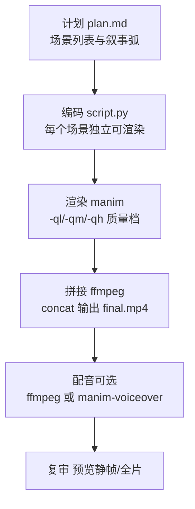
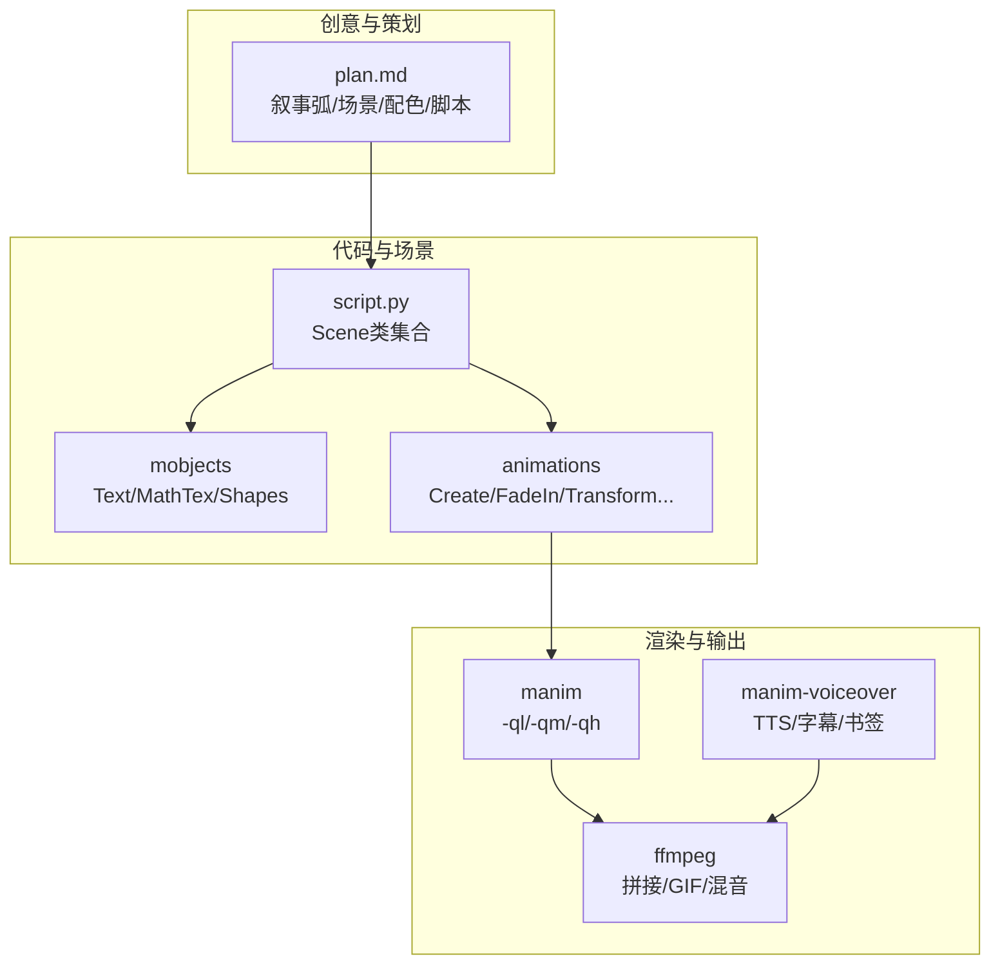
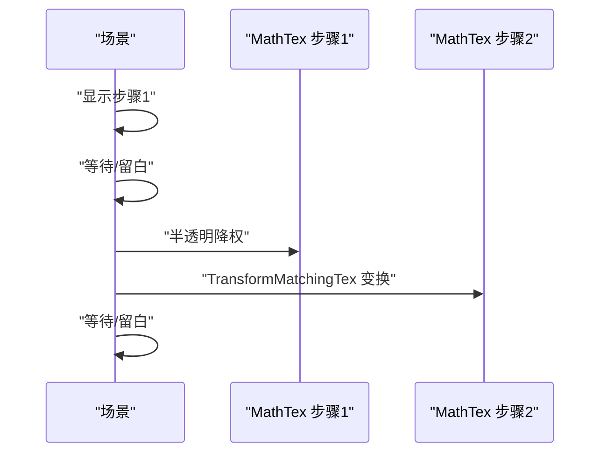
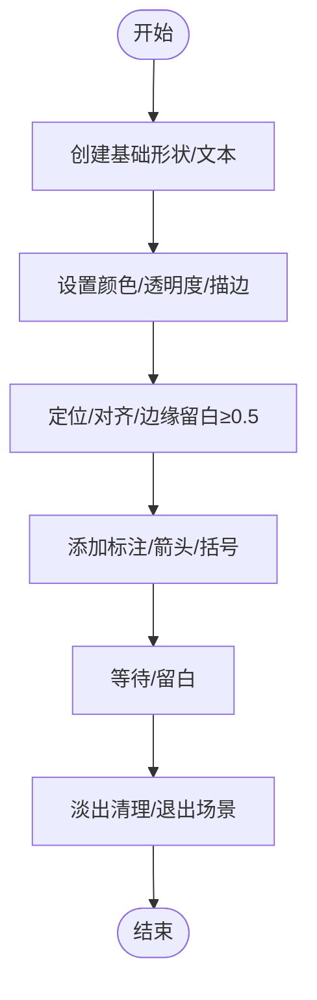
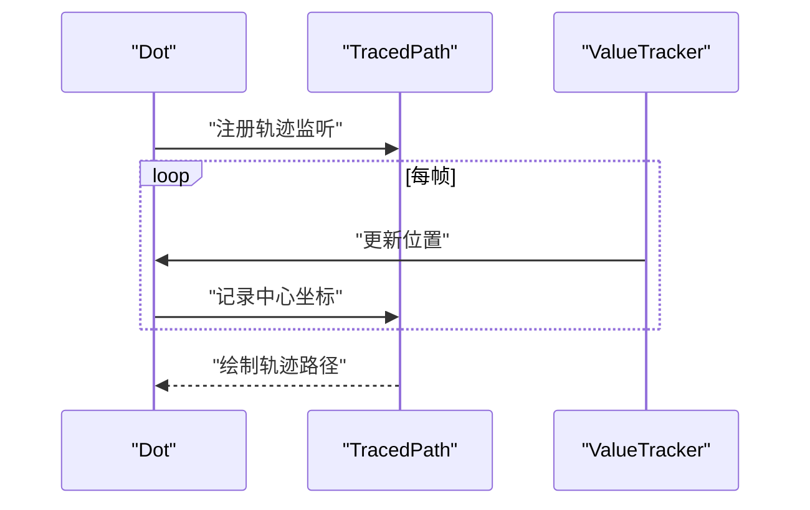
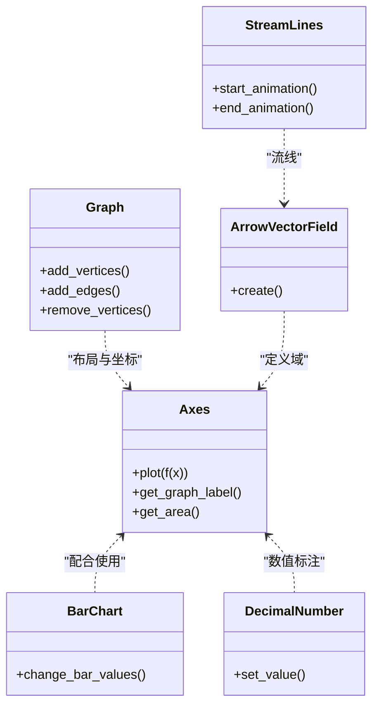
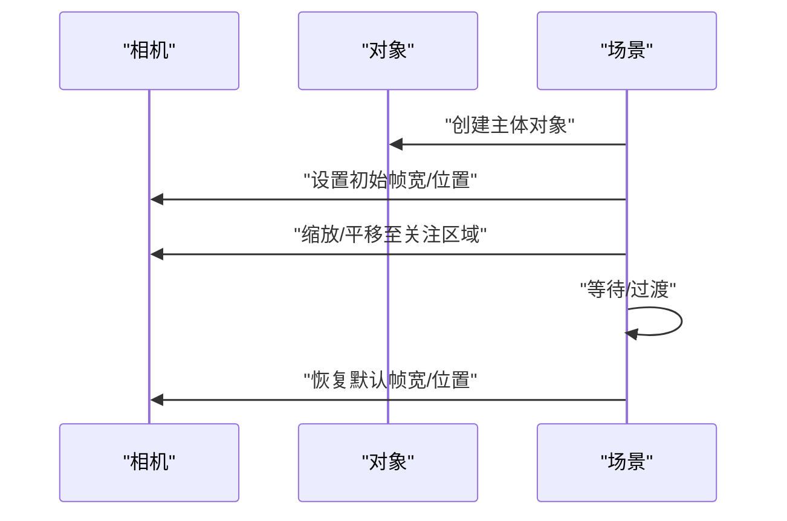
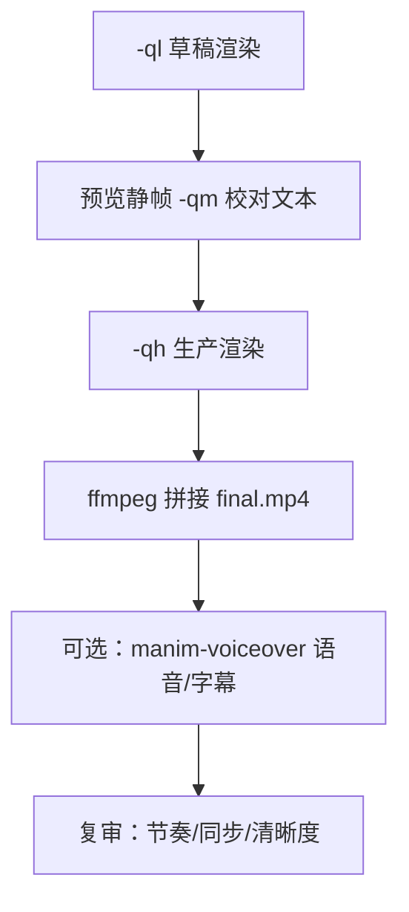
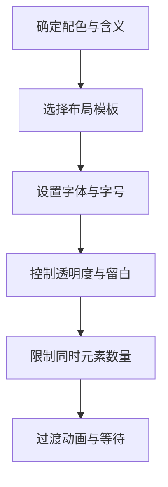
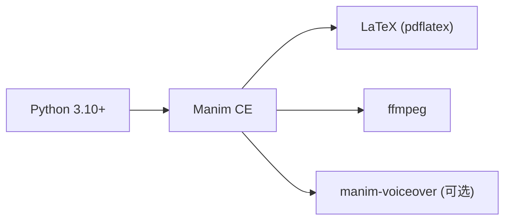

# 数学动画视频工具

<cite>
**本文引用的文件**
- [技能说明：manim-video](file://skills/creative/manim-video/SKILL.md)
- [技能自述：manim-video](file://skills/creative/manim-video/README.md)
- [安装检查脚本：setup.sh](file://skills/creative/manim-video/scripts/setup.sh)
- [动画参考：animations.md](file://skills/creative/manim-video/references/animations.md)
- [对象参考：mobjects.md](file://skills/creative/manim-video/references/mobjects.md)
- [方程与LaTeX：equations.md](file://skills/creative/manim-video/references/equations.md)
- [图表与数据：graphs-and-data.md](file://skills/creative/manim-video/references/graphs-and-data.md)
- [场景规划：scene-planning.md](file://skills/creative/manim-video/references/scene-planning.md)
- [相机与3D：camera-and-3d.md](file://skills/creative/manim-video/references/camera-and-3d.md)
- [渲染与导出：rendering.md](file://skills/creative/manim-video/references/rendering.md)
- [视觉设计：visual-design.md](file://skills/creative/manim-video/references/visual-design.md)
- [更新器与追踪器：updaters-and-trackers.md](file://skills/creative/manim-video/references/updaters-and-trackers.md)
- [制作品质：production-quality.md](file://skills/creative/manim-video/references/production-quality.md)
</cite>

## 目录
1. [简介](#简介)
2. [项目结构](#项目结构)
3. [核心组件](#核心组件)
4. [架构总览](#架构总览)
5. [详细组件分析](#详细组件分析)
6. [依赖关系分析](#依赖关系分析)
7. [性能考量](#性能考量)
8. [故障排查指南](#故障排查指南)
9. [结论](#结论)
10. [附录](#附录)

## 简介
本文件面向使用Manim社区版进行数学与技术类动画创作的用户，系统化梳理从创意策划到最终输出的全流程方法论与工程实践。内容覆盖数学公式渲染（LaTeX）、对象与运动（mobjects与animations）、镜头语言与相机控制、渲染管线与后处理、以及生产级质量把控清单。文档以“可执行的设计思维”为核心，帮助创作者在有限帧内讲清一个概念，并通过一致的视觉语言与节奏引导观众完成从困惑到顿悟的认知旅程。

## 项目结构
manim-video技能采用“单脚本多场景”的组织方式，配合分层参考文档，形成“计划—编码—渲染—拼接—配音—复审”的流水线。

图示来源
- [技能说明：manim-video:52-64](file://skills/creative/manim-video/SKILL.md#L52-L64)
- [渲染与导出：rendering.md:85-94](file://skills/creative/manim-video/references/rendering.md#L85-L94)

章节来源
- [技能说明：manim-video:65-76](file://skills/creative/manim-video/SKILL.md#L65-L76)
- [技能自述：manim-video:1-24](file://skills/creative/manim-video/README.md#L1-L24)

## 核心组件
- 场景与叙事
  - 使用“发现式/问题-解决/对比/搭建”等叙事弧，明确每场戏的目的、时长与布局模板。
  - 每个场景独立可渲染，确保迭代效率与质量可控。
- 对象与公式
  - 文本与数学公式统一用Text与MathTex；复杂公式建议拆分或使用TransformMatchingTex进行语义对齐。
  - 使用Raw字符串避免LaTeX转义问题。
- 动画与运动
  - 基于Animation对象与rate_func组合，强调“先展示再解释”的节奏；通过Wait与淡入淡出营造“留白”。
  - 运动路径可用MoveAlongPath、旋转与矩阵变换等实现。
- 相机与3D
  - 2D相机用MovingCameraScene控制缩放与平移；3D用ThreeDScene与Surface/ParametricFunction等。
- 渲染与后处理
  - 草稿-预览-生产的质量梯度；ffmpeg拼接与音视频混合；可选manim-voiceover插件自动同步字幕与时长。
- 视觉设计
  - 12条设计原则：几何优先、分层透明度、单一新概念、空间一致性、色彩含义、渐进披露、变换而非替换、留白、视觉权重平衡、一致运动词汇、深色背景浅色内容、有意的留白。
- 更新器与追踪器
  - ValueTracker驱动连续关系；add_updater与always_redraw按需选择；DecimalNumber/Variable用于实时数值显示。

章节来源
- [场景规划：scene-planning.md:1-32](file://skills/creative/manim-video/references/scene-planning.md#L1-L32)
- [动画参考：animations.md:1-120](file://skills/creative/manim-video/references/animations.md#L1-L120)
- [相机与3D：camera-and-3d.md:1-77](file://skills/creative/manim-video/references/camera-and-3d.md#L1-L77)
- [渲染与导出：rendering.md:1-77](file://skills/creative/manim-video/references/rendering.md#L1-L77)
- [视觉设计：visual-design.md:1-125](file://skills/creative/manim-video/references/visual-design.md#L1-L125)
- [更新器与追踪器：updaters-and-trackers.md:1-107](file://skills/creative/manim-video/references/updaters-and-trackers.md#L1-L107)

## 架构总览
下图展示从创意到成品的关键步骤与工具链交互：

图示来源
- [技能说明：manim-video:52-64](file://skills/creative/manim-video/SKILL.md#L52-L64)
- [渲染与导出：rendering.md:11-19](file://skills/creative/manim-video/references/rendering.md#L11-L19)
- [动画参考：animations.md:1-120](file://skills/creative/manim-video/references/animations.md#L1-L120)

## 详细组件分析

### 组件A：LaTeX与公式渲染（MathTex）
- 关键点
  - 使用Raw字符串避免反斜杠转义；多行对齐用aligned环境；复杂表达式可借助substrings_to_isolate与set_color_by_tex进行逐段高亮。
  - TransformMatchingTex用于推导过程中的等式变换，支持key_map与matched_keys精准对齐。
- 实践模式
  - 分步呈现：先写主干，再补加号/积分号等部分。
  - 强调重点：用SurroundingRectangle或Brace标注关键项。
- 典型流程（推导序列）

图示来源
- [方程与LaTeX：equations.md:12-47](file://skills/creative/manim-video/references/equations.md#L12-L47)
- [动画参考：animations.md:134-147](file://skills/creative/manim-video/references/animations.md#L134-L147)

章节来源
- [方程与LaTeX：equations.md:1-217](file://skills/creative/manim-video/references/equations.md#L1-L217)
- [动画参考：animations.md:27-44](file://skills/creative/manim-video/references/animations.md#L27-L44)

### 组件B：对象与图形（mobjects）
- 关键点
  - 文本与数学对象：Text用于纯文本，MathTex用于LaTeX公式；二者皆为VMobject，但混用时需用Group。
  - 形状与复合：Circle/Square/Polygon/Arc/Brace/Annulus等；布尔运算Union/Intersection/Difference/Exclusion适合集合与面积计算。
  - 定位与样式：move_to/next_to/to_edge/to_corner；opacity/stroke/fill/z_index控制层级与外观。
- 实践模式
  - VGroup仅含VMobjects，Group可混排Text；注意VGroup在某些版本上对Text会报错。
  - 复杂函数变换前需prepare_for_nonlinear_transform以提升形变平滑度。
- 流程图（形状与标注生命周期）

图示来源
- [对象参考：mobjects.md:84-116](file://skills/creative/manim-video/references/mobjects.md#L84-L116)
- [动画参考：animations.md:141-147](file://skills/creative/manim-video/references/animations.md#L141-L147)

章节来源
- [对象参考：mobjects.md:1-334](file://skills/creative/manim-video/references/mobjects.md#L1-L334)

### 组件C：运动与轨迹（TracedPath/Updaters）
- 关键点
  - TracedPath绘制轨迹，支持渐隐衰减；适用于梯度下降路径、轨道、函数扫描等。
  - Updaters分为lambda updater、基于dt的时间更新、always_redraw重建三类；按成本与需求选择。
  - ValueTracker作为“隐形滑杆”，驱动连续关系；配合add_updater/always_redraw实现联动。
- 实践模式
  - 参数探索：ValueTracker驱动曲线族变化，标签随参数实时更新。
  - 连接图：节点移动时，边与标签自动跟随。
- 时序图（轨迹绘制）

图示来源
- [动画参考：animations.md:171-186](file://skills/creative/manim-video/references/animations.md#L171-L186)
- [更新器与追踪器：updaters-and-trackers.md:85-107](file://skills/creative/manim-video/references/updaters-and-trackers.md#L85-L107)

章节来源
- [动画参考：animations.md:171-186](file://skills/creative/manim-video/references/animations.md#L171-L186)
- [更新器与追踪器：updaters-and-trackers.md:1-107](file://skills/creative/manim-video/references/updaters-and-trackers.md#L1-L107)

### 组件D：图表与数据可视化
- 关键点
  - 坐标轴Axes与函数绘图axes.plot；动态参数用ValueTracker驱动；移动点沿曲线运动。
  - 条形图BarChart支持值变更动画；计数器用DecimalNumber并配合rate_func。
  - 图论Graph/DiGraph内置布局算法；向量场ArrowVectorField与StreamLines。
- 实践模式
  - 算法可视化：ShowIncreasingSubsets/ShowSubmobjectsOneByOne逐步揭示步骤。
  - 数据故事：前后对比+箭头标注变化幅度。
- 类图（图表与数据对象）

图示来源
- [图表与数据：graphs-and-data.md:1-164](file://skills/creative/manim-video/references/graphs-and-data.md#L1-L164)

章节来源
- [图表与数据：graphs-and-data.md:1-164](file://skills/creative/manim-video/references/graphs-and-data.md#L1-L164)

### 组件E：相机与3D（MovingCameraScene/ThreeDScene）
- 关键点
  - MovingCameraScene通过frame控制缩放与平移；适合聚焦局部细节。
  - ThreeDScene支持Surface/ParametricFunction/Arrow3D等；可开启环境光旋转与手动视角切换。
  - ZoomedScene提供内嵌放大视窗，便于同时保留全局与局部信息。
- 实践模式
  - 何时用3D：曲面、向量场、空间几何；避免在2D概念、文字密集或平面数据中滥用。
- 序列图（相机操作）

图示来源
- [相机与3D：camera-and-3d.md:1-77](file://skills/creative/manim-video/references/camera-and-3d.md#L1-L77)

章节来源
- [相机与3D：camera-and-3d.md:1-136](file://skills/creative/manim-video/references/camera-and-3d.md#L1-L136)

### 组件F：渲染与后处理（manim/ffmpeg/manim-voiceover）
- 关键点
  - 草稿(-ql)/预览(-qm)/生产(-qh)三层质量梯度；草稿专注布局与节奏，预览校验文本可读性，生产输出最终成片。
  - ffmpeg拼接concat与音视频混合；GIF导出需指定fps与调色板。
  - manim-voiceover插件自动同步语音时长与字幕生成，支持书签精确对齐。
- 工作流（草稿→预览→生产→配音→复审）

图示来源
- [渲染与导出：rendering.md:85-133](file://skills/creative/manim-video/references/rendering.md#L85-L133)

章节来源
- [渲染与导出：rendering.md:1-186](file://skills/creative/manim-video/references/rendering.md#L1-L186)

### 组件G：视觉设计与镜头语言
- 关键点
  - 12条设计原则：几何优先、分层透明度、单一新概念、空间一致性、色彩含义、渐进披露、变换而非替换、留白、视觉权重平衡、一致运动词汇、深色背景浅色内容、有意的留白。
  - 布局模板：FULL_CENTER/LEFT_RIGHT/TOP_BOTTOM/GRID/PROGRESSIVE/ANNOTATED_DIAGRAM。
  - 字体与字号：统一使用等宽字体；标题≥48，正文≥30，标签≥24，注释≥20，最小18。
- 流程图（设计检查清单）

图示来源
- [视觉设计：visual-design.md:1-125](file://skills/creative/manim-video/references/visual-design.md#L1-L125)
- [制作品质：production-quality.md:60-118](file://skills/creative/manim-video/references/production-quality.md#L60-L118)

章节来源
- [视觉设计：visual-design.md:1-125](file://skills/creative/manim-video/references/visual-design.md#L1-L125)
- [制作品质：production-quality.md:1-191](file://skills/creative/manim-video/references/production-quality.md#L1-L191)

## 依赖关系分析
- 技术栈
  - 核心：Manim Community Edition（场景渲染与动画引擎）
  - 数学：LaTeX（pdflatex）渲染MathTex
  - 视频：ffmpeg（拼接、格式转换、音视频混合、GIF导出）
  - 语音（可选）：ElevenLabs/Qwen3-TTS等（manim-voiceover）
- 依赖验证
  - setup.sh检查Python、Manim、LaTeX、ffmpeg是否就绪。

图示来源
- [安装检查脚本：setup.sh:1-15](file://skills/creative/manim-video/scripts/setup.sh#L1-L15)
- [渲染与导出：rendering.md:3-9](file://skills/creative/manim-video/references/rendering.md#L3-L9)

章节来源
- [安装检查脚本：setup.sh:1-15](file://skills/creative/manim-video/scripts/setup.sh#L1-L15)

## 性能考量
- 质量梯度
  - -ql：854×480，15fps，适合布局与节奏测试
  - -qm：1280×720，30fps，适合文本密集场景预览
  - -qh：1920×1080，60fps，生产输出
- 渲染策略
  - 先-ql迭代，-qm校对文本，-qh导出；仅对失败场景重渲染，减少整体耗时。
  - 合理使用TracedPath与always_redraw，前者轻量，后者昂贵，应按需取舍。
- 输出优化
  - 使用ffmpeg按需导出GIF与不同分辨率；音频混合时注意音量平衡与最短时长对齐。

章节来源
- [渲染与导出：rendering.md:21-30](file://skills/creative/manim-video/references/rendering.md#L21-L30)
- [动画参考：animations.md:171-186](file://skills/creative/manim-video/references/animations.md#L171-L186)
- [更新器与追踪器：updaters-and-trackers.md:85-107](file://skills/creative/manim-video/references/updaters-and-trackers.md#L85-L107)

## 故障排查指南
- 常见问题
  - LaTeX转义错误：统一使用Raw字符串；公式中所有反斜杠必须转义。
  - 文本边缘遮挡：to_edge/buff≥0.5；避免在同一位置直接Write新文本，先FadeOut旧文本。
  - 动画对象未添加：先add，再animate；非已添加对象不可直接动画。
  - 文本字体问题：除极短标题外，一律使用等宽字体；小于18号不可读。
  - 文本溢出：长文本设置最大宽度或换行。
- 调试建议
  - -ql快速验证布局与时间轴；-qm检查文本可读性；-ql -s导出关键帧静帧核对。
  - 使用add_subcaption/inline subcaption生成.srt字幕，便于同步与复审。
- 质量复核
  - 预渲染清单：场景均能-ql渲染、背景色一致、留白充足、无比例字体、无硬切、无小字。
  - 后渲染清单：通看节奏、同步性、首5秒抓人程度。

章节来源
- [技能说明：manim-video:189-222](file://skills/creative/manim-video/SKILL.md#L189-L222)
- [制作品质：production-quality.md:165-191](file://skills/creative/manim-video/references/production-quality.md#L165-L191)

## 结论
本技能体系以“先理解、后展示、再解释”的教学理念贯穿始终，结合严格的视觉设计原则与工程化的渲染流程，确保在有限时间内高效产出高质量的数学与技术类动画。通过分层的质量梯度、可复用的布局模板与持续演进的检查清单，创作者可以稳定地交付既准确又具美感的可视化作品。

## 附录
- 快速参考
  - 计划：scene-planning.md
  - 动画：animations.md
  - 对象：mobjects.md
  - 方程：equations.md
  - 图表：graphs-and-data.md
  - 相机/3D：camera-and-3d.md
  - 渲染：rendering.md
  - 设计：visual-design.md
  - 更新器：updaters-and-trackers.md
  - 品质：production-quality.md