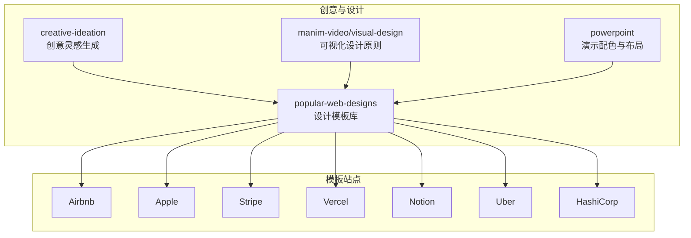
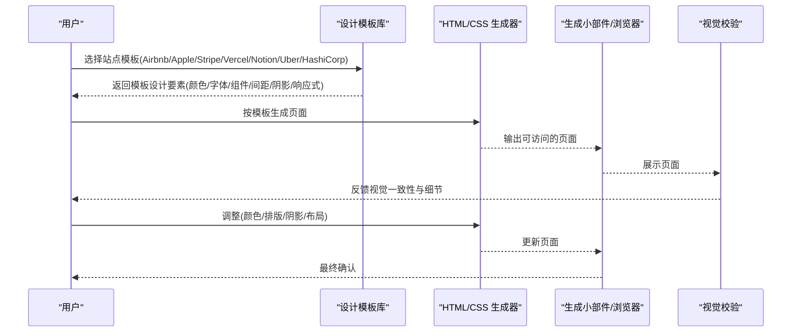
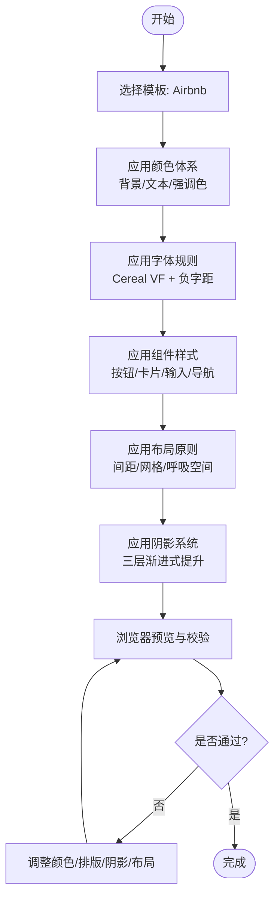
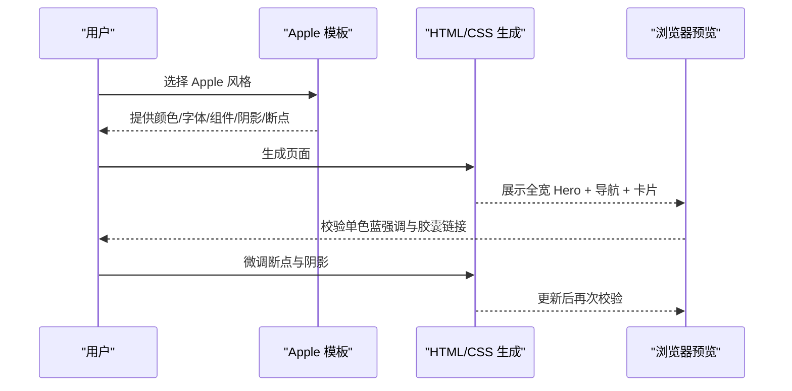
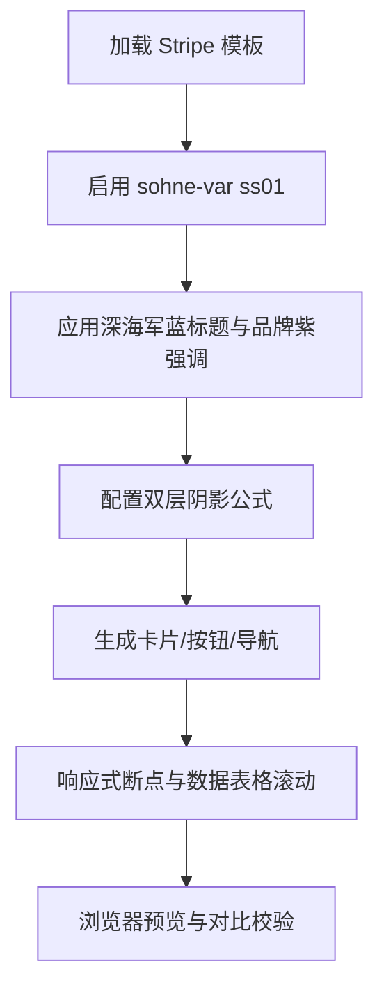
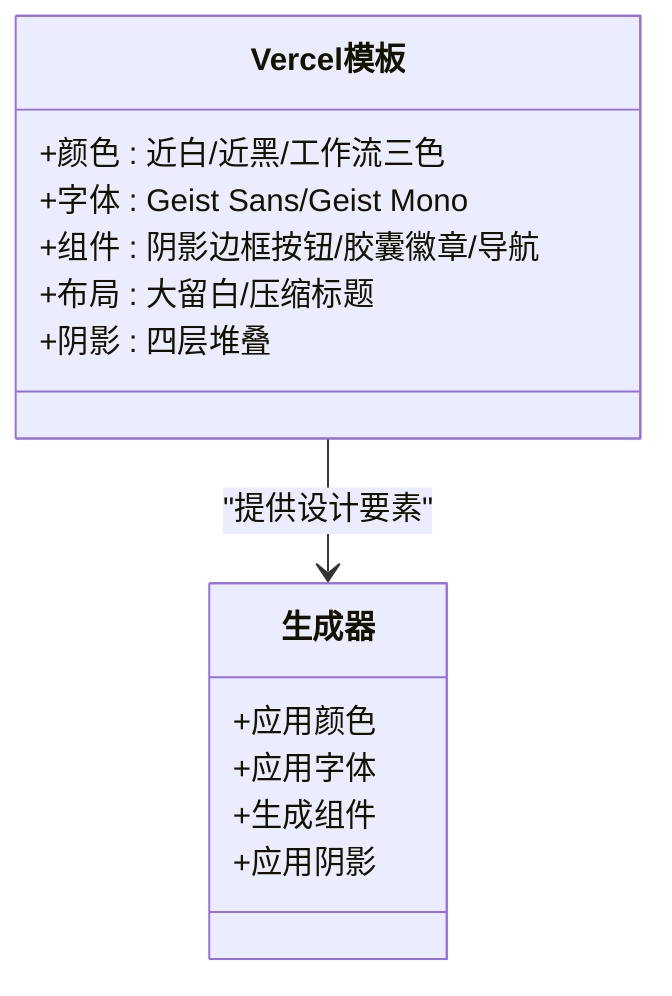
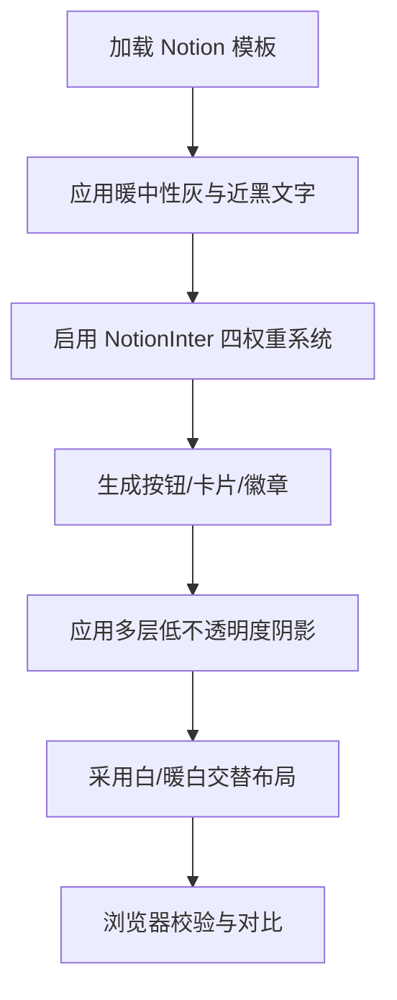
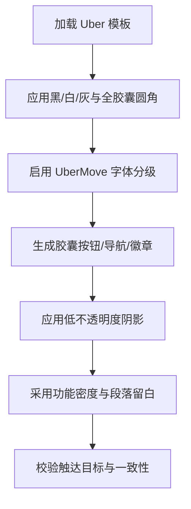
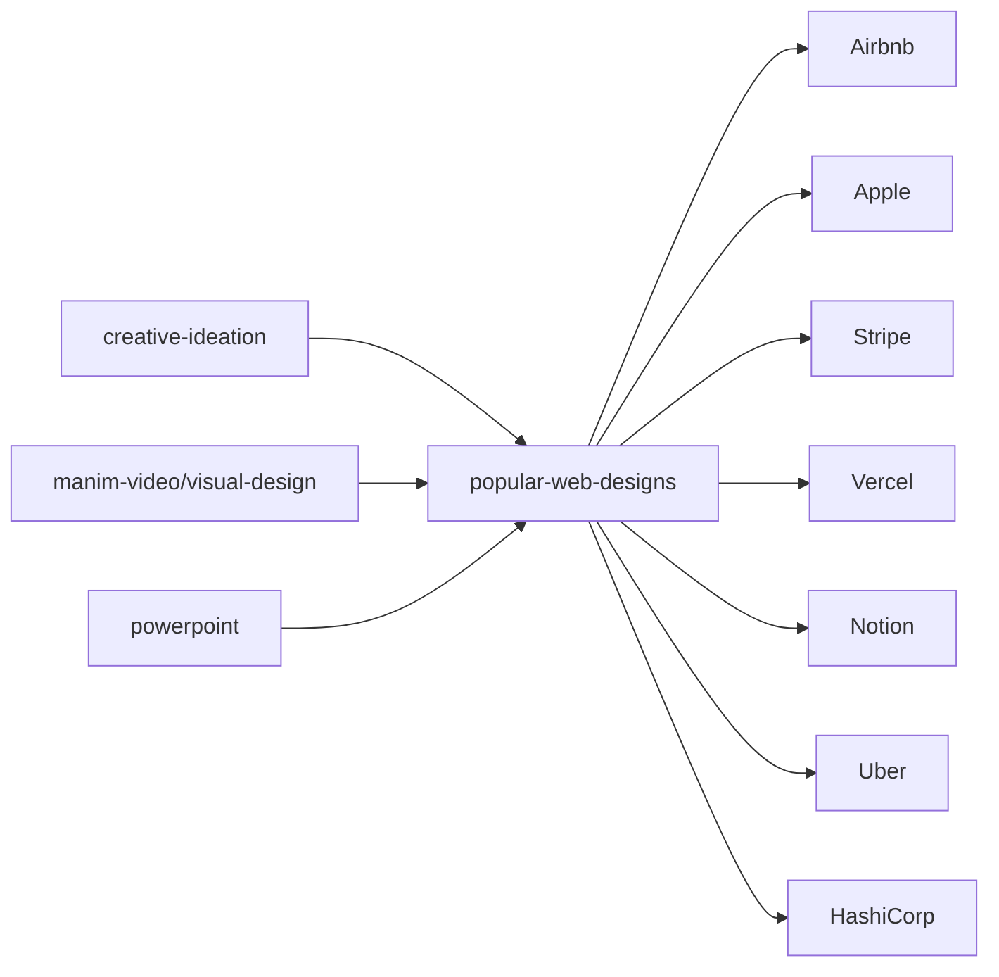

# 网页设计灵感工具

<cite>
**本文引用的文件**
- [popular-web-designs/SKILL.md](file://skills/creative/popular-web-designs/SKILL.md)
- [airbnb.md](file://skills/creative/popular-web-designs/templates/airbnb.md)
- [apple.md](file://skills/creative/popular-web-designs/templates/apple.md)
- [stripe.md](file://skills/creative/popular-web-designs/templates/stripe.md)
- [vercel.md](file://skills/creative/popular-web-designs/templates/vercel.md)
- [notion.md](file://skills/creative/popular-web-designs/templates/notion.md)
- [uber.md](file://skills/creative/popular-web-designs/templates/uber.md)
- [hashicorp.md](file://skills/creative/popular-web-designs/templates/hashicorp.md)
- [manim-video/visual-design.md](file://skills/creative/manim-video/references/visual-design.md)
- [creative-ideation/SKILL.md](file://skills/creative/creative-ideation/SKILL.md)
- [powerpoint/SKILL.md](file://skills/productivity/powerpoint/SKILL.md)
</cite>

## 目录
1. [简介](#简介)
2. [项目结构](#项目结构)
3. [核心组件](#核心组件)
4. [架构总览](#架构总览)
5. [详细组件分析](#详细组件分析)
6. [依赖关系分析](#依赖关系分析)
7. [性能考量](#性能考量)
8. [故障排查指南](#故障排查指南)
9. [结论](#结论)
10. [附录](#附录)

## 简介
本文件面向“网页设计灵感工具”的使用者与维护者，系统化梳理并解读项目中已沉淀的设计资源与生成流程，重点包括：
- 流行网站设计风格与视觉语言：Airbnb、Apple、Stripe、Vercel、Notion、Uber、HashiCorp 等
- 设计模板的分类体系、适用场景与定制方法
- 网页设计流行趋势、色彩搭配与用户体验原则
- 设计灵感的获取途径、分析方法与创新应用
- 模板使用指南、修改建议与最佳实践

目标是帮助用户快速选择合适的模板风格，准确还原品牌视觉，并在实际项目中高效落地。

## 项目结构
该工具以“技能（Skill）”为组织单元，围绕“创意设计”与“网页设计灵感”两大主题，提供可直接加载与复用的设计系统模板，以及创意启发与可视化设计原则参考。

图示来源
- [popular-web-designs/SKILL.md:1-207](file://skills/creative/popular-web-designs/SKILL.md#L1-L207)
- [airbnb.md:1-260](file://skills/creative/popular-web-designs/templates/airbnb.md#L1-L260)
- [apple.md:1-327](file://skills/creative/popular-web-designs/templates/apple.md#L1-L327)
- [stripe.md:1-336](file://skills/creative/popular-web-designs/templates/stripe.md#L1-L336)
- [vercel.md:1-324](file://skills/creative/popular-web-designs/templates/vercel.md#L1-L324)
- [notion.md:1-323](file://skills/creative/popular-web-designs/templates/notion.md#L1-L323)
- [uber.md:197-262](file://skills/creative/popular-web-designs/templates/uber.md#L197-L262)
- [hashicorp.md:278-292](file://skills/creative/popular-web-designs/templates/hashicorp.md#L278-L292)
- [manim-video/visual-design.md:1-125](file://skills/creative/manim-video/references/visual-design.md#L1-L125)
- [creative-ideation/SKILL.md:1-148](file://skills/creative/creative-ideation/SKILL.md#L1-L148)
- [powerpoint/SKILL.md:61-86](file://skills/productivity/powerpoint/SKILL.md#L61-L86)

章节来源
- [popular-web-designs/SKILL.md:1-207](file://skills/creative/popular-web-designs/SKILL.md#L1-L207)

## 核心组件
- 设计模板库（popular-web-designs）
  - 提供 54 套真实网站的设计系统，覆盖开发者工具、文档内容、营销落地页、深色 UI、浅色简洁、亲和友好、高端奢华、数据密集、终端美学等多个类别
  - 每个模板包含：颜色体系、字体排版、组件样式、间距系统、阴影深度、响应式行为与可直接使用的 CSS 值
  - 使用方式：加载模板文件，按模板的实现要点生成 HTML/CSS，结合“生成小部件”能力进行预览与验证
- 具象站点模板
  - Airbnb：温暖珊瑚红强调、摄影驱动、圆角 UI
  - Apple：极简二元光暗节奏、单色蓝强调、产品摄影、全宽画布
  - Stripe：深海军蓝标题、品牌紫强调、多层蓝灰阴影、变量字体
  - Vercel：近纯白画布、近黑文字、Geist 字体、阴影即边框哲学
  - Notion：暖中性灰、近黑文字、超细边框、多层低不透明度阴影
  - Uber：黑白色块、几何无衬线、极致密度、全胶囊圆角
  - HashiCorp：深色英雄、产品专属色、极低阴影、大标题与全大写标识
- 创意灵感（creative-ideation）
  - 基于约束的创意生成，帮助从零到一确定方向与边界
- 可视化设计原则（manim-video/visual-design）
  - 面向视频/教学可视化的内容组织与配色策略，强调“几何优先、渐进呈现、对比层次”
- 演示配色（powerpoint）
  - 提供主题化配色表与幻灯片布局建议，便于跨媒体风格统一

章节来源
- [popular-web-designs/SKILL.md:1-207](file://skills/creative/popular-web-designs/SKILL.md#L1-L207)
- [airbnb.md:1-260](file://skills/creative/popular-web-designs/templates/airbnb.md#L1-L260)
- [apple.md:1-327](file://skills/creative/popular-web-designs/templates/apple.md#L1-L327)
- [stripe.md:1-336](file://skills/creative/popular-web-designs/templates/stripe.md#L1-L336)
- [vercel.md:1-324](file://skills/creative/popular-web-designs/templates/vercel.md#L1-L324)
- [notion.md:1-323](file://skills/creative/popular-web-designs/templates/notion.md#L1-L323)
- [uber.md:197-262](file://skills/creative/popular-web-designs/templates/uber.md#L197-L262)
- [hashicorp.md:278-292](file://skills/creative/popular-web-designs/templates/hashicorp.md#L278-L292)
- [manim-video/visual-design.md:1-125](file://skills/creative/manim-video/references/visual-design.md#L1-L125)
- [creative-ideation/SKILL.md:1-148](file://skills/creative/creative-ideation/SKILL.md#L1-L148)
- [powerpoint/SKILL.md:61-86](file://skills/productivity/powerpoint/SKILL.md#L61-L86)

## 架构总览
设计灵感工具的运行路径如下：用户提出需求 → 选择或匹配设计风格 → 加载对应模板 → 生成 HTML/CSS → 预览与校验 → 迭代优化。

图示来源
- [popular-web-designs/SKILL.md:30-80](file://skills/creative/popular-web-designs/SKILL.md#L30-L80)

## 详细组件分析

### 设计模板分类与适用场景
- 开发者工具/仪表盘：Linear、Vercel、Supabase、Raycast、Sentry
- 文档/内容站点：Mintlify、Notion、Sanity、MongoDB
- 营销/落地页：Stripe、Framer、Apple、SpaceX
- 深色 UI：Linear、Cursor、ElevenLabs、Warp、Superhuman
- 浅色/简洁：Vercel、Stripe、Notion、Cal.com、Replicate
- 亲和友好：PostHog、Figma、Lovable、Zapier、Miro
- 高端奢华：Apple、BMW、Stripe、Superhuman、Revolut
- 数据密集：Sentry、Kraken、Cohere、ClickHouse
- 终端美学：Ollama、OpenCode、x.ai、VoltAgent

章节来源
- [popular-web-designs/SKILL.md:195-207](file://skills/creative/popular-web-designs/SKILL.md#L195-L207)

### Airbnb：温暖珊瑚红、摄影驱动、圆角 UI
- 视觉主题与氛围
  - 白底 + 王子红（Rausch Red）作为单一品牌强调色；三段式卡片阴影营造自然_lift；圆角半径较大，导航控件为圆形
- 颜色体系与角色
  - 主要品牌色、文本色阶、交互色、表面与阴影
- 字体规则
  - Airbnb Cereal VF（可变字体），标题负字距营造亲密感；暖权重范围（500–700）
- 组件样式
  - 主按钮近黑背景 + 白字；圆形导航；卡片阴影三层叠加；轮播控制为圆形
- 布局原则
  - 旅行杂志式间距：段落间留白充足；搜索栏占据头部垂直空间；列表网格响应式多列
- 深度与高程
  - 三段式阴影：边框环 + 柔和模糊 + 强模糊，渐进式提升
- 响应式行为
  - 多档断点与触达目标尺寸；移动端轮播滑动、图片自适应
- 使用要点
  - 仅在主行动按钮与品牌时刻使用王子红；避免使用纯黑文本；标题权重不低于500；卡片阴影必须三层叠加；圆角半径与导航控件为圆形

图示来源
- [airbnb.md:16-260](file://skills/creative/popular-web-designs/templates/airbnb.md#L16-L260)

章节来源
- [airbnb.md:16-260](file://skills/creative/popular-web-designs/templates/airbnb.md#L16-L260)

### Apple：极简二元光暗节奏、单色蓝强调、产品摄影
- 视觉主题与氛围
  - 黑/近白交替的电影式节奏；产品作为画布主体；单色蓝强调交互元素
- 颜色体系与角色
  - 纯黑/近黑/浅灰；Apple Blue 单一强调色；深表面变体
- 字体规则
  - SF Pro Display/Text，光学尺寸自动切换；全尺寸负字距；极端行高范围
- 组件样式
  - 主蓝色按钮、深色按钮、胶囊链接、过滤/搜索按钮、媒体控制
- 布局原则
  - 全宽画布居中内容；980px 圆角胶囊；微间距密度；分节背景色交替
- 深度与高程
  - 极少阴影，软扩散阴影模拟物理光源；粘性导航玻璃效果
- 响应式行为
  - 英寸级断点；Hero 缩放、导航折叠、产品图像比例保持
- 使用要点
  - 仅用 Apple Blue 强调交互；交替黑/浅灰分节；胶囊链接 980px 圆角；粘性导航玻璃不可省略

图示来源
- [apple.md:16-327](file://skills/creative/popular-web-designs/templates/apple.md#L16-L327)

章节来源
- [apple.md:16-327](file://skills/creative/popular-web-designs/templates/apple.md#L16-L327)

### Stripe：深海军蓝标题、品牌紫强调、多层蓝灰阴影
- 视觉主题与氛围
  - 技术与奢华兼具；sohne-var 变体字体；品牌紫为主强调色；蓝灰多层阴影
- 颜色体系与角色
  - 深海军蓝标题、品牌紫、深/浅中性、品牌暗色、强调色与边框色、阴影色
- 字体规则
  - sohne-var + ss01；Tabular 数字 tnum；显示级极轻权重 300；标题负字距递减
- 组件样式
  - 主紫色按钮、幽灵按钮、透明信息按钮、中性幽灵按钮、卡片与徽章、输入与表单
- 布局原则
  - 精准间距；白/深品牌色分节；代码/仪表盘预览卡片
- 深度与高程
  - 蓝灰主阴影 + 中性次阴影的双层叠加；负扩散创造垂直纵深
- 响应式行为
  - 移动端单列、断点内缩放、金融数据横向滚动
- 使用要点
  - 始终启用 ss01；标题用深海军蓝；保守圆角（4–8px）；使用品牌紫作为主强调色

图示来源
- [stripe.md:16-336](file://skills/creative/popular-web-designs/templates/stripe.md#L16-L336)

章节来源
- [stripe.md:16-336](file://skills/creative/popular-web-designs/templates/stripe.md#L16-L336)

### Vercel：近纯白画布、近黑文字、Geist 字体、阴影即边框
- 视觉主题与氛围
  - 工程师基础设施“隐形”设计；Geist 字体压缩标题；阴影即边框技术
- 颜色体系与角色
  - 近纯白背景 + 近黑文字；工作流三色（Ship 红/Preview 粉/Develop 蓝）；焦点蓝
- 字体规则
  - Geist Sans 负字距压缩；Geist Mono 用于代码；全局连字 ligatures
- 组件样式
  - 阴影边框按钮、深色按钮、胶囊徽章、导航与工作流管线
- 布局原则
  - 大量垂直留白；压缩标题 + 扩展空间；卡片阴影四层堆叠
- 深度与高程
  - 边框阴影 + 柔和提升 + 环境阴影 + 内侧高光，构建“内置”质感
- 响应式行为
  - 断点内 Hero 缩放、导航汉堡、卡片单列堆叠
- 使用要点
  - 阴影即边框替代传统边框；Geist 负字距随字号递减；颜色功能化（工作流三色仅用于流程）

图示来源
- [vercel.md:16-324](file://skills/creative/popular-web-designs/templates/vercel.md#L16-L324)

章节来源
- [vercel.md:16-324](file://skills/creative/popular-web-designs/templates/vercel.md#L16-L324)

### Notion：暖中性灰、近黑文字、超细边框、多层低不透明度阴影
- 视觉主题与氛围
  - 温暖中性、接近纸张质感；近黑文字提升阅读舒适度；超细边框与低阴影
- 颜色体系与角色
  - 暖白/暖黑/暖灰；Notion Blue 主强调；语义强调色；胶囊徽章蓝
- 字体规则
  - NotionInter（修改 Inter）；显示级负字距；四权重系统；徽章正字距
- 组件样式
  - 蓝色主按钮、次级/三级按钮、幽灵按钮、胶囊徽章、卡片与输入
- 布局原则
  - 大段落留白；白/暖白交替；内容岛式密度
- 深度与高程
  - 4–5 层低不透明度阴影累积，营造自然光感
- 响应式行为
  - 断点内 Hero 缩放、导航折叠、截图响应式
- 使用要点
  - 暖中性灰（带黄棕底色）；超细边框 1px；多层低阴影；胶囊徽章仅用于状态标签

图示来源
- [notion.md:16-323](file://skills/creative/popular-web-designs/templates/notion.md#L16-L323)

章节来源
- [notion.md:16-323](file://skills/creative/popular-web-designs/templates/notion.md#L16-L323)

### Uber：黑白色块、几何无衬线、极致密度、全胶囊圆角
- 视觉主题与氛围
  - 交通系统式间距：紧凑清晰、目的驱动；UI 严格黑白灰；几何无衬线
- 颢色体系与角色
  - 黑/白/灰；全胶囊圆角（999px）；极低阴影
- 字体规则
  - UberMove/UberMoveText 严格分级；无装饰性边框
- 组件样式
  - 全胶囊按钮/芯片/导航项/徽章；卡片信息密集排列
- 布局原则
  - 功能性留白；内容密集卡片；段落间大间距
- 深度与高程
  - 低不透明度层级；按下内嵌阴影；焦点内环
- 响应式行为
  - 触达目标最小 44px；导航汉堡；卡片堆叠
- 使用要点
  - 严禁引入彩色 UI；全胶囊圆角；无装饰性边框；极致密度但不空虚

图示来源
- [uber.md:197-262](file://skills/creative/popular-web-designs/templates/uber.md#L197-L262)

章节来源
- [uber.md:197-262](file://skills/creative/popular-web-designs/templates/uber.md#L197-L262)

### HashiCorp：深色英雄、产品专属色、极低阴影、大标题与全大写标识
- 视觉主题与氛围
  - 深色英雄背景；产品专属色；极低阴影；大标题 + 全大写标识
- 颜色体系与角色
  - 深色背景（#15181e）；产品色专属（Terraform/Vault/Waypoint）；极低阴影
- 字体规则
  - HashiCorp Sans 用于标题；系统 UI 用于正文；全大写标识
- 组件样式
  - 深色英雄按钮、白色次要按钮、产品专属色 CTA、深色表单
- 布局原则
  - 深色分节；产品色系统化；全大写标签作为系统化标识
- 深度与高程
  - 极低阴影（0.05 不透明度）；焦点环 3px 实线
- 使用要点
  - 严格区分明暗模式；产品色专属；全大写标签系统化；焦点环与产品色一致

章节来源
- [hashicorp.md:278-292](file://skills/creative/popular-web-designs/templates/hashicorp.md#L278-L292)

### 可视化设计原则（manim-video）
- 核心原则
  - 几何优先、渐进呈现、颜色即意义、呼吸空间、视觉重量平衡、一致运动词汇、深底浅内容、有意留白
- 布局模板
  - 全中心、左右、上下、网格、渐进、标注图
- 字体与可读性
  - 文本一律使用等宽字体；数学公式使用 MathTex；最小字号 18；长标题可用比例字体但短字符串
- 视觉层次检查清单
  - 每帧只保留一个焦点对象；上下文弱化；结构最弱；留白≥15%；手机尺寸可读

章节来源
- [manim-video/visual-design.md:1-125](file://skills/creative/manim-video/references/visual-design.md#L1-L125)

### 创意灵感生成（creative-ideation）
- 方法论
  - 通过约束驱动创意：先有边界，再有发挥；随机或按领域/情绪匹配约束
- 约束库（节选）
  - 开发者：解决自身痛点、自动化繁琐、CLI 工具缺失、胶水式集成、 Frankenweek、减法、高概念低努力
  - 制作者/艺术家：刻意复制、一百万种、会消逝的、大量数学
  - 通用：文本即通用接口、从笑点出发、敌对 UI、重做一次
- 匹配策略
  - 根据用户表达的情绪或领域，推荐合适约束
- 输出格式
  - 明确三个具体项目想法，含时间估算与技术栈提示

章节来源
- [creative-ideation/SKILL.md:1-148](file://skills/creative/creative-ideation/SKILL.md#L1-L148)

### 演示配色（powerpoint）
- 主题配色表
  - 午夜高管、森林苔藓、珊瑚能量、暖陶土、海洋渐变、炭灰极简、薄荷信任、浆果奶油、 sage 平静、樱桃浓烈
- 每页建议
  - 每页至少一个视觉元素；两列、图标+文本、2x2/2x3 网格布局

章节来源
- [powerpoint/SKILL.md:61-86](file://skills/productivity/powerpoint/SKILL.md#L61-L86)

## 依赖关系分析
- 模板依赖
  - 各站点模板相互独立，均提供完整设计要素（颜色/字体/组件/间距/阴影/响应式）
  - 模板之间存在风格差异（Apple 的单色蓝 vs Stripe 的品牌紫 vs Vercel 的阴影即边框 vs Notion 的暖中性灰 vs Uber 的极致密度 vs HashiCorp 的产品专属色）
- 工具链依赖
  - popular-web-designs 与生成小部件（cloudflared 隧道）配合进行页面预览与校验
  - manim-video 的可视化原则可迁移至网页动画/教学类页面
- 交叉参考
  - creative-ideation 为设计方向提供约束与启发
  - powerpoint 的配色与布局建议可用于跨媒体风格统一

图示来源
- [popular-web-designs/SKILL.md:1-207](file://skills/creative/popular-web-designs/SKILL.md#L1-L207)
- [creative-ideation/SKILL.md:1-148](file://skills/creative/creative-ideation/SKILL.md#L1-L148)
- [manim-video/visual-design.md:1-125](file://skills/creative/manim-video/references/visual-design.md#L1-L125)
- [powerpoint/SKILL.md:61-86](file://skills/productivity/powerpoint/SKILL.md#L61-L86)

章节来源
- [popular-web-designs/SKILL.md:1-207](file://skills/creative/popular-web-designs/SKILL.md#L1-L207)

## 性能考量
- 字体与渲染
  - 模板普遍采用系统字体或 Google Fonts 替代方案，减少外部依赖与加载开销
  - 对于需要高保真还原的品牌字体，优先使用 CDN 替代字体，确保字符权重与字距接近原版
- 阴影与层级
  - 低不透明度多层阴影（如 Notion/Stripe/Vercel）在低端设备上可能带来绘制压力；建议在移动端适度简化阴影层数
- 响应式断点
  - 多档断点（如 Airbnb/Apple）在低端设备上可能触发频繁重排；建议合并相近断点或延迟计算
- 预览与校验
  - 通过生成小部件（cloudflared 隧道）进行实时预览，缩短反馈周期，降低反复迭代成本

## 故障排查指南
- 字体替换不一致
  - 现象：生成页面与模板视觉差异明显
  - 排查：确认 Google Fonts 链接是否正确；字体权重/字距是否与模板一致
  - 参考：字体替代映射表与实现注意事项
- 阴影层级错误
  - 现象：卡片浮起过度或不明显
  - 排查：核对模板提供的阴影公式；确保多层阴影顺序与不透明度设置正确
- 颜色偏差
  - 现象：强调色/文本色不符合品牌规范
  - 排查：使用模板提供的 CSS 自定义属性；避免硬编码十六进制值
- 响应式异常
  - 现象：移动端布局错乱或触达目标过小
  - 排查：核对断点与触摸目标尺寸；确保图片与容器比例保持

章节来源
- [popular-web-designs/SKILL.md:37-80](file://skills/creative/popular-web-designs/SKILL.md#L37-L80)
- [airbnb.md:166-232](file://skills/creative/popular-web-designs/templates/airbnb.md#L166-L232)
- [apple.md:222-238](file://skills/creative/popular-web-designs/templates/apple.md#L222-L238)
- [stripe.md:234-251](file://skills/creative/popular-web-designs/templates/stripe.md#L234-L251)
- [vercel.md:224-241](file://skills/creative/popular-web-designs/templates/vercel.md#L224-L241)
- [notion.md:221-237](file://skills/creative/popular-web-designs/templates/notion.md#L221-L237)

## 结论
本工具通过系统化的模板库与设计原则，为网页设计提供了“可复制、可定制、可验证”的完整闭环：从风格选择、要素应用、生成预览到细节校验。结合创意灵感生成与可视化设计原则，既能快速落地品牌风格，又能保证视觉一致性与用户体验。建议在实际项目中：
- 先用 creative-ideation 明确方向与边界
- 再用 popular-web-designs 选择匹配风格的模板
- 严格遵循模板的颜色、字体、组件、间距与阴影规范
- 通过生成小部件进行实时预览与校验
- 在移动端与低端设备上适度简化阴影与断点

## 附录
- 快速选择指南
  - 开发者工具/仪表盘：Vercel、Stripe、Linear、Sentry
  - 文档/内容站点：Notion、Mintlify、Sanity
  - 营销/落地页：Apple、SpaceX、Stripe
  - 深色 UI：Apple、Stripe、Linear、Warp
  - 浅色/简洁：Vercel、Notion、Cal.com
  - 亲和友好：Figma、PostHog、Miro、Zapier
  - 高端奢华：Apple、BMW、Stripe、Superhuman
  - 数据密集：Sentry、Kraken、Cohere、ClickHouse
  - 终端美学：Vercel、Uber、Ollama、x.ai

章节来源
- [popular-web-designs/SKILL.md:195-207](file://skills/creative/popular-web-designs/SKILL.md#L195-L207)