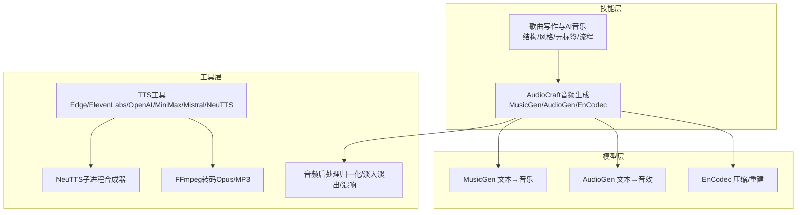
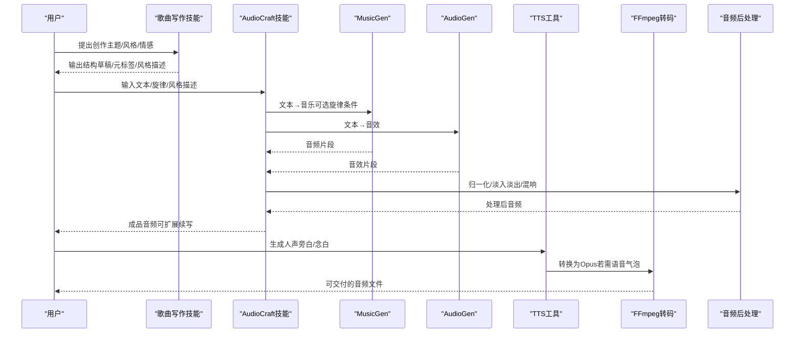
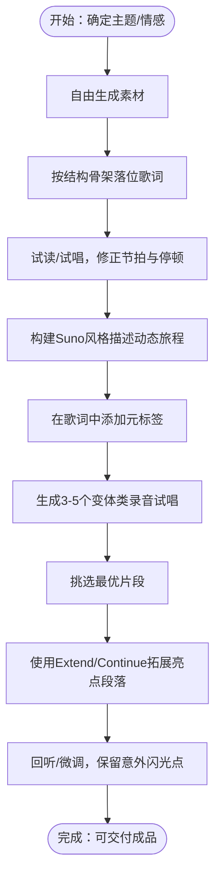
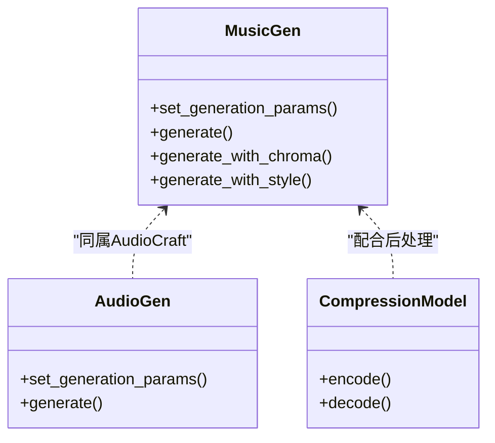
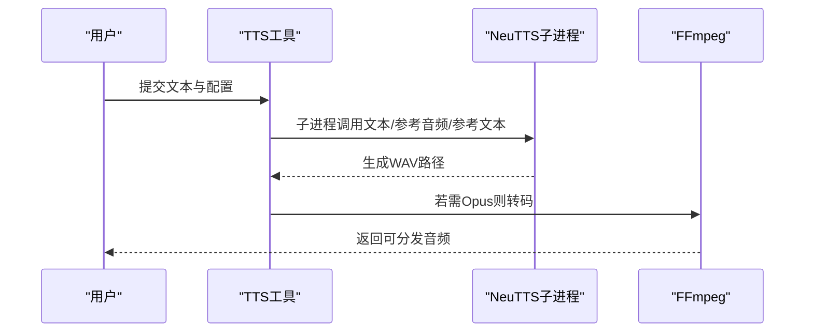
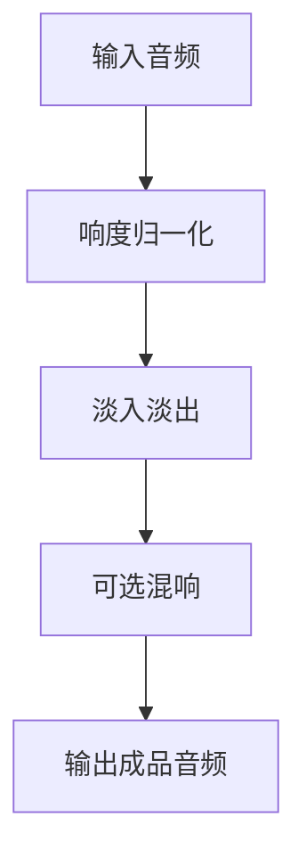
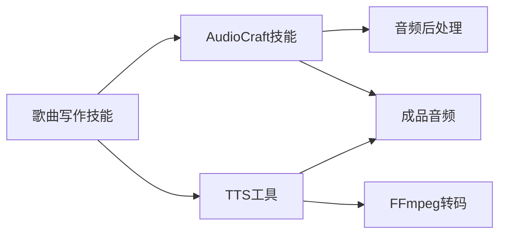

# 音乐创作工具

<cite>
**本文引用的文件**
- [README.md](file://README.md)
- [SKILL.md（创意：歌曲写作与AI音乐）](file://skills/creative/songwriting-and-ai-music/SKILL.md)
- [SKILL.md（MLOps：AudioCraft音频生成）](file://skills/mlops/models/audiocraft/SKILL.md)
- [neutts_synth.py](file://tools/neutts_synth.py)
- [tts_tool.py](file://tools/tts_tool.py)
- [advanced-usage.md（AudioCraft高级用法）](file://skills/mlops/models/audiocraft/references/advanced-usage.md)
</cite>

## 目录
1. [简介](#简介)
2. [项目结构](#项目结构)
3. [核心组件](#核心组件)
4. [架构总览](#架构总览)
5. [详细组件分析](#详细组件分析)
6. [依赖关系分析](#依赖关系分析)
7. [性能考量](#性能考量)
8. [故障排查指南](#故障排查指南)
9. [结论](#结论)
10. [附录](#附录)

## 简介
本文件面向“音乐创作工具”的创意与技术实现，围绕AI辅助音乐创作展开，系统阐述以下内容：
- AI辅助音乐创作的原理与算法要点（文本到音乐、风格迁移、韵律与动态控制）
- 歌词创作与旋律生成的辅助能力
- 风格选择、情感表达与艺术质量控制策略
- 创作工作流程（灵感收集、主题确定、结构设计、成品优化）
- 不同音乐类型技巧、风格融合与个性化定制
- 版权与分享注意事项及后续开发建议

该工具基于可复用的技能与工具体系，结合本地TTS与远端模型服务，提供从歌词到音色风格的全流程支持。

章节来源
- [README.md:1-179](file://README.md#L1-L179)

## 项目结构
本仓库是一个通用智能体平台，音乐创作能力通过“技能”和“工具”模块组合实现：
- 技能层：提供创作指导与提示工程（如歌曲结构、Sunoco风格描述、元标签等）
- 模型层：集成AudioCraft（MusicGen、AudioGen、EnCodec）进行文本到音乐/声音的生成
- 工具层：提供TTS合成（含本地NeuTTS与多云厂商）、音频格式转换、后处理等

图示来源
- [SKILL.md（创意：歌曲写作与AI音乐）:18-290](file://skills/creative/songwriting-and-ai-music/SKILL.md#L18-L290)
- [SKILL.md（MLOps：AudioCraft音频生成）:14-568](file://skills/mlops/models/audiocraft/SKILL.md#L14-L568)
- [tts_tool.py:1-200](file://tools/tts_tool.py#L1-L200)
- [neutts_synth.py:1-105](file://tools/neutts_synth.py#L1-L105)
- [advanced-usage.md:530-594](file://skills/mlops/models/audiocraft/references/advanced-usage.md#L530-L594)

章节来源
- [SKILL.md（创意：歌曲写作与AI音乐）:18-290](file://skills/creative/songwriting-and-ai-music/SKILL.md#L18-L290)
- [SKILL.md（MLOps：AudioCraft音频生成）:14-568](file://skills/mlops/models/audiocraft/SKILL.md#L14-L568)
- [tts_tool.py:1-200](file://tools/tts_tool.py#L1-L200)
- [neutts_synth.py:1-105](file://tools/neutts_synth.py#L1-L105)
- [advanced-usage.md:530-594](file://skills/mlops/models/audiocraft/references/advanced-usage.md#L530-L594)

## 核心组件
- 歌曲写作与AI音乐技能：提供结构模板、韵律与节奏、情感弧线、副歌定位、元标签体系、Suno风格描述公式、工作流步骤与经验总结。
- AudioCraft技能：提供MusicGen（文本→音乐/旋律条件/立体声/续写）、AudioGen（文本→音效）、EnCodec（压缩/解压）的使用方法、参数说明与最佳实践。
- TTS工具：统一抽象多家TTS供应商，支持本地NeuTTS与云端方案；提供Opus转码以适配语音气泡场景。
- 音频后处理：提供归一化、淡入淡出、简单混响等处理管线，提升成品听感一致性。

章节来源
- [SKILL.md（创意：歌曲写作与AI音乐）:25-290](file://skills/creative/songwriting-and-ai-music/SKILL.md#L25-L290)
- [SKILL.md（MLOps：AudioCraft音频生成）:175-370](file://skills/mlops/models/audiocraft/SKILL.md#L175-L370)
- [tts_tool.py:1-200](file://tools/tts_tool.py#L1-L200)
- [advanced-usage.md:530-594](file://skills/mlops/models/audiocraft/references/advanced-usage.md#L530-L594)

## 架构总览
下图展示从“创作意图”到“可分享成品”的端到端流程，涵盖歌词与风格提示工程、模型生成、后处理与交付。

图示来源
- [SKILL.md（创意：歌曲写作与AI音乐）:154-266](file://skills/creative/songwriting-and-ai-music/SKILL.md#L154-L266)
- [SKILL.md（MLOps：AudioCraft音频生成）:175-370](file://skills/mlops/models/audiocraft/SKILL.md#L175-L370)
- [tts_tool.py:138-171](file://tools/tts_tool.py#L138-L171)
- [advanced-usage.md:530-594](file://skills/mlops/models/audiocraft/references/advanced-usage.md#L530-L594)

## 详细组件分析

### 组件A：歌曲写作与AI音乐技能
- 结构与动态：提供ABABCB、AABA、ABAB、AAA等常见骨架，强调“结构服务于情感”，并给出前奏、主歌、预副歌、副歌、桥段、尾声的职责定义。
- 韵律与节拍：区分完美韵、家族韵、内韵、近韵等，强调在变化中寻找生命力；同时关注重音与节奏对可唱性的决定性影响。
- 情感弧线与动态：提出“低→高→低”的能量映射与对比技巧，强调静默作为乐器的价值。
- 歌词创作原则：展示优于叙述、钩子定位、韵律与旋律的协同、避免陈词滥调与强制押韵。
- 仿作与改编：强调先映射原曲的音节数、韵式与重音位置，再进行新词适配，保持节奏稳定。
- Suno风格描述与元标签：提供“风格/流派描述字段”的公式化构建方法，以及结构、演唱、动态、性别、氛围、音效等元标签体系；强调在风格与歌词字段重复强化。
- 工作流：从概念/钩子出发，生成素材→落位结构→试读/试唱→构建风格描述→添加元标签→生成多版本→挑选与扩展→保留意外之喜。

图示来源
- [SKILL.md（创意：歌曲写作与AI音乐）:255-290](file://skills/creative/songwriting-and-ai-music/SKILL.md#L255-L290)
- [SKILL.md（创意：歌曲写作与AI音乐）:154-228](file://skills/creative/songwriting-and-ai-music/SKILL.md#L154-L228)

章节来源
- [SKILL.md（创意：歌曲写作与AI音乐）:25-290](file://skills/creative/songwriting-and-ai-music/SKILL.md#L25-L290)

### 组件B：AudioCraft音频生成（MusicGen/AudioGen/EnCodec）
- MusicGen：支持文本到音乐、旋律条件生成、立体声输出、续写等；提供generation参数（时长、top_k、温度、CFG系数）与模型变体（小/中/大、旋律条件、立体声、风格迁移）。
- AudioGen：用于文本到音效生成，适合环境音、动作音等。
- EnCodec：用于高质量音频压缩与重建，便于传输或二次处理。
- 典型工作流：批量生成、Gradio演示、GPU显存优化、批处理效率提升。
- 常见问题：CUDA显存不足、质量不佳、时长受限、音频伪影、立体声不生效等。

图示来源
- [SKILL.md（MLOps：AudioCraft音频生成）:175-370](file://skills/mlops/models/audiocraft/SKILL.md#L175-L370)
- [SKILL.md（MLOps：AudioCraft音频生成）:420-506](file://skills/mlops/models/audiocraft/SKILL.md#L420-L506)

章节来源
- [SKILL.md（MLOps：AudioCraft音频生成）:175-370](file://skills/mlops/models/audiocraft/SKILL.md#L175-L370)
- [SKILL.md（MLOps：AudioCraft音频生成）:508-555](file://skills/mlops/models/audiocraft/SKILL.md#L508-L555)

### 组件C：TTS与音频交付
- 多供应商抽象：Edge TTS、ElevenLabs、OpenAI TTS、MiniMax TTS、Mistral Voxtral、NeuTTS（本地）。
- 输出格式：默认MP3，针对Telegram语音气泡使用FFmpeg转Opus。
- 本地NeuTTS：通过独立子进程运行，避免常驻内存；需要参考音频与参考文本以实现音色克隆。
- 合成流程：参数校验→加载模型→编码参考→推理→保存WAV（或回退到自写WAV）。

图示来源
- [tts_tool.py:460-494](file://tools/tts_tool.py#L460-L494)
- [neutts_synth.py:51-105](file://tools/neutts_synth.py#L51-L105)
- [tts_tool.py:138-171](file://tools/tts_tool.py#L138-L171)

章节来源
- [tts_tool.py:1-200](file://tools/tts_tool.py#L1-L200)
- [neutts_synth.py:1-105](file://tools/neutts_synth.py#L1-L105)

### 组件D：音频后处理与质量控制
- 归一化：将音频响度标准化至目标dB，保证多轨拼接的一致性。
- 淡入淡出：在起止处施加渐变，减少爆音与突兀。
- 简单混响：通过脉冲响应卷积模拟空间感，增强沉浸感。
- 流水线：先归一化，再淡入淡出，最后输出成品。

图示来源
- [advanced-usage.md:530-594](file://skills/mlops/models/audiocraft/references/advanced-usage.md#L530-L594)

章节来源
- [advanced-usage.md:530-594](file://skills/mlops/models/audiocraft/references/advanced-usage.md#L530-L594)

## 依赖关系分析
- 技能与工具耦合：歌曲写作技能为AudioCraft与TTS提供高质量提示与结构约束，降低模型输出漂移。
- 模型与后处理：AudioCraft生成的音频经由后处理提升听感；TTS生成的人声可与模型生成的伴奏进行拼接。
- 交付链路：TTS工具负责文本到语音；AudioCraft负责文本到音乐/音效；FFmpeg负责格式转换；后处理统一响度与动态。

图示来源
- [SKILL.md（创意：歌曲写作与AI音乐）:154-266](file://skills/creative/songwriting-and-ai-music/SKILL.md#L154-L266)
- [SKILL.md（MLOps：AudioCraft音频生成）:175-370](file://skills/mlops/models/audiocraft/SKILL.md#L175-L370)
- [tts_tool.py:138-171](file://tools/tts_tool.py#L138-L171)
- [advanced-usage.md:530-594](file://skills/mlops/models/audiocraft/references/advanced-usage.md#L530-L594)

章节来源
- [SKILL.md（创意：歌曲写作与AI音乐）:154-266](file://skills/creative/songwriting-and-ai-music/SKILL.md#L154-L266)
- [SKILL.md（MLOps：AudioCraft音频生成）:175-370](file://skills/mlops/models/audiocraft/SKILL.md#L175-L370)
- [tts_tool.py:138-171](file://tools/tts_tool.py#L138-L171)
- [advanced-usage.md:530-594](file://skills/mlops/models/audiocraft/references/advanced-usage.md#L530-L594)

## 性能考量
- 显存与速度权衡：优先使用较小模型或降低时长；半精度可显著降低显存占用；批处理优于多次单次调用。
- 生成迭代成本：建议每次扩展前明确重申风格/情绪，避免风格漂移；合理设置CFG系数与温度以平衡可控性与多样性。
- 交付体积：音频压缩与格式转换可降低存储与传输成本；Opus适合语音气泡场景。

章节来源
- [SKILL.md（MLOps：AudioCraft音频生成）:508-555](file://skills/mlops/models/audiocraft/SKILL.md#L508-L555)
- [SKILL.md（MLOps：AudioCraft音频生成）:526-536](file://skills/mlops/models/audiocraft/SKILL.md#L526-L536)

## 故障排查指南
- CUDA显存不足：改用更小模型、缩短时长、关闭半精度以外的优化。
- 质量不佳：提高CFG系数、优化提示词、尝试不同温度；必要时增加生成轮次。
- 时长异常：检查最大时长设置与模型限制。
- 音频伪影：调整温度、采样率或后处理参数。
- 立体声无效：确认使用立体声模型变体。
- FFmpeg转码失败：检查安装与权限；确认输入文件存在且可读。

章节来源
- [SKILL.md（MLOps：AudioCraft音频生成）:546-555](file://skills/mlops/models/audiocraft/SKILL.md#L546-L555)
- [tts_tool.py:138-171](file://tools/tts_tool.py#L138-L171)

## 结论
本工具通过“创作技能+模型能力+工具链”的组合，形成从歌词到风格再到成品的完整闭环。借助结构化提示工程与参数化控制，既能保证风格一致性，又能激发创意突破；通过后处理与格式转换，确保最终交付的听感与可用性。建议在实际使用中坚持“反复试验、保留意外”的创作哲学，并根据项目需求灵活选择模型规模与后处理强度。

## 附录
- 创作工作流程清单
  - 明确主题与情感核心
  - 生成素材并映射到结构骨架
  - 试读/试唱，修正节拍与停顿
  - 构建Suno风格描述与元标签
  - 生成3-5个变体，挑选最优
  - 使用Extend/Continue拓展亮点段落
  - 回听/微调，保留意外闪光点
- 风格融合与个性化定制建议
  - 将多个风格元素拆解为“风格+情绪+时代+乐器+人声+制作+动态”的组合项，逐步叠加与消减，找到最契合的组合。
  - 在桥段与尾声引入风格转换，以实现情感转折。
  - 通过元标签细化表演细节（如气声、颤音、合唱等），并与风格描述呼应。
- 版权与分享
  - 使用模型生成的音乐需遵守对应模型与平台的许可条款；避免直接使用受版权保护的样本作为风格参考。
  - 分享前建议进行响度与动态统一，确保跨平台一致体验。
  - 对于人声旁白，优先采用本地NeuTTS以降低隐私与合规风险；云端TTS需遵循相应API条款。