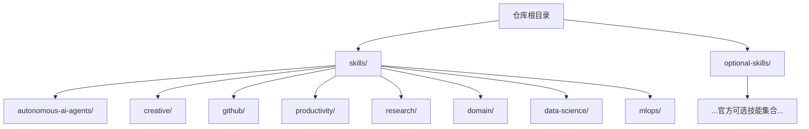
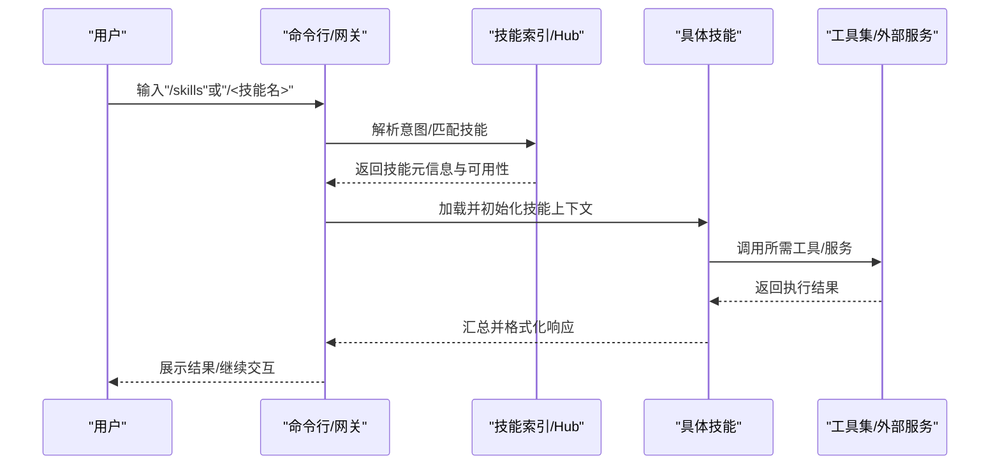
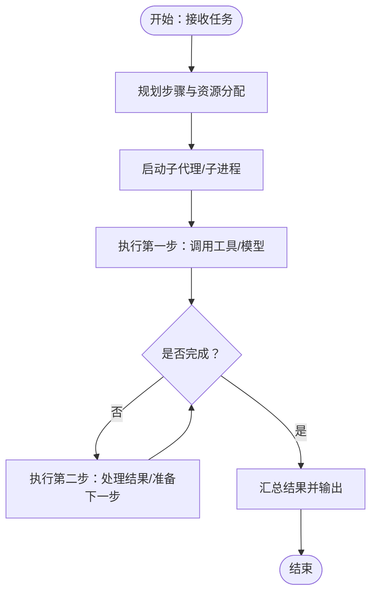
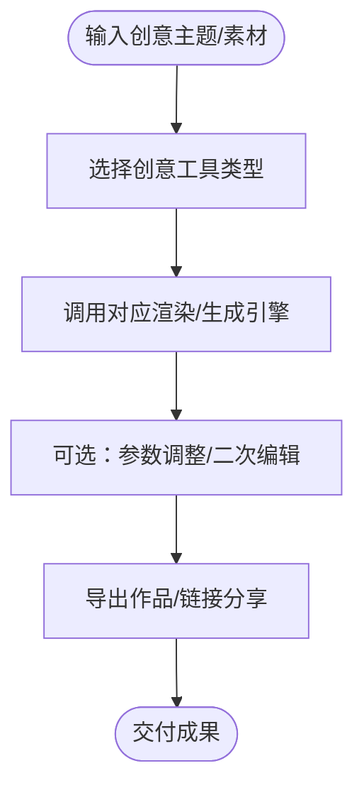
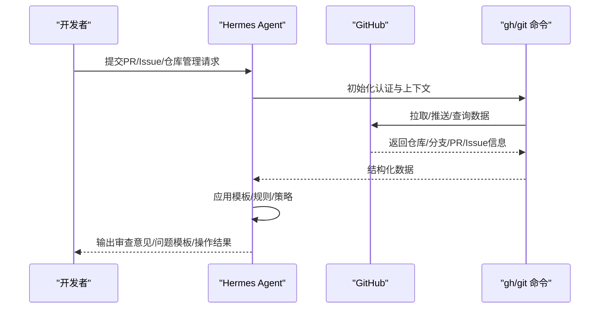
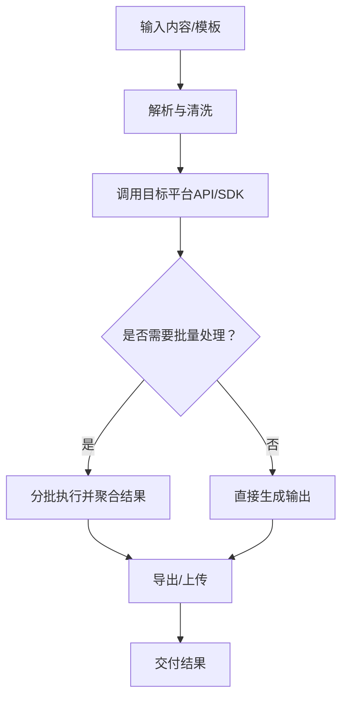
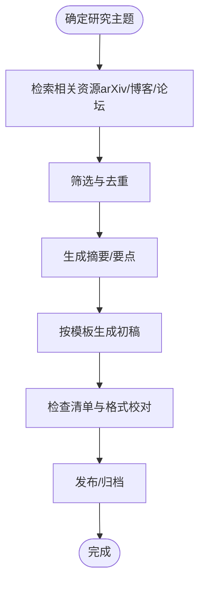
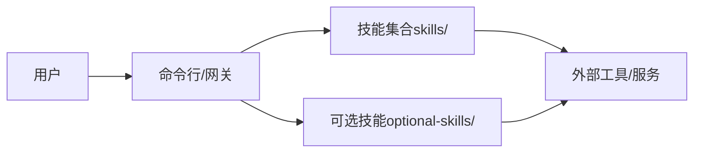

# 技能分类与示例

<cite>
**本文引用的文件**
- [README.md](file://README.md)
- [skills/autonomous-ai-agents/DESCRIPTION.md](file://skills/autonomous-ai-agents/DESCRIPTION.md)
- [skills/creative/DESCRIPTION.md](file://skills/creative/DESCRIPTION.md)
- [skills/github/DESCRIPTION.md](file://skills/github/DESCRIPTION.md)
- [skills/productivity/DESCRIPTION.md](file://skills/productivity/DESCRIPTION.md)
- [skills/research/DESCRIPTION.md](file://skills/research/DESCRIPTION.md)
- [skills/domain/DESCRIPTION.md](file://skills/domain/DESCRIPTION.md)
- [skills/data-science/DESCRIPTION.md](file://skills/data-science/DESCRIPTION.md)
- [skills/mlops/DESCRIPTION.md](file://skills/mlops/DESCRIPTION.md)
- [optional-skills/DESCRIPTION.md](file://optional-skills/DESCRIPTION.md)
- [skills/github/codebase-inspection/SKILL.md](file://skills/github/codebase-inspection/SKILL.md)
- [skills/github/github-auth/SKILL.md](file://skills/github/github-auth/SKILL.md)
- [skills/github/github-code-review/SKILL.md](file://skills/github/github-code-review/SKILL.md)
- [skills/github/github-issues/SKILL.md](file://skills/github/github-issues/SKILL.md)
- [skills/github/github-pr-workflow/SKILL.md](file://skills/github/github-pr-workflow/SKILL.md)
- [skills/github/github-repo-management/SKILL.md](file://skills/github/github-repo-management/SKILL.md)
- [skills/research/arxiv/SKILL.md](file://skills/research/arxiv/SKILL.md)
- [skills/research/blogwatcher/SKILL.md](file://skills/research/blogwatcher/SKILL.md)
- [skills/research/llm-wiki/SKILL.md](file://skills/research/llm-wiki/SKILL.md)
- [skills/research/polymarket/SKILL.md](file://skills/research/polymarket/SKILL.md)
- [skills/research/research-paper-writing/SKILL.md](file://skills/research/research-paper-writing/SKILL.md)
- [skills/autonomous-ai-agents/claude-code/SKILL.md](file://skills/autonomous-ai-agents/claude-code/SKILL.md)
- [skills/autonomous-ai-agents/codex/SKILL.md](file://skills/autonomous-ai-agents/codex/SKILL.md)
- [skills/autonomous-ai-agents/hermes-agent/SKILL.md](file://skills/autonomous-ai-agents/hermes-agent/SKILL.md)
- [skills/autonomous-ai-agents/opencode/SKILL.md](file://skills/autonomous-ai-agents/opencode/SKILL.md)
- [skills/creative/ascii-art/SKILL.md](file://skills/creative/ascii-art/SKILL.md)
- [skills/creative/ascii-video/SKILL.md](file://skills/creative/ascii-video/SKILL.md)
- [skills/creative/creative-ideation/SKILL.md](file://skills/creative/creative-ideation/SKILL.md)
- [skills/creative/excalidraw/SKILL.md](file://skills/creative/excalidraw/SKILL.md)
- [skills/creative/manim-video/SKILL.md](file://skills/creative/manim-video/SKILL.md)
- [skills/creative/p5js/SKILL.md](file://skills/creative/p5js/SKILL.md)
- [skills/creative/popular-web-designs/SKILL.md](file://skills/creative/popular-web-designs/SKILL.md)
- [skills/creative/songwriting-and-ai-music/SKILL.md](file://skills/creative/songwriting-and-ai-music/SKILL.md)
- [skills/productivity/google-workspace/SKILL.md](file://skills/productivity/google-workspace/SKILL.md)
- [skills/productivity/linear/SKILL.md](file://skills/productivity/linear/SKILL.md)
- [skills/productivity/nano-pdf/SKILL.md](file://skills/productivity/nano-pdf/SKILL.md)
- [skills/productivity/notion/SKILL.md](file://skills/productivity/notion/SKILL.md)
- [skills/productivity/ocr-and-documents/SKILL.md](file://skills/productivity/ocr-and-documents/SKILL.md)
- [skills/productivity/powerpoint/SKILL.md](file://skills/productivity/powerpoint/SKILL.md)
</cite>

## 目录
1. [简介](#简介)
2. [项目结构](#项目结构)
3. [核心组件](#核心组件)
4. [架构总览](#架构总览)
5. [详细组件分析](#详细组件分析)
6. [依赖关系分析](#依赖关系分析)
7. [性能考量](#性能考量)
8. [故障排查指南](#故障排查指南)
9. [结论](#结论)
10. [附录](#附录)

## 简介
本文件面向Hermes Agent的技能体系，提供系统化的技能分类与示例说明。内容覆盖自主AI代理、创意工具、GitHub集成、生产力工具、研究辅助等多个功能领域，为每个类别列举代表性技能、典型使用场景与实现原理概述，并解释技能分类的设计理念、扩展机制与自定义方法。同时给出技能选择指南、使用建议与最佳实践，帮助用户快速定位并应用合适的技能解决方案。

## 项目结构
Hermes Agent的技能以“目录即技能”的方式组织在skills与optional-skills两个根目录下。每个技能由一个SKILL.md文件声明其能力、触发条件、使用方式与参考材料；部分技能还包含脚本、模板与参考资料。README中提供了技能系统与命令行入口的总体介绍。

图示来源
- [README.md:1-179](file://README.md#L1-L179)
- [skills/autonomous-ai-agents/DESCRIPTION.md:1-4](file://skills/autonomous-ai-agents/DESCRIPTION.md#L1-L4)
- [skills/creative/DESCRIPTION.md:1-4](file://skills/creative/DESCRIPTION.md#L1-L4)
- [skills/github/DESCRIPTION.md:1-4](file://skills/github/DESCRIPTION.md#L1-L4)
- [skills/productivity/DESCRIPTION.md:1-4](file://skills/productivity/DESCRIPTION.md#L1-L4)
- [skills/research/DESCRIPTION.md:1-4](file://skills/research/DESCRIPTION.md#L1-L4)
- [skills/domain/DESCRIPTION.md:1-25](file://skills/domain/DESCRIPTION.md#L1-L25)
- [skills/data-science/DESCRIPTION.md:1-4](file://skills/data-science/DESCRIPTION.md#L1-L4)
- [skills/mlops/DESCRIPTION.md:1-4](file://skills/mlops/DESCRIPTION.md#L1-L4)
- [optional-skills/DESCRIPTION.md:1-25](file://optional-skills/DESCRIPTION.md#L1-L25)

章节来源
- [README.md:89-108](file://README.md#L89-L108)

## 核心组件
- 技能描述与索引：各技能目录下的DESCRIPTION.md或SKILL.md提供技能名称、简要描述、能力范围与触发关键词等元信息。
- 可选技能机制：optional-skills中的官方技能默认不随安装启用，可通过命令行浏览、搜索与安装到本地技能目录后激活。
- 命令行入口：/skills与/<skill-name>等命令用于浏览与调用技能，支持在终端与消息网关平台使用。

章节来源
- [optional-skills/DESCRIPTION.md:1-25](file://optional-skills/DESCRIPTION.md#L1-L25)
- [README.md:79-83](file://README.md#L79-L83)

## 架构总览
技能系统围绕“技能发现—安装—激活—调用—执行—反馈”闭环构建。用户通过命令行或消息平台触发技能，技能根据自身定义的意图与工具集完成任务，并输出结果或进一步交互。

## 详细组件分析

### 自主AI代理（Autonomous AI Agents）
设计理念：通过轻量代理或子代理执行复杂任务，实现任务拆分、并行执行与协调，降低单次对话上下文压力，提升长流程任务的可控性与稳定性。

代表性技能与示例
- hermes-agent：基于Hermes Agent自身能力进行任务委派与编排，适合需要多轮推理与跨工具协作的场景。
- claude-code：结合Claude模型进行代码生成与优化，适用于特定语言或框架的自动化开发任务。
- codex：面向通用代码生成与补全，适合快速原型与迭代。
- opencode：面向开源协作与代码贡献流程的自动化支持。

使用场景
- 需要长时间运行且需断点续跑的任务
- 多步骤流水线（如代码生成→测试→提交）的自动化
- 需要跨模型能力组合的复杂推理任务

实现原理（概览）
- 技能加载后建立独立工作流，按步骤调用工具与外部模型，必要时通过会话状态持久化中间结果，支持中断与重试。

章节来源
- [skills/autonomous-ai-agents/DESCRIPTION.md:1-4](file://skills/autonomous-ai-agents/DESCRIPTION.md#L1-L4)
- [skills/autonomous-ai-agents/hermes-agent/SKILL.md](file://skills/autonomous-ai-agents/hermes-agent/SKILL.md)
- [skills/autonomous-ai-agents/claude-code/SKILL.md](file://skills/autonomous-ai-agents/claude-code/SKILL.md)
- [skills/autonomous-ai-agents/codex/SKILL.md](file://skills/autonomous-ai-agents/codex/SKILL.md)
- [skills/autonomous-ai-agents/opencode/SKILL.md](file://skills/autonomous-ai-agents/opencode/SKILL.md)

### 创意工具（Creative Tools）
设计理念：提供从文本到视觉的创意生成与编辑能力，覆盖ASCII艺术、手绘风格、视频动画、交互式可视化等多种创作形式，满足多样化表达需求。

代表性技能与示例
- ascii-art：将文本转为ASCII字符画，适合快速生成装饰性或提示性图像。
- ascii-video：将视频转换为ASCII风格序列，强调创意与复古美学。
- creative-ideation：提供创意提示库与思维导图模板，辅助头脑风暴与概念设计。
- excalidraw：基于Excalidraw的草图绘制与分享，适合快速手绘草图。
- manim-video：使用Manim渲染数学与科学概念的高质量动画。
- p5js：基于p5.js的WebGL图形与动画创作，适合交互式媒体。
- popular-web-designs：提供主流网站设计模板与规范参考，便于快速仿制与学习。
- songwriting-and-ai-music：辅助歌词创作与音乐生成，适合内容创作者。

使用场景
- 快速生成视觉提示或装饰元素
- 科学可视化与教学演示
- 交互式媒体与实验性创作
- 设计灵感收集与模板复用

实现原理（概览）
- 技能通过调用外部渲染器、图像处理工具或在线服务，将输入转换为最终作品，并支持参数化调整与批量处理。

章节来源
- [skills/creative/DESCRIPTION.md:1-4](file://skills/creative/DESCRIPTION.md#L1-L4)
- [skills/creative/ascii-art/SKILL.md](file://skills/creative/ascii-art/SKILL.md)
- [skills/creative/ascii-video/SKILL.md](file://skills/creative/ascii-video/SKILL.md)
- [skills/creative/creative-ideation/SKILL.md](file://skills/creative/creative-ideation/SKILL.md)
- [skills/creative/excalidraw/SKILL.md](file://skills/creative/excalidraw/SKILL.md)
- [skills/creative/manim-video/SKILL.md](file://skills/creative/manim-video/SKILL.md)
- [skills/creative/p5js/SKILL.md](file://skills/creative/p5js/SKILL.md)
- [skills/creative/popular-web-designs/SKILL.md](file://skills/creative/popular-web-designs/SKILL.md)
- [skills/creative/songwriting-and-ai-music/SKILL.md](file://skills/creative/songwriting-and-ai-music/SKILL.md)

### GitHub集成（GitHub Integration）
设计理念：将日常开发流程（仓库管理、问题与PR、代码审查、CI/CD）与Hermes Agent无缝衔接，减少切换成本，提升协作效率与一致性。

代表性技能与示例
- github-auth：配置与管理GitHub认证环境变量，确保后续操作的安全与稳定。
- codebase-inspection：对代码库进行静态扫描与洞察，识别潜在问题与改进点。
- github-code-review：基于PR内容生成结构化审查意见，支持模板化输出与持续改进。
- github-issues：创建与管理Issue，内置模板与标签策略，统一问题描述格式。
- github-pr-workflow：协助PR撰写、合规检查与CI排障，提供约定式提交与模板化正文。
- github-repo-management：执行仓库级管理操作（如设置、迁移、备份）与常用API快捷方式。

使用场景
- 团队协作中的自动化审查与问题跟踪
- 规范化PR流程与提交信息
- 代码质量与安全基线的持续维护

实现原理（概览）
- 技能通过gh CLI与git命令访问远程仓库，结合模板与脚本生成标准化输出，必要时调用GitHub API完成高级操作。

章节来源
- [skills/github/DESCRIPTION.md:1-4](file://skills/github/DESCRIPTION.md#L1-L4)
- [skills/github/github-auth/SKILL.md](file://skills/github/github-auth/SKILL.md)
- [skills/github/codebase-inspection/SKILL.md](file://skills/github/codebase-inspection/SKILL.md)
- [skills/github/github-code-review/SKILL.md](file://skills/github/github-code-review/SKILL.md)
- [skills/github/github-issues/SKILL.md](file://skills/github/github-issues/SKILL.md)
- [skills/github/github-pr-workflow/SKILL.md](file://skills/github/github-pr-workflow/SKILL.md)
- [skills/github/github-repo-management/SKILL.md](file://skills/github/github-repo-management/SKILL.md)

### 生产力工具（Productivity Tools）
设计理念：围绕文档、演示、办公套件与知识管理，提供从创建、编辑到发布的全流程自动化，提升知识沉淀与团队协作效率。

代表性技能与示例
- google-workspace：与Gmail/Drive/Calendar等集成，支持搜索语法与桥接脚本，实现邮件与文档的自动化处理。
- linear：与Linear项目管理平台集成，支持任务创建、更新与报告。
- nano-pdf：轻量PDF生成与编辑，适合快速文档归档。
- notion：与Notion数据库与页面集成，支持块类型与模板化操作。
- ocr-and-documents：提取图片与文档中的文本，支持标记与清理，便于二次处理。
- powerpoint：基于Office/OpenXML的PPT生成与编辑，支持合并与样式简化。

使用场景
- 日常文档与报告的自动化生成
- 跨平台知识库与任务看板的同步
- 批量内容提取与结构化整理

实现原理（概览）
- 技能通过OAuth或API密钥访问云端服务，结合模板与脚本完成结构化输出与批量处理。

章节来源
- [skills/productivity/DESCRIPTION.md:1-4](file://skills/productivity/DESCRIPTION.md#L1-L4)
- [skills/productivity/google-workspace/SKILL.md](file://skills/productivity/google-workspace/SKILL.md)
- [skills/productivity/linear/SKILL.md](file://skills/productivity/linear/SKILL.md)
- [skills/productivity/nano-pdf/SKILL.md](file://skills/productivity/nano-pdf/SKILL.md)
- [skills/productivity/notion/SKILL.md](file://skills/productivity/notion/SKILL.md)
- [skills/productivity/ocr-and-documents/SKILL.md](file://skills/productivity/ocr-and-documents/SKILL.md)
- [skills/productivity/powerpoint/SKILL.md](file://skills/productivity/powerpoint/SKILL.md)

### 研究辅助（Research Assistance）
设计理念：围绕学术研究、论文检索、知识发现与写作支持，提供从资料搜集、整理到成稿的端到端能力，加速科研与学习过程。

代表性技能与示例
- arxiv：检索arXiv论文，支持关键词搜索与摘要获取，便于快速筛选相关文献。
- blogwatcher：订阅与监测博客源，自动抓取新文章并生成摘要，保持知识更新。
- llm-wiki：整合LLM相关知识库与术语表，辅助术语统一与背景补充。
- polymarket：获取预测市场数据，辅助事件概率与趋势分析。
- research-paper-writing：提供论文写作方法论、模板与检查清单，支持不同会议/期刊格式。

使用场景
- 学术论文的快速检索与筛选
- 行业动态与技术趋势的持续追踪
- 论文写作的结构化指导与格式化输出

实现原理（概览）
- 技能通过公开API或网页抓取获取数据，结合模板与参考材料生成结构化报告或写作建议。

章节来源
- [skills/research/DESCRIPTION.md:1-4](file://skills/research/DESCRIPTION.md#L1-L4)
- [skills/research/arxiv/SKILL.md](file://skills/research/arxiv/SKILL.md)
- [skills/research/blogwatcher/SKILL.md](file://skills/research/blogwatcher/SKILL.md)
- [skills/research/llm-wiki/SKILL.md](file://skills/research/llm-wiki/SKILL.md)
- [skills/research/polymarket/SKILL.md](file://skills/research/polymarket/SKILL.md)
- [skills/research/research-paper-writing/SKILL.md](file://skills/research/research-paper-writing/SKILL.md)

### 其他领域（Domain Intelligence、Data Science、MLOps）
- domain-intel：基于Python标准库与公开数据源进行被动域情报采集（证书透明度日志、WHOIS、DNS记录等），无需API密钥即可运行。
- data-science：提供数据科学工作流支持，如Jupyter交互内核与探索性分析。
- mlops：涵盖训练、微调、部署与优化等机器学习工程能力，适配多种框架与向量数据库。

使用场景
- 安全与合规审计中的被动侦察
- 数据探索与可视化
- 模型生命周期管理与优化

实现原理（概览）
- 通过标准网络协议与公开接口采集数据，结合本地计算完成分析与报告生成。

章节来源
- [skills/domain/DESCRIPTION.md:1-25](file://skills/domain/DESCRIPTION.md#L1-L25)
- [skills/data-science/DESCRIPTION.md:1-4](file://skills/data-science/DESCRIPTION.md#L1-L4)
- [skills/mlops/DESCRIPTION.md:1-4](file://skills/mlops/DESCRIPTION.md#L1-L4)

## 依赖关系分析
- 技能与工具：多数技能依赖命令行工具（如gh、git）或云服务API（如Google Workspace、Linear），并通过脚本与模板实现标准化输出。
- 可选技能：optional-skills中的官方技能默认不激活，需经命令行安装后方可使用，便于控制默认依赖与运行环境。
- 平台一致性：技能在CLI与消息网关平台（Telegram、Discord等）均可用，命令与交互方式一致。

章节来源
- [optional-skills/DESCRIPTION.md:1-25](file://optional-skills/DESCRIPTION.md#L1-L25)
- [README.md:79-83](file://README.md#L79-L83)

## 性能考量
- 上下文与并发：自主AI代理与多步骤任务应尽量拆分，避免一次性承载过多上下文，必要时使用压缩与记忆裁剪。
- 工具调用开销：批量处理与外部API调用应分批执行并缓存结果，减少重复请求。
- 资源隔离：子代理与并行工作流建议在受控环境中运行，防止资源争用与状态污染。
- 可观测性：为关键步骤添加进度与日志输出，便于回溯与优化。

## 故障排查指南
- 技能不可用：确认技能已安装并处于激活状态；检查命令行提示与技能元信息。
- 认证失败：针对GitHub与云服务技能，检查认证环境变量与权限范围；必要时重新初始化认证。
- 外部依赖缺失：部分技能依赖特定命令或库，确认系统已安装并具备执行权限。
- 输出异常：核对模板与参数配置，逐步缩小问题范围至具体工具或API调用。

## 结论
Hermes Agent的技能体系以“目录即技能”的方式实现了高度模块化与可扩展性。通过对功能领域的系统划分与代表性技能示例的梳理，用户可以快速定位适用场景并按需组合使用。建议优先从默认技能入手，按需安装optional-skills中的官方可选技能，并结合自身工作流定制模板与参数，以获得更佳的使用体验。

## 附录
- 技能选择指南
  - 明确目标：先确定任务类型（开发、创作、研究、办公），再在对应领域中挑选合适技能。
  - 评估依赖：关注技能对外部工具与API的依赖程度，确保环境满足要求。
  - 小步验证：先用最小可行输入验证技能效果，再扩展到完整流程。
- 使用建议
  - 优先使用模板与参考材料，保证输出一致性与可复用性。
  - 对于长流程任务，采用分阶段执行与中间态保存，便于中断恢复。
  - 定期回顾与优化技能参数，结合实际使用反馈持续改进。