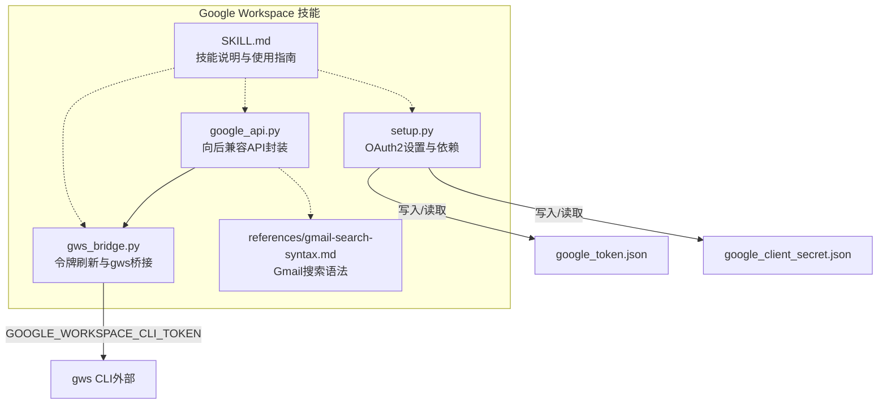
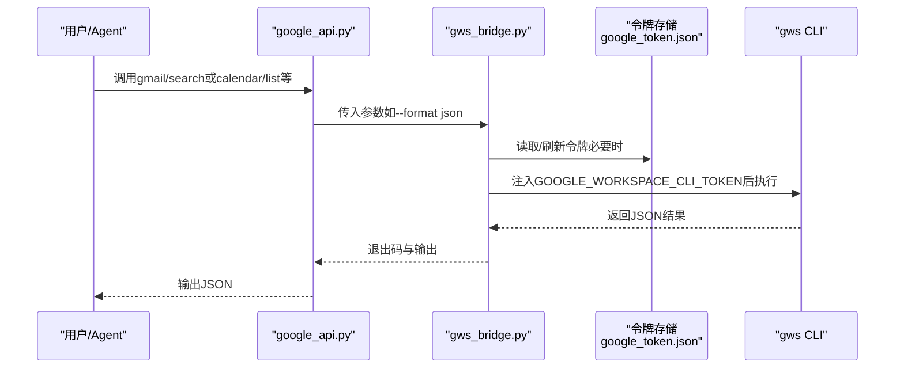
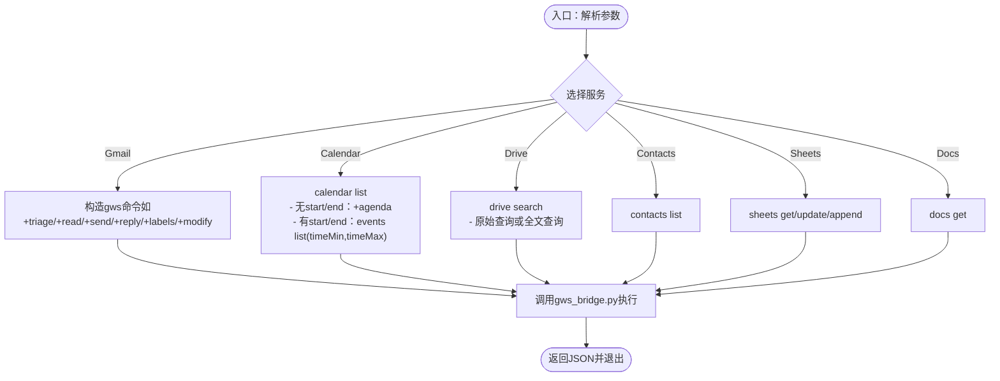
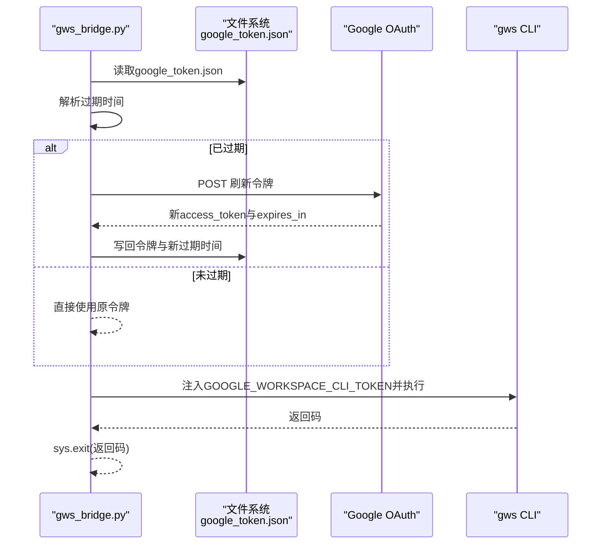
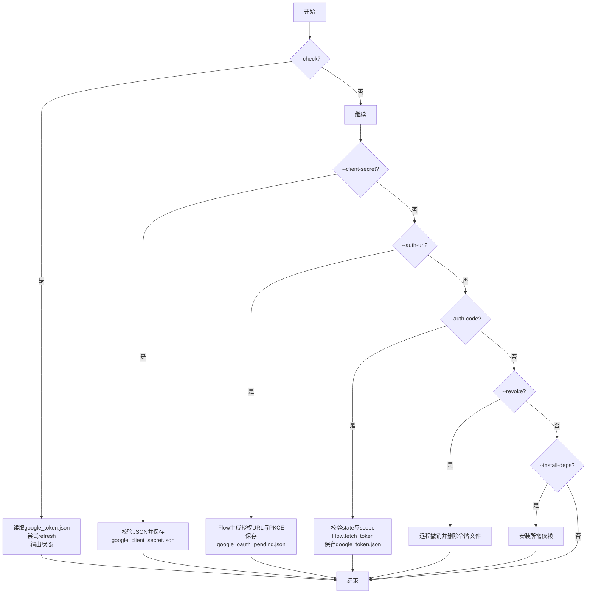
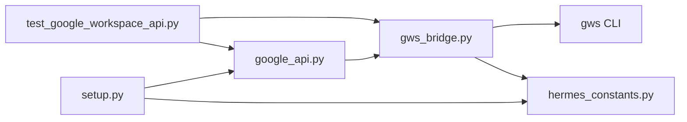

# 工作空间集成

<cite>
**本文引用的文件**
- [google_api.py](file://skills/productivity/google-workspace/scripts/google_api.py)
- [gws_bridge.py](file://skills/productivity/google-workspace/scripts/gws_bridge.py)
- [setup.py](file://skills/productivity/google-workspace/scripts/setup.py)
- [gmail-search-syntax.md](file://skills/productivity/google-workspace/references/gmail-search-syntax.md)
- [SKILL.md](file://skills/productivity/google-workspace/SKILL.md)
- [test_google_workspace_api.py](file://tests/skills/test_google_workspace_api.py)
- [hermes_constants.py](file://hermes_constants.py)
- [README.md](file://README.md)
- [pyproject.toml](file://pyproject.toml)
- [requirements.txt](file://requirements.txt)
</cite>

## 目录
1. [简介](#简介)
2. [项目结构](#项目结构)
3. [核心组件](#核心组件)
4. [架构总览](#架构总览)
5. [详细组件分析](#详细组件分析)
6. [依赖关系分析](#依赖关系分析)
7. [性能考量](#性能考量)
8. [故障排查指南](#故障排查指南)
9. [结论](#结论)
10. [附录](#附录)

## 简介
本文件面向Hermes Agent的Google Workspace集成技能，系统性阐述其在Gmail、Drive、Calendar、Contacts、Sheets、Docs等Google服务上的集成能力与实现方式。重点覆盖以下方面：
- google_api.py 的API封装与向后兼容接口
- gws_bridge.py 的OAuth令牌刷新与gws CLI桥接机制
- setup.py 的OAuth2配置流程与权限管理
- Gmail搜索语法、邮件自动分类、文档同步与日程管理的实现要点
- 工作流自动化、批量邮件处理与云端文档协作的应用场景
- API认证配置、权限管理与数据安全最佳实践

## 项目结构
Google Workspace技能位于skills/productivity/google-workspace目录，核心由三部分组成：
- scripts/google_api.py：向后兼容的命令行接口，委托给gws CLI执行
- scripts/gws_bridge.py：在调用gws前进行OAuth令牌刷新与注入
- scripts/setup.py：OAuth2设置、授权码交换、令牌撤销与依赖安装
- references/gmail-search-syntax.md：Gmail查询语法参考
- SKILL.md：技能说明、架构图、使用示例与排错指引

图表来源
- [google_api.py:1-328](file://skills/productivity/google-workspace/scripts/google_api.py#L1-L328)
- [gws_bridge.py:1-90](file://skills/productivity/google-workspace/scripts/gws_bridge.py#L1-L90)
- [setup.py:1-398](file://skills/productivity/google-workspace/scripts/setup.py#L1-L398)
- [gmail-search-syntax.md:1-64](file://skills/productivity/google-workspace/references/gmail-search-syntax.md#L1-L64)
- [SKILL.md:1-249](file://skills/productivity/google-workspace/SKILL.md#L1-L249)

章节来源
- [SKILL.md:23-43](file://skills/productivity/google-workspace/SKILL.md#L23-L43)

## 核心组件
- google_api.py
  - 提供与v1相同的CLI接口，内部通过gws_bridge.py调用gws CLI
  - 支持Gmail搜索/读取/发送/回复/标签/修改；Calendar列表/创建/删除；Drive搜索；Contacts列表；Sheets读取/更新/追加；Docs获取
  - 所有输出默认JSON格式，便于下游解析
- gws_bridge.py
  - 从HERMES_HOME下读取google_token.json
  - 若令牌过期则通过Google OAuth刷新并持久化
  - 将有效访问令牌注入环境变量GOOGLE_WORKSPACE_CLI_TOKEN后执行gws命令
- setup.py
  - 安装依赖（google-api-python-client、google-auth-oauthlib、google-auth-httplib2）
  - 存储客户端密钥、生成授权URL、交换授权码换取令牌、检查令牌有效性、撤销令牌
  - 支持部分授权范围（partial scopes），并提示缺失的scope
- Gmail搜索语法
  - 提供标准Gmail操作符、日期过滤、组合逻辑与常见模式示例

章节来源
- [google_api.py:209-328](file://skills/productivity/google-workspace/scripts/google_api.py#L209-L328)
- [gws_bridge.py:14-90](file://skills/productivity/google-workspace/scripts/gws_bridge.py#L14-L90)
- [setup.py:44-55](file://skills/productivity/google-workspace/scripts/setup.py#L44-L55)
- [gmail-search-syntax.md:1-64](file://skills/productivity/google-workspace/references/gmail-search-syntax.md#L1-L64)

## 架构总览
该技能采用“封装层 + 桥接层 + 外部CLI”的分层设计：
- 封装层（google_api.py）：保持与旧版一致的命令行语义，屏蔽gws CLI差异
- 桥接层（gws_bridge.py）：统一处理OAuth令牌刷新与注入，确保gws可正常访问Google API
- 外部CLI（gws）：官方Rust CLI，提供对Gmail/Calendar/Drive/People/Sheets/Docs的完整支持

图表来源
- [google_api.py:34-41](file://skills/productivity/google-workspace/scripts/google_api.py#L34-L41)
- [gws_bridge.py:55-85](file://skills/productivity/google-workspace/scripts/gws_bridge.py#L55-L85)

## 详细组件分析

### 组件A：API封装（google_api.py）
- 设计要点
  - 使用argparse维持向后兼容接口，子命令按服务划分（gmail/calendar/drive/contacts/sheets/docs）
  - 对每个服务的动作（如gmail.search、calendar.list）构造对应gws参数并调用
  - 通过gws_bridge.py执行，保证令牌注入与错误传播
- 关键流程
  - Gmail搜索：使用+triage助手并限制返回数量与格式
  - Calendar列表：无时间范围时使用+agenda助手；指定start/end时直接调用events.list并传入timeMin/timeMax
  - Drive搜索：支持原始查询与全文查询两种模式
  - Sheets读取/更新/追加：分别映射到gws的+read、spreadsheets.values.update、+append
  - Docs获取：调用documents.get
- 错误处理
  - 通过subprocess返回码传递至sys.exit，便于上层感知失败

图表来源
- [google_api.py:45-328](file://skills/productivity/google-workspace/scripts/google_api.py#L45-L328)

章节来源
- [google_api.py:45-328](file://skills/productivity/google-workspace/scripts/google_api.py#L45-L328)

### 组件B：桥接与令牌刷新（gws_bridge.py）
- 设计要点
  - 从HERMES_HOME定位令牌文件路径（默认~/.hermes/google_token.json）
  - 读取令牌并判断是否过期；若过期则通过Google token_uri刷新，更新过期时间并持久化
  - 将access_token注入GOOGLE_WORKSPACE_CLI_TOKEN环境变量后执行gws命令
- 关键流程
  - get_valid_token：检查令牌有效期，必要时调用refresh_token
  - refresh_token：使用refresh_token换取新access_token，并更新本地存储
  - main：校验参数，获取有效令牌，执行gws并透传返回码

图表来源
- [gws_bridge.py:55-85](file://skills/productivity/google-workspace/scripts/gws_bridge.py#L55-L85)

章节来源
- [gws_bridge.py:14-90](file://skills/productivity/google-workspace/scripts/gws_bridge.py#L14-L90)

### 组件C：OAuth2设置与权限管理（setup.py）
- 设计要点
  - 安装依赖：google-api-python-client、google-auth-oauthlib、google-auth-httplib2
  - 存储客户端密钥：校验JSON结构并保存至google_client_secret.json
  - 生成授权URL：基于PKCE（OAuth 2.0 with Proof Key for Code Exchange）流程
  - 交换授权码：接受浏览器回调中的code或完整URL，提取code与state，换取令牌
  - 检查令牌：验证valid/refresh状态，支持部分scope场景
  - 撤销令牌：调用Google revoke端点并清理本地令牌文件
- 关键流程
  - --check：读取令牌文件，尝试刷新，输出状态
  - --client-secret：校验并保存客户端密钥
  - --auth-url：生成授权URL并保存PKCE会话信息
  - --auth-code：校验state，提取scope，换取令牌并保存
  - --revoke：远程撤销并删除本地令牌

图表来源
- [setup.py:121-398](file://skills/productivity/google-workspace/scripts/setup.py#L121-L398)

章节来源
- [setup.py:44-55](file://skills/productivity/google-workspace/scripts/setup.py#L44-L55)
- [setup.py:244-337](file://skills/productivity/google-workspace/scripts/setup.py#L244-L337)

### 组件D：Gmail搜索语法与自动分类
- 搜索语法
  - 支持is:unread/is:starred/is:important/in:inbox/sent/drafts/trash/anywhere
  - 支持from:/to:/cc:/subject:/label:/has:attachment/filename:/larger:/smaller:
  - 支持newer_than:/older_than:/after:/before:日期运算
  - 支持OR、-排除、()分组、""精确短语
- 自动分类与批量处理
  - 可结合+triage助手进行自动归类与筛选
  - 结合labels与modify动作实现批量标签管理
  - 结合search与get实现批量读取与内容抽取

章节来源
- [gmail-search-syntax.md:1-64](file://skills/productivity/google-workspace/references/gmail-search-syntax.md#L1-L64)
- [google_api.py:45-77](file://skills/productivity/google-workspace/scripts/google_api.py#L45-L77)

### 组件E：文档同步与日程管理
- 文档同步（Docs/Drive）
  - Docs获取：读取文档JSON，解析body.content提取文本
  - Drive搜索：支持全文查询与原始查询，返回文件元数据（id/name/mimeType/modifiedTime/webViewLink）
- 日程管理（Calendar）
  - 列表：默认+agenda（7天），也可指定start/end使用events.list
  - 创建：支持summary/start/end/location/description/attendees/calendar
  - 删除：events.delete

章节来源
- [google_api.py:199-205](file://skills/productivity/google-workspace/scripts/google_api.py#L199-L205)
- [google_api.py:137-148](file://skills/productivity/google-workspace/scripts/google_api.py#L137-L148)
- [google_api.py:82-133](file://skills/productivity/google-workspace/scripts/google_api.py#L82-L133)

### 组件F：Sheets数据处理
- 读取：+read返回二维数组
- 更新：spreadsheets.values.update（USER_ENTERED）
- 追加：+append将值数组追加到指定范围

章节来源
- [google_api.py:166-195](file://skills/productivity/google-workspace/scripts/google_api.py#L166-L195)

## 依赖关系分析
- 外部依赖
  - gws CLI：官方Google Workspace CLI，作为技能的核心执行器
  - Python依赖：google-api-python-client、google-auth-oauthlib、google-auth-httplib2（setup.py安装）
- 内部依赖
  - hermes_constants：提供get_hermes_home/display_hermes_home，用于定位令牌与客户端密钥文件
  - 测试：对gws_bridge与google_api的行为进行断言（令牌刷新、参数透传、+agenda与events.list分支）

图表来源
- [setup.py:32-37](file://skills/productivity/google-workspace/scripts/setup.py#L32-L37)
- [hermes_constants.py:11-17](file://hermes_constants.py#L11-L17)
- [test_google_workspace_api.py:16-23](file://tests/skills/test_google_workspace_api.py#L16-L23)

章节来源
- [pyproject.toml:13-37](file://pyproject.toml#L13-L37)
- [requirements.txt:5-37](file://requirements.txt#L5-L37)

## 性能考量
- 令牌刷新策略
  - 仅在过期时刷新，避免频繁网络请求
  - 刷新成功后立即持久化，减少后续重复刷新
- API调用建议
  - 合理设置--max限制返回条目，避免大负载
  - Calendar list在无时间范围时使用+agenda，减少API复杂度
  - 批量操作（如批量标签）应合并为最少次数的modify调用
- 并发与限流
  - 避免连续快速调用，遵循Google API速率限制
  - 在Agent层面增加退避与重试策略（如需）

## 故障排查指南
- 认证相关
  - NOT_AUTHENTICATED：运行--check确认；若失败，重新执行--client-secret、--auth-url、--auth-code
  - REFRESH_FAILED：令牌被撤销，需重新授权
  - gws: command not found：安装gws（cargo/npm/brew）
  - HttpError 403：检查scope缺失，执行--revoke后重新授权
  - 高级保护阻止：需管理员将OAuth客户端ID加入白名单
- 令牌与文件
  - 缺少google_token.json或google_client_secret.json：先--client-secret，再--auth-url与--auth-code
  - 令牌过期：gws_bridge.py会自动刷新；若失败，检查网络与Google服务可用性
- 参数与格式
  - Calendar时间必须包含时区（ISO 8601带偏移或UTC）
  - Sheets更新使用USER_ENTERED输入选项，确保值数组格式正确

章节来源
- [SKILL.md:233-249](file://skills/productivity/google-workspace/SKILL.md#L233-L249)
- [setup.py:121-168](file://skills/productivity/google-workspace/scripts/setup.py#L121-L168)
- [gws_bridge.py:55-85](file://skills/productivity/google-workspace/scripts/gws_bridge.py#L55-L85)

## 结论
该Google Workspace集成技能通过三层架构实现了对Gmail、Drive、Calendar、Contacts、Sheets、Docs的统一接入：
- 封装层提供向后兼容的命令行接口
- 桥接层负责OAuth令牌刷新与注入
- 外部CLI承载完整的Google API能力
配合完善的OAuth2设置流程、搜索语法参考与排错指引，能够满足工作流自动化、批量邮件处理与云端文档协作等实际场景需求。

## 附录

### 实际应用场景
- 工作流自动化
  - 使用Gmail搜索与+triage进行自动分类与提醒
  - 通过Calendar +agenda与events.list定期生成日程摘要
- 批量邮件处理
  - 结合search与modify对多封邮件批量打标签
  - 使用reply批量回复模板化内容
- 云端文档协作
  - Docs获取后解析内容，结合Sheets进行数据同步与更新
  - Drive搜索用于文档检索与版本管理

### API认证配置与最佳实践
- 客户端密钥
  - 在Google Cloud Console启用所需API，创建OAuth 2.0客户端ID（桌面应用），下载JSON并使用--client-secret保存
- 授权流程
  - 使用--auth-url生成授权链接，用户授权后粘贴回调URL或code，--auth-code完成交换
  - 支持部分授权（partial scopes），脚本会提示缺失的scope
- 权限管理
  - 严格最小权限原则，仅授予所需scope
  - 定期审查与撤销不再使用的令牌
- 数据安全
  - 令牌文件保存在HERMES_HOME下，注意文件权限与备份
  - 在容器或共享环境中隔离HERMES_HOME，避免令牌泄露

章节来源
- [SKILL.md:58-134](file://skills/productivity/google-workspace/SKILL.md#L58-L134)
- [setup.py:244-337](file://skills/productivity/google-workspace/scripts/setup.py#L244-L337)
- [hermes_constants.py:11-17](file://hermes_constants.py#L11-L17)