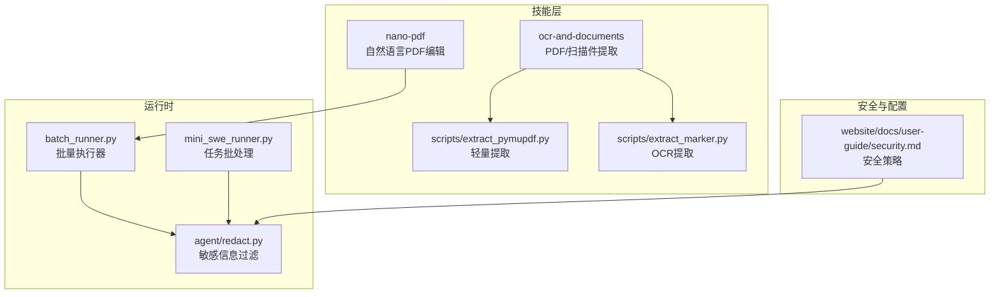
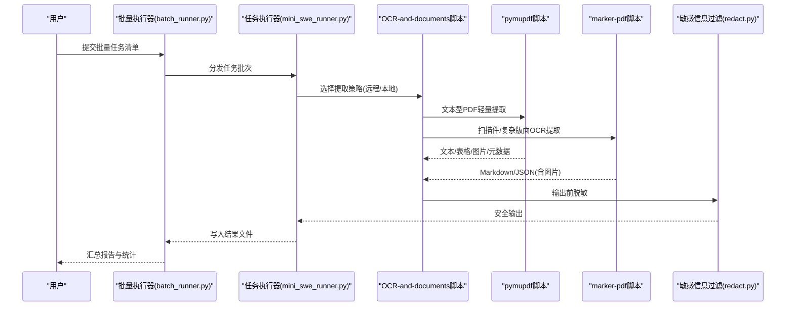
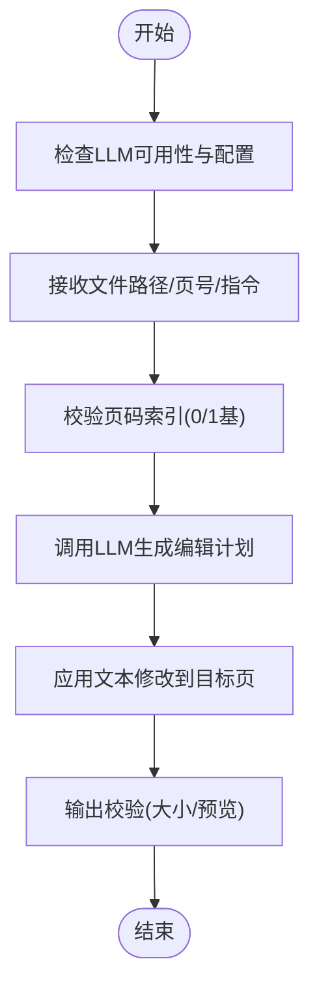
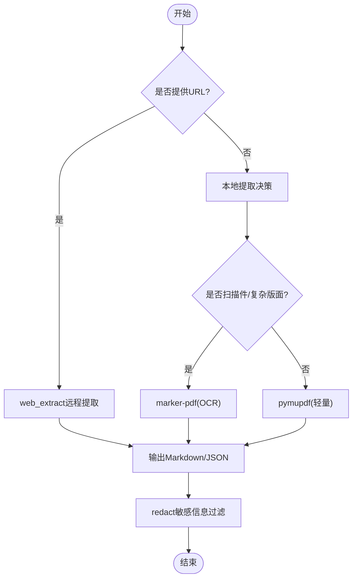
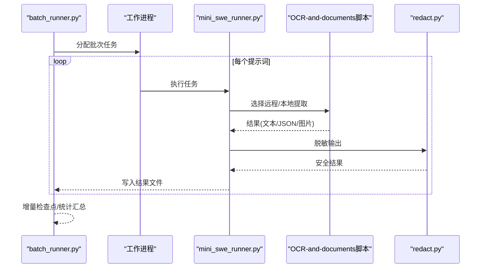
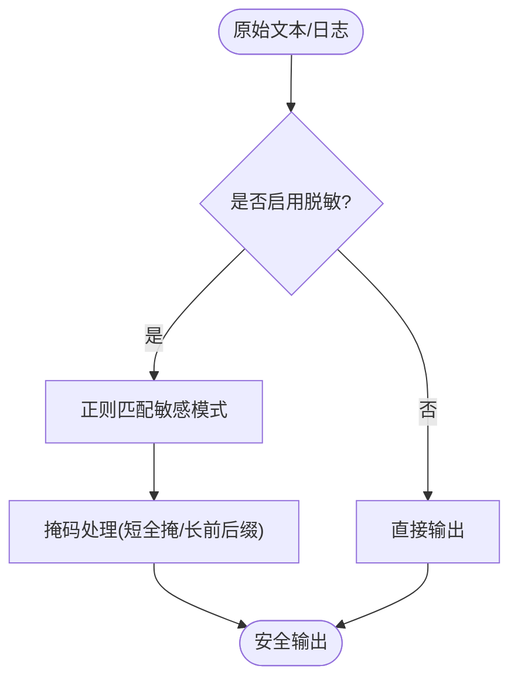
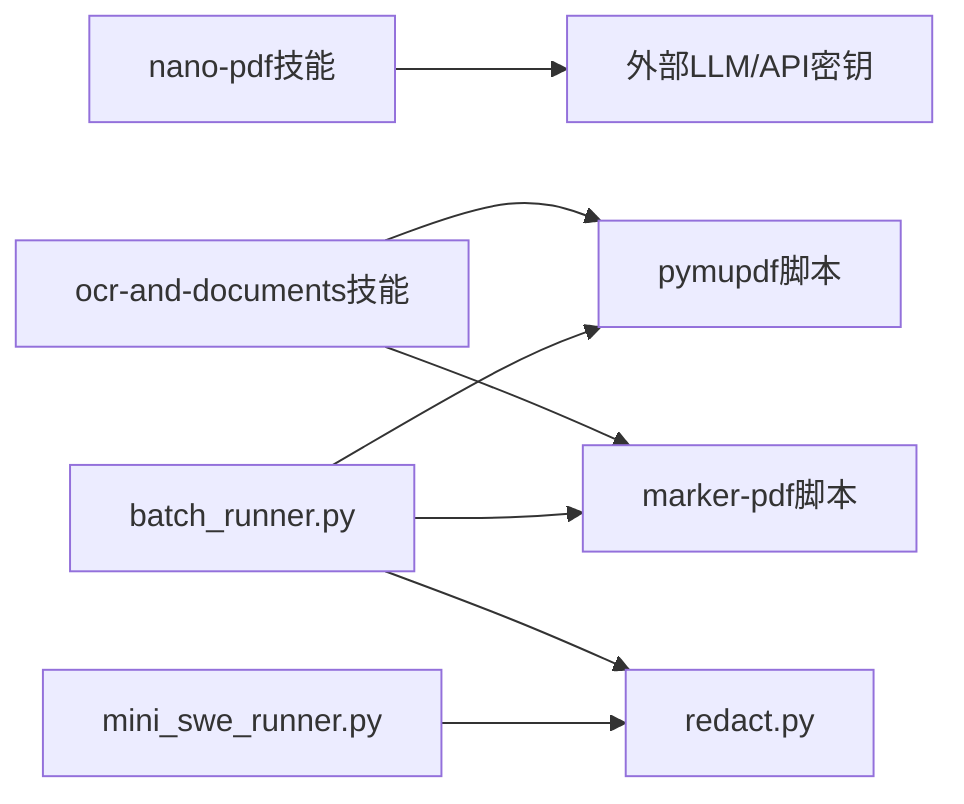

# 文档管理工具

<cite>
**本文引用的文件**
- [SKILL.md（nano-pdf）](file://skills/productivity/nano-pdf/SKILL.md)
- [SKILL.md（ocr-and-documents）](file://skills/productivity/ocr-and-documents/SKILL.md)
- [extract_pymupdf.py](file://skills/productivity/ocr-and-documents/scripts/extract_pymupdf.py)
- [extract_marker.py](file://skills/productivity/ocr-and-documents/scripts/extract_marker.py)
- [redact.py](file://agent/redact.py)
- [batch_runner.py](file://batch_runner.py)
- [mini_swe_runner.py](file://mini_swe_runner.py)
- [security.md](file://website/docs/user-guide/security.md)
</cite>

## 目录
1. [简介](#简介)
2. [项目结构](#项目结构)
3. [核心组件](#核心组件)
4. [架构总览](#架构总览)
5. [详细组件分析](#详细组件分析)
6. [依赖关系分析](#依赖关系分析)
7. [性能考量](#性能考量)
8. [故障排查指南](#故障排查指南)
9. [结论](#结论)
10. [附录](#附录)

## 简介
本文件面向Hermes Agent的文档管理工具，聚焦两类关键能力：PDF处理与OCR文档识别。其中：
- nano-pdf技能：通过自然语言指令对PDF进行编辑（如修改文本、修复错别字、更新标题等），适合快速内容变更场景。
- OCR-and-documents技能：提供PDF与扫描件的文本提取、表格抽取、图片导出、元数据读取、ArXiv论文抓取、分页拆分合并与全文检索等能力；在本地可选轻量级pymupdf或高精度marker-pdf（含OCR）两种路径。

此外，文档还涵盖批量处理、批量OCR识别、自动化文档工作流、文档安全处理与敏感信息过滤、批量文件管理最佳实践等内容，帮助用户构建稳定高效的文档处理流水线。

## 项目结构
围绕文档管理的核心目录与文件如下：
- 技能层（skills/productivity）
  - nano-pdf：自然语言驱动的PDF编辑技能说明与使用示例
  - ocr-and-documents：PDF/扫描件提取、ArXiv抓取、分页拆分合并与全文检索说明
  - scripts：本地提取辅助脚本（pymupdf与marker-pdf）
- 安全与输出净化（agent/redact.py）
- 批处理框架（batch_runner.py、mini_swe_runner.py）
- 安全配置参考（website/docs/user-guide/security.md）

**图表来源**
- [SKILL.md（nano-pdf）:1-52](file://skills/productivity/nano-pdf/SKILL.md#L1-L52)
- [SKILL.md（ocr-and-documents）:1-172](file://skills/productivity/ocr-and-documents/SKILL.md#L1-L172)
- [extract_pymupdf.py:1-99](file://skills/productivity/ocr-and-documents/scripts/extract_pymupdf.py#L1-L99)
- [extract_marker.py:1-88](file://skills/productivity/ocr-and-documents/scripts/extract_marker.py#L1-L88)
- [batch_runner.py:1-200](file://batch_runner.py#L1-L200)
- [mini_swe_runner.py:568-602](file://mini_swe_runner.py#L568-L602)
- [redact.py:1-182](file://agent/redact.py#L1-L182)
- [security.md:398-418](file://website/docs/user-guide/security.md#L398-L418)

**章节来源**
- [SKILL.md（nano-pdf）:1-52](file://skills/productivity/nano-pdf/SKILL.md#L1-L52)
- [SKILL.md（ocr-and-documents）:1-172](file://skills/productivity/ocr-and-documents/SKILL.md#L1-L172)
- [extract_pymupdf.py:1-99](file://skills/productivity/ocr-and-documents/scripts/extract_pymupdf.py#L1-L99)
- [extract_marker.py:1-88](file://skills/productivity/ocr-and-documents/scripts/extract_marker.py#L1-L88)
- [batch_runner.py:1-200](file://batch_runner.py#L1-L200)
- [mini_swe_runner.py:568-602](file://mini_swe_runner.py#L568-L602)
- [redact.py:1-182](file://agent/redact.py#L1-L182)
- [security.md:398-418](file://website/docs/user-guide/security.md#L398-L418)

## 核心组件
- nano-pdf技能
  - 通过自然语言描述对指定页面进行文本修改，适合快速更正标题、日期、名称等。
  - 需要外部LLM支持与API密钥配置；注意页码可能因版本差异采用0/1基索引，需验证输出。
- OCR-and-documents技能
  - 远程优先：若文档有URL，优先使用web_extract；否则选择本地提取方案。
  - 本地提取双通道：
    - 轻量级：pymupdf（无需模型，安装约25MB），适用于文本型PDF，支持Markdown、表格、图片、元数据、分页与合并、全文检索。
    - 高质量：marker-pdf（首次安装约3-5GB磁盘空间，含PyTorch与模型），支持OCR、多格式、复杂布局、公式、代码块、表单、页眉页脚清理、阅读顺序检测、图像提取与OCR。
  - 提供独立脚本用于命令行批量处理与结构化输出（JSON/Markdown）。
- 批处理框架
  - batch_runner.py：支持并行批处理、断点续跑、轨迹保存、工具统计聚合。
  - mini_swe_runner.py：面向任务的批量执行与结果落盘。
- 敏感信息过滤
  - agent/redact.py：基于正则的令牌、密钥、数据库连接串、电话号码等敏感信息脱敏，贯穿日志与输出。
- 安全策略
  - website/docs/user-guide/security.md：环境变量过滤、容器沙箱限制、MCP凭证处理等安全建议。

**章节来源**
- [SKILL.md（nano-pdf）:15-52](file://skills/productivity/nano-pdf/SKILL.md#L15-L52)
- [SKILL.md（ocr-and-documents）:19-172](file://skills/productivity/ocr-and-documents/SKILL.md#L19-L172)
- [extract_pymupdf.py:1-99](file://skills/productivity/ocr-and-documents/scripts/extract_pymupdf.py#L1-L99)
- [extract_marker.py:1-88](file://skills/productivity/ocr-and-documents/scripts/extract_marker.py#L1-L88)
- [batch_runner.py:792-925](file://batch_runner.py#L792-L925)
- [mini_swe_runner.py:568-602](file://mini_swe_runner.py#L568-L602)
- [redact.py:113-171](file://agent/redact.py#L113-L171)
- [security.md:398-418](file://website/docs/user-guide/security.md#L398-L418)

## 架构总览
下图展示从用户输入到文档处理与输出的端到端流程，包括远程提取、本地轻量/OCR提取、批量处理与安全过滤：

**图表来源**
- [batch_runner.py:792-925](file://batch_runner.py#L792-L925)
- [mini_swe_runner.py:568-602](file://mini_swe_runner.py#L568-L602)
- [SKILL.md（ocr-and-documents）:19-172](file://skills/productivity/ocr-and-documents/SKILL.md#L19-L172)
- [extract_pymupdf.py:1-99](file://skills/productivity/ocr-and-documents/scripts/extract_pymupdf.py#L1-L99)
- [extract_marker.py:1-88](file://skills/productivity/ocr-and-documents/scripts/extract_marker.py#L1-L88)
- [redact.py:113-171](file://agent/redact.py#L113-L171)

## 详细组件分析

### 组件A：nano-pdf（自然语言PDF编辑）
- 功能概述
  - 使用自然语言指令对PDF特定页面进行文本修改，如更正标题、日期、公司名等。
  - 依赖外部LLM与API密钥；注意页码索引差异，必要时±1重试。
- 典型用法
  - 命令行入口：edit子命令，参数为文件、页号与自然语言指令。
  - 建议在修改后校验输出（如检查文件大小或打开预览）。
- 适用场景
  - 快速内容修正、模板微调、批量小范围文案更新。

**图表来源**
- [SKILL.md（nano-pdf）:15-52](file://skills/productivity/nano-pdf/SKILL.md#L15-L52)

**章节来源**
- [SKILL.md（nano-pdf）:15-52](file://skills/productivity/nano-pdf/SKILL.md#L15-L52)

### 组件B：OCR-and-documents（PDF/扫描件提取）
- 远程优先策略
  - 若文档具备URL，优先使用web_extract；仅当失败或需要批量处理时走本地提取。
- 本地提取对比
  - pymupdf（轻量）：无需模型，安装约25MB，支持文本型PDF的文本、表格、图片、元数据、Markdown导出、分页拆分/合并、全文检索。
  - marker-pdf（OCR）：首次安装约3-5GB磁盘空间，支持OCR、多格式、复杂布局、公式、代码块、表单、页眉页脚清理、阅读顺序检测、图像提取与OCR，速度受CPU/GPU影响。
- 辅助脚本能力
  - extract_pymupdf.py：支持纯文本、Markdown、表格、图片导出、元数据、指定页范围。
  - extract_marker.py：支持Markdown/JSON输出、结构化元数据、图片导出、LLM增强精度、磁盘空间检查。
- ArXiv论文处理
  - 支持摘要与全文抓取，结合web_search进行检索。

**图表来源**
- [SKILL.md（ocr-and-documents）:19-172](file://skills/productivity/ocr-and-documents/SKILL.md#L19-L172)
- [extract_pymupdf.py:1-99](file://skills/productivity/ocr-and-documents/scripts/extract_pymupdf.py#L1-L99)
- [extract_marker.py:1-88](file://skills/productivity/ocr-and-documents/scripts/extract_marker.py#L1-L88)
- [redact.py:113-171](file://agent/redact.py#L113-L171)

**章节来源**
- [SKILL.md（ocr-and-documents）:19-172](file://skills/productivity/ocr-and-documents/SKILL.md#L19-L172)
- [extract_pymupdf.py:1-99](file://skills/productivity/ocr-and-documents/scripts/extract_pymupdf.py#L1-L99)
- [extract_marker.py:1-88](file://skills/productivity/ocr-and-documents/scripts/extract_marker.py#L1-L88)
- [redact.py:113-171](file://agent/redact.py#L113-L171)

### 组件C：批量处理与自动化工作流
- 批量执行器（batch_runner.py）
  - 并行处理、断点续跑、轨迹保存、工具统计聚合、进度可视化。
  - 支持按提示词集运行、多进程池、增量检查点写入。
- 任务执行器（mini_swe_runner.py）
  - 将任务逐一执行并落盘，异常时记录错误与时间戳，便于后续重试。
- 自动化工作流建议
  - 将“远程提取→本地OCR→脱敏→归档”封装为流水线步骤，结合断点续跑提升鲁棒性。

**图表来源**
- [batch_runner.py:792-925](file://batch_runner.py#L792-L925)
- [mini_swe_runner.py:568-602](file://mini_swe_runner.py#L568-L602)
- [SKILL.md（ocr-and-documents）:19-172](file://skills/productivity/ocr-and-documents/SKILL.md#L19-L172)
- [redact.py:113-171](file://agent/redact.py#L113-L171)

**章节来源**
- [batch_runner.py:792-925](file://batch_runner.py#L792-L925)
- [mini_swe_runner.py:568-602](file://mini_swe_runner.py#L568-L602)

### 组件D：文档安全处理与敏感信息过滤
- agent/redact.py
  - 基于正则匹配的令牌、密钥、数据库连接串、私钥块、授权头、Telegram令牌、电话号码等敏感信息脱敏。
  - 对短令牌全掩码，长令牌保留前后缀以利调试。
  - 可通过环境变量控制是否启用脱敏。
- 安全策略参考
  - 环境变量过滤、容器沙箱限制、MCP凭证处理等，避免凭据泄露。

**图表来源**
- [redact.py:113-171](file://agent/redact.py#L113-L171)
- [security.md:398-418](file://website/docs/user-guide/security.md#L398-L418)

**章节来源**
- [redact.py:113-171](file://agent/redact.py#L113-L171)
- [security.md:398-418](file://website/docs/user-guide/security.md#L398-L418)

## 依赖关系分析
- 技能与脚本
  - ocr-and-documents技能依赖extract_pymupdf.py与extract_marker.py；前者无模型、后者含OCR与大体积模型。
  - nano-pdf技能依赖外部LLM与API密钥。
- 批处理与安全
  - 批处理框架在执行过程中调用脚本并进行脱敏输出，确保日志与结果不泄露敏感信息。
- 外部依赖
  - pymupdf：轻量、安装快、功能覆盖文本型PDF。
  - marker-pdf：首次安装较大，但支持OCR与复杂版面，适合扫描件与学术论文。

**图表来源**
- [SKILL.md（nano-pdf）:15-52](file://skills/productivity/nano-pdf/SKILL.md#L15-L52)
- [SKILL.md（ocr-and-documents）:19-172](file://skills/productivity/ocr-and-documents/SKILL.md#L19-L172)
- [extract_pymupdf.py:1-99](file://skills/productivity/ocr-and-documents/scripts/extract_pymupdf.py#L1-L99)
- [extract_marker.py:1-88](file://skills/productivity/ocr-and-documents/scripts/extract_marker.py#L1-L88)
- [batch_runner.py:792-925](file://batch_runner.py#L792-L925)
- [mini_swe_runner.py:568-602](file://mini_swe_runner.py#L568-L602)
- [redact.py:113-171](file://agent/redact.py#L113-L171)

**章节来源**
- [SKILL.md（nano-pdf）:15-52](file://skills/productivity/nano-pdf/SKILL.md#L15-L52)
- [SKILL.md（ocr-and-documents）:19-172](file://skills/productivity/ocr-and-documents/SKILL.md#L19-L172)
- [extract_pymupdf.py:1-99](file://skills/productivity/ocr-and-documents/scripts/extract_pymupdf.py#L1-L99)
- [extract_marker.py:1-88](file://skills/productivity/ocr-and-documents/scripts/extract_marker.py#L1-L88)
- [batch_runner.py:792-925](file://batch_runner.py#L792-L925)
- [mini_swe_runner.py:568-602](file://mini_swe_runner.py#L568-L602)
- [redact.py:113-171](file://agent/redact.py#L113-L171)

## 性能考量
- pymupdf
  - 安装体积小、无模型依赖、即时响应，适合大规模文本型PDF处理与基础功能（分页、合并、检索）。
- marker-pdf
  - 首次安装占用较大磁盘空间，但支持OCR与复杂版面；CPU速度约1-14秒/页，GPU可达0.2秒/页；适合扫描件、学术论文与高精度需求场景。
- 批处理优化
  - 使用并行进程池、增量检查点、进度可视化，减少重复计算与中断损失。
- 输出与存储
  - 建议将图片与JSON结构化输出分离存储，便于后续二次处理与审计。

[本节为通用性能讨论，不直接分析具体文件]

## 故障排查指南
- nano-pdf
  - 页码索引偏差：根据版本调整±1；修改后务必校验输出。
  - LLM配置：确认API密钥与模型可用性。
- OCR-and-documents
  - marker-pdf磁盘不足：首次安装需约3-5GB空闲空间；可通过脚本检查磁盘容量。
  - 权限与依赖：确保Python环境与所需包已正确安装。
- 批处理
  - 断点续跑：利用已完成提示词内容匹配跳过重复任务，提高效率。
  - 异常处理：mini_swe_runner在任务失败时记录错误与时间戳，便于定位问题。
- 安全
  - 启用redact敏感信息过滤，避免凭据外泄；遵循安全策略中的环境变量与容器限制建议。

**章节来源**
- [SKILL.md（nano-pdf）:46-52](file://skills/productivity/nano-pdf/SKILL.md#L46-L52)
- [SKILL.md（ocr-and-documents）:53-55](file://skills/productivity/ocr-and-documents/SKILL.md#L53-L55)
- [batch_runner.py:792-925](file://batch_runner.py#L792-L925)
- [mini_swe_runner.py:568-602](file://mini_swe_runner.py#L568-L602)
- [redact.py:113-171](file://agent/redact.py#L113-L171)
- [security.md:398-418](file://website/docs/user-guide/security.md#L398-L418)

## 结论
Hermes Agent的文档管理工具以“远程优先、本地分层”的策略覆盖了从文本型PDF到扫描件OCR的广泛场景。nano-pdf满足快速内容编辑，OCR-and-documents提供从文本提取到结构化输出的完整链路，并辅以批量处理与安全过滤能力。通过合理选择提取引擎、启用断点续跑与脱敏机制，可在保证安全性的同时实现高效、稳定的文档处理工作流。

[本节为总结性内容，不直接分析具体文件]

## 附录
- 使用建议
  - 文档扫描与复杂版面：优先marker-pdf；文本型PDF：pymupdf即可。
  - 批量OCR：结合batch_runner与extract_marker.py的批量模式，合理分配资源与并发度。
  - 安全：始终启用redact并遵循安全策略，避免凭据与敏感信息泄露。
  - 文件管理：按类型（文本、JSON、图片）分类存储，建立命名规范与版本控制。

[本节为通用建议，不直接分析具体文件]