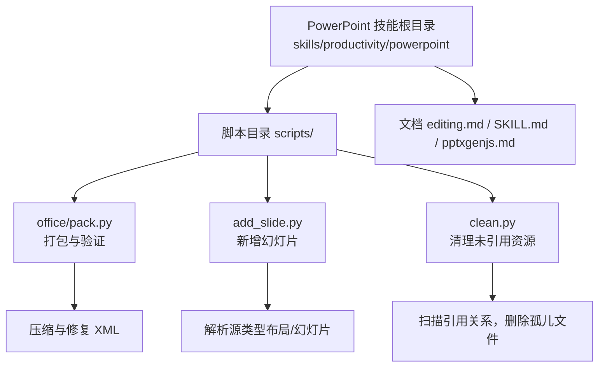
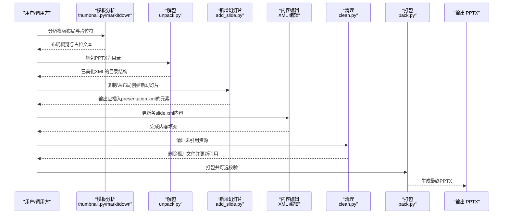
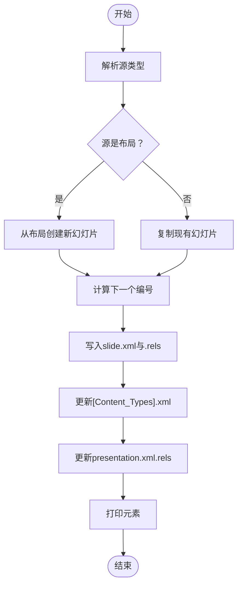
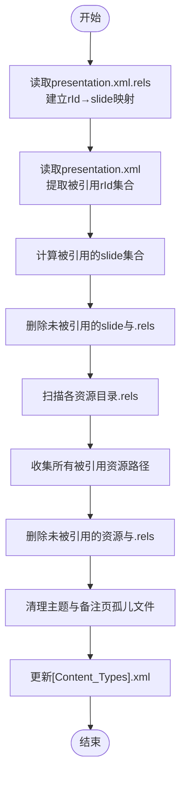
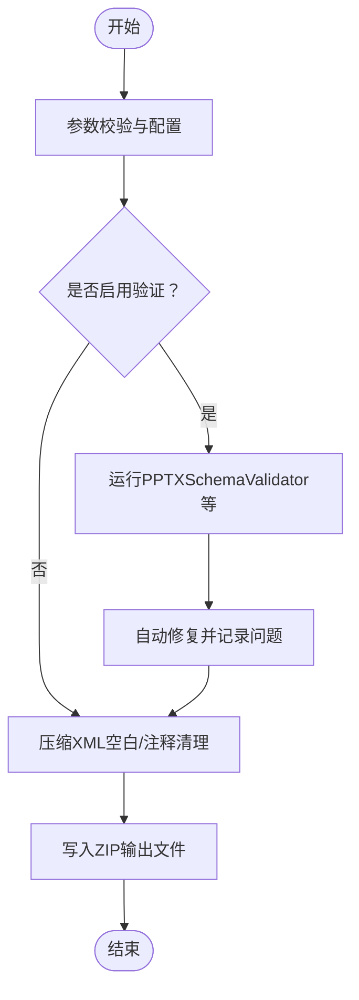
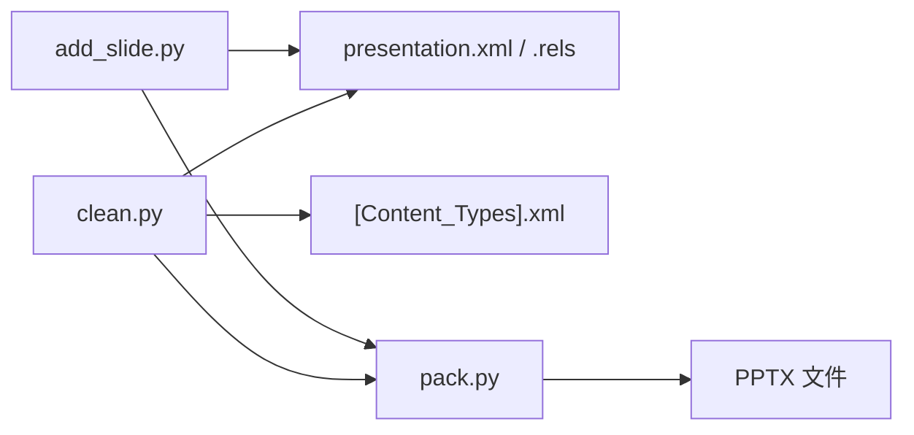

# 演示文稿工具

<cite>
**本文引用的文件**
- [SKILL.md](file://skills/productivity/powerpoint/SKILL.md)
- [editing.md](file://skills/productivity/powerpoint/editing.md)
- [pptxgenjs.md](file://skills/productivity/powerpoint/pptxgenjs.md)
- [add_slide.py](file://skills/productivity/powerpoint/scripts/add_slide.py)
- [clean.py](file://skills/productivity/powerpoint/scripts/clean.py)
- [pack.py](file://skills/productivity/powerpoint/scripts/office/pack.py)
</cite>

## 目录
1. [简介](#简介)
2. [项目结构](#项目结构)
3. [核心组件](#核心组件)
4. [架构总览](#架构总览)
5. [详细组件分析](#详细组件分析)
6. [依赖关系分析](#依赖关系分析)
7. [性能考量](#性能考量)
8. [故障排查指南](#故障排查指南)
9. [结论](#结论)
10. [附录](#附录)

## 简介
本文件面向Hermes Agent中的PowerPoint技能，系统化梳理演示文稿的创建、编辑与管理能力，重点覆盖以下方面：
- 幻灯片添加机制：add_slide.py如何基于已解包PPTX目录新增幻灯片（复制现有幻灯片或从布局创建）
- 内容清理机制：clean.py如何移除未被引用的资源，确保输出文件精简、合规
- 底层实现参考：pptxgenjs.md对PptxGenJS的用法与注意事项进行说明，便于从零创建演示文稿
- 模板管理与工作流：基于模板的编辑流程（解包→构建→内容编辑→清理→打包），以及PPT模板管理、内容自动填充、样式统一与批量生成
- 自动化与协作：演示文稿自动化制作、数据可视化集成、团队协作实践
- 质量保障：PPT质量检查、格式兼容性与性能优化建议

## 项目结构
PowerPoint技能位于skills/productivity/powerpoint目录，围绕“模板驱动编辑 + 从零创建”的两条主线展开：
- 模板驱动编辑：通过解包现有PPTX，按需增删改幻灯片顺序，再清理并重新打包
- 从零创建：借助PptxGenJS生成PPT，适合无模板场景

图表来源
- [SKILL.md:1-233](file://skills/productivity/powerpoint/SKILL.md#L1-L233)
- [editing.md:1-206](file://skills/productivity/powerpoint/editing.md#L1-L206)
- [add_slide.py:1-196](file://skills/productivity/powerpoint/scripts/add_slide.py#L1-L196)
- [clean.py:1-287](file://skills/productivity/powerpoint/scripts/clean.py#L1-L287)
- [pack.py:1-160](file://skills/productivity/powerpoint/scripts/office/pack.py#L1-L160)

章节来源
- [SKILL.md:1-233](file://skills/productivity/powerpoint/SKILL.md#L1-L233)
- [editing.md:1-206](file://skills/productivity/powerpoint/editing.md#L1-L206)

## 核心组件
- add_slide.py：在已解包的PPTX目录中新增幻灯片，支持从布局创建或复制现有幻灯片；负责更新关系文件与内容类型声明，并输出需要插入到presentation.xml中的元素信息
- clean.py：扫描并移除未被引用的幻灯片、媒体、图表、主题、备注页等资源，同时维护[Content_Types].xml与各.rels文件的一致性
- pack.py：将解包后的目录重新打包为PPTX，执行XML压缩、模式校验与自动修复
- 文档与指南：SKILL.md提供总体任务指引、设计建议与QA流程；editing.md给出模板驱动工作流与常见坑位；pptxgenjs.md提供从零创建的参考

章节来源
- [add_slide.py:1-196](file://skills/productivity/powerpoint/scripts/add_slide.py#L1-L196)
- [clean.py:1-287](file://skills/productivity/powerpoint/scripts/clean.py#L1-L287)
- [pack.py:1-160](file://skills/productivity/powerpoint/scripts/office/pack.py#L1-L160)
- [SKILL.md:1-233](file://skills/productivity/powerpoint/SKILL.md#L1-L233)
- [editing.md:1-206](file://skills/productivity/powerpoint/editing.md#L1-L206)
- [pptxgenjs.md:1-421](file://skills/productivity/powerpoint/pptxgenjs.md#L1-L421)

## 架构总览
下图展示模板驱动工作流的关键步骤与组件交互：

图表来源
- [editing.md:1-206](file://skills/productivity/powerpoint/editing.md#L1-L206)
- [add_slide.py:1-196](file://skills/productivity/powerpoint/scripts/add_slide.py#L1-L196)
- [clean.py:1-287](file://skills/productivity/powerpoint/scripts/clean.py#L1-L287)
- [pack.py:1-160](file://skills/productivity/powerpoint/scripts/office/pack.py#L1-L160)

## 详细组件分析

### 组件A：add_slide.py（幻灯片添加机制）
- 功能要点
  - 支持两种源：现有幻灯片文件（复制）与布局文件（从布局创建）
  - 自动计算下一个幻灯片编号与关系ID，写入对应XML与.rels文件
  - 更新[Content_Types].xml与presentation.xml.rels，保证引用一致
  - 输出可在presentation.xml的<p:sldId>片段，便于插入到正确位置
- 关键流程
  - 解析源类型（布局/幻灯片）
  - 计算下一个slide编号与rId
  - 写入slide.xml与.rels
  - 更新内容类型与关系文件
  - 打印需要插入到presentation.xml的元素

图表来源
- [add_slide.py:1-196](file://skills/productivity/powerpoint/scripts/add_slide.py#L1-L196)

章节来源
- [add_slide.py:1-196](file://skills/productivity/powerpoint/scripts/add_slide.py#L1-L196)

### 组件B：clean.py（内容清理与一致性维护）
- 功能要点
  - 识别presentation.xml中被引用的幻灯片集合
  - 删除未被引用的幻灯片及其.rels
  - 清理[trash]目录与孤儿.rels
  - 扫描媒体、嵌入、图表、图表、绘图、墨迹等资源，移除未被引用项
  - 清理主题与备注页相关孤儿文件
  - 更新[Content_Types].xml中对已删除文件的Override条目
- 关键流程
  - 从presentation.xml.rels建立rId到slide文件名的映射
  - 从presentation.xml提取被引用的rId，反查得到被引用的slide集合
  - 遍历slides/_rels，收集所有被引用的资源路径
  - 逐类删除未被引用的资源与.rels
  - 循环直到不再有孤儿文件产生
  - 更新[Content_Types].xml

图表来源
- [clean.py:1-287](file://skills/productivity/powerpoint/scripts/clean.py#L1-L287)

章节来源
- [clean.py:1-287](file://skills/productivity/powerpoint/scripts/clean.py#L1-L287)

### 组件C：pack.py（打包与验证）
- 功能要点
  - 将解包目录重新打包为PPTX
  - 对XML进行压缩（去除空白与注释），提升文件体积与加载性能
  - 可选地与原始文件对比进行模式校验与自动修复
- 关键流程
  - 参数校验（输入目录、输出后缀）
  - 可选验证：针对PPTX运行PPTXSchemaValidator
  - 临时拷贝解包目录，遍历XML进行压缩
  - 使用zip压缩输出文件

图表来源
- [pack.py:1-160](file://skills/productivity/powerpoint/scripts/office/pack.py#L1-L160)

章节来源
- [pack.py:1-160](file://skills/productivity/powerpoint/scripts/office/pack.py#L1-L160)

### 组件D：模板管理与工作流（SKILL.md / editing.md）
- 模板驱动工作流
  - 分析模板：缩略图与文本抽取，识别布局与占位符
  - 规划映射：为每个内容段落选择合适布局，避免单调重复
  - 解包：将PPTX解包为目录，便于编辑
  - 构建：删除不需要的幻灯片、复制复用的幻灯片、调整顺序
  - 内容编辑：逐个slide.xml替换占位内容，遵循格式规则与常见陷阱
  - 清理：运行clean.py移除孤儿文件
  - 打包：使用pack.py生成最终PPTX
- 设计与排版建议
  - 颜色搭配、字体组合、字号层级、间距与留白
  - 避免纯文字幻灯片，每页至少一个视觉元素
  - 常见错误与规避策略（如不要使用accent line装饰标题）

章节来源
- [SKILL.md:1-233](file://skills/productivity/powerpoint/SKILL.md#L1-L233)
- [editing.md:1-206](file://skills/productivity/powerpoint/editing.md#L1-L206)

### 组件E：从零创建（pptxgenjs.md）
- 适用场景：无模板或参考演示文稿时，直接使用PptxGenJS生成PPT
- 关键能力参考
  - 布局尺寸与坐标系统（英寸）
  - 文本与富文本、多行文本、字符间距
  - 形状、阴影、透明度、圆角矩形
  - 图片与SVG图标处理（含从React图标生成PNG）
  - 表格与多种图表（柱状、折线、饼图等）
  - 常见陷阱与注意事项（颜色前缀、阴影属性、对象复用等）
- 实践建议
  - 保持选项对象新鲜实例，避免跨调用共享导致内部状态污染
  - 使用合适的图片尺寸与缩放模式以保持清晰度
  - 合理设置阴影与透明度，避免文件损坏

章节来源
- [pptxgenjs.md:1-421](file://skills/productivity/powerpoint/pptxgenjs.md#L1-L421)

## 依赖关系分析
- 组件耦合
  - add_slide.py与clean.py均依赖presentation.xml与.rels的关系结构，二者在“关系ID分配与引用一致性”上存在间接耦合
  - pack.py对XML压缩与校验，与clean.py的清理结果共同影响最终文件体积与兼容性
- 外部依赖
  - PptxGenJS（npm）用于从零创建PPT
  - Python第三方库：defusedxml（安全解析XML）、markitdown（PPTX文本抽取）、Pillow（缩略图）、LibreOffice与Poppler（PDF转换与图像导出）

图表来源
- [add_slide.py:1-196](file://skills/productivity/powerpoint/scripts/add_slide.py#L1-L196)
- [clean.py:1-287](file://skills/productivity/powerpoint/scripts/clean.py#L1-L287)
- [pack.py:1-160](file://skills/productivity/powerpoint/scripts/office/pack.py#L1-L160)

章节来源
- [add_slide.py:1-196](file://skills/productivity/powerpoint/scripts/add_slide.py#L1-L196)
- [clean.py:1-287](file://skills/productivity/powerpoint/scripts/clean.py#L1-L287)
- [pack.py:1-160](file://skills/productivity/powerpoint/scripts/office/pack.py#L1-L160)

## 性能考量
- 文件体积与加载速度
  - 使用pack.py压缩XML（去除空白与注释），减少PPTX体积
  - 清理未引用资源（clean.py），避免冗余媒体与图表文件拖慢打开速度
- 渲染与显示
  - 控制图片分辨率与缩放模式，避免超大资源
  - 合理使用阴影与透明度，避免复杂滤镜导致渲染开销增加
- 批量生成
  - 在模板驱动工作流中，优先完成结构性变更（增删改顺序），再进行内容填充，减少重复打包与校验成本

## 故障排查指南
- 常见问题与定位
  - 幻灯片未显示或顺序异常：检查presentation.xml中<p:sldId>列表与rId映射是否与实际slide文件一致
  - 图片/图表不显示：确认资源路径存在于引用集合中，且未被clean.py误删
  - 文件损坏或无法打开：检查是否复用同一选项对象、颜色字符串是否带#前缀、阴影角度与偏移是否为正值
- 质量检查清单
  - 内容QA：使用markitdown抽取文本，检查占位符残留与错别字
  - 视觉QA：将PPT转为PDF再转图像，人工审阅重叠、溢出、间距不均、低对比度等问题
  - 验证循环：生成→图像化→审阅→修复→再验证，直至无新增问题
- 工具链提示
  - 模板分析：thumbnail.py生成缩略图网格，快速识别布局差异
  - 文本抽取：markitdown用于结构化提取与比对
  - 打包校验：pack.py可选开启验证，自动修复并报告问题

章节来源
- [SKILL.md:141-233](file://skills/productivity/powerpoint/SKILL.md#L141-L233)
- [editing.md:138-206](file://skills/productivity/powerpoint/editing.md#L138-L206)
- [pack.py:69-106](file://skills/productivity/powerpoint/scripts/office/pack.py#L69-L106)

## 结论
该PowerPoint技能以“模板驱动编辑 + 从零创建”为核心，辅以完善的清理与打包流程，形成一套可复用、可扩展的演示文稿自动化方案。通过规范的模板管理、内容填充与样式统一，结合严格的质量检查与性能优化实践，能够高效产出高质量的演示文稿，并支持团队协作与批量生成。

## 附录
- 使用案例建议
  - 自动化制作：将内容源（如数据库报表、API返回值）映射到模板布局，批量生成多版本演示文稿
  - 数据可视化集成：在模板中预留图表区域，使用PptxGenJS动态生成柱状/折线/饼图并嵌入PPT
  - 团队协作：采用子代理并行编辑不同slide.xml，统一格式规则与占位符替换策略，最后集中清理与打包
- 最佳实践
  - 先结构后内容：先完成幻灯片增删改与排序，再进行内容填充
  - 严控引用一致性：add_slide.py与clean.py依赖关系文件，务必保持其完整性
  - 重视QA：内容与视觉双轨检查，必要时引入子代理进行“新鲜视角”审阅