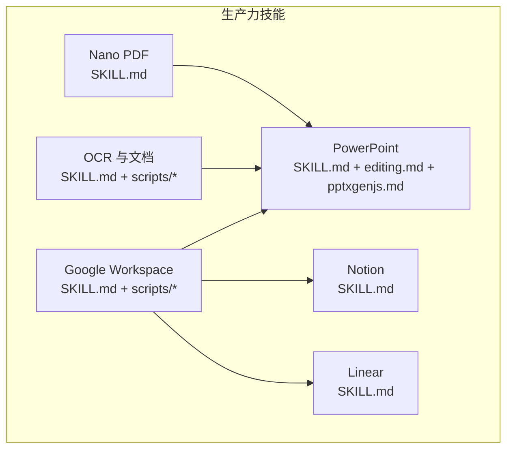
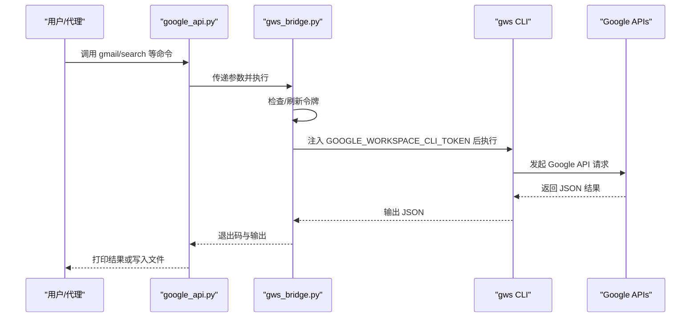
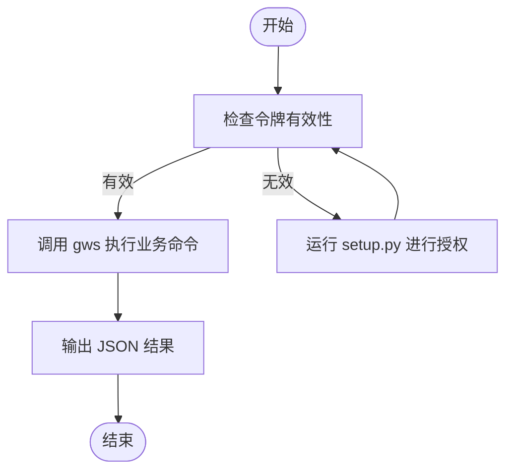
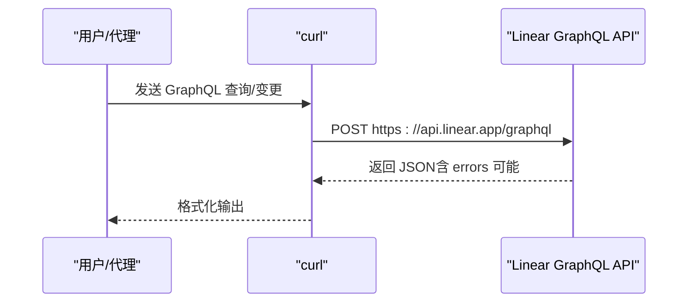
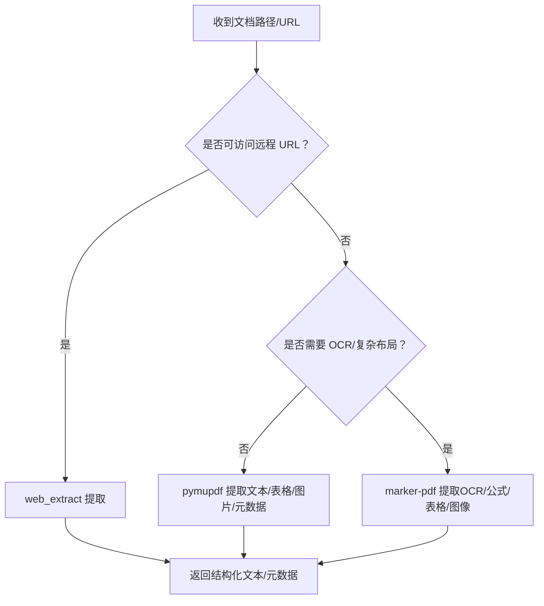
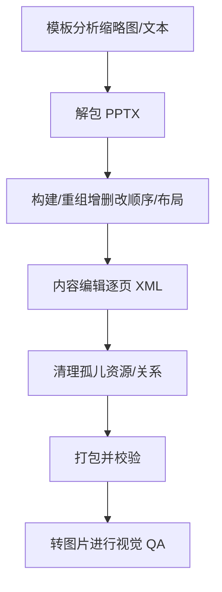
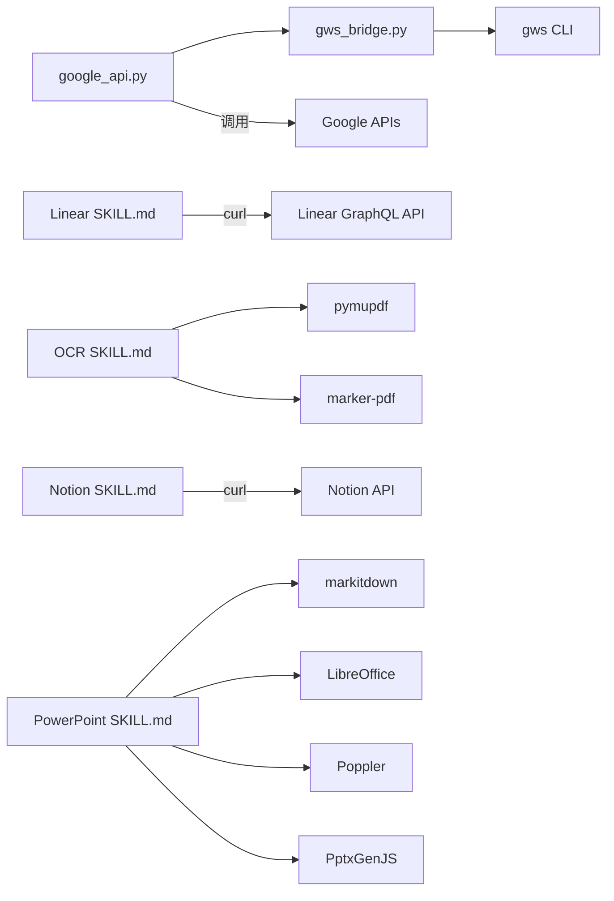

# 生产力工具

<cite>
**本文引用的文件**
- [skills/productivity/DESCRIPTION.md](file://skills/productivity/DESCRIPTION.md)
- [skills/productivity/google-workspace/SKILL.md](file://skills/productivity/google-workspace/SKILL.md)
- [skills/productivity/google-workspace/scripts/setup.py](file://skills/productivity/google-workspace/scripts/setup.py)
- [skills/productivity/google-workspace/scripts/gws_bridge.py](file://skills/productivity/google-workspace/scripts/gws_bridge.py)
- [skills/productivity/google-workspace/scripts/google_api.py](file://skills/productivity/google-workspace/scripts/google_api.py)
- [skills/productivity/linear/SKILL.md](file://skills/productivity/linear/SKILL.md)
- [skills/productivity/nano-pdf/SKILL.md](file://skills/productivity/nano-pdf/SKILL.md)
- [skills/productivity/notion/SKILL.md](file://skills/productivity/notion/SKILL.md)
- [skills/productivity/ocr-and-documents/SKILL.md](file://skills/productivity/ocr-and-documents/SKILL.md)
- [skills/productivity/ocr-and-documents/scripts/extract_pymupdf.py](file://skills/productivity/ocr-and-documents/scripts/extract_pymupdf.py)
- [skills/productivity/ocr-and-documents/scripts/extract_marker.py](file://skills/productivity/ocr-and-documents/scripts/extract_marker.py)
- [skills/productivity/powerpoint/SKILL.md](file://skills/productivity/powerpoint/SKILL.md)
- [skills/productivity/powerpoint/editing.md](file://skills/productivity/powerpoint/editing.md)
- [skills/productivity/powerpoint/pptxgenjs.md](file://skills/productivity/powerpoint/pptxgenjs.md)
</cite>

## 目录
1. [简介](#简介)
2. [项目结构](#项目结构)
3. [核心组件](#核心组件)
4. [架构总览](#架构总览)
5. [详细组件分析](#详细组件分析)
6. [依赖关系分析](#依赖关系分析)
7. [性能考量](#性能考量)
8. [故障排查指南](#故障排查指南)
9. [结论](#结论)
10. [附录](#附录)

## 简介
本文件系统化梳理 Hermes Agent 的生产力工具技能，覆盖以下能力：  
- Google Workspace 集成（Gmail/日历/驱动/联系人/表格/文档）  
- Linear 项目管理（GraphQL API）  
- PDF 处理与文本提取（OCR 与非 OCR）  
- Notion 内容管理（数据库与页面）  
- OCR 文档识别与批量处理  
- PowerPoint 制作与模板编辑  

文档从架构、数据流、配置方法、协同机制、工作流案例、技巧与自动化设计等维度展开，帮助你以技能组合高效完成日常办公任务。

## 项目结构
生产力工具技能位于 skills/productivity 目录下，每个子技能独立封装，提供清晰的使用说明、前置条件与示例命令。关键文件如下：
- Google Workspace：SKILL.md + scripts/*（OAuth 设置、桥接令牌、API 包装）
- Linear：SKILL.md（GraphQL API 使用说明）
- Nano PDF：SKILL.md（自然语言编辑 PDF）
- Notion：SKILL.md（curl 调用 API）
- OCR 与文档：SKILL.md + scripts/*（pymupdf 与 marker-pdf）
- PowerPoint：SKILL.md + editing.md + pptxgenjs.md（读取/编辑/创建）

**图表来源**
- [skills/productivity/google-workspace/SKILL.md:1-249](file://skills/productivity/google-workspace/SKILL.md#L1-L249)
- [skills/productivity/linear/SKILL.md:1-298](file://skills/productivity/linear/SKILL.md#L1-L298)
- [skills/productivity/nano-pdf/SKILL.md:1-52](file://skills/productivity/nano-pdf/SKILL.md#L1-L52)
- [skills/productivity/notion/SKILL.md:1-172](file://skills/productivity/notion/SKILL.md#L1-L172)
- [skills/productivity/ocr-and-documents/SKILL.md:1-172](file://skills/productivity/ocr-and-documents/SKILL.md#L1-L172)
- [skills/productivity/powerpoint/SKILL.md:1-233](file://skills/productivity/powerpoint/SKILL.md#L1-L233)

**章节来源**
- [skills/productivity/DESCRIPTION.md:1-4](file://skills/productivity/DESCRIPTION.md#L1-L4)

## 核心组件
- Google Workspace 技能：通过 gws CLI 实现 Gmail/日历/驱动/联系人/表格/文档操作；使用 OAuth2 自动刷新令牌并通过桥接脚本注入到 gws。
- Linear 技能：基于 GraphQL API，无需 OAuth，仅需 API Key，支持查询与变更 Issue/项目/成员/标签等。
- OCR 与文档技能：提供远程提取（web_extract）与本地提取方案（pymupdf、marker-pdf），覆盖 PDF/DOCX/PPTX/EPUB 等。
- Notion 技能：curl 调用 Notion API，支持搜索、创建、更新页面与数据库项。
- Nano PDF 技能：以自然语言指令修改 PDF 文本，适合快速更正标题、日期、客户名等。
- PowerPoint 技能：支持读取/解析/提取、编辑/修改/更新、合并/拆分、模板与布局、注释与备注；提供从零创建的完整指南。

**章节来源**
- [skills/productivity/google-workspace/SKILL.md:1-249](file://skills/productivity/google-workspace/SKILL.md#L1-L249)
- [skills/productivity/linear/SKILL.md:1-298](file://skills/productivity/linear/SKILL.md#L1-L298)
- [skills/productivity/ocr-and-documents/SKILL.md:1-172](file://skills/productivity/ocr-and-documents/SKILL.md#L1-L172)
- [skills/productivity/notion/SKILL.md:1-172](file://skills/productivity/notion/SKILL.md#L1-L172)
- [skills/productivity/nano-pdf/SKILL.md:1-52](file://skills/productivity/nano-pdf/SKILL.md#L1-L52)
- [skills/productivity/powerpoint/SKILL.md:1-233](file://skills/productivity/powerpoint/SKILL.md#L1-L233)

## 架构总览
Google Workspace 技能的端到端调用链如下：

**图表来源**
- [skills/productivity/google-workspace/scripts/google_api.py:34-41](file://skills/productivity/google-workspace/scripts/google_api.py#L34-L41)
- [skills/productivity/google-workspace/scripts/gws_bridge.py:55-85](file://skills/productivity/google-workspace/scripts/gws_bridge.py#L55-L85)
- [skills/productivity/google-workspace/SKILL.md:23-33](file://skills/productivity/google-workspace/SKILL.md#L23-L33)

## 详细组件分析

### Google Workspace 技能
- 功能特性
  - 支持 Gmail 搜索/读取/发送/回复/标签管理；日历列表/创建/删除；驱动搜索；联系人列表；表格读取/更新/追加；文档读取。
  - 通过 gws CLI 提供统一后端，保持与旧版接口兼容。
- 配置与认证
  - OAuth2 客户端密钥与令牌存储于 Hermes HOME 目录；支持部分授权范围与自动刷新。
  - 提供 setup.py 全非交互式设置流程，适配 CLI/Telegram/Discord 等平台。
- 数据流
  - google_api.py 解析命令行 → gws_bridge.py 注入令牌 → gws CLI → Google API → 返回 JSON。
- 使用建议
  - 首次使用前运行 setup.py --check；注意时区与时限格式；避免高并发请求导致配额限制。
- 故障排查
  - 未认证：重新执行授权步骤；刷新失败：撤销并重做授权；gws 命令未找到：安装 gws；权限不足：在 Google Cloud Console 启用对应 API 并授予相应作用域。

**图表来源**
- [skills/productivity/google-workspace/scripts/setup.py:121-168](file://skills/productivity/google-workspace/scripts/setup.py#L121-L168)
- [skills/productivity/google-workspace/scripts/gws_bridge.py:55-85](file://skills/productivity/google-workspace/scripts/gws_bridge.py#L55-L85)
- [skills/productivity/google-workspace/scripts/google_api.py:34-41](file://skills/productivity/google-workspace/scripts/google_api.py#L34-L41)

**章节来源**
- [skills/productivity/google-workspace/SKILL.md:1-249](file://skills/productivity/google-workspace/SKILL.md#L1-L249)
- [skills/productivity/google-workspace/scripts/setup.py:1-398](file://skills/productivity/google-workspace/scripts/setup.py#L1-L398)
- [skills/productivity/google-workspace/scripts/gws_bridge.py:1-90](file://skills/productivity/google-workspace/scripts/gws_bridge.py#L1-L90)
- [skills/productivity/google-workspace/scripts/google_api.py:1-328](file://skills/productivity/google-workspace/scripts/google_api.py#L1-L328)

### Linear 技能
- 功能特性
  - 基于 GraphQL API，无需 OAuth；支持查询团队/状态/问题/项目/成员/标签；支持创建/更新/指派/加评论/设截止日期/加标签/加入项目等。
  - 分页采用 Relay 风格游标分页；复杂度与请求数限制明确。
- 配置方法
  - 在环境变量中设置 LINEAR_API_KEY；使用 curl 直接调用 GraphQL 端点。
- 使用建议
  - 先查询团队与工作流状态以获取 UUID；优先使用 first 限制结果规模；关注响应中的 errors 数组。
- 故障排查
  - 速率限制：监控 X-RateLimit-Requests-Remaining；复杂度限制：控制查询字段与数量。

**图表来源**
- [skills/productivity/linear/SKILL.md:24-37](file://skills/productivity/linear/SKILL.md#L24-L37)

**章节来源**
- [skills/productivity/linear/SKILL.md:1-298](file://skills/productivity/linear/SKILL.md#L1-L298)

### OCR 与文档技能
- 功能特性
  - 远程 URL 优先：web_extract（适用于 arXiv、报告 PDF 等）。
  - 本地提取：
    - pymupdf：轻量、即时、覆盖文本、表格、元数据、图片导出、分页选择。
    - marker-pdf：OCR/扫描件/公式/表格/图像识别/高质量 Markdown，首次安装约 5GB 空间。
- 使用建议
  - 有 URL 优先 web_extract；无 URL 或需要 OCR/复杂布局时选 marker；pymupdf 覆盖 split/merge/search 等常见需求。
- 批量处理
  - marker 提供 CLI 批量处理；pymupdf 可在脚本中循环处理多页。

**图表来源**
- [skills/productivity/ocr-and-documents/SKILL.md:19-51](file://skills/productivity/ocr-and-documents/SKILL.md#L19-L51)
- [skills/productivity/ocr-and-documents/scripts/extract_pymupdf.py:1-99](file://skills/productivity/ocr-and-documents/scripts/extract_pymupdf.py#L1-L99)
- [skills/productivity/ocr-and-documents/scripts/extract_marker.py:53-88](file://skills/productivity/ocr-and-documents/scripts/extract_marker.py#L53-L88)

**章节来源**
- [skills/productivity/ocr-and-documents/SKILL.md:1-172](file://skills/productivity/ocr-and-documents/SKILL.md#L1-L172)
- [skills/productivity/ocr-and-documents/scripts/extract_pymupdf.py:1-99](file://skills/productivity/ocr-and-documents/scripts/extract_pymupdf.py#L1-L99)
- [skills/productivity/ocr-and-documents/scripts/extract_marker.py:1-88](file://skills/productivity/ocr-and-documents/scripts/extract_marker.py#L1-L88)

### Notion 技能
- 功能特性
  - 使用 curl 调用 Notion API，支持搜索、获取页面、读取块、在数据库创建条目、查询数据库、创建数据库、更新页面属性、向页面添加内容。
  - API 版本头为 2025-09-03；数据库在该版本称为“数据源”，区分 database_id 与 data_source_id。
- 配置方法
  - 创建 Integration 并复制 API Key 至 ~/.hermes/.env；在 Notion 中将目标页面/数据库分享给该 Integration。
- 使用建议
  - 使用 -s 抑制进度条；配合 jq 格式化输出；注意速率限制与 UI 端视图过滤器差异。

**章节来源**
- [skills/productivity/notion/SKILL.md:1-172](file://skills/productivity/notion/SKILL.md#L1-L172)

### Nano PDF 技能
- 功能特性
  - 通过自然语言指令对 PDF 指定页面进行文本修改（如标题、日期、客户名等），底层使用 LLM。
- 使用建议
  - 注意页码可能 0/1 基；修改后务必校验输出 PDF；如需复杂布局调整，考虑其他工具。

**章节来源**
- [skills/productivity/nano-pdf/SKILL.md:1-52](file://skills/productivity/nano-pdf/SKILL.md#L1-L52)

### PowerPoint 技能
- 功能特性
  - 读取/解析/提取（markitdown）、模板分析（缩略图）、编辑/修改/更新、合并/拆分、从零创建（PptxGenJS）。
  - 提供设计要点、颜色搭配、排版、字体、QA 流程与可视化验证（soffice + pdftoppm）。
- 编辑流程
  - 模板分析 → 解包 → 构建/重组 → 内容编辑 → 清理 → 打包 → 可视化 QA。

**图表来源**
- [skills/productivity/powerpoint/editing.md:3-43](file://skills/productivity/powerpoint/editing.md#L3-L43)
- [skills/productivity/powerpoint/SKILL.md:19-31](file://skills/productivity/powerpoint/SKILL.md#L19-L31)

**章节来源**
- [skills/productivity/powerpoint/SKILL.md:1-233](file://skills/productivity/powerpoint/SKILL.md#L1-L233)
- [skills/productivity/powerpoint/editing.md:1-206](file://skills/productivity/powerpoint/editing.md#L1-L206)
- [skills/productivity/powerpoint/pptxgenjs.md:1-421](file://skills/productivity/powerpoint/pptxgenjs.md#L1-L421)

## 依赖关系分析
- Google Workspace
  - 依赖：gws CLI（官方 Rust CLI）；Python 依赖（google-api-python-client、google-auth-oauthlib、google-auth-httplib2）。
  - 关键脚本：setup.py（OAuth2 设置与校验）、gws_bridge.py（令牌刷新与注入）、google_api.py（命令行包装）。
- Linear
  - 依赖：curl；环境变量 LINEAR_API_KEY。
- OCR 与文档
  - 依赖：pymupdf（轻量）、marker-pdf（大模型，约 5GB 空间）。
- Notion
  - 依赖：curl；环境变量 NOTION_API_KEY。
- PowerPoint
  - 依赖：markitdown[pptx]、Pillow、pptxgenjs、LibreOffice（soffice）、Poppler（pdftoppm）。

**图表来源**
- [skills/productivity/google-workspace/scripts/google_api.py:34-41](file://skills/productivity/google-workspace/scripts/google_api.py#L34-L41)
- [skills/productivity/google-workspace/scripts/gws_bridge.py:80-85](file://skills/productivity/google-workspace/scripts/gws_bridge.py#L80-L85)
- [skills/productivity/linear/SKILL.md:26-37](file://skills/productivity/linear/SKILL.md#L26-L37)
- [skills/productivity/ocr-and-documents/SKILL.md:58-110](file://skills/productivity/ocr-and-documents/SKILL.md#L58-L110)
- [skills/productivity/notion/SKILL.md:31-40](file://skills/productivity/notion/SKILL.md#L31-L40)
- [skills/productivity/powerpoint/SKILL.md:226-233](file://skills/productivity/powerpoint/SKILL.md#L226-L233)

**章节来源**
- [skills/productivity/google-workspace/scripts/google_api.py:1-328](file://skills/productivity/google-workspace/scripts/google_api.py#L1-L328)
- [skills/productivity/google-workspace/scripts/gws_bridge.py:1-90](file://skills/productivity/google-workspace/scripts/gws_bridge.py#L1-L90)
- [skills/productivity/linear/SKILL.md:1-298](file://skills/productivity/linear/SKILL.md#L1-L298)
- [skills/productivity/ocr-and-documents/SKILL.md:1-172](file://skills/productivity/ocr-and-documents/SKILL.md#L1-L172)
- [skills/productivity/notion/SKILL.md:1-172](file://skills/productivity/notion/SKILL.md#L1-L172)
- [skills/productivity/powerpoint/SKILL.md:1-233](file://skills/productivity/powerpoint/SKILL.md#L1-L233)

## 性能考量
- Google Workspace
  - 避免连续高频调用；合理使用 --max 与时间范围参数；注意 OAuth 刷新失败重试策略。
- Linear
  - 控制 first 数量与查询字段复杂度；留意复杂度与请求数配额。
- OCR 与文档
  - web_extract 无需本地依赖，适合快速提取；marker-pdf 首次安装耗时较长，建议按需启用。
- PowerPoint
  - 大型 PPTX 编辑建议先解包再增量修改；清理与打包阶段减少冗余资源；生成图片 QA 时可指定分辨率与页码范围。

[本节为通用指导，不直接分析具体文件]

## 故障排查指南
- Google Workspace
  - 未认证：运行 setup 步骤 2-5；刷新失败：撤销并重做授权；gws 命令未找到：安装 gws；权限不足：在 Google Cloud Console 启用 API 并授予作用域。
- Linear
  - 速率限制：监控剩余配额；复杂度限制：减少查询字段与数量。
- OCR 与文档
  - marker 空间不足：释放空间或改用 pymupdf；远程提取失败：尝试本地提取或更换 URL。
- Notion
  - 403：检查 Integration 权限与共享设置；速率限制：降低请求频率。
- PowerPoint
  - 文件损坏：确保使用脚本进行解包/打包；颜色/透明度：遵循十六进制与透明度分离规则；阴影偏移：必须非负；图标渲染：使用推荐尺寸与 base64 流程。

**章节来源**
- [skills/productivity/google-workspace/SKILL.md:233-249](file://skills/productivity/google-workspace/SKILL.md#L233-L249)
- [skills/productivity/linear/SKILL.md:284-298](file://skills/productivity/linear/SKILL.md#L284-L298)
- [skills/productivity/ocr-and-documents/SKILL.md:163-172](file://skills/productivity/ocr-and-documents/SKILL.md#L163-L172)
- [skills/productivity/notion/SKILL.md:164-172](file://skills/productivity/notion/SKILL.md#L164-L172)
- [skills/productivity/powerpoint/SKILL.md:141-204](file://skills/productivity/powerpoint/SKILL.md#L141-L204)

## 结论
通过上述技能的模块化组合，你可以实现从邮件/日程/文档管理，到知识库与演示文稿的全链路自动化。建议以“远程提取（web_extract）+ OCR（必要时）+ 结构化存储（Notion/Linear）+ 快速编辑（Nano PDF/PowerPoint）”的流水线方式组织日常工作，结合令牌/密钥管理与可视化 QA，持续提升效率与质量。

[本节为总结性内容，不直接分析具体文件]

## 附录

### 工具使用技巧与最佳实践
- Google Workspace
  - 使用 Gmail 搜索语法（is:unread、from:、newer_than: 等）；日历时间务必带时区；批量发送前先预览。
- Linear
  - 先查询工作流状态获取 UUID；使用 first 控制复杂度；错误数组必看。
- OCR 与文档
  - 优先 web_extract；pymupdf 覆盖大多数场景；marker 用于 OCR/复杂布局。
- Notion
  - 使用 -s 抑制进度条；jq 格式化输出；数据库与数据源区分清楚。
- PowerPoint
  - 模板多样化布局；QA 两轮以上；颜色/透明度/阴影严格按规范；图标使用 base64 流程。

### 批量处理与自动化工作流设计
- OCR 批量
  - 使用 marker CLI 的批处理模式；结合 shell 循环遍历目录。
- Google Workspace
  - 将 setup.py 与 google_api.py 组合为自动化脚本；定时任务中使用 --max 与时间范围。
- Notion/Linear
  - 以 curl 为原子操作单元，组合为流水线：抓取 → 解析 → 归档/创建 → 更新 → 通知。
- PowerPoint
  - 以模板分析 + 解包 + 内容替换 + 清理 + 打包 + 图片 QA 的固定流程，配合子代理并行编辑。

[本节为通用指导，不直接分析具体文件]