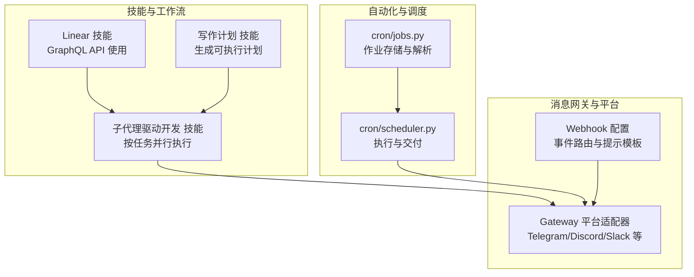
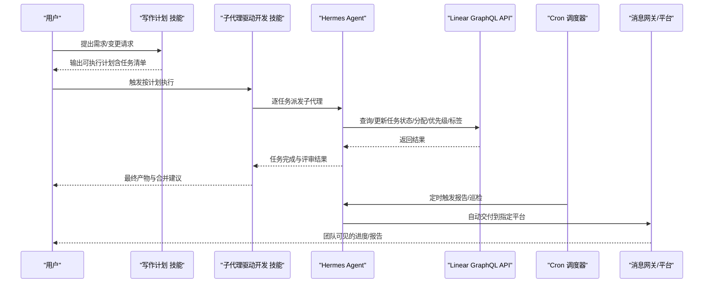
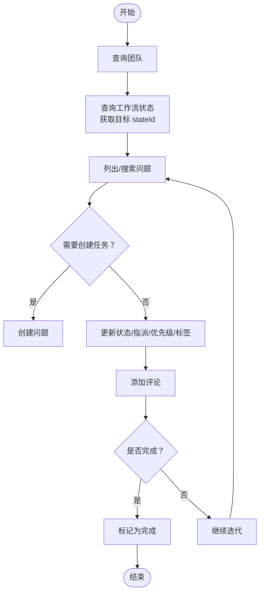
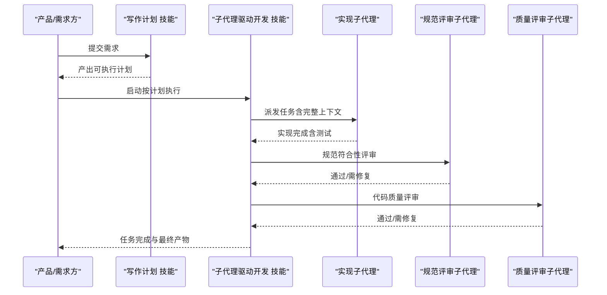
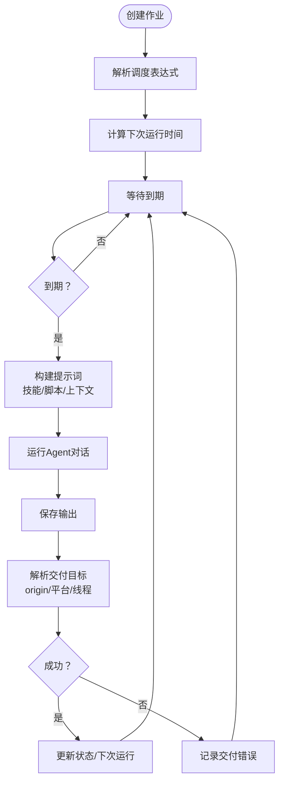
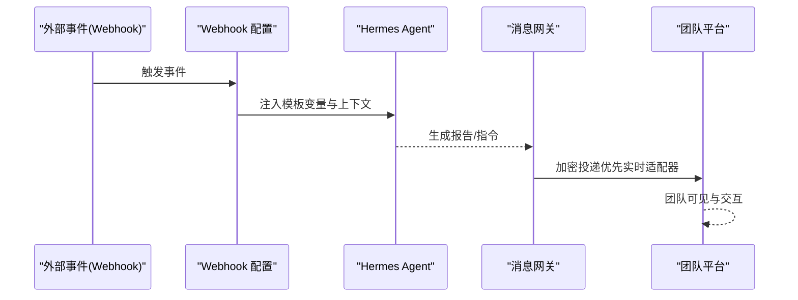
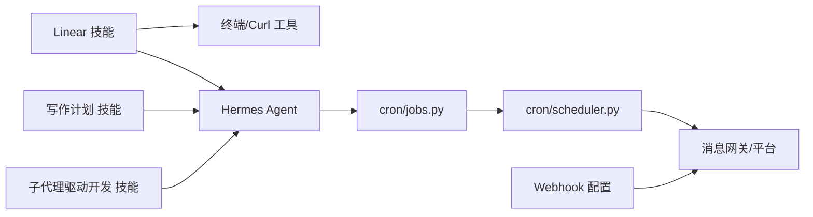

# 项目管理工具

<cite>
**本文引用的文件**
- [SKILL.md](file://skills/productivity/linear/SKILL.md)
- [README.md](file://README.md)
- [subagent-driven-development/SKILL.md](file://skills/software-development/subagent-driven-development/SKILL.md)
- [writing-plans/SKILL.md](file://skills/software-development/writing-plans/SKILL.md)
- [jobs.py](file://cron/jobs.py)
- [scheduler.py](file://cron/scheduler.py)
- [webhooks.md](file://website/docs/user-guide/messaging/webhooks.md)
- [index.html](file://landingpage/index.html)
</cite>

## 目录
1. [简介](#简介)
2. [项目结构](#项目结构)
3. [核心组件](#核心组件)
4. [架构总览](#架构总览)
5. [详细组件分析](#详细组件分析)
6. [依赖关系分析](#依赖关系分析)
7. [性能考虑](#性能考虑)
8. [故障排查指南](#故障排查指南)
9. [结论](#结论)
10. [附录](#附录)

## 简介
本文件面向Hermes Agent在Linear项目管理中的应用，系统化阐述如何通过技能与自动化能力，将Linear的敏捷开发工作流（任务创建、状态跟踪、团队协作、进度管理）与Hermes Agent的多平台消息网关、子代理并行执行、定时任务调度等能力结合，形成可落地的日常协作场景：需求管理、缺陷跟踪、发布流程自动化，并提供项目指标统计与团队效率分析思路及跨平台集成技巧。

## 项目结构
围绕Linear项目管理，本仓库中与之直接相关的关键位置如下：
- 技能层：skills/productivity/linear 提供Linear GraphQL API的调用指引与最佳实践
- 软件开发工作流：skills/software-development 下的“计划写作”“子代理驱动开发”等技能，支撑从需求到交付的端到端自动化
- 自动化与调度：cron 子系统提供任务编排、触发与交付
- 消息网关与跨平台：gateway 平台适配器支持Telegram、Discord、Slack等，便于将Linear状态变化与报告自动推送到团队频道
- 文档与站点：website/docs 与 landingpage 展示能力与特性

图示来源
- [SKILL.md:1-298](file://skills/productivity/linear/SKILL.md#L1-L298)
- [subagent-driven-development/SKILL.md:1-343](file://skills/software-development/subagent-driven-development/SKILL.md#L1-L343)
- [writing-plans/SKILL.md:1-297](file://skills/software-development/writing-plans/SKILL.md#L1-L297)
- [jobs.py:1-763](file://cron/jobs.py#L1-L763)
- [scheduler.py:1-800](file://cron/scheduler.py#L1-L800)
- [webhooks.md:76-123](file://website/docs/user-guide/messaging/webhooks.md#L76-L123)
- [index.html:470-506](file://landingpage/index.html#L470-L506)

章节来源
- [README.md:1-179](file://README.md#L1-L179)
- [SKILL.md:1-298](file://skills/productivity/linear/SKILL.md#L1-L298)

## 核心组件
- Linear 技能：提供Linear GraphQL API的查询与变更操作指引，覆盖团队、工作流状态、问题、项目、标签、成员等常用场景；强调使用终端工具与curl进行调用，避免浏览器抽取带来的复杂性。
- 计划与执行工作流：writing-plans 将需求转化为可执行的、粒度小的任务清单；subagent-driven-development 以“每个任务一个子代理 + 双阶段评审”的方式，确保质量与一致性。
- 定时任务与自动化：cron/jobs.py 解析多种调度格式（一次性、间隔、Cron表达式），持久化作业与输出；cron/scheduler.py 执行作业、注入上下文、自动交付到指定平台。
- 消息网关与Webhook：gateway 支持多平台即时交付；webhooks.md 提供事件路由、提示模板与动态变量，便于将外部事件（如PR、推送）转化为Hermes任务或报告。

章节来源
- [SKILL.md:1-298](file://skills/productivity/linear/SKILL.md#L1-L298)
- [subagent-driven-development/SKILL.md:1-343](file://skills/software-development/subagent-driven-development/SKILL.md#L1-L343)
- [writing-plans/SKILL.md:1-297](file://skills/software-development/writing-plans/SKILL.md#L1-L297)
- [jobs.py:117-204](file://cron/jobs.py#L117-L204)
- [scheduler.py:485-573](file://cron/scheduler.py#L485-L573)
- [webhooks.md:76-123](file://website/docs/user-guide/messaging/webhooks.md#L76-L123)

## 架构总览
下图展示从需求到交付的闭环：计划生成、任务拆分、子代理执行、评审与合并、状态同步至Linear、定时报告与事件驱动通知。

图示来源
- [writing-plans/SKILL.md:1-297](file://skills/software-development/writing-plans/SKILL.md#L1-L297)
- [subagent-driven-development/SKILL.md:1-343](file://skills/software-development/subagent-driven-development/SKILL.md#L1-L343)
- [SKILL.md:1-298](file://skills/productivity/linear/SKILL.md#L1-L298)
- [jobs.py:368-467](file://cron/jobs.py#L368-L467)
- [scheduler.py:575-800](file://cron/scheduler.py#L575-L800)

## 详细组件分析

### Linear 技能：GraphQL API 集成与工作流
- 基础设置与认证：通过环境变量提供API密钥，统一使用POST请求与JSON内容类型；支持短标识符与UUID两种ID形式。
- 工作流状态：理解WorkflowState的类型（triage/backlog/unstarted/started/completed/canceled），并以stateId为目标状态进行迁移。
- 常用查询与变更：当前用户、团队、工作流状态、问题列表/详情、搜索、过滤、项目、成员、标签；以及创建问题、更新状态、指派、设优先级、添加评论、设置截止日期、打标签、加入项目等。
- 分页与过滤：采用Relay风格游标分页，支持比较器与OR组合；合理使用first限制结果规模以控制复杂度。
- 典型工作流：先查询团队与工作流状态，再列出/搜索问题，随后创建与更新，最后添加评论与标记完成。
- 速率限制与注意事项：每小时请求数与复杂度点限制，监控剩余配额头；始终检查响应中的错误数组；描述字段支持Markdown；使用终端工具与curl调用。

图示来源
- [SKILL.md:274-282](file://skills/productivity/linear/SKILL.md#L274-L282)

章节来源
- [SKILL.md:19-298](file://skills/productivity/linear/SKILL.md#L19-L298)

### 计划与执行工作流：从需求到交付
- 写作计划（writing-plans）：将需求转化为结构化计划，明确目标、架构、技术栈、任务顺序与验证步骤；强调精确文件路径、完整代码示例、命令与预期输出、频繁提交。
- 子代理驱动开发（subagent-driven-development）：每个任务一个子代理，两阶段评审（规范符合性 → 代码质量），确保早期发现问题、减少累积缺陷；最终整合审查与提交。
- 与测试驱动开发（TDD）结合：实现前先写失败测试，再最小化实现并通过测试，最后提交。

图示来源
- [writing-plans/SKILL.md:64-202](file://skills/software-development/writing-plans/SKILL.md#L64-L202)
- [subagent-driven-development/SKILL.md:35-174](file://skills/software-development/subagent-driven-development/SKILL.md#L35-L174)

章节来源
- [writing-plans/SKILL.md:1-297](file://skills/software-development/writing-plans/SKILL.md#L1-L297)
- [subagent-driven-development/SKILL.md:1-343](file://skills/software-development/subagent-driven-development/SKILL.md#L1-L343)

### 定时任务与自动化：Cron 调度与交付
- 调度解析：支持“持续时间”（一次性）、“每隔N分钟”（间隔）、Cron表达式、ISO时间戳；自动计算下次运行时间，处理过期窗口与宽限期。
- 作业生命周期：创建、暂停/恢复、触发、删除；记录最近运行状态、错误与交付错误；到期自动清理。
- 执行与交付：构建提示词（可加载技能内容、注入脚本输出），在受控环境下运行Agent，自动交付到origin或指定平台，支持静默抑制与媒体附件转发。

图示来源
- [jobs.py:117-204](file://cron/jobs.py#L117-L204)
- [jobs.py:368-467](file://cron/jobs.py#L368-L467)
- [jobs.py:580-628](file://cron/jobs.py#L580-L628)
- [scheduler.py:485-573](file://cron/scheduler.py#L485-L573)
- [scheduler.py:575-800](file://cron/scheduler.py#L575-L800)

章节来源
- [jobs.py:1-763](file://cron/jobs.py#L1-L763)
- [scheduler.py:1-800](file://cron/scheduler.py#L1-L800)

### 消息网关与Webhook：事件驱动与跨平台集成
- Webhook路由：基于事件类型（如pull_request、push）与密钥，将外部事件转换为Hermes任务或报告；支持提示模板变量与原始负载注入。
- 平台交付：根据配置与环境变量解析目标平台与聊天ID，优先使用实时适配器（支持E2EE）进行加密投递，回退到独立发送路径。
- 站点特性：首页展示“定时自动化”“委托与并行”等能力，体现跨平台与无人值守运行特性。

图示来源
- [webhooks.md:76-123](file://website/docs/user-guide/messaging/webhooks.md#L76-L123)
- [scheduler.py:199-363](file://cron/scheduler.py#L199-L363)
- [index.html:470-506](file://landingpage/index.html#L470-L506)

章节来源
- [webhooks.md:76-123](file://website/docs/user-guide/messaging/webhooks.md#L76-L123)
- [scheduler.py:199-363](file://cron/scheduler.py#L199-L363)
- [index.html:470-506](file://landingpage/index.html#L470-L506)

## 依赖关系分析
- 技能与工具：Linear技能依赖终端工具与curl；计划与执行技能依赖Agent的子代理与工具集；Cron模块依赖配置与会话数据库。
- 平台与安全：消息网关对平台名称进行白名单校验，防止枚举；脚本执行路径在校验目录内，避免路径穿越；交付前对敏感信息进行脱敏。
- 事件与调度：Webhook配置决定事件到任务的映射；Cron调度器负责周期性任务的执行与交付。

图示来源
- [SKILL.md:1-298](file://skills/productivity/linear/SKILL.md#L1-L298)
- [writing-plans/SKILL.md:1-297](file://skills/software-development/writing-plans/SKILL.md#L1-L297)
- [subagent-driven-development/SKILL.md:1-343](file://skills/software-development/subagent-driven-development/SKILL.md#L1-L343)
- [jobs.py:1-763](file://cron/jobs.py#L1-L763)
- [scheduler.py:1-800](file://cron/scheduler.py#L1-L800)
- [webhooks.md:76-123](file://website/docs/user-guide/messaging/webhooks.md#L76-L123)

章节来源
- [jobs.py:1-763](file://cron/jobs.py#L1-L763)
- [scheduler.py:1-800](file://cron/scheduler.py#L1-L800)
- [webhooks.md:76-123](file://website/docs/user-guide/messaging/webhooks.md#L76-L123)

## 性能考虑
- API复杂度与分页：合理使用first限制结果规模，避免高复杂度查询；利用游标分页增量拉取，降低单次负载。
- 速率限制：监控请求配额与剩余头，避免触发限流；批量操作时增加节流与重试策略。
- 子代理并行：按任务拆分并行执行，缩短整体交付周期；但注意资源竞争与评审顺序，避免重复冲突。
- Cron执行：为长时间运行的作业设置不活动超时，防止卡死；对脚本执行设置超时与输出截断，避免阻塞。
- 交付优化：优先使用实时适配器进行加密投递，减少失败重试成本；媒体文件分离发送，提升传输稳定性。

## 故障排查指南
- Linear API错误：检查响应中的错误数组；确认认证头与内容类型；核对ID格式（UUID或短标识符）。
- Cron作业异常：查看作业状态与最近错误；检查脚本路径与权限；确认平台配置与环境变量；必要时启用静默模式抑制无内容报告。
- 交付失败：确认平台启用状态与聊天ID解析；检查实时适配器可用性与线程ID；查看交付错误日志并重试。
- Webhook路由：核对事件类型与密钥；检查提示模板变量是否存在缺失键；必要时使用__raw__注入完整负载。

章节来源
- [SKILL.md:291-298](file://skills/productivity/linear/SKILL.md#L291-L298)
- [jobs.py:580-628](file://cron/jobs.py#L580-L628)
- [scheduler.py:199-363](file://cron/scheduler.py#L199-L363)
- [webhooks.md:109-123](file://website/docs/user-guide/messaging/webhooks.md#L109-L123)

## 结论
通过Linear技能与软件开发工作流技能的组合，Hermes Agent能够将敏捷开发的“需求—计划—执行—评审—交付”闭环自动化；配合Cron调度与Webhook事件驱动，实现项目进度的自动追踪与团队协作的跨平台无缝衔接。遵循速率限制、分页与过滤的最佳实践，结合双阶段评审与定期报告，可显著提升团队效率与交付质量。

## 附录
- 快速上手：安装与设置后，使用hermes命令启动交互界面或网关；通过/skills浏览技能，/gateway启动平台连接。
- 能力概览：终端界面、多平台消息、学习回路、定时自动化、子代理并行、跨平台会话延续等。

章节来源
- [README.md:50-108](file://README.md#L50-L108)
- [index.html:470-506](file://landingpage/index.html#L470-L506)