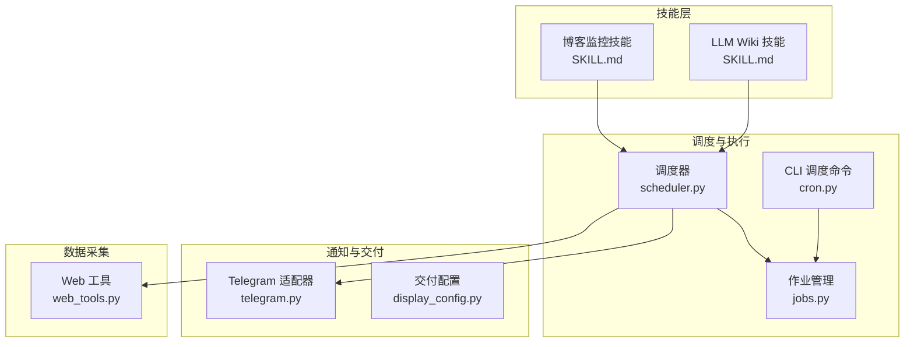
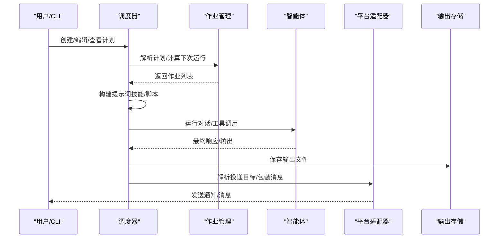
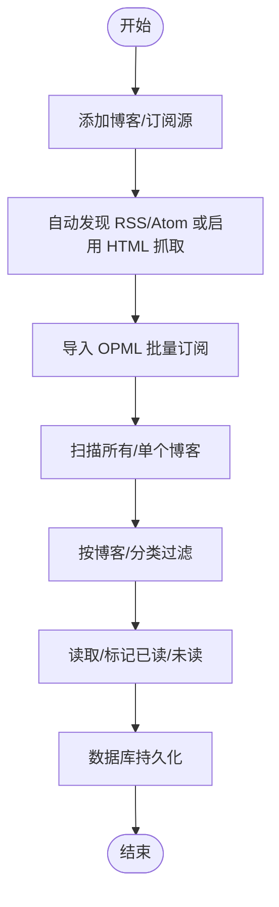
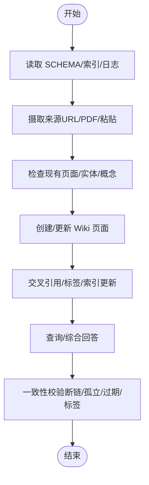
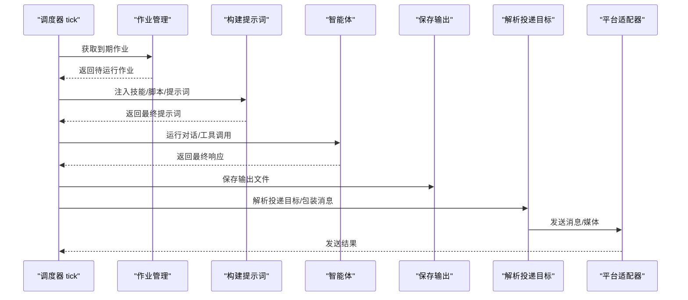
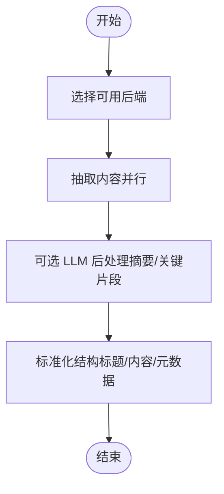
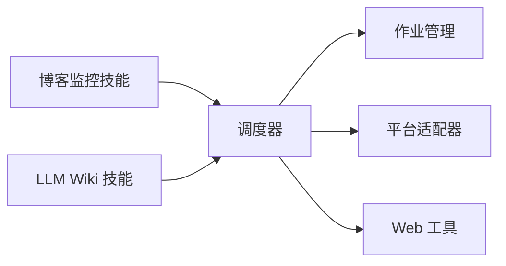

# 内容监控工具

<cite>
**本文档引用的文件**
- [SKILL.md（博客监控）](file://skills/research/blogwatcher/SKILL.md)
- [SKILL.md（LLM Wiki 知识库）](file://skills/research/llm-wiki/SKILL.md)
- [调度器（scheduler.py）](file://cron/scheduler.py)
- [作业管理（jobs.py）](file://cron/jobs.py)
- [CLI 调度命令（cron.py）](file://hermes_cli/cron.py)
- [Web 工具（web_tools.py）](file://tools/web_tools.py)
- [平台适配器（telegram.py）](file://gateway/platforms/telegram.py)
- [交付配置（display_config.py）](file://gateway/display_config.py)
- [测试：调度器（test_scheduler.py）](file://tests/cron/test_scheduler.py)
- [测试：作业管理（test_jobs.py）](file://tests/cron/test_jobs.py)
- [测试：集成（test_web_tools.py）](file://tests/integration/test_web_tools.py)
</cite>

## 目录
1. [简介](#简介)
2. [项目结构](#项目结构)
3. [核心组件](#核心组件)
4. [架构总览](#架构总览)
5. [详细组件分析](#详细组件分析)
6. [依赖关系分析](#依赖关系分析)
7. [性能考量](#性能考量)
8. [故障排查指南](#故障排查指南)
9. [结论](#结论)
10. [附录](#附录)

## 简介
本文件面向内容监控工具的使用者与维护者，系统性阐述两类核心能力：
- 博客与 RSS 订阅监控：基于外部工具对博客/订阅源进行扫描、去重与读取状态管理，并通过统一的调度与通知通道分发结果。
- LLM Wiki 知识库：以“三层结构”组织知识，支持来源采集、实体/概念/对比/查询页面的结构化维护与一致性校验，形成可沉淀、可检索、可跨页链接的知识网络。

同时，文档覆盖监控策略的配置方法（频率、过滤与告警）、通知机制（多平台投递、静默抑制、包装头尾等），并给出最佳实践建议，帮助建立稳定高效的信息收集与分析体系。

## 项目结构
围绕内容监控与知识管理的关键模块如下：
- 技能层
  - 博客监控技能：封装外部 CLI 工具，提供添加/扫描/分类/读取状态等操作。
  - LLM Wiki 技能：定义 Wiki 的三层结构、Schema、索引与日志模板，以及“摄取-查询-校验”的核心流程。
- 调度与执行
  - 调度器：周期性触发任务、构建提示词、运行智能体、保存输出、按策略投递。
  - 作业管理：作业持久化、计划解析、下次运行时间计算、重复次数控制、输出归档。
- 通知与交付
  - 平台适配器：统一消息发送接口，支持多种即时通讯平台。
  - 交付配置：平台级显示/交互策略与默认行为。
- 数据采集
  - Web 工具：统一的网页搜索/抽取接口，支持多后端与 LLM 后处理摘要，降低 Token 消耗。

**图表来源**
- [SKILL.md（博客监控）:1-137](file://skills/research/blogwatcher/SKILL.md#L1-L137)
- [SKILL.md（LLM Wiki 知识库）:1-461](file://skills/research/llm-wiki/SKILL.md#L1-L461)
- [调度器（scheduler.py）:1-800](file://cron/scheduler.py#L1-L800)
- [作业管理（jobs.py）:1-763](file://cron/jobs.py#L1-L763)
- [CLI 调度命令（cron.py）:1-200](file://hermes_cli/cron.py#L1-L200)
- [平台适配器（telegram.py）:1-200](file://gateway/platforms/telegram.py#L1-L200)
- [交付配置（display_config.py）:69-113](file://gateway/display_config.py#L69-L113)
- [Web 工具（web_tools.py）:1-200](file://tools/web_tools.py#L1-L200)

**章节来源**
- [调度器（scheduler.py）:1-800](file://cron/scheduler.py#L1-L800)
- [作业管理（jobs.py）:1-763](file://cron/jobs.py#L1-L763)
- [CLI 调度命令（cron.py）:1-200](file://hermes_cli/cron.py#L1-L200)
- [平台适配器（telegram.py）:1-200](file://gateway/platforms/telegram.py#L1-L200)
- [交付配置（display_config.py）:69-113](file://gateway/display_config.py#L69-L113)
- [Web 工具（web_tools.py）:1-200](file://tools/web_tools.py#L1-L200)

## 核心组件
- 博客监控技能
  - 基于外部 CLI 工具，支持自动发现 RSS/Atom、HTML 抓取回退、OPML 批量导入、未读文章管理与分类筛选。
  - 提供数据库持久化与环境变量配置项，便于在容器中挂载卷保持状态。
- LLM Wiki 技能
  - 定义三层知识结构：原始资料层、Wiki 页面层、Schema 层；提供初始化模板、索引与日志规范、页面阈值与更新策略。
  - 支持批量摄取、跨页交叉引用、一致性校验与过期内容审计。
- 调度与通知
  - 调度器负责解析计划、构建提示词（含技能加载与脚本注入）、运行智能体、保存输出、按策略投递到指定平台或原路返回。
  - 作业管理提供计划解析、下次运行时间推算、重复次数与完成状态跟踪、输出文件归档。
  - 平台适配器统一消息发送，支持 Markdown、媒体附件、线程话题等特性。
- 数据采集
  - Web 工具抽象多后端（Exa/Firecrawl/Parallel/Tavily），提供搜索、抽取、爬取能力，并可结合 LLM 进行内容摘要，降低 Token 使用。

**章节来源**
- [SKILL.md（博客监控）:1-137](file://skills/research/blogwatcher/SKILL.md#L1-L137)
- [SKILL.md（LLM Wiki 知识库）:1-461](file://skills/research/llm-wiki/SKILL.md#L1-L461)
- [调度器（scheduler.py）:1-800](file://cron/scheduler.py#L1-L800)
- [作业管理（jobs.py）:1-763](file://cron/jobs.py#L1-L763)
- [平台适配器（telegram.py）:1-200](file://gateway/platforms/telegram.py#L1-L200)
- [Web 工具（web_tools.py）:1-200](file://tools/web_tools.py#L1-L200)

## 架构总览
下图展示了从“计划触发”到“结果投递”的完整链路，以及与知识库摄取的衔接：

**图表来源**
- [调度器（scheduler.py）:485-800](file://cron/scheduler.py#L485-L800)
- [作业管理（jobs.py）:658-763](file://cron/jobs.py#L658-L763)
- [平台适配器（telegram.py）:1-200](file://gateway/platforms/telegram.py#L1-L200)

**章节来源**
- [调度器（scheduler.py）:485-800](file://cron/scheduler.py#L485-L800)
- [作业管理（jobs.py）:658-763](file://cron/jobs.py#L658-L763)
- [平台适配器（telegram.py）:1-200](file://gateway/platforms/telegram.py#L1-L200)

## 详细组件分析

### 组件A：博客监控技能（RSS/Atom 订阅管理）
- 功能要点
  - 自动发现 RSS/Atom 源，失败时可启用 HTML 抓取回退。
  - 支持 OPML 导入批量订阅，按博客/分类过滤文章。
  - 读取状态管理：标记已读/未读、一键清空已读。
  - 数据库存储与环境变量配置，便于容器化部署。
- 配置与使用
  - 二进制安装、Docker 运行与持久化存储方式见技能文档。
  - 常用命令涵盖添加/移除博客、扫描、列出未读文章、标记状态等。
- 与调度器的衔接
  - 可通过“预运行脚本”将扫描结果注入提示词，由智能体进行聚合与分析，再经调度器自动投递。

**图表来源**
- [SKILL.md（博客监控）:54-137](file://skills/research/blogwatcher/SKILL.md#L54-L137)

**章节来源**
- [SKILL.md（博客监控）:1-137](file://skills/research/blogwatcher/SKILL.md#L1-L137)

### 组件B：LLM Wiki 知识库（数据源整合与知识结构化）
- 结构与约定
  - 三层结构：原始资料层（不可变）、Wiki 页面层（可更新）、Schema 层（约束与标签体系）。
  - 初始化模板：SCHEMA.md、index.md、log.md，确保一致性与可追溯性。
- 核心流程
  - 摄取：从 URL/PDF/粘贴文本抓取为 Markdown，写入 raw/* 子目录。
  - 查询：先读索引定位相关页面，再综合合成回答，必要时落盘为比较/深度分析页面。
  - 校验：断链/孤立页/过期内容/标签合规/索引完整性等审计。
- 与调度器的衔接
  - 可通过“预运行脚本”注入外部数据（如博客扫描结果），由智能体进行跨源整合与结构化更新。

**图表来源**
- [SKILL.md（LLM Wiki 知识库）:81-461](file://skills/research/llm-wiki/SKILL.md#L81-L461)

**章节来源**
- [SKILL.md（LLM Wiki 知识库）:1-461](file://skills/research/llm-wiki/SKILL.md#L1-L461)

### 组件C：调度器与作业管理（监控策略与通知）
- 计划解析与运行
  - 支持一次性、间隔与 Cron 表达式三种计划格式；自动处理错过窗口的“快进”策略，避免重启后大量堆积。
  - 作业元数据包含提示词、技能、模型/提供商、脚本路径、投递目标等。
- 输出与投递
  - 保存输出到本地文件，支持静默标记抑制投递但保留审计记录；可包装 Cron 头尾信息，明确“不可回复”属性。
  - 解析投递目标（origin/平台/显式 chat_id/thread_id），优先使用运行中的适配器以支持端到端加密等特性。
- 测试验证
  - 静默抑制、脚本错误注入、包装头尾、线程话题传递等均有单元测试覆盖。

**图表来源**
- [调度器（scheduler.py）:575-800](file://cron/scheduler.py#L575-L800)
- [作业管理（jobs.py）:658-763](file://cron/jobs.py#L658-L763)
- [测试：调度器（test_scheduler.py）:964-1064](file://tests/cron/test_scheduler.py#L964-L1064)

**章节来源**
- [调度器（scheduler.py）:1-800](file://cron/scheduler.py#L1-L800)
- [作业管理（jobs.py）:1-763](file://cron/jobs.py#L1-L763)
- [测试：调度器（test_scheduler.py）:964-1064](file://tests/cron/test_scheduler.py#L964-L1064)

### 组件D：数据采集与内容提取（Web 工具）
- 后端选择与可用性
  - 支持 Exa/Firecrawl/Parallel/Tavily 四类后端，自动检测可用性并选择优先级最高的可用后端。
  - 提供调试模式与日志文件，便于问题定位。
- 内容抽取与摘要
  - 对 URL 列表进行并行抽取，返回结构化的标题/内容/元数据，可选 LLM 后处理生成 Markdown 摘要，显著降低后续分析的 Token 成本。
- 与监控的衔接
  - 可作为“预运行脚本”，将采集到的内容注入提示词，交由智能体进行结构化处理与知识整合。

**图表来源**
- [Web 工具（web_tools.py）:1-200](file://tools/web_tools.py#L1-L200)
- [测试：集成（test_web_tools.py）:268-300](file://tests/integration/test_web_tools.py#L268-L300)

**章节来源**
- [Web 工具（web_tools.py）:1-200](file://tools/web_tools.py#L1-L200)
- [测试：集成（test_web_tools.py）:268-300](file://tests/integration/test_web_tools.py#L268-L300)

## 依赖关系分析
- 组件耦合
  - 调度器与作业管理强耦合：前者依赖后者提供的计划解析、下次运行时间与输出归档。
  - 调度器与平台适配器弱耦合：通过统一的投递解析与发送接口解耦具体平台差异。
  - 技能与调度器松耦合：通过“技能加载”与“提示词注入”实现扩展。
- 外部依赖
  - Web 工具依赖多个第三方后端服务；平台适配器依赖各平台 SDK。
- 循环依赖
  - 代码层面未见循环导入；调度器与作业管理通过文件锁与原子写入保证并发安全。

**图表来源**
- [调度器（scheduler.py）:1-800](file://cron/scheduler.py#L1-L800)
- [作业管理（jobs.py）:1-763](file://cron/jobs.py#L1-L763)
- [平台适配器（telegram.py）:1-200](file://gateway/platforms/telegram.py#L1-L200)
- [Web 工具（web_tools.py）:1-200](file://tools/web_tools.py#L1-L200)
- [SKILL.md（博客监控）:1-137](file://skills/research/blogwatcher/SKILL.md#L1-L137)
- [SKILL.md（LLM Wiki 知识库）:1-461](file://skills/research/llm-wiki/SKILL.md#L1-L461)

**章节来源**
- [调度器（scheduler.py）:1-800](file://cron/scheduler.py#L1-L800)
- [作业管理（jobs.py）:1-763](file://cron/jobs.py#L1-L763)
- [平台适配器（telegram.py）:1-200](file://gateway/platforms/telegram.py#L1-L200)
- [Web 工具（web_tools.py）:1-200](file://tools/web_tools.py#L1-L200)

## 性能考量
- 计划与并发
  - 采用“快进”策略避免重启后的计划风暴；文件锁防止并发 tick。
  - 间隔/每日计划的宽限期按周期自适应，兼顾及时性与稳定性。
- 输出与存储
  - 输出文件按作业 ID 分目录、按时间戳命名，便于审计与清理。
- 网络与后端
  - Web 工具支持并行抽取与后端自动选择，减少等待时间；调试模式可定位瓶颈。
- 通知与带宽
  - 静默标记抑制无新内容时的投递，降低平台压力；包装头尾仅在需要时启用。

[本节为通用指导，无需特定文件引用]

## 故障排查指南
- 调度器与作业
  - 若出现“无到期作业”或“快进跳过”，检查计划格式与上次运行时间；确认 croniter 是否可用。
  - 输出未投递：检查投递目标解析、平台配置是否启用、线程 ID 是否丢失。
- 静默抑制与包装
  - 若希望抑制投递但保留审计，请在响应开头加入静默标记；注意静默不适用于失败场景。
  - 包装头尾仅在配置允许时生效，可在配置中关闭以获得“干净输出”。
- Web 工具
  - 后端不可用：检查对应 API Key/URL 环境变量；确认托管网关配置（如适用）。
  - 调试日志：开启调试模式后查看日志文件，定位请求/响应与压缩指标。
- 平台适配器
  - 端到端加密房间：优先使用运行中的适配器；若失败则回退到独立发送路径。
  - 线程话题：确保 deliver_extra 中包含 thread_id，否则可能丢失会话上下文。

**章节来源**
- [调度器（scheduler.py）:199-363](file://cron/scheduler.py#L199-L363)
- [作业管理（jobs.py）:658-763](file://cron/jobs.py#L658-L763)
- [测试：调度器（test_scheduler.py）:964-1064](file://tests/cron/test_scheduler.py#L964-L1064)
- [Web 工具（web_tools.py）:1-200](file://tools/web_tools.py#L1-L200)

## 结论
本工具体系以“技能 + 调度 + 交付 + 采集”为主线，既满足博客与订阅源的自动化监控，也支撑 LLM Wiki 的知识沉淀与结构化维护。通过可配置的计划、静默抑制、包装头尾与多平台投递，既能保证信息及时触达，又能避免噪声与资源浪费。配合 Web 工具的抽取与摘要能力，可进一步降低 Token 成本并提升分析效率。

[本节为总结性内容，无需特定文件引用]

## 附录

### 监控策略配置方法
- 计划类型
  - 一次性：使用“时长”或“时间戳”格式；适合一次性任务或演练。
  - 间隔：使用“每 X 分钟/小时/天”格式；适合高频轮询。
  - Cron：使用标准表达式；适合与系统时间对齐的任务。
- 投递目标
  - origin：回传至创建来源渠道。
  - 平台直发：如 telegram/discord 等，需配置 HOME_CHANNEL 环境变量。
  - 显式 chat_id/thread_id：通过“平台:chat_id”语法指定。
- 静默抑制
  - 在响应开头加入静默标记，即可抑制投递但保留审计输出。
- 包装头尾
  - 可在配置中关闭包装，以获得“干净输出”。

**章节来源**
- [调度器（scheduler.py）:77-158](file://cron/scheduler.py#L77-L158)
- [作业管理（jobs.py）:117-203](file://cron/jobs.py#L117-L203)
- [测试：调度器（test_scheduler.py）:964-1064](file://tests/cron/test_scheduler.py#L964-L1064)

### 内容监控最佳实践
- 计划设计
  - 高频任务建议使用“间隔”并设置合理宽限期；低频任务使用 Cron 表达式并与系统时间对齐。
  - 对于可能产生大量重复的通知，优先使用静默抑制与聚合策略。
- 过滤与告警
  - 在提示词中明确过滤规则（如分类/关键词），减少无关噪音。
  - 对异常场景（如脚本失败、平台不可用）单独标注并保留审计输出。
- 知识整合
  - 将外部采集结果注入 Wiki，遵循页面阈值与更新策略，避免碎片化与重复。
  - 定期执行一致性校验，修复断链与过期内容。

**章节来源**
- [调度器（scheduler.py）:485-573](file://cron/scheduler.py#L485-L573)
- [作业管理（jobs.py）:284-314](file://cron/jobs.py#L284-L314)
- [SKILL.md（LLM Wiki 知识库）:236-461](file://skills/research/llm-wiki/SKILL.md#L236-L461)